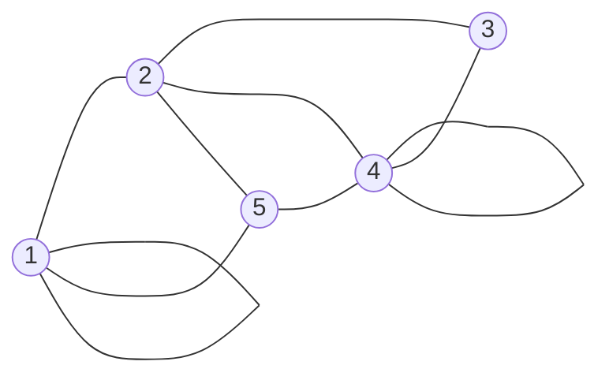
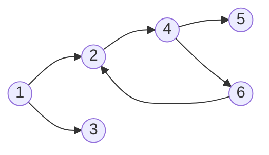
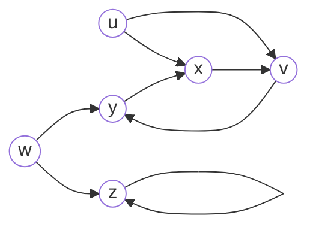
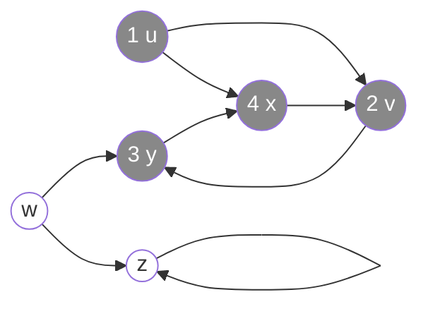
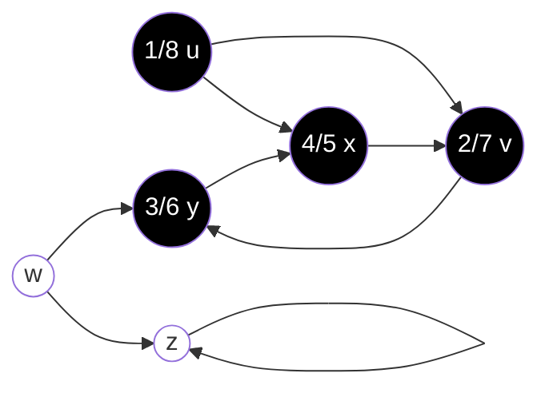
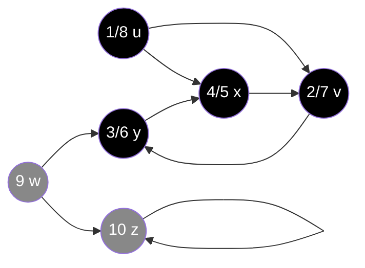
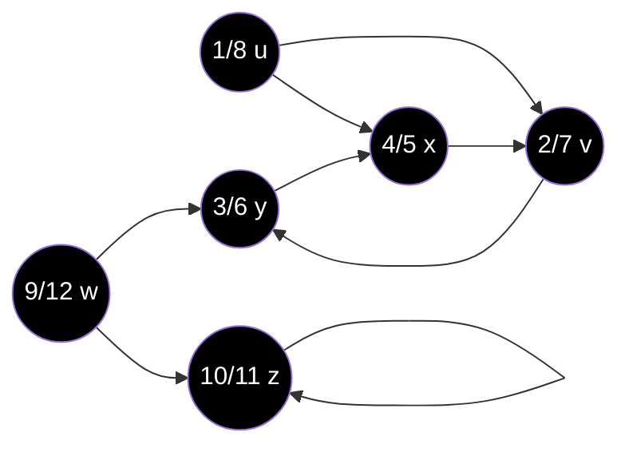

# ALGORITMI VISITA GRAFI

Ci sono due algoritmi di visita fondamentali, il **Breadth-First Search** *(visita in ampiezza)* e il **Depth-First Search** *(visita in profondità)*.

Prima di parlare di visita dei grafi, dobbiamo però capire come possono essere rappresentati in memoria.

## RAPPRESENTAZIONE GRAFI

Anche qui abbiamo 2 metodi principali, che funzionano sia per grafi orientati che non *(con le opportune modifiche)*:

1. Liste di adiacenza
   Abbiamo un array di liste in cui in ogni posizione identifichiamo un certo vertice del nostro grafo e la lista contiene i vertici collegati direttamente ad esso *(**non** contiene quindi un possibile cammino)*.
2. Matrice di adiacenza
   Matrice in cui righe e colonne sono rappresentate dai vertici; il collegamento è rappresentato alle intersezioni.

### LISTE DI ADIACENZA

Viene usata per rappresentazioni compatte per grafi sparsi.

Un grafo sparso è un grafo G = <V, E> t.c. |E| $\lt$ |V|2, ovvero un grafo che ha 'pochi' lati. Ovviamente per questo tipo di grafi conviene molto di più usare delle liste di adiacenza poiché in una matrice di adiacenza avremmo molte informazioni  riguardo a vertici non collegati *(spreco di spazio)*, mentre nelle liste avremmo solo le informazioni riguardanti i vertici collegati. La matrice offre però dei vantaggi a livello computazionale quando trattiamo grafi densi.

Le liste sono costituite da:

- Un array A di dimensione |V| di liste dinamiche
- Ogni casella *i* contiene la lista dei vertici collegati a *i*

#### VANTAGGI

Quanto spazio richiede una rappresentazione di questo tipo?

- Grafo orientato: per ogni lato ho una sola informazione *(A è collegato a B)* $\rightarrow$ $\sum length(L_{i})$  = |E|
- Grafo non orientato: per ogni lato ho due informazioni *(A è collegato a B e B è collegato ad A)* $\rightarrow$ $\sum length(L_{i})$ = 2 \* |E|

In entrambi i casi, spazio totale = **O(|V| + |E|)**.

Cosa succede se il grafo e pesato?
Posso avere una casella doppia che non solo mi dice chi è collegato a chi, ma anche il peso del lato. Non influisce asintoticamente sullo spazio.

#### SVANTAGGI

Tempi di esecuzione di ricerca di un vertice per vedere se è collegato ad un altro vertice. Se prendiamo un vertice collegato a tutti gli altri tranne che a quello che ci interessa dobbiamo scorrere tutta la lista.
Il tempo è quindi O(|V|).

### MATRICE DI ADIACENZA

Nella matrice abbiamo:

- I vertici numerati da 1 a |V|
- Matrice |V| \* |V| $\rightarrow$ boolean
- Spazio richiesto: $\Theta$(|V|2) **sempre**.
- A\[i\]\[j\] = $\begin{cases} 1 & se \space (i,\space j) \in E \\ 0 & altrimenti \end{cases}$
- Se il grafo è non orientato, avrò una matrice simmetrica *(A è collegato a B ma anche B è collegato ad A)*, per risparmiare spazio posso memorizzare solo la parte superiori alla diagonale principale.
- Se il grafo è orientato *(A è collegato a B, ma B potrebbe non essere collegato ad A)*, devo memorizzare tutta la matrice.
- Se il grafo è pesato uso una matrice di interi piuttosto che di booleani, in cui ogni valore implica che i lati siano collegati col suddetto peso, per i lati non collegati uso un valore specifico *(-1, $\infty$, Null, NIL ...)*

#### VANTAGGI

Tempo necessario per determinare se $\exist$ arco tra 2 vertici è costante.

#### SVANTAGGI

Lo spazio richiesto è sempre $\Theta$(|V|2).

### ESEMPIO

**LISTE:**
\[1\] $\rightarrow$ 1 $\rightarrow$ 2 $\rightarrow$ 5
\[2\] $\rightarrow$ 1 $\rightarrow$ 3 $\rightarrow$ 4 $\rightarrow$ 5
\[3\] $\rightarrow$ 2 $\rightarrow$ 4
\[4\] $\rightarrow$ 2 $\rightarrow$ 3 $\rightarrow$ 4 $\rightarrow$ 5
\[5\] $\rightarrow$ 1 $\rightarrow$ 2 $\rightarrow$ 4

**MATRICE:**
$\begin{bmatrix} 1 & 1 & 0 & 0 & 1 \\ 1 & 0 & 1 & 1 & 1 \\ 0 & 1 & 0 & 1 & 0 \\ 0 & 1 & 1 & 1 & 1 \\ 1 & 1 & 0 & 1 & 0 \end{bmatrix}$

Notiamo che è simmetrica, avremmo potuto memorizzarne solo metà poiché il grafo è non orientato.

## VISITA GRAFI

### DEPTH-FIRST SEARCH

Visita il grafo andando il più possibile in profondità prima di arretrare e provare un'altra strada.
Quindi fa una visita per cui:

- $\forall$ v $\in$ V visita il sotto-grafo in profondità.
- La DFS viene utilizzata quando bisogna analizzare **tutto** il grafo, anche le componenti separate, mentre la BFS visita solo una componente connessa.

Ipotizziamo di avere una lista di adiacenza.

Notiamo che se eseguiamo l'algoritmo "banalmente", visiteremo 1 $\rightarrow$ 2 $\rightarrow$ 4 $\rightarrow$ 5, poi torneremo indietro e visiteremo 6 $\rightarrow$ 2 $\rightarrow$ 4 $\rightarrow$ 5 e così di nuovo in un loop infinito.
Per evitare tale loop, dobbiamo segnarci in qualche modo quali vertici abbiamo già visitato, stando attenti ad evitare situazioni nelle quali potrei escludere un vertice *(ad esempio se 2 fosse collegato anche ad un altro vertice 7, lo escluderei se segnassi semplicemente che l'ho già visitato)*.

Avrò bisogno delle seguenti informazioni:

- Assegno un colore ad ogni vertice color\[u\]
  - White: ancora non scoperto
  - Grey: vertice scoperto ma non analizzato completamente
  - Black: vertice completamente analizzato

- Pr\[u\]: predecessore di *u* nella visita DFS, il vertice che mi ha portato ad *u*.
- d\[u\]: tempo in cui viene scoperto *u* *(tempo = passo nel quale scopro il vertice)*
- f\[u\]: tempo in cui finisce la visita in *u* *(ovviamente d\[u\] $\lt$ f\[u\])*

Un esempio:

Avremo che al tempo 1 scopriamo *u* che diventa grigio, al 2 *v* che diventa grigio, al 3 *y* che diventa grigio.

Ora sono in *x*, ma prima di incrementare il tempo noto che *v* è grigio, dunque per il momento non lo considero, ma noto anche che non ho altri cammini da seguire, dunque ho esplorato completamente un cammino.
Incremento quindi il tempo e segno f\[x\] = 5 e lo coloro di nero. Il controllo ritorna quindi al predecessore di *x*, ovvero *y*.
Noto che anche qui ho esplorato completamente il cammino, quindi segno f\[y\] = 6 e lo coloro di nero. Stessa cosa accade anche per *v* e *u*.

A questo punto mi sposto su *w* che è ancora bianco e imposto d\[w\] = 9 e lo coloro di grigio e inizio una nuova visita.
La visita mi dice che posso andare in *y*, che però è già nero e quindi non ha senso esplorare, quindi esploro *z* e imposto d\[z\] = 10 e lo coloro di grigio.

A questo punto da *z* posso tornare in *z*, ma è già grigio, noto che non ho altri lati uscenti e quindi lo coloro di nero e imposto f\[z\] = 11 e ritorno il controllo a p\[z\] = *w* che non avendo altri lati uscenti verrà colorato di nero impostando f\[w\] = 12.

A questo punto tutti i vertici sono neri e quindi ho esplorato completamente il grafo.

### ALGORITMO

DFS(G)
for v $\in$ V
	color(v) = white
	p\[v\] = NIL
time = 0

for v $\in$ V
	if color(v) == white
		DFS_Visit(G, v)

DFS_Visit(G, u)
time++
d\[u\] = time
color\[u\] = grey

for w $\in$ Adj\[u\]		*(Adj\[u\] = lista di adiacenza di u)*
	if color(w) == white
		p\[w] = u
		DFS_Visit(G, w)

color\[u\] = black
time++
f\[u\] = time

**TEMPI**
Sappiamo che il numero totale di elementi delle liste Adj = $\Theta$(|E|), per cui possiamo dire che il tempo totale della **DFS = $\Theta$(|V| + |E|)**.

### PROPRIETÀ

- **Teorema delle parentesi:** $\forall$ u, v $\in$ V, con A = \[d\[u\], f\[u\]\] e B = \[\d\[v\], f\[v\]\] gli **unici** casi possibili sono:
  - A $\cap$ B = $\empty$ *(B viene scoperto e finisce o prima o dopo A)*
  - A $\subseteq$ B o B $\subseteq$ A *(Uno dei due è contenuto nell'altro)*

- **Teorema del cammino bianco:** un vertice *v* è discendente di un vertice *u* SSE al momento della scoperta di *u*, il vertice *v* è raggiungibile tramite un cammino che contiene esclusivamente nodi bianchi *(questo teorema è un'applicazione del teorema delle parentesi)*.
- **Classificazione degli archi** in base al colore:
  - White: Tree-edge, arco appartentente alla foresta DFS, lati che portano a scoprire nuovi vertici.
  - Grey: Back-edge, archi che non appartengono alla foresta DFS, che vanno da un vertice *v* ad un antenato di *v* nell'albero DFS.
  - Black, vale solo per i grafi orientati:
    - Forward-edge, archi non appartenti alla foresta DFS che vanno da un vertice *u* ad un suo successore.
    - Cross-edge, tutti gli altri archi, posso identificarli guardando gli intervalli considerando il teorema delle parentesi.

#### APPLICAZIONI

- Grafo acicliclo? Lancio la DFS e controllo se ho ottenuto dei Back-edge.
- Quante componenti connesse ci sono? Basta contare quante volte viene avviata *(non chiamata)* la DFS_Visit.
- Ordinamento topologico: abbiamo in input un DAG, l'output sarà una lista ordinata e lineare dei vertici di G t.c. se G contiene l'arco (u, v), *u* precede *v*.

TopologicalSort(G)
DFS(G) *(fine visita $\forall$ v $\in$ V f\[v\])*
Ordina decrescente per f\[v\]
Output(ordine)