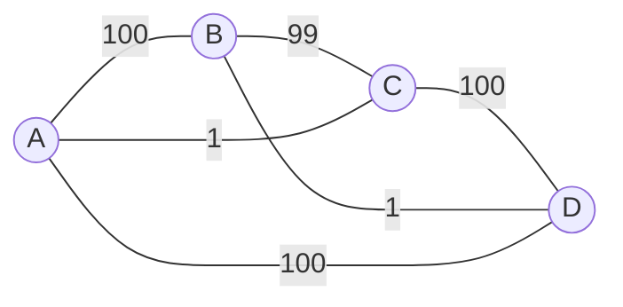
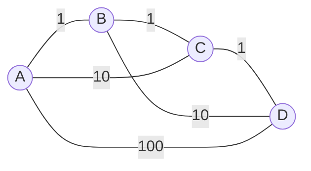
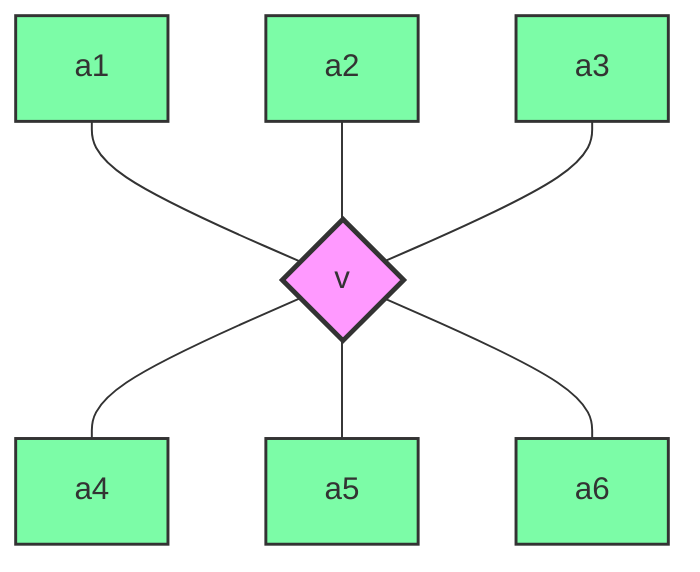
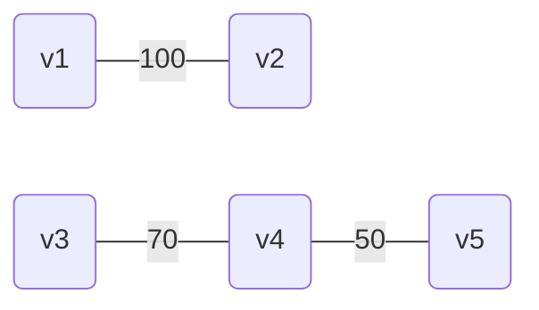

## TRAVELLING SALESMAN PROBLEM

#### Problema: G(V, E) completo e pesato sugli archi dove ogni arco ha un costo

Problema: Un viaggiatore deve visitare una e una sola volta ***n*** città dove vendere i suoi prodotti e vuole minimizzare il costo totale per fare il giro partendo dalla propria casa *(nodo A)*.

Vogliamo un giro *(ovvero una permutazione V' di V)* che:

- Passi una e una sola volta per ogni v ∈ V
- Abbia costo totale minimo

Soluzione greedy?
L'algoritmo greedy standard per questo problema potrebbe essere fatto in questo modo:

- $\forall$ v $\in$ V percorri l'arco con percorso minore per raggiungere un nodo non acora visitato

Vediamo un esempio considerato il seguente grafo:



In questo caso l'algoritmo, partendo dal nodo ***A***, percorebbe il percorso ***V' = A - C - B - D - A*** con peso ***W' = 1 + 99 + 1 + 100 = 201***.
Su questo grafo effettivamente l'algoritmo greedy ha fornito la soluzione ottimale.
Il problema tuttavia è che, scegliendo il miglior percorso locale, potremmo escludere alcuni percorsi che avrebbero invece migliorato la soluzione finale.

Vediamo un altro esempio con diversi pesi:



In questo caso l'algortimo greedy produrebbe un percorso ***V' = A - B - C - D - A*** con peso ***W' = 1 + 1 +1 + 100 = 103***, poiché abbiamo *"costretto"* l'algoritmo a percorrere il percorso con peso 100 da **D** verso **A**.
Notiamo però che se seguissimo invece il percorso ***V'' = A - B - D - C - A*** con peso ***W'' = 1 + 10 + 1 + 10 = 22*** otteremmo una soluzione migliore, cosa che ci fa notare come l'algoritmo greedy non vada bene per questo problema *(ricordiamo che basta un solo controesempio per stabilire che un algoritmo greedy non vada bene per un problema)*.

<div style="page-break-after: always;"></div>

## BANCONOTE

**Input: numero *n* intero positivo
Output: min n° di banconote per comporre *n* usando 20, 10, 5, 1 euro**

Greedy: prendo prima quelle grandi
Funziona? Si, perché prendo già quelle grandi subito

Ma se usassi banconote custom, tipo 12, 8, 1?
Esempio:

- Greedy:		 31: 2\*12 + 7\*1 &#8594; ***9***
- Non greedy: 31: 12 + 2\*8 + 3\*1 &#8594; ***6***

Non funziona

## BIN PACKING (non risolvibile in poco tempo)

##### O = {o1, o2 ... on} Oggetti

##### W = {w1, w2 ... wn} Pesi

##### Vogliamo usare il minimo numero di container di capacità L per trasportare tutti gli oggetti

Come può essere fatto un algoritmo greedy per questo problema?

- Ordino per peso in modo decrescente ***n log(n)***
- Inserisco dal più pesante al meno pesante ***n\*n***


***Esempio:***
W = {10, 9, 2, 1}
L = 11
***1°)*** = 10 + 1	***2°)*** = 9 + 2	&#8594; ***nr container = 2***
***Greedy OK***


W = {5, 5, 3, 3, 3, 3}
L = 11
***1°)*** = 5 + 5	 ***2°)*** = 3 + 3 + 3	***3°)*** = 3	&#8594; ***nr container = 3***
*Ma se facessi:* ***1°)*** = 5 + 3 + 3	 ***2°)*** = 5 + 3 + 3	&#8594; ***nr container = 2*** &#8594; *Soluzione migliore*
***Greedy not OK***


## GREEDY

##### Vantaggi:

- Facili da scrivere e progettare

##### Svantaggi:

- Difficili da dimostrare, non sempre la soluzione è la migliore
  Ci piacerebbe poter sapere se un problema sia adatto ad un algoritmo greedy ancor prima di scrivere l'algoritmo

#### Alcune considerazioni:

Avendo **<E, F>**	con 	**F ⊆ ℘(E)**		(praticamente F è l'insieme di *alcuni* dei sottoinsiemi di E)

Se vale
$$
\forall A \in F, \space B \subseteq A \rightarrow B \in F
$$
***Allora <E, F> è un sistema di indipendenza***


Prendiamo una funzione peso: w : E &#8594; ℝ<sup>+</sup>	possiamo estenderla a w : ℘(E) &#8594; ℝ<sup>+</sup>
$$
A \in F \space \space \space w(A) = \sum_{i\in A} w(ei)
$$
Come posso determinare **S** ∈ **F** t.c. **S** sia ***max/min w(s)***?

```pseudocode
S = insieme vuoto						/*ϴ[1]*/
Ordino(E)								/*ϴ[n log(n)]*/
for i = 1 to n							/*ϴ[n]*/
	if((S ⋃ ei) ∈ F)
		S = S ⋃ ei
Return S								/*ϴ[1]*/
```

***T(n)*** *= ϴ(1) + ϴ(n lg n) + ϴ(n) + ϴ(1) =* ***ϴ(n log(n))***


## MATROIDI

#### <E, F> è un matroide se:

1. ∀ **A** ∈ **F**, **B** ⊆ **A** &#8594; ***B*** *∈* ***F*** *(ovvero se è un sistema di indipendenza)*
2. **A**, **B** ∈ **F** t.c. *|B| = |A| + 1* &#8594; *∃ **b** ∈ (**B - A**) t.c. **A** ⋃ **{b}** ∈ **F***

In particolare, se abbiamo un matroide, qualunque funzione peso venga usata su una condizione del sistema di indipendenza ha l'algoritmo greedy standard in grado di dare la soluzione ottima.

### Teorema di Rado

**<E, F>** è un matroide **SSE** ∀ **w : E &#8594; ℝ<sup>+</sup>** *(anche estesa a ℘(E))* il greedy standard fornisce la soluzione ottima

***ATTENZIONE:*** se non ho un matroide **NON** significa che il greedy non funziona mai, ma solo che non funziona per tutte le funzioni peso! *(potrebbe dunque funzionare per alcune w : E &#8594; ℝ<sup>+</sup> )*


Esempio:

**<E, F>** **E** insieme finito	**F** = {A | A ⊆ E	e	|A| ≤ k}

1. ∀ A ∈ F		B ⊆ A &#8594; B ∈ F
   ***dimostrazione:***  *visto che B ⊆ A avrò*	|B| ≤ |A| ≤ k	&#8594;	|B| ≤ k	&#8594;	B ∈ F
2. A, B ∈ F     |B| = |A| + 1    &#8594;    ∃ b ∈ (B - A)    t.c.    A ⋃ {b} ∈ F
   ***dimostrazione:***  |B| ≤ k     |A| = |B| - 1    &#8594;   |A| ≤ k-1    &#8594;    |A| + 1 ≤ k    &#8594;    ∃ b ∈ B - A    t.c.   A u {b} ∈ F


## KNAPSACK

Abbiamo provato a risolvere knapsack col metodo standard ma non ci veniva in mente nulla, quindi intanto ci chiediamo: *ma knapsack è risolvibile?*
Si, perché se provo tutte le combinazioni ho la soluzione, però ci vuole un tempo esponenziale.

Proviamo a pensare ad un algoritmo più raffinato, ma trovo sempre un controesempio al mio algoritmo.
Scriviamo quindi un algoritmo di PD e otteniamo un tempo ***pseudo-polinomiale***.
Proviamo quindi con un algoritmo greedy; massimizzando il valore abbiamo visto che non otteniamo un ottimo, mentre massimizzando il rapporto *valore/peso* otteniamo una soluzione ottima per il knapsack frazionario, ma non per knapsack 0/1.
Proviamo quindi a capire se knapsack sia un matroide.

Consideriamo il problema knapsack seguente:

L = 70
V<sub>1</sub> = 10		P<sub>1</sub> = 50
V<sub>2</sub> = 20		P<sub>2</sub> = 30
V<sub>3</sub> = 15		P<sub>3</sub> = 40

Scriviamo knapsack come un sistema di indipendenza < O, F >
Ovviamente il massimo numero di elementi che posso prendere è 2<sup>n</sup>, che è esponenziale, voglio quindi controllare solo un certo numero di elementi *(sottoinsiemi)*.

I sottoinsiemi che ci interessa controllare sono quindi
F = { A $\subseteq$ O | $\sum\limits_{i \in A} p_{i} \leq L $ }	*insieme di oggetti che non sfondino lo zaino*

1. $\forall$ H $\in$ F ,  J $\subseteq$ H $\implies$ J $\in$ F?
   Si, se H $\in$ F $\implies$ somma pesi degli oggetti A $\in$ H è $\leq$ L
   Qualunque sottoinsieme di H ha peso totale $\leq$ H e quindi $\leq$ L.
È chiaro che se tolgo un oggetto ad un insieme con peso $\leq$ L il peso non potrà che diminuire.
   *(Il ragionamento deve essere generale, non basato su un esempio specifico, a meno che non si tratti di un controesempio)*

   **ATTENZIONE:** questa prima proprietà potrebbe sembrare banale ma non lo è *(banale = H $\in$ F per costruzione, controesempio F = insieme con numero di elementi pari, se tolgo un elemento ad H, H $\notin$ F)*
   **ATTENZIONE:** Un matroide soddisfa sia questa proprietà che la seconda, se non valesse questa prima non potremmo costruire la soluzione "pezzo per pezzo"
   
   
   
2. |B| = |A| + 1          $\forall$ A, B $\in$ F
   $\exist$ b $\in$ B - A    t.c.   A $\cup$ { b } $\in$ F ?

   Controesempio
   A = {1}	B = {2, 3}, A, B $\in$ F
   In B - A ho {2, 3}, ma se aggiungo uno dei due ad A sfondo lo zaino perché otterei peso rispettivamente 30 + 50 = 80 $\gt$ L e 40 + 50 = 90 $\gt$ L.
   Ottengo quindi che **non** posso tradurre knapsack in un matroide.
   Di conseguenza, il greedy non è valido per **qualsiasi** funzione peso di questo problema.

   **ATTENZIONE:** Il fatto che knapsack non possa essere tradotto in un matroide non significa che non funzioni nessun greedy su di esso, ma che non funziona con **qualsiasi** funzione peso, ovvero non restituisce l'ottimo considerando qualsiasi funzione peso.
   
   


## ESEMPI

### GRAFI CON VERTICE COMUNE

G = < V, E > non orientato
F = { A $\subseteq$ E | $\exist$ $\mathcal{v}$ $\in$ V	t.c.	ogni lato di A è incidente a $\mathcal{v}$ }
Assumiamo che $\empty$ $\in$ F



**ATTENZIONE:** Nel disegno sopra riportato gli elementi a1, ..., a6 denotano i ***lati***, non sono quindi dei vertici *(come invece lo è v)*.

1. $\forall$ H $\in$ F, J $\subseteq$ H è H tolto qualche lato *(eventualmente tutti se arriviamo a $\empty$)*
   J $\subseteq$ F perché il vertice in comune è lo stesso di H
   
2. |B| = |A| + 1          $\forall$ A, B $\in$ F          $\exist$ b $\in$ B - A    t.c.   A $\cup$ { b } $\in$ F ? No
   Controesempio:
   B = { <1, 2>, <2, 3>, <2, 4> } *(blu)*
   A = { <5, 6>, <6, 7> } *(verde)*
   *(I vertici comuni sono evidenziati in rosa e con un bordo più spesso)*
   
   A:
   
   ```mermaid
   graph LR
   5{{5}} --- 6{{6}} --- 7{{7}}
   
   style 6 fill:#f9f, stroke:#333, stroke-width: 2.5px
   style 5 fill:#7c4, stroke:#333, stroke-width: 1.5px
   style 7 fill:#7c4, stroke:#333, stroke-width: 1.5px
   ```
   
   B:
   
   ```mermaid
   graph LR
   1{{1}} --- 2{{2}} --- 3{{3}}
   2 --- 4{{4}}
   
   style 2 fill:#f9f, stroke:#333, stroke-width: 2.5px
   style 1 fill:#7cf, stroke:#333, stroke-width: 1.5px
   style 3 fill:#7cf, stroke:#333, stroke-width: 1.5px
   style 4 fill:#7cf, stroke:#333, stroke-width: 1.5px
   ```
   
   Qulunque lato io prenda da B, sarà sconesso da A e quindi non avrò più un vertice comune in A.
   Es. prendo il lato b = <1, 2>
   A $\cup$ { b }
   
   ```mermaid
   graph LR
   1{{1}} --- 2{{2}}
   5{{5}} --- 6{{6}} --- 7{{7}}
   
   style 1 fill:#7cf, stroke:#333, stroke-width: 1.5px
   style 2 fill:#7cf, stroke:#333, stroke-width: 1.5px
   style 5 fill:#7c4, stroke:#333, stroke-width: 1.5px
   style 7 fill:#7c4, stroke:#333, stroke-width: 1.5px
   style 6 fill:#7c4, stroke:#333, stroke-width: 1.5px
   
   ```
   
   Il seguente grafo non ha più nessun vertice in comune e di conseguenza non appartiene più a F.
   
   

### GRAFI PESATI

G = < V, E > con lati pesati
Sappiamo che non è un matroide, però il teorema di Rado ci dice che non vanno bene tutte le funzioni peso, alcune però potrebbero comunque funzionare.

Dare l'algoritmo greedy standard per ottenere il massimo peso di lati con vertice in comune

Consideriamo la seguente funzione peso per ogni lato E: w : E  $\rightarrow$ $\mathbb{R^{+}}$

Greedy_peso(G, W)
	S = $\empty$
	Sort(lati in base al peso)	$\rightarrow$	l<sub>1</sub>, l<sub>2</sub>, l<sub>3</sub>	*(ordino i lati)*
	S = S $\cup$ { l<sub>1</sub> }	*(metto subito il lato che pesa di più)*
	While (not secondo)	*(finché non ha individuato il secondo lato)*
		if l<sub>i</sub> compatibile	*(compatibile = collegato con uno dei due vertici di l<sub>1</sub>)*
			S = S $\cup$ { l<sub>i</sub> }
			secondo = true
			vertice_comune = vertice	*(individuo il vertice in comune tra l<sub>i</sub> ed l<sub>1</sub>)*
		i++

​	For j = i + 1 to n
​		if l<sub>j</sub> ha un vertice = vertice_comune
​			S = S $\cup$ { l<sub>j</sub> }

Ci chiediamo dunque se questo algoritmo ci dia sempre la risposta al nostro problema.

Ipotizziamo che il lato più pesante sia isolato dagli altri, ma che gli altri complessivamente pesino di più.



Notiamo che il lato più pesante pesa 100, ma i lati <v3, v4> e <v4, v5> complessivamente pesano 120 $\gt$ 100.

<div style="page-break-after: always;"></div>

### INSIEMI MULTIPLI

Consideriamo:
E<sub>3</sub> insieme di multipli di 3 $\leq$ 100
E<sub>4</sub> insieme di multipli di 4 $\leq$ 100
E<sub>5</sub> insieme di multipli di 7 $\leq$ 100

Abbiamo E = E<sub>3</sub> $\cup$ E<sub>4</sub> $\cup$ E<sub>7</sub>

Consideriamo F = {A	t.c.	A $\subseteq$ E, |A $\cap$ E<sub>3</sub>| $\leq$ 1 AND |A $\cap$ E<sub>4</sub>| $\leq$ 1 AND |A $\cap$ E<sub>4</sub>| $\leq$ 1 AND $\forall$ a $\in$ A se a $\in$ E<sub>i</sub> $\implies$ a $\notin$ E<sub>j</sub> con i, j $\in$ {3, 4, 7} e i $\neq$ j}
Ovvero, consideriamo i sottoinsiemi che contengono al più un elemento di E<sub>3</sub>, al più uno di E<sub>4</sub> e al più uno di E<sub>7</sub> senza però prendere multipli sia di uno che degli altri.

Vogliamo stabilire se <E, F> sia un matroide o meno:

1. $\forall$ H $\in$ F ,  J $\subseteq$ H $\implies$ J $\in$ F ?
   Se tolgo qualsiasi elemento da H , avrò comunque ***al più*** un elemento di ogni E<sub>i</sub>, di conseguenza j $\in$ F. Quindi sì, <E, F> è un sistema di indipendenza.
2.  |B| = |A| + 1          $\forall$ A, B $\in$ F
   $\exist$ b $\in$ B - A    t.c.   A $\cup$ { b } $\in$ F ?
   Sappiamo che la cardinalità massima è 3, quindi |B| = 3 e |A| = 2
   Sappiamo inoltre che se B ha 3 elementi, saranno uno per ogni E<sub>i</sub>, dunque ci sarà sempre un elemento b in B - A che aggiunto ad A risulterà appartenente ad F.
   Discorso analogo vale per |B| = 2 e |A| = 1


### INTERI POSITIVI

Sia S l'insieme dei primi mille interi positivi e sia I = {A	t.c.	A $\subseteq$ S e |A| $\leq$ 5}.	È un matroide?

1. $\forall$ H $\in$ F ,  J $\subseteq$ H $\implies$ J $\in$ F ?
   Se tolgo un qualsiasi elemento da H, avrò comunque un numero di elementi $\leq$ 5, dunque è sicuramente un sistema di indipendenza.
2.  |B| = |A| + 1          $\forall$ A, B $\in$ F
   $\exist$ b $\in$ B - A    t.c.   A $\cup$ { b } $\in$ F ?
   Preso un insieme da I che quindi ha una quantità di numeri $\leq$ 5, se ne prendo uno di dimensione minore ovviamente posso trovarci un numero da aggiungere a questo secondo insieme per far si che appartenga ancora ad F.


### INTERI POSITIVI ALTERNATIVO

Sia S l'insieme dei primi mille interi positivi e sia I = {A	t.c.	A $\subseteq$ S e $\sum \limits_{a \in A} a = 0\space(mod \space 3)$ *(ovvero ottengo un multiplo di 3)*}.	È un matroide?

1. $\forall$ H $\in$ F ,  J $\subseteq$ H $\implies$ J $\in$ F ?
   Prendiamo per esempio H = {2, 3, 4} e j = {2} $\subseteq$ A, notiamo subito che j $\notin$ F, dunque questo non è un sistema di indipendenza e, di conseguenza, sicuramente non è un matroide.
   *(Potremmo fermarci tranquillamente qui affermando che il teorema di Rado non è applicabile)*
2. |B| = |A| + 1          $\forall$ A, B $\in$ F
   $\exist$ b $\in$ B - A    t.c.   A $\cup$ { b } $\in$ F ?
   Prendiamo B = {2, 3, 7} e A = {3, 6}
   Notiamo che possiamo prendere solo 2 e 7 da aggiungere ad A, ma in entrambi casi avremo A $\cup$ b $\notin$ F.


### INSIEME CON 1, 2, 3, 4

Prendiamo E = {1, ..., 100} ed F = famiglia di insiemi con esattamente un elemento $\in$ {1, 2, 3, 4}.	È un matroide?

1. $\forall$ H $\in$ F ,  J $\subseteq$ H $\implies$ J $\in$ F ?
   H = {x} $\cup$ {non x} dove x $\in$ {1, 2, 3, 4}
   J = A - {non x} $\in$ F *(se tolgo un elemento non x, J conterrà comunque un elemento $\in$ {1, 2, 3, 4})*
   J' = A - {x} $\notin$ F *(se tolgo x, ovviamente J non conterrà più un elemento $\in$ {1, 2, 3, 4})*
2. |B| = |A| + 1          $\forall$ A, B $\in$ F
   $\exist$ b $\in$ B - A    t.c.   A $\cup$ { b } $\in$ F ?
   In questo caso, visto che B contiene un elemento in più di A ed entrambi appartengono ad F, entrambi hanno un elemento $\in$ {1, 2, 3, 4}, dunque esiste sempre un elemento b che unito ad A apparterrà ad F.
   Consideriamo y $\notin$ {1, 2, 3, 4}, A potrebbe non avere alcun elemento y, ma B deve averlo per forza in quanto ha un elemento in più di A, dunque posso sempre aggiungere questo y ad A.

