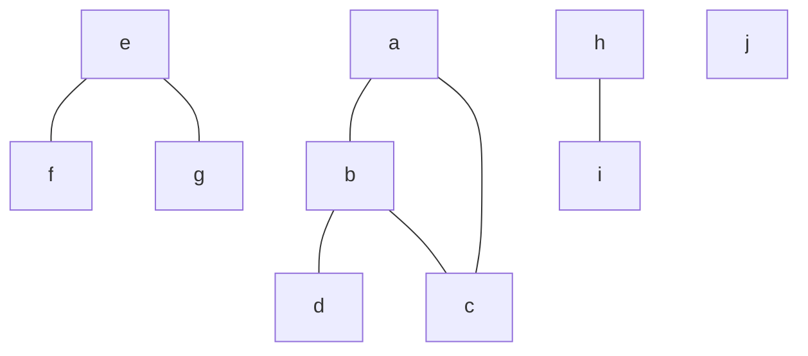
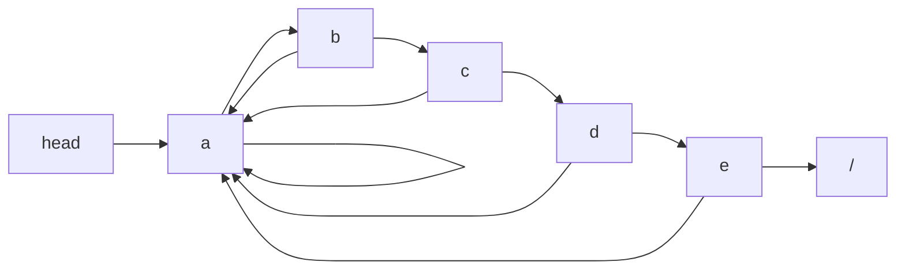
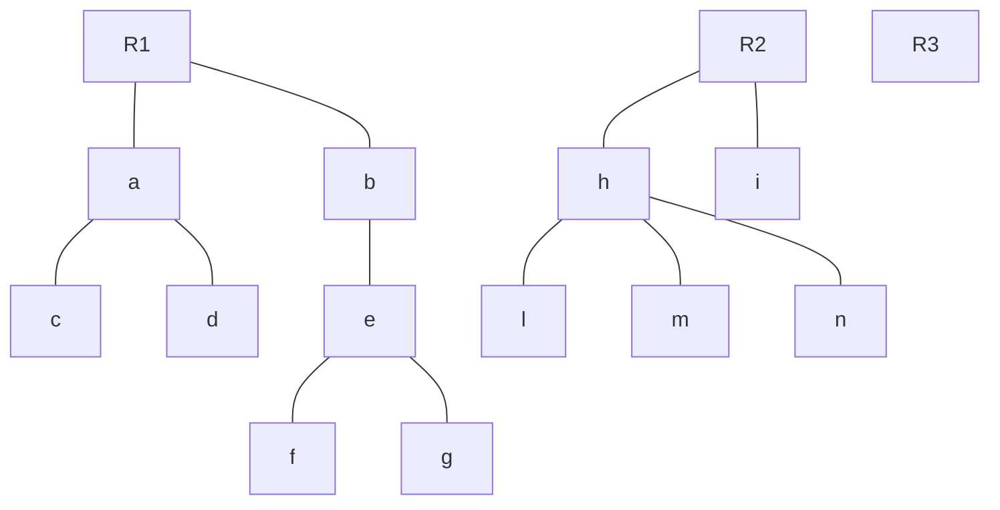
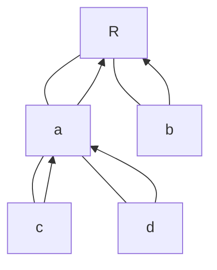
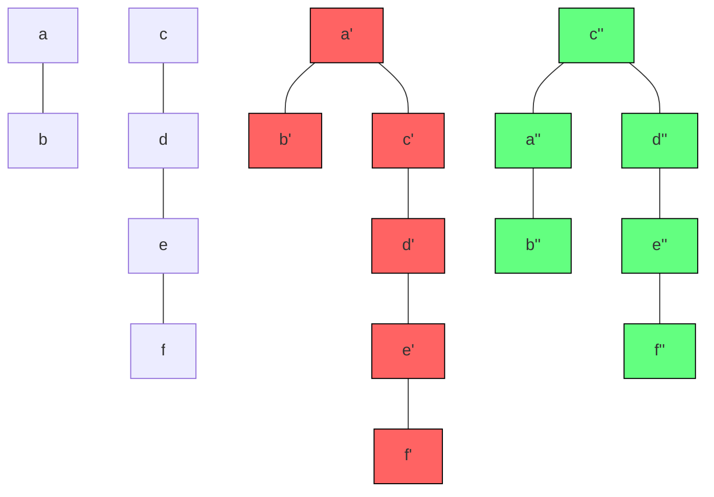
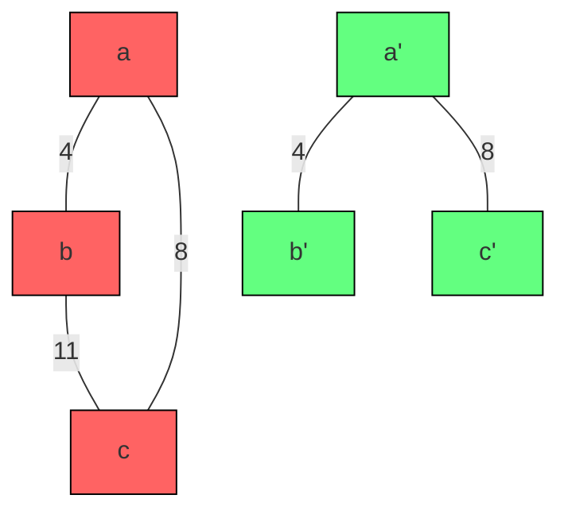

# STRUTTURE DATI INSIEMI DISGIUNTI

Abbiamo un insieme di oggetti e vogliamo raggrupparli in dei sottoinsiemi disgiunti *(con intersezione vuota)*.

Operazioni:

- makeSet(x) prende un elemento x e crea un insieme contente solo x e lo elegge, essendo l'unico elemento, a rappresentante dell'insieme.
- union(x, y) prende due elementi di due insiemi diversi e restituisce come risultato l'unione dell'insieme di appartenenza di x con l'insieme di appartenenza di y. Il nuovo rappresentante tipicamente viene eletto sulla base del rappresentante di x o di y *(ma non è ovviamente un obbligo)*.
- findSet(x) prende l'elemento x e restituisce il rappresentante dell'insieme al quale appartiene x *(se il rappresentante è x stesso, restituirà x ovviamente)*.

Questo tipo di operazioni ci possono aiutare anche per quanto riguarda i grafi.
Vediamo il seguente esempio:



Vogliamo scrivere un algoritmo che sia in grado di determinare le ***componenti connesse*** di un grafo lavorando con insiemi disgiunti.

**ATTENZIONE:** Le componenti sono tali anche se i nodi non sono direttamente connessi tra loro, basta che esista un cammino che li unisca.
*Per esempio **f** e **g** appartengono alla stessa componente poiché esiste un cammino che li collega.*

Connected_Components(G){
for all v $\in$ V				*(per tutti i vertici del nostro grafo di partenza)*
	makeSet(v)			*(creiamo un insieme)*

for (v<sub>i</sub>, v<sub>j</sub>) $\in$ E			*(per ogni lato appartenente al nostro grafo di partenza)*
	if findSet(v<sub>i</sub>) $\neq$ findSet(v<sub>j</sub>)
		union(v<sub>i</sub>, v<sub>j</sub>)	*(se i due elementi appartengono a due insiemi diversi, li unisco)*

Raggruppo così tutti i nodi tali che siano collegati da un cammino.
Ho creato così le mie componenti connesse.

Vediamo come funziona:
Inizialmente avremo i nostri vertici ai quali assoceremo una makeSet per ognuno:
*(l'elemento in grassetto è il rappresentante)*
{**a**} {**b**} {**c**} {**d**} {**e**} {**f**} {**g**} {**h**} {**i**} {**j**}

A questo punto elaboriamo tutti i lati del nostro grafo:
(b, d) (e, g) (a, c) (h, i) (a, b) (e, f) (b, c) *(non ci interessa l'ordine)*

(b, d)	$\rightarrow$	{**b**, d} {**a**} {**c**} {**e**} {**f**} {**g**} {**h**} {**i**} {**j**}
(e, g)	$\rightarrow$	{**e**, g} {**b**, d} {**a**} {**c**} {**f**} {**h**} {**i**} {**j**}
(a, c)	$\rightarrow$	{**a**, c} {**e**, g} {**b**, d} {**f**} {**h**} {**i**} {**j**}
(h, i)	$\rightarrow$	{**h**, i} {**a**, c} {**e**, g} {**b**, d} {**f**} {**j**}
(a, b)	$\rightarrow$	{**a**, c, b, d} {**h**, i} {**e**, g} {**f**} {**j**}
(e, f)	$\rightarrow$	{**a**, c, b, d} {**h**, i} {**e**, g, f} {**j**}
(b, c)	$\rightarrow$	Il rappresentante di b è lo stesso di c, quindi la union non viene fatta.

Osserviamo quindi che le nostre componenti connesse corrispondono ai nodi collegati del nostro grafo di partenza.

Ci chiediamo quindi quale sia la struttura dati più adeguata a memorizzare questo tipo di informazioni. Certamente ci serve una struttura flessibile, dinamica.

<div style="page-break-after: always;"></div>

## LISTE CONCATENATE

Ipotizziamo che ogni insieme corrisponda ad una lista, di cui il primo elemento è il rappresentante.
Per poter ottimizzare l'operazione *findSet*, useremo una lista doppiamente connessa e faremo in modo che ogni elemento abbia un puntatore, non all'elemento precedente, ma al ***primo elemento***, così posso sapere subito chi è il rappresentante di ogni elemento.
Ad ogni elemento saranno associati quindi tre valori; il puntatore al rappresentante, il valore stesso e il puntatore next.
\[***rappresentante***\]\[elemento\]\[***next***\]



Da notare il cappio attorno al primo elemento, che come rappresentante ha sé stesso.

Ci va tutto bene finché non vogliamo fare la union, poiché significherebbe scorrere una delle due liste fino in fondo per unirla all'altra *(operazione troppo costosa)*.
È utile quindi avere un puntatore ***tail*** che identifichi l'ultimo elemento della lista, in questo caso la union 'attacca' una delle due liste alla tail dell'altra, cancellando l'head della seconda e il tail della prima, facendo diventare il tail della seconda il nuovo tail.

Sono ora pronto ad implementare le mie operazioni in tempi brevi.
In particolare:

- makeSet(x) creo una lista con un solo elemento con ***tail*** e ***rappresentante*** che puntino a x stesso e con ***next*** che punta a null.
  Il tempo sarà quindi $\Theta(1)$
- findSet(x) mi basta consultare il puntatore ***rappresentante***.
  Il tempo sarà quindi $\Theta(1)$
- union(x, y) pongo tail<sub>x</sub>.next() = head<sub>y</sub>, head<sub>y</sub> = null e tail<sub>x</sub> = tail<sub>y</sub>
  Abbiamo sorvolato un dettaglio importante però; dopo aver fatto ciò, dobbiamo sistemare i rappresentanti della seconda lista, dunque ripercorrerla tutta.
  Il tempo sarà quindi $O(n)$ *(non è sempre n, potrebbe andarmi bene e avere un solo elemento nella seconda lista)*.

Mi sorge una domanda quindi; ***riesco ad ottimizzare i tempi della union?***
Osserviamo che ci conviene certamente 'attaccare' la lista più corta a quella più grande, in modo da sistemare meno puntatori. Il problema è sapere il numero di elementi di ogni lista *(contarli richiederebbe **$\Theta(n)$**)*.

Definiamo
n = numero totale di operazioni makeSet
m = numero totale di makeSet + union + findSet

Sappiamo che le union sono al massimo n - 1 *(dopo di ché avremo un solo insieme)*.

Osserviamo che un algoritmo che sfrutti queste operazioni in modo ***ragionevole*** *(non faccia ad esempio findSet a vuoto)* avrà sicuramente un tempo massimo m = $\Theta$(n<sup>2</sup>).
In generale avremo n makeSet e n - 1 union *(per le quali comunque saranno necessarie **alcune** findSet, ma sappiamo che la findSet ha tempo costante)*.

#### EURISTICA DELL'UNIONE PESATA

Ogni lista conterrà anche un attributo con la sua lunghezza.
Union: la lista più corta viene aggiunta a quella più lunga.

Si può far vedere che usando l'euristica dell'unione pesata possiamo ottenere un risultato di questo tipo:
m operazioni (makeSet + union + findSet) possono essere fatte in O(m + n log n).

Consideriamo un elemento *x* generico, vogliamo calcolare quante volte viene aggiornato il suo ***rappresentante*** nel caso peggiore.
1° volta $\rightarrow$ Insieme risultate ha almeno 2 elementi
2° volta $\rightarrow$ Insieme risultante ha almeno 4 elementi *(altrimenti non rispetterei l'euristica)*
3° volta $\rightarrow$ Insieme risultante ha almeno 8 elementi
i° volta $\rightarrow$ Insieme risultante ha almeno 2<sup>i</sup> elementi

Il che significa che il massimo numero di aggiornamenti sono log n *(per un singolo elemento x)*. In totale, avendo n elementi, avrò n \* log n aggiornamenti.

Dunque il tempo totale sarà O(m + n \* log n).

<div style="page-break-after: always; break-after: page;"></div>

## FORESTE

Proviamo ad usare un'altra struttura dati per memorizzare gli insiemi disgiunti, le foreste, ovvero ***alberi radicati*** *(uno per ogni sottoinsieme)* poiché presentano alcuni vantaggi.

Possiamo far sì che la radice sia il rappresentante. *(Nessuno mi impone che gli alberi siano binari)*.



Facciamo sì che ogni nodo inoltre punti al proprio padre, il che ci evita di aggiornare tutti i rappresentanti.



Questo potevamo farlo anche con le liste ovviamente, ma le liste, potendo essere molto lunghe, avrebbero richiesto molto tempo per risalire sui puntatori, mentre in una foresta la distanza per trovare il rappresentante sarà certamente più corta.

#### OPERAZIONI

- makeSet(x) $\rightarrow$ un albero con un solo nodo, semplice. Avrà un puntatore a sé stesso *(oppure a NIL)*.
  Non perdiamo nulla in termini di tempo, T(n) = $\Theta$(1).
- findSet(x) $\rightarrow$ basta seguire i puntatori verso i padri fino ad ottenere il puntatore cappio del rappresentante.
  Il tempo generalmente sarà migliore della findSet sulle liste, ma nel caso peggiore, ovvero quello nel quale ogni sotto-albero ha un solo figlio, richiederà un tempo T(n) = O(n).
- union(x, y) $\rightarrow$ bisogna unire due alberi, posso semplicemente far diventare il rappresentante di uno dei due un figlio del rappresentante dell'altro, come nel seguente esempio *(non ho rappresentato i puntatori per semplificare il disegno)*.
  Notiamo subito così che il rappresentante di tutti i nodi viene implicitamente aggiornato in quanto il puntatore al quale si fermeranno ora *d* ed *e* è quello di *a'*.

```mermaid
graph TD
a --- b & c
+((U))
d --- e
=((=))
a' --- b' & c' & d'
d' --- e'
```

Notiamo che l'unione in sé non richiede molto tempo, ma sappiamo che la union è influenzata dalla findSet, dunque possiamo dire che miglioriamo di molto il tempo della union ma la 'paghiamo' in termini di findSet.

#### EURISTICA UNIONE PER RANGO

L'idea è di fare in modo di unire un albero 'corto' in subordine alla radice di uno lungo piuttosto che il contrario e questo per mantenere l'altezza dell'albero più corta possibile.

Consideriamo il seguente esempio con due alberi di altezza 1 e 3, notiamo che se unissimo in subordine l'albero più lungo a quello più corto, allungheremo il cammino massimo fino al rappresentante arrivando ad aver un altezza di 4 *(albero rosso)*, mentre se unissimo in subordine l'albero più corto a quello più lungo, l'altezza massima rimarrebbe comunque 3 *(albero verde)*.



Procedimento:
Ad ogni nodo è associato un rango, ovvero il limite superiore per l'altezza del nodo, vale a dire il numero di archi del cammino più lungo fra sé ed una foglia.
Ad esempio il rango di *c''* è 3 *(c'' - d'' - e'' - f'')*, quello di *d''* 2 e così via.
Per fare la union quindi mi conviene attaccare un nodo con rango minore ad uno con rango maggiore piuttosto che il contrario, in mondo che la findSet avrà sempre un tempo O(massimo rango).

**OPERAZIONI**

- makeSet(x):
  P(x) = x	*(P = Parent)*
  Rank(x) = 0

- findSet(x):
  Ci chiediamo se possiamo migliorare qualcosa e pensiamo, visto che 'perdiamo tempo' a scorrere l'albero, possiamo modificarlo intanto per migliorare le findSet future *(come nell'esempio sottostante)*?

  ```mermaid
  graph TD
  a --- b --- c --- d
  a' --- b' & c' & d'
  
  style a fill:#ff6363, stroke:#000
  style b fill:#ff6363, stroke:#000
  style c fill:#ff6363, stroke:#000
  style d fill:#ff6363, stroke:#000
  style a' fill:#63ff80, stroke:#000
  style b' fill:#63ff80, stroke:#000
  style c' fill:#63ff80, stroke:#000
  style d' fill:#63ff80, stroke:#000
  ```

  Una cosa del genere è facilmente implementabile come segue:
  findSet(x)
     if x $\neq$ P(x)						*(non è il rappresentante)*
        P(x) = findSet(P(x))	  *(vorrei che il parent fosse direttamente il rappresentante)*
  Return P(x)

  In questo modo ad ogni nodo viene assegnato come parent il rappresentante del proprio parent e questo permette di scorrere l'albero e di modificarlo nel mentre per ottenere una struttura che migliorerà le chiamate findSet future *(tramite quella che viene chiamata **compressione dei cammini**)*.

- union(x, y):
  ***link(findSet(x), findSet(y))*** *(chiamo la link con i rappresentati di x e y)*
  
  ***link(x, y)***
  if rank(x) > rank(y)
  	P(y) = x
  else
  	P(x) = y
if rank(x) == rank(y)
  	rank(y)++
  
  Notiamo inoltre che i ranghi non cambiano nel caso uno dei due ranghi sia strettamente maggiore dell'altro.
  Ma se i due nodi *x* e *y* hanno rango uguale, devo aumentare di 1 il rango del ramo che risulterà più lungo.

Vediamo ora i tempi:
Si può far vedere che l'unione per rango porta ad un tempo **O(m \* log n)**.
Se ci aggiungo questa nuova tipologia di findSet con la compressione dei cammini posso ottenere un tempo **O(m \* $\alpha$(m, n))** *(con $\alpha$ $\leq$ 4, una funzione che cresce lentamente; sostanzialmente diventa (quasi) lineare rispetto al numero di operazioni (m, n) eseguite, non ci addentriamo troppo)*, un tempo lineare certamente migliore di m \* log n e migliore delle tempistiche che otteniamo con le liste.

Questo ci dice che è questa la miglior struttura dati per gli insiemi disgiunti.

<div style="page-break-after: always;"></div>

## APPLICAZIONE - ALGORITMO DI KRUSKAL

Algoritmo goloso usato per determinare il Minimum Spanning Tree.
Dato un grafo G = <V, E> pesato *(sui lati)*, connesso e non orientato.
Vogliamo determinare:
T $\subseteq$ E	t.c.	permetta di determinare G' = <V, T> che sia aciclico, connesso e con peso minimo.
Esempio semplice:



Osserviamo come abbiamo tagliato il lato di peso 11 che collegava b e c ottenendo comunque un grafo connesso ma aciclico e con il minor peso possibile. Vogliamo 'tagliare' i cicli in modo da ottenere un grafo di peso minimo. Abbiamo detto che è un algoritmo greedy.

Generic MST(G, w)
	A = $\empty$
	while A non è MST
		Trova arco (u, v) da aggiungere
		A = A $\cup$ {(u, v)}
	Return A

Il problema è quindi scegliere un arco da aggiungere.
Definiamo un ***arco sicuro***: Un arco è sicuro se unito ad A, A continua a essere sottoinsieme di un qualche MST.

Kuskal ci dice che:

- A è una foresta $\rightarrow$ vertici sono presi da G.
- Ad ogni passo aggiunge un arco sicuro z = (u, v) ad A.
- z è un arco di peso minimo che collega due componenti distinte *(in modo da evitare i cicli)* ed è quindi certamente un algoritmo greedy.
  Si può dimostrare inoltre che l'arco di peso minimo che collega due componenti distinte è certamente un arco sicuro.

MST(G, w)
A = $\empty$
for all v $\in$ V
   makeSet(v)			$O(|V|)$

E' = sort(w(E))	*(ordino i lati in base al peso)*	$O(|E| \space ln|E|)$ *(per esempio con una merge sort)*
	$\forall$ (u, v) $\in$ E'
		if findSet(u) $\neq$ findSet(v)	$O(|E| * \alpha)$
			A = A $\cup$ {(u, v)}
			union(u, v)

Return A


Analizziamo quindi i tempi:
Sappiamo che le makeSet impiegano tempo 1, dunque avremo O(|V| \* 1).
L'ordinamento sappiamo che impiega n \* log n, dunque avremo O(|E| \* log |E|).
Abbiamo poi visto circa i tempi della findSet e sappiamo che dipende dal numero di lati, quindi avremo O(|E| \* $\alpha$).

Abbiamo quindi T(|V|, |E|) = c + O(|E| \* log |E|) + O(m \* $\alpha$) = c + O(|E| \* log |E|) + O((|V| +|E|) \* $\alpha$)
Si può far vedere che $\alpha$ $\leq$ log |V|. Poiché G è connesso |E| $\geq$ |V| - 1
Semplificando quindi posso scrivere T(|V|, |E|) = c + O(|E| \* log|E|) + O(|E| \* log|E|) = O(|E| \* log|E|).