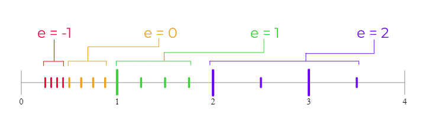
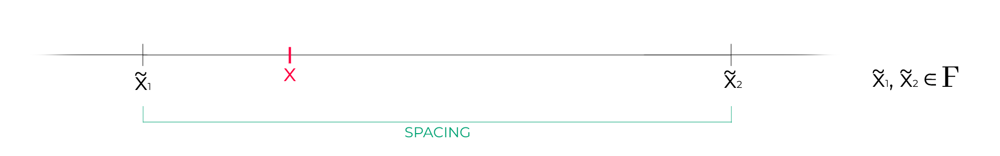

[TOC]


<div style="page-break-after: always;"></div>

# NOTAZIONE POSIZIONALE

Prima di parlare di floating point parliamo di **notazione posizionale**; per quanto riguarda la base 10 la notazione posizionale funziona come segue:
Il numero $171.23$ lo possiamo scrivere come $1 \sdot 10^2 + 7 \sdot 10^1 + 1 \sdot 10^0 + 2\sdot 10^{-1} + 3 \sdot 10^{-2}$.

In generale un numero $(a_n\ a_{n-1}\ ...\ a_0.\ a_{-1}\ a_{-2}\ ... )$ può essere scritto anche come $\sum\limits_m a_m \sdot \beta^m$ con $\beta$ base e $a_i \leq \beta -1$.

Sappiamo inoltre che i **numeri irrazionali** sono tutti quei numeri che hanno espansione infinita dopo la virgola *(ad esempio $\sqrt 2$ e $\pi$)*.
Esistono però anche i **numeri razionali** che hanno espansione finita oppure espansione infinita periodica *(ad esempio $1/3 = 0.\bar3$)*.

Chiaramente però lo stesso $1/3$ in base 3 ha espansione finita, infatti, in base 3 $1/3 = 3^{-1}$.

In generale i numeri razionali $p/q$ *(ridotti ai minimi termini)* hanno espansione finita in base $\beta$ se i fattori primi di $q$ dividono la base $\beta$.
Ad esempio $0.1 = 1/10$ non ha espansione finita in base 2 in quanto i divisori di $q = 10$, ovvero $2$ e $5$, non dividono tutti la base 2 *(5 non divide 2)*.


## FLOATING POINT

I numeri floating point sono un insieme $F = (\beta, T, U, L)$ con

- $\beta$ base
- $T$ mantissa
- $U$ Upper Bound
- $L$ Lower Bound

fatto come segue
$F = \{0\} \cup \{\sigma \sdot (0.\ a_1\ a_2\ ...\ a_T)_{\beta} \sdot \beta^e \}$						con

- $\sigma$ segno, ovvero $\sigma = \pm 1$
- $a_i$ sono cifre tali che $0 \leq a_i \leq \beta -1$
- $e$ è l'esponente tale che $L \leq e \leq U$

*Esempio:*
Se prendiamo $\beta = 2$, $T = 3$, $U = 2$, $L = -1$ possiamo scrivere numeri del tipo
$+(0.111)_2\sdot 2^{-1}$,			$-(0.101)_2 \sdot 2^2$,			$+(0.100)_2 \sdot 2^0$

Notiamo in particolare che $1 = 2^0$, che scritto nell'insieme preso di esempio va scritto come $(0.100) \sdot 2^1$, ma possiamo scriverlo anche come $(0.010) \sdot 2^2$.
Tuttavia, se fissiamo la convenzione che $a_1 \neq 0$ non abbiamo più il problema posto precedentemente, in quanto non potremmo più scrivere $(0.010) \sdot 2^2$ e abbiamo così un modo unico per scrivere ogni numero.

I numeri del tipo $(0.\ a_1\ ...)_\beta$ con $a_1 \neq 0$ si dicono **numeri normalizzati**.


### NUMERI NEI CALCOLATORI

I numeri nei calcolatori sono scelti con $\beta = 2$,	$T = 53$,	$U = 1024$	ed	$L = -1021$ 

Notiamo che per memorizzare questi numeri abbiamo bisogno di:

- Per $\sigma$ necessitiamo di 1 bit
- Per $a_1\ ...\ a_{53}$ necessitiamo di 52 bit *($a_1$ in base 2 con la convenzione di prima vale sempre $1$)*
- Per l'esponente dobbiamo memorizzare tutti i numeri da $1024$ a $-1021$, ovvero circa $2048 = 2^{11}$ *(i bit rimanenti sono designati per altre funzioni)*.
  Quindi per l'esponente abbiamo bisogno di $11$ bit.

In totale quindi abbiamo bisogno di $1 + 52 + 11 = 64$ bit.


Osserviamo un esempio con $\beta = 10$,	$T = 3$,	$U,L$ arbitrari
Notiamo che $10 =(0.100) \sdot 10^2 \in F(10,3,U,L)$ e $0.001 = (0.100) \sdot 10^{-2} \in F(10,3,U,L)$
Tuttavia la loro somma non sta in $F(10,3,U,L)$ poiché avrei bisogno di una mantissa maggiore, difatti $10.001 = (0.10001) \sdot 10^2$

In generale l'insieme $F(\beta, T, U, L)$ NON è chiuso rispetto alle operazioni elementari.

In particolare notiamo che nei calcolatori il massimo numero rappresentabile è $2^{1023}$ *($2^{1023} = 0.1_2 \sdot 2^{1025}$)*, mentre il minor numero rappresentabile è $2^{-1022}$ *(poiché $0.1_2 \sdot 2^{-1021} = 2^{-1} \sdot 2^{-1021} = 2^{-1022} $)*. 

Tuttavia, per esempio su Matlab, è possibile rappresentare qualche numero in più sfruttando alcuni bit che normalmente sono designati ad altre funzioni usando i cosiddetti ***numeri de-normalizzati*** *(in cui la prima cifra può essere anche 0)*.
Di conseguenza, il minor numero rappresentabile diventa $(0.\ 0\ ...\ 1)_2 \sdot 2^{-1021} = 2^{-53} \sdot 2^{-1021} = 2^{-1074}$.
Da notare però che questi numeri extra di norma non fanno parte dell'insieme $F$ e vanno trattati in modo speciale.


#### STRUTTURA DI $F(\beta,T,U,L)$

Dato un valore $x$ da *approssimare* $\tilde x$ si hanno due modi per calcolare l'errore di approssimazione:

1. **ERRORE ASSOLUTO**: $|x - \tilde x|$
   Restituisce un valore grande per misure grandi ed un valore piccolo per misure piccole, ma non fornisce un'idea chiara di cosa stia succendendo.
2. **ERRORE RELATIVO**: $\frac{|x - \tilde x|}{|x|}$
   Restituisce un valore che ci fornisce informazioni sull'entità dell'errore.

 <div style="page-break-after: always;"></div>

*Esempio*: $F(2,3,2,-1) \cup \{0\}$
L'elemento più piccolo è $0.100_2 \sdot 2^{-1} = 1/2 \sdot 2^{-1} = 1/4$

Scriviamo ora l'elenco dei numeri in $F$

Per $e = -1$
$(0.100)_2 \sdot 2^{-1} = (1 \sdot 1/2 + 0 \sdot 1/4 + 0 \sdot 1/8) \sdot 2^{-1} = 4/16$
$(0.101)_2 \sdot 2^{-1} = (1\sdot 1/2 + 0 \sdot 1/4 + 1 \sdot 1/8) \sdot 2^{-1} = 5/16$
$(0.110)_2 \sdot 2^{-1} = (1 \sdot 1/2 + 1 \sdot 1/4 + 0 \sdot 1/8) \sdot 2^{-1} = 6/16$
$(0.111)_2 \sdot 2^{-1} = (1\sdot 1/2 + 1 \sdot 1/4 + 1 \sdot 1/8) \sdot 2^{-1} = 7/16$

Per $e = 0$
$(0.100)_2 \sdot 2^0 = (1 \sdot 1/2 + 0 \sdot 1/4 + 0 \sdot 1/8) \sdot 2^0 = 4/8$
$(0.101)_2 \sdot 2^8 = (1 \sdot 1/2 + 0 \sdot 1/4 + 1 \sdot 1/8) \sdot 2^0 = 5/8$
$(0.110)_2 \sdot 2^8 = (1 \sdot 1/2 + 1 \sdot 1/4 + 0 \sdot 1/8) \sdot 2^0 = 6/8$
$(0.111)_2 \sdot 2^8 = (1 \sdot 1/2 + 1 \sdot 1/4 + 1 \sdot 1/8) \sdot 2^0 = 7/8$

Per $e = 1$
$(0.100)_2 \sdot 2^1 = (1 \sdot 1/2 + 0 \sdot 1/4 + 0 \sdot 1/8) \sdot 2^1 = 4/4$
$(0.101)_2 \sdot 2^1 = (1 \sdot 1/2 + 0 \sdot 1/4 + 1 \sdot 1/8) \sdot 2^1 = 5/4$
$(0.110)_2 \sdot 2^1 = (1 \sdot 1/2 + 1 \sdot 1/4 + 0 \sdot 1/8) \sdot 2^1 = 6/4$
$(0.111)_2 \sdot 2^1 = (1 \sdot 1/2 + 1 \sdot 1/4 + 1 \sdot 1/8) \sdot 2^1 = 7/4$

Per $e = 2$
$(0.100)_2 \sdot 2^2 = (1 \sdot 1/2 + 0 \sdot 1/4 + 0 \sdot 1/8) \sdot 2^2 = 4/2$
$(0.101)_2 \sdot 2^2 = (1 \sdot 1/2 + 0 \sdot 1/4 + 1 \sdot 1/8) \sdot 2^2 = 5/2$
$(0.110)_2 \sdot 2^2 = (1 \sdot 1/2 + 1 \sdot 1/4 + 0 \sdot 1/8) \sdot 2^2 = 6/2$
$(0.111)_2 \sdot 2^2 = (1 \sdot 1/2 + 1 \sdot 1/4 + 1 \sdot 1/8) \sdot 2^2 = 7/2$

Quindi $F(2,3,2,-1) \cup \{0\} = \{0, \frac{4}{16}, \frac{5}{16}, \frac{6}{16}, \frac{7}{16}, \frac{4}{8}, \frac{5}{8}, \frac{6}{8}, \frac{7}{8}, \frac{4}{4}, \frac{5}{4}, \frac{6}{4},\frac{7}{4}, \frac{4}{2}, \frac{5}{2}, \frac{6}{2}, \frac{7}{2}\}$

Osserviamo ora questi numeri sulla retta dei numeri


Notiamo che i numeri più piccoli sono anche più vicini tra loro, in particolare i primi numeri sono distanziati di $1/16$, i secondi di $1/8$, i terzi di $1/4$ e i quarti di $1/2$; l'insieme quindi è molto più **denso** verso i numeri piccoli. Quindi abbiamo lo stesso numero di punti in ciascun intervallo e la distanza tra un punto ed il successivo raddoppia ad ogni intervallo.

<div style="page-break-after: always;"></div>


#### SPACING

Possiamo ora introdurre lo **spacing**, definito come la distanza tra due numeri consecutivi nello spazio $F$. Chiaramente lo spacing NON È costante.

Notiamo che in $[\frac{1}{4}, \frac{1}{2}]$ lo spacing è pari a $(0.001)_2 \sdot 2^{-1} = 2^{-3} \sdot 2^{-1} = 2^{-4}$
In $[\frac{1}{2}, 1]$ è $(0.010)_2 \sdot 2^{-1} = 2^{-3}$
In $[1, 2]$ è $(0.100)_2 \sdot 2^{-1} = 2^{-2}$
In $[2, 4]$ è $(1.000)_2 \sdot 2^{-1} = 2^{-1}$

In generale su $F(\beta, T,U,L)$ lo spacing su un intervallo $[\beta^p, \beta^{p+1}]$ è pari a $\beta^{-T} \sdot \beta^{p+1} = \beta^{p+1-T}$

Prendiamo ora lo spazio $F(2,53,1024,-1021)$ e chiediamoci quando lo spacing è pari a $1$:
Ovvero ci chiediamo quando $2^{p+1-53} = 1 = 2^0$, ovvero quando $p+1-53 = 0 \implies p=52$

Dunque lo spacing vale $1$ nello spazio macchina nell'intervallo $[2^{52}, 2^{53}]$

Questa particolarità dei numeri floating point si focalizza sull'errore relativo: avendo una densità maggiore per intervalli minori possiamo ottimizzare l'errore relativo.


#### ROUNDOFF UNIT

Supponiamo di avere un numero reale $x \in \R$ e di volerlo rappresentare su una macchina, quindi con $F(2,53,1023,-1021)$ e di avere il seguente scenario



Siamo quindi nello scenario in cui $x$ non ha rappresentazione finita nella base *(ad esempio $0.1$ per la base 2)*, quindi dobbiamo approssimare $x$ col numero floating point più vicino. Chiaramente nell'esempio rappresentato sopra $x$ viene approssimato col punto $\tilde x_1$.

In generale, dato $x \in \R$, denotiamo con $fl(x)$ il numero floating point più vicino ad $x$.

Osserviamo ora

- Errore assoluto: $|x - fl(x)| \leq \frac{1}{2} \sdot spacing$			$spacing = \beta^{p+1-T}$
  Sicuramente il massimo che potrà distare un'approssimazione di $x$ da $x$ stesso è pari a metà dello spacing al quale è soggetto $x$.

  Notiamo che se $x$ è un numero molto grande, l'errore assoluto sarà grande a sua volta in quanto maggiorato da $\beta^{p+1-T}$. Quindi l'errore assoluto dipende da $x$.

- Errore relativo: $\frac{|x-fl(x)|}{|x|}$
  Notiamo che $x$ è compreso tra $\beta^p$ e $\beta^{p+1}$ e quindi sicuramente $\frac{1}{|x|} \leq \frac{1}{\beta^p}$, quindi
  $\frac{|x-fl(x)|}{|x|} \leq \frac{\frac{1}{2}\beta^{p+1-T}}{\beta^p} \leq\frac{1}{2} \beta^{1-T}$

  Notiamo subito che l'errore relativo non dipende da $x$ *(e quindi neanche dal segmento $p$)*.

La quantità $\frac{1}{2} \beta^{1-T}$ si dice **ROUNDOFF UNIT**, denotata anche con $u$.

In matlab, con $\beta = 2$ e $T = 53$, abbiamo $u = \frac{1}{2}2^{1-53} = 2^{-1+1-53} = 2^{-53} \approx 10^{-16}$


#### OPERAZIONI

Introduciamo la notazione $\frac{fl(x)-x}{x} = |\epsilon_x| \leq u$
Possiamo quindi riscrivere $fl(x) = x + x\epsilon_x = (1+\epsilon_x) x$

Abbiamo osservato in precedenza che, dati $x, y \in F$, non necessariamente $x+y \in F$, di conseguenza anche dati $x, y \in \R$ con $fl(x), fl(y) \in F$ non è detto che $fl(x)+fl(y) \in F$; di conseguenza dobbiamo fare $fl[fl(x)+fl(y)]$

Denotiamo quindi per semplicità con $\oplus$ l'operazione $+$ in aritmetica floating point, dove, dati $x,y \in F$ abbiamo $x \oplus y = fl[(x+y)]$

Quindi $x \oplus y = (x+y)(1+\epsilon_{somma})$ con $\epsilon_{somma} \leq u$

- **MOLTIPLICAZIONE**
  Abbiamo $x, y \in \R$ tali che $fl(x) = (1 + \epsilon_x)x$ e $fl(y) = (1+\epsilon_y)y$

  Facciamo il prodotto $fl(x) \otimes fl(y) = (fl(x)fl(y))(1+ \epsilon_{prodotto})$
  Con $|\epsilon_x|, |\epsilon_y|, |\epsilon_{prodotto}| \leq u$

  Abbiamo quindi $(fl(x)fl(y))(1+ \epsilon_{prodotto}) = (1+\epsilon_x)x \sdot (1+\epsilon_y)y \sdot(1+\epsilon_{prodotto})$
  

  Vogliamo stimare l'errore relativo:

  $\frac{| xy - fl(x) \otimes fl(y)|}{|xy|} = \frac{|xy - xy(1+\epsilon_x)(1+ \epsilon_y)(1+\epsilon_{prodotto}|}{|xy|} = |1- (1+\epsilon_x)(1+\epsilon_y)(1+\epsilon_{prodotto})|$

  $= |1 - (1 + \epsilon_x + \epsilon_y + \epsilon_p + \epsilon_x\epsilon_y + \epsilon_x\epsilon_p +\ ... |$

  Sappiamo tuttavia che $\epsilon$ è un valore molto piccolo, nel caso dei numeri in macchina è circa $10^{-16}$, dunque possiamo trascurare i termini con doppi e tripli $\epsilon$ e dire che

  $\frac{| xy - fl(x) \otimes fl(y)|}{|xy|} \approx |1 - 1 - \epsilon_x - \epsilon_y - \epsilon_p| = |\epsilon_x + \epsilon_y + \epsilon_p| \leq 3u$

  Concludiamo che la moltiplicazione è un'operazione che non introduce *troppi* problemi, nel peggiore dei casi abbiamo un errore di $3u$, diciamo che è un'operazione *stabile*.

- **DIVISIONE**
  Abbiamo $x, y \in \R$ tali che $fl(x) = (1 + \epsilon_x)x$ e $fl(y) = (1+\epsilon_y)y$

  $fl(x) \oslash fl(y) = \frac{fl(x)}{fl(y)}(1+\epsilon_{divisione})$

  $fl(x) \oslash fl(y) = \frac{x}{y} \frac{1+\epsilon_x}{1+\epsilon_y} (1+\epsilon_{divisone})$

  Notiamo che $\frac{1}{1+ \epsilon_y} = (\frac{1}{1+ \epsilon_y} + \frac{-\epsilon_y}{1+ \epsilon_y}) \approx 1 - \epsilon_y$

  Dunque $\frac{x}{y} \frac{1+\epsilon_x}{1+\epsilon_y} (1+\epsilon_{d}) = \frac{x}{y}(1+\epsilon_x)(1-\epsilon_y)(1+\epsilon_d)$
  

  Stimiamo l'errore relativo:

  $\frac{|{x}/{y} - fl(x) \oslash fl(y)|}{|x/y|} = |1- (1+\epsilon_x)(1-\epsilon_y)(1+\epsilon_d)| \approx |\epsilon_x - \epsilon_y + \epsilon_d| \leq 3u$

  Anche la divisione è un'operazione *stabile*.
  <div style="page-break-after: always;"></div>
  
- **SOMMA**
  Abbiamo $x, y \in \R$ tali che $fl(x) = (1 + \epsilon_x)x$ e $fl(y) = (1+\epsilon_y)y$

  $fl(x) \oplus fl(y) = (fl(x)+fl(y))(1+\epsilon_s) = [(1+\epsilon_x)x + (1+ \epsilon_y)y] \sdot (1+\epsilon_s)$
  

  Calcoliamo l'errore relativo:

  $\frac{|(x+y) - [(1+\epsilon_x)x + (1+\epsilon_y)y](1+\epsilon_s)|}{|x+y|} = \frac{|(x+y) - [(x+x\epsilon_x)+(y + y\epsilon_y)](1+\epsilon_s)|}{|x+y|}$

  $\approx \frac{|(x+y) - (x + x\epsilon_s + x\epsilon_x) - (y + y\epsilon_s + y \epsilon_y)|}{|x+y|}$		*(trascuriamo i termini con doppio $\epsilon$)*

  $= \frac{|(x+y) - (x+y) - (x+y)\epsilon_s - x \epsilon_x - y\epsilon_y|}{|x+y|} \leq \frac{|(x+y)\epsilon_s|}{|x+y|} + \frac{|x\epsilon_x|}{|x+y|} + \frac{|y\epsilon_y|}{|x+y|}$ 

  $= |\epsilon_s| + \frac{|x|}{|x+y|} |\epsilon_x| + \frac{|y|}{|x+y|} |\epsilon_y|$


  $\leq u + \frac{|x|}{|x+y|} u + \frac{|y|}{|x+y|} u$


  Notiamo che in questo caso l'errore varia rispetto ad $x$ e $y$; facciamo alcune considerazioni

  - Se $x$ e $y$  hanno lo stesso segno
    $\leq u + \frac{|x|}{|x+y|} u + \frac{|y|}{|x+y|}u = u + \frac{|x+y|}{|x+y|}u = 2u$

  - Se $x$ e $y$ hanno segni discordi
    $\leq u + \frac{|x|}{|x+y|} u + \frac{|y|}{|x+y|}u$

    Se $x$ e $y$ sono dei numeri molto grandi in modulo ma con segni discordi, anche $\frac{|x|}{|x+y|}$ e $\frac{|y|}{|x+y|}$ lo saranno, creando così un grande errore relativo.

  Concludiamo che l'operazione più pericolosa in aritmetica floating point è la somma *(o sottrazione)* di numeri discordi e con modulo grande.


##### ESERCIZIO

Vogliamo dimostrare su macchina che $\sum\limits_{n=1}^{+ \infin}\frac{1}{n^4} = \frac{\pi^4}{90}$
Per fare ciò dobbiamo svolgere le somme in modo che il risultato sia il più accurato possibile.

In macchina non abbiamo l'infinito, quindi fissiamo un $NMAX$ e calcoliamo $\sum\limits_{n=1}^{NMAX} \frac{1}{n^4}$ e andiamo a visualizzare l'errore relativo $\frac{|\frac{\pi^4}{90} - \sum\limits_{n=1}^{NMAX}\frac{1}{n^4}|}{\frac{\pi^4}{90}}$

Notiamo che la somma è composta da numeri decrescenti e ricordiamoci che abbiamo il limite delle $T$ cifre di mantissa: sommando un numero più grande ad uno più piccolo, quello più piccolo perderà alcune cifre di mantissa.
Il metodo più *scaltro* è quindi fare la somma a ritroso, ovvero con $n$ che va da $NMAX$ a $1$, in modo da avere una somma di numeri crescenti e di non perdere cifre significative.

La somma eseguita sarà quindi $\sum\limits_{m=NMAX}^{1} \frac{1}{m^4}$

Notiamo inoltre che la seconda somma non richiede sforzi computativi aggiuntivi.

<div style="page-break-after: always;"></div>

# RICHIAMI DI ALGEBRA LINEARE

Iniziamo col ricordare cos'è uno **spazio vettoriale**, ovvero un insieme su cui si possono applicare in maniera chiusa somma e prodotto per scalare.

## SPAZI VETTORIALI

Formalmente $(V, \R)$ è uno spazio vettoriale se

- $0 \in V$
- $v,w \in V \implies v+w \in V$
- $v \in V, \lambda \in \R \implies \lambda \sdot v \in V$

Un esempio di spazio vettoriale è $\R^n = \{(V_1,\ ...,\ V_n)\ con\ V_i \in \R\ \ \ \ \forall i : 1 < i\}$
Notiamo che $\R^{n-1}$ è un sottospazio vettoriale di $\R^n$.

Ad esempio $\R^3$ è un sottospazio vettoriale poiché, presi due vettori in $\R^3$, la loro somma sarà ancora in $\R^3$ e, preso un vettore in $\R^3$ e uno scalare $\lambda$, $\lambda \sdot (a,b,c) \in \R^3$.


### BASE

Dato $(V, \R)$ uno spazio vettoriale, $\{x_1,\ ...,\ x_n\} \in V$ si dice **base** se gli $x_i$ sono lineramente indipendenti e se ogni elemento $v \in V$ si può scrivere come combinazione lineare di $\{x_1,\ ...,\ x_n\}$.
La dimensione di $V$ è pari al numero degli elementi della base.


### MATRICI

Definiamo $\R^{n \times m}$ come lo spazio vettoriale delle **matrici** aventi $n$ righe ed $m$ colonne.
Data una matrice $A$, $a_{ij}$ indica l'elemento sulla riga $i$ e colonna $j$.

Una classe importante delle matrici sono le cosiddette **matrici quadrate**, ovvero le matrici tali per cui $m=n$. Alcune matrici quadrate che vedremo sono:

- **MATRICE DI IDENTITÀ** $I_n$
- **MATRICE DIAGONALE** $D$ che ha elementi diversi da zero solo sulla diagonale, ovvero $d_{ij} = 0$ se $i \neq j$
- **MATRICE TRIDIAGONALE** $T$ che ha elementi diversi da zero sulla diagonale, sulla sopra-diagonale e sulla sotto-diagonale, ovvero $t_{i,j} = 0$ se $|i-j| \gt 1$
- **MATRICE A BANDE** $B$ di ampiezza $m$ che è una generalizzazione delle tridiagonali, quindi può avere più *bande* diverse da zero, quindi $b_{ij} = 0$ se $|i-j| \gt m$
- **MATRICE TRIANGOLARE SUPERIORE** dove gli elementi sono nulli sotto la diagonale, quindi $u_{ij} = 0$ se $i \gt j$
- **MATRICE TRIANGOLARE INFERIORE** che è la duale di quella superiore, quindi gli elementi sono nulli sopra la diagonale, quindi $l_{ij} = 0$ se $i \lt j$


#### MATRICI SPARSE

Le matrici più importanti e che faranno parte dei metodi numerici che vederemmo sono le cosiddette matrici sparse.

Una matrice $A \in \R^{n \times n}$ ha al più $n^2$ elementi.
Una matrice $A$ si dice sparsa se $NNZ(A) = O(n)$ dove $NNZ(A)$ indica il numero di elementi di $A$ diversi da $0$. Ovvero se ha tanti elementi nulli e pochi non nulli.

Alcuni esempi di matrici sparse sono le matrici di identità $NNZ(I) = n$, le diagonali $NNZ(D) = n$, le tridiagonali $NNZ(T) \approx 3n$, le matrici a bande $NNZ(B) \approx m\sdot n$.

Non lo sono invece le triangolari $NNZ(U) = \frac{n^2}{2}$.

Un altro esempio di matrici sparse sono le **matrici di adiacenza di grafi**;
Dato un grafo $G(V,E)$, la *matrice di adiacenza* $A$ associata ad esso è una matrice $n \times n$ con $n = |V|$ dove $a_{ij} = 1$ se esiste l'arco $(i,j) \in E$.


#### TRASPOSTA

Data la matrice $A$ $n \times m$, $A^T$ è la matrice trasposta di $A$ di dimensione $m \times n$ tale per cui $a^T_{ij} = a_{ji}$.


#### MATRICE SIMMETRICA

Una matrice $A \in \R^{n \times m}$ si dice **SIMMETRICA** se $A^T = A$.


#### PRODOTTO MATRICIALE

Date $A \in \R^{n \times m}$ e $B \in \R^{m \times s}$ esiste e si può definire il prodotto matriciale $AB$ perché il numero di colonne di $A$ è uguale al numero di righe di $B$.

In generale non vale la proprietà commutativa, quindi $AB \neq BA$.

*Esempio*
$A = \begin{bmatrix} 1 & 2 \\ 3 & 4 \end{bmatrix}$			$B = \begin{bmatrix} 2 & 0 \\ 0 & 4 \end{bmatrix}$									$AB = \begin{bmatrix} 1\sdot 2 + 2 \sdot 0 & 1 \sdot 0 + 2 \sdot 4 \\ 3 \sdot 2 + 4 \sdot 0 & 3 \sdot 0 + 4 \sdot 4 \end{bmatrix}$


I metodi con le matrici che andremmo a sviluppare risolvono due problemi:

1. Soluzione di sistemi lineari

   Possiamo formalizzare questo problema come
   Dato $b \in \R^n$, trovare $x \in \R^n$ tale che $Ax = b$

   Per fare ciò dobbiamo

   1. Controllare che $det(A) \neq 0$
   2. $x_i = \frac{det(A_i)}{det(A)}$   dove $A_i$ è la matrice $A$ ottenuta scambiando la $i$-esima colonna con $b$

   Questo metodo tuttavia richiede un tempo $n!$

   

2. Calcolo di autovalori

   Ovvero trovare $\lambda \in \R$ e $x \in \R^n$ con $x \neq 0$ tale che $Ax = \lambda x$
   
   Consideriamo $Ax = \lambda x$ come $Ax = \lambda I x \implies (A- \lambda I)x = 0$
   Siccome $x \neq 0$ possiamo dire $det(A-\lambda I) = 0$ poiché se $(A-\lambda I)$ fosse invertibile l'unica soluzione del problema sarebbe $x = 0$.
   
   Dunque risolvere il problema agli autovalori equivale a risolvere l'equazione $det(A- \lambda I)=0$ che è un'equazione nella variabile $\lambda$.
   
   *Esempio*
   $A = \begin{bmatrix} 1 & 1 & 2 \\ 2 & 1 & 0 \\ 1 &0 & 1 \end{bmatrix}$			$A- \lambda I = \begin{bmatrix} 1-\lambda & 1 & 2 \\ 2 & 1- \lambda & 0 \\ 1 & 0 & 1 -\lambda \end{bmatrix}$
   
   
   
   $det(A-\lambda I) = (1-\lambda)[(1-\lambda)^2 - 2] + 1(0-2(1-\lambda)) =$
   $= (1-\lambda)(\lambda^2-2\lambda-3) = -(1-\lambda)(3-\lambda)(1+\lambda)$
   
   Quindi $det(A-\lambda I) = 0 \iff -(1-\lambda)(3-\lambda)(1+\lambda) = 0$
   Di conseguenza gli autovalori sono $\lambda = 1, 3, -1$
   
   Calcolati gli autovalori possiamo calcolare gli autovettori.
   
   
   
   Partiamo da $\lambda = 1$
   Dobbiamo trovare $x$ tale che $(A-I)x = 0$
   
   $A-I = \begin{bmatrix} 0 & 1 & 2 \\ 2 & 0 & 0 \\ 1 & 0 & 0 \end{bmatrix}$			$(A-I)x = 0\ \ \ \ \ \ \ \ \ \  \begin{bmatrix} 0 & 1 & 2 \\ 2 & 0 & 0 \\ 1 & 0 & 0 \end{bmatrix}\begin{bmatrix}x_1 \\ x_2\\ x_3\end{bmatrix} = \begin{bmatrix} 0 \\ 0 \\ 0 \end{bmatrix}$
   
   Abbiamo quindi
   $\begin{cases} x_2 + 2x_3 = 0 \\ 2x_1 = 0 \\ x_1 = 0 \end{cases}\ \ \ \ \ \ \ \ \ \ \to\ \ \ \ \ \ \ \ \ \ \begin{cases} x_2 = -2x_3 \\ \\ x_1 = 0 \end{cases} $
   
   
   Quindi l'autovettore di $A$ relativo a $\lambda = 1$ è $x = \begin{bmatrix} 0 \\ -2 \\ 1 \end{bmatrix}$
   
   Chiaramente sono soluzioni tutti i multipli di $x$.
   In generale gli autovettori associati a un autovalore sono infiniti e formano un sottospazio vettoriale.
   
   Difatti, considerando il vettore $cx$ abbiamo
   $A(cx) = c\ Ax = c\ \lambda x = \lambda(cx)$     e     $A(x+y) = Ax + Ay = \lambda x + \lambda y = \lambda(x+y)$
   
   
   
   
   
   Consideriamo $p(x) = x^3 + a_2x^2 + a_1x + a_0$ e la matrice $C = \begin{bmatrix} 0 & 1 & 0 \\ 0& 0& 1 \\ -a_0 & -a_1 & -a_2 \end{bmatrix}$
   
   
   
   Sia $\lambda$ una radice di $p(x)$, allora $\lambda$ è un autovalore di $C$ con autovettore $v = [1\ \ \ \lambda\ \ \ \lambda^2]$
   In questo modo matlab calcola gli zeri di un polinomio.

#### PROPRIETÀ AUTOVALORI

1. Gli autovettori associati ad un autovalore formano un sottospazio vettoriale.
2. Sia $A$ una matrice invertibile, allora gli autovalori di $A$ sono non nulli e se $\lambda$ è autovalore di $A$, allora $\frac{1}{\lambda}$ è autovalore di $A^{-1}$.
3. Sia $\lambda$ autovalore di $A$, allora $\lambda^2$ è autovalore per $A^2$.
4. Sia $p(x)$ un polinomio, $(\lambda, x)$ coppia autovalore autovettore di $A$, allora $(p(x), x)$ è coppia autovalore autovettore per $p(A)$.
5. Sia $D$ matrice diagonale, allora gli autovalori di $D$ sono gli elementi diagonali.
6. Sia $T$ matrice traingolare superiore o inferiore, allora gli autovalori di $T$ sono gli elementi diagonali di $T$
7. Sia $\lambda$ autovalore di $A$, allora $\lambda$ è anche autovalore di $A^T$.

Si dice **raggio spettrale** di $A$ il modulo dell'autovalore di modulo massimo e si indica con $\rho(A)$.


#### NORME DI VETTORI E MATRICI

Sappiamo che un vettore è una *collezione* di numeri $v = [v_1,\ ...,\ v_n]$

La norma di un vettore è una funzione $||\sdot|| : \R^n \to \R_+$ che può essere definita in vari modi:

- $||v||_2 = \sqrt{\sum\limits_{i=1}^{n} v_i^2}$                                                  *(norma euclidea o norma 2)*
- $||v||_{\infty} = \max\limits_{j=1}^{n} |v_j|$                                               *(norma infinito)*
- $||v||_1 = |v_1| +\ ...\ + |v_n|$                              *(norma 1)*


Prima di parlare della norma delle matrici pensiamo a cosa sono: generalmente una matrice è un qualcosa che viene applicato ad un vettore e restituisce un altro vettore $A\sdot v = w$

Dunque la definizione classica di norma di una matrice classica è $||A|| = \sup\limits_{v \in \R^n} \frac{||A\sdot v||}{||v||}$

Si può descrivere come la trasformazione maggiore che riesce a fare ad un vettore.

<div style="page-break-after: always;"></div>

### METODI DIRETTI: SISTEMI LINEARI

Prendiamo il seguente sistema $\begin{cases} x+y=3 \\ 2x+4y = 7 \end{cases}$

Possiamo vedere il sistema come il prodotto tra una matrice $A$ per il vettore delle incognite come

$A\sdot x = b$						ovvero $A \begin{bmatrix} x \\ y \end{bmatrix} = \begin{bmatrix} 3  \\ 7 \end{bmatrix}$						dove $A = \begin{bmatrix} 1 & 1 \\ 2 & 4 \end{bmatrix}$

Generalmente nelle applicazioni reali $b$ viene approssimato con un $\tilde b$ approssimato.
Vogliamo però capire se il piccolo errore relativo introdotto da $\tilde b$ possa creare un errore maggiore nell'intero sistema.

Notiamo che $x = b \sdot A^{-1}$, quindi possiamo calcolare l'errore introdotto da $\tilde b$ come $\frac{||A^{-1}b - A^{-1}\tilde{b}||}{||A^{-1}b||}$

Notiamo $\frac{||A^{-1}(b-\tilde b)||}{||A^{-1}b||} \leq \frac{||A||}{||A||} \frac{||A^{-1}||\ \ \ ||b - \tilde b||}{||A^{-1}b||} \leq ||A||\sdot ||A^{-1}||\sdot \frac{||b-\tilde b||}{||b||}$

Abbiamo assunto che $\tilde b$ sia una perturbazione di $b$ e che quindi il suo errore relativo sia piccolo, tuttavia non c'è motivo per cui $||A|| \sdot ||A^{-1}||$ debba essere piccolo. Questo numero solitamente si denota con $K(A)$ e si chiama **numero di condizionamento** della matrice.


##### SISTEMI TRIANGOLARI

Un sistema triangolare ha una struttura particolare che ha la matrice ad esso associata che è triangolare, ad esempio

$\begin{cases}x & = 3 \\ x +y & =7 \\ x+2y+3z & =8 \end{cases}$			che corrisponde a $\begin{bmatrix} 1 & 0 & 0 \\ 1 & 1 & 0 \\ 1 & 2 & 3 \end{bmatrix} \begin{bmatrix}x \\ y \\ z\end{bmatrix} = \begin{bmatrix}3 \\ 7 \\ 8 \end{bmatrix}$

Notiamo che questo tipo di sistemi è facile da risolvere, basta risolverlo *a cascata* partendo dall'assegnamento iniziale.

Generalmente in questo tipo di sistemi abbiamo:
$x_1 = \frac{b_1}{a_{11}}$					e					$x_i = \frac{b_i - \sum\limits_{k=1}^{i-1}a_{ik}x_k}{a_{ii}}$			per $2 \leq i \leq n$


```matlab
function x = triang_inf(A,b)
	[M,N] = size(A);
	x = zeros(M,1);
	if M ~= N
	    display('Matrix A is not a square matrix');
	elseif sum(sum(A-tril(A))) > 1e-15
	    display('Matrix A is not a lower triangular matrix');
	else
	    x(1) = b(1) / A(1,1);
	    for i = 2:N
	        x(i) = (b(i) - A(i, 1:i-1) * x(1:i-1)) / A(i,i);
	    end
	end
return
```

La situazione è analoga per le matrici triangolari superiori dove abbiamo:

$x_n = \frac{b_n}{a_{nn}}$					e					$x_i = \frac{b_i - \sum\limits_{k=i+1}^{n}a_{jk} x_{k}}{a_{ii}} $			per $1 \leq i \lt n$

```matlab
function x= triang_sup(A,b)
	[M,N] = size(A);
	x = zeros(N,1);
	if M~=N
    	display('Matrix A is not a square matrix');
	elseif sum(sum(A-triu(A))) > 1e-15
    	display('Matrix A is not a upper triangular matrix');
	else
    	x(N) = b(N) / A(N,N);
    	for i = N-1:-1:1
        	x(i) = (b(i) - A(i, i+1:N) * x(i+1:N)) / A(i,i);
    	end
	end
return
```


##### SISTEMI GENERICI

Vediamo ora come risolvere dei sistemi generici del tipo $A\sdot x = b$ con $A$ matrice generica.

Supponiamo di saper suddividere la matrice $A$ in un prodotto $L \sdot U$, ovvero in un prodotto tra una lower triangular ed una upper triangular.
Se riusciamo a far ciò risolvere $A\sdot x = b$ equivale a risolvere $L\sdot (U \sdot x) = b$

Di conseguenza ci basta risolvere $L\sdot y = b$, in questo modo sappiamo che $U\sdot x = y$
Quindi ci riduciamo a risolvere due sistemi triangolare.


###### DECOMPOSIZIONE LU

Prendiamo come esempio il sistema $\begin{cases} 2x + y &= 1 \\ x + 2y &= 1 \end{cases}$			$\begin{bmatrix} 2 & 1 \\ 1 & 2 \end{bmatrix} \begin{bmatrix} x \\ y \end{bmatrix} = \begin{bmatrix} 1 \\ 1 \end{bmatrix}$

Notiamo che possiamo scrivere $A$ come $\begin{bmatrix} 1 & 0 \\ \frac{1}{2} & 1 \end{bmatrix} \begin{bmatrix} 2 & 1 \\ 0 & \frac{3}{2} \end{bmatrix}$


In maniera astratta possiamo vedere la matrice $A$ come $\begin{bmatrix} a_{11} & ... & a_{1n} \\ & ... &  \\ a_{n1} & ... & a_{nn} \end{bmatrix}$

Possiamo chiamare quella matrice anche $A$ all'iterazione $1$ o $A^1$

Vogliamo ottenere una lower triangular semplice $A^2 = \tilde L_1 \sdot A^1$ che avrà nella prima colonna il primo elemento non nullo e il resto zeri con

$\tilde L_1 = \begin{bmatrix} 1 & ... & ... & 0 \\ -\frac{a_{21}^1}{a_{11}^1}  & 1 & ... & 0 \\ ... & ... & ... & ... \\ -\frac{a_{n1}^1}{a_{11}^1} & ... & 0 & 1 \end{bmatrix}$		Andando a moltiplicare avremmo $A_2 = \begin{bmatrix} a_{11}^1 & ... & a_{1n}^1 \\ 0 & a_{22}^2 &  a_{2n}^2 \\ ... & ... & ... \\      0  & a_{n2}^2 & a_{nn}^2\end{bmatrix}$


Quello che faremo quindi è $\tilde L_{n-1} \sdot\  ...\ \sdot \tilde L_1 \sdot A = U$ *(n - 1 perché l'ultimo step è sulla diagonale)*
Si può dimostrare che possiamo riscrivere quanto scritto sopra come $A = \tilde L_1^{-1} \sdot\ ...\ \tilde L_{n-1}^{-1} \sdot U$

Il particolare è che l'inverso delle matrici $\tilde L$ è sostanzialmente la matrice stessa ma coi segni cambiati *(e quindi anche $\tilde L^{-1}$ è lower triangular)*.

Dunque ad ogni step eseguiremo $A = A \sdot \tilde L$ e $\tilde L_n = \tilde L_n \sdot L$ e alla fine avremmo $A = U$ ed $L = \tilde L_{n-1}^{-1}$

```matlab
function [L,U] = fattorizzazione_LU(A)
	[M,N] = size(A);
	A_old = A; %sovrascriveremo la A
	L = eye(N);

	for n = 1 : N-1
    	% compute matrix M_n (ovvero L~_n) and its inverse
    	Mn = eye(N); Mn_inv = eye(N);
    	% Poiché L inversa è uguale ad L ma con segni opposti
    	Mn(n + 1 : end, n)     = -A_old(n + 1 : end, n) / A_old(n, n);
    	Mn_inv(n + 1 : end, n) =  A_old(n + 1 : end, n) / A_old(n, n);
    	A = Mn * A_old;
    	L = L * Mn_inv;
    	
    	A_old = A;
	end
	U=A;
return
```

A questo punto possiamo risolvere il sistema iniziale

```matlab
function [x] = main_LU(A, b)
	[M,N] = size(A);
	x = zeros(N, 1);
	if M~=N
    	display('Matrix L is not a square matrix\n');
	else
    	% Compute L U factorization of A & clean
    	[L,U] = fattorizzazione_LU(A);
    	L = tril(L);	U = triu(U);
    	
    	% Resolve systems
    	y = triang_inf(L, b);
    	x = triang_sup(U, y);
	end
end
```


##### PIVOTING

Abbiamo assunto di poter sempre dividere, ma questo non è detto che sia sempre possibile.
Anche se fosse sempre possibile, notiamo che i nuovi coefficienti sono ottenuti come somme *(per come funziona il prodotto matriciale)*, dunque ci conviene dividere sempre per il numero più grande in modo da evitare errori troppo grossi.

L'idea è che invece di andare a calcolare subito $\tilde L_1$, prima riordiniamo le righe della matrice $A$ in modo che $a_{11}$ sia di modulo massimo.

Poniamo come esempio che l'entrata di modulo massimo nella prima colonna di $A$ sia $a_{21}$; dunque vorremmo scambiare le righe 1 e 2 e per farlo useremo una matrice di permutazione $P$ che è una matrice identità con le righe che vogliamo scambiare già scambiate.

In questo caso $P = \begin{bmatrix} 0 & 1 & 0 & ...\ \\ 1 & 0 & 0 & ...\ \\ 0 & 0& 1 & ...\ \\ \ ... & ... & ...& ...\  \end{bmatrix}$ e otterremo $A = P \sdot A$

Di conseguenza ciò che faremo questa volta ad ogni iterazione sarà $\tilde L_1 \sdot P_1 \sdot A$

Chiamiamo adesso $M = \tilde L_{n-1}P_{n-1}\ ...\ \tilde L_1P_1$
Purtroppo $M$ non è lower triangular.

Introduciamo però anche $P = P_{n-1} \sdot\ ...\ \sdot P_1$
Sappiamo che $M\sdot A= U$, che è come dire $M \sdot P^{-1} \sdot P \sdot A = U$
Si può dimostrare che $M \sdot P^{-1}$ è ***lower triangular***.

Possiamo riscrivere $P\sdot A = (M\sdot P^{-1})^{-1} U$ dove anche $(M \sdot P^{-1})^{-1}$ è *lower traingular*.

Notiamo che:

1. $P_j = P_j^{-1}$, ovvero $P_j \sdot P_j= I$
2. $L = (M\sdot P^{-1})^{-1} = (P^{-1})^{-1} \sdot M^{-1} = P \sdot M^{-1}$
   $= P \sdot [P_1^{-1} \sdot \tilde L_1^{-1} \sdot \ ...\ \sdot P_{n-1}^{-1} \sdot \tilde L_{n-1}^{-1}] = P \sdot [P_1\sdot \tilde L_1^{-1} \sdot \ ...\ \sdot P_{n-1} \sdot \tilde L_{n-1}^{-1}]$

 <div style="page-break-after: always;"></div>

```matlab
function [P, L, U] = fattorizzazione_LU_pivoting(A)
	[NN, N] = size(A);
	A_old = A; % Sovrascriveremo la A
	M = eye(N);
	P = eye(N);

	for n = 1 : N-1
    	% Check if all the entries in column n are zero
    	if sum(abs(A_old(n + 1 : end, n))) < 1e-14
        	A_new = A_old;
    	else % Find the permutation
        	pos = find(abs(A_old(n+1:end,n)) == max(abs(A_old(n+1:end,n))));
        	pos = pos + n;
        
        	% Compute permutation matrix and modify
        	Pn = eye(N);
        	Pn(n + 1, n + 1) = 0; Pn(pos, pos) = 0;
        	Pn(n + 1, pos) = 1; Pn(pos, n + 1) = 1;
        	P = Pn * P;
        	A_old = Pn * A_old;
        
        	% Compute matrix M_n and its inverse
        	Mn = eye(N); Mn_inv=eye(N);
        	Mn(n + 1 : end, n)		= -A_old(n + 1 : end, n) / A_old(n, n);
        	Mn_inv(n + 1 : end, n)	= A_old(n + 1 : end, n) / A_old(n, n);
        
        	M = Mn * Pn * M;
        
        	A = Mn * A_old;
        	A_old = A;
    	end
	end
	
	U = A;
	L = P * M^(-1); % L si può mostrare essere lower triangular
return
```

```matlab
function [x] = main_LU_pivoting(A, )
	[M,N] = size(A);
	x = zeros(N, 1);
	if M~=N
    	display('Matrix L is not a square matrix\n');
	else
    	% compute PLU factorization of A P*A=L*U
    	[P,L,U] = fattorizzazione_LU_pivoting(A);
    	L = tril(L); U = triu(U); % cleaning step
    
    	b = P * b; % Precondiziono il sistema con la matrice di permutazione
    
    	y = triang_inf(L, b); x = triang_sup(U, y);
end
```

#### METODI ITERATIVI PER SISTEMI LINEARI

Abbiamo visto un metodo diretto per la risoluzione di sistemi lineari *(la fattorizzazione LU)* che però richiede un tempo $n^3$, mentre i metodi iterativi generalmente costano meno *(si passerà da un ordine $n^3$ ad un ordine $n^2$)*.

Lo svantaggio di questi metodi tuttavia è che possono essere utilizzati in rare circostanze, quindi le matrici su cui agiscono devono avere una forma ben definita. È importante notare però che spesso nelle applicazioni reali sono proprio queste matrici particolare a venir fuori.


##### STRUTTURA GENERALE

- All'inizio dei metodi iterativi abbiamo un *initial guess* $x_0$

- Successivamente si va a ciclare per un certo numero di iterazioni $n \leq N$ e finché un certo errore $Err$ è grande ottenendo ad ogni passo $x_{k+1} = B \sdot x_{k} + f$

  L'errore che ci interessa è una norma, ad esempio $Err = \frac{||x_{k+1} - x_k||_2}{||x_k||}$

Il nostro obiettivo è quello di andare a risolvere un sistema della forma $Ax = b$, in particolare vogliamo determinare chi è il vettore $x$. Osserviamo che $x = A^{-1}\sdot b$.

I metodi che ci interessano maggiormente sono quelli consistenti.
**DEF**: un metodo si dice *consistente* se il vettore $f$ si può scrivere come $f = (I - B) \sdot A^{-1}\sdot b$ o equivalentemente $f = (I-B) \sdot x$ o ancora $x = B\sdot x +f$.

Il fatto che un metodo sia consistente ci assicura che quando l'algoritmo arriva alla convergenza non *lascia scappare* la soluzione ma la mantiene.


**TEOREMA DI CONVERGENZA**
Se un metodo iterativo è *consistente*, il metodo converge $||x_{k+1} - x_k|| \to 0 \ per\  k \to \infty $ se esiste almeno una norma tale per cui $||B|| \lt 1$.

Definiamo l'errore $e_k = x - x_k$ e $B\sdot  e_k = B\sdot x - B \sdot x_k = B \sdot x - x_{k+1} + f$

Dalla formula della consistenza otteniamo $B \sdot e_k = x - f - x_{k+1} + f = x - x_{k+1} = e_{k+1}$

Abbiamo quindi dimostrato che $e_{k+1} = B \sdot e_k$, ovvero $e_k = B(B(\ ...\ B \sdot e_0)) = B^k \sdot e_0$
Di conseguenza $||e_k|| = ||B^k \sdot e_0|| \leq ||B^k|| \sdot ||e_0|| \leq ||B^k|| \sdot e_0$

Abbiamo assunto che $||B|| \lt 1$ e sappiamo che $e_0$ è fisso; essendo $||B|| \leq 1$, $||B^k||$ tenderà a zero esponenzialmente.

Concludiamo che $\lim\limits_{k\to \infty} ||e_k|| = 0$

<div style="page-break-after: always;"></div>

Dato un sistema $Ax = b$
La scelta tipica è prendere $A = P - M$ e il metodo iterativo generale è $P\sdot x_{k+1} = M \sdot x_k + b$, ovvero $x_{k+1} = P^{-1} \sdot M \sdot x_k + P^{-1} \sdot b$

Con questa scelta abbiamo un metodo consistente, infatti notiamo che in questo caso $B = P^{-1} \sdot M$ e $f = P^{-1} \sdot b$.

Dobbiamo però dimostrare di ottenere una matrice $B = P^{-1} \sdot M$ tale per cui almeno una norma è minore di $1$. Uno dei metodi che ci garantisce questo è il *metodo di Jacobi*.


##### METODO DI JACOBI

Questo metodo scrive la matrice $A$ come $A = D - (D - A)$ dove la matrice $D$ che è diagonale e ha forma
$A = \begin{bmatrix} a_{11}& ...& a_{1n} \\ \ ... & ... & \ ...\ \\ a_{n1}& ... & a_{nn}\end{bmatrix}$										$D = \begin{bmatrix} a_{11}& 0 & 0 &  ... & 0 \\ a_{12} & a_{22} & 0 & ... & 0 \\\ ... & ... & ...& ... & ...\ \\ a_{n1} & a_{n2} & a_{n3} & ... & a_{nn} \end{bmatrix}$

Notiamo che $P = D$ e $M = (D-A)$

Abbiamo quindi $x_0$ initial guess e avremmo un ciclo con condizioni il numero di iterazioni e l'errore fintanto che questo è maggiore di una certa tolleranza al cui interno facciamo $x_{k+1}= D^{-1} \sdot (D-A) \sdot x_k + D^{-1} \sdot b$

Ovvero
$x_0 = \text{init guess}$
$while(n\ iter\ \land\ ||x_{k+1} - x_k|| \gt tol )$
		$x_{k+1} = D^{-1}(D-A)x_{k} + D^{-1}b$
$end$

Dobbiamo quindi dimostrare che almeno una norma di $D^{-1}(D-A)$ è minore di $1$.

Diciamo che $A$ è detta a *dominanza diagonale* se $\forall j = 1,\ ...,\ N$ $\sum\limits_{l=1\land l \neq j}^{N} |a_{jl}| \lt |a_{jj}|$

**TEOREMA DI CONVERGENZA DI JACOBI**
Se $A$ è a dominanza diagonale, allora il metodo di Jacobi converge.

Per questa dimostrazione useremo la norma infinito $||x ||_{\infty} = \max\limits_{j=1}^{N} |x_j|$
Nel caso delle matrici $||A||_{\infty} = \sup\limits_{x \in \R^N} \frac{||Ax||_{\infty}}{||x||_{\infty}} = \max\limits_{j=1}^{N}(\sum\limits_{l=1}^{N} |a_{jl}|)$ *(da dimostrare)*

*Esempio*
$A = \begin{bmatrix} 2 & -1 \\ 3 & 7 \end{bmatrix}$			$||A||_{\infty} = \max \begin{bmatrix} |2|& +& |-1| \\|3|& +& |7| \end{bmatrix} = \max \begin{bmatrix} 3 \\ 10 \end{bmatrix} = 10$

Dunque $||B||_{\infty} = \max\limits_{j=1}^N(\sum\limits_{l=1}^N|b_{jl}) = \max\limits_{l=1}^N(\sum\limits_{l=1 \land l \neq j}^N|-\frac{a_{jl}}{a_{jj}}|)$

Se per ogni $j$ vale $\sum\limits_{l=1 \land l \neq j}^N|\frac{a_{jl}}{a_{jj}}| \lt 1$ vale anche per il $\max$

Questo equivale a $\sum\limits_{l=1 \land l \neq j}^N|a_{jl}| \leq |a_{jj}|$ che però è vero per assunzione, quindi il metodo converge.

<div style="page-break-after: always;"></div>

**DIMOSTRAZIONE NORMA INFINITO**
Abbiamo $(Ax)_j = \sum\limits_{l=1}^{N} a_{jl}x_l$ *(prodotto matrice per vettore)*
Dunque $|(Ax)_j| \leq \sum\limits_{l=1}^{N} |a_{jl}| \sdot |x_l|$

Ma $\sum\limits_{l=1}^{N} |a_{jl}| \sdot |x_l| \leq (\sum\limits_{l=1}^{N}|a_{jl}|) \sdot ||x||_{\infty}$ poiché qulasiasi $x_i \leq ||x||_{\infty}$ dalla def. di $||x||_{\infty}$

Questo vale per ogni $j$ e quindi $\max\limits_{j=1}^N |(Ax)_j| \leq \max\limits_{j=1}^{N}(\sum\limits_{l=1}^N|a_{jl}|)\sdot ||x||_{\infty} $

$Ax$ però è un vettore, quindi $\max\limits_{j=1}^N|(Ax)_j|$ non è altro che la sua nroma infinito.

Quindi $||Ax||_{\infty} \leq \max\limits_{j=1}^{N}(\sum\limits_{l=1}^N|a_{jl}|)\sdot ||x||_{\infty}$ ovvero $\frac{||Ax||_{\infty}}{||x||_{\infty}} \leq \max\limits_{j=1}^{N}(\sum\limits_{l=1}^N|a_{jl}|)$

Questo vale per ogni $x$ e quindi vale anche $\sup\limits_{x \in \R^N} \frac{||Ax||_{\infty}}{||x||_{\infty}} \leq \max\limits_{j=1}^{N}(\sum\limits_{l=1}^N|a_{jl}|)$


Mostriamo ora la direzione inversa

Sappiamo che

 $\sup\limits_{x \in \R^N} \frac{||Ax||_{\infty}}{||x||_{\infty}} \geq \sup\limits_{x \in \R^N} \frac{\max\limits_{j=1}^N|\sum\limits_{l=1}^N a_{jl}\sdot x_l|}{||x||_{\infty}} \geq \max\limits_{j=1}^N \sup\limits_{x \in \R^N} \frac{|\sum\limits_{l=1}^N a_{jl}\sdot x_l|}{||x||_{\infty}} \geq \max\limits_{j=1}^N \frac{\sum\limits_{l=1}^N a_{jl} \sdot sign(a_{jl})}{||sign(a_{j1},\ ...,\ a_{jn})||_{\infty}}$

Dove $sign(x)$ è una funzione che vale $1$ se $x$ è positivo, $-1$ se $x$ è negativo e $0$ se $x = 0$.
Questo fa sì che $a_{jl} \sdot sign(a_{jl})$ sia sempre positivo; è come fare la somma dei valori assoluti.

Quindi $\sup\limits_{x \in \R^N} \frac{||Ax||_{\infty}}{||x||_{\infty}} \geq \max\limits_{j=1}^N \frac{\sum\limits_{l=1}^N a_{jl} \sdot sign(a_{jl})}{||sign(a_{j1},\ ...,\ a_{jn})||_{\infty}} \geq \max\limits_{j=1}^N \sum\limits_{l=1}^N |a_{jl}|$

<div style="page-break-after: always;"></div>

```matlab
% INPUT  = A system matrix; b rhs; x0 initial guess; tol tolerance; nmax maximum number of iteration
% OUTPUT = x solution, nit number of iterations, time elapsed time, err final error
function [x, nit, time, err] = jacobi(A, b, x0, tol, nmax)

[M,N] = size(A);
L = length(x0);

if M ~= N
    display('Matrix A is not a square matrix');
    return
elseif L ~= M
    display('Dimensions of matrix A does not match dimension of initial guess x0');
    return
end
% Se daigonale contiene zeri la matreice D non è invertibile
if sum(find(diag(A) == 0)) > 0
    display('At least a diagonal entry is non-zero. The method automatically fails')
    return
end

% Extract needed matrices
D = diag(diag(A));
B = D - A;

xold = x0;
xnew = xold + 1;
nit = 0;

format long
tic
while norm(xnew - xold, inf) > tol && nit < nmax
    xold = xnew;
    xnew = inv(D) * (B * xold + b);
    nit = nit + 1;
end
time = toc;
x = xnew;
err = norm(xnew-xold, inf);

return
```


<div style="page-break-after: always;"></div>

Abbiamo detto che l'idea dei metodi iterativi è *spezzare* la matrice $A$ del sistema $Ax = b$ in maniera conveniente in una differenza tra una matrice $P$ ed un'altra matrice $M$ e, dopo aver preso un *initial guess* $x_0$ andiamo ad iterare per un certo numero di iterazioni o finché un errore è *troppo grande* andando a fare $x_{k+1} = P^{-1} \sdot M \sdot x_k + P^{-1}\sdot b = P^{-1}[(M\sdot x_k + b)]$

Il primo metodo che abbiamo visto è quello di Jacobi che spezza la matrice $A$ in $P = D$ e $M = D-A$ poiché $P$, essendo una diagonale risulta facile da invertire *(costo lineare)* e abbiamo visto che se la matrice iniziale $A$ è a dominanza diagonale il metodo converge.


##### GAUSS - SEIDEL

Un altro metodo iterativo è quello di Gauss - Seidel che spezza la matrice $A$ in una parte lower triangular *(che include la diagonale)* $L$ e una upper triangular $U$ e avremmo $P = L$ e $M = L-A$

Chiaramente, a differenza di Jacobi, sarà più costoso invertire la matrice $P$, tuttavia il numero di iterazioni necessarie alla convergenza è minore.
In particolare, anche il metodo di Gauss - Seidel converge se $A$ è a dominanza diagonale.


##### JOR (JACOBI OVER RELAXATION)

Un altro metodo è il *Jacobi Over Relaxation* che, dato un parametro reale $\omega \in \R$, abbiamo $x_{k+1} = \omega \sdot D^{-1}[(D-A)\sdot x_k + b] + (1-\omega) \sdot x_k$ 

*Osservazione*:
Se $\omega = 1$, allora JOR coincide con Jacobi.

*Teorema*:
Se Jacobi converge, allora JOR converge per $\omega \in (0, 1]$


##### SOR (SUCCESIVE OVER RELAXATION)

Questo algoritmo è simile al JOR, ma fatto per Gaus - Seidel.
Quindi, dato $\omega \in \R$ abbiamo $x_{k+1} = \omega \sdot L^{-1}[(L-A)\sdot x_k + b] + (1-\omega)\sdot x_k$

*Proprietà di Ostrovski*:
SOR converge sse $\omega \in (0,2)$ *(sotto ipotesi di convergenza di Gaus - Seidel)*

<div style="page-break-after: always;"></div>


