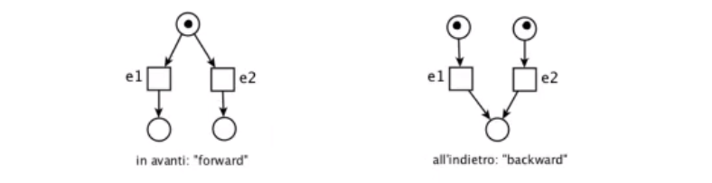
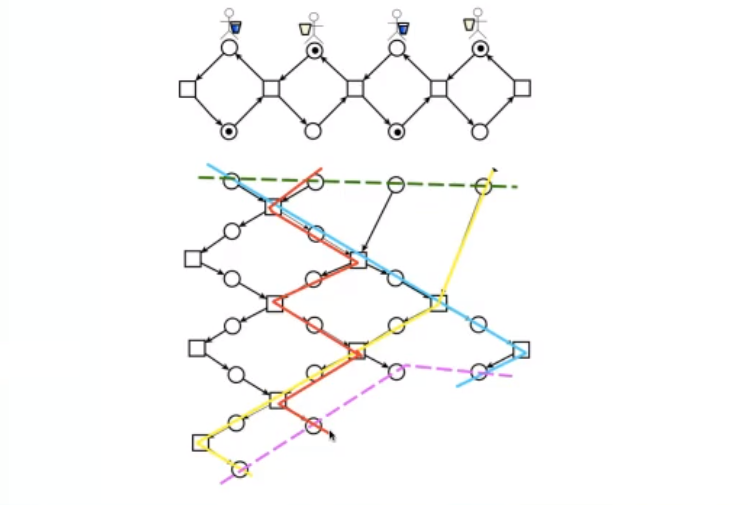

[TOC]


<div style="page-break-after: always;"></div>

# CONCORRENZA - INTRODUZIONE

*Concorrere* singifica correre insieme; i sistemi concorrenti quindi rappresentano diversi componenti che operano in contemporanea. In particolare questi componenti possono coordinarsi per un obiettivo comune ma anche competere per le risorse disponibili.

Possiamo trovare la concorrenza ovunque, alcuni esempi di sistemi concorrenti sono:

- **Cellula vivente**: all'interno di essa avvengono in contemporanea molti processi come l'assemblaggio di proteine, la duplicazione del dna, ecc. Nella cellula non c'è un *direttore*, dunque è un sistema ***asincrono***.
- **Orchestra musicale**: in questo sistema, a differenza della cellula, c'è un direttore che da il tempo agli altri componenti; è un sistema ***sincrono***, ovvero che fa riferimento ad un *cronometro* condiviso da tutti i componenti e dove ogni componente sa che deve eseguire una certa azione in un certo momento.
- **Processore multicore**: un processore dove possono essere eseguite diverse operazioni in contemporanea.
- **Squadra antincendio**: sistema dove i componenti hanno un obiettivo comune: spegnere l'incendio e si coordinano a tal scopo.


#### COME PROGETTARE E REALIZZARE SISTEMI CONCORRENTI CORRETTI?

Per realizzare dei sistemi concorrenti corretti abbiamo bisogno di:

- **Linguaggi**: ovviamente per poter realizzare dei programmi concorrenti abbiamo bisogno di linguaggi di programmazione che permettano di stabilire quali operazioni vanno eseguite in parallelo e quali in serie.

  Un esempio pratico è Java con la classe *Thread*.
  Un esempio più astratto è la ***partitura musicale*** che rappresenta le varie parti che un'orchestra deve suonare. Essendo l'orchestra un sistema sincrono inoltre, questo si riflette anche nel linguaggio; nelle partiture il tempo è indicato allo stesso modo per tutte le parti.

  Un linguaggio astratto può essere rappresentato dai sistemi di equazioni *(ad esempio **CCS** che vedremo in seguito)*, che permettono di scrivere dei programmi estremamente astratti concentrandoci sulla comunicazione fra le parti più che al trattamento dei dati.

- **Modelli**: avremmo bisogno anche di modelli, ovvero di modi per rappresentare il sistema in una maniera semplificata rispetto al sistema reale mantenendo però le caratteristiche cruciali della concorrenza. Vogliamo analizzare questi modelli anziché i programmi concorrenti poiché sono più semplici e non presentano dettagli presenti invece nei programmi che non sono necessariamente collegati alla concorrenza, permettendoci così di concentrarci solo sugli aspetti effettivamente rilevanti.

  Un esempio di modello sono i *grafi di attività*, ovvero un grafo dove i nodi rappresentano delle attività e gli archi rappresentano la precedenza tra le varie attività; i nodi non ordinati fra loro possono essere eseguiti parallelamente.
  Altri modelli sono ad esempio le reti di Petri. Saranno studiati in seguito.

- **Logica**: per esprimere i criteri secondo i quali un certo sistema è corretto useremo la logica.

<div style="page-break-after: always;"></div>

# CORRETTEZZA DI PROGRAMMI SEQ

Consideriamo il seguente programma sequenziale

```java
	int f (int v[], int n) {
        int x = v[0]; int p = 0; int a = 1;
        while(a < n) {
            if (v[a] < x) {
                x = v[a]; p = a;
            }
            a = a + 1;
        }
        return p;
    }
```

SI tratta sostanzialmente di una *funzione* $f$ che prende in input un vettore di interi $v$ e un intero $n$ rappresentante la dimensione del vettore $v$ e calcola il valore minimo contenuto in esso. Infine, restituisce la posizione del valore minimo calcolato.

**Come possiamo dimostrare la sua correttezza?**
Prima di poter dire come si può dimostrare che il programma sia corretto è necessario definire più esattamente possibile cosa vuol dire che un programma sia *corretto*.


**DEFINIAMO IL CRITERIO DI *CORRETTEZZA***
Per definire un criterio che sia *rigoroso*, appelliamo alla matematica e al suo linguaggio *preciso*.
Per quanto riguarda il programma di esempio, vorremmo specificare la richiesta che ritorni sempre la posizione dell'elemento minimo; possiamo farlo utilizzando una formula di questo tipo:

**Alla fine dell'esecuzione $\forall i \in \{0, \ ..., \ n-1\}\ \ \  v[p] \leq v[i]$**			*(postcondizione)*
Ovvero, vogliamo che alla fine dell'esecuzione il valore indicato da $p$ sia minore o uguale di tutti gli altri valori del vettore.
In genere però non basta specificare cosa si vuole che sia vero alla fine dell'esecuzione; in molti casi un programma viene scritto per soddisfare una condizione alla fine dell'esecuzione purché valga qualcosa all'inizio dell'esecuzione. Nel nostro esempio questo è banale e può essere specificato come segue:

**Prima dell'esecuzione $\forall i \in \{0,\ ..., \ n-1\}\ \ \ v[i] \in \mathbb{Z}$**			*(precondizione)*
Ovvero, vogliamo che prima dell'esecuzione i valori del vettore $v$ siano dei numeri interi, visto che era stato dichiarato come vettore di interi.
Abbiamo specificato cosa intendiamo dire quando diciamo una funzione è corretta; diremo che la funzione $f$ è *soddisfacente* o *corretta* se ogni volta che i dati, prima dell'esecuzione, soddisfano la precondizione alla fine dell'esecuzione soddisferanno la postcondizione.


**DOMANDA**: come mai esistono programmi in grado di decidere la correttezza sintattica di un programma *(i compilatori)*, ma non esistono programmi che, dati in input precondizioni, postcondizioni e codice del programma siano in grado di deciderne la correttezza semantica?

Perché è un problema indecidibile. Basti pensare all'*halting problem*; un programma corretto è un programma che sicuramente termina, ma non possiamo decidere se termina o meno.
Tuttavia questo significa che non possiamo creare un verificatore generale di correttezza, ma non che non sia possibile decidere se un singolo programma sia o meno corretto.


## RIPASSO: LOGICA PROPOSIZIONALE

Prima di parlare di logica proposizionale è necessario inquadrare cosa si intende più in generale con logica *formale* o *matematica*; quando si parla di logica in matematica si intende un **sistema** formato da un ***linguaggio***, e quindi da una grammatica che specifica come costruire delle frasi *(formule)*.

Possiamo quindi costruire delle formule e lo facciamo con lo scopo di assegnare loro un significato; quindi, fissata una logica come linguaggio, vogliamo definire una ***semantica***, ovvero un modo per attribuire un significato agli elementi del linguaggio e in particolare alle formule.
Nel caso della logica proposizionale, dal punto di vista teorico, il significato di una formula è il suo **valore di verità**.

Una volta definite sintassi e semantica, possiamo usare una logica per costruire delle ***dimostrazioni***; aver definito una semantica non vuol dire che di fronte ad una formula si è in grado di dire subito se sia valida o meno, dunque con la logica si sviluppa un metodo di dimostrazione e si cerca, in un numero finito di passi, di dimostrare la validità di una certa formula.
Un esempio, legato alla logica dell'aritmetica, è la formula che dice che per ogni numero primo $x$, esiste sempre un numero primo $y$ più grande di esso; questa formula non è verificabile sperimentalmente essendo in numeri infiniti e va quindi dimostrata in altri modi.

Per ogni logica bisogna quindi definire un **apparato deduttivo**, cioè un insieme di ***regole di inferenza***.
Una regola di inferenza è una regola che dice *"se hai già dimostrato queste premesse, allora puoi dedurre questa formula"*.


#### LOGICA PROPOSIZIONALE - SINTASSI

Passiamo ora al caso specifico della logica proposizionale, considerata come la logica più semplice e che ci servirà per le dimostrazioni di correttezza.
Per costruire il linguaggio avremmo bisogno di

- $PA = \{p_1, \ ..., \ p_i, \ ...\}$		Proposizioni atomiche *(frasi, espressioni aritmetiche, ecc)*
- $\perp$, $\mathsf{T}$												Costanti logiche, sono formule sempre false/vere
- $\lnot$, $\lor$, $\land$, $\rightarrow$, $\leftrightarrow$								Connettivi logici, utili a creare formule complesse
- (, )													Delimitatori, sempre per le formule complesse

Adesso dobbiamo definire la ***grammatica*** della logica proposizionale e lo faremo induttivamente.
Definiamo $F_p$ insieme delle **formule ben formate**:

1. $\perp$, $\mathsf{T}$ $\in$ $F_p$									Le costanti logiche sono fbf
2. $\forall p_i \in PA$, $pi \in F_p$				Le proposizioni atomiche sono fbf
3. Se $A, B \in F_p$, allora $(\lnot A)$, $(A \lor B)$, $(A \land B)$, $(A \rightarrow B$), $(A \leftrightarrow B)$ $\in F_p$

*Esempio*: $(x < 0 \land (\lnot(y \geq z)))$ *(in questo caso $x<0 \in PA$)*

<div style="page-break-after: always;"></div>

#### LOGICA PROPOSIZIONALE - SEMANTICA

Adesso vogliamo attribuire un significato alle formule definite prima.
Siamo interessati a sapere se una formula sia vera o meno. Il valore di verità di una formula tuttavia dipende dai valori di verità delle sue proposizioni atomiche.

Il punto di partenza è quindi stabilire quali proposizioni atomiche considerare vere: questo si può fare formalmente definendo una

*Funzione di valutazione* $v: PA \rightarrow \{0,\  1\}$ *(0 e 1 stanno per False e True)*

Estendiamo ora $v$ induttivamente ad una funzione definita su tutte le formule ben formate
$I_v : F_p \rightarrow \{0, 1\}$			*funzione di interpretazione*

1. $I_v(\perp) = 0$			$I_v(\mathsf{T}) = 1$					Falso e vero hanno sempre valori 0/1
2. $\forall p_i \in PA$			$I_v(p_i) = v(p_i)$			L'interpretazione riprende il valore di $v$ per le PA
3. $I_v(\lnot A) = 1 - I_v(A)$							Passo induttivo
   $I_v(A \lor B) = 1$   sse $I_v(A) = 1$ o $I_v(B) = 1)$
   . . .
   $I_v(A \rightarrow B) = 1$   sse $I_v(B) = 1$ o $I_v(A)=0$


Qualche termine

- $A$ è SODDISFATTA da $I_v$ se $I_v(A)=1$
- $A$ è SODDISFACIBILE se esiste $I_v$ tale che $I_v(A) =1$
- $A$ è una TAUTOLOGIA se $I_v(A)=1$ per ogni $I_v$
- $A$ è CONTRADDITTORIA se $I_v(A) = 0$ per ogni $I_v$

EQUIVALENZA LOGICA
$A \equiv B$ sse $I_v(A) = I_v(B)$ per ogni $I_v$


#### MODELLI

Definiamo ora i *modelli*, ovvero delle interpretazioni delle proposizioni atomiche, cioè una scelta di valori di verità per tutte le proposizioni atomiche.

Un modello è un sottoinsieme delle proposizioni atomiche $M \subseteq PA$ a cui è associata un'interpretazione $I_M : F_p \rightarrow \{0, 1\}$ definita come tale: $I_M(p_i) = 1$ sse $p_i \in M$.
In sostanza il modello *sceglie* quali proposizioni atomiche sono vere.

Possiamo definire la relazione $M \vDash A$ tra modelli e formule che possiamo leggere come
$M$ <sub>MODELLA</sub> $A$ oppure come
$A$ <sub>È SODDISFATTA IN</sub> $M$.
Quindi scriveremo $M \vDash A$ se $A$ risulta vera per la scelta particolare di $M$.

<div style="page-break-after: always;"></div>

#### LOGICA PROPOSIZIONALE - APPARATO DEDUTTIVO

Possiamo ora rappresentare l'apparato deduttivo della logica proposizionale.

Esso è composto da **regole di inferenza** scritte in questo modo: $\frac{A_1, \ ..., \ A_N}{B}$
Dove $A_i \in F_p$ sono le ***premesse***, mentre $B \in F_p$ è la ***conclusione***.

Alcune regole di inferenza sono ad esempio

- $\frac{A_1 \ \ \ \ \ \ A_2}{A_1 \land A_2}$					Se ho dimostrato vere $A_1$ e $A_2$, sarà vera anche $A_1 \land A_2$
- $\frac{A_1 \land A_2}{A_1}$					Se ho dimostrato vera $A_1 \land A_2$, $A_1$ è vera
- $\frac{A \ \ \ \ \ \ A \rightarrow B}{B}$				Modus Ponens
- $\frac{A \rightarrow B \ \ \ \ \ \ \lnot B}{\lnot A}$			Modus Tollens


Le regole di inferenza sono i mattoni con i quali si costruiscono le ***dimostrazioni***.
**DIMOSTRAZIONE**: Catena di applicazione di regole $A_1, \ ..., \ A_N \vdash B$
*($\vdash$ significa che da $A_1, \ ..., \ A_N$ si deriva $B$)*.


Abbiamo ora due nozioni distinte:

- La validità in un modello $\vDash$
- La derivabilità $\vdash$ introdotta perché in generale non siamo in grado di decidere direttamente la nozione semantica di validità e quindi cerchiamo di dimostrare una cosa.

Naturalmente ha senso fare le derivazioni se ciò che è derivabile è anche vero, per questo esistono questi due teoremi:

***Teorema***: Se $A_1, \ ..., \ A_n \vdash B$ allora  $A_1, \ ..., \ A_n \vDash B$   *(validità, correttezza)*
Cioè se riusciamo a derivare $B$ da $A_1, \ ..., \ A_n$, in ogni modello in cui sono vere $A_1, \ ..., \ A_n$, è vera anche $B$.
Questo teorema ci dice che *abbiamo scelto bene* le regole di inferenza e che queste non ci permettono di derivare cose non vere. Se questo teorema è valido, la logica è **corretta**.

***Teorema***: Se $A_1, \ ..., \ A_n \vDash B$ allora $A_1, \ ..., \ A_n \vdash B$   *(completezza)*
Cioè se in ogni modello in cui sono vere $A_1, \ ..., \ A_n$ ed è vera anche $B$, si può derivare $B$ da $A_1, \ ..., \ A_n$.
Questo teorema ci dice che possiamo dimostrare tutto ciò che è vero.
Se questo teorema è valido, la logica è **completa**.

<div style="page-break-after: always;"></div>

## LOGICA DI HOARE

Questa logica si può vedere come costruita su due livelli diversi poiché permette di stabilire e definire il criterio di correttezza per un dato programma. In particolare, definisce questa correttezza tramite le definizioni di *precondizioni* e *postcondizioni* che sono delle formule della logica proposizionale.

#### PRIMO LIVELLO

Dunque al primo livello avremmo le proposizioni atomiche definite come relazioni fra le variabili del programma *($x\leq 5$, $x > y$, $z = 2^y$, ...)*.

Per dare un significato, una semantica, alle varie proposizioni atomiche definiamo la nozione di **stato della memoria**.
Supponiamo di aver scritto un programma e chiamiamo $V$ l'insieme delle variabili del programma; uno stato della memoria è una *fotografia* della memoria del programma in un certo istante.

Possiamo definire più formalmente quest'idea di stato della memoria come una funzione $\sigma : V \rightarrow \mathbb{Z}$ che assegna un valore ad ogni variabile *(consideriamo solo variabili intere per semplicità)*.

Possiamo ora attribuire ad ogni proposizione atomica un valore di verità in un certo stato.
Ad esempio $x \leq 5$ è vera in $\sigma$ se $\sigma(x) \leq 5$.

Diremo quindi che la formula $\alpha$ è vera in $\sigma$ scrivendo $\sigma \vDash \alpha$.


#### SECONDO LIVELLO

Possiamo a questo punto definire le formule della logica di Hoare.
In particolare, le formule di questa logica sono costruite tramite **triple di Hoare** definite come segue

$\{\alpha\} \ \ \  \mathsf{C} \ \ \ \{\beta\}$			con $\alpha$ precondizione, $\beta$ postcondizione e $\mathsf{C}$ comando/programma.

Le triple di Hoare si leggono come segue:
**SE** il comando $\mathsf{C}$ viene eseguito a partire da uno stato della memoria nel quale $\alpha$ è vera, **ALLORA** l'esecuzione termina e nello stato finale $\beta$ è vera.

Quello che faremo sarà cercare di dimostrare varie triple di Hoare sviluppando poco per volta un apparato deduttivo per questa logica.


#### PSEUDO LINGUAGGIO USATO

Il linguaggio che useremo con le triple di Hoare ha le seguenti istruzioni:
x **:=** 5	*assegnamento*
**if** x < 0 **then**x := -x **else** x := 2*x **endif**	*scelta*
**while** x < n **do** x := x + 1 **endwhile**	*iterazione*
**skip**	*istruzione NOP*

<div style="page-break-after: always;"></div>

### LOGICA DI HOARE - APPARATO DEDUTTIVO

1. Istruzione nulla					$\frac{}{\{p\}\ \ \  skip\ \ \  \{p\}}$

   Iniziamo dal caso più banale, ovvero quello dell'istruzione *skip*.
   Per qualunque precondizione $p$, se eseguiamo uno skip questa non cambia il valore di verità della formula $p$ poiché non cambia lo stato della memoria. Notiamo che questa regola non ha bisogno di premesse.

   

2. Sequenza, composizione					$\frac{\{p\}\ \ \ C\ \ \ \{r\}\ \ \ \ \ \ \ \ \ \ \{r\} \ \ \ D\ \ \ \{q\}}{\{p\} \ \ \ C; \ D \ \ \ \{q\}}$

   Se troviamo

   - Una formula $r$ che, sotto l'ipotesi di eseguire $C$ a partire da uno stato in cui è valida $p$, risulti valida al termine dell'esecuzione
   - E che, eseguendo $D$ da uno stato in cui è valida $r$ alla fine risulti valida $q$

   Possiamo derivare la tripla che dice che se eseguiamo $C$ e $D$ in sequenza da uno stato in cui è valida $p$, alla fine varrà $q$.

   

   

3. Scelta					$\frac{\{p\  \land\  B\} \ \ \ C \ \ \ \{q\} \ \ \ \ \ \ \ \ \ \ \{p\  \land\  \lnot B\}\ \ \  D\ \ \  \{q\}}{\{p\}\ \ \  if\ B\ then\ C\ else\ D\ endif\ \ \ \{q\}}$

   Se dimostriamo che

   - Eseguendo $C$ da uno stato dove vale la precondizione $p$ e vale anche la condizione $B$ al termine dell'esecuzione vale $q$
   - Eseguendo $D$ da uno stato dove vale $p$ ma non vale $B$ arriviamo comunque ad uno stato dove vale $q$

   Possiamo derivare la regola della scelta dove prima dell'esecuzione dell'$\mathtt{if}$ vale $p$ mentre dopo vale $q$.

   

4. Implicazione, conseguenza					$\frac{\{p\  \rightarrow\  p'\} \ \ \ \ \ \ \ \ \ \ \{p'\}\ \ \  C\ \ \  \{q\}}{\{p\}\ \ \ C\ \ \ \{q\}}$         $\frac{\{p\}\ \ \ C\ \ \ \{q\}\ \ \ \ \ \ \ \ \ \ q\  \rightarrow\ q'}{\{p\}\ \ \ C\ \ \ \{q'\}}$

   Osserviamo un esempio:
   Supponiamo di aver scritto un programma e di voler dimostrare $\{x>0\}\ \ \ C\ \ \ \{x=2^y\} $, cioè vogliamo dimostrare che, eseguendo il programma $C$ a partire da uno stato della memoria dove vale $x>0$, si arriverà in uno stato dove $x$ sarà pari a $2^y$.

   Supponiamo di aver derivato una tripla che ci dice che eseguendo $C$ da uno stato dove vale $x \geq 0$, arriveremo in uno stato in cui $x = 2^y$, supponiamo cioè $\vdash \{x \ge 0\}\ \ \  C\ \ \  \{x=2^y\}$.

   Osserviamo a questo punto che $x>0 \rightarrow x \geq 0$; siccome quando $x$ è maggiore di 0 è sicuramente anche maggiore o uguale a 0 è ragionevole  concludere che eseguendo $C$ da uno stato dove $x>0$ arriverò in uno stato dove $x=2^y$, ovvero $\vDash \{x>0\}\ \ \ C\ \ \ \{x=2^y\}$.

   Notare l'utilizzo del $\vDash$; il ragionamento fatto si riferisce alla semantica della formula.

   

   Generalizzando possiamo dire che se abbiamo dimostrato una tripla e osserviamo una condizione che implica la precondizione della tripla, possiamo derivare la tripla con la condizione osservata al posto della precondizione.
   Discorso analogo è valido anche per la postcondizione.

   

5. Assegnamento					$\frac{}{\{q[E/x]\} \ \ \ x:=E\ \ \ \{q\}}$

   Dove con $[E/x]$ intendiamo dire *'sostituisci ogni occorenza di $x$ in $q$ con $E$'*.

   Osserviamo anche qui un esempio: prendiamo un'istruzione di assegnamento e supponiamo che il nostro obiettivo sia raggiungere uno stato dove vale $x\geq0$, ovvero $x := y+2\ \ \  \{x\geq0\}$.

   Quale precondizione garantisce la postcondizione richiesta?
   Notiamo che per far sì che $x \geq 0$, $y$ deve essere maggiore o uguale a $-2$.

   Possiamo generalizzare questo procedimento impostando come precondizione di un assegnamento la postcondizione desiderata sostituendo alla variabile assegnata il suo valore, cioè $\vDash \{y +2 \geq 0\} \ \ \ x:=y+2\ \ \ \{x \geq 0\}$, dove in questo caso $E = y+2$.

   

   **ISTANTI DI TEMPO DIVERSI**
   Nulla vieta che $x$ appaia di nuovo nella precondizione, ad esempio:
   Da $x:=x+2\ \ \ \{x<0\}$ possiamo derivare $\vdash \{x+2<0\} \ \ \ x:=x+2\ \ \ \{x<0\}$.
   In questo caso la $x$ della precondizione e la $x$ della postcondizione si riferiscono alla variabile $x$ in due instanti di tempo diversi.
   

   **CONTRADDIZIONI**
   Supponiamo di avere $x:=-2\ \ \ \{x>0\}$; notiamo subito che se assegnamo $-2$ ad $x$, non potrà mai essere maggiore di $0$. Applichiamo meccanicamente la regola: $\{-2>0\}\ \ \ x:= -2 \ \ \ \{x>0\}$ e notiamo subito che la proposizione atomica $-2 > 0$ equivale a $False$.
   Questa tripla è legittima e valida, ma non esiste alcun stato in cui valga la formula $False$.

   

   Anche questa regola non ha bisogno di alcuna premessa.

   

6. Iterazione *(correttezza parziale)*					$\frac{\{inv\  \land\  B\} \ \ \ C\ \ \ \{inv\}}{\{inv\} \ \ \  while\ B\ do\ C\ endwhile\ \ \ \{inv\  \land \  \lnot B\}}$

   L'idea per le istruzioni iterative è di trovare una formula che sia ***invariante*** rispetto al blocco dell'istruzione iterativa. Se troviamo un'invariante possiamo dire che se questa formula è vera all'inizio dell'istruzione iterativa, lo sarà anche alla fine e in più possiamo dire che al termine del blocco iterativo vale anche la negazione della condizione di ciclo.
   In generale, avendo un'istruzione $W = \mathtt{while\ B\ do\ C\ end-while}$, se deriviamo $\vdash \{p\land B\}\ C\ \{p\}$, allora possiamo dire che $p$ è invariante rispetto a $W$.

   **ALCUNE NOTE**

   - Data un'istruzione iterativa, non c'è un solo invariante. Ad esempio, $True$ è invariante per ogni istruzione iterativa. Generalmente ci interessano gli invarianti utili alla dimostrazione in corso.

   - Nella pratica, le istruzioni iterative sono inserite in programmi, di conseguenza la scelta dell'invariante dipende dal contesto e si abbina alla regola dell'implicazione.

     Vediamo un esempio:
     Supponiamo di avere la seguente formula $\{p\}\ C \ \{r\}\ W\ \{z\}\ D\ \{q\}$ e di volerci ricondurre a $\{inv\} \ W\ \{inv \land \lnot B\}$; se riusciamo a dimostrare che $r \rightarrow inv$ e che $inv \lnot B \rightarrow z$ avremo ricostruito una dimostrazione completa.
     
   - Avvolte l'invariante non è assoluto, ma lo diventa aggiungendoci la condizione di ciclo.

   - L'invariante in genere è violata guardando lo stato della memoria durante l'esecuzione del blocco, ma viene ripristinata al termine del blocco.

   

7. Iterazione *(correttezza totale)*					$\frac{inv \rightarrow E \geq 0\ \ \ \ \ \ \ \ \ \ \{inv\  \land\  B\  \land\  E = k\}\ \ \ C\ \ \ \{inv\ \land \ E < k\}}{\{inv\} \ \ \  while\ B\ do\ C\ endwhile\ \ \ \{inv\  \land \  \lnot B\}}$

   Quando trattiamo istruzioni iterative esistono due modi diversi per cui l'istruzione può fallire rispetto alla specifica data da una tripla:
   
   1. L'istruzione iterativa, eseguita a partire da uno stato che soddisfa la precondizione, termina in uno stato che *NON* soddisfa la postcondizione *(gestito nella correttezza parziale)*
   2. L'istruzione iterativa *NON* termina
   
   Chiaramente per dimostrare la correttezza di un programma è necessario tener traccia di entrambi questi casi. Parleremo quindi di *correttezza totale* quando considereremo anche la terminazione e di *correttezza parziale* quando ci concentreremo solo su pre e postcondizioni dando per scontato che l'istruzione termini.
   
   
   Consideriamo $W = \mathtt{while\ } B\ \mathtt{do}\ C\ \mathtt{endwhile}$
   
   **TECNICA DI DIMOSTRAZIONE**
   Supponiamo che $E$ sia un'espressione aritmetica nella quale compaiono variabili del programma, costanti numeriche e operazioni aritmetiche e che $inv$ sia un invariante di ciclo per $W$ scelta in modo che:
   
   1. $inv \rightarrow E \geq 0$
   2. $\vdash^{^{TOT}}_{_{ITER}} \{inv \land B \and E = k >0\}\ \ \ C\ \ \ \{inv \land E < k\}$
   
   ALLORA:
   $\vdash^{^{TOT}}_{_{ITER}} \{inv\} \ \ \ W\ \ \ \{inv \land \lnot B\}$
   
   
   
   Notiamo il $^{^{TOT}}$; questa  una definizione ricorsiva perché $C$ potrebbe contenere al suo interno altre operazioni ricorsive.
   
   Cerchiamo cioè una quantità *variante* che sarà maggiore o uguale a 0 quando è valido l'invariante e che permetterà di derivare la tripla che dice che il variante $E$ avrà un valore costante $k>0$ prima dell'esecuzione e sarà $E<k$ dopo l'esecuzione. Questo significa che se eseguiamo il corpo dell'iterazione $C$ partendo da uno stato dove valgono $inv$, $B$ e $E$ ha un certo valore, al termine di una iterazione il valore di $E$ diminuisce strettamente. 
   
   Notiamo che l'invariante implica che $E \geq 0$; avendo che ad ogni iterazione il valore di $E$ diminuisce strettamente e che l'invariante è sempre valido prima e dopo l'iterazione, siamo sicuri che l'istruzione prima o poi terminerà.
   
   **OSSERVAZIONI**
   
   - $E$ ***non*** è una formula logica, $E \geq 0$ lo è
   - Lo $0$ in $E \geq 0$ può essere sostituito da qualsiasi numero

<div style="page-break-after: always;"></div>

### PROPRIETÀ GENERALI DELLA LOGICA DI HOARE

La logica di Hoare è una logica ***corretta*** $\vdash \implies \vDash$; questo significa che tutte le triple che riusciamo a derivare sono sicuramente delle triple valide.
È anche ***completa*** *(relativamente)* $\vDash \implies \vdash$; tutto ciò che è valido è derivabile. Tuttavia è una completezza relativa a causa dell'incompletezza dell'aritmetica: potrebbe succedere di dover dimostrare una proprietà aritmetica che però è indimostrabile *(caso molto remoto)*.

La logica di Hoare può aiutarci anche a ragionare sui programmi: supponiamo di avere un comando $C$ e una formula $q$ e di voler trovare una formula $p$ tale che $\{p\}\ \ \ C\ \ \ \{q\}$

Esempio: $x:=k;\ y:=2x;\ \ \ \{y >0\}$
Soluzioni: $k=5$			$k=12$			$k>3$			$k>0$

Esiste una precondizione *'migliore'*? Come possiamo definirla? Come possiamo calcolarla?
Notiamo che tra le soluzioni proposte $k>0$ è quella che dà più libertà di scelta di uno stato iniziale per l'esecuzione del comando.
Notiamo anche che se tale soluzione non fosse vera, cioè se $k \leq 0$, allora $y$ non potrebbe mai essere $>0$; possiamo quindi dire che quella sia la formula più inclusiva e cioè quella formula che se viene violata non permetterà di raggiungere la postcondizione.


#### ALCUNE NOZIONI

Fissiamo un programma $C$ e chiamiamo

- $V$ l'insieme delle variabili di $C$
- $\Sigma = \{\sigma\ |\ \sigma : V \to \Z  \}$ l'insieme degli stati della memoria
- $\Pi$ l'insieme delle formule $p$ su $V$			*(come $x=3$, $>y$, ecc)*
- $\vDash\ \subseteq\ \ \Sigma \times \Pi$ la relazione per dire se una formula è vera in un certo stato
  $\sigma \vDash p$   *"$p$ è vera in $\sigma$"*
- $t(\sigma) = \{p \in \Pi\ |\ \sigma \vDash p\}$   una funzione che associa ad uno stato $\sigma$ tutte le formule che sono vere in esso $\sigma \vDash p$. Questa funzione non può restituire un insieme vuoto; per ogni stato c'è almeno una formula che lo soddisfa *(ad esempio una formula che impone il valore di ogni variabile del programma)*.
- $m(p) = \{\sigma \in \Sigma\ |\ \sigma \vDash p\}$   una funzione che associa ad una formula tutti gli stati che la soddisfano. Questa funzione può restituire un insieme vuoto; nessuno stato soddisfa una formula contradittoria.

Possiamo estendere le ultime due funzioni dichiarate ai sottoinsiemi facendo uso di $S \subseteq \Sigma$ sottoinsieme di stati e $F \subseteq \Pi$ sottoinsieme di formule definendo:

- $t(S) = \{p\in \Pi\ | \ \forall s \in S : s \vDash p \} = \bigcap\limits_{s \in S} t(s)$   è le formule comuni a *tutti gli stati* di $S$, ovvero l'intersezione delle immagini calcolate sui singoli stati $s$.
- $m(F) = \{s \in \Sigma\ |\ \forall p \in F : s \vDash p\} = \bigcap\limits_{p \in F}$   è l'insieme degli stati tali per cui *tutte le formule* in $F$ sono valide, ovvero l'intersezione delle immagini calcolate sulle singole formule $f$.

##### OSSERVAZIONI

- $S \subseteq m(t(s))$			e			$F \subseteq t(m(s))$
- Se $A \subseteq B$, allora $m(B) \subseteq m(A)$

##### LOGICA PROPOSIZIONALE E INSIEMI DI STATI

Sappiamo che c'è una relazione forte tra la logica proposizionale e la teoria degli insiemi, in particolare:

- $m(\lnot p) = \Sigma \smallsetminus m(p)$
- $m(p \lor q) = m(p) \cup m(q)$
- $m(p \land q) = m(p) \cap m(q)$
- $m(p \rightarrow q) = \Sigma - m(p) \cup m(q)$


**IMPLICAZIONE**
Notiamo che possiamo vedere l'implicazione in due ottiche diverse:

- **CONNETTIVO LOGICO**: in questo caso non è che una abbreviazione di una formula più lunga, ovvero $p \rightarrow q \equiv \lnot p \lor q$, e quindi $m(p \rightarrow q) = m(\lnot p) \cup m(q)$.
- **RELAZIONE TRA FORMULE**: in questo caso abbiamo che se $p$ implica $q$, allora $m(p) \subseteq m(q)$, che equivale a dire che $q$ è ***più debole*** di $p$, poiché $q$ coincide ad un maggior numero di stati e quindi ci dà meno informazioni su quale sia lo stato corrente. 


#### CRITERIO DI SCELTA DELLA PRECONDIZIONE MIGLIORE

Il criterio di scelta che andremo ad utilizzare è la **weakest precondition**, ovvero, fissati $p$ e $q$, cercheremo la precondizione più debole, che coincide al maggior numero di stati, tale che $\vDash \{p\}\ \ \ C\ \ \ \{q\}$.

Questa precondizione più debole corrisponde al più grande insieme di stati dai quali l'esecuzione di $C$ porta ad uno stato in $m(q)$.

È stato dimostrato che esiste sempre la precondizione più debole per un comando e una postcondizione. Essa può essere l'insieme di tutti gli stati o anche l'insieme vuoto.

**NOTAZIONE**: $wp(C,\ q)$			precondizione più debole per $C\ \ \ \{q\}$

***Teorema***: $\vDash \{p\}\ \ \ C\ \ \ \{q\}$			se e solo se			$p \rightarrow wp(C, q)$

<div style="page-break-after: always;"></div>

##### REGOLE DI CALCOLO DI WP

Vediamo come calcolare le precondizioni più deboli. Lo vedremo separatamente per ogni tipo di istruzione.

- **Assegnamento**: $wp(x:=E,\ q) = q[E/x]$   Nel caso dell'assegnamento la precondizione più debole coincide con la sostituzione effettuata dalla regola di derivazione.

- **Sequenza**: $wp(C_1,\ C_2,\ q) = wp(C_1,\ wp(C_2,\ q))$   Per calcolare la precondizione più debole per una sequenza, calcoliamo prima la $wp$ del comando più interno e procediamo a ritroso.

- **Scelta**: $C: \mathtt{if}\ B\ \mathtt{then}\ C_1\ \mathtt{else}\ C_2\ \mathtt{endif}$
  $wp(C,\ q) = (B \land wp(C_1,\ q)) \lor (\lnot B \land (C_2,\ q))$
  La precondizione più debole in questo caso sarà l'*unione* delle precondizioni più deboli dei due rami dell'$\mathtt{if}$, combinati con la relativa formula di scelta.

  *Esempio concreto*:
  Consideriamo il programma $P$: 

  ```pascal
  if y == 0 then
  	x := 0;			//C
  else
  	x := x * y;		//D
  end-if
  ```

  Vogliamo calcolare $wp(P,\ x=y)$.
  Per farlo dobbiamo calcolare $wp(C,\ x=y)$ e $wp(D,\ x=y)$.

  Notiamo che si tratta di due assegnamenti, quindi:
  $wp(C,\ x=y) \implies 0 =y$
  $wp(D,\ x=y) \implies xy =y \implies y = 0 \lor x = 1$

  Possiamo ora calcolare $wp(P,\ x=y) \implies (y =0 \land y = 0) \lor (y \neq 0 \land y = 0 \lor x = 1)$
  $(y =0 \land y = 0) \lor (y \neq 0 \land y = 0 \lor x = 1) \implies (y=0) \lor (y \neq 0 \land x=1)$

- **Iterazione**: $wp(W,\ q) = (\lnot B \land q) \lor (B \land wp(C,\ W,\ q)) \equiv$
                                                 $(\lnot B \land q) \lor (B \land wp(C,\ wp(W,\ q)))$

  *Esempio concreto*:
  Consideriamo il programma $P$:

  ```pascal
  while x > 0 do			//W
  	x := x - 1		//C //W
  end-while				//W
  ```

  Vogliamo calcolare $wp(W,\ x=0)$
  Ragioniamo così: l'istruzione iterativa può:

  - Non essere mai eseguita e quindi nello stato iniziale $B$ non vale. In questo caso la precondizione più debole equivale a $\lnot B \land q$, poiché è come se il ciclo fosse uno skip che non cambia la memoria; è necessario che $q$ sia valido all'inizio.
  - Nello stato iniziale è vera $B$: il programma equivale all'esecuzione di $C$ una volta e alla replicazione di $W$: possiamo pensare di dare una definizione ricorsiva di $wp$. Non c'è quindi un algoritmo *meccanico* per trovare una precondizione più debole per un ciclo.

<div style="page-break-after: always;"></div>

### CONTESTI DIVERSI

Abbiamo visto che una tripla di Hoare possa garantire la correttezza di un programma ma anche come possa portarci a concetti come la precondizione più debole. Vediamo ora gli stessi concetti delle triple di Hoare in contesti diversi.


#### DESIGN BY CONTRACT

Il primo contesto che andiamo ad osservare appartiene all'ingegneria del software; le triple possono essere interpretate nell'ambito di una strategia di sviluppo di programmi chiamata *design by contract* o *programming by contract*.

L'idea sottostante è che lo sviluppo di un programma corrisponde ad un contratto fra due contraenti *cliente* e *fornitore*; diciamo che il *fornitore* fornisce il programma e il *cliente* specifica cosa vorrebbe che facesse il programma.
In questa visione una tripla è un contratto tra *fornitore* e *cliente*, ovvero un accordo nel quale ciascuna parte si assume delle obbligazioni e in cambio ha dei diritti.

Interpretiamo le triple come: $\{p\}\ \ \ C\ \ \ \{q\}$, dove $p$ rappresenta l'obbligazione del cliente, $C$ la funzione *invocata* dal cliente e $q$ l'obbligazione del fornitore.

Alcuni linguaggi incorporano nella propria sintassi l'idea di definire i termini del contratto, ad esempio ***Eiffel***.
Esistono anche strumenti software, come ***Java Modelling Language*** che permettono di incorporare questa idea anche in linguaggi come Java usando delle speciali annotazioni.


#### STORIA

Le prime idee sulla correttezza dei programmi nacquero nei primi anni 70 dai lavori di **R. W. Floyd**, **C. A. R. Hoare** e **E. W. Dijkstra** *(che ha introdotto il concetto di precondizione più debole)*.

Le idee di **Dijkstra** sono state usate anche per definire una semantica dei programmi, e dare quindi un *significato* ad un programma. Si possono dare diverse interpretazioni, una possibile è: il significato di un programma è una funzione che va dallo spazio dei possibili dati in ingresso allo spazio dei possibili valori in uscita. Si può anche dare un significato operazionale dove il significato di un programma è una sequenza di cambi dello stato della memoria provocati dall'esecuzione del programma.


#### DIMOSTRAZIONI DI CORRETTEZZA

Abbiamo visto dimostrazioni applicabili ad un linguaggio molto semplice che, seppur dal punto di vista teorico è completo, dal punto di vista pratico è molto limitato. Pensiamo alle estensioni pratiche di un linguaggio come *funzioni*, *ricorsione*, *tipi strutturati*, *classi e oggetti* e a come queste possano influire sulle dimostrazioni di correttezza.

Un caso dove la dimostrazione di correttezza si fa decisamente più complicata è il caso dei programmi concorrenti; la logica di Hoare si basa sul fatto che i cambiamenti dello stato della memoria sono deterministici, ma questo non è più vero nel caso di programmi concorrenti. Inoltre, non sempre i programmi concorrenti hanno uno stato finale *(basti pensare ad un sistema operativo)* e si ritrovano ad interagire continuamente con l'ambiente: questi sono tutti aspetti da considerare per dimostrare la correttezza di un programma concorrente.


#### LOGICA DI HOARE E SINTESI DI PROGRAMMI ITERATIVI

Possiamo usare la logica di Hoare anche per sviluppare dei programmi invece che validarli.
Supponiamo di voler calcolare un'approssimazione intera della radice quadrata di un numero $k$.

1. La tripla obiettivo sarà dunque $\{k \geq 0\}\ \ \ P\ \ \ \{0 \leq x^2 \leq k < (x+1)^2\}$

2. Ipotizziamo la struttura generale del programma: calcoliamo il valore per approssimazioni successive iterando finché il valore non soddisfa la postcondizione.

   ```pascal
   x := E(k);			//Il valore iniziale dipende da k
   while B(x, k) do	//La condizione di ciclo dipende da x e k
   	x := F(x, k)	//Il nuovo valore dipene dal vecchio valore e da k
   end-while
   ```

3. Spezziamo la postcondizione per cercare un invariante di ciclo
   $0 \leq x^2$                    $x^2\leq k$                    $k < (x+1)^2$

   Notiamo che nel corso dell'iterazione vorremo che $x^2$ rimanga sempre $\leq k$, mentre $(x+1)^2 > k$ non può essere un invariante poiché è la caratteristica della soluzione cercata.

   Dunque $0 \leq x^2 \land x^2 \leq k$ è un possibile invariante.
   $x := E(k)$ deve stabilire l'invariante; poiché $k \geq 0$ *(precondizione generale)*, possiamo scegliere $0$ come valore iniziale di $x$.

4. Se $inv = 0 \leq x^2 \leq k$, al termine dell'esecuzione varrà $inv \land \lnot B(x, k)$, quindi dobbiamo scegliere $B(x,k)$ in modo che $(inv \land \lnot B(x,k)) \rightarrow (inv \land k < (x+1)^2)$ *(ovvero che implichi la postcondizione generale)*.

   Poniamo dunque $B(x,k) = (x+1)^2 \leq k$.

5. Ora osserviamo che se nel corpo dell'iterazione incrementiamo $x$, prima o poi $(x+1)^2$ sarà maggiore di $k$. Il programma potrebbe quindi essere:

   ```pascal
   x := 0;
   while (x+1)*(x+1) <= k do
   	x := x + 1;
   end-while
   ```


#### SCHEMA GENERALE DI DIMOSTRAZIONE

Supponiamo di dover dimostrare $\{p\}\ \ \ V;W;Z\ \ \ \{q\}$, supponendo che $V$ e $W$ non contengano istruzioni iterative.
Uno schema generale è:

1. Ricaviamo da $Z\ \ \ \{q\}$ la $wp(Z, q) \equiv s$                                                   $\{s\}\ \ \ Z\ \ \ \{q\}$
2. Cerchiamo un'invariante $i$ per $W$ tale che $(i \land \lnot B) \rightarrow s$                  $\{i\}\ \ \ W;Z\ \ \ \{q\}$
3. Cerchiamo una formula $u$ tale che $\vdash\{p\}\ \ \  V\ \ \ \{u\}$ e $u \rightarrow i$             $\{p\}\ \ \ V;W;Z\ \ \ \{q\}$


### ESEMPI DI DERIVAZIONE

##### ASSEGNAMENTO
Consideriamo l'istruzione $x:= -x$, fissando come postcondizione $\{x<0\}$.
Ricaviamo una precondizione corretta per questa combinazione di comando e postcondizione.

Applichiamo la regola dell'assegnamento: $\vdash_{_{ASS}} \{-x<0\}\ \ \ x:=-x\ \ \ \{x<0\}$
Possiamo riscrivere la tripla in maniera più leggibile come $\{x>0\}\ \ \ \ x:=-x\ \ \ \{x<0\}$.


##### ASSEGNAMENTO

Consideriamo $x:=2*y \ \ \ \{x>y\}$
$\vdash_{_{ASS}} \{2*y>y\}\ \ \ x:=2*y\ \ \ \{x>y\}$      $\equiv$      $\{y>0\}\ \ \ x:=2*y\ \ \ \{x>y\}$


##### CONTROESEMPI

Supponiamo ora di dover dimostrare questa tripla $?\ \ \ \{True\}\ \ \ x=2*y\ \ \ \{x>y\}$
Proviamo ad applicare la regola dell'assegnamento $\vdash_{_{ASS}} \{y>0\}\ \ \ x=2*y\ \ \ \{x>y\}$: sappiamo ora che questa tripla è valida poiché l'abbiamo ottenuta tramite la derivazione, ma il nostro obiettivo è la prima tripla. L'unica regola che possiamo pensare di applicare è quella dell'implicazione, ma osserviamo che non è vero che $True \rightarrow y>0$, dunque non possiamo dimostrare la validità della prima tripla.
Questo è un bene in realtà, poiché non è certamente vero che eseguendo quell'assegnamento da uno stato in cui vale $True$ arriverò *sicuramente* in uno stato in cui vale $x>y$.

Tuttavia, il fatto che non siamo riusciti a dimostrare che sia vera non vuol dire che sia falsa: dobbiamo dimostrare che è falsa. Il modo più semplice è trovare un controesempio.
Un controesempio in questo caso è uno stato in cui $y=-1$: applicando l'assegnamento avremo $x=-2$ e $x \ngtr y$.


##### SEQUENZA

Supponiamo di voler dimostrare $?\ \ \ \{x+y=K\}\ \ \ x:=x-1;\ y:=y+1\ \ \ \{x+y=K\}$
Notiamo subito che qui il programma è composto da una sequenza di due assegnamenti, quindi dobbiamo trovare una formula intermedia che faccia da postcondizione per il primo assegnamento e da precondizione per il secondo. Siccome si tratta di assegnamenti, possiamo pensare di usare la regola dell'assegnamento, ottenendo:

- Da $y:=y+1\ \ \ \{x+y=K\}$          $\vdash_{_{ASS}}\{x+y+1=K\}\ \ \ y:=y+1\ \ \ \{x+y=K\}$
- E a questo punto da $x:=x-1 \ \ \ \{x+y+1=K\}$        $\vdash_{_{ASS}} \{x-1+y+1 = K\}\ \ \ x:=x-1\ \ \ \{x+y+1 = K\}$

Notiamo che $x-1+y+1 = K \equiv x+y= K$. 

Notiamo anche che la precondizione dell'assegnamento $y:=y+1$ è uguale alla postcondizione dell'assegnamento $x:=x-1$, dunque possiamo applicare la regola della sequenza $\vdash_{_{SEQ}} \{x+y=K\}\ \ \ x:=x-1;\ y:=y+1\ \ \ \{x+y = K\}$

Abbiamo così dimostrato la validità della tripla iniziale.

<div style="page-break-after: always;"></div>

##### SCELTA

Consideriamo il programma $P$

```pascal
y := k;
if x > 0 then
	y := y * x
else
	y := -2 * x
end-if
```

Vogliamo stabilire se vale $?\ \ \ \{k>0\} \ \ \ P\ \ \ \{y \geq 0\}$.

Osserviamo la postcondizione e in particolare che questa vale subito dopo un'istruzione di scelta: per poter derivare una tripla come istruzione di scelta dobbiamo *"spezzare"* i rami della scelta e stabilire se tutti e due i casi portino alla postcondizione richiesta.
I rami in questo caso sono

- $y:=y*x\ \ \ \{y \geq 0\}$
  Possiamo applicare questo ramo la regola dell'assegnamento $\vdash_{_{ASS}} \{y*x\geq 0\}\ \ \ y:= y*x \ \ \ \{y \geq 0\}$
- $y := -2 * x\ \ \ \{y \geq 0\}$
  Applichiamo ancora la regola dell'assegnamento
  $\vdash_{_{ASS}} \{-2*x \geq 0\}\ \ \ y:= -2 * x \ \ \ \{y \geq 0\}$


Ricordiamo che le precondizioni delle premesse della regola della scelta sono
$\{p \land B\}$          e          $\{p \land \lnot B\}$.

Notiamo che la precondizione della tripla da dimostrare dice che $k>0$ e l'istruzione prima dell'$\mathtt{if}$ assegna $k$ a $y$, di conseguenza avremo che sicuramente $y > 0$ dopo il primo assegnamento.

Scriviamo ora, sostituendo a $p= y>0$ e a $B = x>0$ *(la condizione dell'$\mathtt{if}$)* le premesse della regola della scelta *(dobbiamo dimostrare queste triple per poterla applicare)*

- $?\ \ \ \{y>0 \land x>0\}\ \ \ y:=y*x\ \ \ \{y \geq 0\}$                                  *($\{p \land B\}\ C\ \{q\}$)*
- $?\ \ \ \{y>0 \land x \leq 0\}\ \ \ y:=-2*x\ \ \ \{y\geq 0\}$                              *($\{p \land \lnot B\}\ D\ \{q\}$)*

Notiamo che la nostra precondizione nel primo ramo ($y*x \geq 0$) non coincide esattamente con la precondizione ricavata ora, ma notiamo anche che  $y>0 \land x>0 \rightarrow xy>0$, quindi $\vdash_{_{IMPL}}\{y>0 \land x>0\}\ \ \ y:=y*x\ \ \ \{y\geq 0\}$

Osserviamo ora il secondo ramo; dobbiamo confrontare $y>0 \land x \leq 0$ con $-2x\geq 0$.
Notiamo che possiamo riscrivere $-2x \geq 0$ come $x \leq 0$.
Senz'altro $y>0 \land x \leq 0 \rightarrow x \leq 0$, quindi applichiamo nuovamente la regola dell'implicazione $\vdash_{_{IMPL}} \{y>0 \land x \leq 0\}\ \ \ y:= -2x\ \ \ \{y \geq 0\}$

Notiamo ora che le ultime due triple derivate hanno esattamente la forma delle premesse della regola della scelta, quindi $\vdash_{_{IF}} \{y>0\}\ if\ x>0\ then\ y:= y*x\ else\ y:=-2*x\ endif\ \{y \geq 0\}$

Ora manca solo da dimostrare che anche l'assegnamento iniziale è valido: per fare ciò usiamo la regola dell'assegnamento usando come postcondizione la precondizione dell'$\mathtt{if}$, quindi $\vdash_{_{ASS}} \{k > 0\}\ \ \ y:= k\ \ \ \{y>0\}$

Infine, osservando che la postcondizione dell'assegnamento è la precondizione dell'$\mathtt{if}$ possiamo dire $\vdash_{_{SEQ}} \{k>0\} \ \ \ P\ \ \ \{y \geq 0\}$.

##### ITERAZIONE - ESPONENZIALE

Consideriamo il seguente programma $P$ che calcola l'esponenziale

```pascal
i := 0; s := 1; //A	
while i < N do  	//W
	i := i + 1; //C //W
	s := s * x; //C //W
end-while			//W
```

Vogliamo dimostrare la tripla $?\ \ \  \{N \geq 0\}\ \ \ P\ \ \ \{s = x^N\}$

Notiamo che il programma contiene due assegnamenti e un ciclo, dobbiamo quindi cercare un'invariante; per farlo proviamo a simulare i primi passi di un'esecuzione:
$i\ \ \ 0\ \ \ 1\ \ \ \ 2\ \ \ \ \ 3\ \ \ ...$
$s\ \ \ 1\ \ \ x\ \ \ x^2\ \ \ x^3\ \ \ ...$

Notiamo che $s = x^i$ per ogni iterazione; ogni volta $i$ viene incrementato, ma anche $s$ viene aggiornato. Chiaramente, se dovessimo osservare la memoria dopo il primo assegnamento ma prima dell'aggiornamento di $s$ l'invariante non sarebbe più valido, ma a noi interessano i momenti iniziale e finale del blocco iterativo.


**1. DIMOSTRAZIONE INVARIANTE**
Ipotizziamo quindi che $s = x^i$ sia un'invariante: dobbiamo dimostrarlo e per farlo possiamo usare la tripla che fa da premessa alla regola dell'iterazione *(che è sostanzialmente la definizione di invariante)*, ovvero $?\ \ \ \{s=x^i \land i <N\}\ \ \ C\ \ \ \{s=x^i\}$

Notiamo che la $C$ è composto da due assegnamenti, quindi possiamo derivare la tripla premessa della regola dell'iterazione usando la regola dell'assegnamento tramite $C\ \ \ \{s=x^i\}$:
$\vdash_{_{ASS}}\{sx=x^i\}\ \ \ s:= s*x\ \ \ \{s=x^i\}$

Usiamo ora la precondizione ottenuta come postcondizione per l'altro assegnamento:
$\vdash_{_{ASS}} \{sx=x^{i+1}\}\ \ \ i:=i+1\ \ \  \{sx=x^i\}$

A questo punto, osservando che la precondizione della prima tripla derivata è la postcondizione della seconda, possiamo usare la regola della sequenza per derivare $\vdash_{_{SEQ}} \{sx = x^{i+1}\} \ \ \ C\ \ \ \{sx = x^i\}$.

Notiamo però che i due assegnamenti sono indipendenti, ovvero operano su variabili distinte; questo significa che avremmo anche potuto applicare la regola dell'assegnamento contemporaneamente ad entrambi gli assegnamenti ottenendo lo stesso risultato.

A questo punto abbiamo una tripla con la postcondizione che ci serviva ma con la precondizione che non coincide esattamente con quella della tripla da dimostrare, quindi dobbiamo manipolarla per ricondurla a quella che ci serve.
Notiamo che $sx = x^{i+1}\  \implies\ sx = x^ix\ \implies\ s = x^i$
Otteniamo quindi $\vdash\{s=x^i\} \ \ \ C\ \ \ \{s=x^i\}$.

A noi però serve derivare la precondizione $s=x^i \land i<N$, ma osserviamo che $s=x^i \land i <N \rightarrow s=x^i$, quindi possiamo derivare, tramite la regola dell'implicazione
$\vdash_{_{IMPL}} \{s=x^i \land i < N\} \ \ \ C\ \ \ \{s=x^i\}$

Abbiamo quindi dimostrato l'invariante e derivato la premessa per la regola dell'iterazione.
Possiamo ora applicare tale regola $\vdash_{_{ITER}} \{s=x^i\}\ \ \ W\ \ \ \{s=x^i \land i \geq N\}$.


**2. RAFFORZAMENTO INVARIANTE**
Notiamo però che quello che vogliamo derivare noi ha una postcondizione $s = x^N$, mentre quello che abbiamo ricavato con la regola dell'iterazione è più debole: abbiamo ricavato che $s=x^i$ e che $i 	\geq N$.
Per avere la postcondizione voluta dobbiamo dimostrare che al termine dell'esecuzione $i = N$, ma l'invariante trovato non è sufficiente a questo scopo e quindi dobbiamo *rafforzarlo*.

Per farlo, osserviamo che anche $i \leq N$ è un invariante, quindi ipotizziamolo:
$?\ \ \ \{i\leq N \land i < N\}\ \ \ C\ \ \ \{i \leq N\}$          Notiamo che $i\leq N \land i < N \equiv i<N$

Usiamo sempre la regola dell'assegnamento:
$\vdash_{_{ASS}}\{i+1 \leq N\}\ \ \ C\ \ \ \{i \leq N\}$

Notiamo che $i < N \rightarrow i+1 \leq N$:
$\vdash_{_{IMPL}}\{i < N\}\ \ \ C\ \ \ \{i \leq N\}$

Possiamo ora derivare, tramite la regola dell'iterazione:
$\vdash_{_{ITER}}\{i\leq N\}\ \ \ W\ \ \ \{i \leq N \land i\geq N\}$          Notiamo che $i\leq N \land i \geq N \equiv i = N$

Ora combiniamo i due invarianti:
$\vdash_{_{ITER}}\{s=x^i \land i \leq N\}\ \ \ W\ \ \ \{s=x^i \land i\leq N \land i \geq N\}$, ovvero
$\vdash\{s=x^i \land i \leq N\}\ \ \ W\ \ \ \{s=x^i \land i=N\}$, ovvero
$\vdash\{s=x^i \land i \leq N\}\ \ \ W\ \ \ \{s=x^N\}$


**3. ASSEGNAMENTI INIZIALI**
A questo punto ci rimane solo da dimostrare che dopo gli assegnamenti iniziali valgono gli invarianti
$?\ \ \ \{N \geq 0\}\ \ \ A\ \ \ \{s=x^i \land i \leq N\}$

Usiamo la regola dell'assegnamento:
$\vdash_{_{ASS}}\{1= x^i \land i \leq N\}\ \ \ s:=1\ \ \ \{s=x^i\land i \leq N\}$

$\vdash_{_{ASS}}\{1 = x^0 \land 0 \leq N\}\ \ \ i:=0\ \ \ \{1 = x^i \land i \leq N\}$, ovvero
$\vdash\{N\geq0\}\ \ \ i:=0\ \ \ \{1 = x^i \land i \leq N\}$

A questo punto usiamo la regola della sequenza:
$\vdash_{_{SEQ}}\{N\geq 0\}\ \ \ A\ \ \ \{s=x^i \land i \leq N\}$


**4. DIMOSTRAZIONE FINALE**
A questo punto possiamo combinare, con la regola della sequenza, le triple $\{N\geq 0\}\ \ \ A\ \ \ \{s=x^i \land i \leq N\}$ e $\{s=x^i \land i \leq N\}\ \ \ W\ \ \ \{s=x^N\}$, ottenendo
$\vdash_{_{SEQ}}\{N \geq 0\}\ \ \ P\ \ \ \{s = x^N\}$, dimostrando così la tripla iniziale.

<div style="page-break-after: always;"></div>

##### ITERAZIONE - DIVISIONE

Consideriamo il programma $P$ che calcola quoziente e resto di $x/y$

```pascal
quo := 0; rem := x;		//A
while rem >= y do		//W
	rem := rem - y;	//C	//W
	quo := quo + 1;	//C	//W
end-while				//W
```

Vogliamo dimostrare $?\ \ \ \{x \geq 0 \land y \geq 0\}\ \ \ P\ \ \ \{x = quo*y +rem \land rem \geq 0 \land rem < y \}$

Osservazione: $rem < y \equiv \lnot B$

Notiamo che siamo in presenza di un ciclo, cerchiamo dunque un'invariante:
Simuliamo qualche passo con $x=26$ e $y=5$
$quo\ \ \ \ \ 0\ \ \ 1\ \ \ \ \ 2\ \ \ \ 3\ \ \ \ 4\ \ 5$
$rem\ \ \ 26\ \ 21\ \ 16\ \ 11\ \ \ 6\ \ 1$

Osserviamo sia la tabella che la postcondizione di interesse.


**1. DIMOSTRAZIONE INVARIANTE**
Ipotesi: $x = quo*y + rem \land rem \geq 0$ è invariante.
$?\ \ \ \{x=quo*y + rem \land rem \geq 0 \land rem \geq y\}\ \ \ C\ \ \ \{inv\}$ 

Usiamo la regola dell'assegnamento:
$\vdash_{_{ASS}}\{x=(quo+1)*y+rem-y \land rem - y \geq 0\}\ \ \ C\ \ \ \{inv\}$, ovvero
$\vdash\{x=quo*y+rem \land rem \geq y\}\ \ \ C\ \ \ \{inv\}$


Sappiamo però che $y \geq 0$, quindi
   $\vdash \{x=quo*y +rem \land rem \geq 0\}\ \ \ C\ \ \ \{inv\}$

A questo punto possiamo usare la regola dell'iterazione:
   $\vdash_{_{ITER}} \{x=quo*y +rem\land rem \geq 0\}\ \ \ W\ \ \ \{x = quo *y +rem \land rem \geq 0 \land rem < y\}$

In questo caso abbiamo già ottenuto la postcondizione che ci interessa.


**2. ASSEGNAMENTI INIZIALI**
Per concludere la dimostrazione dobbiamo ora dimostrare che l'invariante vale dopo gli assegnamenti iniziali:
$\vdash_{_{ASS}} \{x = x \land x \geq 0 \}\ \ \ A\ \ \ \{x=quo*y + rem \land rem \geq 0\}$, ovvero
$\vdash \{x \geq 0 \}\ \ \ A\ \ \ \{x=quo*y + rem \land rem \geq 0\}$


Notiamo che $x \geq 0 \land y \geq 0 \rightarrow x\geq 0$, quindi
$\vdash_{_{IMPL}} \{x \geq 0 \land y\geq 0\} \ \ \ A\ \ \ \{x=quo*y +rem \land rem \geq 0\}$


Dunque, l'invariante è valido dopo gli assegnamenti iniziali.


**3. DIMOSTRAZIONE FINALE**
   Ora possiamo comporre il tutto con la regola della sequenza e terminare la dimostrazione
   $\vdash_{_{SEQ}}\{x\geq 0 \land y \geq 0\}\ \ \ P\ \ \ \{x=quo*y+rem \land rem \geq 0 \land rem < y\}$

##### CORRETTEZZA TOTALE - ESEMPIO

Consideriamo il programma $P$

```pascal
while x > 5 do
	x := x - 1;
end-while
```

Supponiamo di voler dimostrare $?\ \ \ \{x > 5\}\ \ \ P\ \ \ \{x=5\}$

Dobbiamo cercare un variante $E$ il cui valore decresce ad ogni esecuzione dell'iterazione e un invariante $inv$ che garantisca che $E$ abbia sempre valore maggiore o uguale a $0$.

In questo caso possiamo usare $E = x - 5$ e $inv = x \geq 5$. Osserviamo che $inv \rightarrow E \geq 0$.

Dimostriamo l'invariante:
$?\ \ \ \{x\geq5 \land x >5\}\ \ \ C\ \ \ \{x \geq 5\}$

Usiamo la regola dell'assegnamento:
$\vdash_{_{ASS}} \{x \geq 6\}\ \ \ x:=x-1\ \ \ \{x \geq 5\}$

Osserviamo che $x \geq 5 \land x >5  \equiv x \geq 6$:
$\vdash \{x \geq 5 \land x > 5\} \ \ \ C\ \ \ \{x \geq 5\}$ dunque l'invariante è valido.


Ora dobbiamo dimostrare $?\ \ \ \{inv \land B \land x-5 = k\}\ \ \ x:=x-1\ \ \ \{inv \land x-5 < k\}$

Applichiamo la regola dell'assegnamento:
$\vdash_{_{ASS}} \{x-1\geq 5 \land x-1-5 < k\}\ \ \ x:=x-1\ \ \ \{x \geq 5 \land x-5 < k\}$ ovvero
$\vdash \{x\geq 6 \land x-6 < k\}\ \ \ x:=x-1\ \ \ \{x \geq 5 \land x-5 < k\}$

Notiamo che $x \geq 5 \land x > 5 \land x-5 = k \rightarrow x \geq 6 \land x-6 <k$, poiché se $x >5$, allora sicuramente $x >= 6$ visto che lavoriamo con interi e se $x-5 = k$ sicuramente $x-6 <k$.
$\vdash_{_{IMPL}} \{x\geq 5 \land x> 5 \land x-5 =k\}\ \ \ x:=x-1\ \ \ \{x\geq5 \land x-5 < k\}$

A questo punto possiamo usare la regola dell'iterazione totale
$\vdash_{_{ITER}}^{^{TOT}} \{x \geq 5\}\ \ \ P\ \ \ \{x\geq5 \land x \leq 5\}$


**E se $B$ fosse $x \neq 5$?**
Proviamo a vedere se l'invariante di prima è ancora valido
Dovremmo quindi dimostrare $?\ \ \ \{x \geq 5 \land x \neq 5\}\ \ \ C\ \ \ \ \{x \geq 5\}$

Usiamo sempre la regola dell'assegnamento
$\vdash_{_{ASS}}\{x\geq6\}\ \ \ x:=x-1\ \ \ \{x \geq 5\}$

Osserviamo che anche in questo caso $x \geq 5 \land x \neq 5 \equiv x \geq 6$, quindi
$\vdash \{x\geq 5 \land x \neq5\}\ \ \ C\ \ \ \{x\geq 5\}$, quindi l'invariante è ancora valido.

Dimostriamo ora $?\ \ \ \{x\geq 5 \land x\neq 5 \land x-5 = k\}\ \ \ C\ \ \ \{inv \land x-5 < k\}$
Applichiamo la regola dell'assegnamento:
$\vdash_{_{ASS}}\{x \geq 6 \land x-6 < k\}\ \ \ x:=x-1\ \ \ \{x\geq 5 \land x-5 < k\}$

Notiamo che $x\geq 5 \land x \neq 5 \land x-5 = k \rightarrow x \geq 6 \land x-6 < k$, quindi
$\vdash_{_{IMPL}} \{x\geq 5 \land x \neq 5\land x-5 = k\}\ \ \ C\ \ \ \{x \geq 5 \land x-5 < k\}$

A questo punto possiamo usare la regola dell'iterazione totale
$\vdash_{_{ITER}}^{^{TOT}} \{x \geq 5\}\ \ \ P\ \ \ \{x\geq5 \land x \leq 5\}$

##### CORRETTEZZA TOTALE - VARIABILE NON DECREMENTA

Consideriamo il programma $P$

```pascal
while x < 5 do
	x := x + 1
end-while
```

Supponiamo di voler dimostrare $?\ \ \ \{x < 5\}\ \ \ P\ \ \ \{x=5\}$

Proviamo ad usare $inv = x \leq 5$ ed $E = 5-x$, notando che $inv \rightarrow E \geq 0$.

Dobbiamo dimostrare l'invariante, quindi
$?\ \ \ \{x \leq 5 \land x <5\}\ \ \ x:=x+1\ \ \ \{x\leq 5\}$

Usiamo la regola dell'assegnamento:
$\vdash_{_{ASS}} \{x \leq 4\}\ \ \ x:=x+1\ \ \ \{x\leq 5\}$

Notiamo che $x\leq 5 \land x <5 \equiv x \leq 4$, quindi
$\vdash \{x\leq 5 \land x < 5\}\ \ \ C\ \ \ \{x\leq 5\}$, quindi l'invariante è valido.


Ora dobbiamo dimostrare la seconda premessa della regola dell'iterazione totale, ovvero $?\ \ \ \{x \leq 5 \land x < 5 \land 5-x = k\}\ \ \ x:=x+1\ \ \ \{x \leq 5 \land 5-x < k\}$

Usiamo la regola dell'assegnamento:
   $\vdash_{_{ASS}} \{x\leq 4\land 4-x < k\}\ \ \ x:=x+1\ \ \ \{x\leq 5 \land 5-x < k\}$

Notiamo che $x\leq5 \land x <5 \land 5-x = k \rightarrow x\leq 4 \land 4-x< k$, poiché se $x <5$, allora sicuramente $x \leq 4$ perché lavoriamo con gli interi e se $5-x =k$ allora sicuramente $4-x < k$:
   $\vdash_{_{IMPL}} \{x \leq 5 \land x < 5 \land 5-x=k\}\ \ \ C\ \ \ \{x \leq5 \land 5 -x <k\}$

   

Possiamo ora usare la regola dell'iterazione totale:
   $\vdash_{_{ITER}}^{^{TOT}} \{x \leq 5\}\ \ \ P\ \ \ \{x\leq5 \land x \geq 5\}$

Notiamo che $x\leq 5 \land x \geq 5 \equiv x=5$, quindi
   $\vdash \{x \leq 5\}\ \ \ P\ \ \ \{x =5\}$

  <div style="page-break-after: always;"></div>

##### CORRETTEZZA TOTALE - ESPONENZIALE

Consideriamo il programma $P$:

   ```pascal
   p := 1; y := b;		//A
   while y > 0 do		//W
   	p := p * x;	//C	//W
   	y := y - 1;	//C	//W
   end-while			//W
   ```

Vogliamo dimostrare $?\ \ \ \{b \geq 0\}\ \ \ P\ \ \ \{p = x^b\}$

Notiamo subito che si tratta di un assegnamento e di un ciclo, cerchiamo quindi un'invariante simulando qualche iterazione:
   $p\ \ \ 1\ \ \ \ \ \ x\ \ \ \ \  \ \ \ \ x^2\ \ \ \ \ \ \ x^3\ \ \ \ \ \ \ x^4$
   $y\ \ \ b\ \ \ b-1\ \ \ b-2\ \ \ b-3\ \ \ b-4$

Notiamo che ad ogni passaggio $p = x^{b-y}$.

Abbiamo visto nel primo esempio di iterazione come possa capitare che un invariante semplice possa non bastare a dimostrare la validità di un ciclo, rafforziamolo da subito quindi con $y \geq 0$, che è un invariante *"garantito"* dalla condizione del ciclo.

   

**1. DIMOSTRAZIONE INVARIANTE**
  Dobbiamo ora dimostrate l'invariante trovato, dobbiamo cioè dimostrare la tripla
  $?\ \ \ \{p=x^{b-y} \land y \geq 0 \land y > 0 \}\ \ \ C\ \ \ \{p=x^{b-y} \land y \geq 0\}$

Notiamo subito che $C$ consiste di due assegnamenti indipendenti, possiamo quindi usare direttamente la regola dell'assegnamento su entrambi contemporaneamente:
   $\vdash_{_{ASS}}\{px=x^{b-(y-1)} \land y -1 \geq 0\}\ \ \ C \ \ \ \{p=x^{b-y} \land y \geq 0\}$
   $\vdash\{p = x^{b-y} \land y \geq 1\}\ \ \ C\ \ \ \{p=x^{b-y}\land y \geq 0\}$

Notiamo che $p=x^{b-y} \land y \geq 0 \land y > 0 \equiv p=x^{b-y} \land y \geq 1$, poiché, lavorando con interi, se $y>0$ *(che è più forte rispetto a $y\geq 0$)* allora sicuramente $y \geq 1 $:
   $\vdash \{p=x^{b-y} \land y\geq 0 \land y > 0\}\ \ \ C\ \ \ \{p=^{b-y} \land y \geq 0\}$, dunque l'invariante è valido.

Possiamo ora applicare la regola dell'iterazione parziale:
   $\vdash_{_{ITER}}^{^{PART}} \{p=x^{b-y} \land y \geq 0\}\ \ \ W\ \ \ \{p=x^{b-y}\land y\geq 0 \land y \leq 0\}$

Notiamo che $p=x^{b-y} \land y \geq 0 \land y \leq 0 \equiv p=x^{b-y} \land y = 0 \equiv p= x^b$, quindi possiamo derivare
   $\vdash \{p=x^{b-y} \land y \geq 0\}\ \ \ W\ \ \ \{p=x^b\}$

   

**2. ASSEGNAMENTI INIZIALI**
Adesso dobbiamo dimostrare che la premessa della tripla appena derivata sia valida dopo gli assegnamenti iniziali usando gli assegnamenti e la loro postcondizione $p=x^{b-y} \land y \geq 0$:
   $\vdash_{_{ASS}} \{1 = x^{b-b} \land b \geq 0\}\ \ \ A\ \ \ \{p=x^{b-y} \land y \geq 0\}$
   $\vdash \{b\geq 0\}\ \ \ A\ \ \ \{p=x^{b-y} \land y \geq 0\}$

   

**3. DIMOSTRAZIONE FINALE**
Possiamo infine dimostrare tutto il programma utilizzando la regola della sequenza per unire le due regole ottenute, osservando che la postcondizione di una è esattamente la precondizione dell'altra:
   $\vdash_{_{SEQ}} \{b \geq 0\}\ \ \ P\ \ \ \{p=x^b\}$

   

**4. DIMOSTRAZIONE TOTALE**
Cerchiamo ora di dimostrare anche la correttezza totale del ciclo; per farlo cerchiamo una variante che diminuisca ad ogni iterazione e il cui valore $\geq 0$ sia implicato dall'invariante.

Proviamo a impostare $E = y$, notando che $p=x^{b-y} \land y \geq 0 \rightarrow E \geq 0$:
Per dimostrare che sia valido come variante dobbiamo dimostrare la tripla
   $?\ \ \ \{p=x^{b-y} \land y \geq 0 \land y>0\land y=k\}\ \ \ C\ \ \ \{p=x^{b-y} \land y \geq 0 \land y < k\}$

Usiamo la regola dell'assegnamento:
   $\vdash_{_{ASS}} \{px = x^{b-(y-1)} \land y-1 \geq 0 \land y-1 < k\}\ \ \ C\ \ \ \{p=x^{b-y} \land y\geq 0 \land y < k\}$
   $\vdash \{p = x^{b-y} \land y \geq 1 \land y-1 < k\}\ \ \ C\ \ \ \{p=x^{b-y} \land y \geq 0 \land y < k\}$

   

Notiamo che $p=x^{b-y} \land y \geq 0 \land y > 0 \land y = k \rightarrow p=x^{b-y} \land y \geq 1 \land y-1 < k$, poiché, lavorando con gli interi, se $y>0$, allora sicuramente $y \geq 1$ e se $y=k$ allora sicuramente $y-1 < k$:
   $\vdash_{_{IMPL}} \{p = x^{b-y} \land y\geq0 \land y >0 \land y = k\}\ \ \ C\ \ \ \{p=x^{b-y}\land y \geq 0 \land y <k\}$
Dunque il nostro variante è valido.

   

A questo punto possiamo applicare la regola dell'iterazione totale ottenendo:
   $\vdash_{_{ITER}}^{^{TOT}} \{p=x^{b-y} \land y \geq 0\}\ \ \ W\ \ \ \{p=x^{b-y} \land y \geq 0\land y \leq 0\}$

   

A questo punto dovremmo dimostrare che la precondizione di questa tripla vale dopo gli assegnamenti iniziali e ricondurci alla tripla iniziale, che è esattamente quello che abbiamo fatto prima facendo la dimostrazione parziale.

  <div style="page-break-after: always;"></div>

##### CORRETTEZZA TOTALE - FATTORIALE

Consideriamo il programma $P$ e la tripla $?\ \ \ \{x \geq 0\} \ \ \ P\ \ \ \{?\}$ *(bisogna stabilire cosa calcola il programma)*

```pascal
z := 1;			//A
while x > 0 do		//W
	z := z * x;	//C	//W
	x := x - 1;	//C	//W
end-while			//W
```

Notiamo che il programma calcola di fatto il fattoriale di $x$, ma non possiamo scrivere $?\ \ \ \{x\geq 0\} \ \ \ P\ \ \ \{z=x!\}$, poiché alla fine dell'esecuzione $x$ varrà 0. Introduciamo quindi una variabile ausiliaria $x_0$ che *"blocchi"* il valore iniziale di $x$: $?\ \ \ \{x=x_0 \land x \geq 0\}\ \ \ P\ \ \ \{z = x_0!\}$

Anche in questo caso si tratta di un ciclo e un assegnamento, quindi dobbiamo cercare un invariante. Simuliamo qualche iterazione:
$z\ \ \ 1\ \ \ \ \ \ \ \ \ \ \ x_0\ \ \ \ \ \ \ \ \ x_0(x_0-1)\ \ \ \ \ \ x_0(x_0-1)(x_0 -2)$
$x\ \ \ x_0\ \ \ \ \ x_0 -1 \ \ \ \ \ \ \ \ x_0-2\ \ \ \ \ \ \ \ \ \ \ \ \ \ \ \ \ \ \ \ \ \ x_0-3$

Prendiamo l'ultimo passaggio e osserviamo che $z = \frac{x_0(x_0-1)(x_0-2)(x_0-3)!}{(x_0-3)!}$
Osserviamo anche che quello che c'è sopra alla frazione non è altro che $x_0!$, mentre quello che c'è sotto è sostanzialmente $x$.

Possiamo dire allora che, in generale, $z = \frac{x_0!}{x!}$. Aggiungiamo all'invariante anche $x \geq 0$ per rafforzarlo *(visto che anche $x \geq 0$ è invariante)*.


**1. DIMOSTRAZIONE INVARIANTE**
Dobbiamo ora dimostrare la validità dell'invariante proposto, ovvero dimostrare la tripla
$?\ \ \ \{z = \frac{x_0!}{x!} \land x \geq 0 \land x > 0\}\ \ \ C\ \ \ \{z=\frac{x_0!}{x!} \land x \geq 0\}$

Usiamo la regola dell'assegnamento, ma stiamo attenti: ora gli assegnamenti non sono più indipendenti, quindi dobbiamo gestirli separatamente:

1. $\vdash_{_{ASS}}\{z=\frac{x_0!}{(x-1)!} \land x-1 \geq 0\} \ \ \ x:= x-1\ \ \ \{z=\frac{x_0!}{x!} \land x \geq 0\}$
2. $\vdash_{_{ASS}} \{zx=\frac{x_0!}{(x-1)!} \land x-1 \geq 0\}\ \ \ z := z * x \ \ \ \{z=\frac{x_0!}{(x-1)!} \land x-1 \geq 0\}$
   $\vdash \{z=\frac{x_0!}{x!} \land x -1 \geq 0\}\ \ \ z:=z*x\ \ \ \{z=\frac{x_0!}{(x-1)!} \land x-1 \geq 0\}$

A questo punto usiamo la regola della sequenza per unire le due triple, notando che la precondizione della prima è la postcondizione della seconda:
$\vdash_{_{SEQ}} \{z=\frac{x_0!}{x!} \land x-1 \geq 0\} \ \ \ C\ \ \ \{z=\frac{x_0!}{x!} \land x \geq 0\}$

Notiamo che $z=\frac{x_0!}{x!} \land x \geq 0 \land x > 0 \equiv z=\frac{x_0!}{x!} \land x-1 \geq 0$, quindi:
$\vdash \{z=\frac{x_0!}{x!} \land x\geq 0 \land x >0\}\ \ \ C\ \ \ \{z=\frac{x_0!}{x!} \land x\geq 0\}$
E quindi l'invariante proposto è valido.


Possiamo ora usare la regola dell'iterazione parziale:
$\vdash_{_{ITER}}^{^{PART}} \{z=\frac{x_0!}{x!} \land x \geq 0\}\ \ \ W\ \ \ \{z=\frac{x_0!}{x!} \land x \geq 0 \land x \leq 0\}$

Notiamo adesso che $z=\frac{x_0!}{x!} \land x\geq 0 \land x \leq 0 \equiv z=\frac{x_0!}{x!} \land x = 0 \equiv z = x0!$:
$\vdash \{z=\frac{x_0!}{x!} \land x \geq 0\}\ \ \ W\ \ \ \{z = x_0!\}$


**2. ASSEGNAMENTO INIZIALE**
Ora dobbiamo dimostrare che la precondizione della tripla ottenuta sia valida dopo l'assegnamento iniziale:
$\vdash_{_{ASS}} \{1 = \frac{x_0!}{x!} \land x \geq 0\}\ \ \ A\ \ \ \{z=\frac{x_0!}{x!} \land x \geq 0\}$
$\vdash \{x = x_0 \land x\geq 0\}\ \ \ A\ \ \ \{z=\frac{x_0!}{x!} \land x\geq 0\}$


**3. DIMOSTRAZIONE FINALE**
A questo punto possiamo unire le triple derivate con la regola della sequenza e concludere la dimostrazione:
$\vdash_{_{SEQ}} \{x=x_0\land x \geq 0\}\ \ \ P\ \ \ \{z = x_0!\}$


**4. DIMOSTRAZIONE TOTALE**
Cerchiamo ora di dimostrare anche la correttezza totale del ciclo; per farlo cerchiamo una variante che diminuisca ad ogni iterazione e il cui valore $\geq 0$ sia implicato dall'invariante.

Proviamo ad impostare $E = x$, osservando che $z=\frac{x_0!}{x!} \land x \geq 0 \rightarrow E=x \geq 0$.
Per dimostrare la validità del variante dobbiamo dimostrare la tripla $?\ \ \ \{z=\frac{x_0!}{x!} \land x\geq 0 \land x > 0 \land x = k\}\ \ \ C\ \ \ \{z=\frac{x_0!}{x!} \land x \geq 0 \land x < k\}$

Usiamo quindi la regola dell'assegnamento:

1. $\vdash_{_{ASS}} \{z=\frac{x_0!}{(x-1)!} \land x-1 \geq 0 \land x-1 < k\}\ \ \ x:=x-1\ \ \ \{z=\frac{x_0!}{x!} \land x \geq 0 \land x <k\}$
2. $\vdash_{_{ASS}} \{zx = \frac{x_0!}{(x-1)!} \land x -1 \geq 0 \land x-1 < k\}\ \ \ z := z*x\ \ \ \{z=\frac{x_0!}{(x-1)!} \land x-1 \geq 0 \land x-1 < k\}$
   $\vdash \{z=\frac{x_0!}{x!} \land x -1 \geq 0 \land x-1 < k\}\ \ \ z:=z*x\ \ \ \{z=\frac{x_0!}{(x-1)!} \land x-1 \geq 0 \land x-1 <k\}$

Usiamo ora la regola della sequenza:
$\vdash_{_{SEQ}} \{z=\frac{x_0!}{x!} \land x \geq 1\land x-1 < k\}\ \ \ C\ \ \ \{z=\frac{x_0!}{x!} \land x\geq 0 \land x < k\}$


Notiamo ora che $z=\frac{x_0!}{x!} \land x\geq 0\land x >0 \land x =k \rightarrow z=\frac{x_0!}{x!} \land x \geq 1 \land x-1 <k$, poiché se $x>0$, allora sicuramente $x \geq 1$ e se $x =k$ sicuramente $x-1 < k$:
$\vdash_{_{IMPL}} \{z=\frac{x_0!}{x!} \land x\geq 0\land x > 0 \land x = k\}\ \ \ C\ \ \ \{z=\frac{x_0!}{x!} \land x \geq 0 \land x < k\}$


Da qui possiamo applicare la regola dell'iterazione totale:
$\vdash_{_{ITER}}^{^{TOT}} \{z=\frac{x_0!}{x!} \land x \geq 0\}\ \ \ W\ \ \ \{z=\frac{x_0!}{x!} \land x \geq 0 \land x \leq 0\}$


Infine per terminare la dimostrazione dovremmo mostrare che la precondizione della tripla ottenuta è valida anche dopo il primo assegnamento e concatenare il tutto come fatto prima.

  <div style="page-break-after: always;"></div>

##### CORRETTEZZA TOTALE - ESEMPIO COMPLESSO: MOLTIPLICAZIONE RUSSA

Consideriamo il programma $P$

```pascal
x := m; y := n; z := 0;		//A
while x != 0 do						//W
	if( x mod 2 = 0 ) then		//C	//W
		x := x / 2;			//Y	//C	//W
        y = y * 2;			//Y //C //W
	else						//C //W
		x := x - 1;			//N //C //W
		z := z + y;			//N //C //W
	end-if						//C //W
end-while							//W
```

Vogliamo dimostrare $?\ \ \ \{m>0 \land n > 0\}\ \ \ P\ \ \ \{z=mn\}$

Cerchiamo innanzitutto un invariante:
Notiamo che nel primo ramo dell'$\mathtt{if}$ vale la relazione invariante $xy = k$.
Nel secondo ramo invece abbiamo $k = (x-1)y \implies k -y$   e   $z = z + y$, dunque in questo ramo abbiamo una quantità invariante $xy + z$.

A questo punto notiamo che nel primo ramo $z$ non cambia, dunque possiamo dire che $k = xy +z$ è un invariante per il ciclo.

Ma cos'è $k$?
Osserviamo che dopo gli assegnamenti iniziali $xy +z = mn$, quindi $k = mn$; l'invariante è dunque $mn = xy +z$.

**1. DIMOSTRAZIONE INVARIANTE**
Dobbiamo ora dimostrare l'invariante, ovvero $?\ \ \ \{mn = xy+z \land x \neq 0\}\ \ \ C\ \ \ \{mn = xy +z\}$

Notiamo che $C$ corrisponde ad una scelta, dobbiamo quindi dimostrare le due premesse della regola della scelta prima, ovvero:
$?\ \ \ \{mn = xy +z \land x \neq 0 \land x\mod2 = 0\}\ \ \ Y\ \ \ \{mn = xy +z\}$
$?\ \ \ \{mn = xy +z \land x \neq 0 \land x \mod 2 \neq 0\}\ \ \ N\ \ \ \{mn = xy +z\}$

 Partiamo dal primo ramo, notando che si tratta di due assegnamenti indipendenti:
$\vdash_{_{ASS}} \{mn = (x/2)(2y) + z\}\ \ \ Y\ \ \ \{mn = xy + z\}$
$\vdash \{mn = xy+z\}\ \ \ Y\ \ \ \{mn = xy +z\}$

Notiamo che $mn = xy+z \land x\neq 0 \land x \mod 2 = 0 \rightarrow mn = xy +z$:
$\vdash_{_{IMPL}} \{mn = xy + z \land x \neq 0 \land x \mod 2 = 0\}\ \ \ Y\ \ \ \{mn = xy +z\}$


Passiamo al secondo ramo; anche qui abbiamo due assegnamenti indipendenti:
$\vdash_{_{ASS}} \{mn = (x-1)y + z +y\}\ \ \ N\ \ \ \{mn = xy +z\}$
$\vdash \{mn = xy -y +z +y\}\ \ \ N\ \ \ \{mn = xy +z\}$
$\vdash \{mn = xy +z\}\ \ \ N\ \ \ \{mn = xy+z\}$

Notiamo anche qui che $mn = xy +z \land x \neq 0 \land x \mod 2 \neq 0 \rightarrow mn = xy +z$:
$\vdash_{_{IMPL}} \{mn = xy +z \land x \neq 0 \land x \mod 2 \neq 0\}\ \ \ N\ \ \ \{mn = xy +z\}$


A questo punto possiamo usare la regola della scelta:
$\vdash_{_{IF}} \{mn=xy+z \land x \neq 0\}\ \ \ C\ \ \ \{mn = xy +z\}$
Dunque l'invariante è valido.

Possiamo ora usare la regola dell'iterazione parziale:
$\vdash_{_{ITER}}^{^{PART}} \{mn = xy +z\}\ \ \ W\ \ \ \{mn = xy +z \land x =0\}$

Notiamo intanto che $mn = xy +z \land x = 0 \equiv mn = z$, per cui:
$\vdash \{mn = xy+z\}\ \ \ W\ \ \ \{mn = z\}$


**2. ASSEGNAMENTI INIZIALI**
Dobbiamo ora dimostrare che la precondizione del ciclo vale dopo gli assegnamenti iniziali, cioè $?\ \ \ \{x > 0 \land y >0\}\ \ \ A\ \ \ \{mn = xy +z\}$

Notiamo che si tratta di assegnamenti indipendenti, per cui:
$\vdash_{_{ASS}} \{mn = mn +0\}\ \ \ A\ \ \ \{mn = xy +z\}$, ovvero
$\vdash \{True\}\ \ \ A\ \ \ \{mn = xy +z\}$

Sappiamo che $True$ è implicato da qualsiasi formula, quindi:
$\vdash_{_{IMPL}} \{x > 0 \land y > 0\}\ \ \ A\ \ \ \{mn = xy +z\}$


**3. DIMOSTRAZIONE FINALE**
Possiamo ora usare la regola della sequenza per unire le triple degli assegnamenti iniziali e del ciclo e completare la dimostrazione parziale:
$\vdash_{_{SEQ}}\ \ \ \{x > 0 \land y > 0\}\ \ \ P\ \ \ \{mn = z\}$


**4. DIMOSTRAZIONE TOTALE**
Per fare la dimostrazione totale ci serve un variante di ciclo $E$ il cui valore $\geq 0$ sia implicato da un invariante.
Usiamo un altro invariante, ovvero $mn = xy + z \land x \geq 0$.

Dimostriamo questo invariante, cioè $?\ \ \ \{mn = xy+z \land x \geq 0 \land x \neq 0\}\ \ \ C\ \ \ \{mn = xy +z \land x \geq 0\}$

Deriviamo innanzitutto le premesse della regola della scelta
$?\ \ \ \{mn = xy +z \land x \geq 0 \land x \neq 0 \land x \mod 2 = 0\}\ \ \ Y\ \ \ \{mn = xy +z \land x \geq 0\}$
$?\ \ \ \{mn = xy +z \land x \geq 0 \land x \neq 0 \land x \mod 2 \neq 0\}\ \ \ N\ \ \ \{mn = xy +z \land x \geq 0\}$

$\vdash_{_{ASS}} \{mn = (x/2)(2y)+z \land (x/2)\geq 0\}\ \ \ Y\ \ \ \{mn = xy +z \land x\geq 0\}$
$\vdash \{mn = xy +z \land x \geq 0\}\ \ \ Y\ \ \ \{mn = xy +z \land x \geq 0\}$
$\vdash_{_{IMPL}} \{mn = xy +z \land x \geq 0 \land x \neq 0 \land x \mod 2 = 0\}\ \ \ Y\ \ \ \{mn = xy +z \land x \geq 0\}$

$\vdash_{_{ASS}} \{mn = (x-1)y +z+y \land x-1\geq0 \}\ \ \ N\ \ \ \{mn = xy+z \land x \geq 0\}$
$\vdash \{mn = xy -y +z+y \land x \geq 1\}\ \ \ N\ \ \ \{mn = xy+z \land x \geq 0\}$
$\vdash \{mn = xy +z \land x \geq 1\}\ \ \ N\ \ \ \{mn = xy +z \land x \geq 0\}$

Notiamo che $x \geq 0 \land x \neq 0 \equiv x > 0 \equiv x \geq 1$, quindi:
$\vdash \{mn = xy +z \land x \geq 0 \land x \neq 0 \land x \mod 2 \neq 0\}\ \ \ N\ \ \ \{mn = xy +z \land x \geq 0\}$

$\vdash_{_{IF}} \{mn = xy +z \land x \geq 0 \land x \neq 0\}\ \ \ C\ \ \ \{mn = xy +z \land x \geq 0\}$
Dunque anche questo invariante è valido.


Notiamo che $mn = xy + z \land x \geq 0\rightarrow x \geq 0$, quindi proviamo ad impostare $E = x$.
Per dimostrare che il variante è valido dobbiamo dimostrare $?\ \ \ \{ mn=xy+z \land x \geq 0 \land x \neq 0 \land x = k\}\ \ \ C\ \ \ \{mn=xy+z \land x \geq 0 \land x < k\}$

Anche qui, dobbiamo dimostrare le precondizioni della regola di scelta:
$?\ \ \ \{mn=xy+z \land x \geq 0 \land x \neq 0 \land x =k \land x \mod 2 = 0\}\ \ \ Y\ \ \ \{inv \land x <k\}$
$?\ \ \ \{mn = xy +z \land x \geq 0 \land x \neq 0 \land x = k \land x \mod 2 \neq 0\}\ \ \ N\ \ \ \{inv \land x < k\}$


$\vdash_{_{ASS}} \{mn = (x/2)(2y)+z \land (x/2)\geq 0 \land (x/2)<k\}\ \ \ Y\ \ \ \{mn = xy+z \land x \geq 0 \land x < k\}$
$\vdash \{mn=xy+z \land x \geq 0 \land x < 2k\}\ \ \ Y\ \ \ \{mn=xy+z\land x \geq 0 \land x < k\}$
Notiamo che $x = k \rightarrow x < 2k$, quindi
$\vdash_{_{IMPL}} \{mn = xy+z \land x\geq 0 \land x \neq 0 \land x = k \land x \mod 2 = 0\}\ \ \ Y\ \ \ \{inv \land x < k\}$


$\vdash_{_{ASS}} \{mn = (x-1)y+z+y \land x-1\geq0 \land x-1 <k\}\ \ \ N\ \ \ \{mn = xy+z \land x \geq 0 \land x <k\}$
$\vdash \{mn = xy +z \land x\geq 1 \land x-1 < k\}\ \ \ N\ \ \ \{mn=xy+z \land x \geq 0 \land x <k\}$
Notiamo che $x \geq 0 \land x \neq 0 \equiv x \geq 1$ e che $x = k \rightarrow x-1 < k$
$\vdash_{_{IMPL}} \{mn = xy +z\land x \geq 0 \land x \neq 0 \land x = k \land x \mod 2 \neq 0\}\ \ \ N\ \ \ \{inv \land x <k\}$


Possiamo ora usare la regola della scelta:
$\vdash_{_{IF}} \{mn = xy+z \land x \geq 0 \land x = k\}\ \ \ C\ \ \ \{mn = xy+z \land x \geq 0 \land x <k\}$

Notiamo ora che $x\geq 0 \land x \ne 0 \rightarrow x \geq 0$, quindi:
$\vdash_{_{IMPL}} \{mn = xy +z \land x \geq 0 \land x \neq 0 \land x = k\}\ \ \ C\ \ \ \{mn = xy+z \land x \geq 0 \land x <k\}$

Abbiamo dimostrato che il variante è valido. Possiamo ora usare la regola dell'iterazione totale:
$\vdash_{_{ITER}}^{^{TOT}} \{mn = xy+z \land x \geq 0\}\ \ \ W\ \ \ \{mn = xy+z \land x \geq 0 \land x = 0\}$

Notiamo che $x \geq 0 \land x = 0 \rightarrow x = 0$ e che $x = 0 \rightarrow mn = z$, quindi
$\vdash_{_{IMPL}} \{mn = xy+z \land x \geq 0\}\ \ \ W\ \ \ \{mn = z\}$


Ora dobbiamo dimostrare che la precondizione della tripla appena derivata valga anche dopo gli assegnamenti iniziali, cioè $?\ \ \ \{m > 0 \land n >0\}\ \ \ A\ \ \ \{mn=xy+z \land x \geq 0\}$

$\vdash_{_{ASS}} \{mn = mn +0 \land m \geq0\}\ \ \ A\ \ \ \{mn = xy +z \land x \geq 0\}$
$\vdash \{m \geq0\}\ \ \ A\ \ \ \{mn = xy +z \geq 0 \land x \geq 0\}$

Notiamo che $m > 0 \land n > 0 \rightarrow m \geq 0$, quindi
$\vdash_{_{IMPL}} \{m >0 \land n > 0\}\ \ \ A\ \ \ \{mn = xy+z \geq 0 \land x \geq 0\}$

A questo punto possiamo terminare la dimostrazione usando la regola della sequenza:
$\vdash_{_{SEQ}} \{m>0\land n>0\}\ \ \ P\ \ \ \{mn = z\}$

<div style="page-break-after: always;"></div>

##### CORRETTEZZA TOTALE - QUADRATO

Consideriamo il programma $P$:

```pascal
n := 1; s := 0; k := 0;		//A
while k < p do				//W
	s := s + n;		//C1	//W
	n := n + 2;		//C2	//W
	k := k + 1;		//C3	//W
end-while					//W
```

Vogliamo derivare $?\ \ \ \{p \geq 0\}\ \ \ P\ \ \ \{s = p^2\}$

Il programma sfrutta una proprietà che dice che se sommiamo i primi $k$ numeri dispari, otteniamo $k^2$.

Cerchiamo quindi un'invariante opportuno. Notiamo subito che $k \leq p$ è invariante per $W$.
Simuliamo qualche iterazione:
$s\ \ \ \ \ \ 0\ \ \ 1\ \ \ 4\ \ \ 9\ \ \ 16$
$n\ \ \ \ \ \ 1\ \ \ 3\ \ \ 5\ \ \ 7\ \ \ 9$
$k\ \ \ \ \ \ 0\ \ \ 1\ \ \ 2\ \ \ 3\ \ \ 4$

Notiamo che un'altra relazione invariante è $s = k^2$, ma anche $n = 2k+1$.


**1. DIMOSTRAZIONE INVARIANTE**
Il candidato invariante dunque è $inv \implies s = k^2 \land n = 2k +1 \land k \leq p$; per dimostrarlo dobbiamo derivare la tripla $?\ \ \ \{inv \land k <p \}\ \ \ C\ \ \ \{inv\}$.

Notiamo subito che $C$ è composto da assegnamenti non indipendenti, quindi dobbiamo trattare ogni assegnamento in disparte, partendo dal fondo *(poiché disponiamo di una precondizione)*.

$\vdash_{_{ASS}} \{s=(k+1)^2\land n = 2(k+1)+1\land k+1 \leq p\}\ \ \ C_3\ \ \ \{inv\}$
$\vdash_{_{ASS}} \{s = (k+1)^2 \land n+2 = 2(k+1) +1 \land k+1 \leq p\}\ \ \ C_2\ \ \ \{pre\ C_3\}$
$\vdash_{_{ASS}} \{s+n = (k+1)^2 \land n+2=2(k+1)+1 \land k+1 \leq p\}\ \ \ C_1\ \ \ \{pre\ C_2\}$

$\vdash \{s+n = k^2 +2k +1 \land n+2 = 2k + 2 +1 \land k+1 \leq p\}\ \ \ C_1\ \ \ \{pre\ C_2\}$
$\vdash \{s+n = k^2 +n \land n = 2k +1 \land k+1 \leq p\}\ \ \ C_1\ \ \ \{pre\ C_2\}$
$\vdash \{s = k^2 \land n = 2k +1 \land k+1 \leq p\}\ \ \ C_1\ \ \ \{pre\ C_2\}$

Notiamo che $k+1 \leq p \rightarrow k < p$, quindi
$\vdash_{_{IMPL}} \{s = k^2 \land n = 2k+1 \land k < p\}\ \ \ C_1 \ \ \ \{pre\ C_2\}$

A questo punto osserviamo che $inv \land k <p \equiv s=k^2 \land n = 2k + 1 \land k < p$, poiché $k < p$ è più forte di $k \leq p$;
$\vdash \{inv \land k <p\}\ \ \ C_1\ \ \ \{pre\ C_2\}$

Usiamo adesso due volte la regola della sequenza:
$\vdash_{_{SEQ}} \{inv \land k <p\}\ \ \ C_1;C_2\ \ \ \{pre\ C_3\}$
$\vdash_{_{SEQ}} \{inv \land k <p \}\ \ \ C\ \ \ \{inv\}$

Abbiamo dimostrato la validità dell'invariante.
Ora possiamo usare la regola dell'iterazione parziale:
$\vdash_{_{ITER}}^{^{PART}} \{inv\}\ \ \ W\ \ \ \{inv \land k \geq p\}$


**2. ASSEGNAMENTI INIZIALI**
Dobbiamo ora dimostrare che l'invariante è valido dopo gli assegnamenti iniziali, cioè $?\ \ \ \{p \geq 0\}\ \ \ A\ \ \ \{inv\}$

$\vdash_{_{ASS}} \{s=0^2\land 1 = 2*0 +1 \land 0 \leq p\}\ \ \ A\ \ \ \{inv\}$
$\vdash \{s=0 \land p \geq 0\}\ \ \ A\ \ \ \{inv\}$

Notiamo che $s=0 \land p \geq 0 \rightarrow p \geq 0$, per cui
$\vdash_{_{IMPL}} \{p \geq 0\}\ \ \ A\ \ \ \{inv\}$


**3. DIMOSTRAZIONE FINALE**
Possiamo ora unire le due regole derivate con la regola della sequenza
$\vdash_{_{SEQ}} \{p \geq 0\}\ \ \ P\ \ \ \{s=k^2 \land n=2k+1 \land k < p\land k \geq p\}$

Notiamo che $k < p \land k \geq p \equiv  k = p$
$\vdash \{p \geq 0\}\ \ \ P\ \ \ \{s=p^2 \land n = 2p +1 \land k = p\}$

Osserviamo che $s = p^2 \land n = 2p +1 \land k = p \rightarrow s = p^2$
$\vdash_{_{IMPL}} \{p \geq 0\}\ \ \ P\ \ \ \{s = p^2\}$

Abbiamo terminato la dimostrazione parziale del programma $P$.


**3. CORRETTEZZA TOTALE**
Per dimostrare la correttezza totale del programma abbiamo bisogno di un *variante* $E$ tale per cui $inv \rightarrow E \geq 0$ e che diminuisca ad ogni iterazione.

Notiamo che ad ogni iterazione $k$ viene incrementato di $1$; proviamo ad impostare $E = p-k$, notando che l'invariante impone $k \leq p$, per cui $inv \rightarrow E \geq 0$.

Per verificare l'invariante dobbiamo dimostrare $?\ \ \ \{inv \land k < p \land E = c\}\ \ \ C\ \ \ \{inv \land E <c\}$

$\vdash_{_{ASS}}\{s=(k+1)^2 \land n=2(k+1)+1 \land k+1 \leq p \land p-(k+1) < c\}\ \ \ C_3\ \ \ \{inv \land p-k < c\}$
$\vdash_{_{ASS}} \{s = (k+1)^2 \land n+2 = 2(k+1)+1 \land k +1 \leq p \land p-(k+1) <c\}\ \ \ C_2\ \ \ \{pre\ C_3\}$
$\vdash_{_{ASS}} \{s+n = (k+1)^2\land n+2 = 2(k+1)+1 \land k+1 \leq p \land p-(k+1) <c\}\ \ \ C_1\ \ \ \{pre\ C_2\}$

$\vdash \{s = k^2 \land n = 2k +1 \land k+1 \leq p \land p-(k+1) <c\}\ \ \ C_1\ \ \ \{pre\ C_2\}$

$\vdash \{inv \land k < p \land p-(k+1) < c\} \ \ \ C_1\ \ \ \{pre\ C_2\}$
$\vdash_{_{SEQ}} \{inv \land k < p \land p-(k+1) < c\}\ \ \ C\ \ \ \{inv \land p-k < c\}$

Notiamo che $p-k = c \rightarrow p-k-1 < c$, dunque
$\vdash_{_{IMPL}} \{inv \land k <p \land p-k = c\}\ \ \ C\ \ \ \{inv \land p-k < c\}$

Abbiamo dimostrato la validità del variante, possiamo ora usare la regola dell'iterazione completa:
$\vdash_{_{ITER}}^{^{TOT}} \{inv\}\ \ \ W\ \ \ \{inv \land k \geq p\}$

Dobbiamo poi dimostrare che l'invariante è valido dopo l'assegnamento iniziale, come fatto prima, e abbiamo terminato la dimostrazione.

<div style="page-break-after: always;"></div>

# MODELLI DI SISTEMI CONCORRENTI

Abbiamo visto come funzionano le triple di Hoare e come è possibile sfruttarle per calcolare la correttezza dei programmi sequenziali.
Inoltre, scrivere $\{p\}\ \ \ S\ \ \{q\}$ equivale anche a specificare il significato del programma $S$. Questo tipo di ragionamento che permette di specificare $S$ o di avere delle tecniche per provare la correttezza di $S$ viene detto ***semantica assiomatica***, ovvero un modo per dare semantica, significato al programma $S$ attraverso gli assiomi della logica di Hoare.

Nel caso della programmazione sequenziale esistono anche altri modi per dare una semantica; possiamo ad esempio vedere il programma $S$ come una funzione che trasforma i dati in input in dati in output $F_S: I \rightarrow O$; questa prende il nome di ***semantica denotazionale***. A tal proposito esiste anche il **lambda calcolo** che permette di associare delle funzioni ai programmi ed è quindi un calcolo che permette di combinare funzioni e che è stato studiato per stabilire quali sono le funzioni computabili e quali sono incomputabili.

Un altro modo ancora per dare una semantica ai programmi sequenziale è la ***semantica operazionale*** che consiste nel prendere una macchina astratta facendo vedere come simulare un programma su di esse *(ad esempio la macchina di Turing)*.


**PROGRAMMI CONCORRENTI**
Tutto ciò appena detto è valido per i programmi sequenziali, ma cosa succede nel caso dei programmi concorrenti?
Ci sono alcune diversità: ad esempio, nel caso della programmazione sequenziale, è fondamentale che il programma termini, mentre nel caso della programmazione concorrente spesso è necessario che i programmi non termino e siano sempre attivi.

Ci sono però anche altre esigenze. Facciamo un esempio:
Supponiamo di avere due programmi con le relative triple di Hoare:
$S_1:\ \ \ x=2\ \ \ \ \ \ \ \ \ \ \ \ \ \ \ \ \ \ \ \ \{x=v\}\ \ \ S_1\ \ \ \{x=2\}$
$S_2:\ \ \ x = 3\ \ \ \ \ \ \ \ \ \ \ \ \ \ \ \ \ \ \ \ \{x=v\}\ \ \ S_2\ \ \ \{x=3\}$

Notiamo che possiamo eseguire i due programmi in sequenza $S_1;S_2$; in questo caso avremo $\{x=v\}\ \ \ S_1;S_2\ \ \ \{x = 3\}$.

Se prendiamo $S_1' : \{x=v\}\ \ \ x=1;x=x+1\ \ \ \{x=2\}$; notiamo che $S_1$ e $S_1'$ soddisfano la stessa specifica, quindi se sostituiamo $S_1'$ ad $S_1$ otterremmo la stessa tripla $\{x = v\}\ \ \ S_1';S_2\ \ \ \{x = 3\}$. Si parla di **composizionalità**; se sostituiamo un programma con uno che calcola la stessa funzione in una composizione di programmi, la composizione non cambia.


Vediamo ora però cosa succede se anziché comporre i programmi in sequenza li componiamo in parallelo $S_1 | S_2$; avremo $\{x=v\}\ \ \ S_1|S_2\ \ \ \{x=2 \lor x = 3\}$. Già qui abbiamo del **non determinismo**.

Cosa succede in questo caso se sostituiamo $S_1'$ ad $S_1$?
$\{x=v\}\ \ \ S_1'|S_2\ \ \ \{x=2\lor x=3 \lor x=4\}$ perché potrei ad esempio eseguire prima $x=1$, poi $x=3$ e infine $x= x+1$. Abbiamo quindi **perso** la composizionalità in questo caso. 

<div style="page-break-after: always;"></div>

## CALCULUS COMMUNICATING SYSTEMS

Abbiamo visto i problemi riscontrati nel passaggio da programmi concorrenti a programmi sequenziali; due ricercatori stavano lavorando su questi problemi, ovvero **R. Milner** e **C.A.R. Hoare**.
In questo periodo *(anni '70 - '80)* Milner introduce il **Calculus Communicating Systems *(CCS)*** mentre Hoare introduce i **Comunicating Sequential Processes *(CSP)***.

Il CSP è un nucleo di linguaggi di programmazione pensato per la programmazione concorrente, mentre il CCS è un calcolo che vuole generalizzare il lambda calcolo al caso concorrente.
L'idea sottostante è la stessa: un **sistema** è fatto di **processi** ciascuno con una memoria privata e un comportamento indipendente che interagiscono tra loro scambiandosi **messaggi** e con l'ambiente. Inoltre, se una variabile viene condivisa fra più processi, diventa essa stessa un processo.
La sincronizzazione avviene a due a due: un processo esegue l'azione $a$ e un altro esegue la coazione $\overline{a}$.
I sistemi di questo tipo vengono chiamati **sistemi reattivi** *(reagiscono all'ambiente)*.

Milner cercò di reintrodurre la composizionalità definendo l'**equivalenza all'osservazione**: prima due programmi erano equivalenti se calcolavano la stessa funzione *(soddisfavano la stessa tripla di Hoare)*, ora due sistemi sono equivalenti quando, sostituendo un processo, né l'ambiente né gli altri processi si accorgono di tale sostituzione. Vedremo che a volte non basta nemmeno che due processi eseguano le stesse sequenze di operazioni per essere equivalenti all'osservazione.

Noi vedremo la nozione di equivalenza all'osservazione che prende il nome di **bisimulazione** che è la più conosciuta e la più utilizzata, ma è anche molto restrittiva.


### LABELLED TRANSITION SYSTEMS (LTS)

Per dare la semantica del CCS ci sono vari modi; noi considereremo i **sistemi di transizione etichettati** che sono dei grafi di transizione dove i nodi rappresentano i processi che devono ancora essere eseguiti, la transizione rappresenta l'azione da eseguire *(con cui è anche etichettata)* e il nodo successivo rappresenta il nuovo processo da eseguire dopo l'esecuzione della transizione.

Un altro modo per dare una semantica a questi sistemi sono le **strutture di Kripke** che sono sempre dei grafi dove però i nodi rappresentano gli stati e sono etichettati con le proprietà vere in quello stato mentre le transizioni fanno passare da uno stato all'altro *(li vedremo in seguito)*.

Quindi un LTS non è altro che un automa a stati finiti ed è formato come segue:
$LTS (S, Act, T, s_0)$ con

- $S$: insieme di stati
- $Act$: insieme di nomi di azioni elementari
- $T = \{(s,a,s')\ |\ s,s' \in S,\ a \in Act\}$: insieme di transizioni
  $T \subseteq S\times Act \times S$
  In particolare, se $(s, a, s') \in T$, possiamo rappresentarlo come $s \to^as'$, oppure come due nodi $s$ ed $s'$ collegati da un arco etichettato con $a$.
- $s_0$: stato iniziale *(non sempre presente)*

<div style="page-break-after: always;"></div>

Possiamo estendere le transizioni $s \to^a s'$ alle sequenze $w \in Act^*$:
$s \to^w s'$ se e solo se:

- se $|w| = 0$, ovvero se $w = \epsilon$ e in questo caso specifico $s = s'$
- se  $|w| > 0$, possiamo scomporre $w$ in $a$ concatenato a $x$ $w = a \sdot x$ con $a \in Act$ e $x \in Act^*$
  Inoltre se $s \to^a s_1 \to^xs'$, allora $s \to^{ax}s'$.


#### NOTAZIONI

- **RIPASSO CLASSI DI EQUIVALENZA**

  Diciamo $R \subseteq X \times X$          $R$ relazione binaria su $X$
  $R$ è riflessiva          $\forall x \in X\ :\ x\ R\ x$
  $R$ è simmetrica          $\forall x,y \in X$   se $x\ R\ y$, allora $y\ R\ x$
  $R$ è transitiva          $\forall x,y,z \in X$ se $x\ R\ y$ e $y\ R\ z$ allora $x\ R\ z$

  Se $R$ è riflessiva, simmetrica e transitiva allora $R$ è una **relazione d'equivalenza**.
  Questo significa che prendendo un elemento di $X$ possiamo costruire la sua classe di equivalenza $[x] = \{y \in X\ |\ x\ R\ y\}$.
  Il concetto fondamentale è che se $R$ è una relazione di equivalenza, allora l'insieme $X$ viene ripartito in classi di equivalenza **disgiunte**.

  Se prendiamo $[x_1]$ e $[x_2]$ due classi di equivalenza degli elementi $x_1$ e $x_2$ con $x_1 \neq x_2$, avremmo due possibili casi:

  1. $[x_1] = [x_2]$ cioè $x_1$ e $x_2$ sono due rappresentanti diversi della stessa classe
  2. $[x_1] \cap [x_2] = \empty$ e quindi sono classi diverse

  Inoltre $\bigcup\limits_{x \in X}[x] = X$

- **RIPASSO RELAZIONI**
  Prendiamo $R,\ R',\ R'' \sube X \times X$
  Diremo che $R'$ è la ***chiusura*** ***riflessiva***/***simmetrica***/***transitiva*** di $R$ sse $R \sube R'$, ovvero $R'$ è la più piccola relazione che contiene $R$ tale che $R'$ è ***riflessiva***/***simmetrica***/***transitiva***.

- Useremo $s \to s'$ se $\exists \ a \in Act : s\to^as'$			$\to\ = \bigcup\limits_{a\in Act} \to^a$ e $\to \subseteq S \times S$
- Useremo $s \to^* s'$ se $\exists\ w \in Act^* : s\to^w s'$			$\to^*\ =\ \bigcup\limits_{w \in Act^*} \to^w$ e $\to^* \subseteq S \times S$
  $\to^*$ è la chiusura transitiva riflessiva di $\to$

<div style="page-break-after: always;"></div>

#### CCS PURO

Diamo ora qualche definizione dei termini del sistema di transizione.

- $K$ insieme di nomi di processi *(es. Buffer, Sender, p, q)*
- $A$ insieme di nomi di azioni
- $\overline{A}$ insieme di nomi di coazione          $\forall\ a \in A\ \ \ \exists\ \overline a \in \overline A$          $\overline{\overline a} = a\ \ \ \forall\ a \in A$
- $Act = A \cup \overline A \cup \{\mathcal T\}$          $\mathcal T \notin A\ \ \ \ \ \ \ \ \mathcal T \notin \overline A$
  Diremo che $A$ e $\overline A$ sono le **azioni osservabili**, ovvero sono sincronizzazioni con l'ambiente del processo considerato, mentre $\mathcal T$ sono il risultato di una sincronizzazione e quindi sono **azioni non osservabili** o ***sincronizzazioni interne*** *(è l'ambiente che osserva)*.

Possiamo quindi dire che un processo CCS è un'espressione che utilizza i simboli di azione e che è composta con gli operatori del CCS.
Un sistema CCS è un insieme di processi $p \in K$.

Avremo quindi $p = $ espressione CCS.
Avendo un insieme di processi, avremo un sistema di equazioni CCS.


##### OPERATORI CCS

- $Nil \in P_{_{CSS}}$ è il processo che non fa niente e viene rappresentato come uno stato $Nil$ che non ha transizioni uscenti.

- Operatore *prefisso*: se $p\in P_{_{CCS}}$ e $\alpha \in Act$, allora $\alpha \sdot p \in P_{_{CCS}}$
  Praticamente il processo $\alpha \sdot p$ può eseguire $\alpha$ e dopo si comporterà come $p$.

  Regola di inferenza: $\frac{}{\alpha\sdot p \rightarrow^{\alpha} p}$

- Operatore *selezione*: se $p_1,\ p_2 \in P_{_{CCS}}$ allora $p_1 + p_2$ è il processo che si comporta o come $p_1$ o come $p_2$.

  Regola di inferenza: $\frac{p_1 \rightarrow^{\alpha} p_1'}{p1+p2 \ \rightarrow^{\alpha}\ p_1'}$	$\lor$	$\frac{p_2 \rightarrow^{\beta}p_2'}{p1+p2 \ \rightarrow^{\beta}\ p_2'}$

- Operatore *composizione parallela*: se $p_1,\ p_2 \in P_{CCS}$ allora $p_1\ |\ p_2 \in P_{CCS}$.

  Regola di inferenza: $\frac{p_1 \rightarrow^{\alpha} p_1'}{p1\ |\ p2 \rightarrow^{\alpha} p_1'}$		$\frac{p_2 \rightarrow^{\beta} p_2'}{p1\ |\ p2 \rightarrow^{\beta} p_2'}$		$\frac{p_1 \rightarrow^{\alpha} p_1' \land p_2 \rightarrow^{\overline{\alpha}} p_2'}{p1\ |\ p2 \rightarrow^{\mathcal T} p_1'\ |\ p_2'}$
  Quindi può andare avanti un processo piuttosto che un altro oppure può esserci una sincronizzazione interna tra i processi in parallelo.

- Operatore *restrizione*: se $L \sube A$ e $p \in P_{CCS}$ allora $P \smallsetminus L$ è il processo che non può eseguire le azioni dell'insieme $L \cup \overline L$ se non quando sono delle sincronizzazioni. Ovvero ci dice che le azioni $L$ sono locali e quindi il sistema non interagisce con l'ambiente con le azioni di $L$.

  Senza la restrizione un processo potrebbe eseguire prima l'azione e poi la coazione o viceversa.

  Regola di inferenza: $\frac{p \rightarrow^{\alpha} p'\ \land\ \alpha, \overline \alpha \notin L}{p\smallsetminus L \rightarrow^ \alpha p' \smallsetminus L}$

- Operatore *rietichettatura*: abbiamo una funzione $f: Act \to Act$ tale che $f(\mathcal T) \to \mathcal T$ e $f(\overline a) \to \overline{f(a)}$
  Ovvero la funzione non può rinominare le $\mathcal T$ e deve mantenere la relazione che c'è tra azioni e coazioni.

  Regola di inferenza: $\frac{p \to^{\alpha}p'}{p[f] \to^{f(\alpha)} p'[f]}$

  

Gli operatori CCS rispettano la seguente precedenza: $\smallsetminus L,\ [f],\ \alpha \sdot p,\ |,\ +$

**ESEMPIO CCS**
$S = (P_1\ |\ B_1\ |\ C_1) \smallsetminus \{deposita,\ estrae\}$				e quindi
$K = \{S,\ P_1,\ B_1,\ C_1,\ P_2,\ B_2,\ C_2\}$
$A = \{deposita,\ estrae,\ produce,\ consuma\}$
$\overline A = \{\overline{deposita},\ \overline{estrae},\ \overline{produce},\ \overline{consuma}\}$

$\smallsetminus$ forza i processi $P_1$, $B_1$ e $C_1$ a sincronizzarsi internamente con le azioni dopo il simbolo, evitando quindi che quelle azioni si sincronizzino con l'ambiente.

$P_1 = produce \sdot P_2$
$P_2 = \overline{deposita} \sdot P_1$
$B_1 = deposita \sdot B_2$			*sincronizzazione su deposita*
$B_2 = \overline{estrae} \sdot B_1$
$C_1 = estrae \sdot C_2$
$C_2 = consuma \sdot C_1$

Abbiamo un sistema formato dalla composizione parallela di un processo produttore, un buffer e un consumatore. Vogliamo che questi processi interagiscano tra loro e che l'operazione di deposito nel buffer del produttore e quella di estrazione del consumatore dal buffer siano azioni interne al sistema *(il produttore non può depositare da un'altra parte e il consumatore non può consumare da un'altra parte)*.

Il sistema di transizioni associato a tale sistema è il seguente


Notiamo che la modellazione del sistema CCS viene fatta in maniera *sequenziale non deterministica*; cioè è come se ci fosse un unico processore che, in presenza di due processi paralleli indipendenti esegue prima uno e poi l'altro in ordine casuale.

<div style="page-break-after: always;"></div>

**NOTA**: le azioni/coazioni potevano solamente sincronizzarsi a causa della restrizione. Consideriamo il processo $P = b \sdot Nil\ |\ \overline{b} \sdot Nil$: il suo LTS è


Questo accade perché senza la restrizione il processo $P$ è libero di eseguire le azioni $b$ e $\overline b$ con chiunque, anche con l'ambiente. Se immaginiamo l'azione $b$ come la lettura da un buffer, applicare una restrizione su tale azione significa "forzare" il sistema a leggere **solo** dal buffer interno al sistema stesso e quindi a fare una sincronizzazione interna.

Non applicare alcuna restrizione invece lascia la scelta del buffer libera al sistema che di conseguenza può leggere dal suo buffer interno *(ed eseguire una sincronizzazione interna tau)* ma può anche leggere da un buffer dell'ambiente eseguendo, in ordine casuale, azione e coazione. Qui è ancora più chiara la modellazione sequenziale non deterministica. Vedremo esempi di vera concorrenza più avanti con le reti di Petri.

<div style="page-break-after: always;"></div>

### SPECIFICHE E IMPLEMENTAZIONI

Col CCS possiamo anche fornire delle specifiche e delle implementazioni, ma vogliamo vedere come è possibile stabilire se una certa implementazione rispetta una specifica $S$.

Supponiamo $S = lez \sdot S$
Una possibile implementazione è il processo $Lucia\ Pomello$ che fa una lezione, mette una monetina nella macchinetta del caffè e si prende un caffè per poi ricominciare.
$LP = lez \sdot \overline{coin} \sdot \text{caffe} \sdot LP$

Possiamo vedere ora una possibile implementazione di $S$ come $(LP\ |\ M) \smallsetminus \{coin, \text{caffe}\}$ dove $M$ è la macchinetta del caffè.

Vediamo anche come è fatta la macchinetta:
$M = coin \sdot \overline{\text{caffe}} \sdot M$

Vediamo ora il LTS della specifica:


In questo caso  il sistema eroga in continuazione lezioni con l'ambiente.

E il LTS dell'implementazione:


Notiamo che viene erogata la lezione con l'ambiente e poi succede *qualcosa* che l'ambiente però non vede; è come se gli studenti non vedessero la professoressa che prende il caffè ma solo il continuo flusso di lezioni.


#### EQUIVALENZA RISPETTO ALLE TRACCE

Abbiamo bisogno di una nozione che ci permetta di dire se l'implementazione soddisfa la specifica o meno o se due implementazioni soddisfano la stessa specifica.
Abbiamo bisogno di una **relazione di equivalenza** su $P_{CCS}$ che astragga dagli stati, ovvero che consideri solo le azioni. In particolare vorremmo che questa relazione consideri solo le azioni col sistema ed astragga quindi dalle tau $\mathcal T$. Vogliamo inoltre astrarre dal non determinismo.

Vogliamo quindi che la nostra relazione sia:

- D'equivalenza
- Astragga dagli stati
- Astragga dalle tau $\mathcal T$
- Astragga dal non determinismo

<div style="page-break-after: always;"></div>

Una relazione $R \sube P_{CCS} \times P_{CCS}$ di equivalenza è una **congruenza** sse $\forall\ p,q \in P_{CCS} \land \forall\ C[\sdot]$ se $p\ R\ q$ allora $C[p]\ R\ C[q]$.

Con $C[\sdot]$ contesto CCS, ovvero un processo in cui c'è una sorta di *variabile*.
Ad esempio $(LP\ |\ \sdot) \smallsetminus \{coin,\ \text{caffe}\}$ è un contesto.

La prima idea di una relazione di questo tipo è andare a osservare i LTS dei due sistemi indagati e osservare se siano o meno isomorfi. Questa però è una restrizione troppo forte.

Un altro modo è osservare che vengano eseguite le stesse sequenze di interazione con l'ambiente. Questa nozione viene detta ***equivalenza rispetto alle tracce*** ed è definita come:
$p \in P_{CCS}$	$Tracce(p) = \{w \in Act^*\ |\ \exists\ p' \in P_{CCS} \land p \to^w p'\}$

Diremo quindi che $p_1$ è equivalente rispetto alle tracce a $p_2$, scritto come $p_1 \sim^T p_2$ sse $Tracce(p_1) = Tracce(p_2)$.

Consideriamo ora il sistema $(LP\ |\ M) \smallsetminus \{coin, \text{caffe}\}$

Implementiamo $M$ con $M_1 = coin(\overline{\text{caffe}} \sdot M_1 + coin \sdot \overline{tea} \sdot M_1)$
Ovvero la macchinetta $M_1$ può erogare anche il tè, che però costa due monete.

Prendiamo ora anche $M_2 = coin \sdot \overline{\text{caffe}} \sdot M_2 + coin \sdot coin \sdot \overline{tea} \sdot M_2$

Ci domandiamo ora se $M_1 \sim^T\ ?\ M_2$


Calcoliamo quindi le tracce della due macchinette:
$Tracce(M_1)$ = $\{\epsilon,\ coin,\ coin \sdot \overline{\text{caffe}},\ coin \sdot coin,\ coin⋅coin⋅\overline{tea}\}$
$Tracce(M_2) = \{\epsilon,\ coin,\ coin⋅\overline{\text{caffe}},\ coin⋅coin,\ coin⋅coin⋅\overline{tea}\}$

Osserviamo che le due macchinette sono equivalenti rispetto alle tracce, ovvero $M_1 \sim^T M_2$.

Notiamo però che se vogliamo il caffè con la macchinetta $M_1$ possiamo sempre farlo avendo una scelta, con la macchinetta $M_2$ invece c'è un non determinismo che non dipende da noi e quindi, se vogliamo il caffè, il sistema potrebbe andare in deadlock scegliendo lo stato relativo al tè. Quindi l'equivalenza rispetto alle tracce non è un equivalenza all'osservazione.

#### BISIMULAZIONE FORTE

Una delle equivalenze all'osservazione è la bisimulazione, che implica che due processi equivalenti devono *simularsi* a vicenda. Formalmente:
$R \sube P_{CCS} \times P_{CCS}$ è una **bisimulazione *forte*** se $\forall p, q \in P_{CCS}\ :\ p\ R\ q$ vale che:

- $\forall \alpha \in Act$ se $p \to^{\alpha} p'$ allora $\exists q' \in P_{CCS}\ :\ q \to^{\alpha} q' \land p'\ R\ q'$
  Cioè se possiamo fare un'azione in un processo, dobbiamo poterla fare anche nell'altro, ottenendo sempre una coppia di processi bisimili.
- $\forall \alpha \in Act$ se $q \to^{\alpha} q'$ allora $\exists p' \in P_{CCS}\ :\ p \to^{\alpha} p' \land p'\ R\ q'$

Quindi due processi $p$ e $q$ sono fortemente bisimili $p \sim^{BIS} q$ sse $\exists R \sube P_{CCS} \times P_{CCS}$ che è una bisimulazione forte tale per cui $p\ R\ q$ *(ne basta una, possono essercene di più)*.

Notiamo che $p \sim^{BIS} q \implies p \sim^{T} q$, ma non vale il viceversa.

La bisimulazione forte è una **congruenza rispetto a tutti gli operatori CCS**, questo significa che, avendo $p, q \in P_{CCS}$ con $p \sim^{BIS} q$, allora $\forall \alpha \in Act \land \forall r \in P_{CCS}$

- $\alpha \sdot p \sim^{BIS} \alpha \sdot q$
- $p+r \sim^{BIS} q+r \land r+p \sim^{BIS} r+q$
- $p\ |\ r \sim^{BIS} q\ |\ r \land r\ |\ p\ \sim^{BIS} r\ |\ q$
- $p[f] \sim^{BIS} q[f]$ $\forall f  : Act \to Act $
- $p \smallsetminus L \sim^{BIS} q \smallsetminus L$


Possiamo anche dire che $p + Nil \sim^{BIS} p$ e che $p\ |\ Nil \sim^{BIS} p$.

Queste regole ci garantiscono sostituendo un processo da un sistema complesso con uno bisimile, il sistema di partenza rimane bisimile al sistema modificato.

<div style="page-break-after: always;"></div>

##### ESEMPI

Consideriamo i processi $P_1 = a \sdot b \sdot Nil + a \sdot c \sdot Nil$ e $P_2 = a \sdot (b \sdot Nil + c \sdot Nil)$.
Costruiamo i loro LTS.


Osserviamo subito che i due processi sono equivalenti rispetto alle tracce, difatti
$Tracce(P_1) = \{\epsilon,\ a,\ a\sdot b,\ a \sdot c\}$
$Tracce(P_2) = \{\epsilon,\ a,\ a \sdot b,\ a \sdot c\}$

Vediamo se i due processi sono anche bisimili:
Da $P_1$ possiamo fare $a$ e possiamo farlo anche da $P_2$; dobbiamo però chiederci se gli stati di arrivo sono in relazione di bisimulazione.
Gli stati interessati sono $b \sdot Nil$ e $b \sdot Nil + c \sdot Nil$: dal primo possiamo fare $b$, che è fattibile anche dal secondo, ma dal secondo possiamo fare $c$, che non è fattibile dal primo  *(la bisimulazione richiede che entrambi gli stati siano simili tra loro)*, dunque i due processi ***non*** sono bisimili. Discorso analogo valeva se avessimo scelto come primo stato $c \sdot Nil$ che non può eseguire $b$.

Formalmente:
$p_1 \to^a b \sdot Nil$
$p_2 \to^a b\sdot Nil + c \sdot Nil$

E $b\sdot Nil \nsim^{BIS} b \sdot Nil + c \sdot Nil$

Notiamo che vale anche $b\sdot Nil \nsim^{T} b \sdot Nil + c \sdot Nil$

<div style="page-break-after: always;"></div>

$P_1 = a \sdot b \sdot Nil + a \sdot Nil$						$P_2 = a \sdot b \sdot Nil$


Anche questi due processi sono equivalenti rispetto alle tracce, difatti
$Tracce(P_1) = \{\epsilon,\ a,\ a \sdot b\}$
$Tracce(P_2) = \{\epsilon,\ a,\ a \sdot b\}$

Tuttavia non sono bisimili, poiché $P_1$ può eseguire $a$ arrivando nello stato $Nil$ che non può più eseguire alcuna azione, che non è bisimile allo stato $b \sdot Nil$ nel quale arriva $P_2$ dopo aver eseguito $a$ poiché da quello stato si può eseguire $b$.


$P_1 = a \sdot b \sdot P_1' + a \sdot P_1'$						$P_1' = b \sdot P_1'$
$P_2 = a \sdot P_2'$												$P_2' = b \sdot P_2'$


Notiamo che i due processi sono equivalenti rispetto alle tracce, entrambi possono fare $ab^*$.
Si tratta inoltre di due processi bisimili:
Lo stato $P_1$ è bisimile allo stato $P_2$, mentre gli stati $b \sdot P_1'$ e $P_1'$ sono entrambi bisimili allo stato $P_2'$ poiché tutti e tre possono eseguire un numero arbitrario di volte $b$.

**NOTA**: osserviamo che nel processo $P_1$ abbiamo del non determinismo, mentre in $P_2$ no.


$P_1 = a \sdot b \sdot Nil$						$P_2 = a \sdot \mathcal T \sdot b \sdot Nil$


Osserviamo che questi due processi non sono nemmeno equivalenti rispetto alle tracce e quindi non sono nemmeno bisimili. Noi però vorremmo astrarre rispetto alle $\mathcal T$ e considerare solo le interazioni con l'ambiente indipendentemente dalle sincronizzazioni tra le componenti interne del sistema; non ci interessa com'è implementato il sistema, ma come esso interagisce col sistema.

Questo esempio ci mostra come questa relazione sia troppo forte.


Un buffer a capacità uno è fatto in questo modo:
$B^1_0 = in \sdot B^1_1$						$B_1^1 = \overline{out} \sdot B_0^1$

Quindi un buffer a capacità due sarà fatto come segue:
$B_0^2 = in \sdot B_1^2$						$B_1^2 = \overline{out} \sdot B_0^2 + in \sdot B_2^2$						$B_2^2 = \overline{out} \sdot B_1^2$


Implementiamo ora il buffer a capacità 2 usando due buffer a capacità uno in parallelo:
$B_0^1\ |\ B_0^1$


Notiamo che gli stati $B_0^2$ e $B_0^1\ |\ B_0^1$ sono bisimili. Lo sono anche $B_1^2$ con $B_1^1\ |\ B_0^1$ e $B_0^1\ |\ B_1^1$. Infine, anche gli stati $B_2^2$ e $B_1^1\ |\ B_1^1$ sono bisimili.
I due processi sono quindi bisimili.

#### BISIMULAZIONE DEBOLE

Consideriamo i processi $p_1 = a \sdot b \sdot Nil$ e $p_2 = a \sdot \mathcal T \sdot b \sdot Nil$


Osserviamo subito che $p_1 \nsim^T p_2$, quindi a maggior ragione $p_1 \nsim^{BIS} p_2$.

Notiamo però che nel momento in cui un osservatore esterno osserva il comportamento dei due processi, non percepisce la sincronizzazione interna, ma solo le azioni con l'ambiente. Abbiamo quindi bisogno di una transizione debole $\Rightarrow^{\alpha}$ con $\alpha \in Act$, generalizzata alle sequenze come $\Rightarrow^w$ con $w \in Act^*$ che astragga dalle sincronizzazioni interne.
Con questa transizione possiamo dire che i due processi sono equivalenti rispetto alle tracce debolmente $p_1 \approx^T p_2$.

Con tale transizione debole potremmo anche definire la ***bisimulazione debole*** e dire che $p_1 \approx^{BIS} p_2$.


##### TRANSIZIONE DEBOLE

Siano $p,\ p' \in P_{CCS}$ e $\alpha \in Act = A \cup \overline A \cup \{\mathcal T\}$
$p \approx^T p'$ sse

- $p \to^{\mathcal T^*} \to^\alpha \to^{\mathcal T^*} p'$   se   $\alpha \neq \mathcal T$

  Ovvero se $\alpha$ è un'azione diversa da una sincronizzazione interna, $p$ può eseguire un numero arbitrario di sincronizzazioni interne dopo le quali deve eseguire l'azione $\alpha$ e infine può ancora eseguire un numero arbitrario di sincronizzazioni interne e arrivare in $p'$.
  
- $p \to^{\mathcal T ^*} p'$   se   $\alpha = \mathcal T$

  Ovvero se $\alpha$ è una sincronizzazione interna, $p$ può eseguire un numero arbitrario di sincronizzazioni interne per arrivare in $p'$, anche zero.

<div style="page-break-after: always;"></div>

Vediamo un esempio:
$p_1 = a\sdot (b\sdot Nil + c \sdot Nil)$			$u_1 = a \sdot (\mathcal T \sdot b \sdot Nil + \mathcal T \sdot c \sdot Nil)$


Notiamo che $p _1\nsim^T u_1$, quindi anche $p_1 \nsim^{BIS} u_1$.
Dal punto delle tracce deboli però abbiamo che $p_1 \approx^T u_1$.

Tuttavia, $p_1$ e $u_1$ hanno una '*diversa possibilità di generare deadlock*'. Se l'osservatore volesse fare $\overline a \sdot \overline b$, con $p_1$ può sempre farlo, mentre con $u_1$ può farlo solo se il processo sceglie la $\mathcal T$ verso $u_3$, mentre se sceglie quella verso $u_4$ si genera un deadlock. Vogliamo che la bisimulazione debole permetta di astrarre dalle $\mathcal T$, ma che continui a distinguere rispetto alla possibilità di generare deadlock.


##### BISIMULAZIONE DEBOLE: DEFINIZIONE

$R \sube P_{CCS} \times P_{CCS}$ è una bisimulazione debole sse
$\forall p,\ q \in P_{CCS} : p\ R\ q$ vale che $\forall \alpha \in Act$

- se $p \to^\alpha p_1$ allora esiste $q \Rightarrow^{\alpha} q_1$ tale che $p_1\ R\ q_1$

  Ovvero se p può eseguire $\alpha$ fortemente, $q$ deve poter eseguire $\alpha$ debolmente.
  
- se $q \to^\alpha q_1$ allora esiste $p \Rightarrow^\alpha p_1$ tale che $p_1\ R\ q_1$

  *(viceversa)*

Anche in questo caso due processi sono debolmente bisimili $p \approx^{BIS} q$ se esiste una relazione *(ne basta una)* di bisimulazione debole tra loro $p\ R\ q$.

<div style="page-break-after: always;"></div>

##### PROPRIETÀ

Prima di vedere le proprietà della bisimulazione debole, vediamo le proprietà di una relazione di equivalenza $\equiv$ tra processi

Siano $p, q \in P_{CCS}$

- se $LTS(p)$ è isomorfo a $LTS(q)$ allora $p \equiv q$
- deve astrarre dagli stati *(considera solo le azioni)*
- se $p \equiv q$ allora $Tracce(p) = Tracce(q)$
- se $p \equiv q$ allora $p$ e $q$ devono avere la stessa possibilità di generare deadlock interagendo con l'ambiente
- $\equiv$ deve essere una congruenza rispetto agli operatori CCS
  Cioè deve essere possibile sostituire un sottoprocesso con un altro equivalente senza modificare il comportamento complessivo del sistema

La prima equivalenza che abbiamo visto è l'equivalenza rispetto alle tracce forte; essa è una congruenza rispetto agli operatori ed astrae dagli stati, ma non garantisce la preservazione della possibilità di generare deadlock.

Abbiamo poi visto la bisimulazione forte che permette di preservare la possibilità di generare deadlock, ma è una relazione troppo forte che non astrae dalle sincronizzazioni interne.

Abbiamo introdotto anche le tracce deboli, da cui è possibile ottenere un'equivalenza rispetto alle tracce debole che astrae dagli stati, è una congruenza ma non riesce a preservare la stessa probabilità di deadlock.

Siamo infine arrivati alla bisimulazione debole.


###### BISIMULAZIONE DEBOLE

La bisimulazione debole è un'equivalenza e preserva la possibilità di generare deadlock e astrae dalle azioni inosservabili, ma astrae anche dai **cicli inosservabili** *(cicli di tau)*, ovvero astrae dalla divergenza.
Ad esempio i processi $Nil$ e $p = \mathcal T \sdot p$ sono bisimili debolmente.

Questo a volte può essere un problema, ad esempio se prendiamo i processi $q = a \sdot b \sdot Nil$ e $s = a \sdot v$ con $v = \mathcal T \sdot v + b \sdot Nil$


I due processi risultano debolmente bisimili, tuttavia osserviamo che $s$  può eseguire un ciclo di sincronizzazioni interne anche potenzialmente infinito.


Se prendiamo invece $r = a \sdot (\mathcal T \sdot p + b \sdot Nil)$ con $p = \mathcal T \sdot p$


Notiamo che $q \not\approx^{BIS} r$ e $s \not\approx^{BIS} r$ poiché se $r$ fa la $\mathcal T$ verso $p$ non potrà più eseguire $b$ a differenza di $q$ ed $s$.


###### CONGRUENZA

Ci domandiamo ora se la bisimulazione debole è una congruenza.
Si può dimostrare che la bisimulazione debole è una congruenza rispetto alla concatenazione, all'esecuzione parallela, alla rietichettatura e alla restrizione.

Tuttavia, sorgono dei problemi con l'operatore di scelta;
$\mathcal T \sdot a \sdot Nil \approx^{BIS} a \sdot Nil$	ma	$\mathcal T \sdot a \sdot Nil + b\sdot Nil \not\approx^{BIS} a \sdot Nil + b \sdot Nil$


Perché se il primo processo esegue la $\mathcal T$, non potrà più eseguire $b$ come il secondo.

Quindi la bisimulazione debole **non** è una congruenza rispetto a tutti gli operatori CCS.
Non è una congruenza nemmeno rispetto alla ricorsione, ma per ora ci concentriamo sulla scelta.

Milner, osservando questo, cercò di introdurre una relazione di congruenza $\approx^C$ che fosse la più grande relazione contenuta nella bisimulazione debole. Vedremo dopo che questa relazione sarà definita per mezzo di alcuni assiomi che permetteranno di ottenere dei processi congruenti.

<div style="page-break-after: always;"></div>

##### GIOCO ATTACCANTE E DIFENSORE

Possiamo confrontare due processi $p$ e $q$ usando un ***gioco*** $G(p, q)$ con due giocatori:

- **Attaccante**: cerca di dimostrare $p \not\approx^{BIS} q$
- **Difensore**: cerca di dimostrare $p \approx^{BIS} q$

Il gioco ha **più partite**.
Un partita di un gioco $G(p,q)$ è una sequenza finita o infinita di **configurazioni** $(p_0, q_0), (p_1, q_1)\ ...\ (p_i, q_i)$ con $(p, q) = (p_0, q_0)$. Una configurazione non è altro che una mossa eseguita su un processo che è poi eseguita anche sull'altro *(se possibile)*.

In ogni ***mano*** si passa dalla configurazione corrente $(p_i, q_i)$ alla successiva $(p_{i+1}, q_{i+1})$ con le seguenti regole:

- L'attaccante inizia e sceglie uno dei due processi della configurazione corrente $(p_i, q_i)$ e fa una mossa forte $\to^\alpha$ *(l'attaccante può scegliere un processo diverso ad ogni mano)*
- Il difensore deve eseguire, sull'altro processo, la stessa mossa fatta dall'attaccante ma debole $\Rightarrow^\alpha$

La coppia di processi così ottenuta $(p_{i+1}, q_{i+1})$ diventa la nuova configurazione.

Se un giocatore non può muovere, l'altro vince. Se la partita è infinita vince il difensore.

Diverse partite possono tuttavia concludersi con vincitori diversi:


1. L'attaccante fa $p_1 \to^a p2$, il difensore risponde con $u_1 \Rightarrow^a u_2$.
   L'attaccante fa $p_2 \to^b Nil$, il difensore risponde con $u_2 \Rightarrow^b Nil$ *(fa $tau \sdot b$)*
   Il difensore vince.
2. L'attaccante fa $p_1 \to^a p2$, il difensore risponde con $u_1 \Rightarrow^a u_2$.
   L'attaccante fa $u_2 \to^{\mathcal T} u_3$, il difensore risponde con $p_2 \Rightarrow^{\mathcal T ^*} p_2$ *(sta fermo)*
   L'attaccante fa $p_2 \to^c Nil$, il difensore non può rispondere.
   L'attaccante vince.

Tuttavia, per ogni gioco, solo uno dei de giocatori può vincere **ogni** partita usando una ***strategia vincente***, ovvero una sorta di insieme di regole che indicano di volta in volta la mossa da fare. Le regole dipendono dalla configurazione corrente.
Diremo che $p_1 \not\approx^{BIS} u_1$ se l'attaccante ha una strategia vincente.
Diremo che $p_1 \approx^{BIS} u_1$ se il difensore ha una strategia vincente.

###### ESEMPI

$r_1 = a\sdot (b\sdot Nil + \mathcal T \sdot c \sdot Nil)$			$k_1 = a \sdot (b \sdot Nil + \mathcal T \sdot c \sdot Nil)+ a \sdot c \sdot Nil$


Il difensore ha una strategia vincente, ma per dimostrarla dobbiamo far vedere che riesce ad applicarla per ogni mossa dell'attaccante.
All'inizio l'attaccante può fare tre mosse:

1. A $r_1 \to^a r2$
   1. D $k_1 \Rightarrow^a k_2$
      I sottoprocessi ottenuti sono isomorfi, quindi sicuramente bisimili e quindi il difensore vince.
2. A $k_1 \to^a k_2$
   1. D $r_1 \Rightarrow^a r_2$
      Stesso caso di prima.
3. A $k_1 \to^a k_4$
   1. D $r_1 \Rightarrow^a r_3$
      Troviamo ancora dei sottoprocessi isomorfi, quindi il difensore vince.

Quindi $r_1 \approx^{BIS} k_1$

<div style="page-break-after: always;"></div>

$q_1 = a \sdot b \sdot Nil + a \sdot c \sdot Nil$			$u_1 = a \sdot (\mathcal T \sdot b \sdot Nil + \mathcal T \sdot c \sdot Nil)$


L'attaccante ha una strategia vincente, ma per dimostrarla bisogna mostrare che è valida per ogni mossa del difensore.

L'attaccante inizia con: A $u_1 \to^a u_2$
Il difensore può fare:

1. D $q_1 \Rightarrow^a q_2$
   1. A $u_2 \to^{\mathcal T} u_4$          D $q_2 \Rightarrow^{\mathcal T^*} q_2$
   2. A $u_4 \to^c Nil$          Il difensore non può rispondere.
2. D $q_1 \Rightarrow^a q_3$
   1. A $u_2 \to^{\mathcal T} u_3$          D $q_2 \Rightarrow^{\mathcal T^*} q_2$
   2. A $u_3 \to^c Nil$          Il difensore non può rispondere.

Quindi $q_1 \not\approx^{BIS} u_1$

<div style="page-break-after: always;"></div>

##### PROCESSI DETERMINISTICI ED EQUIVALENZE

Un processo $p \in P_{CCS}$ è deterministico sse $\forall a \in Act$, se $p \to^a p' \land p\to^a p''$ allora $p' = p''$, cioè non può andare da uno stato ad altri stati diversi fra loro con la stessa azione.

Se due processi $p$ e $q$ sono deterministici e $p \sim^T q$ *($p \approx^T q$)* allora $p\sim^{BIS} q$ *($p \approx^{BIS}$)*.


$p = a \sdot b \sdot a \sdot b\sdot p$			$q = a \sdot b \sdot q$

```mermaid
graph LR
P1("P1") -->|"a"| P2("P2") -->|"b"| P3("P3") -->|"a"| P4("P4") -->|"b"| P1
Q1("Q1") -->|"a"| Q2("Q2") -->|"b"| Q1
```

Notiamo che i due processi sono deterministici e sono anche $p \sim^T q$ *(e quindi anche $p \approx^T q$)*, di conseguenza sono anche bisimili con relazione $R = \{(p_1, q_1),\ (p_3, q_1),\ (p_2, q_2),\ (p_4, q_2)\}$

Se perdiamo il determinismo, l'equivalenza rispetto alle tracce non implica più la bisimulazione; osserviamo i processi $P = a\sdot \mathcal T \sdot b \sdot Nil$	e	$Q = a \sdot (\mathcal T \sdot b \sdot Nil + \mathcal T \sdot Nil)$

```mermaid
graph LR
p("P1") -->|"a"| p2("P2") -->|"tau"| p3("P3") -->|"b"| pn("Nil")

q("Q1") -->|"a"| q2("Q2") -->|"tau"| q3("Q3") -->|"b"| qn("Nil")
q2 -->|"tau"| qn
```

Osserviamo che $Q$ non è deterministico, poiché da $Q_2$ può eseguire $\mathcal T$ si per andare in $Q_3$ che per andare in $Nil$.

Notiamo che i due processi sono equivalenti rispetto alle tracce sia debolmente che fortemente *($p \sim^T q$ e $p \approx^T q$)*, ma non sono bisimili né debolmente né fortemente *(se il processo $q$ fa la $\mathcal T$ verso $Nil$ non può più eseguire $b$ a differenza di $p$)*.

<div style="page-break-after: always;"></div>

##### RELAZIONE DI CONGRUENZA ASSIOMATICA

Per definire la relazione di congruenza costruita da Milner useremo un CCS puro, senza ricorsione e con un numero di agenti finiti *(ovvero con una scelta finita di passi successivi e quindi con LTS a stati finiti)*. La definizione di tale relazione sarà assiomatica, in particolare useremo degli assiomi come fossero delle regole di riscrittura per ottenere dei processi congruenti.

L'insieme finito di Assiomi $Ax$ è:

- $Ax$ **corretto** $Ax \vdash p = q \implies p \approx^C q$

  Se deduciamo $p = q$ tramite gli assiomi, allora $p$ è congruente con $q$

- $Ax$ **completo** $p \approx^C q \implies Ax \vdash p=q$

  Se $p$ è congruente a $q$, dobbiamo essere in grado di trasformare $p$ in $q$ tramite gli assiomi


**ASSIOMI**

1. $p + (q + r) \approx^C (p+q) + r$			e			$p\ |\ (q\ |\ r) \approx^C (p\ |\ q)\ |\ r$

   

2. $p + q \approx^C q + p$			e			$p\ |\ q \approx^C q\ |\ p$

   

3. $p + p \approx^C p$			MA			$p\ |\ p \not\approx^C p$
   Un processo che esegue $p + p$, ovvero può "scegliere" di eseguire $p$ o $p$ è congruente a $p$ stesso. Questo non vale però per l'esecuzione parallela.

   

4. $p + Nil \approx^C p$			e			$p\ |\ Nil \approx^C p$
   Assorbimento di $Nil$; $p + Nil$ e $p\ |\ Nil$ sono congruenti a $p$ stesso poiché $Nil$ non fa nulla.

   

5. $p + \mathcal T \sdot p \approx^C \mathcal T \sdot p$
   Se abbiamo delle $\mathcal T$ in testa, non possono essere assorbite.

   

6. $\mu \sdot \mathcal T \sdot p \approx^C \mu \sdot p$
   Se le $\mathcal T$ sono in una sequenza, possono essere assorbite.

   

7. $\mu \sdot (p + \mathcal T \sdot q) \approx^C \mu \sdot (p + \mathcal T \sdot q) + \mu \sdot q$

   

8. Siano $p = \sum \alpha_i \sdot p_i$ e $q = \sum \beta_j \sdot q_j$ con $\alpha, \beta \in Act$

   $p\ |\ q \approx^C \sum \alpha_i \sdot (p_i\ |\ q) + \sum \beta_j \sdot (p\ |\ q_j) + \sum_{\alpha_i = \beta_j} \mathcal T \sdot (p_i\ |\ q_j)$

   Teorema di espansione di Milner

   

9. Sia $p = \sum \alpha_i \sdot p_i$
   $p[f] \approx^C \sum f(\alpha_i) \sdot (p_i[f])$   $\forall f$ funzione di etichettatura

   

10. Sia $p = \sum \alpha_i \sdot p_i$
    $p \smallsetminus L \approx^C \sum_{\alpha_i, \overline{\alpha_i} \notin L} \alpha_i \sdot (p_i \smallsetminus L)$   $\forall L \sube A$

**ESEMPIO**
$p = a \sdot c \sdot Nil\ |\ b \sdot Nil \approx^C\ ?$

Applichiamo l'assioma 8:
$a \sdot c \sdot Nil\ |\ b \sdot Nil \approx^C a \sdot (c \sdot Nil\ |\ b \sdot Nil) + b \sdot (a \sdot c \sdot Nil\ |\ Nil) \approx^C$
$a \sdot(c \sdot (Nil\ |\ b\sdot Nil) + b \sdot (c \sdot Nil\ |\ Nil)) + b\sdot (a \sdot (c \sdot Nil\ | Nil)) \approx^C$
$a \sdot (c \sdot b \sdot (Nil\ |\ Nil) + b \sdot c \sdot (Nil\ |\ Nil)) + b \sdot (a \sdot c \sdot (Nil\ |\ Nil))$

Usiamo ora l'assioma 4
$\approx^C a \sdot (c \sdot b \sdot Nil + b \sdot c \sdot Nil) + b \sdot (a \sdot c \sdot Nil)$

Abbiamo così ottenuto un processo non solo bisimile, ma anche congruente a $p$.


**ESEMPIO MUTUA ESCLUSIONE**
$Spec = b_1 \sdot e_1 \sdot Spec + b_2 \sdot e_2 \sdot Spec$
Solo un processo alla volta entra nella regione critica.

Vogliamo implementare questa specifica con un semaforo $Sys = (A_1\ |\ S\ |\ A_2) \smallsetminus \{p, v\}$
$S = p \sdot v \sdot S$			$A_1 = \overline p \sdot b_1 \sdot e_1 \sdot \overline v \sdot A_1$			$A_2 = \overline p \sdot b_2 \sdot e_2 \sdot \overline v \sdot A_2$

```mermaid
graph LR
Spec("Spec") -->|"b1"| eS("e1⋅Spec") -->|"e1"| Spec
Spec -->|"b2"| eS2("e2⋅Spec") -->|"e2"| Spec

Sys("A1 | S | A2") -->|"tau (p)"| A1("b1⋅e1⋅co_v⋅A1 | v⋅S | A2")
A1 -->|"b1"| evA1("e1⋅co_v⋅A1 | v⋅S | A2") -->|"e1"| vA1("co_v⋅A1 | v⋅S | A2") -->|"tau (v)"| Sys

Sys -->|"tau (p)"| A2("A1 | v⋅S | b2⋅e2⋅co_v⋅A2") -->|"b2"| evA2("A1 | v⋅S | e2⋅co_v⋅A2") -->|"e2"| vA2("A1 | v⋅S | co_v⋅A2") -->|"tau (v)"| Sys
```

I processi $A_i$ si sincronizzano col semaforo $S$ per entrare ed uscire dalla regione critica.

Ci chiediamo ora se $Spec \approx^{BIS}\ ?\  Sys$
Notiamo che l'attaccante può fare $Sys \to^\mathcal T b_1 \sdot e_1 \sdot \overline v \sdot A_1\ |\ v \sdot S\ |\ A_2$, il difensore può rispondere solo con $Spec \Rightarrow^{\mathcal T^*} Spec$.

A questo punto l'attaccante può fare $b_1 \sdot e_1 \sdot \overline v \sdot A_1\ |\ v \sdot S\ |\ A_2 \to^{b_1} e_1\sdot \overline v \sdot A_1\ |\ v \sdot S\ |\ A_2$ e il difensore non può più rispondere.

<div style="page-break-after: always;"></div>

##### AZIONI ATOMICHE

Quando abbiamo definito le regole del CCS abbiamo assunto che tutte le azioni siano atomiche.

Supponiamo di avere $p = a \sdot Nil\ |\ b \sdot Nil$   e   $q = a \sdot b \sdot Nil + b \sdot a \sdot Nil$

```mermaid
graph 
p("P") -->|"a"| nb("Nil | b⋅Nil") -->|"b"| nn("Nil | Nil")
p -->|"b"| na("a⋅Nil | Nil") -->|"a"| nn

q("Q") -->|"a"| bn("b⋅Nil") -->|"b"| qn("Nil")
q -->|"b"| an("a⋅Nil") -->|"a"| qn
```

Osserviamo subito che $p \sim^{BIS} q$, addirittura potremmo trascrivere l'uno nell'altro tramite gli assiomi.

Supponiamo ora però che $a$ non sia un'azione atomica, ma che sia $a = a_1 \sdot a_2$

```mermaid
graph
p("P") -->|"a1"| nb("a2⋅Nil | b⋅Nil") -->|"b"| a2n
nb -->|"a2"| nbn("Nil | b⋅Nil") -->|"b"| nn
p -->|"b"| na("a⋅Nil | Nil") -->|"a1"| a2n("a2⋅Nil | Nil") -->|"a2"| nn("Nil | Nil")


q("Q") -->|"a1"| a2bn("a2⋅b⋅Nil") -->|"a2"| bn("b⋅Nil") -->|"b"| qn("Nil")
q -->|"b"| an("a⋅Nil") -->|"a1"| a2nq("a2⋅Nil") -->|"a2"| qn
```

A questo punto i due processi non sono più bisimili e, anzi, non sono più nemmeno equivalenti rispetto alle tracce. Questo comportamento è dovuto al fatto che, nel CCS, il parallelismo è modelalto come simulazione sequenziale non deterministica.

<div style="page-break-after: always;"></div>

##### ESERCIZI BISIMULAZIONE DEBOLE

$p_1 = a \sdot (b \sdot Nil + c \sdot Nil)$			$z_1 = \mathcal T \sdot (a \sdot b \sdot Nil + a \sdot (\mathcal T \sdot b \sdot Nil + c \sdot Nil))$

```mermaid
graph LR
p1("P1") -->|"a"| p2("P2") -->|"b"| pn("Nil")
p2 -->|"c"| pn

z1("Z1") -->|"tau"| z2("Z2") -->|"a"| z3("Z4") -->|"b"| zn("Nil")
z2 -->|"a"| z4("Z3") -->|"tau"| z3
z4 -->|"c"| zn
```

L'attaccante ha *(almeno)* una strategia vincente;

L'attaccante inizia con A $p_1 \to^a p_2$, siamo in $(p_2, z_1)$; vediamo le possibili mosse del difensore

1. D $z_1 \Rightarrow^a z_4$ 			*(sia facendo $\mathcal T \sdot a$ che $\mathcal T \sdot a \sdot \mathcal T$)*			$(p_2, z_4)$
   1. A $p_2 \to^c Nil$   Il difensore non può rispondere
2. D $z_1 \Rightarrow^a z_3$         $(p_2, z_3)$
   1. A $z_3 \to^{\mathcal T} z_4$         $(p_2, z_4)$
   2. D $p_2 \Rightarrow^{\mathcal T} p_2$         $(p_2, z_4)$
   3. A $p_2 \to^c Nil$   Il difensore non può rispondere


<div style="page-break-after: always;"></div>

Vediamo ora dei processi ciclici

$p_1 = \mathcal T \sdot (b \sdot p_1 + \mathcal T \sdot c \sdot p_1)$			$q_1 = (\mathcal T \sdot (b \sdot q_1 + \mathcal T \sdot c \sdot q_1)) + (\mathcal T \sdot c \sdot q_1)$

```mermaid
graph 
p1("P1") -->|"tau"| p2("P2") -->|"b"| p1
p2 -->|"tau"| p3("P3") -->|"c"| p1

q1("Q1") -->|"tau"| q2("Q2") -->|"b"| q1
q2 -->|"tau"| q3("Q3") -->|"c"| q1
q1 -->|"tau"| q4("Q4") -->|"c"| q1
```

Il difensore ha *(almeno)* una strategia vincente. Vediamo le possibili mosse d'inizio dell'attaccante:

1. A $p_1 \to^{\mathcal T} p_2$         $(p_2, q_1)$
   1. D $q_1 \Rightarrow^{\mathcal T^*} q_2$   I sottoprocessi $p_2$ e $q_2$ sono isomorfi, quindi bisimili, difensore vince
2. A $q_1 \to^{\mathcal T} q_4$         $(p_1, q_4)$
   1. D $p_1 \Rightarrow^{\mathcal T^*} p_3$         $p_3$ e $q_4$ sono isomorfi
3. A $q_1 \to^{\mathcal T} q_2$         $(p_1, q_2)$
   1. D $p_1 \Rightarrow^{\mathcal T^*} p_2$         $p_2$ e $q_2$ sono isomorfi

Notiamo che le configurazioni di arrivo sono $(p_2, q_2)$ e $(p_3, q_4)$; analizziamo le mosse dell'attaccante da queste configurazioni.

Se l'attaccate esegue $b$ da $p_2$ o da $q_2$, il difensore eseguirà la stessa mossa ma debole, arrivando in $(p_1, q_1)$ che è stato già trattato.
Se esegue la tau verso $p_3$ o verso $q_3$, il difensore farà lo stesso, arrivando in $(p_3, q_3)$, una nuova configurazione.

Se l'attaccante esegue $c$ verso $p_1$ o verso $q_1$ ritorniamo alla configurazione $(p_1, q_1)$.

L'ultima configurazione rimasta scoperta è $(p_3, q_3)$; da qui si finirà sempre in $(p_1, q_1)$.

Notiamo che, essendo i processi cilici, anche la dimostrazione assume questa forma, portandoci a configurazioni già analizzate. Non arriviamo mai ad una configurazione dove l'attaccante non ha mosse disponibili, ma il *gioco* risulta essere infinito e quindi vince il difensore.

Quando i processi sono bisimili dobbiamo anche definire la relazione di bisimulazione:
$R = \{(p_1,\ q_1), (p_2,\ q_2), (p_3,\ q_3), (p_3, q_4)\}$

<div style="page-break-after: always;"></div>

## RETI DI PETRI

Create da **Carl Adam Petri** negli anni '60, le reti di Petri sono dei modelli di sistemi concorrenti sviluppati come una teoria matematica fondata sui principi della **fisica moderna** che sia una **teoria dei sistemi** in grado di descrivere il **flusso di informazione** e permetta di analizzare **sistemi con organizzazione complessa**. Inoltre Petri si concentrò sulla comunicazione, la sincronizzazione e la relazione di concorrenza *(parleremo di vera concorrenza)*.


Alcune critiche di Petri in merito ai sistemi di transizione etichettati:

- Nei sistemi distribuiti lo stato globale non è osservabile fisicamente parlando
- Nella realtà fisica non esiste un sistema di riferimento temporale unico, quindi i cambi di stato dovrebbero essere localizzati e non globali
- La simulazione sequenziale non deterministica è una forzatura, non rappresenta la vere caratteristiche di un sistema


### SISTEMI ELEMENTARI

Per creare dei sistemi elementari ci si concentra sulle condizioni, ovvero gli stati locali del sistema e quali sono gli eventi.

Vediamo un esempio col sistema del produttore/consumatore; un produttore può essere o **pronto per produrre** o **pronto per depositare** e le sue azioni sono quindi **produce** e **deposita**.
Chiaramente il produttore può depositare solo se il buffer non è pieno.
Il consumatore può essere **pronto per prelevare** o **pronto per consumare**. Chiaramente può prelevare solo se il buffer non è vuoto.

Rappresenteremo le condizioni locali *(rappresentabili come proposizioni logiche)* con dei cerchi che saranno pieni nel caso fossero condizioni vere e gli eventi con dei quadrati. Gli eventi hanno delle precondizioni e delle postcondizioni e un'azione può essere eseguita solo se ha tutte le precondizioni vere e tutte le postcondizioni false; nell'esempio presentato sotto l'unico evento abilitato è *produce*. L'occorrenza dell'evento rende le precondizioni false e le postcondizioni vere.

Notiamo che il fatto di consumare è indipendente dallo stato del produttore, così come la produzione è indipendente dal consumatore.
A differenza dei LTS, dove una transizione prende uno stato globale e lo trasforma in un altro stato globale, qui le transizioni sono delle transizioni locali.


Dopo produce avremmo:


Ora è abilitato *deposita* e dopo la sua esecuzione avremmo


A questo punto il consumatore può estrarre, mentre il produttore può continuare a produrre; nessuno dice in che ordine devono occorrere, sono eventi indipendenti e possono occorrere in maniera **concorrente**.

Possiamo comunque ottenere un LTS a partire da una rete di Petri dove gli stati globali sono dati dall'insieme degli stati locali che sono veri in quella configurazione e le transizioni sono gli eventi.


#### RETI ELEMENTARI

Un sistema è descritto da una rete elementare definita come $N = (B, E, F)$

- $B$ insieme finito di **condizioni** *(**stati locali**, proposizioni vere o false)*

- $E$ insieme finito di **eventi** *(trasformazioni locali di stato, **transizioni locali**)*

  Affinché $N$ sia una rete dobbiamo avere $B \cap E = \empty \land B \cup E \neq \empty$ , ovvero $B$ e $E$ devono essere disgunti e non vuoti.

- $F \sube (B \times E) \cup (E \times B)$ **relazione di flusso**, rappresentata dalle frecce della rete tale che $dom(F) \cup img(F) = B \cup E$, ovvero non devono esserci elementi isolati: per Petri un evento isolato è un evento che non occorrerà mai, quindi non ha senso modellarlo. Una condizione isolata invece non cambia mai valore e quindi non è osservabile e non ha senso modellarla.

Sia $x \in B \cup E = X$
$^{\bullet}x = \{y \in X : (y,x) \in F\}$ sono i pre-elementi di $x$ *(precondizioni o pre-eventi)*
$x^{\bullet} = \{y \in X : (x,y) \in F\}$ sono i post-elementi di $x$ *(postcondizioni o post-eventi)*

Sia $A \sube B \cup E$, 	$^{\bullet}A = \bigcup\limits_{x \in A}^{} {}^{\bullet}x$	e	$A^{\bullet} = \bigcup\limits_{x \in A}^{} x^{\bullet}$


La rete $N$ descrive la struttura del sistema, il comportamento è descritto attraverso le nozioni di *caso* e di *regola di scatto* *(o transizione)*.

**CASO**
Un caso è un insieme di condizioni $c \sube B$ che rappresentano le condizioni vere in una certa configurazione del sistema, un insieme di *stati locali* che individuano lo *stato globale*.


**REGOLA DI SCATTO**
Siano $N = (B, E, F)$ e $c \sube B$
Un evento $e \in E$ è **abilitato** *(può ocorrere)* in $c$, denotato come $c[e>$ sse $^{\bullet}e \sube c \land e^{\bullet} \cap c = \empty$
Ovvero solo se le sue precondizioni sono vere e le sue postcondizioni sono false.

Sapendo $c[e >$, possiamo definite anche $c'$, ovvero lo stato globale ottenuto dall'esecuzione di $e$ in $c$ come $c' = c - ^{\bullet} e + e^{\bullet}$, ovvero il nuovo stato globale sarà uguale allo stato globale attuale al quale vengono tolte le precondizione dell'evento $e$ *(che diventeranno false)* e vengono aggiunte le postcondizioni di $e$ *(che diventeranno vere)*.


**RETE SEMPLICE**
Una rete è semplice sse $\forall x, y \in B \cup E,\ ^{\bullet}x = ^{\bullet}y \land x^{\bullet} = y^{\bullet} \implies x = y$
Ovvero una rete è semplice quando ogni stato/evento ha pre e post-elementi disgiunti; se una condizione è comune a più eventi o se un evento è comune a più condizioni non è più una rete semplice.


**RETE PURA**
Una rete è pura sse $\forall e \in E :\ ^{\bullet}e \cap e^{\bullet} = \empty$
Ovvero una rete è pura quando i pre-elementi di un evento non sono anche post-elementi dell'evento stesso. Notiamo che se la rete non è pura l'evento $e$ non potrà mai occorrere: se la precondizione che è anche postocondizione è vera, l'evento non ha tutte le post false, mentre se è falsa l'evento non ha tutte le pre vere.

**EVENTI INDIPENDENTI E CONCORRENTI**
Sia $N = (B, E, F)$ una rete elementare, $U \sube E$ e $c, c_1, c_2 \sube B$

- $U$ è un insieme di **eventi indipendenti** sse $\forall e_1, e_2 \in U : e_1 \neq e_2 \implies (^{\bullet}e_1 \cup e_1^{\bullet}) \cap (^{\bullet}e_2 \cup e_2^{\bullet}) = \empty$
- $U$ è un **passo abilitato *(o insieme di eventi concorrenti)*** in $c$, scritto come $c[U>$, sse $U$ è un insieme di eventi indipendenti e $\forall e \in U : c[e>$, ovvero se $U$ è un insieme di eventi indipendenti e ogni evento è abilitato in $c$
- $U$ è un **passo da** $c_1$ **a** $c_2$, scritto come $c_1[U>c_2$, sse $c_1[U>\ \land\ c_2 = (c_1 - ^{\bullet}U) \cup U^{\bullet}$


*Esempio*


In questo esempio $\{p, e\},\ \{p, c\},\ \{d, c\}$ sono degli insiemi di eventi indipendenti, mentre $\{d, e\}$ non lo è, poiché $d$ e $e$ hanno la condizione $B$ in comune.
$\{p, e\}$ invece è un passo abilitato nello stato globale $\{P_1, B, P_2\}$, in particolare $\{P_1, B, C_1\}\ [\{p, e\} > \{P_2, C_2\}$


**SISTEMA ELEMENTARE**
Quindi un sistema elementare è definito da una rete elementare $N = (B, E, F)$ e da $c_{in} \sube B$ un *caso iniziale*.

<div style="page-break-after: always;"></div>

### CASI RAGGIUNGIBILI

L'insieme dei casi raggiungibili $C_{\Sigma}$ di un sistema elementare $\Sigma = (B, E, F, c_{in})$ è il più piccolo sottoinsieme di $2^B$ *(cardinalità dell'insieme delle parti di $B$)* tale che:

- $c_{in} \in C_\Sigma$
- se $c \in \Sigma$ e abbiamo
  $U \sube E$ insieme di eventi abilitati in un passo in $c$
  $c' \sube B$ caso d'arrivo tali che
  $c[U>c'$, cioè con l'esecuzione di $U$ arriviamo in $c'$, allora $c' \in C_\Sigma$

Chiameremo anche $U_\Sigma$ l'**insieme dei passi** di $\Sigma$: $U_\Sigma = \{U \sube E\ |\ \exists c, c' \in C_\Sigma : c[U>c'\}$


#### COMPORTAMENTO SISTEMI ELEMENTARI

Sia $\Sigma = (B, E, F, c_{in})$ un sistema elementare, $c_i \in C_\Sigma$, $e_i \in E$, $U_i \sube E$

Possiamo descrivere il comportamento di un sistema elementare in vari modi:

1. **COMPORTAMENTO SEQUENZIALE**: abbiamo delle sequenze di occorrenze/eventi, rappresenta una simulazione sequenziale non deterministica
   $c_{in}[e_1 > c_1[e_2 >\ ...\ [e_n>c_n$   oppure   $c_{in}[e_1e_2\ ...\ e_n > c_n$

   

2. **COMPORTAMENTO NON SEQUENZIALE - SEQUENZE DI PASSI**: abbiamo delle sequenze di passi *(step semantics)*
   $c_{in}[U_1 > c_1[U_2 >\ ...\ [U_n > c_n$   oppure   $c_{in}[U_1U_2\ ...\ U_n > c_n$

   

3. **COMPORTAMENTO NON SEQUENZIALE - PROCESSI NON SEQUENZIALI**: abbiamo una semantica a ordini parziali o semantica della *vera concorrenza* che è quella su cui ci concentreremo. In questo caso registriamo il comportamento senza forzare la simulazione sequenziale non deterministica, ma tenendo conto dell'ordine parziale tra gli eventi e della relazione di dipendenza/indipendenza causale tra gli eventi.
   Per rappresentare questi processi non sequenziali creeremo un'altra rete che però espliciti la validità delle condizioni e l'occorrere degli eventi.

<div style="page-break-after: always;"></div>

*Esempio*
Dato il sistema elementare $\Sigma$


Una possibile sequenza di occorrenze degli eventi è
$\{1,2\}[a > \{3, 2\}[b > \{3, 4\}[c > \{1,2\}[b>\{1,4\}[d > \{5\}$

Una possibile sequenza di passi è
$\{1,2\}[\{a,b\}>\{3,4\}[\{c\}>\{1,2\}[\{b\} > \{1,4\}$

Un possibile processo non sequenziale di $\Sigma$ è


#### GRAFO DEI CASI RAGGIUNGIBILI

Possiamo rappresentare il comportamento di un sistema elementare anche col suo grafo dei casi raggiungibili, dove il **grafo dei casi raggiungibili** è un *sistema di transizioni etichettato (LTS)* $CG_\Sigma = (C_\Sigma, U_\Sigma, A, c_{in})$ dove:

- $C_\Sigma$ è l'insieme dei casi ragiungibili di $\Sigma$, saranno i nodi del grafo
- $U_\Sigma$ è l'insieme dei passi di $\Sigma$, sarà l'alfabeto del grafo
- $A$ è l'insieme delle transizioni
  $A = \{(c, U, c')\ |\ c,c' \in C_\Sigma,\ U \in U_\Sigma,\ c[U > c'\}$


<div style="page-break-after: always;"></div>

##### DIAMOND PROPERTY

Sia $\Sigma = (B, E, F, c_{in})$ un sistema elementare, $CG_\Sigma = (C_\Sigma, U_\Sigma, A, c_{in})$ il suo grafo dei casi, $U_1, U_2 \in U_\Sigma : U_1 \cap U_2 = \empty$, $U_1 \neq \empty$, $U_2 \neq \empty$ e $c_1, c_2, c_3, c_4 \in C_\Sigma$, allora vale


Essendo $U_1 \cap U_2 = \empty$, sono sicuramente tra loro indipendenti e quindi la loro unione $U_1 \cup U_2$ è un passo abilitato. Allo stesso modo se abbiamo il passo $U_1 \cup U_2$ e i due passi sono indipendenti, sicuramente possiamo dividerli nei singoli passi.

In particolare, nel primo caso abbiamo che $c_1$ abilita sia $U_1$ che $U_2$, cioé $c[U_1 >\ \land\ c_1[U_2>$. Questo significa che

1. $^{\bullet}U_1 \sube c_1$			2. $^{\bullet}U_2 \sube c_1$			3. $U_1^{\bullet} \cap c_1 = \empty$			4. $U_2^{\bullet} \cap c_1 = \empty$

Possiamo ora derivare dalla 1 e dalla 4 $^{\bullet}U_1\cap U_2^{\bullet} = \empty$ e dalla 2 e dalla 3 $U_1^{\bullet} \cap ^{\bullet}U_2 = \empty$.

Osserviamo ora che $c_1[U_1 > c_2[U_2 >$ possiamo dire che in $c_2$ $^{\bullet}U_1 \ False$ e $^{\bullet}U_2\ True$; questo vuol dire che $^{\bullet} U_1 \cap\ ^{\bullet} U_2 = \empty$
Abbiamo però, sempre in $c_2$, che $U_1^{\bullet}\ True$ e $U_2^{\bullet}\ False$ e quindi $U_1^{\bullet} \cap U_2^{\bullet} = \empty$

Possiamo ora dire che $(^{\bullet}U_1 \cup U_1^{\bullet}) \cap (^{\bullet}U_2 \cup U_2^{\bullet}) = \empty$,ovvero che i due passi sono indipendenti.

<div style="page-break-after: always;"></div>

##### GRAFO DEI CASI SEQUENZIALE

Possiamo descrivere il comportamento di un sistema anche con un grafo dei casi sequenziale che, a differenza del grafo dei casi che considera come transizioni i passi, utilizza i singoli eventi come transizioni.

Quindi il **grafo dei casi sequenziale** di $\Sigma = (B,E,F, c_{in})$ è $SCG_{\Sigma} = (C_{\Sigma}, E, A, c_{in})$ dove:
$A = \{(c,e,c')\ |\ c,c' \in C_{\Sigma}, e \in E : c[e>c'\}$


Nel caso dei sistemi elementari dove gli eventi sono azioni atomiche e gli stati locali sono delle proposizioni vere o false, per via della **diamond property** possiamo, a partire dal *grafo dei casi sequenziale*, ricostruire il *grafo dei casi*; applicando la *diamond property* a tutti i *diamanti (come quello nella figura sopra)* del grafo dei casi sequenziale, otterremo il grafo dei casi.

Allo stesso modo possiamo passare dal grafo dei casi al grafo dei casi sequenziale mantenendo solo gli archi etichettati con i singoli eventi *(e quindi mantenendo solo gli archi etichettati da insiemi di un singolo elemento)*.

Si dice quindi che, grazie alla diamond property, nei sistemi elementari il grafo dei casi ed il grafo dei casi sequenziale sono ***sintatticamente equivalenti*** *(possono essere ricavati l'uno dall'altro)*.
Questo implica che se due sistemi elementari hanno i grafi dei casi isomorfi, hanno anche i grafi dei casi sequenziali isomorfi.

Questo passaggio da grafo dei casi a grafo dei casi sequenziale è valido solo nei sistemi elementari.


###### ISOMORFISMO TRA SISTEMI DI TRANSIZIONI ETICHETTATI

Formalmente, siano $A_1 = (S_1, E_1, T_1, s_{0_1})$ e $A_2 = (S_2, E_2, T_2, s_{0_2})$ due sistemi di transizioni etichettati, definiamo $\alpha : S_1 \to S_2$ e $\beta : E_1 \to E_2$ due **mappe biunivoche** che mappano gli stati dell'uno negli stati dell'altro e le etichette dell'uno nelle etichette dell'altro, allora $<\alpha, \beta>\ :\ A_1 \to A_2$ è un **isomorfismo** sse:

- $\alpha(s_{0_1}) = s_{0_2}$   Lo stato iniziale dell'uno è mappato nello stato iniziale dell'altro
- $\forall s, s' \in S_1, \forall e \in E_1 : (s,e,s') \in T_1 \Longleftrightarrow (\alpha(s),\ \beta(e),\ \alpha(s')) \in T_2$
  Per ogni transizione tra due stati $s, s'$ deve essercene anche una, contenuta nella mappa $\beta$, per le immagini dei due stati nella mappa $\alpha$.


Possiamo dire che una prima nozione di equivalenza tra sistemi elementari è basata sull'isomorfismo dei grafi dei casi *(e dei casi sequenziale)*; diremo cioè che due sistemi elementari sono **equivalenti** sse hanno grafi dei casi *(e grafi dei casi sequenziali)* **isomorfi**.

**ESERCIZIO**
Dati i due sistemi elementari, verificare se hanno grafo dei casi isomorfi


Costruiamo i grafi dei casi sequenziali, che in questo caso sono uguali ai grafi dei casi e osserivamo che sono effettivamente isomorfi.

```mermaid
graph LR
15("{1, 5}") -->|"a"| 26("{2, 6}") -->|"b"| 36("{3, 6}") -->|"c"| 45("{4, 5}") -->|"d"| 15

7("{7}") -->|"x"| 8("{8}") -->|"y"| 9("{9}") -->|"z"| 10("{10}") -->|"v"| 7
```

In particolare $\alpha(1,5) = 7$, $\alpha(2,6) = 8$, $\alpha(3,6) = 9$, $\alpha(4,5) = 10$
$\beta(a) = x$, $\beta(b) = y$, $\beta(c) = y$, $\beta(d) = v$

<div style="page-break-after: always;"></div>

##### IL PROBLEMA DELLA SINTESI

Dato un sistema di transizioni etichettato $A = (S, E, T, s_0)$, ci chiediamo se esiste un sistema elementare $\Sigma = (B, E, F, c_{in})$ tale che il suo grafo dei casi sequenziale $SCG_\Sigma$ sia **isomorfo** ad $A$ e in caso affermativo costruire $\Sigma$.

In generale non esiste sempre un sistema elementare con un certo comportamento dato da un qualsiasi sistema di transizioni. Questo problema è stato risolto caratterizzando quali sono i sistemi di transizioni tali per cui il problema della sintesi è risolvibile usando la **teoria delle regioni** che stabilisce degli assiomi che questi sistemi di transizioni devono rispettare *(tra i quali si richiede anche la soddisfacibilità  della diamond property)*.


##### CONTATTO

Sia $\Sigma = (B, E, F,c_{in})$ un sistema elementare, $e \in E$, $c \in C_{\Sigma}$
$(e, c)$ è un **contatto** sse $^{\bullet}e \sube c \land e^{\bullet} \cap c \neq \empty$

Ovvero, un contatto è un evento che ha tutte le precondizioni vere, ma non ha tutte le postcondizioni false.

*Esempio*


In questo caso il produttore è pronto per depositare, ma non può farlo poiché il buffer è pieno.

Ci si domanda come si possono eliminare i contatti: questo è possibile e per farlo aggiungiamo delle condizioni che non cambino il comportamento del sistema ma che aggiungano delle specifiche che sono implicite. Ad esempio nel nostro caso possiamo dire che il produttore può depositare se è pronto per depositare **E** se il buffer non è pieno. Possiamo quindi aggiungere la condizione **buffer-vuoto** che sia il contrario di **buffer-pieno** che abbia come pre-evento *estrae* e come post-evento *deposita*.

In generale, diremo che un sistema è senza contatti sse $\forall e \in E, \forall c \in C_\Sigma\ \ \ ^{\bullet}e \sube c \implies e^{\bullet} \cap c = \empty$.
Possiamo trasformare un sistema con contatti in uno senza contatti senza modificarne il comportamento aggiungendo il **complemento di *alcune* condizioni** con ***pre e post inverse*** *(si può aggiungere il complemento di tutte le condizioni, ma generalmente solo alcune creano contatti)* ottenendo un sistema $\Sigma'$ con grafo dei casi isomorfo al sistema originale.


In un sistema senza contatti per dire che un evento è abilitato ci basta verificare che le precondizioni siano vere, poiché questo implica che le post siano false $^{\bullet}e \sube c \implies e^{\bullet} \cap c = \empty$.

##### SITUAZIONI FONDAMENTALI: SEQUENZA

Sia $\Sigma = (B, E, F, c_{in})$ un sistema elementare, $c \in C_\Sigma$, $e_1, e_2 \in E$
Diremo che $e_1$ ed $e_2$ sono in **sequenza** in $c$ sse $c[e_1> \land \lnot c[e_2> \land c[e_1e_2>$
Ovvero se il primo evento è abilitato in $c$ mentre il secondo no, ma dopo l'occorrenza del primo raggiungiamo un caso che abilita il secondo evento. Solitamente c'è anche una ***dipendenza causale*** tra $e_1$ ed $e_2$


##### SITUAZIONI FONDAMENTALI: CONCORRENZA

Sia $\Sigma = (B, E, F, c_{in})$ un sistema elementare, $c \in C_\Sigma$, $e_1, e_2 \in E$
Diremo che $e_1$ ed $e_2$ sono **concorrenti** in $c$ sse $c[\{e_1, e_2\}>$
Ovvero se sono entrambi abilitati in un passo in $c$ e quindi $e_1$ ed $e_2$ sono indipendenti.


##### SITUAZIONI FONDAMENTALI: CONFLITTO

Sia $\Sigma = (B, E, F, c_{in})$ un sistema elementare, $c \in C_{\Sigma}$, $e_1, e_2 \in E$
Diremo che $e_1$ ed $e_2$ sono in **conflitto** in $c$ sse $c[e_1> \land c[e_2> \land \lnot c[\{e_1, e_2\}>$
Ovvero se sono entrambi abilitati in $c$ ma l'occorrenza di uno disabilita l'altro, e quindi i due eventi non sono indipendenti.

Se gli eventi hanno una precondizione in comune c'è un conflitto **in avanti/forward**, mentre se hanno una postcondizione in comune c'è un conflitto **all'indietro/backward**.



Osserviamo ora un passo successivo:


Osserviamo che il conflitto in avanti ci dà delle informazioni sul passato del sistema; siamo in grado di dire che è occorso $e_1$, mentre il conflitto all'indietro non ci fornisce alcuna informazione sul passato del sistema.


##### SITUAZIONI FONDAMENTALI: CONFUSIONE ASSIMMETRICA

La confusione assimmetrica è una *mistura* di concorrenza e conflitto


Ci chiediamo se nell'esecuzione di $c[\{e_1, e_2\}> c'$ è stato risolto un conflitto? Cioè, è stata effettuata una scelta o no? Abbiamo due possibilità:

1. Se occorre prima $e_1$ non abbiamo conflitti e quindi nessuna scelta
2. Se occorre prima $e_2$ abbiamo un conflitto tra $e_1$ ed $e_3$ che viene risolto a favore di $e_1$

Questa è una situazione di confusione.


##### SITUAZIONI FONDAMENTALI: CONFUSIONE SIMMETRICA

Un altro esempio di confusione


Nell'esecuzione di $c[\{e_1, e_3\}> c'$ non possibile stabilire se sia stato risolto un conflitto tra $e_1$ ed $e_2$ piuttosto che tra $e_2$ ed $e_3$.

Petri sosteneva inizialmente che i modelli dei sistemi, se contengono tutte le informazioni necessarie, non possono contenere confusione. È stato in seguito però dimostrato che in molti casi, ad esempio nella mutua esclusione, la confusione è inevitabile.


##### SOTTORETI

Siano $N = (B, E, F)$ e $N_1 = (B_1, E_1, F_1)$ due reti elementari
$N_1$ è sottorete di $N$ sse $B_1 \sube B$, $E_1 \sube E$ e $F_1 = F \cap [(B_1 \times E_1) \cup (E_1 \times B_1)]$

$N_1$ è la **sottorete generata da $B_1$** sse $N_1$ è sottorete di $N$ ma $E_1 =\ ^{\bullet} B_1 \cup B_1^{\bullet}$, ovvero se gli unici eventi della sottorete sono quelli che toccano le condizioni contenute in $B_1$

$N_1$ è la **sottorete generata da $E_1$** sse $N_1$ è sottorete di $N$ ma $B_1 =\ ^{\bullet}E_1 \cup E_1^{\bullet}$, ovvero se le condizioni della sottorete sono quelle che toccano gli eventi contenuti in $E_1$

<div style="page-break-after: always;"></div>

##### ESERCIZIO MUTUA ESCLUSIONE

Data la seguente rete


1. **Calcolare il grafo dei casi raggiungibili**
   Costruiamo il grafo dei casi sequenziale $SCG_\Sigma$, da cui possiamo poi ricavare il grafo dei casi $CG_\Sigma$ applicando la *diamond property*

   

2. **Mostrare esempi di eventi in *sequenza***
   Basta osservare il grafo dei casi sequenziale e percorrerlo; ad esempio $e_1$ ed $e_2$ sono eventi in sequenza, così come lo sono anche $e_4$, $e_5$, $e_6$
   Alcuni eventi possono essere eseguiti in sequenza pur non essendo indipendenti casualmente, come ad esempio $\{b_1, b_7\} [e_5, e_1 > \{b_2, b_8\}$; in $\{b_1, b_7\}$ $e_1$ è già abilitato, non è l'esecuzione di $e_5$ ad abilitarlo.
3. **Mostrare esempi di eventi concorrenti**
   Osserviamo che, per esempio, in $\{b_1, b_4, b_8\}$ possono occorrere sia $e_6$ che $e_1$ che sono effettivamente indipendenti. Allo stesso modo in $\{b_3, b_4, b_6\}$ possono occorrere sia $e_4$ che $e_3$.
4. **Mostrare esempi di eventi in conflitto**
   Abbiamo, in $\{b_1, b_4, b_6\}$ gli eventi $e_1$ ed $e_4$ in conflitto in avanti *(hanno in comune $b_4$)*.
5. **Mostrare esempi di confusione**
   In $\{b_3, b_4, b_6\}$ possiamo eseguire $e_3$ ed $e_4$ in un unico passo; se eseguiamo prima $e_4$ e poi $e_3$ ci ritroviamo in $\{b_1, b_7\}$ senza risolvere alcun conflitto.
   Se eseguiamo però prima $e_3$, per arrivare in $\{b_1, b_7\}$ bisogna risolvere un conflitto in favore di $e_4$.

### PROCESSI NON SEQUENZIALI

Abbiamo visto come il comportamento di un sistema elementare possa essere descritto con un comportamento sequenziale, con una sequenza di passi o con dei processi non sequenziali che esplicitano le dipendenze/indipendenze causali tra gli eventi.



Osserviamo nell'immagine un sistema rappresentante 4 vigili del fuoco che si scambiano dei secchi per spegnere un incendio; il primo riempe i secchi e l'ultimo li versa su fuoco.
Osservando sotto il processo non sequenziale del sistema, notiamo che possiamo osservare le diverse interazioni del sistema: in azzurro possiamo vedere la storia del primo secchio pieno che viene trasportato verso il fuoco fino ad essere versato, in giallo la storia del secchio vuoto che torna indietro per essere riempito. Possiamo osservare anche la storia di un vigile del fuoco, in rosso, che va avanti e indietro scambiando il proprio secchio con gli altri.


#### RETI CAUSALI

Diremo che $N = (B, E, F)$ è una rete causale sse

- $\forall b \in B : |^{\bullet}b| \leq 1 \land |b^{\bullet}| \leq 1$
  Ogni condizione ha solo un pre-evento ed un post-evento, **non ci possono quindi essere conflitti**
- $\forall x, y \in B \cup E : (x,y) \in F^+ \implies (y,x) \notin F^+$
  $F^+$ è la chiusura transitiva di $F$
  **Non ci sono cicli**; quando costruiamo un processo non sequenziale se un evento si ripete viene registrato un'altra volta, '*srotolando*' così i cicli.
- $\forall e \in E : \{x \in B \cup E\ |\ xF^*e\}$ è finito
  Sostanzialmente stiamo dicendo che preso un elemento della rete, il suo passato è finito.
  La rete può comunque essere infinita.

A questo tipo di reti si può associare un **ordine parziale** $(X,\ \leq) = (B \cup E,\ F^*)$
Se prendiamo due elementi della rete, se c'è un cammino dall'uno all'altro, quello da cui partiamo è minore rispetto a quello in cui arriviamo, se non c'è il cammino i due elementi non sono ordinati.

##### RETI CAUSALI E ORDINI PARZIALI: RELAZIONI

Sia $N = (B, E, F)$ una **rete causale** e $(X, \leq)$ l'**ordine parziale** associato, allora

- $x, y \in X : x, y$ elementi che occorrono nella storia di $X$
- $x \leq y: $ $x$ ***causa*** $y$, ovvero l'occorrenza di $y$ dipende da $x$
- $x$ **li** $y : x \leq y \lor y \leq x$
  Due elementi sono quindi in relazione **li** se sono **causalmente dipendenti**
- $x$ **co** $y : not (x < y) \land not(y < x)$
  Due elementi sono in relazione **co** se non sono ordinati, cioè se sono **causalmente indipendenti**

Osserviamo l'ordine parziale a sinistra:
Abbiamo $b$ **co** $c$, $c$ **co** $d$ ma $not(b$ **co** $d)$; la relazione **co** *NON* è transitiva.
Abbiamo $c$ **li** $a$, $a$ **li** $b$ ma $not(c$ **li** $b)$; nemmeno **li** è transitiva.

Tuttavia, sia **co** che **li** sono simmetriche e riflessive.


**TAGLI**
Possiamo definire un sottoinsieme di elementi $C \sube X\ |\ \forall x,y \in C: x$ **co** $y$. Chiameremo $C$ un ***co-set***.
In un co-set possiamo dire che la relazione **co** è transitiva.
Chiameremo inoltre il co-set massimale *(cioè se prendo un qualsiasi altro elemento di $X$, questo non sarà in relazione **co** con almeno qualche altro elemento nel co-set)* un **taglio**.

Formalmente
$C \sube X$ è un ***co-set*** sse $\forall x, y \in C : x$ **co** $y$
$C \sube X$ è un ***taglio*** sse $\forall z \in X \smallsetminus C\ \exists v \in C : z$ **li** $v$

A volte saremmo interessati ad avere tagli costituiti solo da condizioni: chiameremo questi **B-tagli**.
Un taglio $C \sube X$ è detto B-taglio se $C \sube B$


**LINEE**
Allo stesso modo possiamo definire dei ***li-set***, che sono insiemi di elementi in relazione **li** tra loro. Un li-set massimale è detto **linea**.

Formalmente
$L \sube X$ è un ***li-set*** sse $\forall x, y \in L : x$ **li** $y$
$L \sube X$ è un ***taglio*** sse $\forall z \in X \smallsetminus L\ \exists v \in L : z$ **co** $v$


 Nell'immagine affianco, le linee tratteggiate verde, rosa e lilla rappresentano dei tagli; tutti gli elementi sono in relazione **co** tra loro. In particolare, si tratta di B-tagli, poiché sono tagli costituiti solo da condizioni.

La linea tratteggiata rossa invece rappresenta un taglio poiché contiene anche un evento.

Le linee azzurra e gialla invece rappresentano delle linee; tutti gli elementi sono in relazione **li** tra loro.

##### K-DENSITÀ

Siano $N = (B, E, F)$ una rete causale e $(X= (B\cup E),\ \leq)$ un ordine parziale
Diremo che $N$ è **K-densa** sse $\forall h \in Linee(N), \forall c \in Tagli(N): |h \cap c| = 1$
Ovvero se per ogni coppia <taglio, linea>, con la la linea rappresentate un sottoprocesso e il taglio una *fotografia* dello stato del sistema, il taglio e la linea si incontrano.

**NOTA**: se $N$ è finita, è sicuramente K-densa. 


Notiamo che nella rete di sinsitra, che è infinita, abbiamo un taglio e una linea paralleli; se la rete fosse finita, come nel caso della rete di destra, il taglio e la linea prima o poi si incontrerebbero *(dovrei aggiungere al taglio l'ultimo elemento della linea)*.


##### PROCESSI NON SEQUENZIALI DI SISTEMI FINITI

Sia $\Sigma = (S, T, F, c_{in})$ un sistema elementare **senza contatti** e **finito**, ovvero tale che $S \cup T$ è finito. 

$<N = (B,E,F);\ \phi>$ è un **processo non sequenziale** di $\Sigma$ sse 

- $(B,E,F)$ è una **rete causale** *(si ammettono condizioni isolate)*
- $\phi : B \cup E \to S \cup T$ è una mappa:
  1. $\phi(B) \sube S$,   $\phi(E) \sube T$
     Mappa le condizioni e gli eventi della rete causale nelle condizioni e gli eventi del sistema.
  2. $\forall x_1, x_2 \in B \cup E : \phi(x_1) = \phi(x_2) \implies (x_1 \leq x_2) \lor (x_2 \leq x_1)$
     Se due elementi della rete causale sono mappati sullo stesso elemento del sistema, i due elementi devono per forza essere ordinati.
  3. $\forall e \in E : \phi(^{\bullet}e) =\ ^{\bullet}\phi(e) \land \phi(e^{\bullet}) = \phi(e)^{\bullet}$
     Se registriamo un evento, dobbiamo registrare tutte le sue pre e tutte le sue post. In particolare, l'immagine delle pre deve essere uguale all'immagine delle pre di $e$ e stessa cosa per le post. 
  4. $\phi(Min(N)) = c_{in}$
     $Min(N) = \{x \in B \cup E\ |\ \not\exists y: (y,x) \in F \}$ *(sono stati iniziali)*


Se $<N = (B,E,F);\ \phi>$ è un **processo non sequenziale** di $\Sigma = (S,T,F, c_{in})$ sistema elementare **finito** e senza contatti, allora $N$ è sicuramente **K-densa** e $\forall K \sube B, K$ B-taglio di $N$ è tale che $K$ è finito e $\exists c \in C_\Sigma : \phi(K) = c$, ovvero i **B-tagli corrispondono a dei casi raggiungibili**.

### RETI DI OCCORRENZE

Dato un sistema con conflitti come quello della mutua esclusione, possiamo avere diverse registrazioni a seconda di come vengono risolti i conflitti. Vogliamo però avere un'unica rete che tenga conto di tutti i possibili comportamenti: a tal scopo sono stati introdotti i **processi ramificati** in cui viene descritto cos'è sucesso descrivendo anche tutti i possibili futuri. Possiamo osservare un processo ramificato del sistema della mutua esclusione sotto.


$N = (B,E,F)$ è una **rete di occorrenze** sse

- $\forall b \in B : |^{\bullet}b| \leq 1$   **Conflitti solo in avanti**
- $\forall x, y \in B \cup E : (x,y) \in F^+ \implies (y,x) \notin F^+$   **niente cicli**
- $\forall e \in E : \{x \in B \cup E\ |\ xF^*e\}$   è **finito**
- La **relazione di *conflitto*** $\#$ **non** è riflessiva
  Un elemento non può dipendere dalla scelta di due condizioni in contemporanea; modellando un comportamento viene fatta una sola scelta ad ogni run.

Dove $\# \sube X \cp X$ *($X = B \cup E$)* è definita come
$x \# y$ sse $\exists e_1, e_2 \in E :e_1 \neq e_2 \land \ ^{\bullet}e_1 \cap\ ^{\bullet}e_2 \neq \empty \land e_1 \leq x \land e_2 \leq y$
**NOTA**: se due elementi sono in relazione di conflitto $\#$, allora **NON** sono in relazione **co**


È ancora possibile associare ad $N$ un **ordine parziale** $(X, \leq) = (B\cup E, F^*)$


Vediamo un esempio di rete di occorrenze


In questo esempio abbiamo $e_1\#e_2$, $b\#e_1$, $c\#e_4$, $e_3\#e_4$, $c\#h$ ...
Notiamo che $e_3\#e_4$ e $e_4\#c$, ma $e_3 \not\#c$, quindi $\#$ è simmetrica, ma non è transitiva.
Abbiamo anche $e_8$ **co** $e_5$, $e_6$ **co** $e_5$, $e_6$ **co** $f$ ...   e   $e_1$ **li** $e_7$, $e_1$ **li** i, $a$ **li** $e_3$ ...

#### PROCESSI RAMIFICATI

Sia $\Sigma = (S,T,F, c_{in})$ un sistema elementare **senza contatti** e **finito**.

$<N = (B,E,F);\ \phi>$ è un **processo ramificato** di $\Sigma$ sse

- $(B,E,F)$ è una **rete di occorrenze** *(si ammettono condizioni isolate)*
- $\phi : B \cup E \to S \cup T$ è una mappa :
  1. $\phi(B) \sube S$,   $\phi(E) \sube T$
  2. $\forall e_1, e_2 \in E : (^{\bullet}e_1 =\ ^{\bullet}e_2 \land \phi(e_1) = \phi(e_2)) \implies e_1 = e_2$
     Se modelliamo un evento più volte è perché è occorso più volte *(in linea)* o perché è stato scelto un conflitto in tempi diversi a favore dello stesso evento e avranno quindi nella rete di occorrenze almeno una qualche pre diversa.
  3. $\forall e \in E :$ la restrizione di $\phi$ a $^{\bullet}e$ è una biiezione tra $^{\bullet} e$ e $^{\bullet}\phi(e)$
     la restrizione di $\phi$ a $e^{\bullet}$ è una biiezione tra $e^{\bullet}$ e $\phi(e)^{\bullet}$
     Se registriamo un evento, dobbiamo registrare tutte le sue pre e tutte le sue post. In particolare, l'immagine delle pre deve essere uguale all'immagine delle pre di $e$ e stessa cosa per le post.
  4. La restrizione di $\phi$ a $Min(N)$ è una biiezione tra $Min(N)$ e $c_{in}$
     $Min(N) = \{x \in B \cup E\ |\ \not\exists y: (y,x) \in F \}$ *(sono stati iniziali)*

Possiamo vedere un processo non sequenziale come un caso *particolare* di processo ramificato in cui la rete sia senza conflitti, ovvero una rete causale piuttosto che di occorrenze.


##### PREFISSO

Sia $\Sigma = (S,T,F,c_{in})$ un sistema elementare finito e senza contatti e $\Pi_1 = <N_1, \phi_1>$ e $\Pi_2=<N_2, \phi_2>$ processi ramificati di $\Sigma$.
$\Pi_1$ è un **prefisso** di$\Pi_2$ se $\Pi_2$ registra tutto ciò che registra $\Pi_1$ e qualcos'altro in più.
Formalmente $\Pi_1$ è un **prefisso** di $\Pi_2$ sse $N_1$ è una sottorete di $N_2$ e $\phi_2|N_1 = \phi_1$ *($\phi_2$ ristretto a $N_1$ è uguale a $\phi_1$)*


##### UNFOLDING

$\Sigma$ ammette un *unico* processo ramificato che è *massimale* rispetto alla relazione di prefisso tra processi. Tale processo massimale è chiamato ***unfolding*** di $\Sigma$, denotato come $Unf(\Sigma)$.

Un **processo non sequenziale** è un processo ramificato $\Pi = <N, \phi>$ tale che $N$ è una rete causale *(e quindi senza conflitti)* e che è prefisso di $Unf(\Sigma)$ ed è chiamato anche ***corsa*** **(run)**.

<div style="page-break-after: always;"></div>

#### ESEMPIO

Dato il sistema


1. Disegnare un processo non sequenziale del sistema che contenga almeno due occorrenze dell'evento $b$ e una dell'evento $d$. Indicare poi una linea e un taglio contenenti entrambi un'occorrenza dell'evento $b$

   Possiamo, ad esempio, eseguire $a$, $b$, $c$, $b$, $d$.
   Ricordiamo che dobbiamo registrare tutte le marche iniziali, ovvero $1$, $2$ e $6$
   
   Osserviamo in blu una possibile linea e in rosso un possibile taglio.
   Sarebbe stata una linea valida anche $2 \to b\to4 \to c \to 1 \to d \to 5$
   Un altro tagli valido sarebbe stato $b$, $a$, $6$ *(ricordiamo che un taglio è un co-set massimale)*

2. Disegnare un processo ramificato che contenga due occorrenze dell'evento $d$

   Osserviamo l'unfolding e *(in rosso)* un processo ramificato con due occorrenze di $d$
   

<div style="page-break-after: always;"></div>

### SISTEMI ELEMENTARI - RETI P/T - RETI AD ALTO LIVELLO

Vediamo ora un accenno di cosa non riusciamo a trattare in questo corso.

Se dovessimo usare le reti elementari per modellare sistemi veri, avremmo un'esplosione di condizioni ed eventi; una rappresentazione più compatta è data dalle reti Posti e Transizioni che utilizzano, invece delle condizioni booleane dei sistemi elementari, dei contatori; pensiamo ad un buffer a due posizioni, nei sistemi elementari avremmo due condizioni con due eventi deposita e preleva. Nei sistemi P/T possiamo usare un contatore come fosse un'unica condizione. Chiaramente si perde dell'informazione: non sappiamo più in quale posizione del buffer il produttore deposita e da quale posizione il consumatore consuma.


Le reti P/T permettono anche di definire degli archi pesati che abilitino o meno le transizioni.


Nell'esempio sopra la transizione è abilitata se in $P_{i1}$ c'è almeno una marca e in $P_{i2}$ ce ne sono almeno 5; dopo la transizione verranno assegnate una marca al primo contatore, due al secondo e una al terzo.

Le reti ad alto livello, anche dette reti colorate, permettono di ristabilire l'informazione persa con le reti P/T assegnando una struttura dati alle marche. Addirittura una marca potrebbe rappresentare un processo a sé stante.

<div style="page-break-after: always;"></div>

#### DEFINIZIONE FORMALE

Formalmente un Sistema Posti e Transizioni è $\Sigma = (S, T, F, K, W, M_0)$ dove

-  $(S,T,F)$ è una rete
- $K : S \to \N^+ \cup \{\infty\}$ è la funzione che assegna ai posti le **capacità**
- $W: F \to \N$ è la funzione **peso degli archi**
- $M_0 : S \to \N : \forall s \in S\ \ \ M_0 (s) \leq K(s)$ è la **marcatura iniziale**; il numero di marche è sempre minore o uguale alla capacità del posto.


**REGOLA DI SCATTO**
$M[t>$ sse $\forall s \in S$ $M(s) \geq W(s,t) \land M(s) + W(t,s) \leq K(s)$
$M[t>M'$ sse $M[t > \land\ \forall s \in S\ \ \ M'(s) = M(s) - W(s,t) + W(t,s)$

Anche qui, come nei sistemi elementari si può costruire l'insieme delle marcature raggiungibili e il relativo grafo di raggiungibilità. Generalmente in queste reti la diamond property non è più valida.


**RETI MARCATE**
Un sistema P/T è una **rete marcata** se non ha vincoli sulla capacità dei posti e ha tutti gli archi di peso unitario. Una rete marcata è **safe** se comunque evolva il comportamento avremmo in ogni posto sempre al più una marca; i posti hanno quindi 0 o 1 marca e possiamo interpretarli di nuovo come condizioni booleane. L'unica differenza con le reti elementari è che nelle reti safe i cappi sono abilitati, mentre nelle reti elementari questo non succede.

Se eliminiamo i cappi dalle reti marcate safe, otteniamo il corrispettivo di un sistema elementare puro.

<div style="page-break-after: always;"></div>

# LOGICHE TEMPORALI E MODEL CHECKING

In questa parte ci occuperemo di stabilire la correttezza dei sistemi concorrenti, dove un sistema concorrente può essere un programma concorrente, un circuito elettronico, un protocollo di comunicazione ecc... Abbiamo visto come possiamo modellare tramite dei modelli matematici questi sistemi, ora vedremo come verificarne la correttezza.

Anche qui, prima di stabilire se un sistema è corretto, dobbiamo prima stabilire cosa significa corretto e lo faremo sempre usando la logica ma vedremo che non basterà più la logica usata con le triple di hoare e quindi introdurremmo la logica temporale.


### SISTEMI REATTIVI

Un sistema reattivo è un sistema concorrente, distribuito e asincrono. Di conseguenza, non obbedisce al paradigma *input - computazione - output*. Si chiamano reattivi perché il loro comportamento è determinato dalle interazione con l'ambiente in cui si trovano. Non possiamo usare la logica di Hoare per analizzare questi sistemi, non del tutto almeno.
Generalmente viene usata una logica che fa riferimento al tempo *(prima o poi varrà x, y vale finché vale z)* per analizzare la correttezza di questi sistemi.

Per analizzare questi sistemi dobbiamo esprimere il criterio di correttezza come formula logica: per fare ciò useremo la **logica temporale**.
Dobbiamo poi rappresentare il sistema tramite un formalismo che ci permetta di fare delle affermazioni precise: a tal scopo useremo i **modelli di Kripke** *(che sono dei sistemi di transizioni)*.


#### MODELLI DI KRIPKE

Useremo dei sistemi di transizioni molto basilari definiti come $A = (Q, T)$ con $Q$ insieme degli stati e $T$ insieme delle transizioni. Possiamo rappresentare tali sistemi come dei grafi.

Sarà utile anche la definizione di **cammino** $\pi = (q_0,q_1)\ ...\ (q_i, q_{i+1}) \in T$
Definiamo anche il **cammino massimale** come un cammino che non può più essere esteso; ci possono essere due tipi di cammini massimali:

1. Quando il cammino arriva in uno stato che non ha archi uscenti
   Chiameremo questi stati *stati di deadlock* anche se non corrispondono necessariamente ad una situazione di deadlock.
2. Un cammino infinito *(cicli)* non può essere ulteriormente esteso.


Un **modello di Kripke** è un sistema di transizioni al quale viene aggiunta una componente di tipo logico data da un insieme di proposizioni atomiche $AP = \{z_1, z_2,\ ...\}$ associate agli stati del sistema.
Dato un sistema di transizioni quindi associamo ad ogni stato $q \in Q$ l'insieme delle proposizioni atomiche che sono vere in quello stato tramite una funzione di *interpretazione* $I:Q \to 2^{AP}$.


## LOGICA TEMPORALE LINEARE

Esistono vari tipi di logiche temporali, la prima che vedremo è la **logica temporale lineare *(LTL)***.

### SINTASSI

Abbiamo, come nel caso delle logiche classiche, un insieme di proposizione atomiche $AP = \{p_1, p_2,\ ..., \ p_i,\ ...\}$
Anche qui abbiamo delle formule ben formate $FBF_{LTL}$, dove ogni proposizione atomica è una formula ben formata, così come le costanti logiche e le formule ben formate combinate con gli operatori logici.

**OPERATORI TEMPORALI**
Abbiamo anche degli operatori che agiscono sul tempo. Siano $\alpha$ e $\beta$ due formule ben formate:

- $X\alpha$:   nel prossimo stato varrà $\alpha$
  Quindi $\pi \vDash X\alpha$ sse $\pi^{(1)} \vDash \alpha$
- $F\alpha$:   prima o poi varrà $\alpha$ *(eventually)*
  Quindi $\pi \vDash F \alpha$ sse $\exists i \in \N : \pi^{(i)} \vDash \alpha$
- $G\alpha$:   $\alpha$ vale sempre
  Quindi $\pi \vDash G\alpha$ sse $\forall i \in \N : \pi^{(i)} \vDash \alpha$
- $\alpha\ U\ \beta$:   $\alpha$ vale fino a quando vale $\beta$ *(until)*
  Quindi $\pi \vDash \alpha\ U\ \beta$ sse
  1. $\exists i \in \N : \pi^{(i)} \vDash \beta$						*(ovvero se $\pi \vDash F\beta$)*
  2. $\forall h,\ 0 \leq h < i\ \ \ \pi^{(h)} \vDash \alpha$
     $\alpha$ deve essere vera fino all'istante prima che diventi vera $\beta$. Dopo che $\beta$ diventa vera non ci interessa più il valore di $\alpha$.
- $\alpha\ W\ \beta \equiv G \alpha \lor (\alpha\ U\ \beta)$: ***until debole***
- $\alpha\ R\ \beta \equiv \beta\ W\ (\alpha \land \beta)$: ***release***
  $\pi \vDash \alpha\ R\ \beta$ sse $\forall k \geq 0 : (\pi^{(k)} \vDash \beta \lor \exists h<k:\pi^{(h)} \vDash \alpha)$
  $\beta$ deve essere sempre vera a meno che in un certo istante non siano vere sia $\alpha$ che $\beta$, dopo quell'istante $\beta$ può essere falsa.

Anche gli operatori temporali applicati a delle FBF sono delle FBF, quindi possiamo combinare i vari operatori.

**ALCUNI ESEMPI**

- $FG\alpha$: prima o poi, $\alpha$ sarà sempre vera. Cioèd $\alpha$ sarà invariante da un certo istante in poi.
- $GF\alpha$: è sempre vero che prima o poi $\alpha$ è vera. Cioè $\alpha$ è vera in un numero infinito di stati, se così non fosse ci sarebbe uno stato da dove non sarebbe più valida $F\alpha$.
- $G \lnot(cs_1 \land cs_2)$: è sempre vero che $cs_1$ e $cs_2$ non sono vere simultaneamente. Immaginiamo $cs$ come sezione critica, questa formula fornisce la definizione di mutua esclusione.
- $G (req \to XFack)$; è sempre vero che se c'è una richiesta pendente, allora in futuro ci sarà una risposta.
- $G(req \to (req\ U\ ack))$: è sempre vero che se c'è una richiesta pendente, allora questa sarà pendente fino a che non ci sarà una risposta.  Rispetto alla prima formula, qui la richiesta deve rimanere pendente fino a quando non ci sarà una risposta.
- $G(req \to ((req \land \lnot ack)\ U\ (ack \land \lnot req)))$: è sempre vero che se c'è una richiesta pendente, allora la richiesta rimane pendente e senza risposta fino a quando non c'è una risposta. Quando c'è una risposta, la richiesta non è più pendente.


### SEMANTICA

Interpretiamo le formule LTL su un modello di Kripke.
Procederemo in due fasi:

1. Definiamo un criterio per stabilire se una formula $\alpha$ è vera in un cammino massimale $\pi$
2. Diremo che la formula è vera rispetto ad uno stato $q$ del modello di Kripke se è vera in **tutti** i cammini massimali che partono da $q$


Vediamo un esempio *(rappresenteremo gli stati come nome | formule vere in quello stato)*

```mermaid
graph LR
q1("q1 | p") --> q2("q2 | p, s") --> q4("q4 | r, s") --> q1 & q4
q1 --> q3("q3 | r") --> q1
```

Elenchiamo alcuni cammini massimali
$\pi_1 = q_1\ q_3\ q_1\ q_3\ q_1\ ...$
$\pi_2 = q_1\ q_2\ q_4\ q_4\ q_4\ ...$
$\pi_3 = q_1\ q_2\ q_4\ q_4\ q_1\ q_3\ q_1\ q_3\ ...$
$\pi_4 = q_1\ q_3\ q_1\ q_2\ ...$

E consideriamo le formule $\alpha = Fs$, $\beta = Fr$, $\gamma = G(p \lor r)$, $\delta = F\ p\ U\ s$

Notiamo che $\pi_1 \not\vDash \alpha$, infatti $s$ non è vera né in $q_1$ né in $q_3$. Quindi la formula $\alpha$ è falsa nello stato $q_1$ *(stato di partenza del cammino)*.

Notiamo invece che $\pi_1 \vDash \beta$ poiché $r$ è vera in $q_3$. $\pi_1 \vDash \gamma$ poiché $p$ è vera in $q_1$ ed $r$ è vera in $q_3$.
$\pi_1 \not\vDash \delta$ poiché non si raggiunge mai un cammino dove è vera $s$.

Notiamo che $pi_2 \vDash \delta$ poiché prima o poi si raggiunge uno stato in cui vale $s$ ed in tutti gli stati precedenti ad esso è vera $p$. Anche il cammino $q_3 \pi_2 \vDash \delta$, per via dell'operatore $F$.

In futuro useremo una sintassi simile a quella delle espressioni regolari per rappresentare i cammini, in particolare diremo $(q_1\ q_3)^{\omega}$ per rappresentare il cammino infinito che ripete $q_1$ e $q_3$.

<div style="page-break-after: always;"></div>

### ESEMPIO COMPLETO

Consideriamo il seguente modello rappresentate due processi ciclici che accedono ad una richiesta condivisa.


Per poter applicare il model checking dobbiamo trasformare questa rete di Petri in un modello di Kripke; per farlo basta calcolare il grafo dei casi ed assegnare ad ogni stato l'insieme di proposizioni atomiche vere in quello stato. La scelta più immediata nel caso dei grafi dei casi raggiungibili è dato dall'insieme delle condizioni che compongono il caso.
Nel nostro caso specifico avremo quindi *(a sinistra il grafo dei casi, a destra le condizioni vere in ogni caso)* :


A questo punto possiamo scrivere delle formule che vorremmo fossero vere nel nostro modello.
Ad esempio $G \lnot(sc_1 \land sc_2)$ e $G(req_1 \to Fsc_1)$.

Per verificare le formule dovremmo considerare tutti i cammini massimali che partono dallo stato $1$ e verificare che le formule siano valide in tutti i cammini. Tuttavia, questo caso è complesso e i possibili cammini massimali sono potenzialmente infiniti.
Una via più facile è, osservando che dallo stato $1$ si possono raggiungere tutti gli altri stati, scorrere la tabella delle formule vere in ciascun stato e osservare che in nessun stato è vera $sc_1 \land sc_2$.

Per la seconda formula non possiamo più applicare questa strategia, ma possiamo cercare di confutare la formula: basta trovare un cammino massimale che non soddisfi la formula. Notiamo il cammino $1\ (2\ 4\ 8)^{\omega}$: in questo cammino la sezione critica viene richiesta da entrambi i processi ma viene assegnata sempre al secondo, quindi $G(req \to Fsc_1)$ non è valida in questo modello.

<div style="page-break-after: always;"></div>

Proviamo a rimediare a questo problema modificando il modello "*sdoppiando*" il processo $4$ in modo che se siamo nello stato $4$ diamo la precedenza al processo 2, mentre nello stato $9$ diamo la precedenza al processo 1. È facile osservare che ora la formula di prima è verificata.


### FORMULE EQUIVALENTI

Definizione: $\alpha \equiv \beta$ sse $\forall \pi : (\pi \vDash \alpha \longleftrightarrow \pi\vDash\beta)$

Alcuni esempi:

- $F\alpha \equiv \alpha \lor XF\alpha$   Se prima o poi $\alpha$, allora o è vera $\alpha$ o dal prossimo stato sarà vero che prima o poi sarà vera $\alpha$
- $G\alpha \equiv \alpha \land XG \alpha$   Se $\alpha$ vale sempre, allora vale nello stato corrente e dal successivo vale $G\alpha$
- $\alpha\ U\ \beta \equiv \beta \lor (\alpha \land X(\alpha\ U\ \beta))$   Se $\alpha\ U\ \beta$, allora o è già vero $\beta$ e non ci interessa più $\alpha$, o è vero $\alpha$ e dal prossimo stato vale $\alpha\ U\ \beta$ 
- $FGF\alpha \equiv GF \alpha$   Se è sempre vero che prima o poi varrà $\alpha$, il prima o poi davanti è ridondante
- $GFG\alpha \equiv FG\alpha$   Se prima o poi $\alpha$ sarà sempre vera, il sempre davanti è ridondante


### INSIEMI MINIMALI DI OPERATORI

Abbiamo visto che alcuni operatori possono essere derivati da altri. Cerchiamo ora l'insieme più piccolo di operatori.
Ad esempio potremmo eliminare dalla lista di operatori indispensabili $F$ notando che $T\ U\ \alpha \equiv F \alpha$
Consideriamo ora $\lnot F \lnot \alpha \equiv G \alpha$, quindi anche $G$ non è un operatore indispensabile.

L'insieme minimale di operatori temporale dai quali possiamo ottenere tutti gli altri è $\{X, U\}$


### LA NEGAZIONE IN LTL

Che cosa significa "Non è vero che $F\alpha$"?
Significa che non è vero che in ogni cammino massimale prima o poi $\alpha$ è vera, ovvero c'è almeno un cammino nel quale $\alpha$ è sempre falsa.

Che cosa significa $\lnot F \alpha$?
Significa che in ogni cammino massimale non è vero che prima o poi $\alpha$ è vera, cioè $G\lnot \alpha$

Dunque LTL non è in grado di esprimere proprietà del tipo *esiste un cammino in cui vale $\alpha$*.


### DA LINGUAGGIO NATURALE A LTL

Abbiamo visto precedentemente un modello rappresentante due processi in mutua esclusione. Generalmente la mutua esclusione deve rispettare tre requisiti:

1. I due processi non sono mai contemporaneamente nella sezione critica
2. Se un processo richiede la risorsa, prima o poi entrerà nella sezione critica
3. Se un solo processo richiede la risorsa, deve poter accedere alla sezione critica

Proviamo a tradurre in LTL i requisiti:

1. $G\lnot(sc_1 \land sc_2)$
2. $G(req \to F sc)$
3. Dovremmo dire che se $(req_1 \land sc_2)$ esiste almeno un cammino in cui $sc_1$ *(deve poter accedere, non sicuramente accederà)*, tuttavia sappiamo che in LTL non possiamo esprimere ciò.


### ALBERI DI COMPUTAZIONE

Per andare verso una logica temporale che risolva questo limite espressivo ci servirà un nuovo concetto: gli alberi di computazione. L'idea è che un albero di computazione descriva tutte le possibili esecuzioni e quindi tutti i possibili cammini di un sistema di transizioni. Si parte da uno stato iniziale che sarà la radice dell'albero; osserviamo poi nel sistema di transizioni quello stato e i suoi archi uscenti e aggiungiamo all'albero un ramo per ogni stato uscente e aggiungiamo un nodo all'albero con una copia dello stato d'arrivo. Se il sistema ha un comportamento infinito, l'albero sarà infinito.


## COMPUTATION TREE LOGIC

Vediamo ora una nuova logica temporale. Anche qui abbiamo delle proposizioni atomiche $AP$ e delle formule ben formate $FBF_{CTL}$.
Gli operatori temporali del CTL sono gli stessi del LTL. La novità è che possiamo utilizzare i quantificatori $\forall$ e $\exists$, rappresentati da $A$ ed $E$ e che dovranno essere interpretati sui cammini: $A$ significa ***per ogni cammino***, $E$ significa ***esiste un cammino***. Ogni quantificatore dovrà essere preceduto da un quantificatore.


**UN ESEMPIO**
"Dopo l'accensione della spia, sarà sempre possibile riportare il sistema allo stato iniziale"
$AG(spia \to AXEFinit)$ ovvero è sempre vero all'interno del sistema che se la spia è accesa, per ogni cammino, a partire dal prossimo stato esiste almeno un cammino in cui il sistema torna allo stato iniziale.


### SEMANTICA

Sia $M = (Q,T,I)$ un modello di Kripke, $\alpha$ una formula CTL, $q$ uno stato di $M$
$M, q \vDash \alpha$ significa che $\alpha$ è vera nello stato $q$ del modello $M$

Siano $\alpha$ e $\beta$ due formule, $p$ una proposizione atomica
$M, q \vDash p$ sse $p \in I(q)$
$M, q \vDash \lnot \alpha$ sse $M, q \not\vDash \alpha$
$M,q \vDash \alpha \lor \beta$ sse $M, q \vDash \alpha$ o $M, q \vDash \beta$  

$M,q \vDash AX\alpha$ sse $\forall q' : q \to q',\ \ \ M,q' \vDash \alpha$
$M, q \vDash EX\alpha$ sse $\exists q' : q \to q',\ \ \ M,q' \vDash \alpha$
$M,q \vDash A \alpha\ U\ \beta$ sse per ogni cammino $q = q_0, q_1,\ ...$ esiste $k\ \leq 0$ tale che $M, q_k \vDash \beta$ e per ogni $i$ con $0 \leq i < k$ $M, q_i \vDash \alpha$
...

<div style="page-break-after: always;"></div>

### ESERCIZI

Consideriamo il seguente modello di Kripke


Vogliamo analizzare le seguente formule

1. $AFq$: vediamo in quali stati è vera
   - $S_0$: in questo stato è banalmente vera la formula poiché $q \in I(S_0)$
   - $S_1$: come in $S_0$
   - $S_2$: in questo stato la formula è falsa, prendiamo come contro esempio il cammino $S_2^\omega$
   - $S_3$: in questo stato la formula è vera, tutti i cammini che partono da $S_3$ passano per $S_1$ o $S_0$, dove $q$ è vera
2. $AG(EF(p \lor q))$
   - $S_0$: qui sia $p$ che $q$ sono vere, quindi è sempre vero per ogni cammino da $S_0$ che esiste un cammino in cui prima o poi è vera $p \lor q$
   - $S_1$:  come in $S_0$
   - $S_2$: qui esiste almeno un cammino in cui prima o poi è vera $p \lor q$, ovvero i cammini che iniziano con la transizione $S_2, S_3$
   - $S_3$: come in $S_0$
3. $GF(p \lor q)$
   Notiamo che questa formula non vale in nessuno dei 4 stati: in $S_2$ banalmente per via del cammino $S_2^\omega$. Ma possiamo arrivare in $S_2$ da tutti gli altri stati, quindi non è valida la formula per via del $G$ davanti.
4. $EX(EXr)$:
   - $S_0$: è vera, prendiamo il cammino $S_0\ S_2^\omega$
   - $S_1$: è vera, prendiamo il cammino $S_1\ (S_0\ S_1)^\omega$
   - $S_2$: è vera, prendiamo il cammino $S_2^\omega$
   - $S_3$: è vera, prendiamo il cammino $S_3\ (S_0\ S_1)^\omega$
5. $XXr$:
   Questa formula è valida solo in $S_1$: tutti i cammini che partono da $S_1$ arrivano, al secondo passo, in uno stato in cui vale $r$ *($S_1$ stesso o $S_2$)*. In tutti gli altri stati esiste almeno un cammino che invalida la formula.

<div style="page-break-after: always;"></div>

Tradurre in LTL i seguenti enunciati

1. "Chi ruba, presto o tardi finirà in galera"
   *presto o tardi* suggerisce l'utilizzo di $F$. Inoltre usiamo $G$ perché altrimenti se nel primo stato non vale $rubato$ la formula risulta vera, anche se magari nei prossimi stati $rubato$ diventa vera.
   $G(rubato \to XFin\_galera)$

2. "Solo chi ruba finirà in galera"
   Notiamo che è equivalente a "Chi non ruba non finirà mai in galera", abbiamo interpretato il senso debole della frase, ovvero chi ruba *potrebbe* finire in galera
   $\lnot in\_galera\ W\ rubato$

3. "Chi ruba finirà in carcere, ma solo dopo aver parlato con un avvocato"
   L'operatore $U$ garantisce che finché non si sarà parlato con un avvocato, $in\_galera$ non può essere vera.
   $G(rubato \to (XFin\_galera \land (\lnot in\_galera\ U\ parlato\_con\_avvocato)))$

4. "Se la cabina è in movimento verso l’alto, si trova all’altezza del secondo piano, ed è stato premuto il pulsante interno di richiesta del quinto piano, allora la cabina non cambierà direzione fino a quando avrà raggiunto il quinto piano"
   Definiamo le proposizioni atomiche:

   - $su$: la cabina sta salendo
   - $pi$: cabina ad altezza del piano $i$
   - $ri$: premuto pulsante piano $i$

   $G((su \land p2 \land r2) \to (su\ U\ p5))$

   Ricordiamo che until significa che fino al momento prima che sia vera $p5$ deve essere vera $su$

<div style="page-break-after: always;"></div>

### CONFRONTO TRA LTL E CTL

Molte proprietà interessanti si possono esprimere sia in LTL che in CTL

- **INVARIANTI**: $AG \lnot p$         $G \lnot p$
  Queste formule descrivono delle proprietà invarianti
- **REATTIVITÀ**: $AG(p \to AFq)$         $G(p \to Fq)$
  Queste formule descrivono un evento che accadrà se accade qualcos'altro prima

Alcune formule però non possono essere espresse in LTL, come ad esempio
$AGEFp$ *(reset property)*: "da ogni stato raggiungibile in ogni cammino è sempre possibile raggiungere uno stato nel quale vale $p$"
Questa formula non è esprimibile in LTL perché deve essere vera anche se c'è un cammino in cui non si raggiunge mai uno stato nel quale vale $p$, purché in ogni stato di questo cammino si possa scegliere una strada alternativa dove invece $p$ è valido.

Osserviamo ora la formula LTL $FGp$: "in ogni cammino si raggiungerà uno stato a partire dal quale $p$ rimane sempre vera"
Questa proprietà non è esprimibile in CTL.

Consideriamo il seguente modello di Kripke


Verrebbe naturale provare a tradurre $FGp$ con $AFAGp$: "per ogni cammino prima o poi si raggiunge uno stato a partire dal quale per ogni cammino è sempre vera $p$"
Tuttavia questa formula è falsa in questo modello poiché considerando il cammino massimale $S_0^\omega$ è sempre possibile andare in $S_1$ e quindi $p$ non è sempre vera.

In questo modello vale tuttavia $AFEG p$, ovvero "per ogni cammino prima o poi esiste un cammino in cui è vera sempre $p$", E, in questo modello, la formula $AFEGp$ corrisponde alla formula $FGp$.

Consideriamo però ora il modello 


Notiamo che questo nuovo modello soddisfa $AFEGp$, ma non $FGp$, quindi $AFEGp \not\equiv FGp$

<div style="page-break-after: always;"></div>

## CTL*

La logica CTL* estende sia LTL che CTL mantenendo i due quantificatori sui cammini, ma eliminando il vincolo di CTL.

Sarà utile il concetto di **equivalenza di modelli rispetto ad una logica**
Due modelli di Kripke $M_1$ ed $M_2$ con stati iniziali $q_0$ ed $s_0$ si dicono equivalenti rispetto ad una logica $L$ se, per ogni formula $\alpha \in FBF_L$ $M_1, q_0 \vDash \alpha \Longleftrightarrow M_2, s_0 \vDash \alpha$


### RIPASSO: INSIEMI PARZIALMENTE ORDINATI

Una relazione d'ordine parziale su $A\ :\ \leq\ \sube A \cp A$ è tale se è

1. **RIFLESSIVA** $x \leq x\ \ \ \forall x \in A$
2. **ANTISIMMETRICA** $(x \leq y \land y \leq x) \to x = y$   $\forall x,y \in A$
3. **TRANSITIVA** $(x \leq y \land y \leq z) \to x \leq z$   $\forall x,y,z \in A$

La più piccola relazione d'ordine su un insieme $A$ è la relazione identità.


Sia $(A, \leq)$ un insieme parzialmente ordinato e $B \sube A$

- $x \in A$ è un ***maggiorante*** di $B$ se $y \leq x$   $\forall y \in B$
  Indichiamo con $B^*$ l'insieme dei maggioranti di $B$
- $x \in A$ è un ***minorante*** di $B$ se $x \leq y$   $\forall y \in B$
  Indichiamo con $B_*$ l'insieme dei minoranti di $B$
- $B$ si dice ***limitato superiormente*** se $B^* \neq \empty$
- $B$ si dice ***limitato inferiormente*** se $B_* \neq \empty$
- $x\in B$ è il ***minimo*** di $B$ se $x\leq y$   $\forall y \in B$
- $x\in B$ è il ***massimo*** di $B$ se $y \leq x$   $\forall y \in B$
- $x \in B$ è il ***minimale*** in $B$ se $y \leq x \to y = x$
- $x \in B$ è il ***massimale*** in $B$ se $x \leq y \to y=x$


Se $x$ è il minimo di $B^*$, diciamo che $x$ è l'**estremo superiore *(join)*** di $B$, $x = sup\ B$ o anche $x = \lor B$.
Se $x$ è il massimo di $B_*$, diciamo che $x$ è l'**estremo inferiore *(meet)*** di $B$, $x = inf\ B$ o anche $x = \land B$.
Se $B = \{x,y\}$ scriveremo $x \lor y$ per indicare $\lor B$ se esiste e $x \land y$ per $\land B$ se esiste.


**DIAGRAMMI DI HASSE**
A volte è utile rappresentare graficamente gli insiemi parzialmente ordinati. Se dovessimo però disegnare tutto l'insieme, disegnando un punto per ogni elemento dell'insieme e un arco per indicare che un elemento è più piccolo di un altro, otterremmo dei grafi estremamente complicati. Un modo per rappresentare un ordine parziale in modo più chiaro sono i diagrammi di Hasse in cui vengono omessi gli archi di simmetria e di transitività, ovvero tracciamo il grafo della relazione di successore immediato.