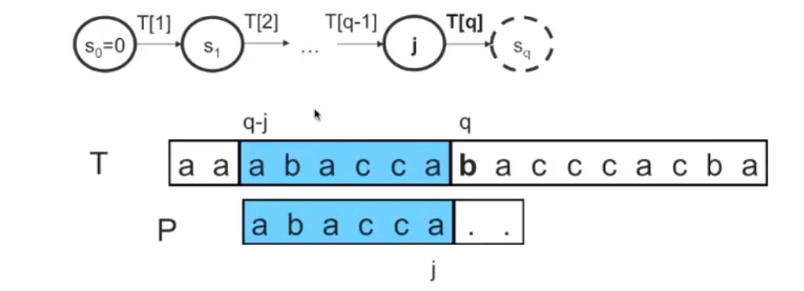
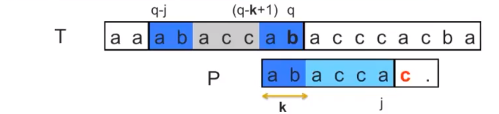
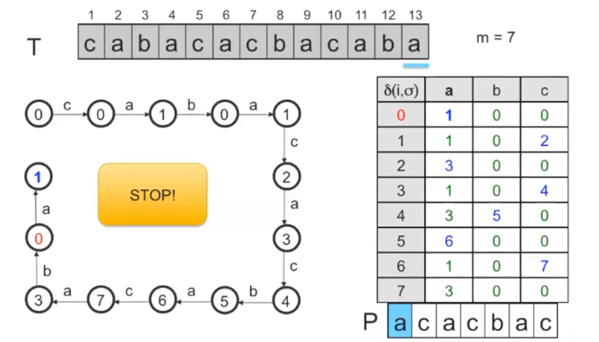
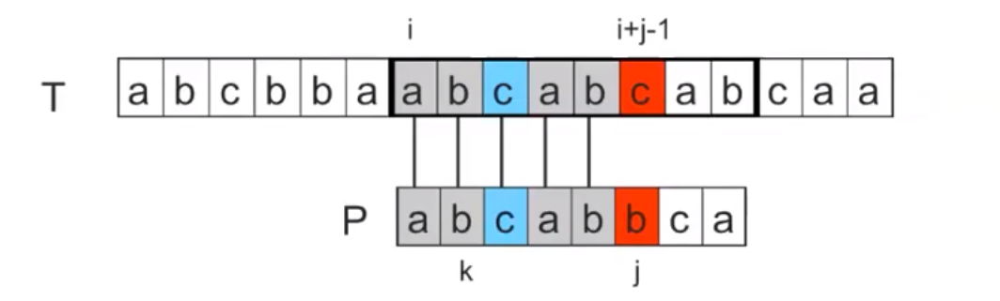
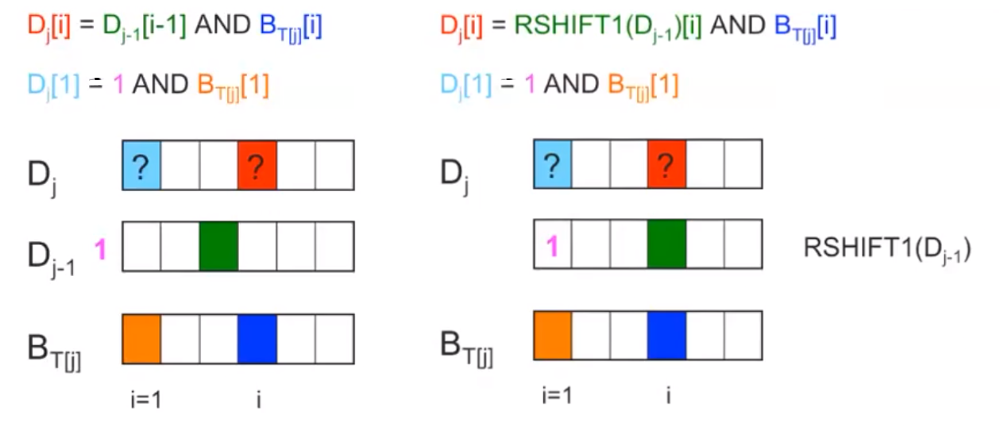
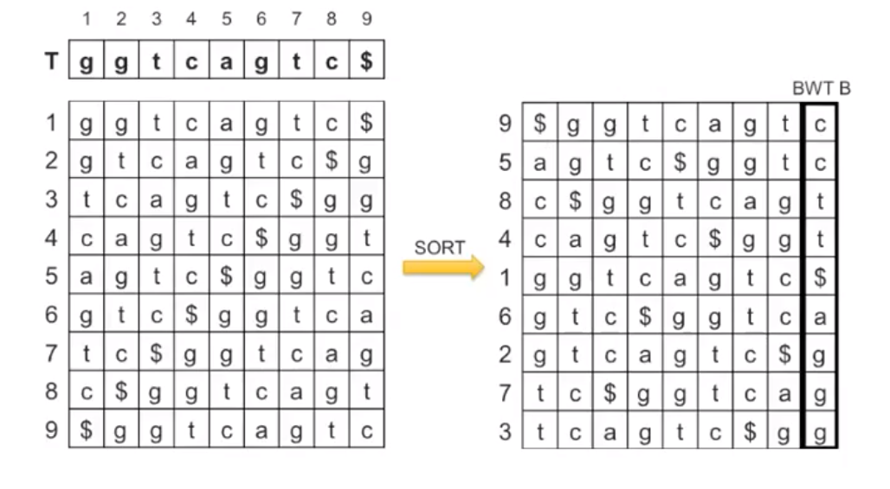
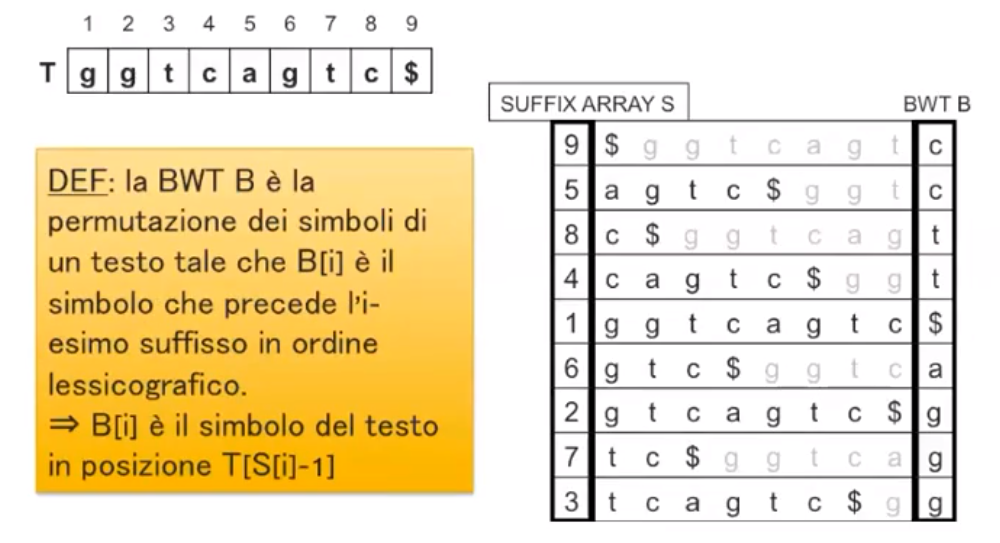

# PATTERN MATCHING

Il pattern matching è la ricerca di stringhe all'interno di un testo o la ricerca di un *motivo* all'interno di un *oggetto complesso*.
In particolare, il pattern matching su stringhe cerca, all'interno di un *testo* $T$ le occorrenze di un *pattern* $P$ e ci sono due varianti di esso:

- Pattern matching *esatto*: trova le occorrenze ***esatte*** di $P$ in $T$ *(ci concentreremo su questo)*
- Pattern matching *approssimato*: trovare le occorrenze ***approssimate*** di $P$ in $T$

## DEFINIZIONI PRELIMINARI

- **STRINGA**: una sequenza di simboli appartenenti ad un dato insieme $\Sigma$ detto *alfabeto*
  $X = x_1, x_2,\ ...\ x_n$         $x_i \in \Sigma\ \ \forall i$

  

- **LUNGHEZZA**:
  Indicheremo con $[X]$ la lunghezza di $X$ e con $X[i]$ il simbolo $x_i$ in posizione $i$ di $X$
  Indicheremo anche con $\epsilon$ la stringa vuota di lunghezza $0$

  Esempio: $X = bba\underline ccbbaac$         $X[4] = \underline c$

  

- **SOTTOSTRINGA**:
  Indicheremo con $X[i,j]$ la *sottostringa* di $X$ dalla posizione $i$ alla posizione $j$
  Diremo inoltre che $X[i,j]$ è una ***sottostringa propria*** di $X$ se $i \neq 1 \land j \neq |X|$

  $X = bba \underline{ccbba}ac$         $X[4,8] = \underline{ccbba}$

  

- **PREFISSO**: La sottostringa $X[1,j]$ viene detta *prefisso* di $X$ di lunghezza $j$
  Se $j \neq |X|$ diremo che $X[1,j]$ è un ***prefisso proprio***
  Se $j = 0$, $X[1,0]$ è il *prefisso nullo* $\epsilon$

  

- **SUFFISSO**: La sottostringa $X[i, |X|]$ è il *suffisso* di $X$ di lunghezza $|X|-i+1$

### PATTERN MATCHING ESATTO

**INPUT**: un testo $T$ di lunghezza $n$ e un pattern $P$ di lunghezza $m$ definiti su alfabeto $\Sigma$
**OUTPUT**: tutte le *occorrenze esatte* di $P$ in $T$, ovvero tutte e posizioni $i$ di $T$ in cui $T[i, i+m-1] = P$

Diciamo che $P$ *occorre esattamente* in posizione $i$ di $T$ se la sottostringa $T[i, i+ |P| - 1]$ coincide con $P$
Esempio: $T = bba \underline{ccbb} aac$         $P = \underline{ccbb}$         $i = 4$

**ALGORITMO BANALE**
Una finestra $W$ lunga $m = |P|$ scorre il testo $T$ da sinistra a destra e confronta i simboli di $P$ con i corrispondenti simboli di $T$ all'interno della finestra $W$ da sinistra verso destra e se tutti i simboli combaciano viene prodotta un'occorrenza in output.

Nel caso peggiore questo algoritmo ha complessità $O(nm)$ poiché non tiene conto delle caratteristiche né del pattern né del testo.

### PATTERN MATCHING APPROSSIMATO

**INPUT**: un testo $T$ di lunghezza $n$ ed un pattern $P$ di lunghezza $m$ definiti su un alfabeto $\Sigma$ e una soglia di errore $k$
**OUTPUT**: tutte le *occorrenze approssimate* di $P$ in $T$

**DISTANZA DI EDIT**: date due stringe $X_1$ e $X_2$ si definisce *distanza di edit* il minimo numero di operazioni di sostituzione, cancellazione e inserimento di un simbolo che trasformano $X_1$ in $X_2$ *(o viceversa)*. Questa distanza fornisce quindi la misura della differenza tra le due stringhe, ovvero $X_1$ è *approssimativamente* uguale a $X_2$ a meno della distanza di edit.
Diremo quindi che $P$ ha un'**occorrenza approssimata** in $T$ in posizione $i$ se esiste *(almeno)* una sottostringa $T[i-L+1, i]$ che ha distanza di edit al più $k$ con $P$.
$L$ rappresenta la lunghezza del pattern *approssimato*.

## RICERCA ESATTA CON AUTOMA A STATI FINITI

Vedremo un algoritmo basato sugli automi a stati finiti per la ricerca esatta basato sul confronto di simboli di $P$ e $T$ che esegue un ***preprocessing*** di $P$ in tempo $O(m|\Sigma|)$ ed esegue la ricerca in tempo $O(n)$.

### BORDO

Prima di introdurre l'algoritmo abbiamo però bisogno della definizione di *bordo*.

**BORDO**: il bordo $B(X)$ della stringa $X$ è il più lungo prefisso proprio di $X$ che occorre come suffisso di $X$.
Per definizione il bordo è un prefisso ***proprio***, quindi non può coincidere con l'intera stringa $X$.

Esempio 1: $X = \underline{baac}cb\bold{baac}$         $B(X) = baac$
Esempio 2: $X = aaaccbbaac$         $B(X) = \epsilon$ 
Esempio 3: $X = \underline{ab\bold{aba}}\bold{ba}$            $B(X) = ababa$
Esempio 4: $X = \underline abbcccbb\bold a$           $B(X) = a$
Esempio 5: $X = \underline{a\bold{aaaaaa}} \bold a$         $B(X) = aaaaaaa$
Esempio 6: $X = \sigma$ simbolo qualsiasi         $B(X) = \epsilon$

Un'altra definizione utile è quella di *concatenazione*: concateniamo la stringa $X$ col simbolo $\sigma$ scrivendo $X \sigma$.
Esempio: $X = bba$         $\sigma = d$         $X\sigma = bbad$

### PREPROCESSING PATTERN

Per effettuare il preprocessing del pattern $P$ l'algoritmo calcola la **funzione di transizione $\delta$**.
La funzione $\delta$ rappresenta una transizione dallo stato $j$ allo stato $\delta(j, \sigma)$ che consuma il simbolo $\sigma$.ed è definita come $\delta : \{0, 1,\ ...,\ m\} \cp \Sigma \to \{0,1,\ ...,\ m\}$ tale che:

- $\delta(j, \sigma) = j+1 \Longleftrightarrow j < m \land P[j+1] = \sigma$

  Ovvero è uguale a $j+1$ sse $j$ è minore della lunghezza del pattern e se il simbolo in posizione $j+1$ del pattern è proprio il simbolo $\sigma$ in input alla funzione.

  In questo caso si ha una transizione dallo stato $j$ allo stato successivo $j+1$.

  

- $\delta(j,\sigma) = k \Longleftrightarrow P[j+1] \neq \sigma \lor j = m$         con $k = |B(P[1,j] \sigma)|$

  Ovvero è uguale alla lunghezza del bordo del prefisso del pattern di lunghezza $j$ concatenato al simbolo $\sigma$ se il simbolo in posizione $j+1$ del pattern è diverso da $\sigma$ o se $j=m$.
  Varrà sempre $k \leq j$ poiché $k$ è la lunghezza del bordo di una stringa lunga $j+1$.

  In questo caso si ha una transizione da uno stato $j$ ad uno stato *precedente* $k \leq j$ *(sarà un nuovo stato ma il numero ad esso associato è minore o uguale a $j$)*.

Esempio:
$P = acacb\underline abbaabac$         $\delta(6, b) = 7$ poiché $6 < |P| \land P[7] = b$
$P = acacbabbaabac$         $\delta(0,a) = 1$
$P = acacb \underline a bbaabac$         $\delta(6,c) = 2$ poiché $P[7] \neq c$ e $B(P[1,6]c) = B(\underline{ac}acb\bold{ac}) = ac$
$P = acacbabbaabac$         $\delta(0,c) = 0$ poiché $B(c) = \epsilon$
$P = acacbabbaaba\underline c$         $\delta(13, a) = 3$ poiché $B(\underline{aca}cbabbaab\bold{aca}) = aca$

**OSSERVAZIONI**

1. Dallo stato $0$ si arriva allo stato $0$ per qualsiasi simoblo $\sigma \neq P[1]$
   Dallo stato $0$ si arriva allo stato $1$ attraverso il simbolo $P[1]$

2. Dallo stato $m$ si arriva sempre ad uno stato $k \leq m$ e si può tornare ad uno stato $m$

   Esempio: $P = aaaaaa$         $\delta(6,a) =|B(\underline{a\bold{aaaaa}}\bold a)| = 6$

Esercizio: $P = acacbac$			$m = 7$			$\Sigma = \{a,b,c,d\}$

| $\delta(j,\sigma)$ |  0   |  1   |  2   |  3   |  4   |  5   |  6   |  7   |
| :----------------: | :--: | :--: | :--: | :--: | :--: | :--: | :--: | :--: |
|       **a**        |  1   |  1   |  3   |  1   |  3   |  6   |  1   |  3   |
|       **b**        |  0   |  0   |  0   |  0   |  5   |  0   |  0   |  0   |
|       **c**        |  0   |  2   |  0   |  4   |  0   |  0   |  7   |  0   |
|       **d**        |  0   |  0   |  0   |  0   |  0   |  0   |  0   |  0   |

Conviene riempire prima le posizioni relative ai casi in cui $P[j+1] = \sigma$ e poi procedere col resto.
Notare che i simboli $\in \Sigma$ ma $\notin P$ corrispondo sempre allo stato $0$.

Esercizio: Questa volta abbiamo a disposizione la tabella incompleta *(i valori forniti sono quelli in grassetto e corsivi)* e dobbiamo calcolare il pattern sapendo che $m = 6$ e $\Sigma = \{a,b,c,d\}$ e completare la tabella.

| $\delta(j, \sigma)$ |    a    |    b    |    c    |    d    |
| :-----------------: | :-----: | :-----: | :-----: | :-----: |
|        **0**        | ***1*** |    0    |    0    |    0    |
|        **1**        |    1    |    0    | ***2*** |    0    |
|        **2**        |    1    | ***3*** |    0    |    0    |
|        **3**        | ***4*** |    0    |    0    |    0    |
|        **4**        | ***5*** |    0    |    2    |    0    |
|        **5**        |    1    |    0    |    2    | ***6*** |
|        **6**        |    1    |    0    |    0    |    0    |

$P = acbaad$
Basta prendere i valori della tabella in ordine crescente. A questo punto possiamo completare la tabella calcolando $\delta$.

Esercizio: Specificare i primi tre simboli e gli ultimi due del pattern $P = \_\ \_\ \_\ .\ \_\ \_$

| $\delta(j, \sigma)$ |    a    |  b   |    c    |
| :-----------------: | :-----: | :--: | :-----: |
|        **0**        |         |      | ***1*** |
|        **1**        | ***2*** |      |         |
|        **2**        |         |      |         |
|        **3**        |         |      |         |
|        **4**        |         |      |         |
|        **5**        |         |      |         |
|        **6**        |         |      | ***3*** |

Dalle prime righe della tabella otteniamo $P = ca\ \_\ .\ \_\ \_$
Notiamo che $Pc$ ha un bordo di lunghezza 3 *(notare tabella in posizione \[6,c\])*, ovvero $B(ca\ \_\ .\ \_\ \_\ c) = 3$
Questo significa necessariamente che gli ultimi due simboli del pattern sono i primi $ca$ e che il terzo è il simbolo $c$ concatenato. Quindi $P = cac.ca$

### SCANSIONE DEL TESTO

Per effettuare la ricerca di $P$ in $T$

- Si parte da uno stato iniziale $s_0 = 0$
- Si legge il testo $T$ dal simbolo in posizione $1$ al simbolo in posizione $n$
- Ad ogni posizione $q$ da $1$ a $n$ è associato uno stato $s_q$ ottenuto dalla regola di transizione $\delta$

Quali sono però gli stati che identificano un'occorrenza esatta di $P$ in $T$?
Facciamo delle supposizioni:

1. Supponiamo che $j$ sia la lunghezza del più lungo prefisso di $P$ che ha un'occorrenza in $T$ che finisce in posizione $q-1$ e che quindi inizia in posizione $q-j$
2. Supponiamo che $j$ sia lo stato $s_{q-1}$ a cui l'algoritmo arriva dopo aver letto il simbolo $T[q-1]$

Che valore ha il nuovo stato $s_q$?

- CASO 1: $j < m \land P[j+1] = T[q]$
  In questo caso il nuovo stato $s_q$ avrà valore $j+1$
  Quindi in questo caso $P[1, j+1]$ ha un'occorrenza in $T$ che inizia in $q-(j+1)+1$ e finisce in $q$
  Ovvero l'occorrenza del prefisso inizia in $q\ - $ stato di arrivo $+\ 1$

  In particolare, se $j+1=m$, abbiamo un'occorrenza di $P$ in $T$ che inizia in posizione $q-m+1$, quindi gli stati che ci identificano delle occorrenze del pattern nel testo sono quelli di valore $m$

- CASO 2: $j = m \lor P[j+1] \neq T[q]$
  Per semplicità dividiamo i due sottocasi:

  - CASO 2.1: $j < m \land P[j+1] \neq T[q]$
    Il nuovo stato $s_q$ avrà un valore $k\leq j$
    Questo implica che $P[1,k]$ ha un'occorrenza in $T$ che inizia in $q-k+1$ e finisce in $q$
    Questo ci permette di *scartare* l'occorrenza l'iniziale di $P[1, j]$ e ricominciare a controllare il testo dalla nuova occorrenza $P[1, k]$. Inoltre, per la definizione di bordo *(che considera i prefissi)*, siamo sicuri di non saltare occorrenze intermedie.
    
  - CASO 2.2: $j = m$
    In questo caso abbiamo un'occorrenza del pattern nel testo che finisce in $q-1$
    Il nuovo stato $s_q$ sarà $k \leq m$; come nel caso precedente otteniamo un'occorrenza $P[1,k]$ che inizia in $q-k+1$ e identifica una possibile occorrenza sovvrapposta *(se passiamo ad un altro stato $m$ abbiamo trovato effettivamente una seconda occorrenza del pattern nel testo che finisce in $q$)*.

In generale una transizione di stato ci dice che il prefisso di $P$ di lunghezza identificata dallo stato d'arrivo occorre in $T$ in posizione $q\ -$ stato d'arrivo $+\ 1$.

Esercizio

Per effettuare la scansione del testo a livello di esercizio dobbiamo costruire l'automa scansionando il testo e consultando ad ogni passo la tabella della funzione $\delta$. Ogni qual volta si raggiunge uno stato $m$ avremmo un'occorrenza del pattern nel testo; in questo caso c'è n'è solo una ed è quella che inizia in $T[4]$.

All'esame è utile indicare anche, per ogni stato, il prefisso del pattern e la sua occorrenza nel testo.

## RICERCA ESATTA CON KMP

L'algoritmo presenta un preprocessing in tempo $O(m)$ del pattern $P$ di lunghezza $m$ calcolando una *prefix-function* $\phi$ *(detta anche funzione di fallimento)*.

### PREFIX FUNCTION

Dato il pattern $P$ di lunghezza $m$ la prefix function $\phi$ è definita come:
$\phi : \{0,1,\ ...,\ m\} \to \{-1,0,1,\ ...,\ m-1\}$ tale che

- $\phi(j) = |B(P[1,j])|$         se         $1 \leq j \leq m$
- $\phi(j) = -1$         se         $j = 0$

Esempio $P = abcabaabcabab$

|   j    |  0   |  1   |  2   |  3   |  4   |  5   |  6   |  7   |  8   |  9   |  10  |  11  |  12  |  13  |
| :----: | :--: | :--: | :--: | :--: | :--: | :--: | :--: | :--: | :--: | :--: | :--: | :--: | :--: | :--: |
| $\phi$ |  -1  |  0   |  0   |  0   |  1   |  2   |  1   |  1   |  2   |  3   |  4   |  5   |  6   |  2   |

Il KMP calcola la prefix function per induzione, ma per fare ciò dobbiamo dare anche la definizione ricorsiva di bordo:

#### BORDO RICORSIVO

1. Il bordo della stringa vuota è la stringa vuota stessa $B(\epsilon) = \epsilon$
2. Il bordo di una stringa composta da un solo simbolo è la stringa vuota $B(\sigma) = \epsilon$
3. Il bordo $B(X\sigma)$ è
   1. $B(X)\sigma$         se $\sigma$ è il simbolo di $X$ in posizione $|B(X)| +1$
   2. $B(B(X)\sigma)$         altrimenti

#### CALCOLO DI $\phi$ PER INDUZIONE

Per $j=0$ e $j=1$ il calcolo è immediato; $\phi(0) = -1$ e $\phi(1) = 0$
Per calcolare $\phi(j)$ per $j > 1$ supponiamo che $\phi$ sia nota per gli indici precedenti tra $0$ e $j-1$.

Notiamo che possiamo esprimere $P[1,j]$ come $P[1, j-1]P[j]$ e quindi
$\phi(j) = |B(P[1,j])| = |B(P[1, j-1]P[j])|$

Chiamiamo $|B(P[1, j-1])| = k_1 = \phi(j-1)$
Per applicare ora la definizione ricorsiva di bordo a $B(P[1,j-1]P[j])$ abbiamo due casi:

1. $P[k_1 +1] = P[j]$

   $B(P[1, j-1]P[j]) = B(P[1, j-1])P[j]$ per definizione di bordo ricorsiva

   Applichiamo ora il modulo $|B(P[1, j-1])P[j]| = |B(P[1, j-1])| + 1$

   Notiamo che possiamo riscrivere $|B(P[1, j-1])| +1 = \phi(j-1) + 1$

   

2. $P[k_1 +1] \neq P[j]$
   In questo caso avremo $B(P[1,j-1]P[j]) = B(B(P[1,j-1])P[j])$
   Notiamo che poiché $|B(P[1, j-1])| = k_1$, $B(P[1, j-1]) = P[1,k_1]$

   Possiamo quindi scrivere $B(B(P[1,j-1])P[j]) = B(P[1, k_1]P[j])$

   Notiamo ora che da questo punto ci ritroviamo di nuovo di fronte ai due casi ricorsivamente.

**IN GENERALE**

- Se raggiungiamo un valore $k_p$ tale per cui $P[k_p +1] = P[j]$ allora $\phi(j) = k_p +1$
- Altrimenti prima o poi si raggiungerà $k_p = -1$ che implica che il bordo di $P[1,j]$ è nullo e quindi $\phi(j) = 0$ e quindi ancora uguale a $k_p +1$

### SCANSIONE DEL TESTO

Una volta calcolata la prefix function, KMP esegue la scansione del testo in tempo lineare per cercare le occorrenze esatte di $P$.
La scansione avviene tramite una finestra $W$ lunga $m$ che scorre lungo $T$. Per ogni posizione di $W$, ogni simbolo di $P$ viene confrontato col rispettivo simbolo del testo. Se tutti i simboli corrispondono allora nella posizione $i$ di $T$ esiste un'occorrenza esatta di $P$ e successivamente la finestra viene spostata in una nuova posizione e il confronto ripetuto; lo spostamento avviene utilizzando la funzione $\phi$. Inoltre, il confronto riparte dal simbolo che aveva dato mismatch col pattern nella vecchia finestra.

Supponiamo che la finestra si trovi in posizione $i$ su $T$ e che il primo carattere di $P$ che determina mismatch sia in posizione $j >1$, e quindi il simbolo di mismatch su $T$ sarà in posizione $i+j -1$.

Per definizione sappiamo che $k = \phi(j-1) = |B(P[1,j-1]|$
Notiamo che $P[1,k]$ ha un'occorrenza su $T$ in posizione $i$, ma ne ha anche un'altra in posizione $p = i+j-k-1 = i+j - \phi(j-1) -1$

A questo punto la finestra può essere spostata in $p$ senza perdere occorrenze di $P$ per definizione di bordo.
Inoltre, i primi $k = \phi(j-1)$ simboli di $P$ hanno un matching con $T$ a partire dalla nuova posizione $p$ e quindi il confronto può ripartire da $i+j-1$ su $T$ e da $k+1 = \phi(j-1)+1$ su $P$.

**CASI PARTICOLARI**

- Quando $\phi(j-1) = 0$
  - $W$ viene spostata nella posizione $p = i+j - \phi(j-1) - 1 = i+j-1$
  - I primi $\phi(j-1)$ simboli di $P$ non vengono più confrontati; si confronta nuovamente tutto il pattern.
- Quando $j=1$
  - $W$ viene spostata nella posizione $p = i + 1 - \phi(0) -1 = i-(-1) = i+1$
  - I primi $-1$ simboli di $P$ non vengono confrontati; confronto di nuovo tutti i simboli del pattern.
- Quando $j = m+1$
  - $W$ viene spostata alla posizione $p = i+j-\phi(j-1) -1 = i+m -\phi(m)$
    Inoltre, questo significa che c'è un mismatch nella posizione $i+m$ e che quindi in posizione $i$ c'è un'occorrenza del pattern nel testo.
  - I primi $\phi(m)$ caratteri del pattern non vengono più confrontati

## RICERCA ESATTA CON BYG (SHIFT-AND)

Anche questo algoritmo prevede uno step di preprocessing in tempo $O(|\Sigma|+m)$ che calcola una tabella $B$ di $|\Sigma|$ parole di $m$ bit e un successivo step di scansione del testo $T$ in tempo $O(n)$.
L'algoritmo si basa sul paradigma shitf-and e quindi non compie operazioni di comparazione tra bit ma opera su parole di bit.

Le operazioni usate da BYG sono

1. Congiunzione *(AND)*
   $w[i] = 1 \Longleftrightarrow w_1[i] = 1 \land w_2[i] = 1$
   $w[i] = 0\ \ \ altrimenti$

   $1010\ \ \ AND\ \ \ 0110\ \ \ =\ \ \ 0010$

2. Disgiunzione inclusiva *(OR)*
   $w[i] =0 \Longleftrightarrow w_1[i] = 0 \land w_2[i] = 0$

   $w[i] = 1\ \ \ altrimenti$

   $1010\ \ \ OR\ \ \ 0110\ \ \ =\ \ \ 1110$

3. Shift dei bit di una posizione a destra con bit più significativo uguale a $0$ *(RSHIFT)*
   $w[1] = 0$
   $w[i] = w_1[i-1]\ \ \ per\ 1 < i \leq |w|$

   $RSHIFT (\underline{101}0) = 0\underline{101}$

4. Shift dei bit di una posizione a destra con bit più significativo uguale a $1$ *(RSHIFT1)*
   Notiamo che questa può essere realizzata eseguendo un $RSHIFT$ e poi effettuando un $OR$.
   $w[1] = 1$
   $w[i] = w_1[i-1]\ \ \ per\ 1 < i \leq |w|$

   $RSHIFT1(\underline{101}0) = 1\underline{101}$

### PREPROCESSING

Definiamo la parola $B_\sigma$ per $\sigma \in \Sigma$

$B_\sigma = b_1\ b_2\ ...\ b_m$      tali che      $B_\sigma[i] = b_i = 1 \Longleftrightarrow P[i] = \sigma$

Esempio: $P = abcaba$         $\Sigma = \{a,b,c,d\}$
$B_a = 100101$			$B_b = 010010$			$B_c = 001000$			$B_d = 000000$

La tabella $B$ serve a rispondere alla domanda "$P[i] = \sigma?$" effettuando un controllo riga-colonna controllando il bit $i-esimo$ in corrispondenza del simbolo $\sigma$. Quindi $P[i] =\sigma \Longleftrightarrow B_\sigma[i] = 1$.

#### ALGORITMO DI CALCOLO DI $B$

1. Tutte le parole $B_\sigma$ sono inizializzate a $m$ zeri
2. Viene inizializzata una parola $M$ *(maschera)* di $m$ bit tutti uguali a $0$ tranne il più significativo che è uguale a $1$
3. Si scansiona il pattern $P$ da sinistra a destra e per ogni posizione $i$
   1. $B_{P[i]} = M\ \ \ OR\ \ \ B_{P[i]}$
   2. $M = RSHIFT(M)$

Esempio: $P = abcaba$			$\Sigma = \{a,b,c,d\}$

1. $B_a = 000000$			$B_b = 000000$			$B_c = 000000$			$B_d = 000000$
2. $M = 100000$
3. 1. $B_a = M\ \ \ OR\ \ \ B_a = 100000$
      $M = RSHIFT(M) = 010000$
   2. $B_b = M\ \ \ OR\ \ \ B_b = 010000$
      $M = RSHFIT(M) = 001000$
   3. $B_c = 001000$
      $M = 000100$
   4. $B_a = M\ \ \ OR\ \ \ B_a = 000100\ \ \ OR\ \ \ 100000 = 100100$
      $M = 000010$
   5. $B_b = 010010$
      $M = 000001$
   6. $B_a = 100101$
      $M = 000000$

### SCANSIONE DEL TESTO

1. Il testo viene scandito dalla prima all'ultima posizione
2. Per ogni posizione $j$ del testo $T$ viene calcolata una parola $D_j$ di $m$ bit
3. Ogni volta che $D_j$ ha il bit meno significativo uguale a $1$, viene prodotta in output l'occorrenza esatta alla posizione $j-m+1$

Denotiamo con $P[1,i] = suff(T[1,j])$ il fatto che $P[1,i]$ occorre esattamente come suffisso di $T[1,j]$
Esempio: $T = abcb\underline{abc}abaadc$			$P = \underline{abc}aba$			$P[1,3] = suff(T[1,7])$

#### DEFINIZIONE DI PAROLA $D_j$ $0 \leq j \leq n$

$D_j = d_1\ d_2\ ...\ d_m$ 			tali che			$d_i = D_j[i] = 1 \Longleftrightarrow P[1,i] = suff(T[1,j])$

Esempio: $P = \underline{abcbcbc}abaadc$			$P = cbcbca$			$j = 7$
$D_7 = d_1\ d_2\ d_3\ d_4\ d_5\ d_6$
$d_1 = 1$			$P[1,1] = c = suff(T[1,7]) = suff(abcbcbc)$
$d_2 = 0$			$P[1,2] = cb \neq suff(T[1,7])$
$d_3 = 1$			$P[1,3] = cbc = suff(T[1,7])$
$d_4 = 0$			$P[1,4] = cbcb \neq suff (T[1,7])$
$d_5 = 1$			$P[1,5] = cbcbc = suff(T[1,7])$
$d_6 = 0$			$P[1,6] = cbcbca \neq suff(T[1,7])$

$D_7 = 101010$

In particolare, la parola $D_0$ è per definizione $D_0 = 0\ 0\ ...\ 0$	$\forall i\ P[1,i] \neq suff(T[1,0])$
Inoltre $d_m = D_j[m] = 1 \Longleftrightarrow P[1,m] = suff(T[1,j])$ cioè $P$ occorre esattamente in $T$ che finisce in $j$ e quindi inizia in $j-m+1$

La scansione del testo quindi procede come segue:

1. Inizia dalla parola $D_0 = 0\ 0\ ...\ 0$
2. Per ogni $1 \leq j \leq n$ calcola la parola $D_j$ a partire dalla parola $D_{j-1}$
3. Ogni volta che $D_j$ ha il bit meno significativo a $1$ produce in output la posizione $j-m+1$

##### CALCOLO DI $D_j$ A PARTIRE DA $D_{j-1}$

Sappiamo che $D_j[i] = 1 \Longleftrightarrow P[1,i] = suff(T[1,j])$
Possiamo però anche scrivere
$D_j[i] = 1 \Longleftrightarrow P[1, i-1] = suff(T[1, j-1]) \land P[i] = T[j]$

Notiamo che $P[1,i-1] = suff(T[1,j-1]) \Longleftrightarrow D_{j-1}[i-1] = 1$
E che $P[i] = T[j] \Longleftrightarrow B_j[i] = 1$

Quindi $D_j[i] = D_{j-1}[i-1] = 1 \ \ \ AND\ \ \  B_{T[j]}[i] = 1$

Ovvero per $i > 1$, l'$i$-esimo bit della parola $D_j$ è uguale all'AND logico tra l' $(i-1)$-esimo della parola $D_{j-1}$ e l'$i$-esimo bit della parola $B_{\sigma}$ in corrispondenza del simbolo $\sigma = T[j]$

Per $i = 1$ abbiamo $D_j[1] = 1 \Longleftrightarrow P[1,1] = suff(T[1,j]) \Longleftrightarrow P[1] = T[j]$
Notiamo che $P[1] = T[j] \Longleftrightarrow B_{T[j]}[1] =1$

Quindi $D_j[1] = B_{T[j]}[1]$, ma scriveremo $D_j[1] = 1\ \ \ AND\ \ \ B_{T[j]}[1]$ perché $D_{j-1}[0]$ non è definita.

Possiamo notare che conviene effettuare una $RSHIFT1$ sulla parola $D_{j-1}$ per allineare tutte le parole.

Abbiamo quindi in generale $D_j[i] = RSHIFT1(D_{j-1}[i])\ \ \ AND\ \ \ B_{T[j]}[i]$

Ancora più generalmente, visto che ora i bit sono tutti allineati, possiamo scrivere $D_j = RSHIFT1(D_{j-1})\ \ \ AND\ \ \ B_{T[j]}$

Quindi la scansione viene definitivamente eseguita come

1. Inizializza una maschera $M = 0\ 0\ ...\ 1$ di $m$ bit tutti a $0$ tranne l'ultimo
2. Inizializza $D_0 = 0\ 0\ ...\ 0$
3. Per $1  \leq j \leq n$ calcola $D_j = RSHIFT1(D_{j-1})\ \ \ AND\ \ \ B_{T[j]}$
4. Ogni volta che $D_j\ \ \ AND\ \ \ M = 0\ 0\ ...\ 1$ produce in output la posizione $j-m+1$

## RICERCA APPROSSIMATA CON WM (SHIFT-AND)

Questo algoritmo esegue un preprocessing del pattern $P$ in tempo $O(|\Sigma| + m)$ che calcola una tabella $B$ di $|\Sigma|$ parole di $m$ bit e poi scansiona il testo in tempo $O(nk)$ per cercare le occorrenze approssimate di $P$ in $T$ a meno di $k$. 

Il preprocessing di fatti è quello della BYG, ci concentriamo quindi sulla scansione.

L'algoritmo effettua $k+1$ iterazioni di scansione del testo $T$ per $0 \leq h \leq k$ dove l'iterazione $h$ trova ***tutte*** le occorrenze del pattern $P$ col al più $h$ errori.
All'iterazione $h = 0$ si trovano quindi tutte le occorrenze esatte.

La generica iterazione $h$ calcola $n$ parole $D^h_j$ lunghe $m$ bit tali che $D^h_j[m] = 1$ sse $P$ ha un'occorrenza che finisce in $j$ con al più $h$ errori.

### PAROLA $D_j^h$

Denotiamo con $P[1,i] = suff_h(T[1,j])$ il fatto che $P[1,i]$ occorre come suffisso di $T[1,j]$ con al più $h$ errori.

Abbiamo per $0\leq j\leq n$ e $0 \leq h \leq k$
$D_j^h = d_1\ d_2\ ...\ d_m$	tale che	$d_i = D^h_j[i] = 1 \Longleftrightarrow P[1,i] = suff_h(T[1,j])$

In particolare $D_0^h = 1\ \ \ \forall i \leq h$	e	$D_0^h = 0\ \ \ \forall i > h$
Inoltre $D_0^0 = 0\ 0\ ...\ 0$

Infine $d_m = 1$ sse $P[1,m]= suff_h(T[1,j])$, ovvero se tutto $P$ occorre in $T$ con $h$ errori *(e quindi anche con al più $k$ errori)*
Questo implica che anche l'ultimo bit dell'ultima parola è $1$, ovvero $D_j^h[m] = 1 \implies D_j^k[m] = 1$

### SCANSIONE DEL TESTO

1. Alla prima iterazione $h=0$, $T$ viene scandito per $1 \leq j \leq n$ per calcolare tutte le parole $D_j^0$ *(esegue quindi BYG)*
2. Alla generica iterazione $h>0$, per ogni posizione $j$ del testo viene calcolata la parola $D^h_j$
3. All'ultima iterazione $h=k$ ogni volta che la parola $D_j^k$ ha il bit meno significativo uguale a $1$ viene prodotta in output la posizione $j$ in cui finisce l'occorrenza approssimata

Vediamo ora come calcolare la generica parola $D_j^h$

- $i > 1$

  - CASO 1:
    $D_j^h[i] = 1 \Longleftrightarrow P[1,j] = suff_h(T[1,j])$

    Notiamo che $suff_h(T[1,j]) \impliedby P[1, i-1] = suff_h(T[1, j-1]) \land P[i] = T[j]$

    Scriviamo quindi $D_j^h[i] = 1\impliedby P[1, i-1] = suff_h(T[1, j-1]) \land P[i] = T[j]$

    Notiamo che $P[1, i-1] = suff_h(T[1, j-1]) \iff D_{j-1}^h[i-1] = 1$

    Scriviamo quindi $D_j^h = 1 \impliedby D_{j-1}^h[i-1] \land P[i] = T[j]$
    Notiamo ora che $P[i] = T[j] \iff B_{T[j]}[i] = 1$

    Quindi $D_j^h \impliedby D^h_{j-1}[i-1]\ \ \ AND\ \ \ B_{T[j]}[i]$

  - CASO 2:
    $D_j^h[i] = 1 \iff P[1,j] = suff_h(T[1,j]) \impliedby P[1,i-1] = suff_{h-1}(T[1, j-1])$
    In questo caso $P[i]$ e $T[j]$ possono anche essere diversi visto che abbiamo al più $h-1$ errori in $suff_{h-1}$

    Notiamo che $P[1, i-1] = suff_{h-1}(T[1, j-1]) \iff D_{j-1}^{h-1}[i-1] = 1$

    Quindi $D_j^h[i] \impliedby D_{j-1}^{h-1}[i-1]$

  - CASO 3:
    $D_j^h[i] = 1 \iff P[1,i] = suff_h(T[1,j]) \impliedby P[1,i] = suff_{h-1}(T[1, j-1])$
    In questo caso $T[j]$ genera un errore *(deve essere cancellato)*

    Abbiamo quindi $P[1,i] = suff_{h-1}(T[1, j-1]) \iff D_{j-1}^{h-1}[i] = 1$

    Quindi $D_j^h[i] \impliedby D_{j-1}^{h-1}[i]$

  - CASO 4:
    $D_j^h[i] = 1 \iff P[1,i] = suff_h(T[1,j]) \impliedby P[1,i-1] = suff_{h-1}(T[1, j])$
    In questo caso $P[i]$ genera un errore

    In questo caso otteniamo $D_j^h[i] \impliedby D_j^{h-1}$

  Avendo ora tutti e 4 i casi, possiamo calcolare la generica $D_j^h[i]$ mettendo tutti i casi in $OR$
  Ovvero $D_j^h[i] = (D_{j-1}^h[i-1]\ AND\ B_{T[j]}[i])\ OR\ D_{j-1}^{h-1}[i-1]\  OR\ D_{j-1}^{h-1}[i]\  OR\ D_j^{h-1}[i-1]$

- $i = 1$
  Notiamo che per $h > 0$ e $j > 0$, $P[1,1]$ occorre **sempre** come suffisso del prefisso $T[1,j]$ con al più $h$ errori *(grazie agli errori)*
  Quindi $D_j^h[1] = 1$   per   $h> 0$   e    $j>0$

  A questo punto sostituendo $i=1$ nella formula del caso $i>1$ notiamo che accediamo a dei bit in posizione $0$ che non esistono, ma sappiamo che questi bit devono essere $1$ per quanto visto prima.
  Otterremo quindi $D_j^h[1] = (1\ AND\ B_{T[j]}[1])\ OR\ 1\ OR\ D_{j-1}^{h-1}[1]\ OR\ 1$

  Quindi, come nella BYG, anche qui possiamo 1-shiftare le parole che usiamo in posizione $i-1$ per allineare il tutto.

La formula generale risulta quindi essere
$D_j^h = (RSHIFT1(D_{j-1}^h)\ AND\ B_{T[j]})\ OR\ RSHIFT1(D_{j-1}^{h-1})\\ OR\ D_{j-1}^{h-1}\ OR\ RSHIFT1(D_j^{h-1})$

#### FUNZIONAMENTO

1. Inizializza una maschera $M = 0\ 0\ ...\ 1$ di $m$ bit

2. Inizializza parola $D_0^0 = 0\ 0\ ...\ 0$

3. Calcola $D_j^0$ per $1 \leq j \leq n$    *(BYG)*

4. Per $h$ da $1$ a $k$
   1. Inizializza $D_0^h$ che ha i primi $h$ bit a $1$ e gli altri a $0$
   2. Per $j$ da $1$ a $n$ calcola $D_j^h$
      Se $h=k$ e $(D_j^k\ AND\ M) \neq 0$ produce in output l'occorrenza $j$
   
   

## STRUTTURE DI INDICIZZAZIONE

Una struttura di indicizzazione è una struttura dati che riorganizza un testo in maniera da rendere **facile** ed **efficiente** un compito che compiuto sul testo originale non risulta tale. Siamo quindi in presenza di una fase di preprocessing non del pattern ma del testo.

Prima di introdurre le strutture dati occorre stabilire un ordinamento dei simboli dell'alfabeto $\Sigma$ del testo, generalmente viene usato l'ordinamento lessicografico.

Esempio: per $\Sigma = \{a,c,g,t\}$ abbiamo $a < c < g <t$

Dobbiamo poi estendere $\Sigma$ con un simbolo *sentinella* $\$$ che viene considerato lessicograficamente minore di tutti gli altri. Infine, aggiungiamo questo simbolo sentinella alla fine del testo.

#### DEFINIZIONI

Definiamo il ***suffisso di indice $j$*** il suffisso $T[j, |T|]$ che inizia in posizione $j$ di $T$
Il suffisso di indice $|T| = T[|T|, |T|] = \$$ viene detto suffisso nullo.

Fissato l'ordine lessicografico per i simboli di $\Sigma$ possiamo ordinare anche i vari suffissi del testo;
**REGOLA PER ORDINARE DUE SUFFISSI** $s_1$ ed $s_2$:

- Sia $i$ la prima posizione a sinistra tale che $s_1[i] \neq s_2[i]$
- $s_1[i] < s_2[i] \implies s_1 < s_2$
- $s_1[i] > s_2[i] \implies s_1 > s_2$

Definiamo la ***rotazione di indice $j$*** la concatenazione del suffisso di indice $j$ con il prefisso $T[1,j-1]$
Esempio: $T = ggtcagtc\$$			$tcagtc\$gg$ è la rotazione di indice $3$

### SUFFIX ARRAY

Il Suffix Array di un testo $T$ lungo $n$ occupa $O(n\ log\ n)$ in spazio, non contiene informazioni sui simboli del testo e permette la ricerca esatta di un pattern di lunghezza $m$ in tempo $O(n\ log\ m)$.

Il Suffix Array di un testo $T$ *($\$$-terminato)* di lunghezza $n$ è un array $S$ di $n$ interi tale che $S[i] = j$ sse il suffisso di indice $j$ è l'$i$-esimo suffisso nell'ordinamento lessicografico dei suffissi di $T$.

Questo significa che l'$i$-esimo suffisso di $T$ è $T[S[i], n]$ qu eindi per $i < i' \implies T[S[i],n] < T[S[i'], n]$

Esempio: $T = ggtcagtc\$$		innanzitutto elenchiamo i suffissi

|   1   | g | g | t | c | a | g | t | c | $ |
| :---: | :---------------------------------------: | :---------------------------------------: | :---------------------------------------: | :---------------------------------------: | :---------------------------------------: | :---------------------------------------: | :---------------------------------------: | :---------------------------------------: | :---------------------------------------: |
| **2** |                     g                     |                     t                     |                     c                     |                     a                     |                     g                     |                     t                     |                     c                     |                     $                     |                                           |
| **3** |                     t                     |                     c                     |                     a                     |                     g                     |                     t                     |                     c                     |                     $                     |                                           |                                           |
| **4** |                     c                     |                     a                     |                     g                     |                     t                     |                     c                     |                     $                     |                                           |                                           |                                           |
| **5** |                     a                     |                     g                     |                     t                     |                     c                     |                     $                     |                                           |                                           |                                           |                                           |
| **6** |                     a                     |                     t                     |                     c                     |                     $                     |                                           |                                           |                                           |                                           |                                           |
| **7** |                     t                     |                     c                     |                     $                     |                                           |                                           |                                           |                                           |                                           |                                           |
| **8** |                     c                     |                     $                     |                                           |                                           |                                           |                                           |                                           |                                           |                                           |
| **9** |                     $                     |                                           |                                           |                                           |                                           |                                           |                                           |                                           |                                           |

Ora possiamo ordinarli e ottenere il suffix array $S$

$S[1] = 9$	$S[2] = 5$	$S[3] = 8$	$S[4] = 4$	$S[5] = 1$	$S[6] = 6$	$S[7] = 2$	$S[8] = 7$	$S[9] = 3$

#### RICERCA ESATTA CON SA

1. Preprocessing del testo $T$ per costruire il SA
2. Ricerca in tempo $O(m\ log\ n)$ del pattern $P$ di lunghezza $m$

Qualche osservazione

1. Se il pattern $P$ occorre $k$ volte in $T$, allora $P$ è prefisso di $k$ suffissi di $T$ i cui indici sono le occorrenze di $P$ in $T$
2. Gli indici dei $k$ suffissi di cui $P$ è prefisso sono consecutivi nel Suffix Array per definizione di esso
3. Se $P$ occorre in posizione $j$ di $T$ *(cioè $P$ è prefisso del suffisso di indice $j$)* ed è lessicograficamente minore *(o maggiore)* di un suffisso di indice $j'$, allora il suffisso di indice $j$ è lessicograficamente minore *(o maggiore)* del suffisso di indice $j'$

​	

L'algoritmo quindi si comporta come tale

1. Si considera inizialmente tutto l'intervallo $[1,n]$ di posizioni su $S$      Intervallo corrente di ricerca $[L,R]$

2. SI considera il suffisso di indice $S[p]$ relativo alla posizione di mezzo $p = (L+R)/2$ di $[L,R]$ e si verifica in temo $O(m)$

   1. $P < T[S[p], n]$

      Allora si ripete 2 considerando la prima metà dell'intervallo corrente come nuovo intervallo di ricerca

   2. $P > T[S[p], n]$

      Allora si ripete 2 considerando la seconda metà dell'intervallo corrente come nuovo intervallo di ricerca

   3. $P =$ prefisso di $T[S[p], n]$

      $P$ occorre in posizione $S[p]$ di $T$

L'algoritmo così come è trova una sola occorrenza di $P$ in $T$

### BWT

La $BWT$ è una permutazione ***reversibile*** dei simboli del testo di $T$ che tende ad avvicinare i simboli uguali *(è nata inizialmente per la compressione)*

Per costruire la $BWT$ di un testo dobbiamo

1. Costruire tutte le rotazioni di $T$ da quella di indice $1$ a quella di indice $n$
2. Ordinare lessicograficamente le rotazioni

La $BWT$ è data dall'ultima colonna della matrice ordinata.
Ovvero la $BWT$ $B$ di un testo $T$ è la permutazione dei simboli di $T$ tale che $B[i]$ è l'ultimo simbolo della $i$-esima rotazione.

La prima colonna della matrice ordinata è chiamata colonna $F$ ed è ***sempre*** la successione lessicografica dei simboli di $B$ *(e anche di $T$)*. Si noti anche che i simboli della colonna $F$ e della $B$ sulla stessa riga sono in una relazione tale che nel testo uno prece l'altro.

**PROPRIETÀ P1**
Per ogni posizione $i$, il simbolo $B[i]$ precede il simbolo $F[i]$ nel testo $T$ e il simbolo $B[1]$ è sempre l'ultimo simbolo del testo.

**PROPRIETÀ P2** *LAST-FIRST MAPPING*
L'$r$-esimo simbolo $\sigma$ in $B$ e l'$r$-esimo simbolo $\sigma$ in $F$ sono lo stesso simbolo del testo $T$

La funzione **Last-First Function** è la funzione che fa corrispondere a una posizione $i$ sulla $BWT\ B$ la posizione $j$ su $F$ in modo tale che $B[i]$ e $F[j]$ siano lo stesso simbolo del testo $T$, ovvero $j = LF(i)$

#### RICOSTRUZIONE DI $T$ DA $B$

Supponiamo di avere la $BWT\ B = cctt\$aggg$
La prima cosa da fare per poter ricostruire il testo è calcolare $F$ ordinando i simboli:

$F = \$accgggtt$
A questo punto mettiamo il $\$$ in ultima posizione e andiamo ad osservare, nella colonna $F$ quale simbolo precede il $\$$ nella colonna $B$ per inserirlo nel testo e cosi via per tutti gli altri simboli. Nel mentre si osservano i simboli che precedono quelli già inseriti bisogna tener contro della proprietà **P2** e tener quindi traccia di quale simbolo specifico stiamo osservando il precedente.

Quindi $T = ggtcagtc\$$

#### BWT E SA

Gli indici delle rotazioni secondo il loro ordine lessicografico indicano la colonna relativa al Suffix Array del testo $T$.
Questo implica che $B[i]$ precede il suffisso $T[S[i], n]$

 

### RICERCA ESATTA CON BWT

Prima di vedere la ricerca esatta dobbiamo definire i **Q-intervalli**:

**DEFINIZIOE 1 *(RISPETTO ALLA BWT)***
Data la $BWT\ B$ di un testo $T$ e una stringa $Q$ definita su $\Sigma$ *($\$$ escluso)*, il $Q$-intervallo è l'intervallo $[b, e)$ di posizioni che contiene i simboli che precedono i suffissi che condividono $Q$ come prefisso.

**DEFINIZIONE 2 *(RISPETTO AL SUFFIX ARRAY)***
Dato il Suffix Array $S$ di un testo $T$ e una stringa $Q$ definita su $\Sigma$ *($\$$ escluso)*, il $Q$-intervallo è l'intervallo $[b,e)$ di posizioni che contiene gli indici dei suffissi che condividono $Q$ come prefisso.

**N.B.** $[1, n+1)$ è il $Q$-intervallo per $Q = \epsilon$, relativo ai suffissi che condividono la stringa nulla come prefisso *(cioè tutti i suffissi di $T$)* 

Dato un $Q$-intervallo $[b,e)$

- I valori del Suffix Array in $[b,e)$ forniscono le occorrenze della stringa $Q$ nel testo
- I simboli della $BWT$ in $[b,e)$ sono i simboli che precedono le occorrenze della stringa $Q$ nel testo $T$
- Le occorrenze di $Q$ in $T$
  - Sono in numero pari a $e-b$
  - Iniziano nelle posizioni $S[b, e-1]$
  - Sono precedute dai simboli $B[b, e-1]$

**BACKWARD EXTENSION**: Dato un $Q$-intervallo $[b,e)$ e un simbolo $\sigma$, la *backward extension* di $[b,e)$ con $\sigma$ è il $\sigma Q$-intervallo

##### ALGORITMO DI RICERCA ESATTA

La ricerca di un pattern $P$ di lunghezza $m$ in un testo $T$ di cui si conosce la $BWT$ prevede

- $m$ iterazioni di backward extension successive a partire dal $\epsilon$-intervallo

  La generica iterazione $i$ estende il $Q$-intervallo per $Q = P[i+1,m]$ con il simbolo $P[i]$ e ottiene il $Q$-intervallo per $Q = P[i,m]$

- All'ultima iterazione viene trovato il $Q$-intervallo $[b,e)$ per $Q = P$

- I valori $S[b,e)$ del Suffix Array nel $P$-intervallo trovato forniscono le occorrenze di $P$ in $T$

- Se $P$ non occorre nel testo non si troverà il $P$-intervallo e le iterazioni si fermano prima

Il problema è calcolare la *backward extension* in modo efficiente.
Per trovare, dato un $Q$-intervallo $[b,e)$ e un simbolo $\sigma$ il $\sigma Q$-intervallo $[b', e')$

- Si considerano sulla $BWT$ tutte e sole le $k$ posizione in $[b,e)$ che contengono il simbolo $\sigma$.
  Le si chiamano $i_1, i_2,\ ...,\ i_k$
- I $k$ simboli $B[i_1], B[i_2],\ ...,\ B[i_k]$ *(tutti uguali a $\sigma$)* precedono i $k$ suffissi di indici $S[i_1], S[i_2],\ ...,\ S[i_k]$ *(rispettivamente)* che condividono $Q$ come prefisso comune
- I $k$ suffissi che si ottengono concatenando ogni simbolo $B[i_1], B[i_2],\ ...,\ B[i_k]$ al relativo suffisso che precedono condivideranno il prefisso comune $\sigma Q$
- Le $k$ posizioni $j_1, j_2,\ ...,\ j_k$ di tali suffissi, nell'ordinamento lessicografico dei suffissi di $T$, determinano un intervallo continuo di posizioni che sarà proprio il $\sigma Q$-intervallo $[b',e') = [j_1, j_{k}+1)$

### FM-INDEX

Dato un testo $T$ di lunghezza $n$ di cui si conosce la $BWT$ $B$, il suo FM-Index è composto dalle due funzioni $C$ ed $Occ$ definite come segue:

$C:\Sigma \to \N$
$C(\sigma)$ = numero di simboli in $B$ tali che siano $< \sigma$
Indica il numero di suffissi che iniziano con un simbolo inferiore a $\sigma$ e la massima posizione dell'ultimo suffisso che inizia con un simbolo immediatamente inferiore a $\sigma$

$Occ : \{1,2,\ ...,\ n+1\} \cp \Sigma \to \N$
$Occ(i, \sigma)$ = numero di simboli uguali a $\sigma$ in $B[1, i-1]$
Dalla funzione $Occ$ si può ricostruire la $BWT$ osservando la matrice prodotta e, per ogni riga, analizzando quale simbolo è stato incrementato. Dalla $BWT$ si può poi ricostruire il testo.

#### LF FUNCTION

Dato il simbolo $B[i]$ della $BWT\ B$, che precede il suffisso di indice $S[i]$, si ha che il suffisso $B[i]T[S[i], n]$ è l'$r$-esimo suffisso che inizia con un simbolo uguale a $B[i]$ sse in $B[1,j]$ esistono esattamente $r$ simboli uguali a $B[i]$

Quindi, la posizione assoluta $j$ del suffisso $B[i]T[S[i], n]$ sarà $j = p +r$ dove $p$ è il numero di suffissi che iniziano con un simbolo inferiore a $B[i]$

La **LF-Function** è la funzione che, data una posizione $i$ sulla $BWT\ B$, restituisce la posizione $j$ *(nell'ordinamento lessicografico)* del suffisso $B[i]T[S[i], n]$, cioè $j = LF(i) = p + r$

Osservazioni:

-  $B[i]$ precede $T[S[i], n]$ $\implies$ $B[i]$ p il simbolo di $T$ in posizione $S[i]-1$
- $B[i]$ precede $T[S[i], n]$ $\implies$ $B[i]T[S[i], n]$ è il suffisso di indice $S[i]-1$
- $j$ è la posizione di $B[i]T[S[i], n]$ nell'ordinamento lessicografico $\implies$ $S[j] = S[i]-1$

##### FM-INDEX

Possiamo esprimere $p+r$ in funzione della posizione $i$ sulla $BWT\ B$
$p$ = numero di simboli inferiori a $B[i] = C(B[i])$
$r$ = numero di simboli uguali a $B[i]$ in $B[1, i] = Occ(i+1, B[i]) = Occ(i, B[i])+1$
Poiché il numero di simboli uguali a $B[i]$ in $B[1,i]$ è uguale al numero di simboli uguali a $B[i]$ in $B[1,i-1] + 1$

Quindi $j = C(B[i]) + Occ(i, B[i]) + 1$

##### BACKWARD EXTENSION

Dato un $Q$-intervallo $[b,e)$ e un simbolo $\sigma$, il $\sigma Q$-intervallo $[b,'e')$ è calcolato come
$b' = LF(i_1)$			$e' = LF(i_k)+1$

Dove
$i_1$ è la più piccola posizione in $[b,e)$ tale che $B[i_1] = \sigma$
$i_k$ è la più grande posizione in $[b,e)$ tale che $B[i_k]= \sigma$

Scriviamo però $b' = C(B[i_1]) + Occ(i, B[i_1]) + 1$ e $e' = C[B[i_k]] + Occ(B[i_k]) +1 +1$

Ovviamente possiamo scrivere $C(B[i_1]) = C(B[i_k]) = C(\sigma)$ per definizioni di $i$

Notiamo che $Occ(i_1, \sigma) = Occ(b, \sigma)$ in quanto da $b$ a $i_1 -1$ non ci sono simboli $\sigma$
Notiamo anche che $Occ(i_k, \sigma) +1 = Occ(e, \sigma)$

Quindi possiamo scrivere
$b' = C(\sigma) + Occ(b, \sigma) +1$
$e' = C(\sigma) + Occ(e, \sigma) +1$

Abbiamo ottenuto il calcolo della backward extension in tempo costante.