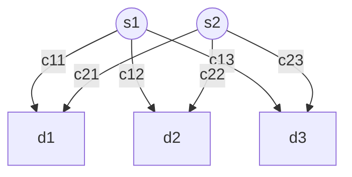
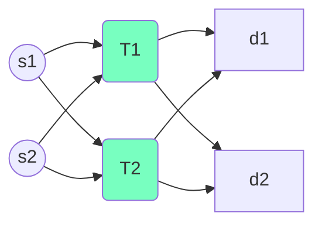
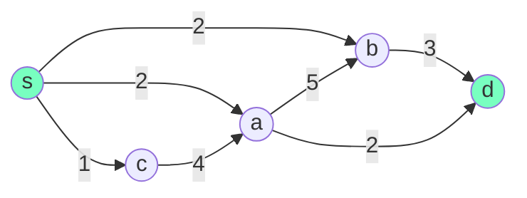
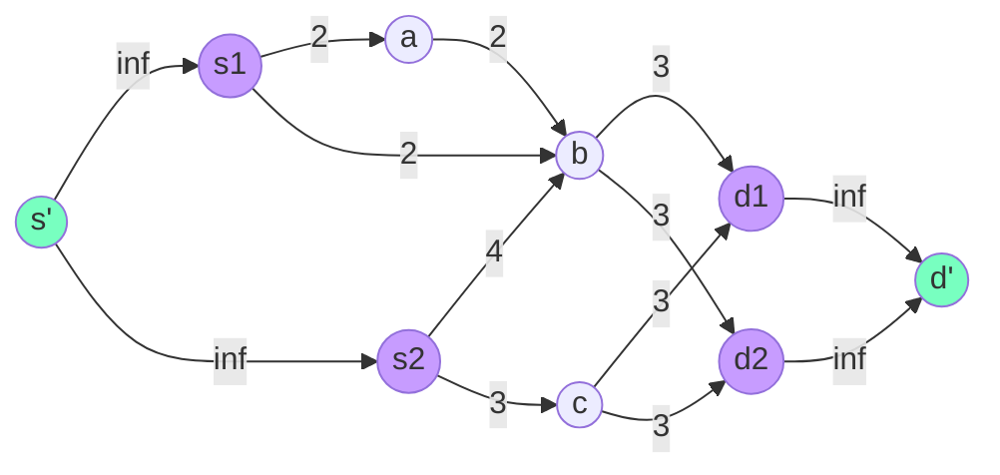
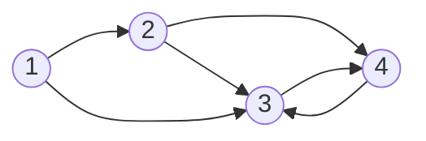

## PROBLEMA DI TRASPORTO

In generale, un problema di trasporto è un problema in cui occorre distribuire/assegnare dei prodotti da un gruppo di ***sorgenti*** ad un gruppo di ***destinazioni*** in modo che il costo di assegnamento *(trasporto)* sia **minimo**.

Un problema di trasporto è rappresentabile tramite un grafo dove ***s*** sono le sorgenti e ***d*** le destinazioni.

I problemi di trasporto sono caratterizzati da una struttura particolare dettata dai valori degli elementi della matrice dei vincoli A *(molti de quali posti a 0)*

$$
A = \begin{bmatrix} a_{11} & ... & a_{1n} \\ ... & ... & ... \\ a_{m1} & ... & a_{mn}\end{bmatrix}
$$
Assumendo che

- Offerta = Domanda $\sum\limits_{i=1}^{m} s_{i} = \sum\limits_{j=1}^{n}d_{j}$
- Il costo di spedizione sia proporzionale rispetto alla quantità *(ipotesi di linearità della funzione obiettivo)*

La formulazione generale di un problema di trasporto è la seguente:

$min \sum\limits_{ij}^{mn}c_{ij}x_{ij}$ Minimizzazione costi
s.a.
$\sum\limits_{j = 1}^{n} x_{ij} = s_{i}$ Vincoli di capacità/offerta di una sorgente *(un vincolo per sorgente **s**)*

$\sum\limits_{i = 1}^{m}x_{ij} = d_{j}$ Vincoli di domanda di una destinazione *(un per destinazione **d**)*

$x_{ij} \geq 0$ Vincoli di non negatività

con ***cij*** = costo trasporto da *i* a *j* e ***xij*** = quantità di prodotto trasportato da *i* a *j*

#### PROPRIETÀ DI INTEREZZA

Il problema di trasporto i cui parametri ***si*** e ***dj*** siano interi gode della proprietà di interezza il che significa che tutte le variabili di base appartenenti a qualsiasi soluzione di base ammissibile avranno valore intero.

Cosa significa questo? Che posso applicare l'algoritmo del simplesso senza preoccuparmi dei vincoli di interezza!

## QUANDO L'OFFERTA NON È UGUALE ALLA DOMANDA

Vediamo cosa succede quando $\sum\limits_{i=1}^{m} s_{i} \neq \sum\limits_{j=1}^{n}d_{j}$

Generalmente si creano delle sorgenti *(o destinazioni)* con offerte *(o domande)* ***fittizie***.

#### ESEMPIO DESTINAZIONE FITTIZIA

Una compagnia costruisce aeroplani commerciali per varie compagnie aeree in tutto il mondo. L'ultima fase del processo di produzione è produrre i motori a reazione e poi installarli sul telaio dell'aereo completato. L'azienda ha firmato alcuni contratti per fornire un considerevole numero di aeroplani entro i prossimi 4 mesi e ora deve programmare la produzione dei motori a reazione. Per rispettare le date di consegna, l'azienda deve fornire i motori per l'istallazione nelle quantità indicate nella seconda colonna della tabella sottostante. A causa delle variazioni dei costi di produzione, potrebbe valere la pena produrre alcuni dei motori un mese o più prima che siano programmati per l'istallazione. Lo svantaggio è che tali motori devono essere mantenuti in magazzino fino al momento dell'istallazione programmata a un costo di stoccaggio.

| MESE | RICHIESTA | CAPACITÀ | COSTO PRODUZIONE | COSTO STOCCAGGIO |
| :--: | :-------: | :------: | :--------------: | :--------------: |
|  1   |    10     |    25    |       1.08       |      0.015       |
|  2   |    15     |    35    |       1.11       |      0.015       |
|  3   |    25     |    30    |       1.10       |      0.015       |
|  4   |    20     |    10    |       1.13       |                  |

Per formulare un modello potrei introdurre la variabile xj con j $\in$ {1, 2, 3, 4} rappresentante i motori prodotti nel mese *j*. Posso così formulare un problema di PL ma non come un problema di trasporto, molto più veloce da risolvere.
A tal fine devo descrivere il problema in termini di sorgenti e destinazioni e identificare quindi *xij*, *cij*, *sj* e dj.

I motori vengono prodotti nel mese *i* e installati nel mese *j*, quindi posso definire
xij numero motori prodotti nel mese *i* e installati nel mese *j*
cij costo associato ad ogni xij. Come lo calcolo? Facile per i $\leq$ j, ma se i $\gt$ j?
dj numero di motori da consegnare al mese *j*
si Da calcolare

Concentriamoci su cij quando i $\gt$ j:
Essendo impossibile produrre un motore dopo averlo installato, il suo costo dovrebbe essere 0, tuttavia così facendo verrebbe inserito in base visto che abbiamo un problema di minimo, assegnamo quindi a questa variabile un costo molto alto **M**.

Calcoliamo ora si:
Usiamo la capacità massima 25 + 35 + 30 + 10 = 100, ma notiamo che la domanda 10 + 15 + 25 + 20 è maggiore e occorre dunque inserire una destinazione ***fittizia*** che assorba tale differenza con costo nullo.

| **SORGENTI \ DESTINAZIONI** |   1   |   2   |   3   |   4   | Fittizia | si |
| :-------------------------: | :---: | :---: | :---: | :---: | :------: | :-----------: |
|            **1**            | 1.080 | 1.095 | 1.110 | 1.125 |    0     |      25       |
|            **2**            |   M   | 1.110 | 1.125 | 1.140 |    0     |      35       |
|            **3**            |   M   |   M   | 1.100 | 1.115 |    0     |      30       |
|            **4**            |   M   |   M   |   M   | 1.130 |    0     |      10       |
|           Domanda           |  10   |  15   |  25   |  20   |    30    |               |

## PROBLEMA DI TRANSHIPMENT

Un problema di transhipment è un problema di trasporto che presenta alcuni nodi che fanno sia da sorgente che da destinazione *(nodi di transhipment)* che se hanno solo una funzione di passaggio *(non producono e non consumano)*, la loro capacità è uguale alla loro domanda.
Se i nodi intermedi fungono anche da *rivenditori* avranno una domanda maggiore alla capacità, mentre se fungono anche da *distributori* avranno una capacità maggiore della domanda.
Un problema di questo tipo può riguardare il flusso su reti.

## PROBLEMA DELL'ASSEGNAMENTO

Un problema di assegnamento si occupa di assegnare risorse *(persone, macchine, ore di lavoro ecc)* ad attività.
Può essere visto come un caso particolare di un problema di trasporto con la seguente struttura:

- Il numero di risorse da assegnare deve essere uguale al numero di attività
- Ogni attività deve essere eseguita da esattamente una risorsa
- $\exist$ un costo ***cij*** associato alla risorsa *i* che esegue l'attività *j* *(i, j $\in \mathbb{N}$)*
- Obiettivo: assegnare le risorse in modo da minimizzare il costo totale

#### FORMULAZIONE GENERALE

xij = $\begin{cases} 1 & \text{i è assegnato a j} \\ 0 & altrimenti \end{cases}$

min Z = $\sum\limits_{i=1}^{n}$ $\sum\limits_{j=1}^{n} c_{ij}x_{ij} $
s.a.
$\sum \limits_{j=1}^{n} x_{ij} = 1$		*i* = 1, ..., n	 *(ad ogni risorsa va assegnata una sola attività)*

$\sum \limits_{i=1}^{n} x_{ij} = 1$		*j* = 1, ..., n	*(ad ogni attività deve essere assegnata una sola risorsa)*

xij $\geq$ 0

Notiamo che è una formulazione particolare del problema di trasporto con ***si = dj = 1*** e vale dunque la proprietà di interezza e anche questo tipo di problemi può essere rappresentato mediante grafi.

Problemi piccoli possono anche essere risolti col simplesso, notiamo tuttavia che molte variabili saranno nulle e dunque le soluzioni conterranno molte variabili degeneri, il che può essere dannoso per problemi di grosse dimensioni dove il simplesso genererebbe molti cambi di base senza che la soluzione cambi.

## PROBLEMI SU RETE

I problemi su reti hanno molteplici applicazioni come i trasporti, la produzione, distribuzione, localizzazione delle strutture.
Questo perché le reti sono una rappresentazione visiva e concettuale utili a rappresentare le relazioni tra varie componenti di sistemi anche molto complessi e trovano quindi utilizzo in qualsiasi campo di attività scientifiche, sociali ed economiche.

Vedremo che molti problemi di ottimizzazione su rete sono in realtà dei problemi di programmazione lineare 'speciali'.

## CAMMINO MINIMO

Uno dei problemi classici su rete è il problema del cammino minimo definito come tale:
Sia dato un grafo orientato e pesato G  = <V, E> con costo ci, j $\forall$ (i, j) $\in$ E e con un nodo di origine **s** $\in$ V ed uno di destinazione **d** $\in$ V.
Vogliamo trovare il cammino ***P*** da **s** a **d** il cui costo totale *(espresso come somma dei vari ci, j con (i, j) $\in$ **P**)* sia minimo.

Introduciamo quindi le seguenti variabili binarie per ogni arco del grafo:

xi, j = $\begin{cases}1 & se\space l'arco\space(i, j) \in P \\ 0 & altrimenti \end{cases}$

Questo problema equivale al problema di trovare il modo migliore per spedire 1 prodotto da un nodo di origine **s** ad uno di destinazione **d** *(come nei problemi di trasporto)*.

Avremo quindi i seguenti vincoli:

- si può selezionare un solo arco uscente dall'origine
- si può selezionare un solo arco entrante nella destinazione
- per gli altri nodi, il numero di archi entranti selezionati deve essere uguale al numero di archi uscenti

Formalmente:

$\min \sum\limits_{(i, j) \in E} c_{i, j}x_{i, j}$

*Vincoli di bilanciamento dei nodi:*

$\sum\limits_{(i, v) \in E} x_{i, v} - \sum\limits_{(v, j) \in E} x_{vj} = \begin{cases} -1 & se \space v = s\\ 1 & se \space v = d \\ 0 & se \space v \in V - \{s, \space d\}\end{cases}$

Tradotto in linguaggio naturale quel vincolo stabilisce che la differenza fra ***archi entranti***  *(in v)* e ***archi uscenti*** *(da v)* deve essere uguale a ***-1*** se stiamo considerando il vertice sorgente *(v = s)*, ***1*** se stiamo considerando il vertice destinazione *(v = d)* e ***0*** in tutti gli altri casi *(v $\neq$ s $\land$ v $\neq$ d)*.

Come per i problemi di trasporto e assegnamento, anche per il problema del cammino minimo è garantita una soluzione intera applicando il simplesso ed esistono particolari algoritmi specializzati molto efficienti che ne sfruttano le caratteristiche come ad esempio l'algoritmo di ***Dijkstra***.

## MASSIMO FLUSSO

Il problema consiste nel determinare il massimo flusso che, entrando da un nodo di origine ***s*** può raggiungere un nodo di destinazione ***d***. Dobbiamo cioè determinare per ogni arco (i, j) la quantità di flusso **xi, j** che lo deve attraversare affinché venga massimizzato il flusso totale *f* senza superare la capacità **ui, j** degli archi.

Formalmente:
$\max f$

*Vincoli di bilanciamento dei nodi:*

$\sum\limits_{(i, v) \in E} x_{i, v} - \sum\limits_{(v, j) \in E} x_{vj} = \begin{cases} -f & se \space v = s\\ f & se \space v = d \\ 0 & se \space v \in V - \{s, \space d\}\end{cases}$

*Vincoli di capacità:*

xi, j $\leq$ ui, j	$\forall$ (i, j) $\in$ E	*(il flusso su ogni arco non deve superare la capacità dell'arco stesso)*

**N.B.** *f* è una variabile di decisione.

Se i coefficienti ui, j sono interi possiamo ignorare i vincoli di interezza.
Anche per questo tipo di problemi esistono algoritmi specializzati molto efficienti come l'algoritmo di ***Ford-Fulkerson***.

Nei problemi reali di flusso generalmente il flusso può essere generato da più sorgenti e ricevuto da più destinazioni, ma possiamo ricondurci facilmente al problema di una sola destinazione ed una sola sorgente introducendo una sorgente ed una destinazione fittizie collegate a quelle reali con archi fittizi a capacità infinita.

## FLUSSO A COSTO MINIMO

Consideriamo un problema di distribuzione di energia; abbiamo una società che produce energia elettrica e dispone di diverse di diverse centrali di produzione e distribuzione collegate tra loro.

Ogni centrale *i* può

- Produrre ***pi*** kW di energia
- Distribuire energia su una sottorete di utenti la cui domanda complessiva è ***di***
- Smistare l'energia da e verso altre centrali

I cavi che collegano una centrale *i* ad un'altra *j* hanno una capacità massima ***ui, j*** kW e costano ***ci, j*** euro per kW. Vogliamo determinare il piano di distribuzione dell'energia a costo minimo producendo tanta energia quanto è la domanda totale delle sottoreti di utenti.

Possiamo rappresentare il problema su un grafo dove i nodi rappresentino le centrali e gli archi i cavi.
Per ogni nodo *v* avremo un parametro ***bv*** = *dv - pv* che rappresenta la differenza fra la domanda che la centrale deve soddisfare e l'offerta che è in grado di generare.

Avremo quindi:

- Nodi di domanda *(bv $\gt$ 0)* se la centrale deve soddisfare una domanda superiore alla sua capacità produttiva e dovrà quindi far arrivare energia da altre centrali.
- Nodi di offerta *(bv $\lt$ 0)* se la centrale ha un eccesso di offerta e quindi dovrà mandare l'eccesso verso altre centrali.
- Nodi di transito *(bv = 0)* se domanda  e offerta si equivalgono o se la centrale svolge solo lo smistamento dell'energia.

Formalmente:

min $\sum\limits_{(i, j) \in E} c_{i, j}x_{i, j}$

*Vincoli di bilanciamento dei nodi:*

$\sum\limits_{(i, v) \in E} x_{i, v} - \sum\limits_{(v, j) \in E} x_{vj} = \begin{cases} -b_{v} & se \space v = nodo\space di\space offerta\\ b_{v} & se \space v = nodo\space di\space domanda \\ 0 & se \space v = nodo\space di\space transito\end{cases}$

Questo set di vincoli ci assicura che la differenza tra i flussi entrante ed uscente di ogni nodo sia esattamente pari alla sua richiesta.

*Vincoli di capacità:*

xi, j $\leq$ ui, j	$\forall$ (i, j) $\in$ E	*(il flusso su ogni arco non deve superare la capacità dell'arco stesso)*

Notiamo che il problema del cammino minimo è un caso particolare di problema di flusso a costo minimo nel quale **bv = 1**.

Se i coefficienti bv sono interi possiamo ignorare i vincoli di interezza.
Anche in questo caso esistono algoritmi specializzati molto efficienti.

In particolare, la caratteristica di questo problema che lo rende più facile da risolvere e ci assicura la sua interezza è la sua matrice dei vincoli che è una matrice ***totalmente uni-modulare (TUM)***.

Consideriamo il seguente grafo

con le seguenti richieste:
b1 = -3			b2 = 2			b3 = 0			b4 = 1

Se trascuriamo i vincoli di capacità, avremo i seguenti vincoli:
-x1, 2 - x1, 3 = -3
+x1, 2 - x2, 3 - x2, 4 = 2
+x1, 3 + x2, 3 - x3, 4 + x4, 3 = 0
+x2, 4 + x3, 4 - x4, 3 = 1

Che avranno la seguente matrice corrispondente:

$\begin{bmatrix}-1 & -1 & 0 & 0 & 0 & 0 \\ +1 & 0 & -1 & -1 & 0 & 0 \\ 0 & +1 & +1 & 0 & -1 & +1 \\ 0 & 0 & 0 & +1 & +1 & -1 \end{bmatrix}$

Notiamo che:

- Abbiamo una colonna per ogni variabile, e quindi per ogni arco (i, j) $\in$ E
- Abbiamo una riga per ogni nodo v $\in$ V
- Per ogni colonna ci sono esattamente due numeri diversi da 0 e in particolare un -1 e un +1

Le matrici con queste proprietà si chiamano matrici totalmente uni-modulari e ci assicurano l'integrità di qualsiasi problema abbia come matrice dei vincoli una TUM.

Formalmente:
Dato un problema lineare in forma min{cTx: Ax = b, x $\geq$ 0}, se A è una TUM e b $\in$ $\mathbb{Z}_{+}^{m}$, allora tutte le sue soluzioni di base hanno coordinate intere.

## PROGRAMMAZIONE LINEARE INTERA

Il simplesso si basa sulla divisibilità delle variabili, che richiede che le variabili siano del dominio reale. Tuttavia, in molti problemi pratici le variabili hanno senso solo se sono intere *(es. trasporto, problemi di flusso, assegnamento)*.

Quando si richiede che la variabili siano intere si parla di ***programmazione lineare intera***, che può essere anche *binaria* o *mista* a seconda del dominio delle variabili.

#### COME USARE LE VARIABILI BINARIE

Le variabili binarie hanno un vasto impiego in RO per modellare decisioni booleane e condizioni logiche.

Investire nell'azienda $i$? $\rightarrow x_i$
Un camion fa una certa tratta da $i$ a $j$? $\rightarrow x_{i, j}$
Mutua esclusione $\rightarrow x_i + x_j \leq 1$

**VINCOLI EITHER-OR**
Immaginiamo di avere due vincoli e almeno uno di essi deve essere soddisfatto.

$3x_1 + 2x_2 \leq 18 \lor x_1 + 4x_2 \leq 16$

Introducendo la variabile binaria $y$ ed un numero molto elevato $M$ possiamo modellare tale vincolo come

$\begin{cases} 3x_1 + 2x_2 \leq 18 + My \\ x_1 + 4x_2 \leq 16 + M(1-y) \end{cases}$

Notiamo che se $y = 1$, il primo vincolo viene eliminato perché risulta sempre verificato, viceversa se $y = 0$, il secondo vincolo viene eliminato.
In questo modo uno dei due vincoli, a seconda del valore di $y$, risulterà sempre soddisfatto, poiché essendo $M$ molto grande la disuguaglianza risulterà sempre vero.

Il ragionamento può essere esteso al caso *"Dati $N$ vincoli, solo $K$ devono essere soddisfatti"* introducendo $N$ variabili binarie:

$\begin{cases} h_1(x_1, \space ..., \space x_n) \leq d_1 + My_1 \\ ... \\ h_N(x_1, \space ..., \space x_n) \leq d_n + My_{_N}
\\
\sum\limits_{i=1}^{N} y_i = N - K
\end{cases}$

**FUNZIONE CON SOLI N POSSIBILI VALORI**
Consideriamo $f(x) = d_1 \lor \space ... \space \lor d_N$.
Introducendo $N$ variabili binarie $y_i \in \{0,1\}$ possiamo modellare tale funzione come

$\begin{cases} f(x) = \sum\limits_{i=1}^{N}d_iy_i \\
\sum\limits_{i=1}^{N} y_i = 1 \end{cases}$

**COSTO FISSO**
Supponiamo di voler intraprendere un'attività $j$ il cui costo sia descritto come segue

$f(x) = \begin{cases} k + cx & se \space x>0 \\ 0 & se \space x = 0 \end{cases}$

dove $k>0$ è detto ***costo fisso***, $c$ è il costo per ogni unità ed $x \geq 0$ il numero di unità.

La minimizzazione di tale funzione può essere espressa, introducendo la variabile binaria $y$ e il numero $M$, come segue 

$\min z = (ky + cx)$
S.A.
$x \leq My$			con			$y \in \{0,1\}$	e	$x \geq 0$

In questo modo se $y = 0 \rightarrow x \leq 0$, ovvero $x = 0$ e $z = 0$, mentre se $y=1 \rightarrow x$ può assumere qualsiasi valore e $z =  k +cx$.

**RAPPRESENTAZIONE BINARIA DI VARIABILI INTERE**
Immaginiamo di avere un problema misto dove tutte le variabili sono binarie ad eccezione di una $x \in [0, u]$.
Chiamiamo quindi $N$ quel intero tale che $2^N \leq u \leq 2^{N+1}$.

Possiamo rappresentare $x = \sum\limits_{i=0}^N 2^iy_i$ con $N$ $y_i$ variabili aggiuntive, passando così ad un problema binario puro.

### ALCUNE CONSIDERAZIONI

Apparentemente i problemi PLI potrebbero sembrare più facili da risolvere rispetto ai problemi PL poiché presentano molte meno soluzioni *(in una regione ammissibile limitata presenta soluzioni finite)*.

In realtà non è così, nonostante i problemi PLI applichino il simplesso, lo fanno all'interno di una strategia molto più complessa che implica l'applicazione del metodo del simplesso più volte *(mentre nel caso dei problemi PL questo viene applicato una volta sola)*.
Inoltre, seppur le soluzioni siano finite, possono comunque essere tante; in un problema binario con $n$ variabili ci sono $2^n$ possibili soluzioni, un numero esponenziale!
Di conseguenza la rimozione di alcune soluzioni ammissibili *(quelle non intere)* non rende il problema più semplice.

Un qualsiasi problema PLI tuttavia può essere ***rilassato***, ovvero privato dei suoi vincoli di interezza per poter essere valutato col simplesso *(che, a meno che non restituisca una soluzione intera, **NON** darà la soluzione al PLI iniziale, ma ne fornirà un Upper Bound per problemi di massimo o un Lower Bound per problemi di minimo)*.

### BRANCH AND BOUND

Il metodo del branch and bound è una tecnica di risoluzione di PLI.
È una tecnica di ***enumerazione implicita***, ovvero:

- valuta le soluzioni possibili fino a trovare quella ottima
- scarta alcune di esse dimostrandone la non ottimalità
- si basa sul concetto di ***divide et impera***

Supponiamo di avere un problema PLI  con una regione ammissibile $X$ e indichiamolo come ***problema completo***.
Un problema PLI rappresenta un ***sotto problema*** del problema completo se presenta la *medesima funzione obiettivo* **MA** ha un ***sottoinsieme proprio di X come regione ammissibile***.

Sia quindi $z^* = f(x^*)$ la soluzione ottima del problema completo e $z^{\sim} = f(x^{\sim})$ la soluzione ottima di un suo sotto problema, allora si ha che
- $f(x^{\sim}) \leq f(x^*)$ se il problema è di massimo
- $f(x^{\sim}) \geq f(x^*)$ se il problema e di minimo.

Questo perché tra le soluzioni ammissibili del problema completo vi è anche $x^{\sim}$ e quindi, per definizione di ottimo $f(x^*)$ è migliore di $f(x^{\sim})$.

Il B&B usa tre tecniche per risolvere un generico PLI:

- la partizione rispetto al valore delle variabili - **BRANCHING**
- la determinazione d un limite superiore/inferiore - **BOUNDING**
- l'eliminazione dei sotto problemi - **FATHOMING**

#### B&B PER PB

Nel caso di problemi binari, il modo più semplice per dividere l'insieme delle soluzioni è fissare il valore di una delle variabili, $x = 0$ per un sottoinsieme e $x = 1$ per l'altro. Tale variabile prende il nome di ***variabile di branching***.

Sappiamo che per ognuno dei sotto problemi possiamo ottenere un limite superiore o inferiore *(bounding)* risolvendo la sua versione rilassata.

Uno sotto problema può poi essere *'eliminato'* dalla lista dei problemi da considerare per 3 possibili motivi

1. La soluzione del suo rilassamento soddisfa i vincoli di interezza.
   In particolare, se questa è la migliore trovata, diverrà la soluzione incombente $z^*$ del problema.

2. Se il suo bound è peggiore della soluzione incombente attuale, quindi

   - $Bound \leq z^*$ per problemi di massimo 
   - $Bound \geq z^*$ per problemi di minimo

   è chiaro che non potrà produrre una soluzione intera migliore.

3. Non ammette soluzioni ammissibili.

Quindi verranno ulteriormente risolti ed analizzati solo quei sotto problemi che presentano un bound migliore della soluzione incombente.

Generalmente, con una strategia ***best bound first***, nel caso di più sotto problemi aperti, si procede col branching a partire da quello con bound più promettente. Sebbene questa strategia effettua un fathoming più efficiente, richiede maggior memoria per tenere tutti i problemi aperti.

Una strategia alternativa è il ***depth first***, in cui si svolge il problema in profondità scegliendo di fare branching sul sotto problema creato più recentemente, arrivando presto a soluzioni incombenti. Risulta quindi più efficiente ripartire con l'ottimizzazione *(basta aggiungere un vincolo)* mantenendo meno problemi aperti *(richiedendo così anche meno memoria)*. Rischia però di esplorare completamente sotto alberi con soluzioni scadenti.

#### B&B PER PIM (VARIABILI INTERE + CONTINUE)

La procedura del B&B per questo tipo di problemi è molto simile a quella vista per PB; la soluzione dei problemi rilassati è ancora alla base del bounding e del fathoming, ma occorre apportare alcune modifiche.

1. Innanzitutto, prima si poteva scegliere la variabile di branching seguendo l'indice delle variabili, ora la regola è scegliere la prima variabile non continua seguendo l'indice.

2. La seconda modifica riguarda i valori assegnati alla variabile per la generazione dei sotto problemi; nei PIM il branching viene effettuato assegnando alla variabile di branching un insieme di valori piuttosto che dei valori fissi come nei PB *(è impensabile provare ogni singolo valore)*.
   In particolare si generano due sotto problemi con i valori $x_j \leq \lfloor x_j^* \rfloor$			e			$x_j \geq \lfloor x_j^* \rfloor + 1$.
   Dove $\lfloor x_j^* \rfloor$ è il massimo intero per cui $\lfloor x_j^* \rfloor \leq x_j$.

   Con questa modifica può succedere che una stessa variabile sia selezionata più volte per il branching *(cosa che non accadeva nel B&B per PB)*.

3. Il terzo cambiamento riguarda il bounding: nel caso di PB, se i coefficienti della funzione obiettivo erano tutti interi, il valore della soluzione del problema rilassato poteva essere arrotondato all'intero inferiore se il problema era di $\max$ o a quello superiore se il problema era di $\min$; in questo caso questo non è più possibile *(perché alcune delle variabili possono assumere valori continui)*!

   **ATTENZIONE**: nel caso tutte le variabili possano assumere solo valori interi *(trattasi quindi di un PLI)*, questo risulta di nuovo possibile.

4. Il quarto cambiamento riguarda il fathoming; nei PB ci si fermava solo se la soluzione del problema era intera, nei PIM basta che la soluzione soddisfi le condizioni di interezza per le variabili che non possono essere continue.

#### CONSIDERAZIONI SUL B&B

**VARIABILI**
Per quanto riguarda la scelta della variabile su cui effettuare il branching si può o scegliere la variabile più lontana da un valore intero o scegliere la variabile con indice più basso.

**BOUNDING**
Per il bounding si risolve un rilassamento del problema che può essere il problema senza vincoli di interezza ma anche altri tipi di rilassamenti come il ***rilassamento lagrangiano*** che consiste nel cancellare l'intero insieme di vincoli funzionali del problema $Ax \leq b$ *(o quasi)* e sostituire la funzione obiettivo $\max z = cx$ con $\max z = cx-\lambda(Ax - b)$.
Per ogni $\lambda > 0$, la soluzione ottima del problema fornisce un upper/lower bound del problema originario, dunque fornisce un bound *almeno* tanto buono quanto quello del rilassamento lineare.
La sua particolarità è che *'penalizza'* i vincoli non soddisfatti perché diminuirebbe la funzione obiettivo *(ma ammette comunque soluzioni non ammissibili)* e la sua efficacia deriva dall'efficienza con cui si riesce a risolvere il problema duale.

**SOLUZIONI OTTIME ALTERNATIVE**
Quando trattiamo problemi con soluzioni ottime alternative, potrebbe essere importante poter ottenere una lista di soluzioni ottime; per trovarle dobbiamo modificare la procedura:
Innanzitutto il fathoming legato al bound verrà eseguito solo in caso di disuguaglianza stretta ($z < z^*$ per $\max$, $z>z^*$ per $\min$), in modo che il fathoming non avvenga in caso di $z = z^*$.
Occorre poi salvare tutte le soluzioni con $z = z^*$ *(equivalenti)* come incombenti.
Alla fine della procedura tutte le soluzioni coerenti incombenti saranno considerate ottime.

**SOLUZIONI QUASI-OTTIME**
Il B&B può essere utilizzato anche per trovare delle *buone* soluzioni anche se non necessariamente ottime *(quasi-ottime)* che richiedono meno sforzo computazionale.
Una soluzione incombente $z$ è quasi ottima se è abbastanza vicina alla soluzione ottima $z^*$, ovvero se
$z^* - k \leq z$			oppure			$(1-\alpha)z^* \leq z$			con $k$ e $\alpha$ costanti date.

Notiamo che non conosciamo $z^*$, ma possiamo approssimarla tramite i bound, in particolare $z^* \leq bound$ in caso di massimo e $z^* \ge bound$ in caso di minimo. Possiamo dunque sostituire $z^*$ con $bound$ nelle formule precedenti.
$bound - k \leq z$			oppure			$(1-\alpha)bound \leq z$.

**CRITERIO D'ARRESTO**
Per quanto riguarda il criterio d'arresto, il B&B si arresta quando tutti i nodi sono dichiarati fathomed *(chiusi)* e la soluzione ottima corrisponde alla soluzione incombente corrente. Possiamo però fermarci anche non appena troviamo una soluzione quasi ottima oppure ancora possiamo adottare criteri relativi a limiti computazionali, ma in quest'ultimo caso non è garantito che l'eventuale soluzione incombente sia ottima, ma posso comunque calcolare la sua distanza dal $bound$ in modo da sapere quanto sia buona.

## PROGRAMMAZIONE NON LINEARE

Possiamo formulare un problema di programmazione non lineare come

$opt \space f(x)$
S.A.
$g_j(x) \leq 0$					con $j \in \{1, \space ..., \space m\}$
$x_i \geq 0$						con $i \in \{1, \space ..., \space n\}$

**OSSERVAZIONE**: nel caso della programmazione lineare si assumono $f$ e $g_j$ *lineari*, ma l'assunzione di linearità non è sempre valida per molte applicazioni.

Alcune situazioni in cui è possibile applicare la PNL sono:

- Problema mix di prodotti con elasticità del prezzo *(quantità venduta inversamente proporzionale al prezzo applicato)* o con costo marginale di produzione variabile *(ad esempio il prezzo di produzione può diminuire per via dell'esperienza dei lavoratori)*.
- Nel problema del trasporto con sconti sul volume per le spedizioni di grandi dimensioni.
- Ottimizzazione di Portafoglio con obiettivo la massimizzazione del guadagno e la minimizzazione dei rischi.
- Clustering: tecniche di analisi per selezionare e raggruppare gli elementi omogenei *(es. k-means che minimizza la distanza tra i punti dati e dei punti detti centroidi)*.
- Classificazione: tecniche di classificazione che consentono di identificare a quale categoria appartiene un elemento di input.
- Addestramento di reti neurali.

Esistono diversi tipi di programmi non lineari caratterizzati dalle funzioni $f$ e $g_j$:

- Ottimizzazione non vincolata: problemi che non hanno vincoli sulla regione ammissibile
  *(cosa non possibile nella programmazione lineare)*.
- Ottimizzazione con vincoli lineari: $f$ non lineare ma $g_j$ lineari *(esempio il portafoglio di Markowitz)*.
- Ottimizzazione convessa: $f(x)$ è una funzione ***concava*** o ***convessa*** e ogni $g_i(x)$ è ***convessa*** *(in questo caso i minimi/massimi locali sono sicuramente anche globali)*.
- Ottimizzazione non convessa: più difficili da risolvere perché possono presentare diversi punti di minimo/massimo.

**PERCHÉ RISOLVERE UN PNL È PIÙ DIFFICILE DI UN PROBLEMA LINEARE?**
Ricordiamo che nella programmazione lineare, le soluzioni ottime erano dei ***vertici*** della regione ammissibile; se introduciamo delle non linearità la soluzione ottima non è più necessariamente un vertice, di conseguenza è molto più difficile determinarla e il simplesso non si può più utilizzare.

**E SE LA REGIONE AMMISSIBILE È LINEARE MA LA FUNZIONE OBIETTIVO NO?**
In questo caso, pur avendo la regione ammissibile lineare e quindi *'spigolosa'*, il punto di ottimo, oltre a non esser più necessariamente un vertice, potrebbe non essere più nemmeno situato sulla frontiera dei vincoli, ma in qualunque altro punto della regione ammissibile.

### OTTIMIZZAZIONE NON VINCOLATA IN UNA VARIABILE

Consideriamo un problema
di *massimizzazione* con una funzione obiettivo ***concava*** *(derivata seconda < 0)* oppure
di *minimizzazione* con una funzione obiettivo ***convessa*** *(derivata seconda > 0)*.

Condizione sufficiente affinché $x^*$ sia punto di massimo è che $\frac{\delta f(x^*)}{\delta x} = 0$.
Se tale equazione può essere risolta analiticamente l'ottimizzazione può terminare.

**Ma se non si può risolvere la derivata prima analiticamente?**
In mancanza di una risoluzione analitica sono disponibili degli algoritmi per la risoluzione numerica del problema che costruiscono una sequenza di punti $\{x_k\}$ tali che $\lim\limits_{k\rightarrow \infty} x_k = x^*$ e $f(x_{k+1})$ è *migliore* in termini di ottimo di $f(x_k)$.
**ATTENZIONE:** quello che riusciamo a trovare con i metodi numerici e quelli analitici sono ottimi ***locali*** in un'intorno del punto di partenza $x_k$ e non sappiamo se siano o meno anche *globali*.

A differenza del simplesso, in questo caso la sequenza di punti non è detto che converga alla soluzione ottima del problema in un numero finito di iterazioni, di conseguenza ci sono diversi criteri d'arresto:

- La soluzione è sufficientemente accurata $\frac{\delta f(x_k)}{\delta x} \approx 0$
- Raggiunto un numero massimo di iterazioni $N$ o un tempo computazionale massimo
- Progressi lenti $|x_{k+1} - x_k| \lt \epsilon_x$         o         $|f(x_{k+1}) - f({x_k})| \lt \epsilon_f$
- La soluzione diverge $|x_k| \rightarrow +\infty$
- Si verificano cicli

Gli algoritmi disponibili sono di due tipi:

1. ***Dicotomici***: algoritmi di ricerca per individuare un determinato valore *(quello che annulla la derivata prima)* all'interno di un intervallo che ad ogni iterazione viene ridotto *(metodo di bisezione)*.
2. ***Approssimazione***: algoritmi che utilizzano approssimazioni locali della funzione *(metodo di Newton)*.

### BISEZIONE

**IDEA**
Se $f(x)$ è concava in un intervallo chiuso $[a, b]$ allora, considerando un generico punto $x_k$:

- Se $\frac{\delta f(x_k)}{\delta x} < 0$ il punto ottimo $x^*$ si trova a sinistra di $x_k$
- Se $\frac{\delta f(x_k)}{\delta x} > 0$ il punto ottimo $x^*$ si trova a destra di $x_k$
- Se $\frac{\delta f(x_k)}{\delta x} \approx 0$ allora $x^* \approx x_k$

*(Il ragionamento è inverso per le funzioni da minimizzare)*.

Il metodo di bisezione è una procedura semplice che può essere applicata quando $f(x)$ è una funzione concava/convessa continua e derivabile in un intervallo $[a, b]$.
La pendenza *(ovvero la derivata)* di $f$ per un certo punto $x_k$ fornisce informazioni su dove cercare l'ottimo *(dove si annulla la derivata)*.

Considerando quindi un generico punto $x_k$ *(in un problema di massimo)*:

- se $f'(x_k) > 0$, allora $x_k$ è un ***estremo inferiore*** $\underline{x}$ per il punto $x^*$
- se $f'(x_k) < 0$, allora $x_k$ è un ***estremo superiore*** $\overline x$ per il punto $x^*$

**CRIETERIO D'ARRESTO**
In questo modo ad ogni iterazione $k$ posso identificare un sotto intervallo di ricerca $[a_k, b_k] \subset [a_{k-1}, b_{k-1}] \subset [a, b]$ in modo da ridurre lo spazio di ricerca fino a trovare
**un'iterazione $k$ tale che $|b_k - a_k| < 2\epsilon$, che si traduce in $|a_k - x^*| < \epsilon$ e $|b_k - x^*| < \epsilon$.**

### NEWTON

La Bisezione è una procedura molto semplice ma converge molto lentamente poiché considera solo informazioni relative alla derivata prima. Un modo per aumentare la velocità di convergenza è quello di considerare anche la derivata seconda.

Si può notare che tramite la ***formula di Taylor*** si può ottenere un'***approssimazione quadratica*** della funzione interessata, ovvero $f(x_{k+1}) \approx f(x_k) + f'(x_k)(x_{k+1}-x_k) + \frac{1}{2}f''(x_k)(x_{k+1} - x_k)^2$.
Derivando tale approssimazione rispetto a $x_{k+1}$ otteniamo $f'(x_k) + f''(x_k)(x_{k+1} - x_k)$.

Visto che quello che ci interessa è il miglior $x_{k+1}$, quello che ci porti più vicino al punto di ottimo, poniamo la derivata calcolata prima a 0 e otteniamo $f'(x_k) + f''(x_k)(x_{k+1} - x_k) = 0$			$\rightarrow$			$x_{k+1} = x_k - \frac{f'(x_k)}{f''({x_k})}$

**ATTENZIONE**: Se $f(x)$ è concava, allora $x_k$ converge verso un punto di massimo, se è convessa converge verso un punto di minimo:

Ricordando che se la funzione è concava abbiamo $f''(x) < 0$ notiamo che:

- Se $f(x)$ è concava e $x_k$ è a sinistra del punto di massimo $\rightarrow$ $f'(x_k)  >0$		$\rightarrow$		$- \frac{f'(x_k)}{f''({x_k})}  >0$	$\rightarrow$	$x_{k+1}  >x_k$
- Se $f(x)$ è concava e $x_k$ è a destra del punto di massimo $\rightarrow$ $f'(x_k) < 0$		$\rightarrow$		$- \frac{f'(x_k)}{f''({x_k})} < 0$	$\rightarrow$	$x_{k+1} < x_k$

Ricordando che se la funzione è convessa abbiamo $f''(x) > 0$ notiamo che:

- Se $f(x)$ è convessa e $x_k$ è a sinistra del punto di minimo $\rightarrow$ $f'(x_k)  <0$		$\rightarrow$		$- \frac{f'(x_k)}{f''({x_k})}  >0$	$\rightarrow$	$x_{k+1}  >x_k$

- Se $f(x)$ è convessa e $x_k$ è a destra del punto di minimo $\rightarrow$ $f'(x_k) > 0$		$\rightarrow$		$- \frac{f'(x_k)}{f''({x_k})} < 0$	$\rightarrow$	$x_{k+1} < x_k$

Di conseguenza non dobbiamo *'dire'* all'algoritmo se stiamo cercando un massimo o un minimo.

**CRITERIO D'ARRESTO**
Ci si arresta quando $|x_{k+1} - x_k| \le \epsilon$.

### CONSIDERAZIONI

**BISEZIONE**

- Vantaggi: Richiede solo il calcolo della derivata prima *(più semplice in termini di computazione)* e **converge sempre**.
- Svantaggi: È lento.

**NEWTON**

- Vantaggi: Ha una velocità di convergenza quadratica.
- Svantaggi: Richiede anche il calcolo della derivata seconda ma **potrebbe divergere** se il punto iniziale è lontano dall'ottimo.

### OTTIMIZZAZIONE NON VINCOLATA IN PIÙ VARIABILI

Nel caso unidimensionale si utilizzavano derivata prima per le informazioni sulla stazionarietà di un punto e seconda per informazioni sulla convessità della funzione obiettivo, nel caso n-dimensionale useremo:
il ***gradiente*** *(vettore delle derivate parziali della funzione obiettivo)* e
la ***matrice Hessiana*** *(matrice delle derivate combinate)*.
**ATTENZIONE**: Se le derivate seconde sono continue, la matrice Hessiana è ***simmetrica***.

Anche nel caso multidimensionale possiamo usare il metodo analitico che però ha le stesse limitazioni di prima.
Esistono quindi anche in questo caso degli algoritmi numerici, tra cui il ***metodo del gradiente (o steepest descend)*** e il ***metodo di Newton***.

Gli algoritmi che consideriamo appartengono alla categoria ***line search***, che genera una successione di punti $x_k$ in modo tale che il punto $x_k$ sia ottenuto a partire dal punto $x_{k+1}$ muovendosi lungo una ***direzione di salita*** *(max)* o ***di discesa*** *(min)*.

Il generico algoritmo per un metodo line-search consiste nel:

- Porre $k=0$ *(iterazione)* e scegliere un punto iniziale $x_k$.
- Determinare una direzione di salita/discesa $d_k$.
- Cercare un nuovo punto $x_{k+1}$ lungo la direzione $d_k$
  $x_{k+1} = x_k \pm \alpha_k d_k$         con $\alpha_k > 0$ quantità scalare chiamata ***step-size***.

Notiamo che dobbiamo dire esplicitamente all'algoritmo se vogliamo minimizzare o massimizzare *(notare il $\pm$, + per problemi di massimo, - per problemi di minimo)*.

**STEP SIZE**
Se vogliamo minimizzare/massimizzare una funzione, dobbiamo prendere il *miglior* step size ad ogni iterazione, quindi poniamo $\frac{\delta f(x_k + \alpha_kd_k)}{\delta \alpha_k} = 0$ ed usare un metodo di ottimizzazione 1D per trovare $\alpha_k$ ottimale.
Generalmente lo step size diminuisce con l'aumentare delle iterazioni *($\alpha$ inversamente proporzionale a $k$)*.

### METODO DEL GRADIENTE

Il metodo del gradiente è un tipico metodo di line-search che utilizza come direzione di spostamento, appunto, il gradiente della funzione obiettivo, considerato la direzione di salita/discesa più ripida della funzione.

La generica iterazione del metodo del gradiente sarà quindi $x_{k+1} = x_k \pm \alpha_k \nabla f(x_k)$.

**CRITERIO D'ARRESTO**
Se $|f(x_{k+1})-f(x_k)| < \epsilon_1$	oppure	$||\nabla f(x_{k+1})|| < \epsilon_2$ ci fermiamo.

### METODO DI NEWTON

Abbiamo visto come Newton approssimi la funzione obiettivo con una funzione quadratica; nel caso multidimensionale accade la stessa cosa usando il gradiente e l'Hessiana.

La generica iterazione del metodo di Newton sarà quindi $x_{k+1} = x_k -  H_f(x_k)^{-1}\nabla f(x_k)$.

Notiamo che, come nel caso 1D, non dobbiamo specificare all'algoritmo se vogliamo minimizzare o massimizzare, esso convergerà sempre al caso di minimo o massimo più vicino *(quindi anche qui c'è il rischio di divergenza)*.
Ancora, come nel caso 1D, usa più risorse *(più la funzione è complessa, più è complessa da calcolare l'Hessiana)* e se converge, converge molto rapidamente *(nel caso di funzioni quadratiche converge in una sola iterazione)*.

**CRITERIO D'ARRESTO**
Se $|f(x_{k+1})-f(x_k)| < \epsilon_1$	oppure	$||\nabla f(x_{k+1})|| < \epsilon_2$ ci fermiamo.

### OTTIMIZZAZIONE NON LINEARE VINCOLATA

Consideriamo un generico PNL

$opt \space f(x)$
S.A.
$g_i(x) = 0$					$i \in \{1, \space ..., \space m\}$			vincoli di uguaglianza
$h_j(x) = 0$					$j \in \{1, \space ..., \space p\}$			vincoli di disuguaglianza

Per affrontare questo tipo di problemi ***non esistono degli algoritmi generali***, ma esistono degli approcci per semplificarli:

- Riduzione del numero delle variabili, esplicitando una variabile in funzione delle altre.
  Tuttavia questo metodo non è sempre applicabile perché non sempre è facile da applicare e non sempre riesco ad eliminare tutte le variabili ad eccezione di una *(perché alcune variabili possono ad esempio assumere due valori)*.
- Moltiplicatori di Lagrange
- Condizioni di Karush-Kuhn-Tucker

### LA FUNZIONE LAGRANGIANA E LE CONDIZIONI DI PRIMO ORDINE

La funzione Lagrangiana viene definita come $L(x, \lambda, \mu) = f(x) + \sum\limits_{i=0}^{m}\lambda_ig_i(x) + \sum\limits_{j=0}^{p}\mu_j h_j(x)$	con $\lambda \neq 0$ e $\mu > 0$ chiamati moltiplicatori di Lagrange e sono tanti quanti sono i vincoli *(per adesso consideriamo solo i vincoli di uguaglianza)*.

La Lagrangiana è importante perché i suoi punti stazionari sono fortemente legati ai punti di massimo/minimo della funzione originaria, in particolare può essere utilizzata per caratterizzare i punti candidati ad essere punti di ottimo.

Sia $x^*$ il punto stazionario di $f$, allora esistono $m$ moltiplicatori $\lambda^*$ tali che $(x^*, \lambda^*)$ sia un punto stazionario della Lagrangiana associata, ovvero tali per cui il gradiente della Lagrangiana è nullo *(e quindi le derivate parziali rispetto alle x e ai $\lambda$)*.

**MA QUAL È IL VANTAGGIO?**
Il vantaggio è che la funzione Lagrangiana non è vincolata, e cioè permette di eliminare i vincoli del problema *(introducendoli nella funzione obiettivo)*!

Da notare che i punti stazionari possono essere di tipo diverso, quindi questa è una ***condizione necessaria ma non sufficiente*** per l'ottimizzazione del problema.

**CONSIDERAZIONI**
Le condizioni $\frac{\delta L(x^*, \lambda ^*)}{\delta \lambda_i} = 0$ sono i vincoli del problema originario $g_i(x)$ scritte in modo *'elegante'*.

Le condizioni $\frac{\delta L(x^*, \lambda^*)}{\delta x_i} = 0$ possono essere riscritte come $\frac{\delta f(x^*)}{\delta x_i} + \sum \lambda_i \frac{\delta g_i(x^*)}{\delta x_i} = 0$	$\rightarrow$	$\frac{\delta f(x^*)}{\delta x_i} =- \sum \lambda_i \frac{\delta g_i(x^*)}{\delta x_i}$, ovvero $\nabla L(x^*, \lambda^*) = \nabla f(x^*) + \sum \lambda_i \nabla g_i(x^*) = 0$	$\rightarrow$	$\nabla f(x^*) = - \sum \lambda_i \nabla g_i(x^*)$.
Stiamo praticamente dicendo che, nel punto di ottimo $x^*$, il gradiente della funzione è combinazione lineare dei gradienti dei vincoli. Questo perché $\nabla f(x^*)$ è ortogonale al piano tangente al vincolo nel punto ottimo $x^*$. Generalmente $\nabla h(x)$ è sempre ortogonale a tale piano, quindi nel punto ottimo $\nabla f(x^*)$ e $\nabla h(x^*)$ sono collineari.

**LE CONDIZIONI DI SECONDO ORDINE**
Come nel caso dell'ottimizzazione non vincolata, anche qui abbiamo delle condizioni sufficienti per garantire che i punti stazionari della Lagrangiana siano dei punti di massimo/minimo.

Consideriamo la matrice dei vincoli Jacobiana $J$ e l'insieme de vettori $y$ tali che $J(x^*) \space y = 0$, che ci porta al sistema
$\begin{cases}
\nabla g_1(x^*) \space y_1 = 0 \\
... \\
\nabla g_m(x^*) \space y_m = 0
\end{cases}$

Che rappresenta l'insieme dei vettori perpendicolari ai gradienti dei vincoli.

A questo punto consideriamo la matrice Hessiana della Lagrangiana ristretta alle variabili originarie;
Condizione ***sufficiente*** affinché $x^*$ sia un punto di minimo è che $y^T \space H_L(x^*, \lambda^*) \space y > 0$.
Condizione ***sufficiente*** affinché $x^*$ sia un punto di minimo è che $y^T \space H_L(x^*, \lambda^*) \space y < 0$.

### CONDIZIONI DI KRUSH-KUHN-TUCKER

Consideriamo ora anche i vincoli di disuguaglianza tramite le KKT che rappresentano una generalizzazione dei moltiplicatori di Lagrange applicati a problemi che presentino anche vincoli di disuguaglianza.

Se consideriamo un punto di ottimo $x^*$, in quel punto i vincoli possono essere o attivi ($h_j(x^*) = 0$) o non attivi ($h_j(x^*) < 0)$).

Sia $x^*$ il punto stazionario di $f$, allora esistono $m$ moltiplicatori $\lambda^*$ e $p$ moltiplicatori $\mu^*$ tali che:

$\begin{cases}
\nabla f(x_1, x_2) = - \sum\limits_{i=1}^{N}\lambda_i \nabla g_i(x_1, x_2) - \sum\limits_{i=1}^{M} \mu_i\nabla h_i(x_1, x_2) & Condizione \space sui \space gradienti \\ \\
\mu_i * h_i(x_1, x_2) = 0 & Condizione \space di \space complementarieta' \\ \\
g_i(x_1, x_2) = 0 & Vincoli \space di \space uguaglianza / ammissibilita' \space primale\\
h_i(x_1, x_2) \leq 0 & Vincoli \space di \space disuguaglianza / ammissibilita' \space primale \\ \\
\mu_i \geq 0 & Condizione \space di \space non \space negativita' / ammissibilita' \space duale\end{cases}$

## METAEURISTICHE

Fino ad ora abbiamo visto delle tecniche risolutive che risolvono un problema in modo esatto ma con delle limitazioni riguardo agli ottimi globali e alla struttura stessa del problema. Tuttavia, spesso nella pratica i problemi non soddisfano tali limitazioni.
In questi casi possiamo utilizzare delle tecniche risolutive alternative come le metaeuristiche.

Le metaeuristiche rappresentano delle tecniche che possono non tener conto delle limitazioni dichiarate prima ma senza la garanzia di trovare l'ottimo del problema, ma solo una buona soluzione.

Sappiamo che se usiamo una procedura di tipo ***hill-climbing*** come quelle viste fino ad ora, otteniamo un ottimo locale e ci fermiamo lì, anche se quello non è un ottimo globale.
Una possibile soluzione è l'***approccio multistart*** che consiste nel ripetere un certo numero di volte la procedura di miglioramento locale partendo da punti iniziali diversi; questo tipo di approccio funziona bene per problemi di piccole dimensioni ma funziona male per problemi di grandi dimensioni e con numerosi ottimi locali.

Abbiamo anche visto problemi di tipo combinatorio *(ad esempio il TSP)*, risolti con il metodo del Branch & Bound; questo algoritmo trova la soluzione esatta, ma ha un costo computazionale molto elevato, troppo elevato per problemi di grossa dimensione.
Per questo tipo di problemi esistono

- Degli algoritmi approssimati che ottengono una soluzione buona.
- Dei ***metodi euristici*** che dipendono dal problema.
  Sono metodi che identificano una buona soluzione ammissibile *(non necessariamente ottima)*, sono efficienti per problemi di larga scala.
  Generalmente sono iterativi, ad ogni iterazione migliorano la soluzione corrente e sono progettati ad hoc per il problema.
- Dei ***metodi metaeuristici*** che combinano euristiche e randomizzazione e sono generali.
  Non dipendono dal problema, quindi non si avvantaggiano di alcuna specificità del problema. Possono essere usati come black box.

#### UN ESEMPIO EURISTICO SUL TSP

Possiamo usare una procedura euristica locale che generi una sequenza di soluzioni ammissibili ottenute tramite piccoli aggiustamenti della soluzione corrente, ovvero l'***inversione di una sotto-sequenza*** che consiste nel invertire i nodi di un sotto-cammino nella soluzione attuale, a patto che la soluzione ottenuta sia ammissibile.

1. **INIZIALIZZAZIONE**: sceglie una soluzione iniziale ammissibile.
2. **ITERAZIONE**: considera tutte le possibili inversioni di sotto-sequenze ammissibili e sceglie quella migliore.
3. **CRITERIO D'ARRESTO**: termina quando nessuna inversione migliora la soluzione.

Ovviamente la soluzione ottenuta non è detto che sia ottima!
Può succedere che l'algoritmo rimanga intrappolato in un ottimo locale, per questo abbiamo bisogno di una metaeuristica.

### COSA SONO LE METAEURISTICHE

Una metaeuristica è una metodologia risolutiva generale che gestisce l'interazione tra procedure di ***miglioramento locale*** e strategie di livello più alto al fine di creare un processo in grado di allontanarsi dagli ottimi locali ed esplorare meglio la regione ammissibile, permettendo all'algoritmo di spostarsi una volta trovati gli ottimi locali accettando anche iterazioni che ***peggiorino la funzione obiettivo***.
Le metaeuristiche contengono quindi degli elementi di casualità *(randomness)* e non necessariamente cercano una soluzione migliore ad ogni iterazione.

- **VANTAGGI**: tendono a muoversi velocemente verso le soluzioni migliori, sono più veloci dei metodi esatti e delle euristiche.
- **SVANTAGGI**: non c'è garanzia che la soluzione ottenuta sia quella ottimale, anche se spesso forniscono soluzioni migliori rispetto a quelle locali fornite dalle euristiche e dai metodi esatti.

Le metaeuristiche che vedremo sono tre:

- **Tabu Search**.
  Ispirato ad una lista *'tabu'* di mosse non eseguibili.
- **Simulated Annealing**.
  Ispirato dal processo metallurgico di annealing.
- **Algoritmi Genetici**.
  Ispirati alla genetica e all'evoluzione.

### TABU SEARCH

L'idea di base del Tabu Search è quella di eseguire una serie di ***mosse*** *(dettate da una euristica)* che portano ad una nuova soluzione nell'intorno del punto corrente.
Per evitare di rimanere intrappolati in ottimi locali vengono consentite anche delle ***mosse di non miglioramento***, ma per evitare di ritornare negli stessi minimi locali vengono proibite le ultime mosse eseguite, che vengono inserite nella ***Tabu List*** *(da qui il nome)*.

1. **INIZIALIZZAZIONE**: sceglie una soluzione ammissibile iniziale.
2. **ITERAZIONE**: Usa un metodo di ricerca locale per identificare le mosse ammissibili che non siano nella tabu list e sceglie la migliore aggiungendola alla tabu list.
   **Criterio d'aspirazione**: sceglie una mossa tabu solo se è la migliore trovata fino a quel momento.
3. **CRITERIO D'ARRESTO**:
   1. Massimo numero di iterazioni o tempo computazionale.
   2. Massimo numero di iterazioni senza miglioramenti.
   3. Nessuna mossa ammissibile permessa.

Ovviamente, nel momento in cui applichiamo il Tabu Search ad un problema specifico dobbiamo compiere una serie di scelte come

- Che algoritmo di ricerca locale usare *(ad esempio un'euristica piuttosto che l'algoritmo di Newton)*.
- Che tipo di struttura usare per identificare i vicini di una soluzione.
- Come rappresentare le mosse nella tabu list.
- Quanto tempo una mossa deve rimanere tabu.
- Quale criterio d'arresto usare.

A priori queste scelte dipendono dal problema.

Per problemi complessi *(e.g. scheduling, quadratic assignment, vehicle routing)* il Tabu Search ottiene soluzioni che spesso sono migliori rispetto ad altre tecniche di ottimizzazione, tuttavia il numero di iterazioni necessarie per una buona soluzione potrebbe essere alto.

### SIMULATED ANNEALING

Nel mondo metallurgico l'annealing è una procedura di ricottura e successivo lento raffreddamento atta a eliminare i difetti strutturali dei metalli.
In analogia con questo processo, il Simulated Annealing cerca di stimare un punto di ottimo globale sfuggendo agli ottimi locali.
A differenza del Tabu Search, il Simulated Annealing cerca una soluzione nell'intorno del punto corrente facendo anche delle mosse randomiche e accetta le mosse di peggioramento con una certa probabilità, in modo da *'scavalcare'* gli ottimi locali.

**SELEZIONE MOSSA SUCCESSIVA**
Sia $x_c$ la soluzione corrente e $Z_c$ il valore della funzione obiettivo di tale soluzione.
Il Simulated Annealing sceglie random una nuova soluzione $x_n$ nell'intorno di $x_c$.
A questo punto se $Z_n$ è migliore di  $Z_c$, l'algoritmo accetta la nuova soluzione,
altrimenti non la scarta a prescindere ma calcola la probabilità di accettarla $Prob(accetta) = e^{\frac{Z_n - Z_c}{T}}$ dove $T$ è la ***Temperatura***.

Notiamo che più è peggiore la nuova soluzione $Z_n$, più la probabilità di accettarla tende a zero.
Notiamo anche che più è alta la ***Temperatura***, più è alta la probabilità di accettare punti anche molto peggiori.
Dunque la probabilità di accettare è direttamente proporzionale alla temperatura e inversamente proporzionale alla distanza tra le due soluzioni.
Aumentando la temperatura, vado ad esplorare maggiormente la regione ammissibile.

Per simulare tale probabilità si può estrarre un numero random tra 0 e 1 e controllare che sia minore o meno del valore della probabilità dell'algoritmo.

**ATTENZIONE**: la formula della probabilità presentata sopra è per problemi di massimo, per problemi di minimo vanno invertiti $Zn$ e $Z_c$.

All'inizio dell'algoritmo la temperatura è molto alta, in modo da scappare dagli ottimi locali, e, quando viene trovata una zona *promettente*, viene poi successivamente diminuita sempre di più eseguendo però diverse mosse per ogni valore.
Una volta che la temperatura arriva a 0 verranno sempre rigettate le mosse peggiorative. Praticamente quando la temperatura è 0 usiamo semplicemente un algoritmo di ricerca locale.

1. **INIZIALIZZAZIONE**: scelgo un punto iniziale $x_c$, un numero massimo di iterazioni $N$ ed un valore minimo di temperatura.
2. **ITERAZIONE**: scelgo un nuovo punto candidato $x_n$ in modo random nell'intorno di $x_c$.
   $z_n = f(x_n)$
   if $z_n \geq z_c$
      $x_c = x_n$
   else if $rand(0,1) < e^{\frac{Z_n - Z_c}{T}}$
      $x_c = x_n$
3. **CONTROLLO TEMPERATURA**: dopo un certo numero di iterazioni $K$ con lo stesso valore di $T$, diminuire $T$ e ripetere.
4. **CRITERIO D'ARRESTO**: numero massimo di iterazioni/tempo computazionale, $N$ iterazioni con la temperatura minima.

### ALGORITMI GENETICI

Gli Algoritmi Genetici rappresentano una famiglia di metaeuristiche ispirate ai principi dell'evoluzione genetica di una popolazione. Essi appartengono alla classe degli ***algoritmi evolutivi***.
Simulano l'evoluzione di una popolazione di individui, rappresentati dalle soluzioni candidate di uno specifico problema, favorendo la sopravvivenza e la riproduzione degli individui migliori.

Sappiamo che l'algoritmo più banale che esista consiste nel provare tutte le possibili soluzioni *(Zandron intesifies)*, tuttavia questo algoritmo funziona solo se le soluzioni sono poche o se abbiamo tanto tempo.
Un'idea più furba è quella di testare le varie soluzioni generate casualmente e ordinarle, rimuovere poi le peggiori e mantenere solo le migliori perturbandone qualcuna.

**CODIFICARE LE SOLUZIONI**
Per poter generare e poi perturbare le soluzioni in maniera efficiente è necessaria una codifica di queste efficiente.
Spesso gli AG codificano le soluzioni come stringhe di bit a lunghezza fissa, cosicché ogni bit rappresenti qualche aspetto della soluzione.
Queste stringhe si chiamano *genotipi* o *cromosomi* e i singoli bit sono detti *geni*.
Per ogni stringa dobbiamo quindi generare un valore che ci dica quanto è buona la soluzione tramite una funzione detta ***fitness function***.

Tuttavia, basare l'algoritmo solo su mutazioni casuali lo rende ancora troppo semplice; si è dimostrato che aggiungendo il meccanismo del ***crossover***, ovvero della riproduzione combinando i geni dei genitori, si ottengono risultati migliori.
In particolare, nel crossover, si selezionano due stringhe di bit dette *genitori* e con una certa probabilità (***tasso di crossover***) si combinano generando 2 discendenti detti ***offspring***, ognuno dei quali può subire una mutazione casuale.

Gli AG sono particolarmente efficaci nell'esplorazione delle varie porzioni della regione ammissibile e nell'evolvere verso le soluzioni migliori, riproducendo quindi le osservazioni di Darwin.

Negli AG si ottengono nuove soluzioni operando su una loro codifica, ma l'operazione viene eseguita, come in natura, sul solo *genotipo*. Risulta quindi necessaria una traduzione da *genotipo* a *fenotipo*; questo vuol dire che, si, gli individui sono rappresentati da delle stringhe di bit, ma queste stringhe devono avere una semantica, devono cioè rappresentare qualcosa *(delle scelte, dei paramenti, connessioni fra neuroni in una rete neurale)*.

Le performance degli AG dipendono dallo ***spazio di ricerca***; uno spazio molto casuale non è l'ideale, gli AG possono rimanere intrappolati negli ottimi locali se lo spazio ne contiene tanti.

**POPOLAZIONE**
Una popolazione è un multiset di soluzioni, ovvero un insieme in cui è accettabile la presenza di più copie di un elemento. La sua dimensione rimane quasi sempre costante nelle diverse generazioni. Il numero di individui diversi al suo interno rappresenta la sua ***diversità***.

**OPERATORI**

1. ***Selezione***: ispirata alla selezione naturale, ha diverse strategie *(alcune non plausibili biologicamente)*.
   Solitamente un gruppo di soluzioni viene selezionato per l'accoppiamento *(**mating pool**)* e successivamente vengono estratte casualmente e fatte accoppiare *(riproduzione)*.
   Una possibile strategia è la soluzione proporzionale, in cui la probabilità di una soluzione di essere estratta dipende da quanto è buona rispetto alle altre. Tali probabilità costruiscono una ***roulette***, dove ogni individuo occupa uno *spicchio* pari alla sua probabilità di essere selezionato, che verrà usata per la selezione.
   Altre strategie di selezione implicano l'estrazione di un numero casuale corrispondente ad una posizione in un vettore di individui o ancora di un numero reale $r$ che identifichi l'individuo con fitness più vicina ad $r$.

   La selezione proporzionale presenta però dei problemi:

   - **Convergenza prematura**: se un individuo ha una fitness molto maggiore della media ma molto minore della massima fitness, tenderà ad essere sempre selezionato, generando una popolazione *mediocre*.
   - **Stagnazione**: dopo un certo numero di generazioni tutti gli individui hanno una buona fitness e quindi hanno la stessa probabilità di essere selezionati.

   Sono stati quindi introdotti altri tipi di selezione che non abbiano questi problemi come la ***selezione per rango*** che però è molto pesante in termini computazionali, la ***selezione per torneo*** che richiede meno risorse e la ***selezione elitista*** che mantiene una copia dell'individuo migliore nella generazione successiva che però rischia di raggiungere massimi locali se tale individuo *domina*.

2. ***Crossover*** *(o ricombinazione)*: genera i figli ricombinando il materiale genetico degli individui che costituiscono il mating pool. Possiamo distinguere tra crossover per rappresentazione binaria e intera e per rappresentazione floating point.
   In caso di rappresentazione binaria possiamo usare il ***crossover a singolo punto***, che consiste nel selezionare un punto casuale all'interno del genoma e scambiare le sezioni destre e sinistre dei genitori per creare i figli.
   Esiste anche il ***crossover a doppio punto*** considerando la stringa di bit circolare e applicando due *tagli* e scambiando le 2 parti interne o quelle esterne. Infine c'è il ***crossover uniforme*** dove ogni bit è selezionato a caso da uno dei due genitori. Nel caso floating point si combinano i geni tramite una somma pesata piuttosto che eseguire una copia.

3. ***Mutazione***: mira a mantenere la diversità genetica per cercare di esplorare anche zone dello spazio di ricerca non presenti nella popolazione attuale, aiuta quindi l'exploration.
   Per le rappresentazioni binarie, essa sceglie un bit e lo inverte. Per le rappresentazioni intere si può sostituire un gene con un valore random ammissibile oppure aggiungere al valore stesso una quantità positiva o negativa. Per le rappresentazioni floating point sostituisce dei valori con delle componenti random mantenendo però un range di variazione possibile.
   Possiamo quindi avere una ***mutazione uniforme*** dove si sostituiscono tutti gli elementi con un valore random o una ***mutazione non uniforme con distribuzione fissa*** che aggiunge ad ogni elemento un numero random appartenente ad una distribuzione centrata sullo zero e decrescente con valore assoluto *(ad esempio una Normale)*.

Gli ultimi due sono detti ***operatori genetici***.