## BUGS

- **FAILURE** *(malfunzionamento)*: Risultato non corretto ottenuto dall'esecuzione di un programma. Dipende più dal comportamento del programma che dal codice *(ad esempio in assenza di informazioni su quale sia il codice)*.
- **FAULT** *(difetto)*: Un problema nel codice. Una condizione ***necessaria*** *(ma non sufficiente)* per generare un failure.
- **ERROR** *(errore)*: Ciò che causa un fault. Ad esempio l'errore dell'umano che ha implementato il codice o un problema con un documento legato ad esso.

**OBBIETTIVI DEI TEST**:

- Rivelare i difetti mostrando dei malfunzionamenti.
- Fornire **confidenza** della *(probabile)* correttezza del software.
  Il ***livello di confidenza*** è dato dal numero di test; più sono, più campi vengono toccati e quindi più è alto. Per fornirlo dobbiamo trovare un range di input valido che garantisca il funzionamento a livello generale.


## TERMINOLOGIA

- **TEST OBLIGATIONS *(OBJECTIVE)***: Una parziale specifica di casi di test che richiede alcune proprietà ritenute importanti per il testing; sostanzialmente è l'obiettivo che si pone un insieme di test.
- **TEST CASE**: Singola prova. Un insieme di input, condizioni di esecuzione e un criterio per definire test passati/non passati.
- **TEST SUITE**: Un insieme di test cases.
- **TEST CATALOG**: Una guida per identificare le test obligations per una classe ben identificata di elementi.
- **ADEQUACY CRITERION**: Un predicato che risulta essere *True* o *False* per una coppia *<Programma, Test Suite>*. Sostanzialmente è un metodo per stabilire, data una test suite, se essa è sufficiente per testare un programma o meno.


## DA DOVE VENGONO LE TEST OBLIGATION?

- **FUNZIONALI** *(Black box, basati sulle specifiche)*: Ottenute dalle specifiche del software (***conoscenza del dominio***) senza saperne l'implementazione effettiva.
  *Esempio*: Se una specifica richiede una qualche forma di recovery da un blackout, una test obligation dovrebbe includere la simulazione di un blackout.
- **STRUTTURALI** *(White o Glass box)*: Ottenute dal codice.
  *Esempio*: Eseguire ogni loop del programma una o più volte.

O ancora *(non trattati nel corso)*

- **MODEL-BASED**: Ottenute dal modello del sistema, ottenuti nel design o dal codice.
- **FAULT-BASED**: Ottenute da fault ipotizzati *(bug comuni come ad esempio il buffer overflow)*.

<div style="page-break-after: always;"></div>

## SELTA DEI TEST

*Perché abbiamo scelto un certo test?*
*Sono sufficienti i vari casi di test proposti? Si/No? Perché?*
*Testare con 3, 5 o 10 input differenti cambia qualcosa? Si/No? Perché?*
Chiunque proponga un test case deve saper rispondere a queste domande.


**PERCHÉ ABBIAMO SCELTO UN CERTO TEST?**
Il comportamento di un sistema viene analizzato basandosi sulle sue specifiche, che devono essere definite per ogni funzionalità del sistema da testare.
Secondo il **Boundary Testing**, in generale abbiamo tre categorie di casi di test:

- Casi scelti in quanto ***errori sicuri***.
- Casi scelti in quanto mostrano il ***normale funzionamento del sistema***.
- Casi ***bound*** *(estremi o di confine)*, ovvero i casi che sono tra l'errore e il corretto funzionamento *(es. ho un programma che accetta in input una sequenza di esattamente 6 cifre e ne inserisco 5 e/o 7)*.


**SONO SUFFICIENTI I VARI CASI DI TEST PROPOSTI?**
Per decidere se dei casi di test sono sufficientemente buoni per decidere se un programma è *(sufficientemente)* corretto, si utilizza un ***criterio di adeguatezza***, che non è altro che un set di test obligations.

Una test suite soddisfa un criterio di adeguatezza se:

- Tutti i test hanno successo *(passano)*.
- Ogni test obligation nel criterio è soddisfatto da almeno uno dei test nella test suite.

I criteri funzionali e strutturali sono ***complementari*** *(e quindi non mutualmente esclusivi)*.


**Criteri funzionali**: correttezza basata sulle specifiche del programma.
*Esempio*:

```java
int fun(int param) {
    return param / 2;
}
```

*<ins>Specifiche</ins>*: Un programma che prende in input un intero $N$ e restituisce $N/2$ se l'input è pari, altrimenti restituisce solo $N$.
È chiaro, osservando il codice, che questa implementazione funziona solo per i numeri pari; la ***failure*** quindi può rimanere nascosta se eseguiamo solo dei test strutturali, che si basano quindi solo sul codice.
Se eseguiamo dei **test funzionali** invece possiamo identificare la ***failure*** molto facilmente.
Considerando che il metodo in questione funziona bene dal punto di vista del codice, siamo di fronte ad un errore di ***missing logic***.

Generalmente si parte sempre dai test basati su criteri funzionali in quanto possono essere creati prima del termine dell'implementazione stesa del codice.


**Criteri strutturali**: correttezza basata sull'implementazione del programma.
*Esempio*:

```dart
void fun(int param) {
    if (param < 100) print(param * 2);
    else if (param < 1000) print(param);
    else print("too much!");
}
```

*<ins>Specifiche</ins>*: Un programma che prende in input un numero $N$ e stampa $2N$ se $N$ è minore 100, altrimenti stampa $N$.
Possiamo subito notare che l'implementazione non è corretta e che quindi c'è un ***fault***.
Un criterio funzionale non indica il bisogno di discriminare tra input <1000 e input $\geq$1000, ma questo è evidente nel codice, di conseguenza un **test strutturale** può identificare facilmente la ***failure***.


**Inadeguatezza**: cerchiamo di evitarla.
*Esempi*:

- *Funzionale*: se le specifiche descrivono un trattamento diverso in un set di casi, ma la test suite non controlla che quei determinati casi siano effettivamente trattati diversamente, possiamo concludere che la test suite è inadeguata ad evitare faults nella logica del programma.
- *Strutturale*: Se nessun test nella test suite esegue un particolare statement del programma, la test suite è inadeguata ad evitare faults nel codice.

In generale, se una test suite non soddisfa alcuni criteri, le obbligazioni non soddisfatte potrebbero fornire informazioni utili a migliorare la test suite, mentre se una test suite soddisfa tutte le obligations, ***non sappiamo definitivamente che è effettiva o meno***, ma abbiamo *qualche* prova di correttezza.


**TESTARE CON 3, 5 O 10 INPUT DIFFERENTI CAMBIA QUALCOSA?**
Iniziamo con l'introdurre due tipi di test: i test **Random** *(uniformi)* e i test **Sistematici** *(non uniformi)*;

**RANDOM**

- Testa i possibili input uniformemente.
- Evita i pregiudizi del designer. Il test designer può tuttavia fare gli stessi errori logici e cattive assunzioni del designer del programma *(specialmente se sono la stessa persona)*.
- Associa a tutti gli input lo stesso valore.

**SISTEMATICO**

- Cerca di selezionare degli input che sono più *valuable* di altri.
- Solitamente lo fa selezionando dei *rappresentati* di alcune classi di input che tendono a fallire spesso o mai. I test funzionali sono un esempio di test sistematici.


**Perché non random?**
Perché nei software le faults non sono distribuite uniformemente; le ***failing values*** sono sparse nello spazio dei possibili input, di conseguenza è molto improbabile che un test random selezioni i valori che ci interessano per effettuare dei test.

Immaginiamo l'insieme dei possibili input come una serie di quadratini come mostrato sotto.

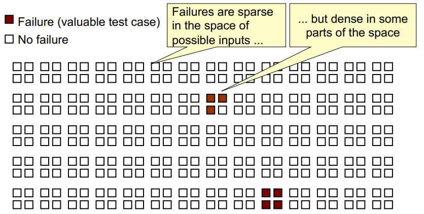

Assumendo che i **failure** siano densi in certi punti dello spazio di input, cerchiamo, secondo i principi del **test sistematico**, di **partizionare** tale insieme per definire delle classi che potrebbero o meno creare dei **failure**, così da avere un numero finito di elementi da testare.
Testando poi almeno un input nelle varie classi e trovando un **failure**, scopriamo il **fault**.


### FUNCTIONAL TESTING

Un metodo per eseguire il partizionamento descritto sopra è il testing funzionale, conosciuto anche come **specification-based testing** e **black box testing**.
Il testing funzionale utilizza le specifiche del programma per definire queste partizioni dello spazio degli input per poi testare ogni categoria di input e i confini tra di esse *(**boundary testing**)*.

La specifica di un programma può essere lunga e confusionaria ed è per questo che è importante suddividerla in varie parti **testabili indipendentemente** ***(atomiche)*** ragionando su come l'applicazione si comporta in base a vari input, parametri o risultati. Questa parte di scomposizione viene effettuata con due metodi principali:

- **Catalog-Based testing** che aggrega e sintetizza l'esperienza degli altri test designers in un certo dominio, così da aiutare a trovare i valori *interessanti*; radunare esperienza in una collezione sistematica può velocizzare il processo di design, facendo diventare alcune decisioni una routine, automatizzandole per permettere di usare lo sforzo umano maggiormente sull'identificazione delle caratteristiche del sistema.
  In particolare, il metodo catalog based utilizza l'esperienza degli altri designers per elencare per determinate condizioni i casi più importanti dei possibili valori *(e.g. un catalog su una variabile intera potrebbe indicare di testate l'elemento sotto al limite inferiore/superiore, il limite stesso e un elemento nell'intervallo ammissibile)*.
- **Category-Partition testing** che identifica i test objectives e caratterizza l'input space.
  Lo fa scomponendo le specifiche in parti atomiche e identificando per ognuna di esse **parametri** e **variabili d'ambiente** *(file di configurazione, contenuti di database, ecc)*.
  Successivamente si concentra su ogni input/parametro/risultato per individuare delle caratteristiche *(categorie di valori)* che permettono di discriminare il comportamento del programma e applica su ognuna di queste il boundary testing.
  Eventualmente può anche introdurre dei limiti sulle possibili combinazioni di valori.

In seguito, avremo una fase di **aggregazione**, in modo da poter identificare gli input *interessanti*, fatta attraverso il **test combinatorio** che identifica i vari attributi che possono variare *(e.g. un browser potrebbe essere IE oppure Firefox, mentre un OS potrebbe essere Vista o XP)* e genera delle combinazioni che possono essere testate *(e.g. IE con Vista, IE con XP, Firefox con Vista, Firefox con XP)*.
Tuttavia, se abbiamo un grande numero di variabili in gioco, l'approccio combinatorio puro può essere sconveniente, in quanto produrrebbe troppe combinazioni da poterle testare tutte; usando il criterio **pairwise** invece eseguiamo delle combinazioni a coppia *(se il budget lo permette si possono usare anche triple, quadruple ecc)*, riducendo drasticamente il numero di combinazioni da testare senza introdurre dei limiti *(che però potremo introdurre se volessimo)*.


**CONSTRAINTS**
Per ridurre il numero di combinazioni testabili, possiamo anche introdurre dei limiti *(ad esempio per evitare di testare combinazioni impossibili)*.
I constraints si indicano con un'etichetta.

- **[error]**: indica un valore che corrisponde ad un errore e che quindi va testato una volta, ma difficilmente potrà essere combinato con altri valori.
- **\[property\]\[if-property\]**: gestisce le combinazioni invalide di valori. In particolare **\[property\]** identifica un gruppo di valori con proprietà comuni, **\[if-property\]** limita la scelta di un valore che può essere combinato solo con un certo altro valore.
- **\[single\]**: indica un valore che l designer ***sceglie*** di testare una sola volta per ridurre il numero di test cases. Ha lo stesso effetto di *\[error\]*, ma è dettato da una scelta differente; è importante separarli per una corretta documentazione e per il regression testing.


**SOMMARIO**
Le specifiche dei requisiti generalmente sono espresse in linguaggio naturale, cosa che è un ostacolo per l'analisi automatica; il testing funzionale utilizza uno step manuale di **strutturazione** di specifiche in un set di **proprietà** e uno step automatizzabile di produzione delle **combinazioni testabili**.
Il metodo *brute force* è tedioso e porta ad errori; gli approcci combinatori decompongono il lavoro della forza bruta in diverse fasi per attaccare il problema in modo incrementale .

In particolare abbiamo ottenuto:

- Dal **Category Partition** la divisione del lavoro in uno step manuale di identificazione di categorie e proprietà e uno step automatico di generazione di combinazioni.
- Dal **Catalog Based** un miglioramento dello step manuale utilizzando dei pattern standard utili a identificare valori significanti.
- Dal **Pairwise Testing** la generazione sistematica di test suites più piccole.

<div style="page-break-after: always;"></div>

## TEST STRUTTURALE

Il testing strutturale utlizza sia il software che la specifica e, in particolare, estende un insieme di test basandosi su entrambi; difatti le informazioni strutturali di un programma più che aiutarci a decidere come scegliere i test, risultano utili in combinazione con altri test *(funzionali)* per identificare ulteriori test atti ad identificare faults che potrebbero essere sfuggite all'analisi black-box.
Si può dire che il test strutturale è utilizzato per valutare la robustezza e la completezza delle test suite generate dai test funzionali.

Abbiamo visto che per decidere se una test suite è adeguata o meno possiamo usare i criteri di adeguatezza, ma come possiamo definire un criterio di adeguatezza per i test strutturali?
L'idea di base è di considerare ogni ***statement*** del programma come una test obligation e dire che l'adeguatezza di copertura degli statement è soddisfatta se ogni statement del programma è eseguito da almeno un test della test suite e il risultato dei test è *pass*.
Diremo che il **coverage** *(copertura)* di una test suite è dato dal #statement_eseguiti / #statement_totali.
Diremo inoltre che la test suite soddisfa il **criterio di adeguatezza** se questa ha coverage = 1 *(o a 100%)*.

In sostanza, diremo che il **criterio di copertura** è soddisfatto per un programma se testiamo tutte le sue istruzioni *(quindi ad esempio testare tutti i branch degli if)*.
Ovviamente la copertura **non** è direttamente proporzionale al numero di test della test suite, ma dipende più che altro da quante istruzioni eseguono effettivamente i test stessi. Inoltre spesso si preferisce un test rispetto ad un altro in basse alle informazioni che ci da sul tipo di fault rilevato e su dove questo si trovi. 

Osserviamo l'esempio con tre test suite, che solo insieme eseguono tutti gli statement.

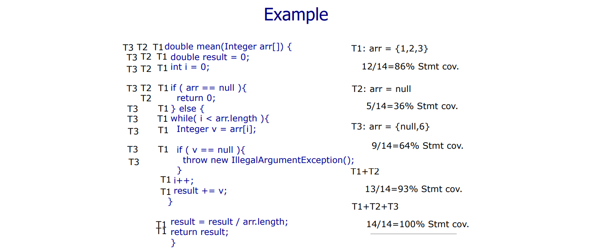

<div style="page-break-after: always;"></div>

## BASIC BLOCK TESTING

Un altro criterio di adeguatezza è il basic bloc testing, che considera dei blocchi di statement massimali che hanno un solo entry point ed un solo exit point *(ad esempio un **if** o un **while**)*. Sotto questa prospettiva, le istruzioni contigue appartengono ad uno stesso blocco finché non si incontra un *if*; gli statement condizionali terminano un blocco.
I cicli inoltre sono dei blocchi a se stanti.
L'idea alla base di questa strategia è quella di suddividere il programma in una serie di **basic blocks** da considerarsi ognuno come una ***test obligation*** e costruire un **Control Flow Graph** ***(CFG)*** che connetta i vari blocchi in base all'esito dello statement condizionale che termina il blocco *(ottenendo di fatto un DAG)*.

Il criterio di adeguatezza a questo punto è simile a quello dello **statement testing**, ovvero è soddisfatto solo quando la test suite esegue tutti i blocchi del CFG almeno una volta.
Difatti, il concetto alla base delle due strategie è lo stesso, la differenza sta nella granularità su cui si lavora: mentre nello statement testing testiamo le singole istruzioni, nel basic block testing testiamo una porzione di codice.

Tuttavia, nessuno dei due ci da alcuna garanzia sull'assenza di fault nel programma. Consideriamo il seguente programma:

```java
int abs(int x) {
    int r = 0;
    if (x < 0) {
        r = -x;
    }
    return r;
}
```

Consideriamo ora la test suite T<sub>A</sub> = { -1 };
Notiamo che la test suite soddisfa i due criteri in quanto esegue tutti gli statement/blocchi del programma, tuttavia non individua il fault causato da un valore di x > 0 in cui il  programma ritorna 0. Questo perché non stiamo considerando tutti i possibili esiti dello statement condizionale.


## BRANCH TESTING

L'idea alla base del branch testing è che un programma ha tanti **branch** *(salti)*; ogni branch allora rappresenta una test obligation e deve essere testato almeno una volta. Come prima, la copertura risulta essere 1 quando la test suite testa effettivamente tutti i branch del programma.
Stiamo quindi praticamente creando un grafo proprio come con il basic block testing, in cui gli archi sono i branch del programma.
Visitando tutti gli archi sono quindi certo di visitare anche tutti i nodi; questo implica che se una test suite soddisfa il criterio del ***branch testing***, essa soddisfa anche il criterio dello ***statement/basick block testing*** *(mentre non è necessariamente vero il contrario)*.

<div style="page-break-after: always;"></div>

## BASIC CONDITION TESTING

Abbiamo visto fino ad ora una categoria di test strutturali basata sugli statements, che espone le faults legate a come una computazione è stata suddivisa i casi.
Tuttavia, perfino il criterio del branch testing può non individuare alcune faults.
Consideriamo il seguente programma che ritorna true a = -1 o b = -1:

```java
boolean findMinusOne(int a, int b) {
    if (a == -1 || b == 1) {
        return true;
    } else {
        return false;
    }
}
```

Consideriamo ora la test suite T<sub>R</sub> = { <2, 3>, <-1, 3> };
Notiamo che seppur essa soddisfi il criterio di adeguatezza del branch testing, non individua il fault **b == 1**.

Abbiamo bisogno quindi di un'altra categoria di test strutturali per individuare questo tipo di faults, i ***condition testing***, di cui il primo esempio è il ***basic condtion testing***.
Il criterio di adeguatezza del basic condition testing stabilisce che, per essere adeguata, una test suite deve eseguire almeno una volta ogni **condizione basica**. Il rapporto sarà quindi dato dal numero di valori di verità delle condizioni che abbiamo ottenuto e dal doppio delle condizioni stesse *(poiché ogni condizione può avere due outcome; T o F)*.
Consideriamo ora il programma di prima

```java
boolean findMinusOne(int a, int b) {
    if (a == -1 || b == -1) {
        return true;
    } else {
        return false;
    }
}
```

e la seguente test suite T<sub>C</sub> = { <2, -1>; <-1, 3> };
Notiamo che essa soddisfa il criterio di adeguatezza del **basic condition testing**, ma non esegue tutto il codice, in particolare non esegue il secondo **branch** del programma.
Possiamo quindi dedurre che il soddisfacimento del criterio del **basic condition testing** ***NON*** implica il soddisfacimento del criterio del **branch testing**.

**BRANCH AND CONDITION**
Una soluzione a questo problema è unire i due criteri.
Consideriamo le seguenti test suite T<sub>A</sub> = { <-1, -1, -1>; <6, 7, 8> } e T<sub>C</sub> = { <-1, 2, 3>; <2, -1, 2>; <6, 7, -1>; <6, 7, 8> }.
Notiamo che entrambe soddisfano i criteri di branch e condition, tuttavia T<sub>C</sub> ci da più informazioni su dove si trovi un fault nel caso lo individuasse.

<div style="page-break-after: always;"></div>

## COMPOUND TESTING

Abbiamo detto che i criteri dei branch e delle basic conditions non sono comparabili in quanto nessuno dei due implica l'altro, dunque abbiamo bisogno di un test che controlli tutte le **combinazioni** di tutte le **condizioni** e percorra tutti i **blocchi di codice**; il ***compound testing*** effettua proprio questo lavoro.
Il criterio di adeguatezza del compound testing risulta soddisfatto solo se la test suite copre tutti i **branch** del programma E se valuta tutti i valori di tutte le **basic conditions**.

**ATTENZIONE**: poiché molti linguaggi di programmazione utilizzano ciò che è chiamata left-to-right/short-circuit evaluation, la quale implica che se abbiamo una catena di OR, non appena uno di essi risulta essere true, non andiamo a testare gli altri.
Discorso analogo vale per gli AND, ma con i false.
Questo ci permette di evitare di considerare tutte le possibili combinazioni in fase di testing.

Per esempio, per la condizione if( a == -1 || b == -1 || c == -1) basta la test suite
T = { <-1, *, *>; <2, -1, *>; <2, 3, -1>; <2, 3, 4>}.

Tuttavia, il compound testing ha un problema: il costo computazionale.
Difatti ha una **crescita esponenziale** dei casi di test da effettuare.
A volte la short-circuit evaluation riduce questo numero in modo che sia gestibile, ma non sempre.


## MODIFIED CONDITION/DECISION

L'idea alla base del MC/DC è di effettuare i test solo per le combinazioni **importanti** di condizioni, in modo da evitare la crescite esponenziale.
Le combinazioni **importanti** sono quelle condizioni che, se cambiate **singolarmente**, portano ad un cambiamento dell'output.


## WHY STRUCTURAL TESTING

Una possibile risposta è perché il test strutturale ci rivela cosa **manca** nella nostra test suite: se una parte di un programma non viene mai eseguita, le fault al suo interno non possono essere scoperte.

Il testing strutturale complementa quello funzionale; esso rappresenta un altro modo per individuare input trattati in modo diverso che però si affida al codice per farlo. Inoltre, il testing strutturale includere casi non scoperti nel testing funzionale, così come il testing funzionale può includere casi non scoperti nel test strutturale.

Tuttavia, eseguire tutti gli elementi del control flow **NON GARANTISCE** l'assenza di fault nel codice, il testing strutturale rimuove le inadeguatezze ovvie, ma non da alcuna garanzia di trovare tutti i fault.

A volte, nessuna test suite può soddisfare un criterio per un programma dato; in questo caso si possono escludere gli statement non raggiungibili *(tuttavia non possiamo sempre sapere per certo quali statement non verranno mai eseguiti)* oppure misurare quanto copre del programma la test suite.


## SECURITY IS NOT SAFETY

Definiamo:

- **SAFETY ENGINEERING**: prevenzione di danni *'catastrofici'* causati dal cattivo funzionamento di un sistema informatico.
- **SECURITY ENGINEERING**: prevenzione, difesa e recupero danni contro la possibilità di attacchi che possono mettere a repentaglio i valori rappresentati da un sistema informatico.

Tutte le misure di **safety** sono anche misure di **security**, mentre non è vero il viceversa.

Un problema di sicurezza, o *vulnerabilità*, può essere viso come una ***via alternativa***, un modo di usare il sistema non pensato dal progettista. Ovviamente più è complesso il sistema, più possono essere le vie alternative.
*Esempio*: un progettista di software di un auto potrebbe pensare che sia utile che le portiere si sblocchino quando la macchina si capovolge. Tuttavia, una via alternativa potrebbe essere far pressione sul tetto per aprire la macchina quando dovrebbe rimanere chiusa.


**CIA TRIAD**

- **Confidenzialità**: fa riferimento al fatto che una risorsa *(o un servizio)* deve essere accessibile solo a chi è autorizzato ad usufruirne.

  Può essere descritto anche come capacità di controllare/assicurare la **privatezza**/**riservatezza** delle informazioni rispetto a soggetti non autorizzati.
  Questo concetto non si applica solo, per esempio, al contenuto di un file, ma anche alla conoscenza dell'esistenza di tale file o meno o anche all'utilizzo di un certo mezzo *(ad esempio la rete)*.

- **Integrità**: fa riferimento al concetto di assicurazione che un'informazione non sia stata modificata e che quindi la risorsa sia fruibile nel modo esatto nel quale è stata resa disponibile.

  Può essere descritto anche come capacità di controllare/assicurare la **non modificabilità**/**attendibilità** da parte di soggetti non autorizzati delle informazioni.
  Il concetto di modificabilità si estende anche alla creazione/rimozione di oggetti *(anche se nel caso di rimozione si parla anche di interruzione di disponibilità)*, oltre che alla manomissione di informazioni.

  Due particolari sotto-casi del principio di integrità sono:

  1. **Autenticazione di mittente**: definisce la capacità di garantire l'identità del mittente.
  2. **Non-ripudio**: definisce la capacità di assicurare che il mittente non possa negare la paternità delle informazioni trasmesse.

- **Disponibilità** *(Availability)*: fa riferimento al fatto che se una risorsa deve essere accessibile a degli utenti, un attacco non deve inibire questo accesso *(esempio un attacco DDoS)*.

  Può essere descritto anche come capacità di controllare/assicurare la **possibilità di usare** risorse e servizi da parte degli utenti autorizzati.
  Alcuni esempi di attacchi alla disponibilità sono il crash di un sistema, la manomissione di algoritmi di scheduling per non far mai eseguire un certo processo o anche la distruzione fisica di un computer.

Gli attacchi alla triade CIA sono solitamente identificati come *DAD*:

- **Disclosure** > Confidentiality
- **Alteration** > Integrity
- **Destruction** > Availability

**USABILITY VS SECURITY**
L'obiettivo di fondo dell'informatica è favorire l'accesso alle risorse, mentre la sicurezza obbliga a limitarne l'accesso. Dunque spesso l'obiettivo della sicurezza è trovare il giusto compromesso tra usabilità e sicurezza del sistema.

Inoltre, spesso la sicurezza viene presa in considerazione solo dopo i primi incidenti; in realtà il compromesso citato sopra andrebbe preso in considerazione fin da subito, trovando un compromesso anche tra benefici e costi, che quindi richiede un'*analisi dei rischi*.


**ANALISI DEI RISCHI**
Rischio: **possibilità **di **perdita** o danno.
Nell'ambito della sicurezza il rischio è calcolabile come **Rischio = Vulnerabilità x Minacce x Valori** dove:

- **VALORI**: solo le parti del sistema informativo importanti, sensibili, critiche, da proteggere.
- **VULNERABILITÀ**: debolezze del sistema, attacchi che possono essere sfruttati per comprometterlo.
- **MINACCE**: circostanze o agenti che possono/vogliono arrecare danni.

Notiamo il fattore moltiplicativo; se le vulnerabilità sono poche, il rischio è basso, viceversa se le minacce sono basse si corrono pochi rischi. Se i valori non sono importanti, anche se ci fosse un attacco la perdita è minima.


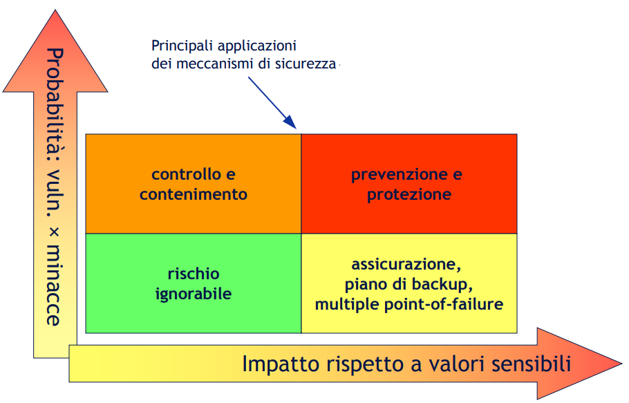

<div style="page-break-after: always;"></div>

## CRITTOGRAFIA

La crittografia *(dal greco **kryptos**, nascosto)* è una disciplina che studia tecniche per *codificare*/*decodificare* messaggi in modo da garantire la privacy della comunicazione fra due soggetti.
Essa **NON** è la soluzione per tutti i problemi di sicurezza, ma può essere uno strumento importante se implementata in modo corretto.

Generalmente un sistema crittografico fa uso di un algoritmo di crittografia governato da una **chiave** che permetta di garantire la confidenzialità ed integrità del messaggio e che permetta al destinatario di poterlo leggere.

Un sistema crittografico è formato da 5 parti

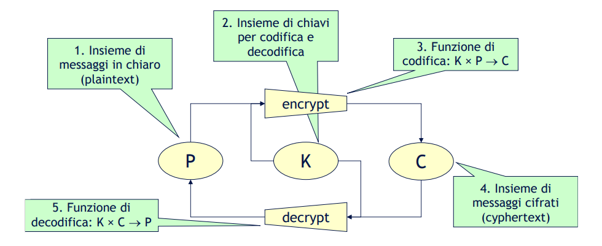

Un primo esempio di sistema crittografico è il **cifrario di Cesare** che consiste nello spostamento delle lettere utilizzando l'aritmetica in modulo n. Avremmo quindi:

- **P**: lettere alfabeto
- **C**: lettere alfabeto
- **K**: numeri da 1 a 25
- **encrypt(k, p)**: carattere a distanza k nell'alfabeto
- **decrypt(k, c)**: carattere a distanza -k nell'alfabeto

Il principale problema di questo sistema è il basso numero di chiavi disponibili, che lo rende molto vulnerabile ad un attacco di forza bruta.


**CRITTOGRAFIA E CRITTOANALISI**

- **Crittografia**: schemi/metodi/algoritmi per la codifica sicura dei messaggi.
- **Crittoanalisi**: rappresenta il tentativo di *violare* la crittografia attraverso lo studio di insiemi di messaggi crittati. È utile per scoprire le debolezze di un algoritmo crittografico o del suo ambiente di funzionamento.
  Si pone come obiettivo non solo quello di scoprire un messaggio, ma anche di scoprire le chiavi usate per la cifratura o addirittura dedurre significati segreti senza necessariamente decifrare i messaggi *(ad esempio guardando la frequenza di invio dei messaggi o la loro lunghezza)*.

Un algoritmo crittografico è violabile se può essere violato da un crittoanalista **a patto di disporre di risorse e tempo sufficienti** *(se non consideriamo il tempo e le risorse, teoricamente, ogni algoritmo è violabile con forza bruta)*.

Gli algoritmi ***degni di fiducia*** solitamente sono basati sulla matematica, analizzati da esperti e in uso da diverso tempo senza essere violati.
Ma devono anche essere **usabili**, ovvero il tempo necessario per crittare/decrittare i messaggi deve essere commisurato alla sicurezza necessaria, le chiavi non devono essere soggetti a requisiti complessi e il processo crittografico non deve essere troppo complesso per l'utente.

Ovviamente la prima cosa che pensiamo alla crittografia è la **confidenzialità** dei messaggi, ma gli algoritmi crittografici vengono usati anche per garantire **integrità** e **non ripudio**, similmente a quanto accade con i documenti fisici.

Gli algoritmi crittografici si dividono in 3 classi:

- **Algoritmi simmetrici a chiave segreta**: viene usata un'unica chiave sia per crittare che decrittare.
- **Algoritmi asimmetrici a chiave pubblica**: vengono usate chiavi diverse per crittare e decrittare.
- **Algoritmi di hashing**: il messaggio stesso è la chiave e servono a garantirne l'integrità.


## SISTEMI SIMMETRICI

Abbiamo detto che gli algoritmi simmetrici usano una stessa chiave per decrittare e crittare, dunque decrypt(k, encrypt(k, p)) = p.
Dunque, per istanziare una comunicazione confidenziale, due soggetti devono conoscere una chiave *k* non nota a nessun altro.

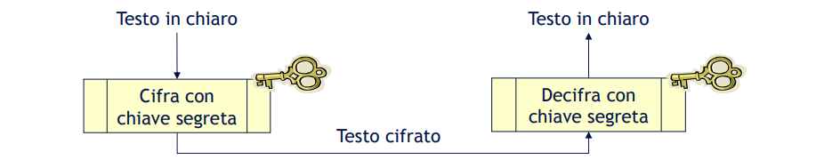


Assumendo che mittente e ricevente siano gli unici a conoscenza della chiave:

| REQUISITO                    | SI/NO | MOTIVO                                                       |
| ---------------------------- | :---: | ------------------------------------------------------------ |
| Confidenzialità              |  Si   | Solo chi conosce la chiave segreta può decodificare il messaggio. |
| Integrità                    |  Si   | Una volta crittato, il messaggio non è modificabile prima della decrittazione. Se venisse modificato il messaggio crittato, questo verrebbe corrotto. |
| Autenticazione e non ripudio |  Si   | Solo chi conosce la chiave segreta può crittare e quindi essere mittente del messaggio *(assumendo che il sistema funzioni e che quindi la chiave non venga condivisa)*. |

In questo caso **non è possibile** garantire uno solo di questi requisiti indipendentemente dagli altri.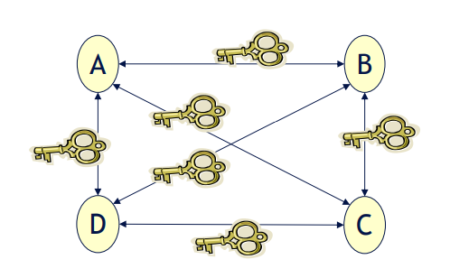

Un primo aspetto *controverso* di questi algoritmi riguarda lo scambio della chiave che deve avvenire ovviamente in modo sicuro, ma ne parleremo successivamente.
Un altro aspetto di questo tipo di algoritmi è il numero di chiavi necessarie; per $N$ individui che comunicano in maniera sicura a coppie abbiamo bisogno di $n(n-1)/2$ chiavi *(una per coppia, un numero quadratico)*!


**DES**
Un tipico algoritmo simmetrico è **DES: Data Encryption Standard** che codifica i messaggi in blocchi da 64 bit e che consiste nell'applicare iterativamente per 16 volte una funzione combinatoria ad ogni blocco usando una chiave di 56 bit come uno dei parametri della funzione stessa.

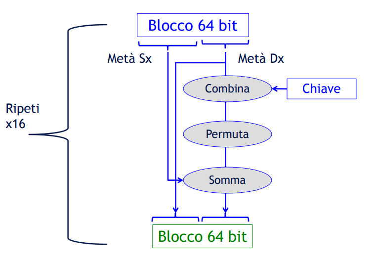Ovviamente, essendo un algoritmo simmetrico, lo stesso algoritmo che viene usato per crittare i messaggi viene usato anche per decrittarli. Inoltre, la particolarità di DES è che opera sui **bit**: combina i bit, permuta i bit, somma i bit. Questo rende l'algoritmo particolarmente adatto all'**implementazione su hardware** e quindi è **molto veloce** come algoritmo.

Alla sua uscita, nel 77, DES risultava non violabile con forza bruta *(ci sarebbero voluti 700 anni con la potenza computazionale di allora)*, tuttavia nel 97 venne risolto in circa 4 mesi usando la computazione parallela. Con la potenza computazionale di oggi probabilmente ci vuole poco a violare tale algoritmo.

Come risposta a ciò è stato creato triple DES che cifra 3 volte con 3 chiavi diverse, aumentando notevolmente il tempo stimabile per un attacco di forza bruta.

Un'evoluzione di DES è **AES (Advanced Encryption Standard)** che si basa sulle stesse operazioni di DES ma è estendibile, ovvero permette di usare chiavi di lunghezza variabile *(solitamente vengono usate chiavi da 128, 192 o 256 bit ma si può andare oltre)* e permette di eseguire più cicli di codifica, rendendolo di fatto molto più sicuro.

<div style="page-break-after: always;"></div>

## SITEMI ASIMMETRICI

I sistemi asimmetrici funzionano utilizzando due chiavi diverse per la decrittazione e per la crittazione; in particolare, ogni soggetto è in possesso di:

- **k_pub *(chiave pubblica)***: chiave conosciuta da tutti *(ad esempio pubblicata sul sito web del soggetto)*.
- **k_priv *(chiave privata)***: chiave a conoscenza solo del soggetto.

Nei sistemi asimmetrici si ha che un messaggio codificato con una chiave può essere decodificato solo dall'altra, dunque **decrypt(k_priv, encrypt(k_pub, p)) = p** & **decrypt(k_pub, encrypt(k_priv, p)) = p**.

Chiave pubblica e privata sono ugualmente strutturate, viene scelto *a caso* quale sia pubblica e quale privata.

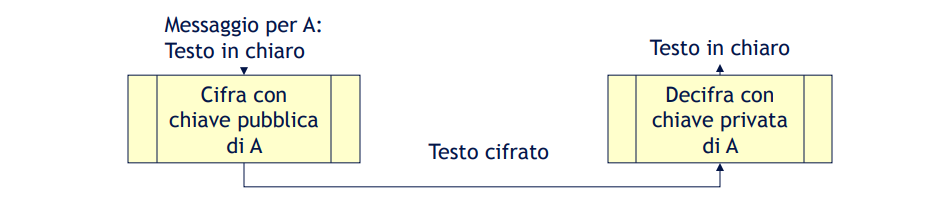


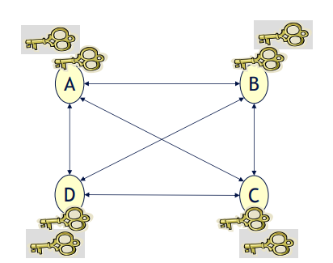
Un primo aspetto positivo di questo tipo di sistemi è che le chiavi necessarie per far comunicare N soggetti sono N coppie, si passa quindi da un valore n<sup>2</sup> ad uno 2n.


| REQUISITO                    | SI/NO | MOTIVO                                                       |
| ---------------------------- | :---: | ------------------------------------------------------------ |
| Confidenzialità              |  Si   | Solo chi conosce la chiave segreta può decodificare il messaggio crittato con la corrispondente chiave pubblica. |
| Integrità                    |  Si   | Una volta crittato, il messaggio non è modificabile prima della decrittazione. |
| Autenticazione e non ripudio |  Si   | Solo chi conosce la chiave segreta può essere mittente del messaggio crittato con chiave privata. |

Un altro aspetto interessante è che, in questo caso, posso gestire confidenzialità ed autenticazione in modo separato; se critto con la chiave pubblica, ho la certezza che il messaggio sia **confidenziale** e solo chi possiede la chiave privata possa leggerlo, se critto con la chiave privata , nessun atro può modificare il messaggio e crittarlo nuovamente con la mia chiave privata, quindi ho **integrità** e **autenticazione**.
Se critto il messaggio con la mia chiave privata e successivamente con la chiave pubblica del destinatario, ottengo sia **confidenzialità** *(il destinatario deve usare la sua chiave privata per decrittare il primo livello)* sia **integrità/autenticazione** *(userà la mia chiave pubblica per il secondo livello)*.

**RSA**
Un algoritmo a chiave pubblica è **RSA (Rivest, Shamir, Adleman)** che calcola chiave pubblica e privata come funzioni di due numeri primi molto grandi.
I numeri primi sono scelti casualmente e vengono scartati dopo il calcolo delle chiavi e la sicurezza dell’algoritmo si basa sulla difficoltà di risolvere il problema di fattorizzare numeri molto grandi.

Si basa sul teorema di Eulero che dice che, dati due numeri primi **p** e **q**, con **x** che non ha divisori comuni con *p* e *q*, vale **x<sup>(p-1)(q-1)</sup> = 1 (mod p\*q)**.

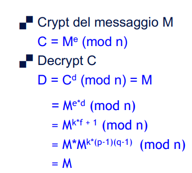RSA

- sceglie **p** e **q** molto grandi
- calcola **n = p \* q** ed **f = (p - 1)\*(q - 1)**
- sceglie **e**, **d** tali che **e \* d = 1 (mod f)**
- scarta **p**, **q** ed **f**
- usa **k_pub = (e, n)** e **k_priv = (d, n)**


Questo algoritmo è molto difficile da violare con la forza bruta, tuttavia può essere violato in altri modi, ad esempio se il sistema di generazioni usa dei numeri pseudo-casuali facili da determinare.
Un'altra **importante differenza** tra questo tipo di algoritmi e quelli simmetrici e che quelli asimmetrici sono molto più difficili da implementare e richiedono quindi più tempo per messaggi molto grandi.


## MESSAGE DIGEST

Un **message digest** è un '*riassunto*' di un messaggio, un checksum crittografico che caratterizza il messaggio. Idealmente, ogni digest corrisponde ad un solo messaggio, nella pratica non è possibile.
Gli algoritmi di message digest inoltre sono **non invertibili**, ovvero non è possibile risalire al messaggio originale partendo dal digest o comunque deve essere molto difficile trovare un altro messaggio che abbia lo stesso digest.

Il digest è utile per garantire l'integrità di un messaggio; supponiamo di avere un digest **MD** di un messaggio **MSG**, per calcolare l'integrità di **MSG** mi basta calcolare il suo digest e assicurarmi che corrisponda ad **MD**.

Un tipico algoritmo di questo tipo è **MD5** che applica una trasformazione combinatoria a blocchi di 512 bit del messaggio e genera un output a 128 bit.

| REQUISITO                    | SI/NO | MOTIVO                                                       |
| ---------------------------- | :---: | ------------------------------------------------------------ |
| Confidenzialità              |  No   | Il digest non implica alcun tipo di confidenzialità del messaggio, anche perché non è possibile risalire ad esso dal digest stesso. |
| Integrità                    |  Si   | La coppia <MSG, MD> permette di stabilire se il messaggio è integro o meno. |
| Autenticazione e non ripudio |  No   | Chiunque può generare il digest di un messaggio.             |

## PRESTAZIONI ALGORITMI

Abbiamo detto che RSA, rispetto a DES e MD5 è di parecchi ordini più lento, dunque solitamente RSA viene usato per crittare piccole quantità di dati.


**CHIAVI DI SESSIONE**
Solitamente, RSA e DES vengono usati insieme, in particolare

- Si cifra con RSA una chiave segreta casuale *(chiave di sessione)*
- Si usa la chiave di sessione come chiave segreta DES

In questo modo si sfrutta l'efficienza di DES e la maggiore flessibilità di RSA per la gestone delle chiavi.


**FIRME DIGITALI**
Abbiamo detto che RSA permette di implementare il non ripudio, cifrando con la chiave privata, tuttavia cifrare grossi messaggi può richiedere molto tempo. Dunque, spesso viene *firmato* solo il **digest** del messaggio, che è molto più piccolo.
In questo modo il destinatario riceve il messaggio in chiaro e il digest crittato con la chiave privata del mittente, in modo da poterlo verificare decrittando il digest con la sua chiave pubblica e confrontandolo con un digest generato da esso, in modo da assicurarsi che il messaggio sia integro.


## DISTRIBUZIONE CHIAVI

In un sistema crittografico a chiave pubblica, si usa la chiave pubblica di un utente per mandare messaggi confidenziali ad esso e per autenticare provenienza e integrità dei messaggi inviati dall'utente, ma bisogna essere certi che la chiave pubblica corrisponda effettivamente all'utente.

Un modo per garantire questo tipo di informazioni è usare un **certificato**, che generalmente è emesso da da un'**autorità di certificazione** *fidata e autorizzata*. Questi certificati sono rilasciati in formato **X.509** e contengono il nome dell'entità, la sua chiave pubblica, il nome dell'autorità di certificazione e la firma digitale dell'autorità, in modo che con la chiave pubblica dell'autorità si possa garantire l'integrità del certificato.

Un'autorità può inoltre certificare delle altre autorità creando quella che si chiama **catena di certificati**, in modo che poi gli enti certificati da quest'ultima possano essere verificati anche dall'autorità top level.
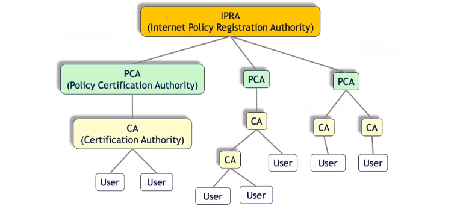Questo ci permette poi di creare un'infrastruttura di cui tutti si fidano che si occupa di certificare altre autorità di certificazione, in modo da poter rilasciare certificati più facilmente agli utenti.


## PGP

Un tool che utilizza le tecniche appena descritte è **Pretty Good Privacy** che utilizza RSA ed implementa crittografia e firme digitali.


**FIRME DIGITALI**

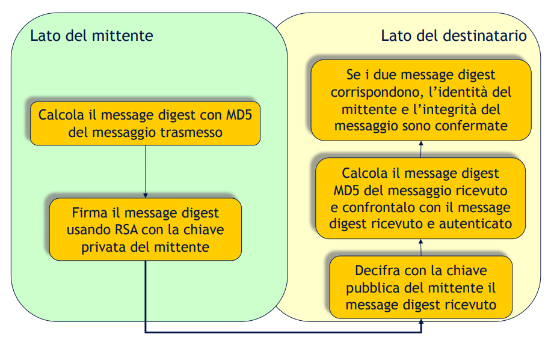


**CIFRATURA**

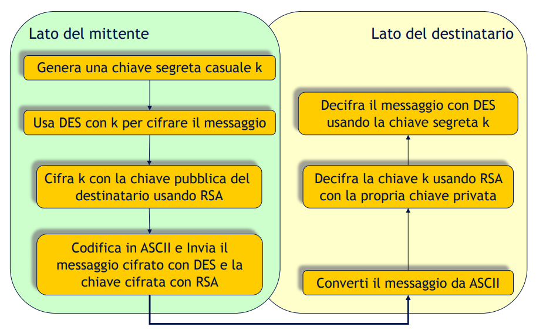


**RIASSUMENDO**

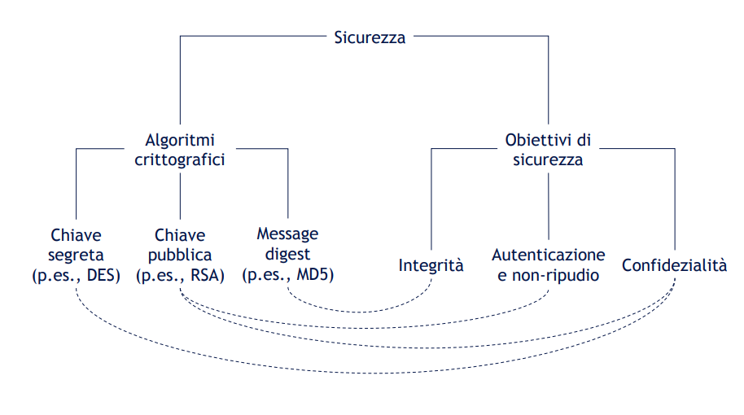


## SICUREZZA NEI SISTEMI OPERATIVI

Un **sistema operativo** è un *layer* intermedio tra le risorse fisiche di una macchina e le sue applicazioni, e che quindi virtualizza tali risorse per renderle disponibili alle applicazioni che verranno poi utilizzate dagli utenti.
Dunque, il sistema operativo si deve occupare di mantenere lo stato della memoria della macchina valido utilizzando tecniche di segmentazione e paginazione, di assicurarsi che tutte le applicazioni abbiano accesso alla CPU, di virtualizzare le connessioni I/O, di organizzare le informazioni sulla memoria di massa, di interpretare i comandi dell'utente.


**AREE DI INTERESSE PER LA SICUREZZA NEI SO**
Quello che può suscitare interesse nei sistemi operativi per quanto concerne la sicurezza è l'**autenticazione degli utenti**, la **protezione della memoria**, il **controllo degli accessi** da parte degli utenti ai file piuttosto che alle periferiche I/O e la relativa condivisione di risorse fra utenti.


## AUTENTICAZIONE

L'obiettivo dell'autenticazione è quello di evitare che soggetti non autorizzati riescano ad accedere alle risorse del sistema. Esistono diversi metodi per implementare l'autenticazione, alcuni sono:

- **DIMOSTRAZIONE DI CONOSCENZA**: richiede all'utente di fornire un PIN, una password o una **challenge/response** che consiste nel chiedere all'utente un problema che può essere risolto solo da chi è autorizzato ad accedere al sistema, quindi la risposta vera è propria può cambiare ogni volta, al contrario delle password.
  In generale, il sistema si assicura che l'utente sia autenticato se possiede la conoscenza richiesta.
- **DIMOSTRAZIONE DI POSSESSO**: richiede all'utente di dimostrare il possesso di chiavi fisiche *(ad esempio su chiavetta usb o anche una OTK inviata al mio smartphone)* come potrebbero essere delle *smartcard*.
- **CARATTERISTICHE PERSONALI (BIOMETRIA)**: si basa sulla biometria dell'utente e quindi usa dati come le impronte digitali, il riconoscimento del viso, della voce.


**USO DI PASSWORD**
L'autenticazione tramite password richiede all'utente di introdurre una password che, in teoria, solo lui conosce e se questa corrisponde a quella che il sistema ha memorizzato, l'utente viene autenticato.
È buona norma che il sistema operativo memorizzi le password in formato *hash* *(e quindi un digest della password, ricordiamo che i digest sono non-invertibili)*. Questo evita che, nel caso qualcuno abbia accesso al file delle password del sistema operativo, non siano rivelate le password in chiaro. Inoltre, questo permette al SO di autenticare semplicemente calcolando il digest della password in input e confrontarlo con quello salvato.


**SICUREZZA PASSWORD**
Non sono nuovi gli attacchi di tipo brute force ai sistemi protetti da password, quindi è buona norma implementare alcune norme che ne aumentino la sicurezza e l'improbabilità di essere indovinata.


In ordine di complessità avremmo

- Password assenti
- Password uguali/derivate da user ID *(è importante tener conto che nel password file del sistema operativo ci sono i nomi utente)*
- Nomi comuni
- Vocabolari con sostituzioni banali *(a = @, a = 4, i = 1)*
- Dizionari completi per una o più lingue
- Password con numeri e lettere minuscole e maiuscole
- Password con set completo di caratteri.

È anche possibile sfruttare informazioni su sistemi di generazione di password per sferrare questo tipo di attacchi, anche se le password generate sono complesse dal punto di vista dei caratteri usati.

È buona norma quindi evitare di usare password troppo semplici che sarebbero facilmente identificabili con dei dizionari di password *(che contengono i più comuni nomi di persone, animali domestici, date e parole di uso frequente)* e di usare un set di caratteri ampio. Inoltre, scrivere o ripetere la password ne mette a repentaglio la sicurezza.


**PASSWORD FILE CRIPTATI**
Abbiamo detto che le password non sono salvate in chiaro, ma viene salvato il loro hash.
Ma se due utenti scelgono la stessa password?
In questi casi viene utilizzato un *salt*, ovvero un numero di 12 bit random che viene aggiunto alla password prima di eseguirne l'hash e viene poi salvato nel file delle password, in modo da concatenarlo alla password in chiaro e poter risalire all'esatto hash in fase di autenticazione.

**Multiple Point of Failure**: il sistema, oltre a mantenere le password crittate, protegge anche il file delle password.


**ONE TIME PASSWORD (CHALLENGE/RESPONSE)**
In questi casi, la password è in realtà una funzione matematica $F(x)$ che l'utente sa calcolare; dunque il sistema propone all'utente un valore a caso $x$ e l'utente calcola $F(x)$.
Un esempio di questo tipo di password potrebbe essere una funzione segreta di numeri o stringhe, oppure un generatore di numeri disponibile all'utente e al sistema *(le OTK delle banche)* o anche una funzione crittografica.


**PROCESSO DI AUTENTICAZIONE**
Un sistema di autenticazione ben progettato

- Non fornisce dettagli su nomi utente e sistema prima che l'autenticazione avvenga *(non dice ad esempio se il nome utente è giusto ma la password no, in caso di password errata rifiuta l'autenticazione e basta, senza dare informazioni sull'user ID)*.
- Può essere *lento* intenzionalmente per scoraggiare attacchi di forza bruta.
- Può disabilitare gli utenti dopo un numero di tentativi errati.
- Può utilizzare un'autenticazione a più fattori.
- È resistente ad attacchi basati *sul tempo di risposta*; ovvero la risposta non deve dipendere da quanto della password è stato indovinato o meno *(immaginano un algoritmo che controlla la password carattere per carattere)*.


## ACCESSI DALLA RETE

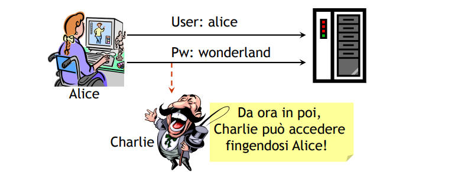Attraverso la rete abbiano un problema in più da considerare; le informazioni trasmesse dall'utente e dal sistema possono essere intercettate *(man in the middle attack)* e quindi, inviando per esempio le password in chiaro, rende il nostro sistema vulnerabile.


Un protocollo di autenticazione su rete ben progettato, solitamente fa uso di **crittografia in abbinamento a meccanismi di challenge/response**, in cui il sistema richiede all'utente di crittare un messaggio con la sua chiave segreta *(dunque la funzione challenge in questo caso è una funzione crittografica)*.
Ma questo non basta, poiché il messaggio crittato può essere intercettato, quindi la challenge deve cambiare ogni volta per evitare che un messaggio crittato possa essere riutilizzato *(questo tipo di challenge si chiamano **nonce**)*.

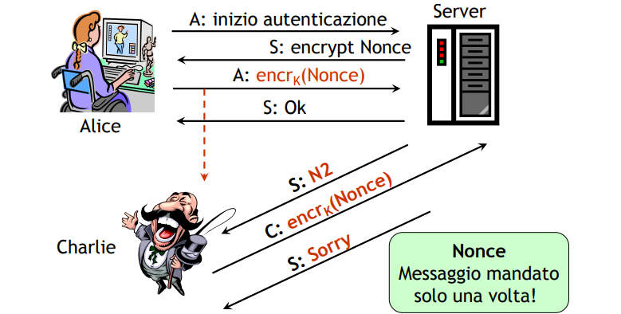


Spesso l'autenticazione è bidirezionale, ovvero non solo il server richiede all'utente di crittare un nonce, ma anche l'utente richiede al server di codificare un suo nonce.

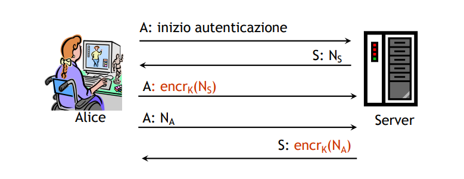


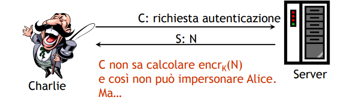Questo sistema però crea una falla che permette di sferrare i cosiddetti **reflection attacks**.

Supponiamo che l'attaccante, che sa che l'autenticazione è bidirezionale, abbia intercettato una sessione di comunicazione tra l'utente e il server, in particolare ha intercettato la parte di autenticazione del server.
Supponiamo che l'attaccante blocchi il nonce dell'utente che serve per autenticare il server ed inizi subito una nuova richiesta di autenticazione; a questo punto il server si aspetta sia il nonce dell'utente iniziale, sia il resolve della nuova fase di comunicazione.
A questo punto l'attaccante può usare la sessione dell'utente iniziale per inviare al server il nonce che ha ricevuto nella sua sessione, e farlo quindi crittare al server stesso per poi utilizzare il messaggio crittato per autenticarsi sulla propria sessione.

In rosso è rappresentata la sessione dell'utente, mentre in nero quella dell'attaccante.

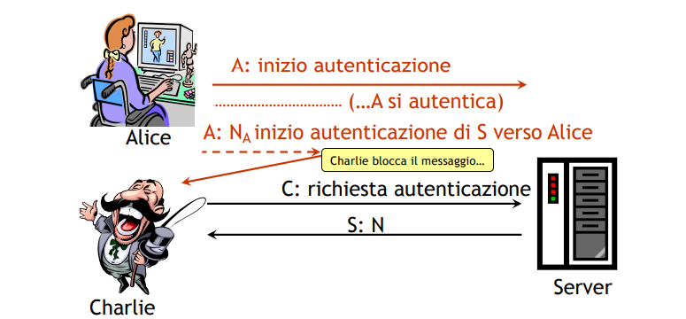


Un altro requisito per un buon algoritmo di autenticazione in rete è dunque che i **messaggi debbano riportare degli indentificativi degli utenti nei messaggi crittati**, proprio per evitare questo tipo di attacchi.
In questo modo il messaggio che l'attaccante poteva riflettere pima non ha più potere poiché l'attaccante si identificherebbe al server come il server, e quindi non avrebbe senso.

Ricapitolando, i tre requisiti per un sistema di autenticazione in rete sono

1. Crittografia in abbinamento a challenge/response
2. Cambiare il challenge ogni volta *(nonce)*
3. Inserire identificativi nei messaggi crittati.


**AUTENTICAZIONE BIDIREZIONALE ASIMMETRICA**
Un protocollo simile è che soddisfa i tre requisiti descritti sopra ma che usa le chiavi pubbliche è il protocollo Needham-Shcroeder.
Nel primo passaggio l'utente critta la propria identità e un nonce per il server con la sua **chiave pubblica**, in modo che solo il server possa leggerlo. Il server risponde con la conferma e il nonce per l'utente, crittandolo con la chiave pubblica dell'utente. Infine l'utente manda la response al nonce del server.

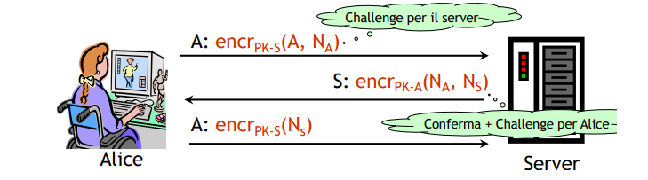

Tuttavia, questo protocollo è vulnerabile, poiché il secondo e il terzo messaggio non includono identificativi del mittente.
In particolare, questo protocollo è vulnerabile al reflection attack; un attaccante può far credere all'utente di essere il server e ottenere le utente dell'utente per poi identificarsi al server vero.

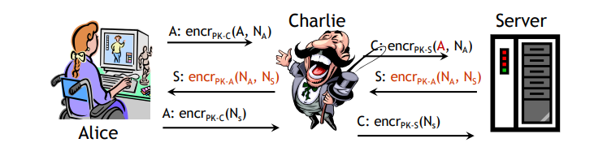

Introducendo degli identificativi anche nel secondo e nel terzo messaggio questo bug può essere risolto.

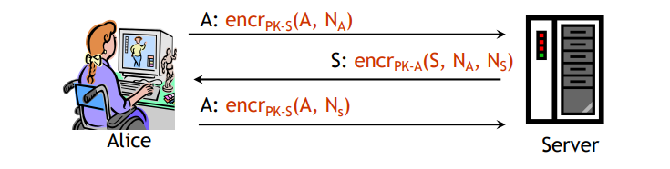

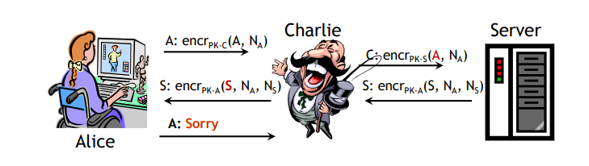

<div style="page-break-after: always;"></div>

## CONTROLLO DEGLI ACCESSI AGLI OGGETTI PROTETTI

Una prima definizione di controllo degli accessi è la capacità del sistema operativo di attribuire ad ogni risorsa *(file, dischi, stampanti)*, per ogni utente, gli accessi consentiti.

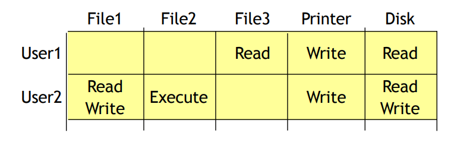

Una tabella del genere tuttavia non viene utilizzata dal sistema operativo poiché è molto sparsa e richiederebbe molta memoria per mantenerla.

Come viene gestito allora l'accesso alle risorse?
Ci possono essere diversi approcci, uno molto *primitivo* potrebbe essere quello di avere una **password di accesso alle risorse**, che quindi richieda, per ogni risorsa, una password d'accesso.
Questo meccanismo è però **poco raffinato** e **poco usabile** poiché

- Distingue solo tra *possibilità* e *divieto* di accesso
- Difficile ricordare una password per ogni risorsa
- Difficile tenere traccia di chi ha accesso o meno
- Difficile gestire programmi che accedono a molte risorse
- Difficile revocare i diritti di accesso *(dovrei cambiare la password e distribuire la nuova password a tutti gli altri utenti)*


**ACCESS CONTROL LIST**
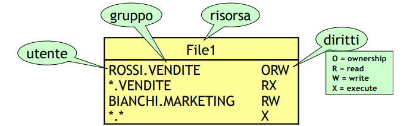Un meccanismo più raffinato è quello di usare una *access control list*, che è un'informazione associata ad ogni risorsa che definisce i permessi di accesso per quella risorsa e per i vari utenti e/o gruppi di utenti. Questo permette un grosso risparmio di spazio rispetto alla tabella completa e facilita sia la verifica di chi abbia o meno accesso alle risorse che la revocazione dei diritti di accesso.


**BIT DI PROTEZIONE (UNIX)**
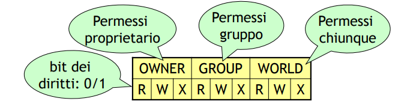Una possibile implementazione delle ACL più semplificata può utilizzare un numero fisso di bit per ogni file che ne specifichi i diritti di accesso. In particolare, vengono usare delle ACL di 9 bit che rappresentino i diritti di *lettura*, *scrittura* ed *esecuzione* rispettivamente per il proprietario del file, per un certo gruppo di utenti *(che potrebbe essere per esempio il gruppo del proprietario)* e per il resto degli utenti.
Questa semplificazione, seppur meno granulare *(posso distinguere un solo gruppo a differenza di prima)* delle ACL *complete* richiede molta meno memoria ed è ancora più semplice da gestire.

<div style="page-break-after: always;"></div>

**OBIETTIVI GENERALI DEL CONTROLLO DEGLI ACCESSI**
Un buon design di controllo degli accessi deve implementare:

- **MEDIAZIONE COMPLETA**: deve, idealmente, controllare ogni accesso alle risorse; il controllo deve avvenire ad *ogni* accesso alle risorse. È un principio *ideale*, normalmente il SO può memorizzare degli accessi in cache per essere più efficiente.
- **PRIVILEGI MINIMI**: l'idea è di poter fornire, per ogni risorsa, dei privilegi minimi per ogni utente del sistema operativo; un utente deve poter avere solo il diritto di lettura piuttosto che solo quello di esecuzione ecc.
  Una ACL ideale permette questo, l'ACL implementata con i bit di protezione fa già dei compromessi: posso avere dei diritti per l'owner, dei diritti per un certo gruppo e dei diritti per il resto delle persone, ma non posso definire dei diritti per un secondo gruppo diverso dagli altri.
- **CONTROLLO DELL'USO APPROPRIATO DEGLI OGGETTI PROTETTI**: ogni soggetto può eseguire solo parte delle operazioni che partecipano in una transazione *(separation of duty)*.


**COVERT CHANNELS**
L'idea è che se il SO abbia definito dei diritti per una certa risorsa e faccia una mediazione completa, possono esistere dei *canali alternativi* non ovvi sui quali vengono trasmessi i dati sensibili, contravvenendo alle limitazioni imposte dal SO.
Un esempio può essere quello di un utente che può leggere un certo file, ma non può eseguirlo; a questo punto l'utente può leggere il file e trascriverlo in un altro file con diversi diritti ed eseguirlo.
Meccanismi più *nascosti* potrebbero codificare i dati nei nomi dei file, con una codifica segreta in file legati o sfruttando la presenza/assenza di oggetti in memoria.


**DISCRETIONARY/MANDATORY ACCESS CONTROL**
Il controllo all'accesso può essere

- **DISCREZIONALE** *(es ACL)*: il proprietario di una risorsa può concedere l'accesso ad altri a sua discrezione.
- **MANDATORIALE**: il sistema impone un modello che limita e controlla la discrezionalità degli utenti nell'assegnare i diritti di accesso alle risorse.
  Definiscono in maniera precisa la relazione di accessibilità tra soggetti e oggetti del sistema in base a obiettivi e requisiti di sicurezza specifici, fortemente dipendenti dal dominio applicativo.

<div style="page-break-after: always;"></div>

## MANDATORY ACCESS CONTROL

**SICUREZZA MULTI LIVELLO**
Un primo esempio di MAC è la sicurezza multi-livello, che nasce in ambito militare per garantire la confidenzialità dei dati.
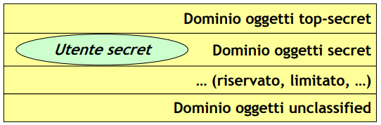In questo tipo di modelli vengono classificati i livelli di sicurezza per i soggetti e per gli oggetti e l'accesso ad una risorsa viene consentito solo se **livello soggetto $\geq$ livello oggetto**.


**MODELLO BELL LA-PADULA [CONFIDENZIALITÀ]**
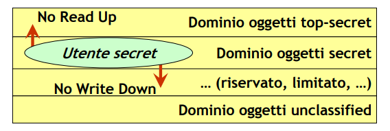Dobbiamo però assicurarci che se un soggetto rilascia un oggetto sensibile, bisogna gestire opportunamente i casi in cui la risorsa viene acquisita da un altro soggetto.
Un modello che si occupa di questo principio è il **Modello di Bell-LaPadula** implementando due proprietà:

1. **Simple security property** *(no read-up)*: un soggetto non può leggere oggetti di classificazione più alta.
2. **Confinement property** *(no write-down)*: un soggetto non può scrivere oggetti di classificazione più bassa. Questa proprietà evita che un utente possa trasferire dei documenti della sua classificazione a livelli più bassi, eliminando un possibile covert channel.


**MODELLO BIBA [INTEGRITÀ]**
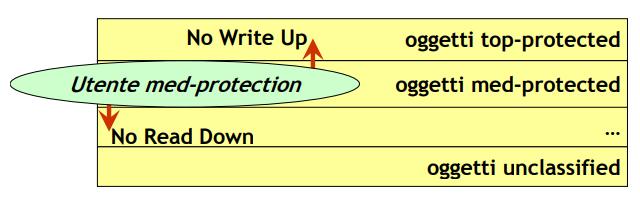Un altro modello, questa volta orientato all'integrità, e quindi di interesse per l'uso commerciale ad esempio, è il modello BIBA che è una *rilettura* del modello La-Padula orientato però all'integrità più che alla confidenzialità. Esso implementa due proprietà:

1. **Simple integrity axiom** *(no write-up)*: un soggetto non può modificare oggetti di classificazione più alta. In questo modo si possono consultare documenti più protetti *(pensiamo a dei contratti)* in modo libero, essendo sicuri che siano integri poiché solo chi è al livello dei documenti può modificarli.
2. **Integrity confinement axiom** *(no read-down)*: un soggetto non può leggere oggetti di classificazione più bassa. Il motivo è sempre evitare dei covert channel nei quali un utente legge documenti di livello più basso e li copia al suo livello di integrità. In questo modo un utente può definire dei contratti a livelli più bassi, garantendone l'integrità, ma non può promuovere l'integrità di documenti a livello più basso.


**PROBLEMI NOTI**
I sistemi multi-livello sono complessi da amministrare poiché bisogna definire dei livelli per ogni oggetto e per ogni soggetto. Inoltre, spesso richiedono delle applicazioni dedicate.
Un altro problema è che tendono a forzare una *over-classification* delle informazioni, richiedi cioè di classificare anche risorse che non ne avrebbero bisogno.
Se pensiamo in un contesto di rete inoltre, un modello come quello di Bell La-Padula, che non permettere di leggere a livello superiore, implica che le write-up siano *blind*, cioè senza acknowlegement.

<div style="page-break-after: always;"></div>

## MODELLI MULTI-LATERAL

Mentre i modelli multi livello controllava i flussi in di informazione in base al livello di criticità, i modelli multi laterali li controllano in base a raggruppamenti semantici dei dati e degli utenti *(Compartimenti, Progetti, Gruppi, Ruoli)*.

La prima politica che vedremo è semplicemente un'estensione del modello di Bell La-Padula in cui oltre ai livelli ci sono anche dei *compartimenti*. A questo punto un utente può accedere ad una risorsa solo se **livello soggetto $\geq$ livello oggetto** AND **compartimenti oggetto $\subseteq$ compartimenti soggetto**.


**MURAGLIA CINESE**
Questo modello è nato per gestire i conflitti di interesse fra risorse di progetti diversi, ovvero per controllare il flusso di dati critici tra aziende concorrenti, limitando l'accesso alle informazioni riservate di una data compagnia da parte di consulenti.
La politica d'accesso presenta tre livelli: gli **oggetti singoli** sono inclusi in **dataset aziendali** inclusi in **classi di COI fra dataset**.

La regola d'accesso per un soggetto S ad un oggetto O è dunque
**dataset(O)  = dataset(O' che S ha già letto) OR dataset(O) $\notin$ COI(O' che S ha già letto)**.
Ovvero un soggetto può leggere solo dataset che ha già letto o dataset che non siano in conflitto di interesse con i dataset degli oggetti già letti da S.


**CLARK-WILSON**
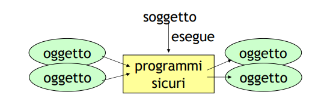Questo modello è orientato ai domini commerciali e quindi all'integrità dei dati.


Si basa su due principi

1. **Well formed transactions**: gli oggetti sensibili sono modificati da un piccolo insieme predefinito di programmi sicuri *(nucleo trusted)*.
2. **Separation of duty**: ogni soggetto può eseguire solo parte delle operazioni che partecipano in una transazione. Quindi, per eseguire una transazione sono necessari più soggetti.


**AUDITING E INTRUSION DETECTION** *(non approfondita)*
Generalmente i dati che un SO può tracciare sono la lettura/scrittura dei dati, la creazione/distruzione di un oggetto, l'accesso degli utenti al sistema, le operazioni amministrative *(creazione utenti)*, le operazioni in modalità privilegiata.

I sistemi di intrusion detection sono dei sistemi *(automatici e non)* che analizzano questi dati per determinare/prevenire tentativi di compromissione o uso non autorizzato del sistema.


**PRINCIPI DI PROGETTAZIONE PER SO TRUSTED**
I principi sono i minimi privilegi, la mediazione completa, l'autorizzazione negata per default, multiple point of failure, separation of duties, separazione fra utenti, protezione rispetto al riutilizzo di risorse e accounting e auditing. Tutto ciò in considerazione dei requisiti di usabilità.

## SICUREZZA NELLE APPLICAZIONI

**GLOSSARIO**

|          TERMINE          | SIGNIFICATO                                                  |
| :-----------------------: | ------------------------------------------------------------ |
|    **SECURITY POLICY**    | Un insieme di regole che determinano come un sistema o un'organizzazione protegge le risorse critiche e sensibili. |
|       **WEAKNESS**        | Un tipo di errore nel progetto o nell'implementazione oppure un'operazione di un sistema software che, in condizioni appropriate, può portare all'introduzione di una *vulnerabilità* nel sistema. |
|     **VULNERABILITÀ**     | L'occorrenza di una o più *weakness* in un sistema software. Può essere sfruttata da terze parti per violare la *security policy* del sistema. |
|        **EXPLOIT**        | Una tecnica che permette di sfruttare una *vulnerabilità* per violare la *security policy* di un sistema. |
|   **MINACCIA (THREAT)**   | Causa di violazione della *security policy* di un sistema che può causare danni (accesso non autorizzato, rivelazione o modifica di informazioni, disabilitazione di un servizio). |
|   **ATTACCO (ATTACK)**    | Un'azione o una tipologia di azione *(**schema di attacco**)* intenzionale volta alla violazione della *security policy* di un sistema. |
| **ATTACCANTE (ATTACKER)** | Entità che effettua un *attacco*.                            |
|     **CONTROMISURA**      | Un'azione o tecnica che elimina, previene, mitiga o individua una *vulnerabilità*, *minaccia* o *attacco*. |


**ATTACCHI**

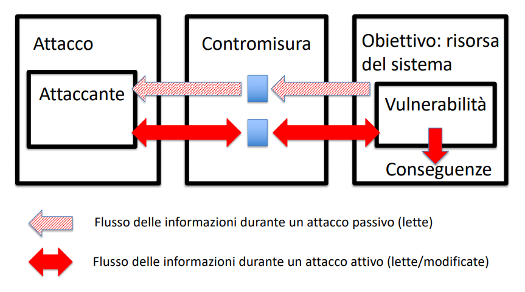Possiamo osservare come, per eseguire un *attacco*, un *attaccante* sfrutta una *vulnerabilità* (e quindi esegue un *exploit*) del sistema attaccato o per ricavare informazioni dal sistema *(attacco passivo)* o per eseguire determinate azioni sul sistema *(attacco attivo)*. Le contromisure sono inserite tra l'*attaccante* e la *vulnerabilità* del sistema.


<div style="page-break-after: always;"></div>

**CARATTERISTICHE DI UN ATTACCO**
Un *attacco* può essere caratterizzato da diversi fattori:

- **TIPOLOGIA**
  - Attivo: Altera le risorse del sistema.
  - Passivo: Acquisisce informazioni dal sistema e basta.
- **POINT OF INITIATION**
  - Interno: L'*attaccante* ha accesso alle risorse del sistema, ma le vuole utilizzare in modo differente.
  - Esterno: L'*attaccante* non ha accesso alle risorse, risiede al di fuori del perimetro del sistema.
- **METHOD OF DELIVERY**
  - Diretto: L'*attaccante* attacca il sistema direttamente.
  - Indiretto: L'*attaccante* utilizza un terzo sistema per accedere al sistema target o per amplificare l'*attacco*.


**CATALOGHI**
Diverse organizzazioni si occupano di collezionare e riportare *weakness*, *schemi di attacco*, *vulnerabilità* di software noti. Le più note sono MITRE, finanziata dal dipartimento della difesa americana, il Web Application Security Consortium, non legato ad organizzazioni governative e l'Open Web Application Security Project, non-profit e sostenuta da diverse aziende.

Alcuni cataloghi

- **Common Weakness Enumeration (CWE)**: È un elenco formale di *weakness* destinato agli sviluppatori e agli esperti di sicurezza.
- **Common Attack Pattern Enumeration and Classification (CAPEC)**: Un catalogo di *attack pattern*; mentre CWE descrive le *weakness* presenti in un software, CAPEC descrive come queste sono tipicamente sfruttate dagli *attaccanti*.
- **Common Vulnerability and Exposures (CVE)**: Un elenco aggiornato di *vulnerabilità* che riguardano software molto diffusi.


**COMMUNICAZIONE CLIENT/SERVER**
L'web è basato su un'architettura client/server; il client invia delle richieste al server tramite il protocollo HTTP utilizzando un URL che indica la risorsa *(pagina)* richiesta e contiene il nome del server web.
Nella versione più semplice di HTTP il client apre una connessione TCP, richiede una risorsa, il server risponde e chiude la connessione.

Le pagine web sono scritte in HTML e CSS che vengono interpretati dal client e visualizzati. Il client può fare delle richieste GET, passando dei parametri al server nel URL, o delle richieste POST, inserendo i parametri nel campo *body* della richiesta. In entrambi i casi il server genera dinamicamente una pagina HTML con il contenuto appropriato; questa generazione dinamica avviene tramite lo **scripting server-side**, ovvero il server esegue del codice per generare la pagina. È possibile però fare anche dello **scripting client-side** tramite JavaScript; il codice è incluso nella pagina nei tag *\<script\>*. Attraverso questo codice è possibile accedere ad alcune informazione *(cookies)*, osservare o modificare lo stato del documento HTML o inviare richieste HTTP.


## ATTACCHI BASATI SU INJECTION

Andiamo ora a vedere come è possibile utilizzare quello che sappiamo sulla comunicazione client/server per sferrare degli *attacchi*, in particolare passando al server dei parametri inaspettati.


**NEUTRALIZZAZIONE IMPROPRIA**
Avviene quando manca un controllo sugli input passati dall'utente.

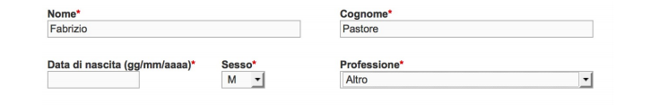

Cosa succede se inserisco un valore sbagliato, ad esempio, nel campo *data di nascita*?
Generalmente non sappiamo cosa può succedere, poiché non sappiamo fino a dove arriva quel valore nell'applicazione; se penetra in certi contesti d'uso potrebbe essere utilizzato in modi imprevisti, e quindi il valore errato va *neutralizzato* prima dell'uso.
Speso viene aggiunto un controllo lato client *(nella pagina stessa)* ma tuttavia è insufficiente: un utente malevolo potrebbe inviare i dati direttamente al server web, senza passare per il form della pagina web. È necessario dunque anche un controllo lato server.

**Esempio**: [www.things.com/orders.asp?custID=112&itemId=20&qty=20&**price=200**](https://www.youtube.com/watch?v=dQw4w9WgXcQ)
Nel caso in cui mancasse un controllo lato server, cambiando il valore del prezzo, un *attaccante* potrebbe acquistare degli articoli ad un prezzo ridotto. Lo stesso problema è presente anche nelle richieste POST; sebbene il contenuto non sia visibile nel URL, un *attaccante* potrebbe comunque creare delle richieste ad hoc.

La soluzione è verificare la correttezza degli input sia lato client che lato server.

<div style="page-break-after: always;"></div>

## CROSS SITE SCRIPTING (XSS)

È un attacco di tipo code injection che si verifica quando un *attaccante* riesce ad eseguire del codice malevolo all'interno del browser di un utente sfruttando una *vulnerabilità* di un sito web ignaro dell'*attacco*. Il codice malevolo è implementato in un linguaggio di scripting, come JavaScript, poiché, seppur sia eseguito in un ambiente protetto *(il browser)* che non permette la modifica del sistema ospitante, permette di accedere ad informazioni sensibili come i ***cookies***, permette di inviare richieste HTTP verso qualsiasi destinazione e può modificare l'HTML della pagina corrente.


**CONSEGUENZE**

- **Furto di cookie**: si può accedere ai cookie tramite la variabile *document.cookie*; l'*attacante* potrebbe inviarli al proprio server e utilizzarli per estrarre dati sensibili come ID di Sessione per altri servizi *(tipo Amazon)*.
- **Keylogging**: l'*attaccante* può registrare un keylogger tramite un event listener per registrare ed inviare al proprio server tutti i caratteri inseriti dall'utente *(e ricavarne quindi potenziali password)*.
- **Phishing**: l'*attaccante* può creare un fake login *(ad esempio della banca)* per indurre l'utente a introdurre i propri dati.


**TIPOLOGIE**
Esistono tre tipologie di attacchi di tipo XSS:

- **Persistent XSS**: il codice malevolo risiede nel database del sito web e la *vulnerabilità* è presente nel codice di script del server; questa permette all'*attaccante* di caricare sul server il codice malevolo che verrà poi scaricato dalla vittima.

  *Esempio*: l'*attaccante* inserisce un commento in un forum contente dello script malevolo; appena un utente richiederà di vedere gli ultimi commenti, il server invierà anche lo script malevolo, che il browser della vittima interpreterà ed eseguirà.

- **Reflected XSS**: il codice malevolo risiede nella richiesta HTTP della vittima; l'*attaccante* ha in qualche modo fatto sì che la vittima invii una richiesta HTTP al server all'interno della quale ci sia il codice malevolo. La *vulnerabilità* risiede sempre nello scripting lato server.

  *Esempio*: l'*attaccante* invia alla vittima un URL che esegue una GET verso un server che restituisce i parametri stessi della GET *(ad esempio il server potrebbe restituire una pagina con: "Hai cercato: {parametri}")*; come parametri, l'*attaccante* inserisce lo script malevolo. Quando la vittima cliccherà sul link, il server restituirà una pagina con lo script malevolo che il browser della vittima interpreterà ed eseguirà.

- **DOM-Based XSS**: il codice malevolo risiede ancora nella richiesta HTTP della vittima come prima, ma la *vulnerabilità* questa volta risiede nello scripting lato client.

  *Esempio*: ipotizziamo di avere un sito per scegliere il linguaggio preferito che si aspetta delle richieste del tipo [www.site.com/page?**default=French**](https://www.youtube.com/watch?v=GWNwwuoc4Ro) per impostare una scelta di default; il server genera poi una pagina dinamica e la invia al client che la costruisce nel proprio browser. L'*attaccante* può a questo punto creare un URL malevolo impostando **default=\<script\> ... \<\\script\>**.
  Il server invierà una pagina dinamica che estrae tale default dall'URL lato client, dunque **NON** invia lo script malevolo alla vittima, ma quest'ultima, eseguendo la pagina dinamica, lo estrarrà ed eseguirà dal URL stesso tramite il suo motore JavaScript.

<div style="page-break-after: always;"></div>

**PERSISTENT XSS**
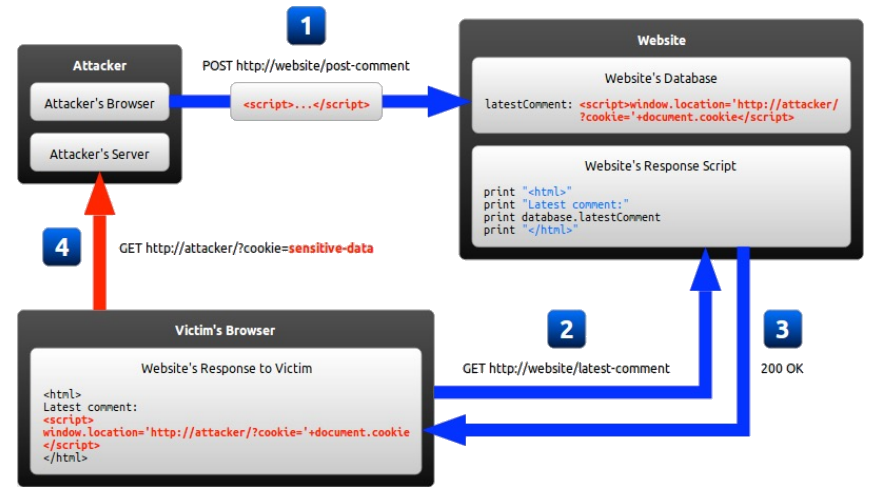L'idea è che l'*attaccante* utilizzi un form del sito web per inserire del codice malevolo nel database del sito **(1)**; la vittima, ignara, richiederà una pagina al server web **(2)** che, ignaro anch'esso, includerà nella pagina il codice malevolo **(3)**, in modo che poi il browser della vittima lo esegua **(4)**.


**REFLECTED XSS**
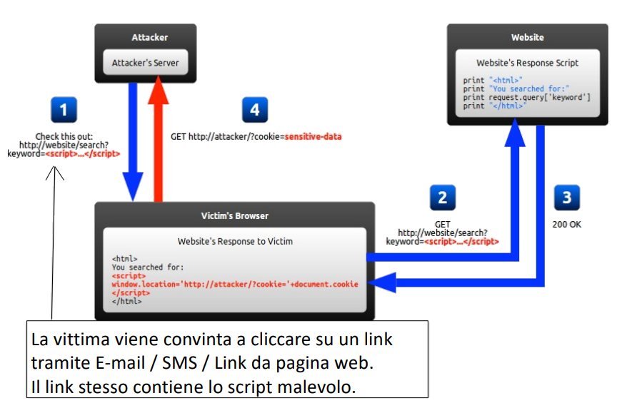L'idea qui è che l'*attaccante* crei un URL contenente una stringa malevola **(1)** e lo invii alla vittima convincendola a cliccarci sopra **(2)**; a questo punto il sito web a cui si riferisce l'URL invia una pagina di risposta alla vittima contente la stringa malevola **(3)**. Il browser della vittima interpreta la stringa malevola come script valido e lo esegue **(4)**.


**DOM-BASED XSS**
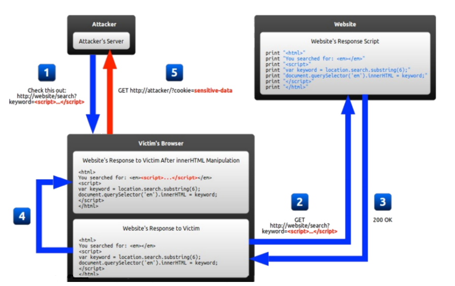Questo tipo di XSS sfrutta lo scripting lato client e l'inizio è simile a prima: l'*attaccante* crea un URL con lo script malevolo **(1)** e lo invia all'utente che ci clicca **(2)**. Il server questa volta risponde con una pagina dinamica **(3)**; il codice JavaScript all'interno di questa pagina estrae il codice malevolo dall'URL **(4)** e lo esegue nel browser della vittima **(5)**.

<div style="page-break-after: always;"></div>

**CONTROMISURE**
Le contromisure adottate per questo tipo di attacchi si basano sulla purificazione dell'input dell'utente; questo tipo di operazione può essere configurata in base al contesto d'uso del codice HTML, dal momento di prevenzione *(cioè se farlo al ricevimento di codice HTML o all'invio della pagina)* e dalla locazione del controllo *(client side o server side)*. I principali metodi si basano sulla **codifica** e sulla **convalida**.


**CONTESTO**
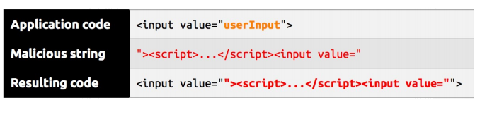In questo esempio, la stringa d'attacco sfrutta il fatto che il carattere `"` viene visto come terminatore dal browser e può essere utilizzato per inserire del codice nella pagina web.
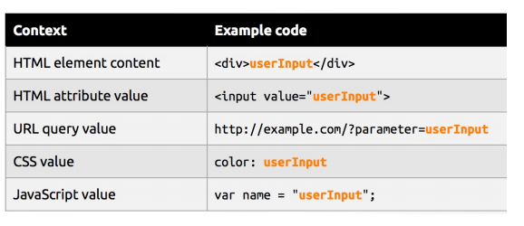La soluzione potrebbe essere disabilitare l'inserimento del doppio apice. In un contesto differente però *(ad esempio se il terminatore fosse `#` )* questa soluzione sarebbe inutile.
Occorre dunque considerare i diversi contesti in cui un input viene inserito.


**INBOUND/OUTBOUND**
Ci si riferisce al momento in cui l'applicazione può effettuare i controlli:

- Inbound: alla ricezione dell'input.
- Outbound: all'invio dell'input all'utente.

La scelta di una strategia o dell'altra dipende dall'architettura dell'applicazione; se il sistema ha un unico punto di ingresso ovviamente è più semplice fare un controllo inbound, viceversa se l'input viene costruito tramite diverse chiamate è più semplice outbound.


**LOCAZIONE CONTROLLO**
Ovviamente, implementare un controllo lato server protegge da *Persistent* e *Reflected* XSS, mentre un controllo lato client protegge da *DOM-Based* XSS, poiché abbiamo detto che i primi due sfruttano *vulnerabilità* nello scripting lato server, mentre il terzo usa *vulnerabilità* dello scripting lato client. 


**ENCODING**
La tecnica dell'encoding consiste nella trasformazione *(escaping)* degli input in modo che il browser non possa interpretarli come codice. Vengono tradotti ad esempio i caratteri `<` e `>` in `$lt;` e `&gt;`. Queste operazioni vengono effettuate da libreria apposite ed è fortemente sconsigliato implementarle da zero in quanto potrebbero essere molto complesse.
JavaScript, per alcune funzioni fornite dal sistema, implementa l'encoding in maniera trasparente.

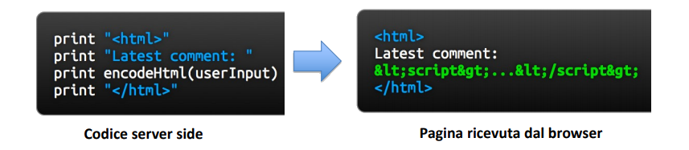

**CONVALIDA DELL'INPUT (VALIDATION)**
Gli approcci si distinguono per

- **Strategia di Classificazione**: ovvero come identificare un input valido da uno non valido; le principali tecniche sono:
  - **Blacklisting**: si elencano le caratteristiche degli input pericolosi attraverso dei pattern *(regex)*.
    Questa soluzione è complessa, in quanto sono molti i pattern da elencare e inoltre invecchia male; bisogna cioè aggiungere ogni volta nuovi input pericolosi man mano che vengono scoperti.
  - **Whitelisting**: si elencano i pattern degli input validi.
    Questa soluzione ha una complessità che varia in funzione della complessità dell'input e generalmente è più longeva.
- **Outcome**: gli input invalidi possono essere gestiti in due modi:
  - **Rejection**: l'input viene scartato.
  - **Sanitization**: viene rimosso il codice non valido dall'input e si mantiene solo la parte non pericolosa. Per effettuare sanitization è meglio affidarsi a librerie note e ben testate, in quanto è un processo molto complesso.


Possiamo osservare un esempio di encoding nella seguente immagine: generalmente i browser moderni implementano di default dei meccanismi di sicurezza come questo per proteggersi dagli attacchi DOM-Based *(meglio non fare assunzioni sul browser utilizzato da un cliente però)*.

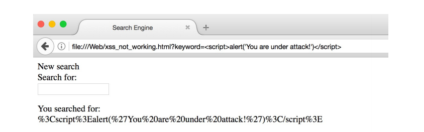

È anche importante notare che uno sviluppatore potrebbe anche decidere di decodificare l'input codificato dal browser per esigenze di sviluppo, rendendo il codice vulnerabile ad attacchi DOM-Based.

Questo tipo di attacchi può anche inviare informazioni personali a qualsiasi altro server, nell'esempio sottostante si invia l'userAgent *(informazioni sul browser utilizzato)* ad una ricerca google.

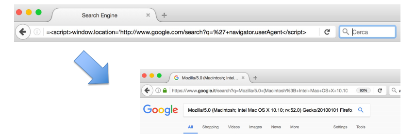


## SQL INJECTION

Un altro attacco basato sull'injection è il SQL Injection, che consiste nell'inserimento in un sistema di una query SQL attraverso l'input utente. L'obiettivo è modificare l'esecuzione di un comando SQL parametrico all'interno dell'applicazione, agendo sul parametro stesso. Questo tipo di attacchi può leggere/modificare dati sensibili da un database, eseguire operazioni di amministrazione *(shutdown)* o recuperare file presenti nel DBMS.

Vediamo un esempio: il server si aspetta nei campi **uid** e **pwd** un nome utente ed una password, ma se, sfruttando il terminatore `'`, inseriamo del codice SQL possiamo ottenere diversi risultati. In questo caso viene settato l'utente *fabrizio* come admin.

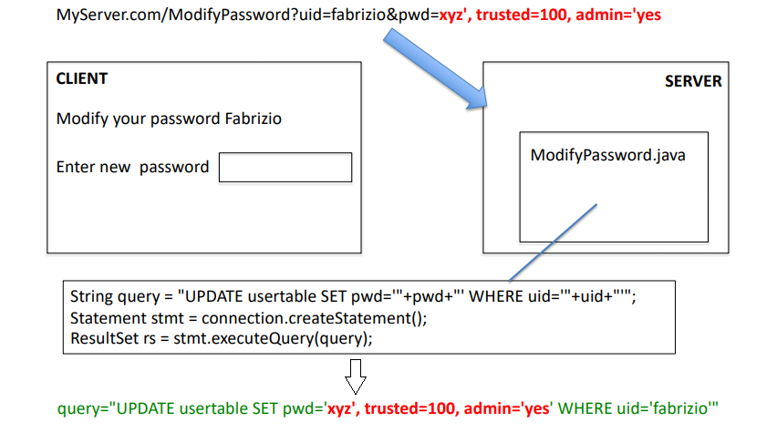


**CONTROMISURE**
Anche qui, una buona contromisura è utilizzare delle librerie di encoding dell'input, in modo che non venga riconosciuto come comando valido.

<div style="page-break-after: always;"></div>

## BUFFER MANIPULATION

Un **buffer** è uno spazio di memoria dove possono essere conservati dei dati, come un array o una stringa.
Un primo attacco basato sulla buffer manipulation è il **buffer overflow**, che si basa sulla scrittura in uno spazio di memoria al di fuori dei limiti del buffer predisposto, andando a sovrascrivere i valori nelle aree di memoria adiacenti.
In linguaggi come Java, operazioni del genere solitamente non sono permesse e generano delle eccezioni di tipo *OutOfBounds*, ma, per esempio, in C viene lasciata libera scelta al programmatore che può anche scegliere di non fare nulla se il programma prova ad accedere ad aree di memoria fuori dal buffer.

Solitamente, un buffer overflow viene causato da un programma che copia un buffer *a* contente dati ricevuti da un utente in un buffer *b* **senza effettuare controlli** sul fatto che *b* sia abbastanza grande da contenere i dati.


**STACK & ACTIVATION RECORD**
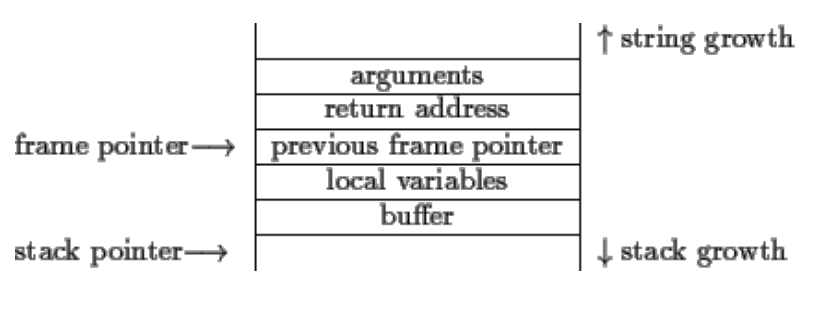Quando viene evocata una funzione, viene allocata della memoria per i parametri della funzione, per le variabili locali della funzioni e per l'**indirizzo di ritorno** della funzione e il **previous frame pointer**, ovvero l'indirizzo delle variabili locali del chiamante.
Questa struttura è detta **activation record** della chiamata di funzione.

Ogni volta che un metodo viene invocato, nello stack viene allocato un nuovo activation frame. Il *previous frame pointer* è chiamato anche *Base Pointer (BP)*.
Lo stack inoltre cresce verso il basso; parte da 0xffffffff e *cresce* fino a 0x00000000. Gli array invece vengono riempiti verso i numeri alti di memoria. Questo fa si che una scrittura out of bound vada a sovrascrivere le aree di memoria che precedono la memoria dedicata all'array.


Consideriamo il seguente programma

```c
int f(){
	int pass;
	int buff[8];
	pass = 0;
	buff[8] = 97;
	printf("%d\n", pass);
	return 0;
}

int main(int argc, char* argv[]) {
	int x;
	x = 1;
	f();
	printf("%d\n", x);
}
```


Notiamo che il main chiama una funzione *f()* che dichiara un array di 8 posizioni e scrive sulla nona, quindi scrive in buffer overflow. Quando il main viene chiamato, sullo stack viene allocato il suo activation frame, che conterrò anche la sua variabile *x*. Quando il main chiama *f()*, verrà allocato un nuovo activation frame sullo stack, quello di *f()*, contenente anche la sua variabile *pass* e il suo buffer *buff*.

Notiamo come quando *f()* scrive in buff[8], non sta facendo altro che sovrascrivere un area di memoria sopra il buffer stesso *(perché appunto i buffer crescono verso l'alto)*, in particolare sovrascrive la variabile *pass*.

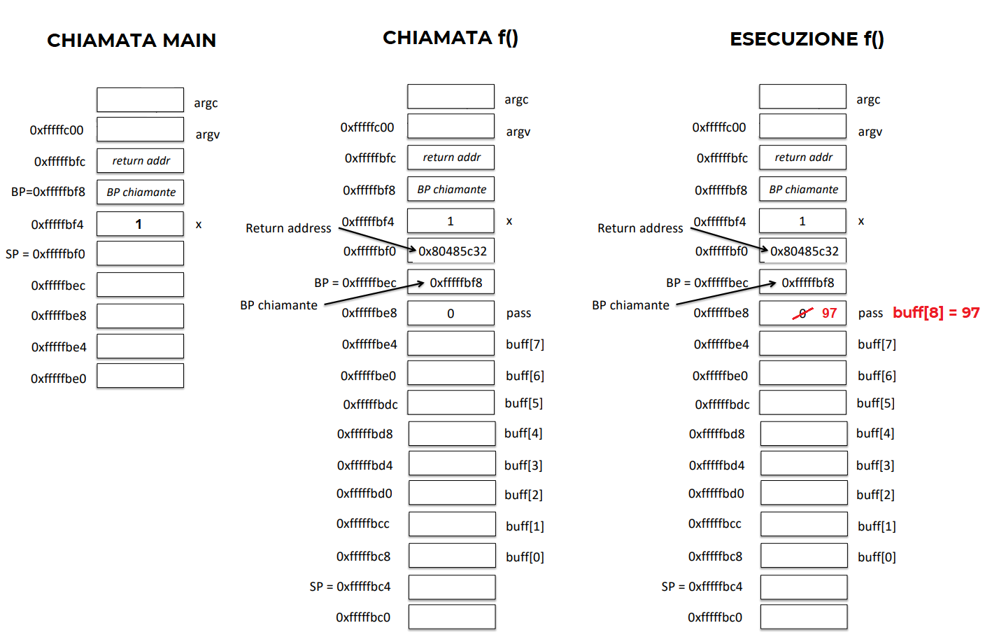

La cosa interessante tuttavia è che, tramite buffer overflow, si può scrivere in qualsiasi area di memoria *raggiungibile* dal buffer, come ad esempio il **return address**; se modifichiamo quella zona di memoria, possiamo far eseguire al programma del codice malevolo, poiché a questo punto la funzione, anziché tornare al main, salterà all'indirizzo inserito.

Un esempio di *vulnerabilità* di tipo buffer overflow è l'ormai deprecata funzione **gets()** di C che prende un input da tastiera e lo inserisce in un buffer, senza però controllare che le dimensioni del buffer siano sufficienti. Al suo posto viene usata **fgets(buf, BUFSIZE, stdin)** che copia al più BUFSIZE byte nel buffer. Tuttavia, un programmatore che usa male fgets potrebbe comunque scrivere del codice vulnerabile ad un buffer overflow, come in questo esempio dove viene usato un numero diverso dalla dimensione del buffer per BUFFSIZE *(ad esempio perché magari inizialmente il buffer era di 300 byte e il programmatore non ha aggiornato correttamente il codice)*:

```c
void readFile(char *fileName) {
	char buf[256];
    int bytes = 300;
	fgets(buf, bytes, file);
}

int main(int argc, char *argv[]) {
	readFile(argv[1]);
	return 0;
}
```

**SHELLCODE**
Generalmente, il codice eseguito negli attacchi di tipo buffer overflow è uno **shellcode**, ovvero un piccolo programma che usa la chiamata di sistema *execve* per sostituire il processo corrente con uno nuovo, in questo caso con una shell.
Solitamente, durante un buffer overflow, vengono scritte in memoria *(solitamente all'interno del buffer stesso)* una serie di NOP *(istruzione assembly che non fa nulla)* di contorno allo shellcode vero e proprio, in modo da poter eseguire un salto '*impreciso*', utile se lo stack cresce in maniera non deterministica.

Per un *attaccante* è utile eseguire lo shellcode in programmi eseguiti con privilegi di amministratore, in modo che anche lo shellcode abbia tali permessi.


**ATTACCO**
Per portare a termine un *attacco*, bisogna '*riempire*' la memoria in un certo modo; occorre scrivere un indirizzo valido in BP per non causare *segmentation faults*; si potrebbe usare per esempio il BP del chiamante, ottenibile monitorando con un debugger un'esecuzione precedente del sistema *(gli indirizi di memoria sono virtuali e non variano tra le esecuzioni)*. Un altro approccio può essere provare l'attacco più volte con valori casuali di BP finché l'attacco non ha successo.

A questo punto il buffer vero e proprio *(la porzione 'valida')* viene sovrascritta col codice malevolo e si sostituisce il **return address** con un indirizzo all'interno del buffer, che si trovi prima della parte di shellcode. Veranno eseguite quindi un po' di NOP fino ad arrivare allo shellcode.

È importante notare che i buffer overflow scrivono **tutta** la zona in overflow, non possono scrivere, ad esempio, solo il return address; è molto difficile che ci sia una *weakness* in grado di permettere ciò e, anche se fosse, a quel punto l'*attaccante* può già saltare al suo codice malevolo, senza necessità di iniettarlo tramite buffer overflow, implementando un altro tipo di attacco.


Esempio di file di input che permetta l'attacco:

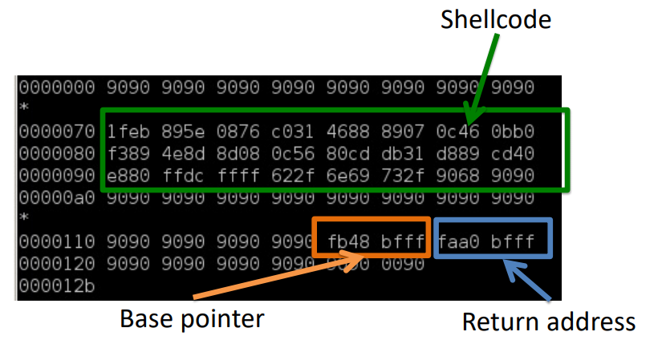


**HEAP BUFFER OVERFLOW**
Abbiamo visto buffer overflow su stack, ma questo tipo di attacco può essere fatto anche sullo heap; non permette la scrittura del return address, ma può modificare comunque altre variabili come i puntatori a funzione.

<div style="page-break-after: always;"></div>

**CONTROMISURE: CANARY VALUE**
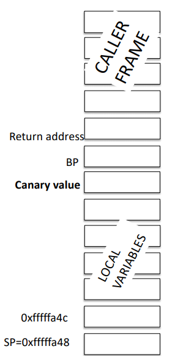Un primo tipo di protezione contro questi attacchi sono i *canary value*; il compilatore inserisce delle istruzioni a compile time che, ad ogni invocazione di funzione, inseriscono un valore di controllo sullo stack, dopo il BP. Tipicamente il *canary value* è un valore random, generato in fase di inizializzazione del programma.
Ad ogni uscita di funzione viene controllato il *canary value* che deve essere identico al valore inserito in precedenza *(il sistema lo ricorda poiché lo memorizza in un area di memoria 'lontana' dallo stack)*. Se il controllo fallisce, viene sollevato un messaggio d'errore e l'esecuzione termina.

Generalmente il compilatore permette diversi layer di protezione:
**-f-stack-protector**: aggiunge il *canary value* solo alle funzioni che possono presentare *vulnerabilità* con maggiore probabilità *(allocazione, buffer grandi)*.
**-f-stack-protector-all**: controlla tutte le funzioni, ma è costoso in termini computazionali.
**-f-stack-protector-strong**: compromesso tra protezione e overhead.


**ADDRESS SPACE LAYOUT RANDOMIZATION (ASLR)**
Questa è la *contromisura* addotta nei moderni sistemi operativi; alcuni indirizzi di memoria del virtual address space cambiano da un esecuzione all'altra, rendendo più difficile la scrittura degli *exploit*; diventa difficile indovinare l'indirizzo da utilizzare per sovrascrivere il *return address* e il *Base Pointer*.


**EXECUTABLE SPACE PROTECTION**
Questo tipo di *contromisura* richiede il supporto dell'hardware e permette al sistema operativo di distinguere le aree di memoria contenenti dati da quelle contenenti codice da eseguire.
Nei processori è supportata tramite il bit NX: l'ultimo bit di un indirizzo indica se una pagina contiene codice eseguibile o meno.
Praticamente in questo modo si rende la memoria dati non eseguibile; anche se l'*attaccante* scrive l'*exploit* nel buffer, questo non potrà essere eseguito.


**ESP vs JIT**
Alcuni linguaggi interpretati fanno uso di compilatori Just-in-time *(JIT)* che interpretano uno script di input e generano al volo del codice eseguibile in linguaggio macchina. Questo codice va posizionato per forza su pagine eseguibili.
Questo permette di eseguire degli attacchi tramite JIT *(JIT spraying)* che sfruttano il buffer overflow senza incappare nella *contromisura* dell'ESP poiché utilizzano la memoria dedicata al compilatore JIT.


**BUFFER OVERFLOW IN JAVA**
Java protegge i buffer da buffer overflow, tuttavia il codice *nativo* intorno ad un programma Java può essere affetto da *vulnerabilità* di questo tipo *(ad esempio la JVM che è scritta in C++ o le librerie implementate in linguaggio nativo)*.


**BUFFER OVERREAD**
Con buffer overread si intende un attacco il quale determina la lettura di una zona di memoria oltre i limiti di un buffer.
Tale zona di memoria potrebbe contenere dei dati sensibili che potrebbero essere rivelati all'attaccante.
Un esempio è **heartbleed**, riguardante SSL.

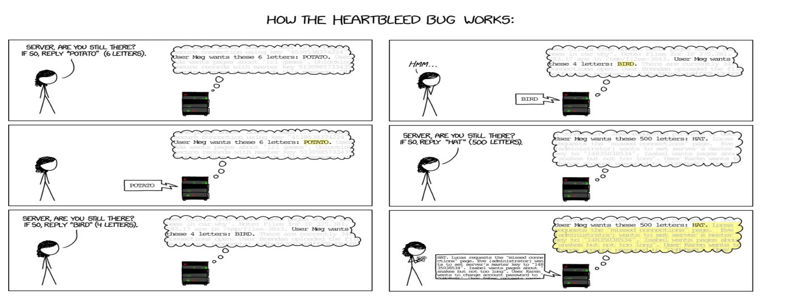

Il bug era reso possibile da un mancato controllo del parametro **length** del messaggio **heartbeat** che viene mandato al server per verificare che questo sia ancora online; questo poteva essere sfruttato per recuperare informazioni utili.
La correzione implementa un controllo del parametro **length** con la lunghezza effettiva del messaggio: se discordano la richiesta viene scartata silenziosamente.

<div style="page-break-after: always;"></div>

## NULL POINTER DEREFERENCE

Prima di parlare degli attacchi che sfruttano la null pointer dereference, vediamo cosa sono i **puntatori** in C.

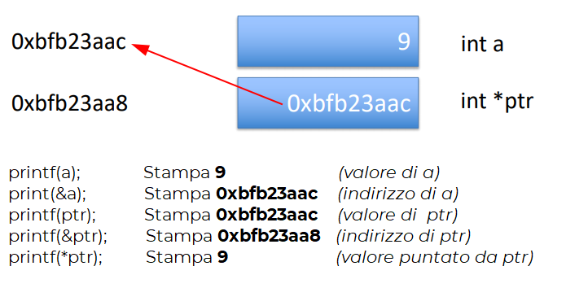**PUNTATORE**: Variabile che contiene un '*numero*' che rappresenta un indirizzo di una cella di memoria.
In C si indicano con **type *\*nome***; accedendo a ***nome*** si ottiene l'indirizzo contenuto nel puntatore, accedendo a ***\*nome*** si ottiene il valore della cella puntata dal puntatore *(con &nome si accede all'indirizzo della variabile nome)*.

Quando una variabile puntatore non punta a niente, le viene assegnato il valore **NULL**; per il sistema operativo questo è dunque un indirizzo invalido, utilizzarlo genera un *segmentation fault*, ma per l'hardware è un indirizzo come gli altri ed è l'indirizzo 0, ovvero l'indirizzo della prima cella di memoria.


**MEMORIA E PROCESSI**
I sistemi operativi assegnano ad ogni processo un proprio spazio di indirizzi di memoria virtuale e ogni processo opera sul proprio spazio di indirizzi virtuale. Questi indirizzi vengono mappati su indirizzi fisici dalla **MMU** *(quindi l'indirizzo **x** del processo **A** corrisponde ad una cella di memoria che è diversa da quella a cui corrisponde l'indirizzo **x** del processo **B**)*.

I processi possono accedere solo ad indirizzi di memoria a loro assegnati, provando ad accedere ad altri indirizzi non assegnati genera un'eccezione, ma possono chiedere al sistema operativo di mappare indirizzi virtuali su indirizzi fisici tramite la funzione di sistema **mmap**, che, preso come parametro l'indirizzo fisico da mappare e la regione da mappare *(potrebbe essere ad esempio un file)*, restituisce l'indirizzo della memoria mappata o MAP_FAILED se la chiamata fallisce.


**MMAP E INDIRIZZO 0**
Se assegniamo con **mmap** la pagina 0 all'interno dello spazio di indirizzi del processo, l'indirizzo 0 *(NULL)* diventa un indirizzo valido, ovvero non avremmo più *segmentation fault* utilizzandolo.

**NOTA**: la *segmentation fault* lanciata dal sistema quando il programma dereferenzia un puntatore NULL serve per evitare errori più difficili da notare, che potrebbero avere conseguenze peggiori.


**COME VIENE SFRUTTATO**
Tipicamente quanto detto viene sfruttato per iniettare dati malevoli all'interno di un programma in esecuzione, la *mmap* viene quindi usata come '*trampolino*' per eseguire del codice malevolo in modalità kernel.

<div style="page-break-after: always;"></div>

**SPAZIO INDIRIZZI KERNEL**
Il kernel ha un proprio spazio indirizzi, tuttavia i processi spesso hanno bisogno di eseguire delle *kernel system calls* per effettuare operazioni '*protette*', come ad esempio leggere un file.
Il context switch tra processi e kernel è tuttavia costoso, quindi ciò che viene fatto per velocizzare il tutto è mappare il codice del kernel nello spazio del processo.
Dunque i processi non possono eseguire codice kernel '*saltando*' nel suo spazio di memoria, per via del *memory protection* che lo impedisce, per questo esistono questi entry point *(le system calls appunto)*.


**SO E NULL DEREFERENCE**
Anche il sitema operativo può contenere dei difetti, tra i quali una null pointer dereference; in questo caso tipicamente il sistema operativo crasha, ma spesso questa *weakness* può essere sfruttata da un *attaccante* per eseguire codice malevolo con permessi di amministratore di sistema.
Questo vale anche per singoli moduli del sistema operativo *(ad esempio i device driver)*.

Questa *weakness* è particolarmente grave quando il puntatore dereferenziato è un puntatore a funzione; in questo caso si può sfruttare la *mmap* per eseguire funzioni puntate da puntatori NULL; se mappiamo l'indirizzo 0 all'interno dello spazio di indirizzi del processo possiamo far si che un puntatore a funzioni posto a NULL esegua una funzione da noi desiderata.


**ATTACCO**
L'*attacco* si svolge eseguendo *mmap* e scrivendo all'indirizzo zero il codice malevolo.
Viene poi eseguita una chiamata di sistema in modo che un puntatore a funzione sia posto a NULL e che il kernel usi tale puntatore per invocare la funzione, eseguendo di fatto il codice all'indirizzo zero.

Il codice malevolo eseguito in modalità kernel solitamente assegna permessi di root al processo corrente *(il kernel può assegnare root a qualsiasi processo)* ed esegue vari comandi nel processo *(ad esempio shellcode)*.


**CONTROMISURE** 
Per prevenire questi attacchi, i kernel recenti di Linux hanno un parametro di configurazione detto ***mmap_min_addr*** che indica l’indirizzo minimo che si può mappare *(questo indirizzo di default è 4096)*.
Tuttavia esistono delle *vulnerabilità* che permettono di superare questo limite.


**ESEMPI DI VULNERABILITÀ**
Le *socket* utilizzate per comunicare in rete hanno un campo *struct proto_ops* che contiene dei puntatori a funzioni *(tipo accept, bind, shutdown)*. Tuttavia, se non implementate, questi puntatori rimangono NULL. Non veniva verificato che questi puntatori fossero diversi da NULL prima di utilizzarli.

<div style="page-break-after: always;"></div>

## JAVA SECURE CODING GUIDELINES

Vediamo alcune linee guida per il secure coding in Java raggruppate per linee guida dipendenti dal dominio, quindi per le quali è difficile automatizzare il controllo, e quelle indipendenti dal dominio, con controllo automatizzabile.


**DOMAIN DEPENDENT**

- **Limit Lifetime of Sensitive Data**: i dati sensibili potrebbero essere ispezionati da un *attaccante* se l'applicazione usa degli oggetti per memorizzarli e questi non sono garbage collected, se ho pagine di memoria scaricate su disco *(swap)* o se mostriamo i dati sensibili in messaggi di debugging.

  La soluzione è ripulire i dati *(ad esempio sovrascrivere la stringa usata per ricevere la password dell'utente)*.

- **Store Passwords Using Hash Functions**: le password salvate in plain text possono essere osservate da un *attaccante*, conviene usare delle hash functions poiché sono poco costose e l'inverso è infeaseable. Preferire SHA256 a MD5 per le password.

- **Minimizzare Visibilità Variabili**: evitare di dichiarare variabili fuori dal loro *scope* di utilizzo.
  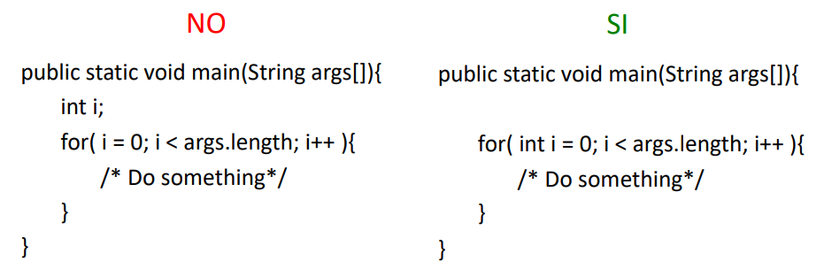

- **Rendere le Classi Non Serializzabili**: tramite la serializzazione un *attaccante* può accedere allo stato interno degli oggetti *(ad esempio ai suoi campi private)*.

- **Rendere le Classi Non Deserializzabili**: Un *attaccante* potrebbe creare un oggetto ad hoc che può essere deserializzato anche se la classe non è serializzabile.

- **Creare Classi Non Clonabili**: Un *attaccante* potrebbe evitare di eseguire il costruttore della vostra classe *(che potrebbe contenere security checks)*, ad esempio creando una sottoclasse che si limita ad implementare il metodo *clone*.

  Una soluzione è implementare il metodo *clone* lanciando un'eccezione nel caso venga utilizzato.

- **Gestire gli Overflow**: ad esempio gli int overflow, alcune classi lo fanno di default.


**DOMAIN INDEPENDENT**

- **EI_EXPOSE_REP(EI)**: ritornare un riferimento di un oggetto mutabile memorizzato nei campi interni di un altro oggetto potrebbe esporre la struttura di questo secondo oggetto. Ritornare una copia nuova dell'oggetto è un approccio migliore.
- **EI_EXPOSE_REP2 (EI2)**: memorizzare un riferimento ad un oggetto esterno mutabile internamente potrebbe esporre la rappresentazione interna. Modificando l'oggetto esterno modificherebbe anche quello interno. L'ideale sarebbe creare una copia dell'oggetto prima di memorizzarlo.
- **DMI_EMPTY_DB_PASSWORD**: evitare di connettersi ad un database senza utilizzare una password.
- **DMI_CONSTANT_DB_PASSWORD**: evitare di connettersi ad un database utilizzando una password hardcoded *(scritta nel codice)*. Chiunque abbia accesso al codice o al codice compilato può estrapolare facilmente la password e connettersi al database.
- **MS_SHOULD_BE_FINAL**: se abbiamo un campo *statico* e *pubblico* ma non *final*, del codice esterno potrebbe cambiare il suo valore.

<div style="page-break-after: always;"></div>

## SICUREZZA NELLE RETI

Anche nelle reti gli obiettivi della sicurezza sono i classici **Confidenzialità**, **Integrità** e **Disponibilità** con particolare riguardo verso il *controllo degli accessi* e l'*autenticazione/non ripudio*, ma l'esposizione ad attacchi è maggiore; un computer in rete è accessibile da milioni di altri computer attraverso Internet, i messaggi scambiati attraverso la rete attraversano molti nodi intermedi non controllabili e la comunicazione è gestita via software, perciò è più semplice automatizzare gli attacchi.

Ricordiamo che la trasmissione di dati in rete avviene tra **applicazioni** *(ad esempio un'applicazione client email comunica con un'applicazione server email)*; mettere in comunicazione queste applicazioni richiede la **commutazione di pacchetti**: i dati delle applicazioni vengono scomposti in pacchetti inviati individualmente nel nodo mittente e successivamente ricostruiti nel nodo destinatario. A questi pacchetti vengono corredati ulteriori dati per identificare l'applicazione di cui fanno parte, per l'instradamento ed il linking tra macchine.

In particolare:

- A livello di **data link** viene implementato il *MAC Address* che identifica fisicamente una macchina, in genere la più vicina a cui è possibile mandare il pacchetto *(in realtà a questo livello si chiamano frames)* per essere poi ritrasmesso.
- A livello di **rete** viene implementato l'*IP Address* che identifica la macchina su cui risiede il destinatario finale del pacchetto, in modo che si possa instradarlo verso di essa.
- A livello di **trasporto** si risolvono i problemi riguardo il *sequenziamento dei pacchetti*, ovvero viene deciso come dividere il messaggio in pacchetti e soprattutto come ricomporre i pacchetti in sequenza per ricreare i messaggi *(i pacchetti possono arrivare in ordine sparso, alcuni possono addirittura non arrivare e richiedono una ritrasmissione)*.
  Il livello di trasporto però risolve anche l'indirizzamento tra applicativi; esso identifica il vero destinatario finale dei dati, ovvero l'applicazione sulla macchina. Per identificare tale applicativo viene aggiunto il **numero di porta**.

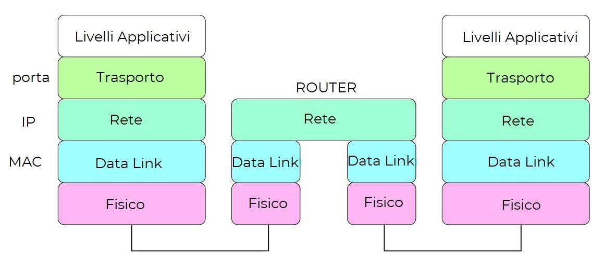

<div style="page-break-after: always;"></div>

**TIPOLOGIE DI ATTACCHI**
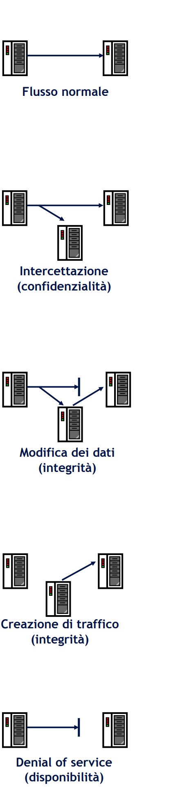Vediamo alcuni tipi di attacchi in rete:

- **Intercettazione**: sono attacchi alla *confidenzialità* nei quali il flusso comunque avviene tra mittente e destinatario, ma l'*attaccante* è in grado di intercettarlo e di leggerlo.

  Alcuni sono ad esempio lo **sniffing su LAN** in cui il mezzo trasmissivo *(cavo)* è condiviso tra i nodi collegati. Impostando la scheda di rete in *modalità promiscua* si disattiva il filtraggio dei pacchetti e si può leggere tutto il traffico.

  Ricordiamo che non necessariamente un *attaccante* ha bisogno di leggere i dati, ma anche solo sapere tra chi sono scambiati può fornire delle informazioni utili *(analisi del traffico di rete)*.

  Questi attacchi possono essere eseguiti anche con tecniche come il *rough wireless access point* nel quale una scheda di rete si impone come access point per poi leggere i dati delle macchine che vi si connettono, o anche lavorando con mezzi fisici leggendo '*per induzione elettromagnetica*' dei dati dal cavo.

- **Modifica dei Dati**: in questo caso il flusso del mittente viene bloccato e sostituito da un flusso generato dall'*attaccante*; chi intercetta i dati li ritrasmette anche, possibilmente modificati.
  Si possono inviare falsi messaggi, messaggi modificati o replicare vecchi messaggi intaccando l'*integrità* o anche reindirizzare/eliminare i pacchetti intaccando la *disponibilità*.
  Questo tipo di attacchi permette anche di falsificare l'identità di una chiave pubblica o fare il dirottamento di una sessione.

- **Creazione di Traffico**: prevede un attacco dove i dati vengono generati appositamente dall'*attaccante*.
  Qualche esempio riguarda la violazione dell'autenticazione *(confidenzialità)* per esempio indovinando la password per account ricorrenti *(admin, guest ecc)* o per account con password facili da indovinare.
  Si possono ancora, oltre a leggere le password trasmesse in chiaro, fornire delle password che facciano fallire il meccanismo di autenticazione che presenta *vulnerabilità*.

  Si possono anche creare attacchi di *spoofing* nei quali viene falsificata l'identità di un nodo tramite *pharming*, dove un nodo che impersona un altro nodo, *phishing*, che è spesso passo preliminare di un attacco di pharming *(e che consiste nell'invogliare la vittima ad accedere al servizio camuffato tramite email)* e *IP Spoofing* che consiste nella creazione di traffico con un IP falso ad esempio perché magari certi IP potrebbero non aver bisogno di autenticazione in una certa rete.
  Il pharming generalmente viene eseguito emulando lo scenario applicativo originale e sfruttando confusione fra URL con nomi simili e/o alterando le table DNS in modo da reinderizzare il traffico verso un server malevolo.

- **Denial Of Service**: prevede il blocco del flusso tra intermediari, in modo da minare la *disponibilità*. Un esempio è *synflood*.

**DOS: SYN FLOOD**
In TCP quando si instaura una connessione, il client manda al server un messaggio di **syn** per sincronizzare i numeri di pacchetti indicando il numero del pacchetto corrente; il server risponde con un **ack** e col numero di pacchetto che si aspetta dal client e con il suo numero di pacchetti e si aspetta un **ack** dal client.
Se l'ack si perde, andrebbe rifatto tutto da capo, ma per ottimizzare il tutto TCP permette di memorizzare in un buffer le connessioni per ritrasmettere subito in caso di mancanza di ack.
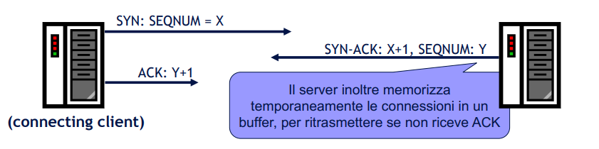

Questo permette di mandare una serie di messaggi di syn andando a riempire il buffer del server fino a renderlo non disponibili ad altri utenti.

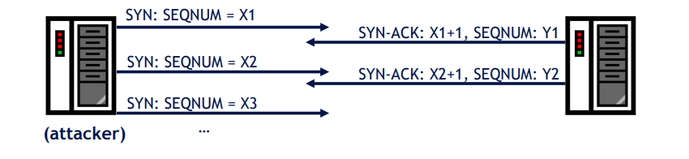


Altri attacchi di tipo DOS sono ad esempio

- Attacchi fisici a computer e apparati di rete *(solitamente prevedibili e difficili da attuare)*.
- Flooding come syn flooding o attraverso protocolli ICMP come ***ping.***
- Smurf Flooding: l'*attaccante* manda tante richieste ***ping*** a tanti host diversi inserendo però come indirizzo di provenienza quello della vittima *(IP spoofing)*, in modo che questa riceva tante risposte ai vari ping.
- DDoS: si utilizzano dei terminali '*zombie*' per attuare il flooding.
- Attacchi DNS: reindirizzamento del traffico attraverso modifiche alle table DNS.


**PRIMA DELL'ATTACCO**
Generalmente prima di un *attacco*, un *attaccante* deve studiare il sistema target, vedere quali porte sono aperte nel firewall, studiare le debolezze del software in uso *(debolezze note)* e soprattutto applicare il ***social engineering***: molto spesso i problemi più importanti di sicurezza hanno come causa le persone che usano il sistema piuttosto che la tecnologia stessa.
Ad esempio si potrebbe ottenere l'accesso ad un edificio non autorizzato con la scusa di aver perso il badge, ottenere informazioni riservate per telefono o indovinare la password di una persona perché semplice o perché usata su siti insicuri e usa sempre la stessa.

<div style="page-break-after: always;"></div>

## DIFESE CONTRO ATTACCHI DALLA RETE

Molti attacchi possono essere mitigati tramite un attento management del sistema e degli utenti, ovvero applicando tempestivamente le security patches, riconfigurando la rete, ricerca di *vulnerabilità* ecc.


**FIREWALL**
Il *muro taglia fuoco* è un particolare tipo di muro utilizzato in edilizia resistente al fuoco per contrastare la diffusione di incendi negli edifici. Nell'informatica il ***firewall*** è un hardware e/o software utilizzato per controllare il traffico in ingresso/uscita di una **rete fidata** rispetto a **reti non sicure**.

Esistono due tipi di firewall:

- **PACKET FILTER**: agisce a livello di rete e monitora dunque gli **header IP** e **TCP** dei pacchetti *(guarda principalmente gli indirizzi di rete e le porte applicative)*.

  Esegue dunque la selezione basandosi sull'indirizzo IP di provenienza e dalla porta usata.
  Alcuni esempi sono il blocco del traffico verso porte *(servizi)* o provenienti da host pericolosi o comunque non provenienti da host fidati, il blocco di pacchetti malformati *(protezione da DoS)* e il blocco dei pacchetti esterni con IP interni alla rete fidata *(protezione contro IP Spoofing)*.

  Le regole dei packet filter possono essere sia white-list che black-list.

- **APPLICATION GATEWAY**: agisce a livello di applicativo e monitora i dati applicativi stessi *(che corrispondo ad un **flusso** di pacchetti)*.

  In questo modo, per comunicare con un'applicazione interna alla rete, bisogna connettersi prima al firewall *(che quindi fa da proxy)*. Il firewall a sua volta si connette all'applicazione e replica i messaggi fra le due applicazioni.

  Si possono configurare firewall diversi per diversi protocolli applicativi, ad esempio si può usare un proxy FTP per accettare trasferimenti in entrata e bloccare quelli in uscita e un proxy MAIL per fare un filtraggio anti-SPAM. 


**SOLUZIONE MISTA 1: SCREENED SUBNET**
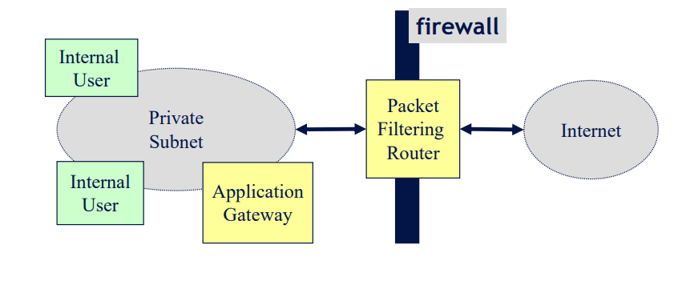In questa soluzione il router accetta solo pacchetti **da e per il gateway** sulle porte ammesse, mentre il gateway controlla il traffico applicativo per i servizi.


**SOLUZIONE MISTA 2: DMZ**
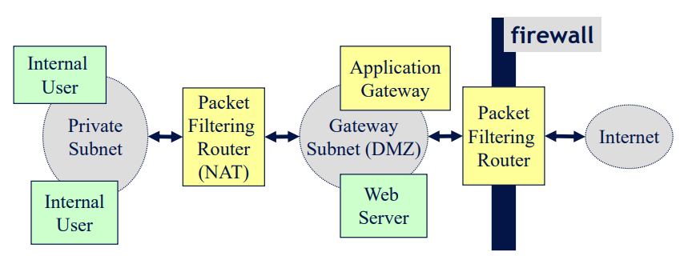In questa soluzione viene creata una *zona demilitarizzata* dove ci sono i servizi pubblicamente accessibili; la rete interna è invece protetta secondo un altro firewall di tipo NAT che assegna ai nodi interni degli indirizzi visibili solo internamente e non accessibili quindi dall'esterno.


**PROTOCOLLI DI RETE CON CRITTOGRAFIA**
Vedremo principalmente due protocolli di crittografia usati in rete: SSL *(che nella versione nuova si chiama TLS)* e IPSec, vedendo cosa protegge ognuno di essi e come operano.


**SSL**
Secure Socket Layer è un protocollo di sicurezza che implementa un livello intermedio tra lo **strato di trasporto** e quello **applicativo** in modo da aggiungere privacy ed integrità ai pacchetti in transito su una connessione TCP/IP.

SSL modifica il pacchetto applicativo aggiungendo delle informazioni per permettere alla macchina di destinazione di riconoscere l'informazione; aggiunge quindi un **header SSL** al pacchetto.
SSL si basa su due parti: **SSL Handshake** che permette di stabilire la connessione e negoziare il livello di sicurezza *(ad esempio stabilendo gli algoritmi crittografici da usare)* ed **SSL Record Protocol** che implementa lo scambio vero e proprio di pacchetti crittati.

**Handshake**
Il protocollo di handshake viene usato per stabilire la connessione sicura fra SSL client ed SSL server e precede quindi lo scambio di dati vero e proprio.
Consiste nella negoziazione di protocolli utilizzati, nell'autenticazione di client e server e nella condivisione di una chiave di sessione *(scambiata attraverso crittografia a chiave pubblica)*.

1. Hello Phase: Durante questa fase vengono decise le versioni dei protocolli utilizzati, la cypher suite *(i setting degli algoritmi crittografici)* e parametri di inizializzazione TCP *(vengono sincronizzati i numeri di sequenza dei pacchetti)*.
2. Server Authentication: il server invia quindi al client il suo certificato, la sua chiave pubblica ed eventualmente richiede l'autenticazione del client.
3. Client Authentication: il client invia eventualmente il suo certificato e invia una **session key** crittata con la chiave pubblica del server *(e con quella privata del client se la sua autenticazione è richiesta)*. Se il certificato del server è valido inoltre invia un messaggio di certificato validato.
4. Finish: si confermano quindi le impostazioni di sicurezza settate e si termina l'handshake: ora si è pronti a trasmettere.

Alcuni protocolli che implementano SSL sono ad esempio HTTPS che agisce sulla porta 443 *(invece di 80 come HTTP)*. Per poterlo utilizzare, sia il browser che i server web che eventuali proxy server devono implementare SSL.

SSL permette anche di negoziare algoritmi di compressione in fase di handshaking e di riprendere delle sessioni aperte in precedenza.

Tuttavia, SSL protegge la comunicazione fra applicazioni aggiungendo sicurezza sopra lo strato di trasporto, le informazioni sotto di esso sono ancora in chiaro il che permette di effettuare IP Spoofing o di analizzare il traffico di rete.

<div style="page-break-after: always;"></div>

**IPSEC**
Per implementare privacy ed integrità a livello IP si utilizza IPSec che è trasparente alle applicazioni e agli utenti, agisce in modalità host-to-host e funziona anche con protocolli di trasporto connection-less.

IPSec può funzionare in due modalità:

- **Modalità di trasporto**: offre una protezione simile ad SSL ma protegge anche le infromazioni TCP, è host-to-host e funziona in maniera trasparente alle applicazioni *(non sono le applicazioni a dover effettuare la codifica, ma lo fa in automatico il software di rete, le applicazioni funzionano come se non ci fosse alcuna codifica)*. Mantiene l'header IP originale del pacchetto e protegge tutto ciò che è sopra di esso.
  Uno svantaggio di IPSec è che esseno host-to-host, i dati vengono decrittati sulla macchina di destinazione **prima** di arrivare all'applicativo di destinazione.

  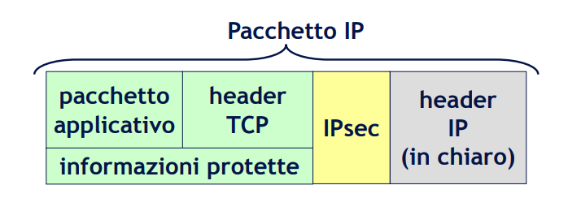

- **Modalità tunnel**: IPSec incapsula i pacchetti per l'instradamento fra due host *(tunnel endpoints, solitamente due router)* e protegge le informazioni di rete originali; l'header IP originale viene quindi crittato e viene creato un nuovo header IP che protegga il traffico di dati.
  In questo modo non si può sapere quale nodo di una sottorete è veramente il mittente e quale il destinatario, non si può sapere con quale applicativo si sta comunicando
  C'è quindi una riduzione di sicurezza nelle sottoreti *(all'interno della sottorete i pacchetti sono in chiaro)*, ma c'è una sicurezza molto forte tra le due sottoreti. Tutto ciò che si può sapere è che c'è un flusso da una sottorete all'altra, ma non si può sapere effettivamente chi comunica con chi.

  Questa modalità viene utilizzata per **Virtual Private Network (VPN)** che sono delle reti private attraverso connessioni insicure che permettono di cifrare tutto il traffico e vengono usate ad esempio per lavoro remoto e/o collegamento sicuro alla rete aziendale.

  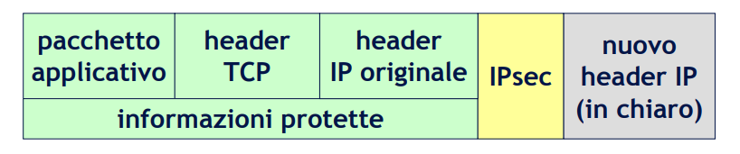


Può aver senso utilizzare IPSec assieme a SSL per proteggere i dati sia contro traffic analysis che IP Spoofing e per avere una crittografia end-to-end tra applicazioni, in modo da ovviare agli svantaggi di entrambi i protocolli.
