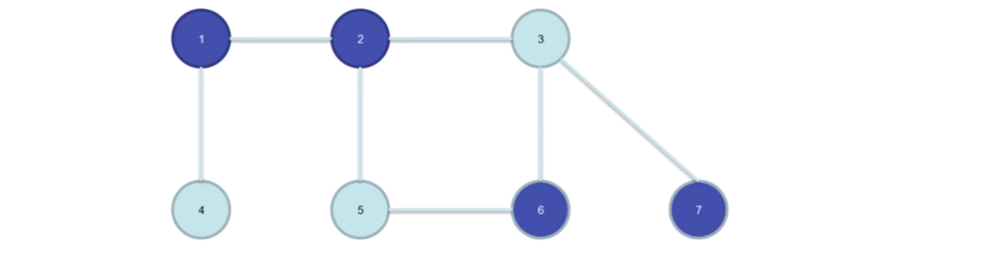
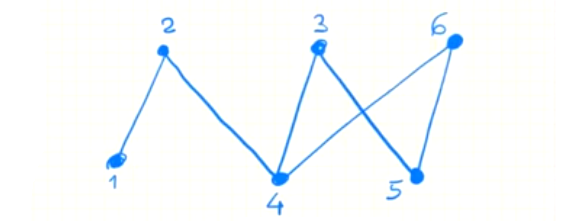
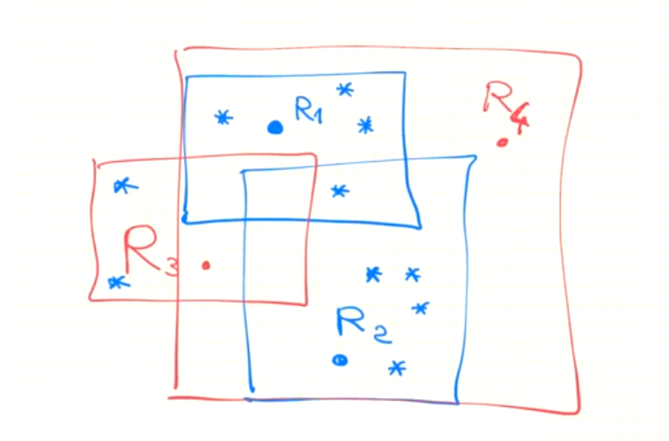
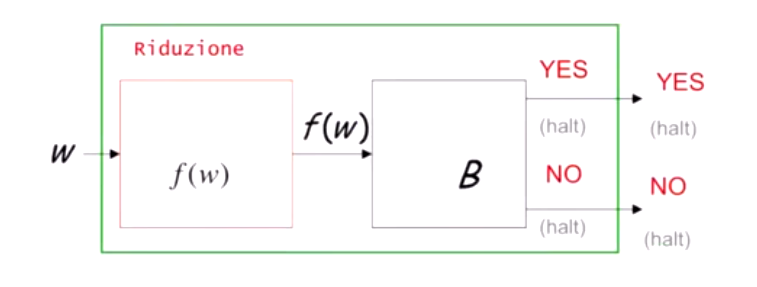
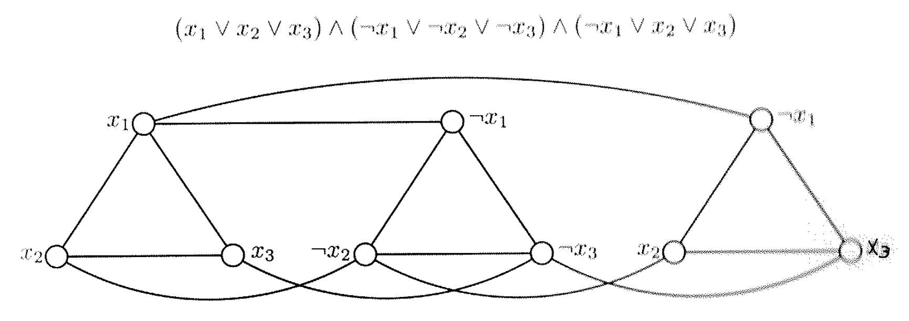
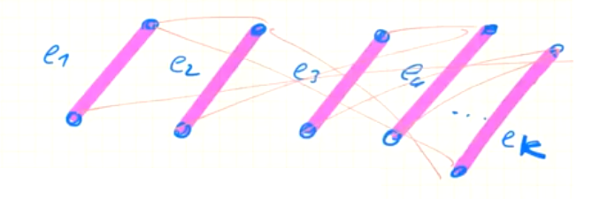

## CLASSI P E NP SU ALGORITMI

La complessità computazionale si occupa di classificare i problemi sulla base della loro ***difficoltà* di soluzione** mediante macchine di calcolo, stimata rispetto all'uso di **risorse di calcolo** quali *spazio* e *tempo*.


### PROBLEMI DI DECISIONE

I problemi classificati sono i problemi di **decisione** descritti da funzioni binarie che hanno in input una stringa su alfabeto $\{0,1\}$ e restituiscono un bit $0/1$. Ovvero la funzione associata a tali problemi è del tipo $f_\pi : \{0,1\}^* \to \{0,1\}$.

Un generico problema di decisione $\pi$ è definito come segue:

**INPUT**: $x \in \{0,1\}$
**OUTPUT**: $1/0$	$Yes/No$

La risposta è relativa all'esistenza di una certa soluzione.

Ai problemi di decisione possiamo associare dei linguaggi

- **LINGUAGGIO DI DECISIONE**
  $L_\pi = \{x\in \{0,1\}^* : risposta\ di\ \pi\ su\ x\ è\ 1\}$
  Ovvero tutti gli input a cui il problema risponde positivamente
- **LINGUAGGIO COMPLEMENTO**
  $L_\pi^c = \{x \in \{0,1\}^* : risposta\ di\ \pi\ su\ x\ è\ 0\}$
  Ovvero tutti gli input a cui il problema risponde negativamente

Ovviamente $L_\pi^c = \Sigma^* - L_\pi$


#### PROBLEMI DI OTTIMIZZAZIONE

Ovviamente non tutti i problemi sono di decisione, esistono anche problemi di ottimizzazione definiti come:

**INPUT**: $x \in \{0,1\}^*$
**OUTPUT**: $y$ tale che $|y|$ *(misura che dipende da $y$)* è *massima* o *minima*

Tuttavia, da un generico problema di ottimizzazione possiamo ottenere la sua **versione di decisione** aggiungendo un ***parametro*** $k$ e chiedendoci se $\exists y\ \ t.c.\ |y| = k$

<div style="page-break-after: always;"></div>

### DEFINIZIONI P ED NP

Definiamo ora le classi $P$ ed $NP$ per i problemi di decisione come segue

-  $P$ : È la classe dei linguaggi accettati da un algoritmo polinomiale in tempo
  Ovvero sono problemi per i quali è possibile definire una risposta $1/0$ in tempo polinomiale

  Sia $L_\pi$ un linguaggio di decisione e $T: \N \to \N$ una funzione calcolabile
  Allora un algoritmo $A$ accetta $L_\pi$ in tempo $T(n)$ se $\forall x \in L_\pi$ con $|x| = n$, $A$ termina su input $x$ dopo $T(|x|)$ passi di calcolo producendo $1$ in output.

  Dunque la classe $P$ è la classe dei linguaggi di decisione accettati in tempo $T(n) = cn^p$ *($p$ intero)* da un algoritmo $A$, ovvero in tempo polinomiale.

  Analogamente possiamo dire che $P$ è la classe dei linguaggi accettati in tempo polinomiale da una macchina di Turing deterministica $DTM$, ovvero tali per cui la macchina accetta $x$ in $T(|x|) = cn^p$ mosse.

- $NP$ : È la classe dei linguaggi accettati da un algoritmo polinomiale con ***CERTIFICATO*** in tempo
  Ovvero sono problemi per cui è possibile verificare una soluzione *(il certificato)* in tempo polinomiale

  **DEFINIZIONE**: Algoritmo con certificato o *VERIFICATORE*
  Un algoritmo con certificato è un algoritmo che verifica se $x \in L_\pi$ usando $y$
  Dove $y$, il certificato, *dimostra* che $x \in L_\pi$

  Sia $L_\pi$ un linguaggio di decisione, $T: \N \to \N$ una funzione calcolabile e $y$ **una stringa di lunghezza polinomiale nell'input**
  Allora un algoritmo $A$ con certificato accetta $L_\pi$ in tempo $T(n)$ se $\forall x \in L_\pi$ con $|x| = n$, $A$ termina su input $(x,y)$ dopo $T(|x|)$ passi di calcolo producendo $1$ in output.

  Dunque la classe $NP$ è la classe dei linguaggi di decisione accettati in tempo $T(n) = cn^p$ da un algoritmo $A$ con certificato.

  Analogamente possiamo dire che $NP$ è la classe dei linguaggi accettati in tempo polinomiale da una macchina di Turing non deterministica $NDTM$ 

Non è ancora chiaro se le due classi coincidano, tuttavia al momento esistono dei problemi che stanno in $NP$ ma non in $P$ *(per ora)*.

Tuttavia, per come le abbiamo definite, è chiaro che $P$ è una sottoclasse di $NP$, cioè $P \sube NP$ poiché per ogni problema $\pi \in P$ esiste un algoritmo polinomiale in tempo con ***certificato vuoto*** che accetta $\pi$.

<div style="page-break-after: always;"></div>

### VERTEX-COVER

Il problema Vertex-Cover riceve in input un grafo $G = (V,E)$ non orientato e calcola un sottoinsieme di vertici $V' \sube V$ che rappresenta una ***minima copertura*** del grafo, ovvero la copertura di dimensione minima.

Una ***copertura*** $V' \sube V$ di un grafo è un sottoinsieme di vertici tale per cui ogni arco $e \in E$ ha almeno un estremo in $V'$
Ovvero $\forall e = (u,v) \in E$,	$u \in V' \lor v \in V'$

Il problema è quindi definito come

**INPUT**: $G =(V,E)$ non orientato
**OUTPUT**: $V' \sube V$ t.c. $V'$ è una minima copertura per $G$


La versione di decisione chiede se $G$ ammette un vertex-cover di dimensione $k < |V|$ ed è definita come

**INPUT**: $G = (V,E)$,	$k$ intero
**OUTPUT**: $\exists V' \sube V$ t.c. $V'$ è una minima copertura di $G$ e che $|V'| = k$




Nell'esempio sopra possiamo osservare che l'insieme di vertici $V' = \{1,2,6,7\}$ rappresenta una copertura per $G$ poiché tutti gli archi del grafo toccano almeno uno di questi vertici.

Tuttavia possiamo osservare che anche $V' = \{1,2,3\}$ è una copertura per $G$ di dimensione inferiore a quella di prima.

La versione decisionale di Vertex-Cover è in $NP$, poiché è possibile verificare che un certo insieme di vertici $V' \sube V$ sia una copertura per un grafo $G=(V,E)$ in tempo polinomiale: basta scandire tutti i vertici $e = (u.v) \in E$ e controllare che almeno uno degli estremi di ciascun vertice appartenga a $V'$.

Non solo, Vertex-Cover è difficile almeno quanto ogni altro problema in $NP$, è quindi un problema $NP-Difficile$, il che significa che se risolvendo Vertex-Cover possiamo risolvere tutti gli altri problemi in $NP$.

<div style="page-break-after: always;"></div>

### INDEPENDENT SET

Dato un grafo non orientato $G = (V,E)$ è un insieme $I \sube V$ tale per cui $\forall u,v \in I : (u,v) \notin E$, ovvero è un insieme di vertici non collegati da alcun arco tra loro.

**INPUT**: $G = (V,E)$ non orientato
**OUTPUT**: $I \sube V$ tale che $I$ è un independent set e $|I|$ è max


La variante di decisione è definita come

**INPUT**: $G = (V,E)$,	$k \leq |V|$
**OUTPUT**: $\exists I \sube V$ ind. set di $G$ t.c. $|I| = k$

Il problema Independent Set decisionale è in $NP$, poiché esiste un algoritmo $A$ che ha costo polinomiale in tempo e che, dati in input un grafo $G = (V,E)$ e un *certificato* $y$ *(costituito da $k$ vertici di un insieme indipendente)*, verifica su $G$ che $y$ è un insieme indipendente controllando $\forall u,v \in y$ che $(u,v) \notin E$.

Il costo di verifica è dunque quadratico in $|y|$, che a sua volta è $O(|E| + |V|)$ per definizione di certificato.


#### INDEPENDENT SET E COPERTURA

Consideriamo il seguente grafo



Notiamo che una possibile copertura *minima* di $G$ è $V' = \{2,4,5\}$, quindi $|V'| = 3$

Possiamo osservare che se facciamo $V - V'$ otteniamo proprio un **insieme indipendente**
La dimostrazione di questo insieme indipendente sta nella definizione di **copertura**: se ci fosse un arco che collega qualche vertice di $V-V'$, quell'arco non sarebbe coperto da $V'$ e di conseguenza non sarebbe una copertura.

Non solo, se la copertura è **minima**, l'insieme indipendente ottenuto è **massimo** poiché se aggiungessimo altri vertici all'insieme indipendente, per la definizione di copertura, questi sarebbero collegati a quelli già presenti nell'insieme iniziale.

<div style="page-break-after: always;"></div>

### SATISFIABILITY

Il problema di soddisfacibilità prende in input un formula booleana $\phi$ in **forma normale congiunta** e restituisce in output un booleano che dice se la formula è soddisfacibile, ovvero se esiste un assegnamento di verità che renda vero $\phi$

Una formula è in forma normale congiunta quando è formata da una serie di $\land$ di ***clausole***.
Una ***clausola*** è una sequenza di $\lor$ di ***letterali***
Un ***letterale*** è una variabile booleana $x_i$ o $\lnot x_i$

Notiamo che una formula, per essere vera, deve avere tutte le clausole vere.
Una clausola, per essere vera, deve avere almeno un letterale vero.

**INPUT**: $\phi$
**OUTPUT**: $\phi$ è soddisfacibile? *($1/0$)*

Il numero di letterali per ogni clausola definisce la complessità di calcolo del problema. Parleremo infatti di **K-SAT** dove $k$ è il numero di letterali per clausola.
La cosa interessante è che **2-SAT** $\in P$, mentre **3-SAT** $\in NP$ *(e vedremo che è anche $NP-difficile$)*.


### SET COVER

*Definizione*: dato un universo $U$ di $n$ elementi, una collezione di sottoinsiemi di $U$, $S = \{S_1,\ ...,\ S_m\}$ e una funzione di costo $c: S \to \Q^+$, trova una collezione $C$ di sottoinsiemi di $S$ di minimo costo che copra tutti gli elementi di $U$.

Se il costo è uniforme, il problema chiede una sottocollezione che copra tutti gli elementi di $U$ e che abbia minima dimensione.

Esempio:
$U = \{1,2,3,4,5\}$
$S_1 = \{1,2,3\}$	$S_2 = \{2,3\}$	$S_3 = \{4,5\}$	$S_4 = \{1,2,4\}$
$c_1 = c_2 = c_3 = c_4 = 1$
$C = \{S_1, S_3\}$

Set Cover, nella sua variante di decisione, è $NP-C$.
Sicuramente è in $NP$: data una collezione $C$ si può facilmente verificare in tempo polinomiale che $|C| \leq k$ e che l'unione degli insiemi di $C$ include tutti gli elementi di $U$. Banalmente sottraiamo da $U$ tutti gli insiemi di $C$.

Classico esempio: trovare il minor numero di ripetitori $S$ che coprono una porzione per coprire un'area $U$.



<div style="page-break-after: always;"></div>

<div style="page-break-after: always;"></div>

### CLIQUE

Consideriamo un grafo non orientato $G = (V,E)$, una clique di $G$ è un sottoinsieme $V' \sube V$ tale che $\forall u,v \in V'\ \ \ (u,v) \in E$
Il problema della clique è trovare la clique di dimensione maggiore.

È il concetto duale dell'Independent Set.

Chiaramente la versione di decisione si ha col parametro $k$ chiedendosi se esiste una clique di dimensione $k$.

Chiaramente CL è in $NP$; un algoritmo con certificato verifica, per ogni $u,v \in V'$ con $V'$ certificato che esista l'arco $(u,v) \in E$. Il costo è $O(|V'|^2 |E|)$

## RIDUZIONI POLINOMIALI

#### NP-DIFFICILE

Un problema $NP-difficile$ è un problema difficile almeno quanto ogni altro problema in $NP$; questo significa che possiamo risolvere ogni altro problema in $NP$ con una *chiamata di procedura* ad un problema $NP-difficile$. Ad esempio Vertex-Cover è $NP-difficile$.

Per fare ciò, dobbiamo trasformare l'input $w$ del problema $NP$ in un input $f(w)$ per un problema$NP-difficle$ **in tempo polinomiale**. La risposta che darà il problema $NP-diffcile$ su $f(w)$ è la stessa che darebbe il problema $NP$ su $w$.

**N.B.**: un problema $NP-difficile$ ***NON È DETTO*** che stia in $NP$. Un problema $NP-difficile$ che sta anche in $NP$ viene chiamato $NP-completo$.


### RIDUZIONE

Possiamo vedere come deve essere fatta la trasformazione dell'output per far si che quanto detto sopra funzioni.



In particolare, ci interessano le **trasformazioni polinomiali da A a B**.
***Definizione***: $A$ si **riduce polinomialmente** a $B$, e si scrive $A \leq_p B$, se esiste una unzione $f$ calcolabile in tempo polinomiale rispetto a $|w|$ tale per cui $w \in L_A \iff f(w) \in L_B$

$f$ deve essere polinomiale poiché non dobbiamo introdurre un livello di complessità superiore al contesto di confronto. Se $f$ fosse troppo complessa non potrei più comparare $A$ e $B$.

Possiamo quindi dire che un problema $B$ è $NP-difficile$ se e solo se $\forall A \in NP$ $A \leq_p B$

<div style="page-break-after: always;"></div>

### 3-SAT $\leq_p$ IND_SET

**3-SAT** è stato uno dei primi problemi che si è scoperto appartenere a $NP-C$. Se dimostriamo che esso si riduce a **IND_SET**, vuol dire che anche IND_SET è $NP-C$, poiché tutti i problemi $NP$ si riducono a 3-SAT per definizione di $NP-C$ e quindi se riduciamo 3-SAT a IND_SET, tutti i problemi $NP$ si riducono anche a IND_SET.

Dimostreremo che $\phi$ è soddisfacibile sse $G_\phi$ ha un IND_SET di dimensione $k = |\phi|$, dove $|\phi|$ è il numero di clausole della formula.

Per fare ciò dobbiamo, data un'istanza $\phi$ di 3-SAT, costruire un'istanza $(G_\phi, k)$ per IND_SET.
Per farlo costruiremo il grafo $G_\phi$ in modo che

- $G_\phi$ contenga 3 vertici per ogni clausola, uno per ogni letterale
- I 3 vertici dei letterali sono collegati con un triangolo *(con una clicca di dimensione 3)*
- Ogni letterale è collegato al suo negato
- $k = |\phi|$

Le strutture che rappresentano le clausole *(i triangoli in questo caso)* sono chiamati anche ***gadget***



Notiamo che una clausola con $m$ clausole e $n$ variabili produrrà un grafo con $3m$ vertici e con un numero di archi dipendente da $n$.

I vertici dei vari letterali sono collegati fra loro in ogni gadget poiché per soddisfare $\phi$ dobbiamo rendere vero *almeno* un letterale per ogni clausola; visto che cerchiamo un ind_set, in ogni gadget potremmo prendere un solo vertice. Se la formula è soddisfacibile inoltre, l'ind_set avrà dimensione $|\phi$| poiché potrà prendere un vertice per ogni gadget, ovvero rendere un letterale vero per ogni clausola.

Inoltre, se abbiamo un ind_set di dimensione $|\phi|$, allora sicuramente corrisponde ad un assegnamento che rende vera $\phi$, poiché avremmo un vertice per ogni gadget e siamo sicuri di non avere incongruenze coi valori di verità poiché ogni vertice corrispondente ad un letterale $x_i$ è collegato direttamente ai vertici corrispondenti a $\lnot x_i$, per cui in un ind_set non possiamo avere sia vertici $x_i$ che $\lnot x_i$.

<div style="page-break-after: always;"></div>

#### DIMOSTRAZIONE

1. Il primo step consiste nel definire $f$ che trasforma l'input di 3-SAT $\phi$ nell'input di IND_SET $(G_\phi,k)$ in tempo polinomiale

   Nel nostro caso abbiamo visto che per trasformare l'input costruiamo un gadget per ogni clausola con $3$ vertici ciascuno e poi uniamo i vertici dei letterali $x_i$ ai vertici dei letterali $x_i$

   Questa è un'operazione polinomiale in $|\phi|$ poiché esegue un numero finito di operazioni per ogni clausola.

2. $\Longleftarrow$
   Nel secondo step dobbiamo dimostrare che $f(w) \in L_B \Longrightarrow w \in L_A$

   Sia $S$ un insieme indipendente di dimensione $k$
   Poiché abbiamo $k$ gadget e ogni vertice di ciascun gadget è collegato con gli altri, $S$ conterrà sicuramente un solo vertice per gadget *(altrimenti non avrebbe dimensione $k$)*.

   Poiché ogni vertice, corrispondente al letterale $x_i$, è collegato direttamente ai rispettivi vertici corrispondenti ai letterali $\lnot x_i$, $S$ non può contenere vertici che corrispondano a contraddizioni fra letterali *(appunto perché sono collegati direttamente)*.

   Ponendo i letterali corrispondenti ai vertici di $S$ come veri *(e ricavando quindi i valori delle variabil associate a tali letterali)* otterremo quindi un assegnamento che soddisfa $\phi$, poiché avendo un vertice per ogni gadget abbiamo un letterale vero per ogni clausola e quindi rendiamo tutte e $k$ le clausole vere.

3. $\Longrightarrow$
   Nel terzo step dobbiamo dimostrare che $w \in L_A \implies f(w) \in L_B$

   Sia dato un assegnamento di verità che soddisfa $\phi$
   Questo significa che in ogni clausola di $\phi$ c'è almeno un letterale il cui valore è vero.
   Per costruire ind_set prenderemo un letterale vero per ogni clausola, ottenendo cosi $k$ letterali corrispondenti a $k$ vertici, uno per ogni gadget del grafo $G_\phi$.

   Per costruzione di $G_\phi$ questi $k$ vertici sono indipendenti fra loro poiché appartengono a gadget diversi *(perché i letterali a cui fanno riferimento appartengono a clausole diverse)* e perché non può esserci un collegamento diretto tra questi $k$ vertici visto che ciò significherebbe che l'assegnamento utilizza un letterale $x_i$ segnato come vero insieme al letterale complementare $\lnot x_i$ segnato come vero, ma questo genererebbe una contraddizione in quanto la formula in questo caso non sarebbe soddisfacibile.

<div style="page-break-after: always;"></div>

### VERTEX COVER $\leq_p$ SET COVER

1. Dobbiamo prima di tutto trasformare un'instanza $C$ DI VC *(un grafo $G = (V,E)$ e un intero $j$)* in un'istanza $C'$ per SC in tempo polinomiale t.c. $C$ è soddisfacibile sse $C'$ lo è.

   Per far ciò poniamo $U = E$, ovvero il nostro universo per SC saranno gli archi del grafo.

   Consideriamo poi tutti i vertici $v_1,\ ...,\ v_n \in V$ e poniamo $S_i = \{(u,v_i)\in E\ \ \forall u \in V\}$
   Ovvero $S_i$ sarà l'insieme di tutti gli archi incidenti al vertice $v_i$, ovvero tutti gli archi che quel vertice copre.

   Poniamo infine $j = k$ e notiamo che la costruzione è polinomiale nell'istanza.

2. $\Longrightarrow$
   Sia dato $C$ un Vertex Cover per $G = (V,E)$ t.c. $|C| = j$

   Abbiamo che i vertici $v \in C$ toccano tutti gli archi in $E$.
   Per costruzione sappiamo che $U = E$ e che $S_i$ sono gli archi coperti dal vertice $v_i$.

   Per definizione di Vertex Cover i vertici in $C$ coprono tutti gli archi e quindi i rispettivi insiemi $S_i$ associati ai vertici di $C$ coprono tutto l'universo $U$ costituito dagli archi del grafo.

   Sapendo inoltre che $|C| = j$ possiamo dire che $|S| = j = k$

3. $\Longleftarrow$
   Sia $C'$ un Set Cover di dimensione $k$
   Per costruzione ciascun insieme di $C'$ corrisponde ad un vertice in $G$; chiamiamo $C$ l'insieme di tutti i vertici di $C'$
   Ovviamente $|C| = |C'| = k = j$

   Essendo $C'$ un Set Cover, significa che contiene al suo interno tutti gli elementi dell'universo $U$
   Ma gli elementi dell'universo sono gli archi $E$ di $G$
   I vertici associati a $C'$ sono, per costruzione, vertici che toccano alcuni lati del grafo, ma se $C'$ contiene tutti gli archi di $U$, i vertici associati a $C'$ toccano tutti gli archi $E$ di $G$.

   Considerando un generico arco $e$ sappiamo che esso è in $U$ e, visto che $C'$ è un Set Cover, c'è almeno un insieme che contiene $e$. Quell'insieme corrisponde, per costruzione, al vertice che tocca $e$ nel grafo e quindi $C$ deve contenere almeno un estremo di $e$.

   Questo vale per tutti gli archi in $U$ e quindi $C$ è un Vertex Cover di cardinalità $k$

<div style="page-break-after: always;"></div>

### 3-SAT $\leq_p$ CLIQUE

1. Per trasformare l'input $\phi = c_1\land\ ...\land\ c_k$ di 3-SAT in un input per CLIQUE creeremo dei gadget per ogni clausola $c_i = (l_1^i \lor l_2^i \lor l_3^i)$
   I gadget saranno formati da 3 vertici isolati $l_j^i$, uno per ogni letterale della clausola $c_i$

   Quindi il nostro grafo $G_\phi = (V,E)$ avrà $V = \bigcup\limits_{1 \leq i \leq k} \{v_1^i, v_2^i, v_3^i\}$

   Collegheremo poi i vertici di ogni gadget relativi ad ogni letterale $l_j^i = x_h$ a tutti gli altri letterali **degli altri gadget** tranne che ai letterali descritti da $\lnot x_i$

   Formalmente $E = \{(v_i^s, v_i^r)\ |\ l_i^s\ è\ consistente\ con\ l_j^r \land s \neq r\}$

   Il fatto che i vertici di uno stesso gadget non siano collegati tra loro ci garantisce che una clique potrà avere al massimo dimensione $k = |\phi|$.

   Inoltre, poiché non colleghiamo vertici corrispondenti ad assegnamenti inconsistenti, i vertici della clique trovata, se sono $k$ *(ovvero uno per ogni gadget e quindi uno per ogni clausola)* rendono vera $\phi$

   Notiamo che la trasformazione è polinomiale nell'input, in quanto esegue per ogni clausola $c_i$ la creazione del gadget.

2. $\Longrightarrow$
   Sia data $\phi$ una formula soddisfacibile con $k$ clausole

   Sappiamo che, per definizione di formula soddisfacibile, $\phi$ ha *almeno* un letterale $l_i^s$ vero per ogni clausola $c_i$
   Per costruzione, ogni clausola corrisponde a 3 vertici indipendenti del grafo $G_\phi$ e questi vertici sono collegati ai vertici delle altre clausole tranne quelli contraddittori; questo significa che se prendiamo come vertici di una clique $C$ di $G_\phi$ i vertici associati ai letterali veri della formula $\phi$ *(e ne prendiamo uno per clausola)* questi saranno sicuramente tutti collegati fra loro poiché se così non fosse significherebbe che uno di essi è contraddittorio con gli altri, ma questo va contro l'assunzione che $\phi$ sia soddisfacibile.

   Visto che prendiamo un vertice per ogni clausola, la clique $C$ avrà proprio dimensione $k = |\phi|$

3. $\Longleftarrow$
   Sia data una Clique $C$ di dimensione $k$

   Sappiamo, per costruzione di $G_\phi$, che i $k$ vertici della Clique appartengono sicuramente a gadget diversi e quindi a clausole diverse *(poiché il gadget è formato da 3 vertici indipendenti)*.
   Chiamiamo questi vertici $v_i^s$

   Sappiamo inoltre che i vertici sono collegati fra loro in modo da non generare contraddizioni, ovvero il vertice associato al letterale $l_i^s = x_l$ non è sicuramente collegato al letterale $l_j^r = \lnot x_l$.

   A questo punto possiamo impostare come veri i letterali $l_i^s$ corrispondenti ai vertici $v_i^s \in C$
   Poiché $|C| = k$ e i vertici appartengono a gadget diversi, ovvero a clausole diverse, stiamo praticamente rendendo vero un letterale per ogni clausola $c_i$ e, così facendo, rendendo vere tutte le clausole e di conseguenza $\phi$

<div style="page-break-after: always;"></div>

## ALGORITMI DI APPROSSIMAZIONE

I problemi $NP$ si riscontrano molto spesso nel modo reale e quindi necessitano di una soluzione *'efficiente'*. Una prima soluzione sono gli algoritmi di approssimazione che sono polinomiali con *GARANZIA*, sono cioè delle euristiche per il problema e che quindi non forniscono delle soluzioni esatte.

Dato un problema di ottimo $\pi$ e un'istanza $x$, diremo che l'***ottimo*** di $x$ su $\pi$, indicato come $opt(x)$, è il costo della soluzione ottima di $\pi$. Ovvero l'algoritmo ci fornirà, tra tutte le soluzioni ammissibili, quella che massimizza o minimizza un costo.
Il costo di una soluzione ammissibile su $x$ calcolato da un algoritmo $A$ è indicato come $A(x)$


### ALGORITMI $\epsilon$-APPROSSIMATI

Un algoritmo $\epsilon$-approssimato per un problema $\pi$ di ottimizzazione è un algoritmo $A$ **polinomiale** tale che restituisce una soluzione ammissibile che *dista* da quella ottima di un **fattore costante** $\bold \epsilon$.

Dunque, se $\pi$ è un problema di minimo allora
$A(x) \leq \epsilon\times opt(x)$			con $\epsilon > 1$
Ovvero la soluzione $A(x)$ sarà al più $\epsilon \times opt(x)$ e non sarà mai il valore minimo in assoluto $opt(x)$
Dunque $A(x)/opt(x) \leq \epsilon$

Se $\pi$ è un problema di massimo allora
$A(x) \geq \epsilon \times opt(x)$			con $0 < \epsilon < 1$
Ovvero la soluzione $A(x)$ sarà almeno $\epsilon \times opt(x)$ e non sarà mai il valore massimo $opt(x)$
Dunque $A(x)/opt(x) \geq \epsilon$

Generalmente le prestazioni di un algoritmo di approssimazione viene misurata attraverso un **approximation ration** $r$ come segue $\max \{\frac{A(x)}{opt(x)},\ \frac{opt(x)}{A(x)}\} \leq r$


**OSSERVAZIONE**: Non tutti i problemi $NP-C$ ammettono una r-approssimazione per $r$ costante!

Alcuni problemi hanno un'approssimazione che dipende dalla dimensione dell'input, ovvero
$\max \{\frac{A(x)}{opt(x)},\ \frac{opt(x)}{A(x)}\} \leq \rho(n)$	con $|x| = n$

Questo significa che, per questi problemi, la dimensione dell'input influisce sulla capacità di approssimarli.

<div style="page-break-after: always;"></div>

#### 2-APPROX PER VERTEX COVER

La prima cosa da fare per determinare un algoritmo di approssimazione è trovare un'euristica polinomiale che permetta di calcolare una soluzione **ammissibile**.

Una possibile euristica per VC è la seguente

- Prendo un arco $(u,v)$ del grafo e aggiunto i sui vertici estremi alla soluzione $C = C \cup \{u,v\}$
- Rimuovo da $E$ tutti gli archi che hanno un estremo in $u$ o in $v$

Infine itero la regola finché $E \neq \empty$

Questo algoritmo è una 2-approssimazione per Vertex Cover, poiché l'algoritmo sceglie sempre degli archi che non hanno estremi in comune con quelli già scelti *(perché per ogni arco scelto aggiunge entrambi i vertici alla soluzione)*.

Supponiamo che l'algoritmo scelga $k$ lati; per costruzione dell'algoritmo questo significa che il grafo ha $2k$ vertici e quindi la soluzione dell'algoritmo ha costo $A(x) = 2k$.

Il grafo potrebbe avere degli archi in più che collegano i lati scelti dall'algoritmo approssimante tra loro, ma gli archi scelti sicuramente non hanno estremi in comune.



$opt(x)$ nel caso migliore prende esattamente un estremo per ogni arco scelto da $A(x)$
Notiamo che almeno un estremo deve prenderlo per forza per costruire una soluzione ammissibile.
Dunque nel caso migliore $opt(x) = k$.

Questo implica che nel caso generico abbiamo $opt(x) \geq k$, ovvero $2 \times opt(x) \geq A(x)$

<div style="page-break-after: always;"></div>

## ALGORITMI FISSATO IL PARAMETRO

Un problema $NP-C$ può avere delle istanze che sono risolvibili in tempo polinomiale, in particolare queste istanze sono risolvibili in tempi ragionevoli se i fissano dei parametri che caratterizzano l'istanza.

Ad esempio cerchiamo un Vertex Cover che abbia al più una dimensione $k$.

Se il **parametro** è **piccolo** anche un tempo esponenziale in $k$ è accettabile, ad esempio $2^k$ con $k = 5$ è accettabile.

Un problema che ammette queste operazioni è detto **trattabile fissato il parametro *(FPT)*** e ha un algoritmo $A$, una costante $c$ e una funzione calcolabile $f$ tale che per tutti gli input $<x,k>$ $A$ risolve il problema con tempo $f(k)|x|^c$
Notare che la parte relativa all'input è polinomiale. Questo significa che $f(k)$ non può essere polinomiale, ma è esponenziale in $k$.


### VERTEX COVER FPT

Per costruire un algoritmo FPT si usano i **Bounded Search Trees**

Il problema Vertex-Cover $(G = (V,E),k)$ è risolvibile in tempo $O(2^k\ |V|)$

**IDEA**

1. Quando prendiamo un arco generico $(u,v)$ uno dei due estremi deve essere per forza nella copertura del grafo
2. Proviamo entrambi i lati ricorsivamente

```java
BoundedSearch(G,k) {
	if G.E.isEmpty()
		return true
	if k = 0
		return false
	arco = (u,v)
	if BoundedSearch(G-u, k-1)
		return true
	if BoundedSearch(G-v, k-1)
		return true
	return false
}
```

Dove con $G-u$ intendiamo $V-u$ e $E - archi\ incidenti\ a\ u$

Visto che facciamo due chiamate ricorsive che a loro volta ne faranno delle altre possiamo rappresentare lo svolgimento con un bounded search tree. Nel caso peggiore l'algoritmo farà $k$ chiamate ricorsive, creando un albero binario completo di altezza $k$ e quindi il tempo sarà di $2^k$.

Al generico passo ricorsivo se il nodo è etichettato dall'insieme $\{x\}$ di vertici significa che stiamo considerando il grafo $G-x$ e $k' = k - |\{x\}|$ e scegliamo un arco $(z,w)$, creeremo due nuovi nodi, uno etichettato da $\{x\} \cup z, k' -1$ e l'altro etichettato da $\{x\} \cup w, k'-1$.

Notiamo che l'etichetta del nodo rappresenta la possibile copertura e permette cosi anche di ricostruire la copertura.

Il tutto si ripete finché $E = \empty$ e quindi esiste una copertura di dimensione $k$ o finché $k=0$ e quindi abbiamo esaurito $k$ e non esiste una copertura di dimensione $k$.

## TSP

Il problema del commesso viaggiatore dice che bisogna visitare una serie di nodi e tornare a quello di partenza seguendo il percorso meno costoso e senza toccare due volte lo stesso vertice *(escluso quello di partenza)*. Abbiamo quindi un grafo pesato e il costo del percorso è la somma dei collegamenti percorsi.

Un problema simile è il **cammino hamiltoniano** che richiede di trovare un percorso che tocca tutti i ***vertici*** una e una sola volta; il tsp è la sua versione pesata e richiede di trovare un ciclo hamiltoniano di peso minimo.

Un altro problema è il **cammino euleriano** che richiede di trovare un percorso che esplora tutto il grafo ma tocca tutti gli ***archi*** una e una sola volta.

La cosa interessante è che il cammino hamiltoniano è un problema $NP-C$, mentre il cammino euleriano è un problema $P$, questo perché nel caso del cammino euleriano basta controllare che i vertici abbiamo il numero di archi entranti uguale al numero di archi uscenti.


### TSP NON HA $\epsilon$-APPROSSIMAZIONE

Sappiamo che possiamo trasformare un'istanza di ciclo hamiltoniano in un'istanza di TSP renendo il grafo di partenza completo e assegnando un peso unitario ai lati che c'erano già e peso 2 ai nuovi lati.

Associamo pero ai nuovi lati un peso $\frac{|V|}{1- 1/\epsilon}$
Per definizione, un algoritmo approssimante ha tempo polinomiale.

Supponiamo di averne uno per TSP e di applicarlo, abbiamo due casi:

1. $A$ restituisce un tour di costo $|V|$
   Questo vuol dire che esiste un ciclo hamiltoniano

2. $A$ restituisce un tour con almeno un arco di costo $|V| \epsilon + 1$ e quindi $A(x)  > \epsilon |V|$
   Per definizione di $\epsilon$-approssimazione $\epsilon \times opt(x) \geq A(x)$

   Avremmo quindi che $opt(x) \geq A(x) / \epsilon > |V|$, ovvero $opt(x) \geq |V|$
   Non potendo avere un tour ottimo di costo $|V|$, non può esserci un ciclo hamiltoniano nel grafo iniziale.

Il problema sorge dal fatto che abbiamo deciso se esiste o meno un ciclo hamiltoniano in tempo polinomiale, per cui, se TSP avesse una $\epsilon$-approssimazione, questo significherebbe che ci sarebbe un algoritmo polinomiale per ciclo hamiltoniano e che quindi $P = NP$.

<div style="page-break-after: always;"></div>

### TSP-METRICO

Dato un grafo $G = (V,E)$ non orientato, completo e con costi $c$ associati agli archi, se

- $c_{uv} \geq 0$ per ogni arco $(u,v) \in E$ e $c_{uv} = 0 \iff u = v$
- $c$ è tale che per ogni tripla di nodi distinti $u,v,z$ si ha che $c_{uv} \leq c_{uz} + c_{zv}$ *(disuguaglianza triangolare)*
  In generale avremmo che il corso di un arco $c_{ij}$ sarà sempre minore rispetto al costo di un cammino che parte da $i$ e arriva a $j$.

Allora $c$ induce una metrica.


#### ALGORITMO DI CHRISTOFIDES

Per descrivere l'euristica 2-approssimata di Christofides per TSP metrico usiamo il concetto di ***ciclo euleriano***, in particolare il teorema di Eulero che dice che un grafo ammette un ciclo euleriano se e solo se è **connesso e ogni nodo ha grado pari**.

L'algoritmo di Christofides esegue le seguenti operazioni:

1. Trova il minimo albero di copertura $T$ di $G$ *(che è un'operazione facile)*

2. Raddoppia ogni arco di $T$ ottenendo così un grafo euleriano perché rende pari il grado di tutti i nodi

3. Costruisce un ciclo euleriano $\epsilon$ di questo grafo *(facile)*

   Lo fa percorrendo uno dopo l'altro i cicli dei rami dell'albero, tuttavia il ciclo euleriano così avrà dei vertici ripetuti

4. Sceglie un nodo iniziale $u$ in $\epsilon$ e visita $\epsilon$ a partire da $u$

5. Costruisce una permutazione $\pi$ dei nodi $V$ ***sequenziando i nodi*** nell'ordine della loro prima apparizione in $\epsilon$ nella visita

   Facendo così otterremmo un cammino che "salta" alcuni archi *(possiamo farlo perché il grafo di partenza è completo)*
   Ma, se il grafo iniziale soddisfa la disuguaglianza triangolare, possiamo stimare il costo di tale arco, in particolare l'arco che salta costerà al più la somma dei costi degli archi saltati.

6. Restituisce il ciclo hamiltoniano $H$ associato a $\pi$ 

Abbiamo quindi che $c(H) \leq c(\epsilon)$ per la disuguaglianza triangolare.

Ci chiediamo ora che relazione c'è tra $c(H)$ e $c(opt)$
Possiamo dire che $c(\epsilon) = 2 c(T)$ per lo sdoppiamento degli archi e perché il ciclo di eulero tocca tutti gli archi
Sappiamo inoltre che il ciclo hamiltoniano ottimo $H^*$ è formato da un albero di copertura $T'$ unito ad un vertice $e$ che lo fa diventare un ciclo, ovvero $H^* = T' \cup \{e\}$, e quindi $c(H^*) = C(T') + c(e)$

Questo vuol dire che $c(H^*) \geq c(T') \geq c(T)$ e quindi $c(T) \leq c(H^*)$

A questo punto possiamo dire che $2(T) \leq 2c(H^*) \equiv c(\epsilon) \leq 2c(H^*) \equiv c(H) \leq 2c(H^*)$

<div style="page-break-after: always;"></div>

## CLOSEST STRING

Il problema della closest string prende in input una collezione di $k$ stringhe di lughezza $l$ e un intero $d$ e restituisce in ouput una stringa $s$ tale che $d_H(s,s_j) \leq d$ per ogni stringa in input.

$d_H(s,s')$ rappresenta la Hamming distance, ovvero il numero di simboli diversi tra $s$ ed $s'$

Questo è un problema $NP-H$, tuttavia è risolvibile in tempo $O(d+1)^d|G|$ fissato $d$

Abbiamo che per $d_H(s, s_i) + d_H(s, s_j) \geq d_H(s_i, s_j)$
Per cui se $d_H (s_i, s_j) > 2d$ sicuramente non c'è una stringa che dista al più $d$ da tutte le altre, perché significherebbe che $d_H(s,s_i) > d$.

L'algoritmo fissato il parametro costruisce un albero di ricerca dove all'inizio $s=s_1$ e cerca $s_j$ che dista da $s_1$ più di $d$ posizioni *(ma al più $2d$)* e crea $d+1$ figli corrispondenti alle posizioni modificate per avvicinare $s_1$ a $s_j$.
