## MULTIMEDIALITÀ E MULTIMODALITÀ

**MEDIA**: strumento atto al trasporto di informazioni.
**MULTI-MEDIA**: insieme di più strumenti per il trasporto di informazione.

Dunque, ***multimedialità*** significa la copresenza di **diversi media** *(testo, audio, immagini, video, ecc...)* che concorrono **insieme**, solitamente in **maniera iterativa** attraverso lo stesso **supporto** o **contesto informativo**.
*Esempio*: lezione con registrazione audio, video a corredo di slide con contenuti testuali.

**MULTI-MODALITÀ**: diversi **modi** alternativi *(e in generale equivalenti)* di accedere ad uno stesso contenuto. Questi *modi* non interagiscono tra di loro.
*Esempio*: slide, capitolo del libro, video tutorial con lo stesso argomento. Sono modi scorrelati.

## PROCESSAMENTO DI SEGNALI

Per definire dei sistemi multimediali e multimodali è necessario processare e gestire dei ***segnali*** di natura differente che in generale nascono come ***segnali analogici*** e che devono essere integrati in un sistema ***digitale***.

In particolare, le scelte fatte per il trattamento di questi segnali sono basate su come il nostro **sistema percettivo** reagisce a tali segnali, poiché l'utilizzatore finale di questi segnali spesso è l'essere umano.
In generale, il nostro sistema elimina più dati possibili e processa solamente ciò che è assolutamente necessario per interpretare il segnale; la stessa cosa faremo noi con la compressione, a volte cambiando anche il dominio del segnale, poiché osservare il segnale da un dominio diverso potrebbe comportare un risparmio di dati.

## COS'È UN SEGNALE

Un segnale è una **funzione** che descrive un **fenomeno fisico** e il suo comportamento in base ad una o più **variabili indipendenti** *(che può essere il tempo, la frequenza, la quantità, ecc...)*.
*Esempio*: un segnale audio rappresenta la pressione $p$ *(variabile dipendente)* in un certo punto dello spazio rispetto al tempo $t$ *(variabile indipendente)*.

Ovviamente segnali di questo tipo sono ***continui***, quindi non possiamo analizzarlo così com'è con un calcolatore *(perché così facendo avrei bisogno di risorse infinite)*.

**CLASSIFICAZIONE SEGNALI**
I segnali possono essere classificati in base al loro **dominio** e **codominio**.

**DOMINIO**: Insieme dei valori assunti dalla variabile indipendente. Valori sui quali è definita la funzione.

- D = $\mathbb{R}$: segnale a spazio continuo. Significa che i vari valori hanno una distanza fra loro che è infinitesima.
- D = $\mathbb{K}$: segnale a spazio discreto. Con $\mathbb{K}$ numerabile *(tipicamente infinito numerabile, ovvero con cardinalità $\mathbb{N}$)*. Significa praticamente che i vari valori non sono separati da una distanza infinitesima, ma da una distanza finita, ovvero da un ***passo***.

**CODOMINIO**: Insieme dei valori assunti dalla variabile dipendente. Valori assunti dalla funzione.

- C = $\mathbb{R}$: segnale continuo nelle ampiezze.
- C = $\mathbb{K}$: segnale discreto nelle ampiezze.

Possiamo classificare i segnai anche in:

- **REALI**: Segnali che assumono solo valori reali.
- **COMPLESSI**: Segnali che assumono valori complessi *(parte reale + parte immaginaria oppure modulo + fase)*.

**OSSERVIAMO UN ESEMPIO**

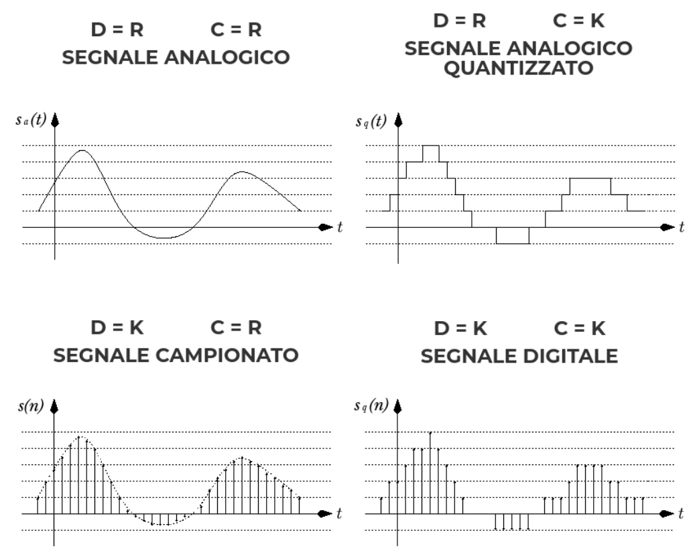

**ATTENZIONE**: Quando vado a discretizzare la variabile indipendente, parliamo di ***campioni***, mentre quando discretizziamo la variabile dipendente *(l'ampiezza)*, parliamo di ***livelli*** *(di quantizzazione)*.

Per passare da un segnale analogico ad uno digitale, dobbiamo **campionare** tale segnale, **quantizzarlo** e successivamente **codificarlo**; la seconda e la terza immagine di sopra rappresentano quindi degli step intermedi di questo passaggio.

Visualizziamo quanto appena detto:

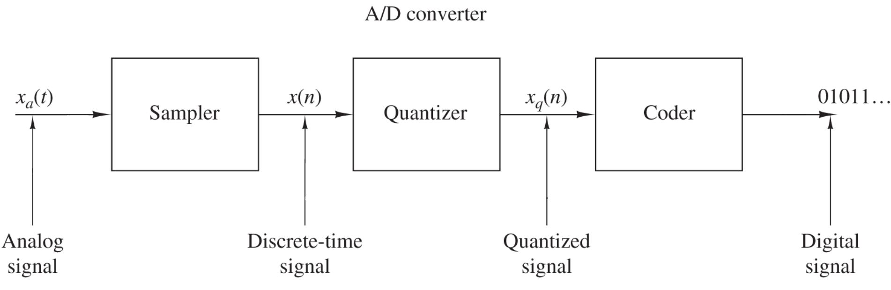

Notiamo in particolare le **variabili**:

- Il segnale analogico viene indicato come $x_a (t)$, dove $t$ è la variabile temporale, a ricordarci che a questo punto siamo nel modo ***continuo*** e dove il pedice $_a$ sta ad indicare *analogico*, per rinforzare quanto appena detto.
- Una volta che il segnale passa attraverso il campionatore, che discretizza la variabile indipendente e quindi il dominio, diventa un ***segnale campionato*** (*a tempo discreto*), e lo indichiamo con $x(n)$ per indicare che ora la variabile indipendente non è più il tempo continuo, ma una variabile $n$ **discreta**.
  Abbiamo scelto $n$ proprio perché *evoca*, ovvero ci ricorda l'insieme dei numeri naturali.
  I nuovi valori della variabile indipendente vengono chiamati ***campioni*** e la distanza tra un campione e un altro è detta ***passo di campionamento*** ed è l'inverso della ***frequenza di campionamento***.
  Un'alta frequenza di campionamento significa una buona riproduzione del segnale ma dei volumi di dati più elevati, viceversa una frequenza più bassa richiede meno spazio ma produce dei fenomeni di **aliasing** del segnale, ovvero questo viene modificato e il risultato è ad esempio un segnale con una frequenza diversa o addirittura un segnale con frequenza zero *(ovvero costante)*.
  C'è quindi un ***punto di limite*** oltre il quale se prendo meno campioni non sono più in grado di ricostruire il mio segnale originale; questo punto limite dipende dalla frequenza del segnale originale.
  Inoltre, scegliendo bene la frequenza di campionamento in base alla frequenza massima del segnale, siamo in grado di ricostruire il segnale senza errori.
- Dopo che abbiamo campionato il segnale, lo quantizziamo ed il segnale di output del quantizzatore è ancora diverso da quelli di prima, quindi per rappresentarlo e per distinguerlo dal segnale la cui ampiezza è ancora definita su infiniti valori, utilizziamo una nuova notazione $x_q (n)$ dove il pedice $_q$ sta per *quantizzato*.
  Questo segnale avrà quindi i valori del codominio discretizzati, ovvero avrà un numero finito di ***livelli***.
  La distanza tra un livello e un altro la chiamiamo $\Delta$ ed è detta ***passo di quantizzazione***, mentre l'insieme dei valori che possiamo descrivere con questo processo di quantizzazione è detto ***range del quantizzatore***.
  A differenza del campionamento, la quantizzazione introduce **sempre** un **errore** non recuperabile nel segnale, quindi la quantizzazione è un processo irreversibile.
- Ovviamente una volta codificato, il segnale sarà rappresentato con una sequenza di zeri e uni.

In analogia con lo schema precedente, notiamo che il segnale rappresentato nella prima immagine è un segnale di tipo $s_a(t)$, quello nella seconda immagine è un segnale di tipo $s_q(t)$, quello rappresentato nella terza immagine è un segnale di tipo $s(n)$ e quello nella quarta immagine è un segnale di tipo $s_q(n)$.

## SEGNALI: ALCUNE DEFINIZIONI

Abbiamo detto che un segnale è una **funzione** che descrive un **fenomeno fisico** e il suo comportamento in base ad una o più **variabili indipendenti**; a seconda di queste variabili indipendenti possiamo definire una dimensione del segnale: un segnale definito su una variabile indipendente unica *(ad esempio il segnale audio)* è detto **segnale monodimensionale**, un segnale definito su più variabili indipendenti *(ad esempio le immagini, il cui segnale è definito nello spazio, quindi su lunghezza e larghezza)* è detto **segnale multidimensionale**.

Un segnale composto da più segnali invece è detto ***segnale multicanale***; un esempio è l'**EEG**, che è rappresentato da un insieme di 16 segnali monodimensionali. La caratteristica dei segnali multicanale è che in un certo istante $t$, i valori assunti dai singoli segnali sono correlati tra loro poiché si riferiscono allo stesso fenomeno fisico.

*Esempio*: un'immagine in scala di grigi è definita da un segnale monocanale multidimensionale *(essendo definito sullo spazio)*, mentre un'immagine a colori è definita da un segnale multidimensionale multicanale *(uno per ogni canale dei colori principali RGB)*.

**NOTA SUL DOMINIO**: Generalmente parliamo di segnali nel dominio del tempo o dello spazio, spesso però i segnali sono rappresentati nel dominio delle frequenze.
Inoltre, una volta che campioniamo il segnale, utilizziamo $n$ per indicare i campioni con cui il segnale è stato campionato. Nota bene che $n$ è privo delle informazioni riguardo al dominio originale; prendendo un campione non so se il segnale che sto analizzando cambiava in base al tempo piuttosto che allo spazio piuttosto che ad un altra variabile indipendente. Per poter ricostruire il segnale ho bisogno anche del ***passo di campionamento (o della frequenza di campionamento che è il suo inverso)*** in modo da sapere quanto tempo *(o spazio o frequenze o qualsiasi altra quantità di una variabile indipendente)* c'è tra un campione e l'altro.

In generale, il valore assunto da un segnale si chiama **AMPIEZZA** *(variabile dipendente, codominio)*.

**VALOR MEDIO DEL SEGNALE**

- Segnale continuo $\mu = \lim\limits_{T \to \infty} \frac{1}{T} \int\limits_{-\frac{T}{2}}^{\frac{T}{2}} x(t)	\space dt$ 	da $- \infty$ a $+\infty$						$\mu = \frac{1}{T_1-T_0} \int\limits_{T_0}^{T_1} x(t)	\space dt$ 	da $T_0$ a $T_1$
- Segnale discreto e finito $\mu = \frac{1}{N} \sum\limits_{i=0}^{N-1} x_i$

**DEVIAZIONE STANDARD E VARIANZA**
Deviazione standard $\sigma$ o varianza $\sigma^2$ forniscono informazioni aggiuntive per caratterizzare il segnale: la deviazione standard rappresenta quanto lontano dal valor medio il segnale può fluttuare, mentre la varianza rappresenta la **potenza** di questa fluttuazione.

$\sigma^2 = \frac{1}{N} \sum\limits_{i=1}^{N} (x_i - \mu)^2$	**ATTENZIONE**: occhio ai limiti, da $0$ a $N-1$ o da $1$ a $N$ è la stessa cosa.

Il valore rappresenta la media delle distanze al quadrato dei campioni $x_i$ dal valor medio.
Questa distanza viene calcolata al quadrato in modo che il segno non la influenzi, mentre viene considerata la deviazione standard $\sigma$ in modo che questo scostamento sia della stessa dimensione del segnale stesso.

La varianza ha significato quando comparata con l'ampiezza massima del segnale; avere una varianza 100 su un segnale che varia da -1000 a +1000 è diverso da avere una varianza 10 su un segnale che varia da -1 a +1, così come avere una grossa varianza su un segnale che da pulito oscilla molto è diverso che averla su un segnale rumoroso.

In particolare, la varianza rappresenta quanto il segnale varia, ma questo significa che rappresenta, oltre al rumore del segnale che sicuramente contribuirà alla varianza, il ***contenuto informativo*** del segnale; un segnale **costante**, con basso contenuto informativo quindi, ha **deviazione standard 0**!

**DEFINIZIONI**

- Il valor medio del segnale è chiamato anche **DC** *(Direct Current)* o anche **componente continua**.
- Se il segnale è una forma d'onda ripetuta, le fluttuazioni del segnale rispetto al valor medio sono costanti e possono essere descritte da una grandezza chiamata **Ampiezza Picco-Picco App**, da non confondere con la varianza.
- È ragionevole pensare che un segnale totalmente randomico sia un segnale rumoroso, poiché un fenomeno fisico tipicamente ha dei valori che sono correlati tra loro, questo significa che anche i rispettivi campioni dovranno avere una correlazione tra loro.
  Dei campioni si dicono scorrelati quando *vanno a caso*, ovvero quando c'è una grande variazione tra un campione e il successivo.

## SEGNALI PERIODICI E APERIODICI

La ***periodicità*** di un segnale è una caratteristica importante; indica la ripetizione rispetto alla variabile indipendente di una forma d'onda in un certo ***periodo*** $T$. In particolare, un segnale periodico può essere descritto interamente analizzando un suo solo periodo a caso, poiché esso contiene tutta e sola l'informazione che contraddistingue il segnale e la durata del segnale stesso è infinita.
La ***frequenza fondamentale*** di un segnale periodico è strettamente legata al periodo dalla relazione $f_0 = \frac{1}{T}$.

Nella realtà non esistono dei segnali puramente periodici, ma solo dei segnali quasi periodici.

## SEGNALE SINUSOIDALE

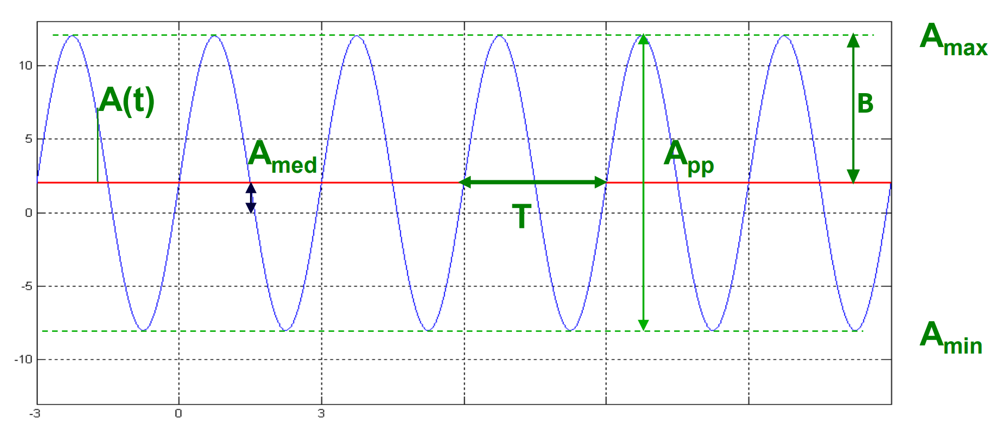

Un segnale sinusoidale è un segnale che oscilla intorno al valor medio in maniera simmetrica

$A(t) = A_{med} + B * sin(2\pi f + \phi_0)$		con $B = \frac{A_{pp}}{2}$ e $A_{med} = \frac{1}{T} \int\limits_{0}^{T} A(t) \space dt$.

Notiamo che per calcolare $A_{med}$ usiamo la formula definita in un periodo, anche se un segnale periodico è definito da $-\infty$ a $+\infty$, poiché abbiamo detto che i segnali periodici sono descritti interamente da un loro periodo.

I parametri importanti dei segnali sinusoidali sono la ***frequenza*** $f$ e la ***fase*** $\phi$ che rappresenta l'alternarsi di positività e negatività del segnale, in particolare è significativa la fase iniziale $\phi_0$. La fase ci dice quindi da dove iniziare a guardare la nostra sinusoide, se guardarla da zero o se sfasarla.
È interessante perché la fase è ciò che mi permette di passare da un seno ad un coseno, tramite un $\phi_0 = \frac{\pi}{2}$.
Un altro parametro importante è la ***pulsazione*** $\omega = 2\pi f$.

## ENERGIA E POTENZA

La potenza istantanea di un segnale è definita come $P(t) = |x(t)|^2$, mentre l'energia di un segnale è definita come $E_x = \int\limits^{+\infty}_{-\infty} |x(t)|^2 \space dt$.

Notiamo subito che se consideriamo un segnale periodico, visto che l'energia considera $|x(t)|^2$, l'Energia di un tale segnale è infinita, poiché corrisponde alla somma di infiniti contributi positivi.

## DECIBEL

Il decibel *dB*, è un'unità di misura di tipo logaritmico che esprime il rapporto tra due livelli di cui uno, *quello al denominatore*, è preso come riferimento.
Dunque la misura in *dB* fra due grandezze fisiche dello stesso tipo è una misura

- **RELATIVA** rispetto ad un valore di riferimento.
- **ADIMENSIONALE** poiché è il rapporto fra due grandezze della stessa dimensione.
- **NON LINEARE**.

 $Bel = \log_{10} \frac{P_1}{P_2}$	il decibel è un decimo di Bel, quindi per ottenere il valore in *dB*, devo moltiplicare il Bel per 10.

Sapendo che $P$ è legata all'ampiezza al quadrato del segnale $A^2$, possiamo scrivere $dB = 10 \log_{10} \frac{P_1}{P_2} = 20 \log_{10} \frac{A_1}{A_2}$.

Quindi, 20 *dB* corrispondono ad un aumento di potenza di 100 volte:
$20 \space dB = 10 \log_{10} \frac{P_1}{P_2} \space dB$;	$2 = 1 \log_{10} \frac{P_1}{P_2}$;	$100 = \frac{P_1}{P_2}$.

O ad un aumento di ampiezza di 10 volte:
$20 \space dB = 20 \log_{10} \frac{A_1}{A_2} \space dB$; $1 = 1 \log_{10} \frac{A_1}{A_2}$;	$10 = \frac{A_1}{A_2}$.

In particolare, 6 *dB* raddoppia l'ampiezza, -6 *dB* la dimezza.

## TRASFORMAZIONI DI SEGNALI

- **TRASLAZIONE RITARDO**: Fissato un tempo $t_0$, la traslazione trasforma il segnale $x(t)$ nel segnale $x(t-t_0)$, che rappresenta lo stesso segnale ritardato di $t_0$.
- **TRASLAZIONE ANTICIPO**: Fissato un tempo $t_0$, la traslazione trasforma il segnale $x(t)$ nel segnale $x(t + t_0)$, che rappresenta lo stesso segnale anticipato di $t_0$.
- **CAMBIO DI SCALA**: Fissato un numero reale $a>0$, la scalatura trasforma il segnale $f(t)$ nel segnale $f(at)$.
  - Se $a > 1$, l'effetto che si ottiene è quello di una compressione lineare.
  - Se $a < 1$, l'effetto che si ottiene è quello di un allungamento o rilassamento lineare.
- **INVERSIONE**: Trasforma il segnale $f(t)$ nel segnale $f(-t)$, che rappresenta il segnale col tempo invertito.
  - Un segnale si dice ***pari*** se $f(t) = f(-t)$.
  - Un segnale si dice ***dispari*** se $f(t) = -f(-t)$.

## SEGNALI CONTINUI

Uno dei segnali continui più importanti è il ***gradino unitario*** $u(t)$ definito come $\begin{cases} 1 & se \space t \geq 0 \\ 0 & se \space t < 0 \end{cases}$

Importante è anche l'***impulso rettangolare unitario*** o ***finestra*** $rect(t)$ definito da $\begin{cases} 1 & se \space |t| \leq \frac{1}{2} \\ 0 & se \space |t| > \frac{1}{2} \end{cases}$

La finestra è molto importante perché ci permette, moltiplicandola ad un segnale, di analizzare solo una porzione di quel segnale.

Inoltre, possiamo ottenere un rettangolo di una certa base $B$ ed una certa altezza $A$ moltiplicando l'altezza alla funzione stessa *(ottenendo quindi 0 dove già prima era 0 e $A$ dove prima valeva 1)* e dividendone l'argomento per la base *(in questo modo il rettangolo si crea da $-\frac{B}{2}$ a $+\frac{B}{2}$)*.

Quindi, un rettangolo di base $B$ e altezza $A$ è ottenibile dalla funzione $A \space rect(\frac{t}{B})$.

Se poi vogliamo traslare la finestra, ci basta aggiungere o sottrarre a $t$ un certo tempo $t_0$ che rappresenti di quanto vogliamo traslare.

## DELTA DI DIRAC E IMPULSO UNITARIO

La *distribuzione* *(perché siamo nel mondo continuo)* delta di Dirac $\delta (t)$ *(ovviamente possiamo avere una qualsiasi variabile indipendente al posto di $t$)* è definita come un rettangolo di base ***infinitesima $\Delta$*** e di altezza ***infinita $\frac{1}{\Delta}$*** *(infinita appunto perché $\Delta$ è infinitesima)*, in modo che l'area sottostante sia pari a 1.
$\int\limits_{-\infty}^{+\infty} \delta(t) \space dt = 1$.

Possiamo quindi pensare alla delta di Dirac come ad un rettangolo di base $\Delta$ e altezza $\frac{1}{\Delta}$ per $\Delta$ infinitesimale come segue: $\lim\limits_{\Delta \to 0} \frac{1}{\Delta} \space rect(\frac{1}{\Delta})$.

Il corrispondente della delta di Dirac nel mondo discreto è l'***impulso unitario*** *(o Delta di Kronecker)* definita come $\delta(n) = \begin{cases} 1 & se \space n=0 \\ 0 & se \space n \neq 0 \end{cases}$	e che viene rappresentata con una freccia verticale di altezza 1.

Ovviamente anche su questa funzione possiamo applicare delle trasformazioni, per esempio possiamo avere un impulso di ampiezza $A$ che occorre ad un certo tempo $n_0$ scrivendo $A\delta(n-n_0)$, che si traduce nel moltiplicare l'ampiezza di $A$ e ritardare la funzione di un tempo $n_0$.
Ricordando la definizione della **delta di Kronecker**, sappiamo che essa vale 1 quando l'argomento vale 0; essendo ora l'argomento $n - n_0$, esso varrà 0 solo quando $n = n_0$.

Notiamo che se scriviamo delle sequenze di $\delta$, otteniamo diversi impulsi che sono molto importanti perché ci permettono di descrivere dei campioni.

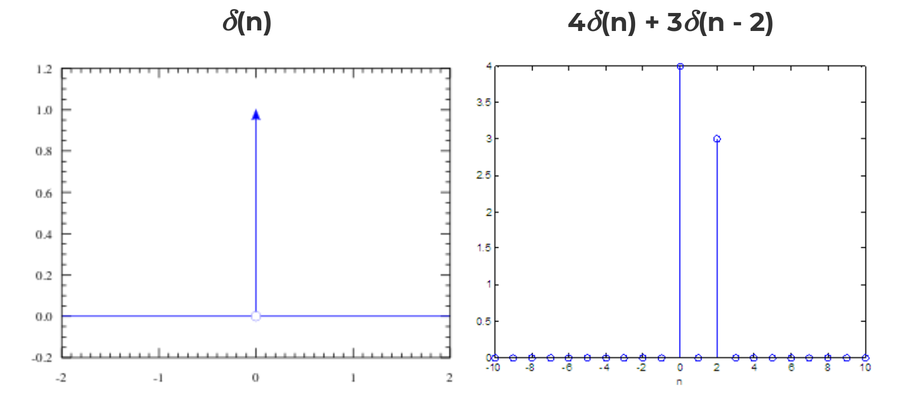

**PROPRIETÀ DELL'IMPULSO**

- $x(n) * \delta(n) = x(0)$: Poiché la $\delta$ assume valore unitario sono quando $n = 0$, moltiplicando un segnale per $\delta(n)$, ottengo solo il suo valore in corrispondenza del campione $n = 0$ *(non a caso abbiamo definito la delta di Dirac come un rettangolo infinitesimale, è come se restringessimo la finestra con la quale osserviamo il segnale ad un solo campione)*.
- $f(n) * \delta(n-n_0) = f(n_0)$: Stesso discorso di prima, ma con un ritardo pari ad $n_0$.
- $u(n) = \sum\limits_{i=0}^{+\infty}\delta(n-i)$: Se riconsideriamo ora il **gradino unitario** definito prima ma in un mondo discreto, è facile rendersi conto che esso è definibile come un *treno* di $\delta$ unitarie che parte dal campione $n = 0$. Questo ci permette anche di dire che $\delta(n) = u(n) - u(n-1)$.

## SEQUENZE

Definiamo un segnale discretizzato come una sequenza $x(n)$. Le sequenze quantizzate in ampiezza formano un segnale digitale.

**SEQUENZA CAUSALE**: Una sequenza definita per $n \geq 0$. Non esistono campioni negativi per questo segnale. Solitamente i segnali fisici sono di questo tipo; possiamo misurare da *ora* per vedere cosa succederà in futuro, ma non posso sapere cosa è successo *prima* di iniziare a misurare.
**SEQUENZA ANTICAUSALE**: Una sequenza definita per $n < 0$. Non esistono campioni postivi per questo segnale.

**SEQUENZA PARI**: $x(n) = x(-n)$, proprio come le funzioni in ambito continuo.
**SEQUENZA DISPARI**: $x(n) = -x(-n)$, proprio come le funzioni in ambito continuo.

**SEQUENZA PERIODICA**: $x(n) = x(n+T)$, ovvero una sequenza è periodica quando si ripete dopo un certo periodo $T$.
**SEQUENZA LIMITATA**: $|x(n)| \leq X_0 < \infty \space \forall n$, ovvero quando la sequenza non ha valori che divergono.

## ANALISI DI FOURIER

L'analisi di Fourier di base richiede dei segnali *particolari*; richiede di avere in input dei segnali periodici e permette la loro decomposizione in ***costituenti sinusoidali (funzioni armoniche)*** di differenti ***frequenze***.
Ci permette dunque di vedere il segnale non più nel dominio del tempo/spazio, ma nel dominio delle ***frequenze***.
**ATTENZIONE**: L'analisi di Fourier ci permette di scomporre il segnale **senza modificarlo**; guardando il segnale da un'altra prospettiva *(quella delle frequenze)*, non lo stiamo modificando!

*Esempio per costruire una forma d'onda quadra*:

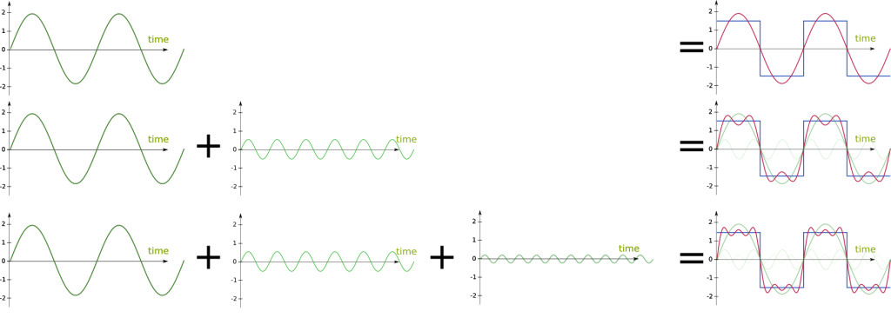

L'ampiezza di ogni segnale sinusoidale ci dice ***quanto è presente*** quel segnale nel nostro segnale originario.
In generale, la sinusoide con la maggior ampiezza è quella con minor frequenza e viene anche chiamata ***frequenza fondamentale***.

In generale, quando abbiamo un segnale che varia poco *(ad esempio una foto in cui prevale un certo colore)*, l'analisi in frequenza ci restituirà delle frequenze basse.

## SERIE DI FOURIER

Ricordando che gli argomenti di seno e coseno sono $2\pi f(x)$ e indicando il periodo del nostro segnale periodico con $N$, possiamo scrivere:

$f(x) = \frac{a_0}{2} + \sum\limits_{k=1}^{\infty} a_k \cos(2\pi \space \frac{k}{N} x) + b_k \sin(2\pi \frac{k}{N} x)$

Dove:

- $a_k$ e $b_k$ sono dei *pesi* che applichiamo ai seni e coseni, in modo da modificarne l'***ampiezza***.
- $\frac{k}{N}$ sta ad indicare che modifichiamo le frequenze delle sinusoidi, in particolare questo ci dice che, per ottenere il nostro segnale originale, stiamo sommando delle sinusoidi con frequenze **multiple intere** *(per questo c'è una sommatoria e non un integrale)* di $\frac{1}{N}$ che è la ***frequenza fondamentale*** del nostro segnale *(ricordiamo che il periodo vale $N$, quindi la frequenza è $\frac{1}{N}$)*.
- $a_0$ è semplicemente un termine che ci permette di traslare verso l'alto o verso il basso la nostra funzione. È importante notare che se aggiungiamo un termine costante alle nostre frequenze, e quindi le trasliamo, le frequenze stesse **non cambiano**.
- Notiamo che la sommatoria va da 1 a $\infty$, ma questo non significa che tutti i segnali periodici contengono tutte le possibili frequenze sinusoidali; alcune di queste avranno i coefficienti $a_k$ e $b_k$ pari a 0.
- Stiamo praticamente dicendo che $f(x)$ è ***combinazione lineare*** *(o sovrapposizione degli effetti)* di funzioni di tipo seno e coseno pesate con i rispettivi coefficienti $a_k$ e $b_k$.

Quello che poi otteniamo dall'analisi di Fourier è una serie di coppie frequenza / ampiezza che ci permettono di descrivere il segnale originale.

## NUMERI COMPLESSI

Definiamo i numeri complessi come $z = a + ib$, dove $b$ è la parte immaginaria.

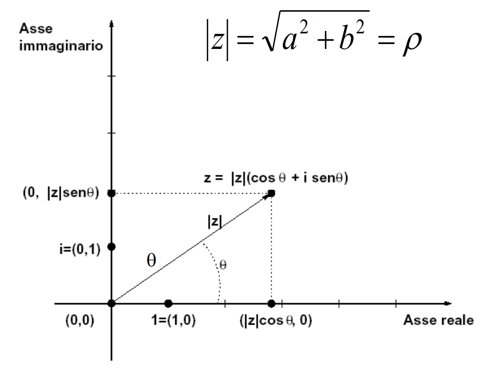 

Osservando il grafico definiamo le ***coordinate polari***, che non sono altro che un altro modo di guardare i punti su un piano come: $a = \rho \cos(\Theta)$, $b = \rho \sin(\Theta)$ e $\Theta = arctg(\frac{b}{a})$.

## SPAZIO COMPLESSO

Passiamo adesso nello spazio complesso utilizzando le ***formule di Eulero*** che stabiliscono che $e^{i\Theta} = \cos(\Theta) + i \sin(\Theta) \\ e^{-i\Theta} = \cos(\Theta) - i \sin(\Theta)$

Di conseguenza, possiamo riscrivere $\cos(\Theta)$ e $\sin(\Theta)$ come:

$\cos(\Theta) = \frac{1}{2}(e^{i\Theta} + e^{-i\Theta}) = \frac{1}{2}([\cos(\Theta) + i \sin(\Theta)] + [\cos(\Theta) - i\sin(\Theta)]) = \frac{1}{2}(2\cos(\Theta)) \\ \space \\
\sin(\Theta) = \frac{1}{2i}(e^{i\Theta} - e^{-i\Theta}) = \frac{1}{2i}([\cos(\Theta) + i\sin(\Theta)] - [\cos(\Theta) - i\sin(\Theta)]) = \frac{1}{2i}(2i\sin(\Theta))$

Riprendiamo ora la serie di Fourier e notiamo che è definita come una somma di coseni e seni;
Possiamo quindi riscriverla come $f(x) = \sum\limits_{k= -\infty}^{+ \infty} R_k e^{j(2\pi f_kx)}$

Notiamo che ora la sommatoria va da $-\infty$ a $+\infty$ perché abbiamo introdotto dei termini con l'esponente negativo e dei termini con l'esponente positivo, perché abbiamo introdotto anche le frequenze negative.

Possiamo leggere la nuova formula semplificata come: *Una qualunque funzione periodica $f(x)$ può essere espressa come somma di infiniti termini di tipo esponenziali complesso, con frequenze (dell'esponenziale complesso) multiple intere di una frequenza fondamentale e pesante da un coefficiente $R_k$*.

Dove $R_k$ è il peso con il quale la componente *(ovvero della frequenza)* k-sima *"entra in gioco"* nel descrivere la nostra $f(x)$.
Notiamo che abbiamo ancora una combinazione lineare, non più di seni e coseni ma di esponenziali complessi.
Considerando l'equazione di prima possiamo quindi scrivere $R_k = \int\limits_{-\frac{N}{2}}^{\frac{N}{2}} f(x) \space e^{-j(2\pi f_k x)} \space dx$.
Notiamo che stiamo integrando questa volta; questo perché stiamo considerando $f(x)$, che è definita su una variabile *continua* $x$.
In particolare, questa formula sta *proiettando* la nostra funzione $f(x)$ in uno spazio i cui versori sono gli esponenziali complessi; stiamo quindi proiettando la funzione $f(x)$ lungo dei versori a cui corrispondono delle frequenza $f_k$, ovvero stiamo proiettando $f(x)$ lungo ciascuna frequenza $f_k$.

In questo modo passiamo da una rappresentazione nel tempo del segnale ad una rappresentazione nello spazio delle frequenze.

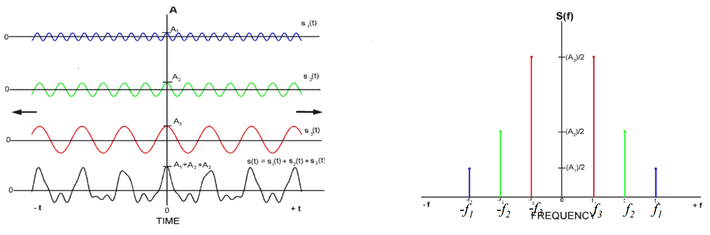

I due domini sono ovviamente corrispondenti; notiamo che nel dominio delle frequenze abbiamo delle $\delta$ che hanno una certa ampiezza $A$, che ci dice quanto il segnale rappresentato da quella $\delta$ influisce sulla creazione del segnale originario. Se prendiamo ogni frequenza individuata nel dominio delle frequenze e le combiniamo linearmente con i vari pesi $A$, otterremo il segnale di partenza. C'è quindi una ***corrispondenza biunivoca*** tra di essi.

## TRASFORMATA DI FOURIER (FT)

Tutto quello che abbiamo detto fino ad ora si applica solo alle funzioni periodiche, il che ci limita non poco considerando che in natura non esistono dei veri fenomeni periodici, quindi dobbiamo generalizzare quanto detto.

Introduciamo quindi la ***trasformata di Fourier***, che stabilisce che ogni funzione continua $f(x)$, **anche non periodica** *(purché abbia area finita, ovvero a patto che l'integrale della funzione su tutto il suo dominio sia finito)*, può essere espressa come **integrale** di **sinusoidi complesse** *(o esponenziali complessi)* opportunamente pesate.

**ANTI TRASFORMATA DI FOURIER** *(Dominio spaziale/temporale o dominio diretto)*
$f(x) = \int\limits_{-\infty}^{+\infty} F(u)e^{i2\pi ux} \space du$					dove $F(u)$ è il peso con il quale la frequenza $u$ *"entra in gioco"*.

Notiamo subito che, a differenza della formula della serie di Fourier, questa usa un integrale, poiché siamo passati da una variabile discreta $k$ ad una frequenza $u$ che assume infiniti valori continui.
Essendo le variabile $u$ continua, $F(u)$, che assegna ad ogni frequenza un peso, è essa stessa una funzione continua.

**TRASFORMATA DI FOURIER** *(Dominio delle frequenze o dominio trasformato)*
$F(u) = \int\limits_{-\infty}^{+\infty} f(x)e^{-i2\pi ux} \space dx$

Qui la formula è esattamente come prima, essendo $x$ ancora una variabile continua.
La differenza è che prima avevamo una grandezza $R_k$ discreta e quindi ottenevamo, nel dominio trasformato, delle $\delta$, mentre in questo caso otteniamo una funzione continua. Ovviamente anche in questo caso **non c'è perdita di informazione** tra un dominio e l'altro.

## TRASFORMATA DI FOURIER 1D

Quando applichiamo la trasformata di Fourier ad un segnale $f(x)$, otteniamo un segnale composto da un **modulo** *(spettro, componente di intensità)* e da una **fase** *(componente spaziale)*, che corrispondono quindi alla parte reale e alla parte immaginaria del mondo complesso della trasformata.

In coordinare polari avremo quindi:
$F(u) = \mathsf{F}[f(x)] = \mathfrak{R}(u) + j\mathfrak{I}(u) = |F(u)|e^{j\phi(u)}$

**SPETTRO**: $|F(u)| = \sqrt{[\mathfrak{R}(u)^2 + \mathfrak{I}(u)^2]}$

**FASE**: $\phi(u) = arctan[\frac{\mathfrak{I}(u)}{\mathfrak{R}(u)}]$

**POTENZA (DENSITÀ) SPETTRALE**: $|F(u)|^2 = \mathfrak{R}(u)^2 + \mathfrak{I}(u)^2$

## TRASFORMATA DI FOURIER 2D

**TRASFORMATA**: $F(u,v) = \int\limits_{-\infty}^{+\infty}\int\limits_{-\infty}^{+\infty} f(x,y)e^{-j2\pi(ux+vy)} \space dx dy$

**ANTI TRASFORMATA**: $f(x, y) = \int\limits_{-\infty}^{+\infty}\int\limits_{-\infty}^{+\infty} F(u, v)e^{j2\pi(ux+vy)} \space dudv$

**SPETTRO**: $|F(u, v)| = \sqrt{[\mathfrak{R}(u, v)^2 + \mathfrak{I}(u,v)^2]}$

**FASE**: $\phi(u, v) = arctan[\frac{\mathfrak{I}(u,v)}{\mathfrak{R}(u,v)}]$

**POTENZA (DENSITÀ) SPETTRALE**: $|F(u,v)|^2 = \mathfrak{R}(u,v)^2 + \mathfrak{I}(u,v)^2$

Notiamo che avendo due dimensioni nel dominio di partenza, ne avremo due anche in quello trasformato; avremo infatti degli esponenziali complessi con una componente in frequenza in una direzione e una nell'altra.

In particolare quindi possiamo dire che quello che facciamo in una dimensione si replica in maniera identica nell'altra; difatti potremo, invece che fare un'operazione bidimensionale, fare due volte la stessa operazione su ogni dimensione. Questa è una proprietà della trasformata di Fourier che prende il nome di proprietà di separabilità, ma la vedremo in seguito.

## DISCRETE TIME FOURIER TRANSFORM (DTFT)

Consideriamo ora una funzione discreta *(campionata)*, spostiamoci quindi dal mondo continuo a quello discreto.
Un primo cambiamento causato da questo spostamento è che $f(x)$ *(dove $x$ è **continua**)* diventa $f(i)$ con $i$ ***discreta*** che rappresenta una quantità $i*\Delta x$, dove $\Delta x$ è il **passo di campionamento**.
Ciò implica anche che la trasformata di Fourier diventi $F(u) = \sum\limits_{i=-\infty}^{+\infty} f(i)e^{-j2\pi ui\Delta x}$

**ATTENZIONE**: $F(u)$ è ancora continua poiché la variabile $u$ che rappresenta le infinite possibili frequenze non è cambiata ed è ancora continua!

**LIMITE SPAZIALE**
Consideriamo ora una funzione discreta *(campionata)* e **limitata spazialmente**, ovvero una funzione che precede il processo di quantizzazione, campionata su un numero limitato di campioni pari ad $N$ con un passo $\Delta x = \frac{1}{N}$.

Avremo quindi $f(i) = f(x_0 + i * \Delta x)$			$\forall i \in 0, \space ..., \space N-1$

Cosa ci cambia questo nella formula precedente quindi?
Cambia il fatto che ora la nostra sommatoria non andrà più da $-\infty$ a $+\infty$, poiché i nostri campioni sono limitati all'intervallo $[1, N]$.

La nostra formula diventa quindi $F(u) = \frac{1}{N} \sum\limits_{i=0}^{N-1}f(i)e^{-j2\pi u\frac{1}{N} i}$

Il $\frac{1}{N}$ davanti alla sommatoria è un **termine di normalizzazione**.

$F(u)$ è **ancora continua**.

**CONSEGUENZE**
C'è una grande conseguenza legata alla discretizzazione e alla considerazione di un numero finito di campioni della nostra funzione iniziale; la trasformata di Fourier di questo segnale non sarà più come prima, ma diverrà una ***funzione periodica*** con un periodo pari ad $N$ *(N.B. è ancora una funzione continua)*.

Questo risulta chiaro anche dalla proprietà di **biunivocità** tra trasformata e anti trasformata; è chiaro che ***non potrò avere***, come risultato della funzione campionata su un numero finito di campioni, ***lo stesso risultato*** che otterrei con la funzione non campionata, altrimenti crollerebbe l'assunzione della biunivocità visto che il segnale continuo ed il segnale discretizzato sono **diversi**.

**DIMOSTRAZIONE**
$F(u+N) = \frac{1}{N} \sum\limits_{i=0}^{N-1} f(i)e^{-j\frac{2\pi}{N}(u+N)i} = \frac{1}{N} \sum\limits_{i=0}^{N-1} f(i)e^{-j\frac{2\pi}{N}ui} e^{-j2\pi i}$

Ora se consideriamo $e^{-j2	\pi i}$ come $\cos(2\pi i) - j\sin(2\pi i)$, e, considerando che $\cos(2\pi i)$ vale sempre 1, mentre $\sin(2\pi i)$ vale sempre 0, possiamo dire che $e^{-j2	\pi i} = 1$.

Di conseguenza possiamo scrivere che $\frac{1}{N} \sum\limits_{i=0}^{N-1} f(i)e^{-j\frac{2\pi}{N}ui} e^{-j2\pi i} = \frac{1}{N} \sum\limits_{i=0}^{N-1} f(i)e^{-j\frac{2\pi}{N}ui} = F(u)$

## TRASFORMATA DI FOURIER DISCRETA (DFT)

A questo punto, essendo diventata la nostra trasformata periodica, dovremo campionare anche la parte in frequenze, passando quindi ora da una funzione $F(u)$ continua ad una **discreta**.

La nostra anti trasformata diverrà quindi $f(x) = \sum\limits_{u=0}^{M-1} F(u)e^{j\frac{2\pi}{M}ux}$			$x \in 0, \space ..., \space M-1$

Una conseguenza importante è che, come nel caso della funzione $f(i)$ discretizzata, quando andremo a anti trasformare la nostra funzione $F(u)$ ora discreta, creeremo una $f(x)$ periodica, per il dualismo fra spazio diretto e spazio trasformato.

## PROPRIETÀ DFT

- **PROPRIETÀ 1: LINEARITÀ** *(vale anche per FT e DTFT)*:

  La trasformata di Fourier è un ***operatore lineare***, il che significa che:

  - Applicare la trasformata su una somma di funzioni equivale a sommare le singole trasformate delle due funzioni.
    $F(f(x) + g(x)) = F(f(x)) + F(g(x)) = F(u) + G(u)$
  - Applicare la trasformata ad una funzione moltiplicata per una costante $A$ equivale a moltiplicare tale costante alla trasformata della funzione stessa.
    $F(Af(x)) = AF(f(x)) = AF(u)$

  Questo ci permette, nel caso avessimo un problema complesso, di lavorare su dei suoi sotto-problemi più semplici applicando la trasformata ad essi e poi tornare al problema complesso solo alla fine.

  

- **PROPRIETÀ 2: TRASLAZIONE NELLO SPAZIO/TEMPO** *(vale anche per FT e DTFT)*:

  Quando effettuiamo una traslazione sulla funzione $f(x + x_0)$, questo equivale, nel mondo trasformato, ad una ***modulazione in frequenza***, che si traduce nel moltiplicare la trasformata della funzione di partenza non traslata $f(x)$ per un esponenziale $e^{j 2\pi u x_0}$ nel quale viene espressa questa traslazione.

  $F(f(x+x_0)) = e^{j 2\pi u x_0} F(u)$					con $F(u) = F(f(x))$

  Questo ci conferma che se, ad esempio, abbiamo un'immagine di un oggetto su uno sfondo, quando lo trasliamo il modulo della sua trasformata $F(u)$ non cambia, ma cambia la fase.

  Osserviamo un esempio: notiamo che nonostante il quadratino bianco ***trasli*** sullo sfondo nero, il modulo dell'immagine non cambia, mentre cambia la *fase*.

  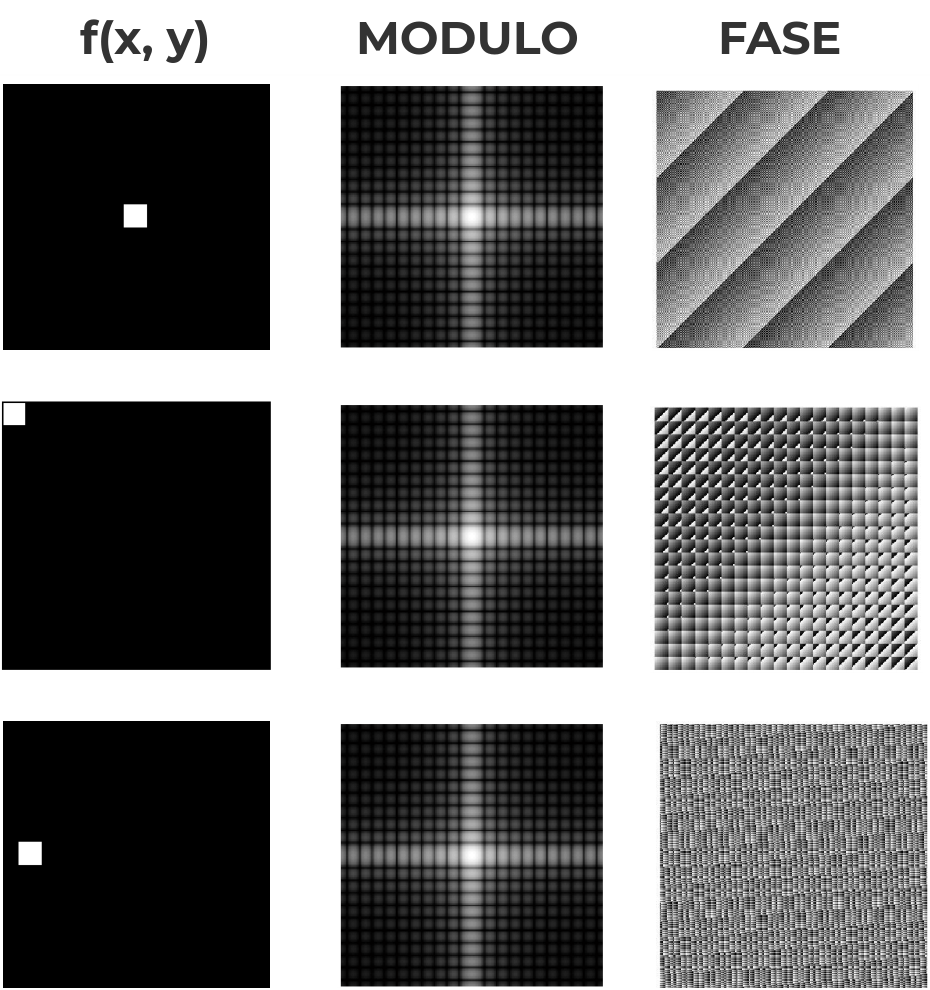

  

- **PROPRIETÀ 3: TRASLAZIONE NELLE FREQUENZE**:

  Ricordiamoci che le formule della trasformata e dell'anti-trasformata sono identiche a meno del segno dell'esponente.
  Questo ha una grossa conseguenza sui nostri segnali e sulle loro proprietà; certe proprietà che troviamo nel dominio di partenza le ritroviamo anche nel dominio di arrivo.

  Questo significa che se abbiamo una traslazione nelle frequenze questa volta, ciò si traduce in una ***modulazione nello spazio*** con un esponenziale complesso.

  $F^{-1}(F(u + \omega)) = f(x)e^{-j 2\pi x \omega}$

  

- **PROPRIETÀ 4: SCALA** *(vale anche per FT e DTFT)*:

  Se applichiamo un fattore di scala alla nostra funzione nel dominio di partenza, la funzione trasformata subisce lo stesso scaling, ma inverso.

  $F(f(ax)) = \frac{1}{|\alpha|} F(\frac{u}{\alpha})$

  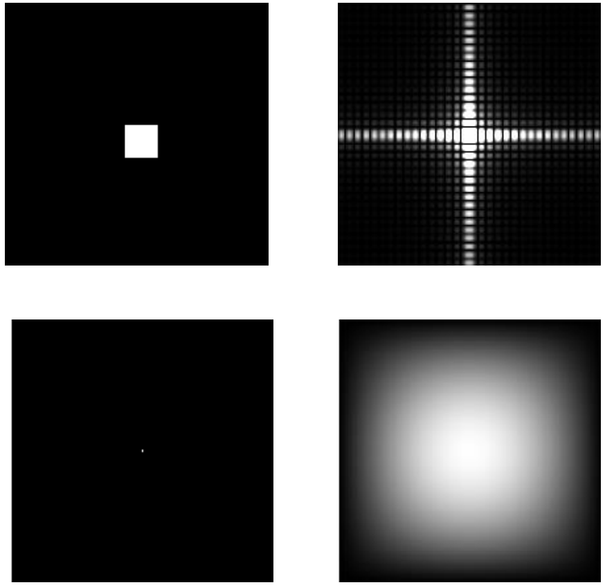

  

- **PROPRIETÀ 5: INVERSIONE** *(vale anche per FT e DTFT)*:

  Se inverto il segnale di partenza $f(x)$, anche la trasformata risulterà invertita.

  $F(f(-x)) = F(-u)$

  

- **PROPRIETÀ 6: SIMMETRIA** *(vale anche per FT e DTFT)*:

  La trasformata gode della ***simmetria Hermitiana***: questo significa che: 

  - La parte **reale** e il **modulo** sono ***simmetrici rispetto all'origine***.
  - La parte **immaginaria** e la **fase** sono ***antisimmetriche rispetto all'origine***.

  Questo non dovrebbe sorprendere in quanto l'esponenziale complesso che utilizziamo nella trasformata di Fourier è fatto da una parte reale, definita da un **coseno** *(pari)* e da una parte immaginaria, definita da un **seno** *(dispari)*.

  Facendo il modulo inoltre portiamo tutto ad essere pari, visto che rendiamo tutto positivo, mentre nella fase prevale l'asimmetria dispari del seno.

  

- **PROPRIETÀ 7: PERIODICITÀ DELLA DFT** *(Vale anche per DTFT)*:

  Abbiamo visto come la discretizzazione della funzione iniziale introduca una periodicità; ovviamente quindi questa proprietà non si applica alla trasformata continua.

  La proprietà ci dice che quando campioniamo una funzione con un passo di campionamento pari a $\frac{1}{M}$, la sua trasformata diventa **periodica** e, in particolare, il suo periodo vale $M$, ovvero l'inverso del passo di campionamento.

  

- **PROPRIETÀ 7B: PERIODICITÀ DTF-1** *(vale solo per DFT)*:

  Per via della simmetria presente tra trasformata e anti-trasformata, quando andiamo ad applicare l'anti-trasformata su un segnale trasformato **campionato** *(ricordiamoci che noi lavoriamo nel mondo digitale)*, introduciamo una periodicità questa volta nel **dominio iniziale**.

  

- **PROPRIETÀ 8**:

  Diversamente dal caso continuo, la **DFT** e **DFT-1** esiste sempre, qualunque sia la funzione considerata.

  

- **PROPRIETÀ 9: SEPARABILITÀ** *(Vale anche per FT e DTFT)*:

  Questa è una proprietà molto importante quando la ***dimensione*** del nostro segnale cresce e abbiamo quindi più coppie di variabili nel nostro esponenziale complesso.
  Questo ci permette, grazie alle proprietà degli esponenziali, di suddividere queste coppie nel prodotto di più esponenziali; ovvero effettuare la trasformata di Fourier su un segnale a più dimensioni applicando la singola trasformata su ogni dimensione in successione.

  Passiamo quindi da $f(x, y)$, nel dominio di partenza, a $F(x, v)$, dove solo $y$ è stata trasformata, a $F(u, v)$ dove è stata trasformata anche la variabile $x$.
  In termini computazionali passiamo da un fattore $n^2$ ad uno $2n$.

  $F(u,v) = \frac{1}{NM} \sum\limits_{x=0}^{N-1}\sum\limits_{y=0}^{M-1} f(x, y) e^{-j 2 \pi (\frac{ux}{N} + \frac{vy}{M})} = \frac{1}{N}\sum\limits_{x=0}^{N-1}(\frac{1}{M} \sum\limits_{y=0}^{M-1} f(x,y)e^{-j 2\pi (\frac{vy}{M})}) e^{-j 2\pi (\frac{ux}{N})}$

  

- **PROPRIETÀ 10: REVERSIBILITÀ** *(Vale anche per FT e DTFT)*:

  Questa proprietà ci dice che la trasformata non modifica in alcun modo il segnale di partenza ed è sempre possibile spostarsi da un mondo all'altro senza alcuna perdita di dati.

  $F^{-1}F(f(x,y)) = f(x,y)$

  

- **PROPRIETÀ 11: VALOR MEDIO** *(Vale anche per DTFT)*:

  Questa proprietà ci ribadisce un concetto che abbiamo già visto: il valor medio di una funzione $f(x)$ rappresenta la sua frequenza fondamentale $F(0)$.

  $F(0) = \frac{1}{M} \sum\limits_{x=0}^{M-1} f(x)$

## ALCUNE OSSERVAZIONI

Abbiamo detto che, data la formula $F(u) = \int\limits_{-\infty}^{+\infty} f(x)e^{-j 2\pi ux}$,
$F(u_0)$ rappresenta il ***peso*** con cui l'***onda complessa*** $e^{-j 2\pi u_0x}$ di ***frequenza $u_0$*** concorre per formare il segnale $f(x)$.

Cosa succede però se $f(x) = Ae^{j2	\pi u_k x}$, ovvero se $f(x)$ è un'onda complessa di frequenza $u_k$?
Innanzitutto questo significa che il nostro segnale è composto da **un'unica frequenza**, ovvero $u_k$.
La sua trasformata $F(u)$ sarà zero per ogni frequenza diversa da $u_k$, mentre in corrispondenza di $u_k$ presenterà una ***delta*** di altezza $A$, ovvero $F(u) = \int\limits_{-\infty}^{+\infty}Ae^{j2\pi u_kx} \space e^{-j2\pi ux} \space dx = A \delta(u - u_k)$.

Consideriamo ora la formula di Eulero $\cos(\Theta) = \frac{1}{2}(e^{j\Theta} + e^{-j\Theta})$, se $f(x) = A\cos(2\pi u_0 x)$, la sua trasformata sarà:

$F(u) = \int\limits_{-\infty}^{+\infty} A\cos(2\pi u_0x)\space e^{-j2\pi ux} \space dx = \frac{A}{2} \int\limits_{-\infty}^{+\infty} (e^{j2\pi u_0x} + e^{-j2\pi u_0x}  )\space e^{-j2\pi ux} \space dx$

$F(u) = \frac{A}{2} \delta(u-u_0) + \frac{A}{2} \delta(u + u_0)$

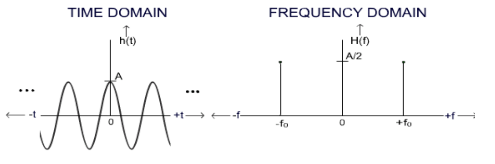

Quindi, la trasformata di un coseno corrisponde a due delta in corrispondenza della sua frequenza positiva e negativa. Questo risulta chiaro se applichiamo la proprietà di linearità; il coseno non è altro che una combinazione lineare di onde complesse come possiamo vedere anche sopra, quindi possiamo ottenere il risultato della trasformata anche combinando linearmente i risultati dei singoli esponenziali complessi.
Notiamo inoltre che la trasformata del coseno ha solo una parte reale.

Se avessimo considerato il seno, sarebbero intervenuti innanzitutto un cambio di segno e poi una parte immaginaria, difatti $\sin(\Theta) = -\frac{j}{2}(e^{j\Theta} - e^{-j\Theta})$.

$F(u) = \int\limits_{-\infty}^{+\infty} A\sin(2\pi u_0x) e^{-j2\pi ux} \space dx = -j\frac{A}{2} \int\limits_{-\infty}^{+\infty}(e^{j2\pi u_0x} - e^{-j2\pi u_0 x}) \space e^{-j2\pi ux} \space dx$

$F(u) = -j\frac{A}{2} \delta(u - u_0) + j\frac{A}{2} \delta(u + u_0)$

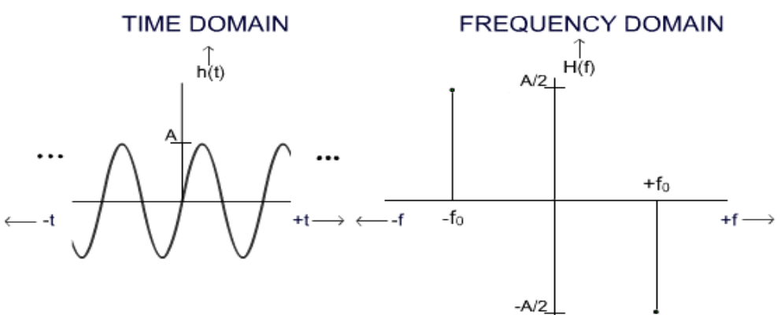

Notiamo che il cambio di segno ci porta ad una delta negativa. Inoltre, ora la trasformata ha soltato una parte immaginaria.

Se invece $f(x)$ fosse una costante $x = K$?
Possiamo vedere la costante come un coseno a frequenza 0; questo comporta che nel dominio trasformato le due delta del coseno convergano a 0 dove eventualmente si sovrappongono e creano un'unica delta alta $K$.

E se $f(x)$ fosse una delta centrata in zero?
Applicando la proprietà della reversibilità, otteniamo che la trasformata di una delta  centrata in 0 corrisponde ad una costante. Questo risulta chiaro anche considerando che un cambio istantaneo di valori *(es. da 0 a 1)* comporta la presenza di **tutte** le possibili frequenze dentro di esso.

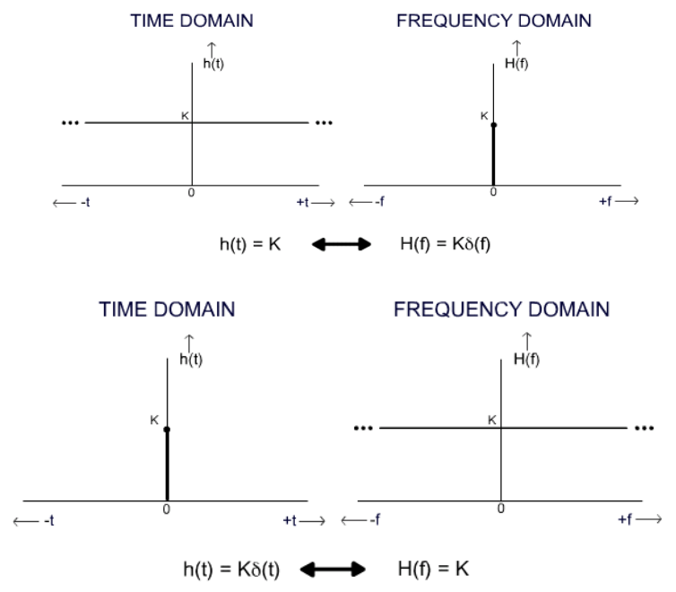

## SINC

La trasformata di una finestra è una funzione molto importante è si chiama **Sinc** ed è definita come $H(f) = AT \frac{\sin(\pi Tf)}{\pi Tf}$.

È una funzione che ha valore massimo in 0, mentre lontano dallo 0 oscilla.

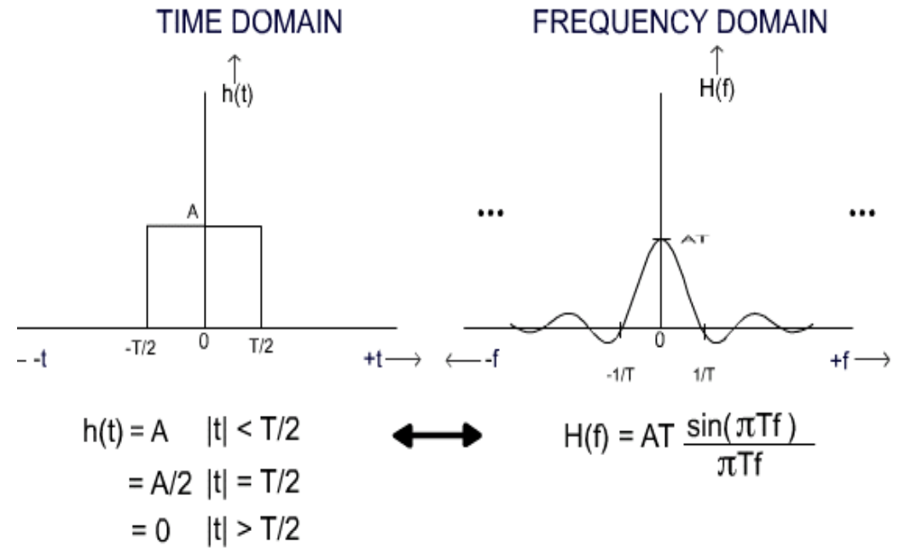

Notiamo subito che la prima oscillazione avviene a $\frac{1}{T}$, dove $T$ è la grandezza della nostra finestra; più è larga la nostra finestra, più se restringe il Sinc *(proprietà scala)*.
Questo significa che se consideriamo una finestra infinita, ovvero una costante, la Sinc oscillerà subito, creando una delta, come abbiamo visto prima.

## CAMPIONAMENTO

Un ***campionatore*** è un *"interruttore"* che si apre e si chiude con una certa frequenza $\frac{1}{T}$ e ogni volta che si chiude legge il valore del segnale in quel istante di tempo per quel determinato campione.

Notiamo che indichiamo il segnale con $_a$ e con $(t)$ quando siamo ancora nel dominio continuo, mentre indichiamo con $(n)$ il segnale campionato, proprio per ricordarci che stiamo trattando un segnale che varia nei campioni *(interi)* e non più nel tempo *(continuo)*.

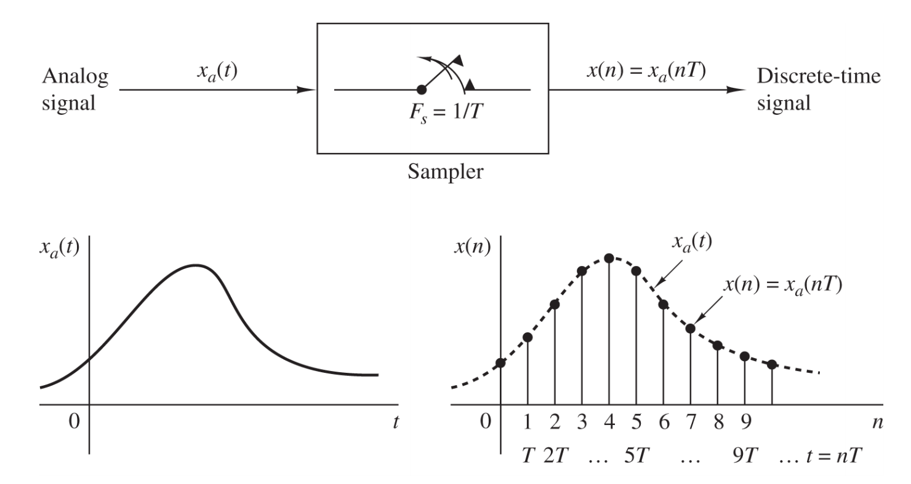

Qual è quindi il passo di campionamento adatto per non perdere troppe informazioni del segnale originario?
Sappiamo che

- Un'alta frequenza di campionamento significa una buona riproduzione del segnale, a costo però di volumi di dati più elevati.
- Una bassa frequenza di campionamento può produrre fenomeni di ***aliasing***: il segnale originario *(segnale blu)* viene interpretato come un segnale a frequenza minore *(segnale 2, rosso)* o addirittura come una costante *(segnale 1, giallo)*.

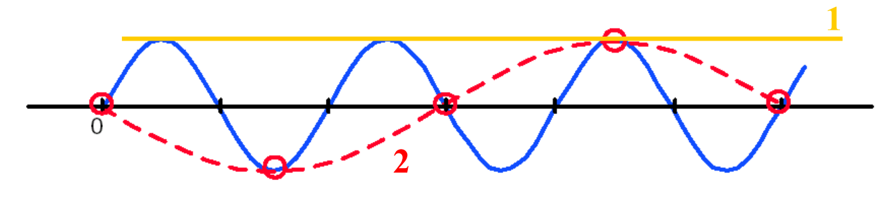

Abbiamo visto che, quando campioniamo una funzione con un passo $\Delta x = \frac{1}{N}$, la sua trasformata è uno ***spettro periodico*** che ha periodo = $N$.

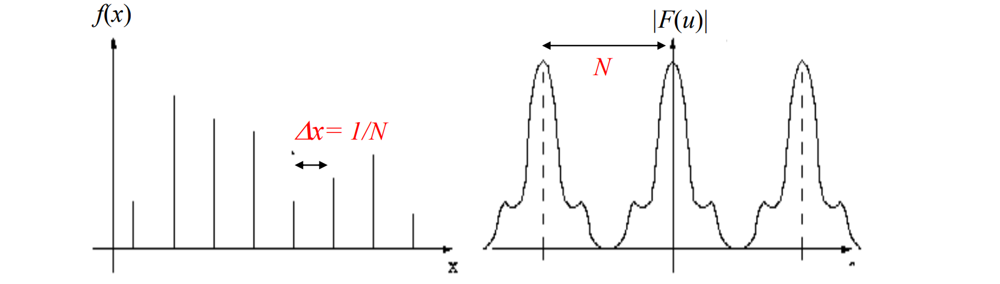

È chiaro dunque che il passo di campionamento che utilizziamo ha una certa importanza; se il passo di campionamento è ***troppo alto*** *(bassa frequenza di campionamento)*, le repliche dello spettro finiranno per sovrapporsi per via del ***periodo più breve*** *(passo di campionamento e periodo sono inversamente proporzionali)* e non sarà più possibile risalire al segnale di partenza poiché le frequenze più alte si *'mescolano'* con quelle delle altre repliche, andando a finire nella parte delle frequenze più basse *(proprio come abbiamo osservato prima col segnale rosso)*.

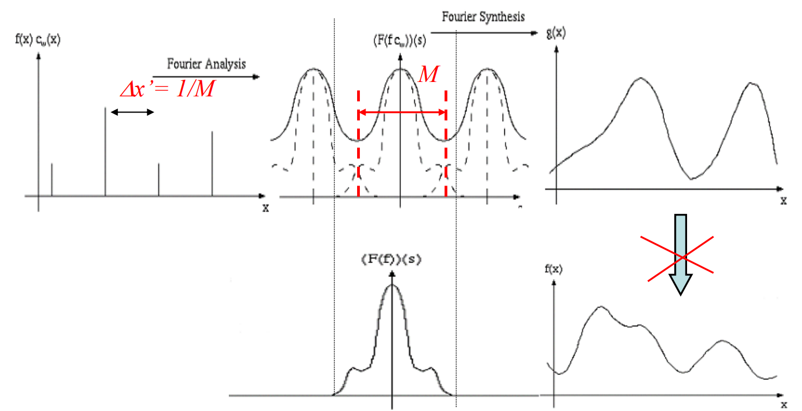

**TEOREMA DI SHANNON**
Abbiamo quindi visto che la frequenza di campionamento *controlla* la possibilità di ricostruire o meno il segnale originale, ma qual è allora la frequenza minima che lo permette?

Il teorema di Shannon dice che, data la frequenza massima del segnale $f_{max}$ *(o frequenza di Nyquist)*, la frequenza di campionamento deve essere $F_s = \frac{1}{\Delta x} > 2 f_{max}$. Questo risulta chiaro perché se non vogliamo sovrapposizioni, dobbiamo coprire tutta l'area del segnale trasformato che va quindi da $-f_{max}$ a $+f_{max}$.

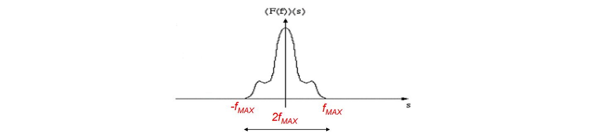

Quindi, più è grande la frequenza massima, tanto più piccolo è il passo di campionamento.
Ma se la frequenza massima è troppo alta *(o perché tendente ad infinito o perché troppo alta per le nostre risorse)*?
Un primo approccio potrebbe essere quello di campionare con la massima frequenza di campionamento disponibile, pur rischiando di avere delle sovrapposizioni, introducendo del rumore che però non è sotto il nostro controllo *(aliasing)*.
Un'alternativa è un preventivo filtraggio passabasso, in modo da limitare la frequenza massima e permettere una frequenza di campionamento minore, soluzione che generalmente viene scelta poiché in natura i segnali non sono solitamente limitati in frequenze, ma solo nel tempo/spazio.

**ALIASING**
Se il campionamento avviene con una frequenza inferiore a quella di Nyquist, c'è *'equivocazione'* del segnale; il segnale originale non è più ricostruibile ed il risultato è un segnale a frequenza più bassa.

**SEGNALE SINUSOIDALE A TEMPO DISCRETO**
Quando campioniamo un segnale, la variabile tempo/spazio non è più esplicita e, senza informazioni su di essa, quindi senza sapere la ***frequenza di campionamento***, il segnale trasformato potrebbe essere stato generato da potenzialmente infiniti segnali originari per via dell'effetto dell'aliasing.

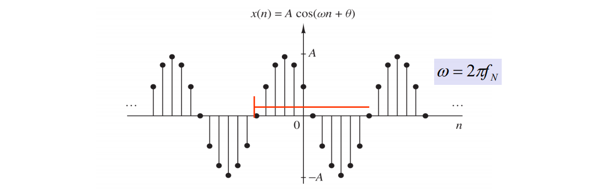

Sappiamo che, nel dominio continuo, misuriamo un segnale in Hz, più specificamente in ***cicli/secondo***, tuttavia quando discretizziamo il nostro segnale è sempre misurato in Hz, ma questa volta si tratta di ***cicli/campione***, poiché passiamo dalla variabile continua tempo ai campioni.
Un'altra frequenza che indichiamo con gli Hz è la frequenza di campionamento, che a sua volta significa ***campioni/secondo***.

Quindi ricapitolando:

- Segnale analogico nel tempo: ***cicli/secondo***
- Segnale discretizzato: ***cicli/campione***
- Frequenza di campionamento: ***campioni/secondo***

Quindi, la $f_N$ *(**frequenza normalizzata**)* del grafico è l'equivalente della frequenza *cicli/secondo* del segnale analogico, ma non essendo più esplicita la variabile temporale nel mondo discreto, questa viene letta come *cicli/campione*. In particolare, possiamo osservare nel grafico che un ciclo viene effettuato in 12 campioni *(l'ultimo non viene contato poiché è uguale al primo)*, quindi $f_N = \frac{1}{12}$.

Sapendo il valore della $f_N$, sappiamo anche che la pulsazione del segnale è $\omega = 2\pi \frac{1}{12} = \frac{\pi}{6}$.
Sapendo inoltre che il segnale originale è un coseno, possiamo notare che è sfasato di due campioni; quindi lo sfasamento $\Theta$ era $2\pi : 12 = \Theta : 2 \implies \Theta = \frac{\pi}{3}$ poiché un intero ciclo equivale a $2\pi$ e siamo interessati a sapere quanto di $\pi$ ricoprono 2 campioni.

Supponiamo ora di conoscere la frequenza di campionamento $f_c = 1 \space campione/sec$.
La frequenza del segnale originale sarà allora $f = f_c * f_N = 1 \space campione/sec * 1/12 \space ciclo/campione$.
Questo risulta chiaro se consideriamo le unità di misura: il risultato dell'operazione fatta avrà come unità *ciclo/sec*.

Notiamo che la frequenza minima di una sinusoide a tempo discreto è zero e corrisponde ad una costante, mentre la frequenza massima è 1/2, ovvero ad un ciclo ogni 2 campioni.

Quindi, in termini di frequenze normalizzate, un segnale sinusoidale discreto può assumere frequenze che variano da -1/2 a 1/2. Se $f_N$ esce da questo intervallo, abbiamo, nuovamente, un effetto di aliasing.

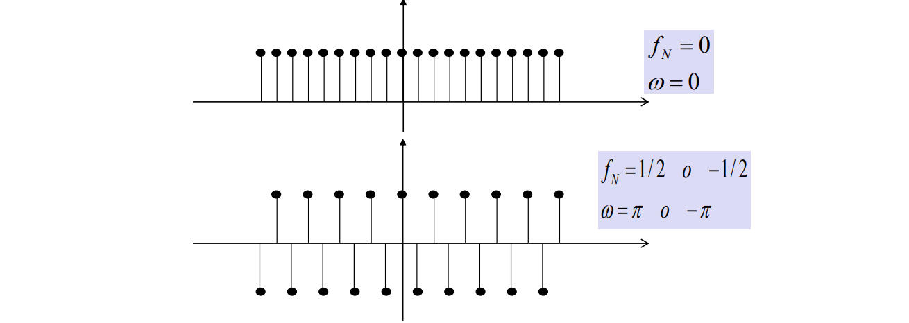

**PROPRIETÀ SENGALI SINUSOIDALI A TEMPO DISCRETO**

- **PROPRIETÀ 1**: Segnali sinusoidali a tempo discreto con pulsazioni separate da multipli di $2\pi$ sono identici.
  $\cos((\omega+ k2\pi)n + \Theta) = \cos(\omega n + \Theta) \implies \cos(\omega n +kn2\pi + \Theta) = \cos(\omega n + \Theta)$
  Ricordiamo che $\cos(k 2\pi)$ è sempre 1, ovvero il coseno traslato di un multiplo di $2\pi$ equivale al coseno non traslato.
- **PROPRIETÀ 2**: Il segnale è periodico solo se la sua frequenza $f$ è un numero razionale.
  Imponiamo la periodicità al nostro segnale di partenza: $x(n+N) = x(n)$
  Sostituiamo col coseno: $\cos(2\pi f(n+N)+ \Theta) = \cos(2\pi fn + \Theta)$
  Affinché l'equazione di sopra sia soddisfatta dobbiamo avere $2\pi fN = 2 \pi k$, ovvero $f = \frac{k}{N}$.

## CONVOLUZIONE

La convoluzione è un operatore che descrive tutti i filtraggi di tipo lineare.
Rappresenta l'applicazione ad una funzione $f$ di una funzione $g$ chiamata *filtro* *(o filter kernel)*. 

Osserviamo la formula: $g * f = \int\limits_{s = -\infty}^{\infty} g(x-s) f(s) \space ds$

Notiamo che è una somma e che la funzione $g$ è stata ribaltata *(difatti il suo argomento è $-s$)* e traslata di $x$ *(che il punto nel quale stiamo calcolando il valore)*.
La funzione $g$ viene poi fatta traslare da $-\infty$ a $+\infty$ e per ogni traslazione si calcola il prodotto tra il segnale traslato e quello non traslato, infine si calcola l'area di tale prodotto.

Nel mondo discreto la convoluzione è definita come $g(x) = \sum\limits_{m} f(m)h(x-m)$.

**TEOREMA DELLA CONVOLUZIONE**
La trasformata della convoluzione di due funzioni è il prodotto delle trasformate delle due funzioni.

$G(u) = F[g(x)] = F[f(x) * h(x)] = F(u)H(u)$.

Questo implica che ogni volta che osserviamo un segnale in una certa finestra, lo stiamo quindi moltiplicando per una funzione rettangolo, la trasformata che osserviamo è la trasformata del segnale originario ***convoluta*** con la trasformata della finestra *(il **Sinc**)*.

## QUANTIZZAZIONE

Ricordiamo la pipeline che segue il segnale per essere convertito da analogico a digitale.

- **CAMPIONAMENTO**: genera, a partire da un segnale analogico $x_a(t)$, un segnale <u>a tempo discreto</u>.
  I segnali a tempo discreto possono essere riconvertiti in segnali analogici attraverso un'operazione detta ***interpolazione***.
- **QUANTIZZAZIONE**: i segnali a tempo discreto sono convertiti in <u>segnali a tempo **e a valore** discreti</u>.
  Ciascuno di questi valori appartiene ad un **set limitato** di possibili valori *(livelli)* ed il segnale è detto **digitale**.
- **CODIFICA**: ciascun valore quantizzato viene espresso attraverso una sequenza di $b$ bit.

La quantizzazione quindi è un'operazione che esprime un campione reale, che quindi avrebbe bisogno di un numero infinito di bit per essere completamente rappresentato, su un **numero finito** di bit detto ***risoluzione***.
A differenza del campionamento, che abbiamo visto essere un'operazione reversibile a patto di rispettare il teorema di Shanon, la quantizzazione introduce **sempre** un errore non recuperabile, quindi è un processo irreversibile.

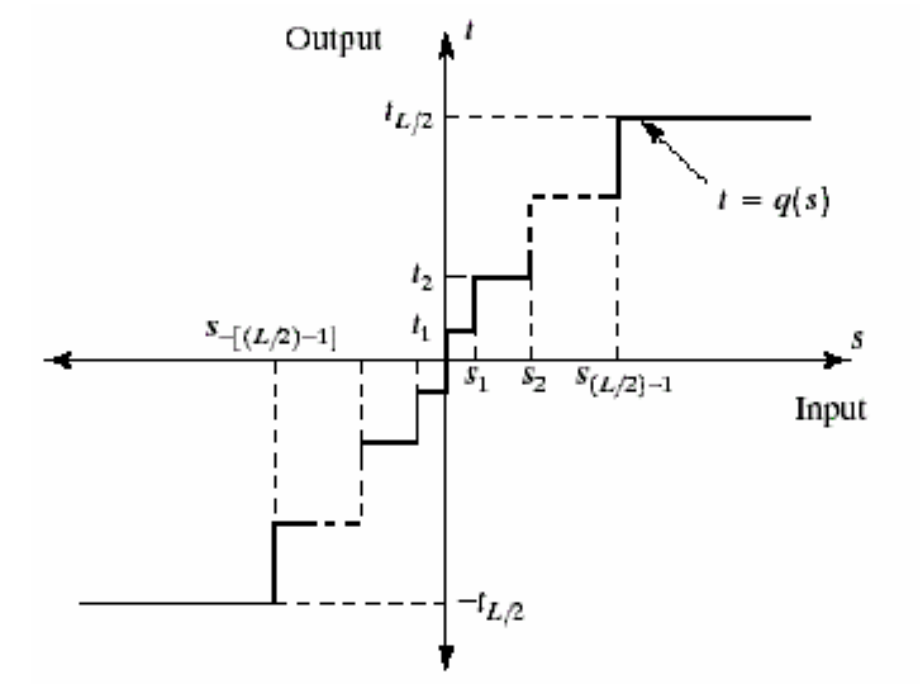La quantizzazione è un processo di discretizzazione di ampiezza ed il quantizzatore viene rappresentato da  una curva a gradini *(non lineare)* che associa a tutti i valori di input che appartengono ad uno degli intervalli su cui sono definiti i gradini il valore del gradino stesso.

Sull'asse orizzontale abbiamo tutti i possibili valori dell'input *(ad esempio da $-\infty$ a $+\infty$)*, mentre sull'asse verticale l'output della quantizzazione.

L'esempio sopra riportato rappresenta un quantizzatore non uniforme, in quanto i livelli hanno distanza diversa fra loro, mentre se fossero ugualmente distribuiti rispetto all'asse delle ascisse si tratterebbe di un quantizzatore uniforme.

In un quantizzatore uniforme, data la dinamica $[-V, V]$ del quantizzatore che contiene il segnale, abbiamo due parametri da stabilire: il numero di bit $n$ che stabilisce la sua risoluzione e quindi il **numero di livelli** $L = 2^n$ e l'**ampiezza di ogni intervallo** $\Delta = 2V/L$ *(passo di quantizzazione)*.
Ragionando al limite, se il numero di bit a nostra disposizione fosse infinito, la curva caratteristica del quantizzatore sarebbe una retta; quanto più ci spostiamo da questa diagonale ideale, tanto più rumore introduciamo nel segnale quantizzato.

**SATURAZIONE**
Un quantizzatore è caratterizzato da una dinamica di ingresso, ovvero dal massimo range di valori ammissibili *(ad es. $[-V, V]$)*; se il nostro segnale va oltre questa dinamica va trattato con delle strategie.
Le principali strategie sono:

- La **saturazione** che assegna al segnale il valore massimo della dinamica $V$ o $-V$ a seconda se il segnale supera il limite superiore o inferiore.
- La **saturazione con azzeramento** che invece assegna un specifico valore *(ad esempio 0)* dove il segnale supera i limiti.

**RANGE DINAMICO DI UN QUANTIZZATORE**
Un quantizzatore è caratterizzato anche dalla sua risoluzione *(n bit)* e dal passo di quantizzazione $\Delta$.
L'intervallo di valori che può coprire *(dinamica)* è allora dato da $D_q = \Delta L = \Delta 2^n$.

Il **range dinamico** di un quantizzatore rappresenta il rapporto fra il numero minimo e massimo di valori rappresentabili.
Dipende quindi dalla risoluzione *($n$ bit)*, quindi da quanti livelli $L = 2^n$ ammette il quantizzatore.
Il range dinamico *(in dB)* è definito come $20 \log_{10} L$.

Ad esempio se la risoluzione è 16 bit, il range dinamico è $20 \log_{10} 2^{16} \approx 96 \space  dB$.

**ERRORE DI QUANTIZZAZIONE**
Si definisce errore *(o rumore)* di quantizzazione la differenza fra il valore quantizzato ed il valore reale del campione $\epsilon_q(n) = x_q(n) -x(n)$.
In generale quanto quantizziamo possiamo usare una strategia di **approssimazione** o una di **troncamento**; tutta via quella di approssimazione introduce meno errore.

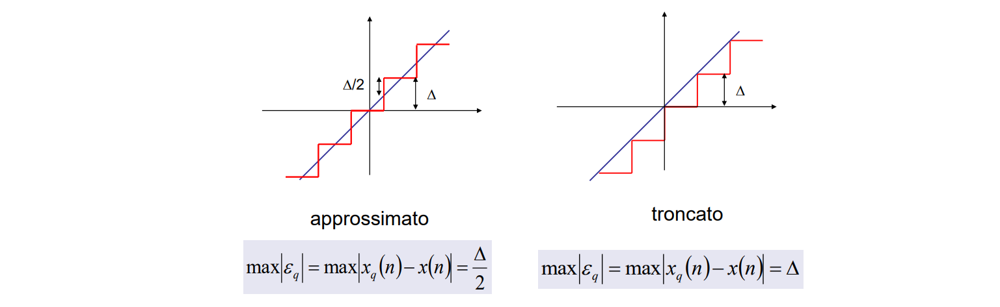

La **qualità** del segnale quantizzato si esprime come rapporto della potenza media del segnale a tempo discreto $P_S$ e la potenza media dell'errore di quantizzazione $P_N$ tramite quello che viene chiamato il rapporto segnale/rumore $SNR_Q = 10 \log_{10} P_S/P_N$ che ha come unità di misura il dB.

$P_N = \frac{1}{N}\sum\limits_{n=0}^{N-1}|\epsilon_q(n)|^2$																									$P_S = \frac{1}{N}\sum\limits_{n=0}^{N-1}|x(n)|^2$

Ricordiamo che la potenza è una media del quadrato dell'ampiezza del segnale.

**DEFINIAMO L'ERRORE**
Per segnali con ampiezza nella dinamica del quantizzatore, l'errore di quantizzazione $\epsilon$ è associato alla strategia di quantizzazione ed in particolare è una variabile casuale che ha una **distribuzione uniforme** tra $-\Delta/2$ e $\Delta/2$ con valor medio nullo.

Sapendo che la potenza del rumore di quantizzazione equivale alla varianza della variabile casuale $\epsilon$, possiamo dire che

$P_N = \sigma_\epsilon^2 = \int\limits_{-\Delta/2}^{\Delta/2} (\epsilon - \mu)^2 f(\epsilon) \space d\epsilon$	ma sapendo che il valor medio è nullo possiamo semplificare

$P_N = \int\limits_{-\Delta/2}^{\Delta/2} \epsilon^2 f(\epsilon) \space d\epsilon$ ma sappiamo che $f(\epsilon)$ è costante, quindi $P_N = \int\limits_{-\Delta/2}^{\Delta/2} \epsilon^2 \frac{1}{\Delta} \space d\epsilon = \frac{1}{\Delta} \frac{\epsilon^3}{3}|_{-\Delta/2}^{+\Delta/2}$

Valutando l'integrale fra $\Delta/2$ e $-\Delta/2$ abbiamo quindi $P_N = \frac{1}{\Delta}[\frac{\Delta^3/8}{3} - \frac{-\Delta^3/8}{3}] = \frac{\Delta^2}{12}$.

Notiamo che la potenza del rumore dipende da $\Delta$, il passo di quantizzazione, che è definito in base al numero di bit che abbiamo a disposizione; meno bit abbiamo, maggiore è $\Delta$ e quindi maggiore è la potenza del rumore.

**DEFINIAMO IL SEGNALE**
Consideriamo un segnale sinusoidale analogico $x_a(t) = A\cos (\omega_0 t)$ e calcoliamone la potenza

$P_S = \frac{1}{T} \int\limits_{0}^{T} |x_a(t)|^2 \space dt = \frac{1}{T} \int\limits_{0}^{T}|A \cos (\omega_0 t)|^2 \space dt = \frac{A^2}{2}$

L'effetto di fare il modulo quadro del nostro segnale è quello di renderlo tutto positivo e con ampiezza quadratica $A^2$; è chiaro a questo punto che la media sul periodo del segnale dell'ampiezza quadratica è $A^2/2$.

Analogamente se il segnale fosse campionato $P_S = \frac{1}{N}\sum\limits_{n=0}^{N-1} |x(n)|^2$

**DEFINIAMO IL SNR**
$SNR_Q = 10 \log_{10} \frac{P_S}{P_N} = 10 \log_{10} \frac{A^2/2}{\Delta^2/12}$.

Avremo potuto definire il SNR anche come $20 \log_{10} \frac{\sqrt P_S}{D_q} + 20 \log_{10} 2^b = 20 \log_{10} \frac{\sqrt P_S}{D_q} + 6.02b$
dove $\sqrt P_S$ è l'ampiezza del segnale e $b$ è il numero di bit; notiamo che il rapporto segnale rumore dipende da questo numero linearmente, in particolare ogni bit aggiuntivo lo fa aumentare di circa 6 dB, che si traduce in un raddoppiamento dell'intensità del segnale rispetto all'intensità del rumore.
Notiamo inoltre che definiremo un quantizzatore **ottimo** quando il rapporto $\sqrt P_S / D_q$ è 1, ovvero quando la dinamica del quantizzatore è tale da contenere tutto il segnale senza sprecare livelli.

**SNRq OTTIMO**
La condizione ideale ***(quando non saturiamo, perché se saturassimo il rumore avrebbe una distribuzione differente!)*** quindi si ha quando le dinamiche del segnale e del quantizzatore sono uguali, ovvero quando $D_s = D_q$.

Sappiamo che un segnale sinusoidale ha $D_s = 2A$.
Se il quantizzatore ha $b$ bit

- Il numero dei livelli del quantizzatore è $L = 2^b$.
- Il passo di quantizzazione è $\Delta = D_q / L = D_s/L = 2A/2^b$.

Riprendendo i calcoli di prima avremo a questo punto $P_N = \Delta^2/12 = \frac{A^2/3}{2^{2b}}$.

Quindi $SNR_Q = 10 \log_{10} \frac{P_S}{P_N} = 10 \log_{10} \frac{A^2/2}{A^2/3 /2^{2b}}$

Semplificando $A^2$ otteniamo $SNR_Q = 10 \log_{10} 2^{2b} \frac{3}{2} = 10 \log_{10} \frac{3}{2} + 10 \log_{10} 2^{2b} = 1.76 + 2b \space 10 \log_{10} 2 = 1.76 + 6.02b$.

Notiamo nuovamente il $6.02b$.

Si può dimostrare che per un insieme più ampio di segnali che si distribuiscono sull'intero range dinamico del quantizzatore si ha $SNR_Q = 1.25 + 6.02b$.

## SISTEMI 

Un sistema fisico è un apparato che, ricevendo in ingresso un segnale, dà in uscita un nuovo segnale.
Quindi un sistema è un *processo* per il quale esiste una relazione *ingresso/uscita* *(I/O)* o *causa-effetto*.

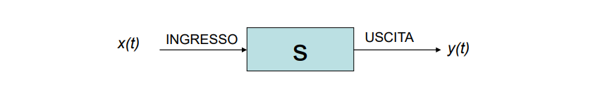

$y(t) = S[x(t)]$					$y(t)$ è la risposta del sistema $S$ all'ingresso $x(t)$.

**ESEMPI DI SISTEMI**

- Il campionatore di periodo $\tau$ è un sistema; esso trasforma il segnale a tempo continuo $f(t)$ nel segnale a tempo discreto $f(n\tau)$.
- Anche il quantizzatore è un sistema che associa al segnale $f(t)$ il segnale $Q[f(t)]$; ovvero riceve in ingresso un segnale continuo e restituisce un segnale a valori finiti.

I sistemi possono avere più ingressi e/o uscite, non necessariamente della stessa cardinalità.
Ad esempio il sistema **somma** riceve in ingresso due segnali e ne restituisce la somma.

**SISTEMI COMPLESSI**
I sistemi *complessi* sono dei sistemi composti da più sistemi *semplici*, che possono essere composti

- ***sequenzialmente*** *(o in cascata)*: dati due sistemi $S_1 : F_1 \rightarrow F_2$ e $S_2 : F_2 \rightarrow F_3$, la loro composizione sequenziale è il sistema $S_3 : F_1 \rightarrow F_3$.
  Un esempio è il convertitore da analogico a digitale che compone in cascata i sistemi campionatore e quantizzatore. Notiamo che è necessaria una coerenza tra gli spazi delle variabili: lo spazio di uscita di $S_1$ deve essere lo stesso di entrata di $S_2$.

  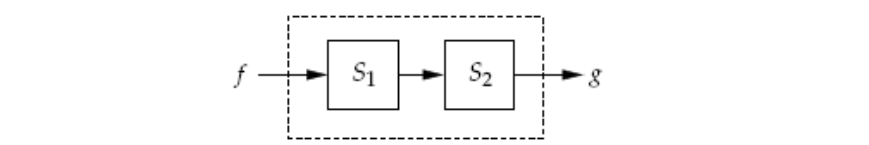

- ***parallelamente***: dati due sistemi $S_1 : F_1 \rightarrow F_2$ e $S_2 : F_1 \rightarrow F_2$, la loro composizione parallela è il sistea che ha come risposta la somma delle risposte di $S_1$ ed $S_2$.
  Purché si possa definire la composizione parallela, in particolare per eseguire la somma finale, il dominio dei sistemi deve essere lo stesso.

  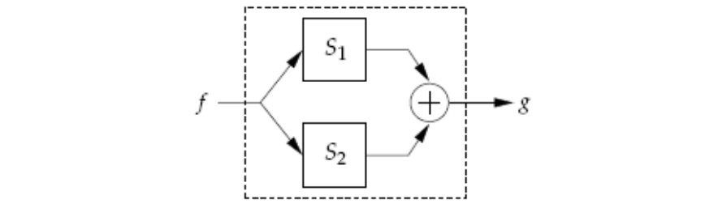

- in ***retroazione***: dati due sistemi $S_1 : F_1 \rightarrow F_2$ e $S_2 : F_2 \rightarrow F_1$, il sistema ottenuto per retroazione è il sistema $S_3$ che ha ingresso $f$ ed uscita $g$ ottenuta ponendo in ingresso ad $S_1$ la differenza tra $f$ e la risposta di $S_2$ a $g$.
  Da notare che lo spazio di uscita di $S_2$ è lo stesso spazio che ha $S_1$ in ingresso, altrimenti non si potrebbe eseguire la somma.
  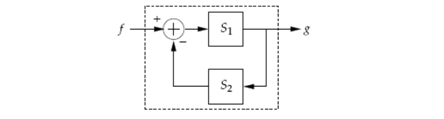

Un sistema complesso si studia a partire dalle sue *componenti elementari*.

**SISTEMI A TEMPO DISCRETO**
Un sistema a **tempo discreto** è un dispositivo che trasforma un sequenza $x(n)$ in ingresso in una sequenza $y(n)$ in uscita attraverso un operatore $L[\cdot]$.

**ESEMPIO**
Dato il segnale **bilatero** *(definito sia per valori positivi che negativi)* di input $\begin{cases} |n| & -3 \leq n \leq 3 \\ 0 & altrimenti \end{cases}$

I segnali di output per le seguenti relazioni I/O sono:

- $y(n) = x(n)$ *(relazione identità)*								$y(n) = \{..., \space 0, 0, 3,2,1,\underline{0},1,2,3, 0, 0 \space ...\}$
- $y(n) = x(n+1)$														$y(n) =  \{..., \space 0,3,2,1,0, \underline1, 2,3, 0, 0, 0 \space ...\}$
- $y(n) = x(n-1)$														$$y(n) = \{..., \space 0, 0, 0,3,2,\underline{1},0,1,2, 3, 0 \space ...\}$$
- $y(n) = mediana[x(n+1); x(n); x(n-1)]$		$y(n) =  \{..., \space 0,0,2,2,1, \underline1, 1, 2,2, 0, 0 \space ...\}$

**SISTEMI LINEARI**
Un sistema è lineare quando la relazione I/O soddisfa il **principio di sovrapposizione degli effetti**.
Dato il segnale in ingresso
$x(n) = \alpha_1 x_1(n) + \alpha_2 x_2(n)$
che può quindi essere espresso come combinazione lineare di altri segnali $x_1$, $x_2$, la risposta è una combinazione lineare delle risposte del sistema ai singoli ingressi $L[x(n)] = L[\alpha_1 x_1(n) + \alpha_2 x_2(n)] = \alpha_1 L[x_1(n)] + \alpha_2 L[x_2(n)]$.

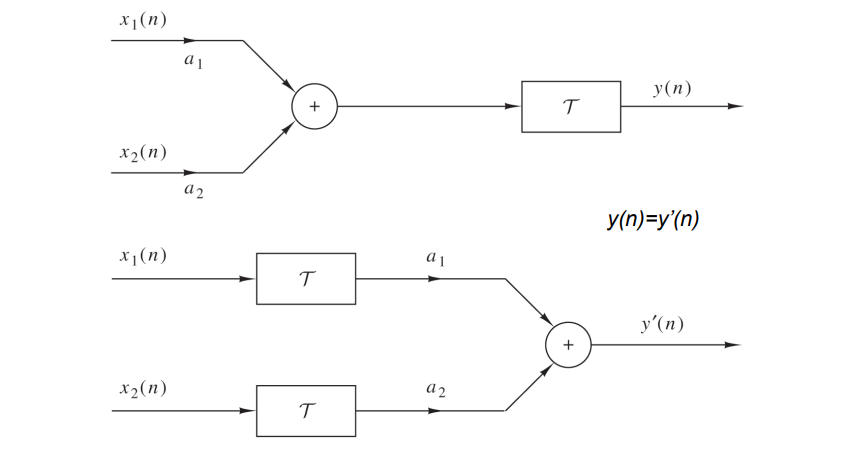Il vantaggio dei sistemi lineari è che permette di scomporre un'operazione molto complicata in termini più semplici.

**SISTEMI A TEMPO INVARIATO O STAZIONARI**
Un sistema è a tempo invariato se la relazione I/O produce un segnale d'uscita $y(n)$ che dipende solo dalla ***forma del segnale*** d'ingresso $x(n)$.

Questo significa che se l'ingresso del sistema è ritardato *(o anticipato)* di una quantità $n_0$, anche la risposta sarà ritardata *(o anticipata)* di $n_0$.

**SISTEMI CAUSALI**
Un sistema causale è un sistema in cui la risposta corrente $y(n)$ non dipende dai valori futuri d'ingresso, cioè da termini del tipo $x(n + n_0)$ con $n_0 > 0$.
Un sistema, per essere fisicamente realizzabile, deve essere causale.

**SISTEMI ANTICAUSALI**
Un sistema causale è un sistema in cui la risposta corrente $y(n)$ non dipende dai valori passati d'ingresso, cioè da termini del tipo $x(n - n_0)$ con $n_0 > 0$.

**ESEMPI**
Il sistema descritto dalla relazione $y(n) = x(n^4)\cos(2\pi f_0 n)$
non è causale, poiché la sequenza di uscita $y(n)$ richiede la conoscenza di $x(n^4)$ *(valore futuro)*

Il sistema descritto dalla relazione $y(n) = x(n) - x(n- n_0)$
è causale, in quanto la risposta dipende solo dal valore corrente $x(n)$ e da un valore $x(n- n_0)$ passato.

**SISTEMI CON MEMORIA**
Sono i sistemi per i quali la risposta corrente $y(n)$ dipende dai valori di ingresso negli istanti di tempo precedenti a quello corrente $n$.
Se la risposta dipende solo dal valore d'ingresso nel medesimo istante $n$, il sistema si dice **senza memoria** o **statico**.

$y(n) = 3x(n-4)$ ha memoria pari a 4
$y(n) = 2x(n) - 3x(n-1)$ ha memoria pari a 1
$y(n) = x(n)$ non ha memoria

**SISTEMI PASSIVI**
Un sistema a tempo discreto è detto passivo se ad un ingresso $x(n)$ con **energia finita** $E_x$ risponde con un segnale $y(n)$ con energia $E_y \leq E_x < \infty$.
In altri termini, deve essere verificata $\sum\limits_{n = -\infty}^{+ \infty}|y(n)|^2 \leq \sum\limits_{n = -\infty}^{+ \infty} |x(n)|^2 < \infty$.
Se tale relazione è verificata col segno di uguaglianza, allora il sistema è detto **senza perdite**, in quanto conserva l'energia del segnale di ingresso.

## SISTEMI LTI

Un sistema LTI *(**Linear Time Invariant**)* è un sistema per il quale la relazione I/O soddisfa contemporaneamente le proprietà di **linearità** e **stazionarietà**.

I sistemi LTI possono essere descritti in tre modi differenti:

1. Relazione I/O *(descrive anche qualsiasi altro sistema)*
2. Equazione lineare alle differenze a coefficienti costanti *(descrive solo sistemi LTI causali)*
3. Risposta all'impulso *(dominio del tempo e dominio delle frequenze)* *(descrive solo sistemi LTI)*

**EQUAZIONE LINEARE ALLE DIFFERENZE A COEFFICIENTI COSTANTI**
Il comportamento di un sistema LTI **a tempo discreto** e **casuale** può essere descritto da
$y(n) = -a_1 y(n-1) - a_2 y(n-2) - ... - a_{_M} y(n-M) + b_0 x(n) + b_1x(n-1) + ... + b_{_N} x(n-N)$

Sintetizzando:	$y(n) = \sum\limits_{k=0}^{N} b_kx(n-k) - \sum\limits_{j=1}^{M} a_j y(n-j)$

Ovvero l'uscita $y(n)$ dipende sia dai valori che l'ingresso $x(n)$ assume in un arco temporale fino ad $N$ istanti precedenti all'istante $n$, sia dai volti assunti dal segnale di uscita $y(n)$ sino ad $M$ istanti di tempo precedenti all'istante $n$.

I coefficienti $a_1, \space ..., \space a_M$ e $b_1, \space ..., \space b_N$ sono termini costanti, indipendenti dal tempo *(altrimenti il sistema sarebbe non stazionario)*.
Se almeno un coefficiente $a_j$ è diverso da zero, l'equazione alle differenze è detta **ricorsiva**, quindi ha memoria $\infty$.
Se tutti i coefficienti $a_j$ sono nulli l'equazione è non ricorsiva e ha memoria pari ad $N$.

**RISPOSTA ALL'IMPULSO**
Ricordiamo che una sequenza è rappresentabile come somma di funzioni $\delta$ traslate in corrispondenza delle posizioni dei punti campionati e pesate per il valore della sequenza in quel punto
$x(n) = \sum\limits_{i = -\infty}^{+\infty} x(i) \delta(n-i)$

Se ora consideriamo $y(n) = L[\sum\limits_{i=-\infty}^{+\infty}x(i)\delta(n-i)]$
Applicando la definizione di linearità otteniamo $y(n) = \sum\limits_{i=-\infty}^{+\infty}x(i)L[\delta(n-i)]$

Applicando la stazionarietà $y(n) = \sum\limits_{i= -\infty}^{+\infty}x(i)h(n-i)$ otteniamo la definizione di **convoluzione**.
Ciò che abbiamo ottenuto è che la sequenza di output $y(n)$ è uguale alla convoluzione della sequenza di input $x(n)$ per una funzione $h$, detta ***risposta del sistema all'impulso***.

Se il sistema è causale, la risposta all'impulso $h(n)$ è nulla per istanti di tempo $n<0$.

## ANALISI LTI NEL DOMINIO DELLE FREQUENZE

Ipotizziamo adesso che la risposta all'impulso del sistema LTI e la sequenza in ingresso siano entrambi trasformabili mediante la DTFT.
Per il teorema della convoluzione avremmo che $y(n) = x(n) * h(n) \iff Y(f) = X(f)H(f)$.
Utilizzando l'esponenziale complesso $y(n) = x(n) * h(n) \iff Y(e^{j\omega}) = X(e^{j\omega})H(e^{j\omega})$, con $\omega = 2\pi f$.

La funzione ***continua*** $H(e^{j\omega}) = DTFT[h(n)]$ viene detta **risposta in frequenza del sistema LTI** e può essere definita come $H(e^{j\omega}) = Y(e^{j\omega}) / X(e^{j\omega})$ ed è una funzione complessa della variabile $\omega$.
Possiamo quindi scriverla anche in forma polare $H(e^{j\omega}) = \mathfrak{R}(H(e^{j\omega})) + j(H(e^{j\omega})) = |H(e^{j\omega})|e^{j\phi (H(e^{j\omega}))}$

dove il modulo vale $|H(e^{j\omega})| = [\mathfrak{R}(H(e^{j\omega}))^2 + \mathfrak{J}(H(e^{j\omega}))^2]^{1/2}$

e la fase $\phi(H(e^{j\omega})) = tan^{-1} [\frac{\mathfrak{J}(H(e^{j\omega}))}{\mathfrak{R}(H(e^{j\omega}))}]$.

## SISTEMI LTI: FILTRI

Un filtro è un sistema LTI che taglia alcune componenti in frequenza nel segnale di ingresso $x(n)$ e ne lascia quindi passare altre, a seconda di come è specificata la risposta in frequenza.

Esistono diversi tipi di filtri, i più comuni sono:

- **FILTRO *IDEALE* PASSA BASSO**: $|H(e^{j\omega})| = \begin{cases} 1 & |\omega| \leq \omega_t \\ 0 & \omega_t < |\omega| \leq \pi \end{cases}$
  Viene detto ideale per via del suo taglio netto da $0$ a $1$.
  Questo filtro fa passare solo le basse frequenze.
- **FILTRO *IDEALE* PASSA ALTO**: $|H(e^{j\omega})| = \begin{cases} 0 & |\omega| \leq \omega_t \\ 1 & \omega_t < |\omega| \leq \pi \end{cases}$
  Notare che è complementare al passa basso.
  Questo filtro fa passare solo le alte frequenze.
- **FILTRO *IDEALE* PASSA BANDA**: $|H(e^{j\omega})| = \begin{cases} 0 & |\omega| \leq \omega_1 \\ 1 & \omega_1 < |\omega| \leq \omega_2 \\ 0 & \omega_2 < |\omega| \leq \pi \end{cases}$
  Questo filtro fa passare solo un centro range di frequenze *(quelle tra $\omega_1$ e  $\omega_2$)*.
- **FILTRO *IDEALE* ATTENUA BANDA**: $|H(e^{j\omega})| = \begin{cases} 1 & |\omega| \leq \omega_1 \\ 0 & \omega_1 < |\omega| \leq \omega_2 \\ 1 & \omega_2 < |\omega| \leq \pi \end{cases}$
  Questo filtro blocca solo un centro range di frequenze *(quelle tra $\omega_1$ e  $\omega_2$)*.

Sappiamo che la trasformata di una finestra è un **sinc** che, tanto più è ampia la finestra, tanto più è stretto e che è una sequenza che va da $-\infty$ a $+\infty$, ovvero bilatera e quindi fisicamente **NON realizzabile**; per questo motivo i filtri ***ideali*** non sono fisicamente realizzabili.

## CONDIZIONI DI STABILITÀ

I sistemi LTI a tempo discreto devono soddisfare alcune condizioni specifiche al fine di poter essere impiegati in applicazioni specifiche; una di queste condizioni riguarda la ***stabilità***.

La condizione di stabilità più usata è detta **BIBO** ***(Bounded Input Bounded Output)***: un sistema a tempo discreto è detto *BIBO* se e solo se, per ogni ingresso limitato, anche la sequenza in output assume ampiezze limitate.

Una condizione necessaria e sufficiente per garantire la stabilità *BIBO* coinvolge la risposta all'impulso $h(n)$ del sistema LTI.
**TEOREMA**: un sistema LTI discreto è stabile secondo la definizione *BIBO* se e solo se la sua risposta all'impulso $h(n)$ è sommabile in modulo, ovvero se $h_s = \sum\limits_{-\infty}^{+\infty}|h(n)| < \infty$.

Dunque i filtri ideali, oltre a non essere fisicamente realizzabili, non sono nemmeno stabili secondo le condizioni *BIBO*.

## FILTRO REALE

Il filtro ideale presenta solo una ***banda passante*** ed una ***banda proibita*** che sono confinanti e sono separate dalla **frequenza di taglio**. In particolare, $|H|$ è costante sia nella banda passante che in quella proibita.

Un filtro reale presenta ancora una ***banda passante*** ed una ***banda proibita***, ma sono separate da una ***banda di transizione***. Inoltre, nessuna banda ha valori costanti nei filtri reali.

In particolare:

- **BANDA PASSANTE**: $|H(v)|$ non è costante e in particolare presenta delle oscillazioni di ampiezza $\delta_1$.
- **BANDA PROIBITA**: $|H(v)|$ non è costante.
  Un parametro importante è detto ***attenuazione*** = $20 \log_{10} \delta_2 dB$
  con $\delta_2$ = ampiezza della massima oscillazione.
- **BANDA DI TRANSIZIONE**: Tale banda inizia dalla frequenza di taglio $v_c$ e termina alla frequenza di stop $v_s$; la dimensione della banda di transizione dunque è data da $v_s - v_c$.
  La **fq di taglio** generalmente è la frequenza per la quale si ha un guadagno in potenza pari al 50% di quello in banda passante. Se quindi $|H(v_c)|^2 = 1$ in banda passante, $v_c$ è la frequenza tale per cui $|H(v_c)|^2 = 1/2$.
  Corrisponde quindi ad un'attenuazione di 3 dB.

Quindi, i valori che caratterizzano un filtro reale sono la **frequenza di taglio** $v_c$, la **frequenza di stop** $v_s$ e le dimensioni massimi e permesse alle **oscillazioni** $\delta_1$ e $\delta_2$.

## EQUAZIONE ALLE DIFFERENZE IN DETTAGLIO

Abbiamo visto che se abbiamo un sistema possiamo descriverlo in diversi modi.
In particolare, un generico sistema, indipendentemente dalle sue proprietà può essere descritto dalla **relazione I/O**, se introduciamo la *linearità* e la *tempo invarianza* ***(LTI)*** possiamo usare la **risposta all'impulso**, se introduciamo anche la *causalità*, ovvero se il sistema è fisicamente realizzabile, possiamo utilizzare l'**equazione alle differenze** per descrivere il sistema.

Sappiamo che il comportamento di un sistema **LTI** a tempo **discreto** e **causale** può essere descritto anche da equazioni alle differenze a coefficienti costanti

$y(n) = -a_1y(n-1)- \space ... \space -a_My(n-M) + b_0x(n) + \space ... \space + b_nx(n-N)$ 

Abbiamo quindi che l'uscita $y(n)$ dipende sia dai valori che l'ingresso $x(n)$ assume in un arco temporale fino ad $N$ istanti precedenti all'istante $n$, sia dai valori assunti dal segnale di uscita stesso $y(n)$ sino a $M$ istanti di tempo precedenti a $n$.

Possiamo riscrivere l'equazione, mettendo in evidenza la combinazione lineare *(ricordiamo che è un sistema lineare)*, notando che abbiamo sempre campioni ritardati poiché abbiamo sempre $(n - pos)$, come:

 $y(n) = \sum\limits_{k=0}^{N} b_kx(n-k) - \sum\limits_{j=1}^{M} a_jy(n-j)$ dove:

- I coefficienti $a_1, \space ... \space, a_M$ e $b_0, \space ... \space , b_N$ sono termini costanti indipendenti dal tempo *(altrimenti il sistema sarebbe non stazionario)*.
- L'equazione è detta **ricorsiva** se almeno un coefficiente $a_j$ è diverso da zero.
  - Quando il sistema è ricorsivo, dipende, di fatto, da più istanti precedenti all'input e non solo dagli $N$ istanti evidenti nella sommatoria.
  - Quando il sistema **NON** è ricorsivo, dipende solo da un numero finito $N$ di istanti temporali nel passato, quindi possiamo definire una memoria del sistema.
    Se tutti i coefficienti $b_k$ sono zero tranne $b_0$, il sistema è **puramente ricorsivo**.
- $M$ è l'**ordine dell'equazione alle differenze** o **ordine di sistema**.

**SISTEMI RICORSIVI E NON RICORSIVI**
La differenza principale tra sistemi ricorsivi e non è che l'output dei sistemi ricorsivi deve essere calcolato in ordine $y(0), \space ... \space , y(n)$, mentre l'output dei sistemi non ricorsivi può essere calcolato valutando i campioni della sequenza di output in qualsiasi ordine.

## RISPOSTA ALL'IMPULSO - FIR & IIR

Abbiamo visto in passato come il comportamento di un sistema LTI possa essere descritto dalla rispsota del sistema all'impulso tramite la convoluzione.

In generale, abbiamo che $y(n) = x(n) * h(n) = \sum\limits_{i=-\infty}^{+\infty} h(i)x(n-i)$.

Se consideriamo solo i sistemi causali possiamo scrivere $y(n) = x(n) * h(n) = \sum\limits_{i=0}^{+\infty} h(i)x(n-i)$.

In base alla risposta all'impulso i sistemi LTI possono essere suddivisi in due grossi gruppi:

- **FIR** - Finite Impulse Response
  La risposta di un FIR è $h(n) = \begin{cases} \neq 0 & 0\leq n\leq M-1 \\ = 0 & n <0 \land n \geq M \end{cases}$
  La risposta di un sistema FIR ad un generico segnale è quindi **limitata**; ovvero l'output a qualsiasi istante $n$ è semplicemente la somma di una combinazione lineare pesata di $M$ valori più recenti della sequenza di input.
  Il sistema quindi agisce come una **finestra** che vede solo $M$ valori recenti della sequenza di input, ovvero ha **memoria $M$**.

  Possiamo quindi scrivere $y(n) = x(n) * h(n) = \sum\limits_{i=0}^{M-1} h(i)x(n-i)$.

  Notiamo che i sistemi FIR sono sempre realizzabili con **sistemi non ricorsivi**, infatti sono funzione di soli $M$ campioni della sequenza di ingresso pesati per la risposta all'impulso $h(n)$, che per ogni $h(i)$ è costante e non dipende dal tempo.
  Si può infatti subito notare come la formula scritta prima altro non è che un'equazione alle differenze in cui i coefficienti $a_j$ sono nulli ed i coefficienti $b_k$ sono sostituiti da $h(n)$.

- **IIR** - Infinite Impulse Response
  La risposta di un IIR è $h(n) = \begin{cases} \neq 0 & n \geq n_0 \\ =0 & n < n_0 \end{cases}$

  Ovvero la risposta è 0 per tutti i valori della parte anticausale.
  La risposta di un IIR ad un generico sengale dipende da tutti i valori della sequenza di input ed il sistema ha **memoria infinita**. Di conseguenza un sistema IIR non è realizzabile *(computazionalmente)* attraverso la convoluzione poiché richiederebbe infinita memoria, ma può essere risolto con l'equazione alle differenze in modo computazionalmente effeciente.

  Possiamo quindi scrivere $y(n) = x(n) * h(n) = \sum\limits_{i=0}^{+\infty}h(i)x(n-i)$.
  Ora non è più così immediato passare dalla rappresentazione attraverso la convoluzione alla rappresentazione attraverso l'equazione alle differenze poiché non c'é più una corrispondenza diretta tra $h(n)$ ed i coefficienti dell'equazione, poiché essendo $h(n)$ infinito introduce una ricorsione.

## STRUTTURE LTI

**PRIMA FORMA DIRETTA**
Consideriamo la seguente equazione lineare alle differenze a coefficienti costanti del primo ordine $y(n) = -a_1y(n-1) + b_0x(n)+b_1x(n-1)$.

Possiamo rappresentare tale sistema come:

Notiamo la separazione tra i coefficienti, e quindi tra la parte non ricorsiva e ricorsiva che permette di trattare il sistema come due sistemi in cascata.
Se avessimo più ritardi, sia nella parte ricorsiva che in quella non, ci basterebbe aggiungere dei blocchi $z^{-1}$ che li gestiscano.

Questa modalità di rappresentazione si chiama una **Struttura in Prima Forma Diretta** *(Direct Form I)* che presenta di fatto due sottosistemi:

1. Il primo sistema è non ricorsivo $v(n) = +b_0x(n) + b_1x(n-1)$
2. Il secondo sistema è ricorsivo $y(n) = -a_1y(n-1)+v(n)$

**SECONDA FORMA DIRETTA**
Ovviamente, trattandosi di sistemi **lineari**, invertendoli il risultato non cambia.

Notiamo però che, a differenza di prima, la sequenza $\omega(n)$ che entra nel modulo di ritardo della parte ricorsiva è **la stessa** che entra anche nel modulo di ritardo della parte non ricorsiva; questo significa che, invece che avre due moduli di ritardo, possiamo utilizzarne uno solo in condivisione, rendendo il sistema più efficiente in termini di memoria.

Questa viene chiamata **Struttura in Seconda Forma Diretta**
con $\omega(n) = -a_1\omega(n-1)+x(n)$			e			$y(n) = b_0\omega(n) + b_1\omega(n-1)$.

**COMPARAZIONI**
Estendiamo ora il ragionamento fatto al caso di una generica equazione alle differenze di ordine $N$ $y(n) = \sum\limits_{k=0}^{M}b_kx(n-k) - \sum\limits_{j=1}^{N}a_jy(n-j)$.

Per rappresentare tale sistema nella prima forma diretta avremmo bisogno di $N+M$ unità di ritardo e di $N+M+1$ moltiplicazioni, mentre nella seconda forma avremmo un numero di ritardi pari a $\max(N, M)$ ed un numero di moltiplicazioni che è ancora $N+M+1$.

**ESEMPI**
**1**: Scriviamo ora l'equazione alle differenze di un sistema non ricorsivo *(ordine 0)* con memoria 2:
$y(n) = +b_0x(n) + b_1x(n-1) + b_2x(n-2)$			*notiamo che tutti i coefficienti $a_j$ sono zero*

Notiamo che non è altro che un sistema **FIR** che media su tre valori di input; in particolare se volessimo scrivere tale sistema come risposta all'impulso, scriveremmo $y(n) = h(n)*x(n) = h_0x(n) + h_1x(n-1) + h_2x(n-2)$.

Dunque, la **risposta all'impulso** di tale sistema è $h(n) = \{\underline{b_0}, b_1, b_2\}$.
Possiamo rappresentare la risposta all'impulso anche come $b_0 \delta(n) + b_1 \delta(n-1) + b_2 \delta(n-2)$.

Graficamente il sistema può essere rappresentato come

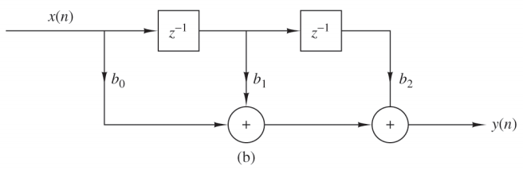

Notiamo che, non essendoci la parte ricorsiva, non possiamo applicare la linearità per invertire le due parti, di conseguenza per questo sistema le rappresentazioni in **prima forma diretta** ed in **seconda forma diretta** ***coincidono***.

**2**: Scriviamo l'equazione alle differenze di un sistema del 2° ordine puramente ricorsivo:
$y(n) = b_0x(n) -a_1y(n-1) - a_2 y(n-2)$
*ricordiamo che $b_0$ è sempre $\neq$ 0 per avere un sistema che risponda ad uno stimolo*.

Essendo il sistema ricorsivo, quindi come memoria infinita, è un sistema **IIR**.
Avendo una risposta infinita dunque non possiamo rappresentare il sistema attraverso la descrizione della risposta all'impulso $h(n)$ come prima *(o per lo meno non in maniera semplice come accade con i sistemi FIR)*.

Graficamente possiamo rappresentare tale sistema come

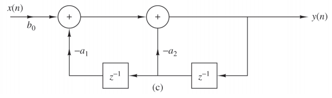

Notiamo che anche in questo caso, non essendoci la parte non ricorsiva, le rappresentazioni in **prima** e **seconda** forma ***coincidono*** nuovamente.

**3**: Vediamo ora il ragionamento inverso; passiamo da questa forma grafica all'equazione alle differenze: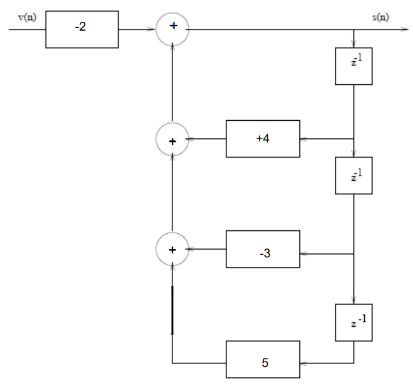

Notiamo subito che il sistema è puramente ricorsivo, non avendo ritardi sulla sequenza di input ed è di ordine 3, avendo 3 ritardi sulla sequenza di output.
Essendo ricorsivo, ovviamente la memoria del sistema è infinita.

A questo punto, estrapolando dal grafico i vari coefficienti possiamo scrivere:
$s(n) = -2v(n) +4s(n-1) -3s(n-2) +5s(n-3)$

**4**: Proviamo ora invece a passare dalla seconda forma alla prima:

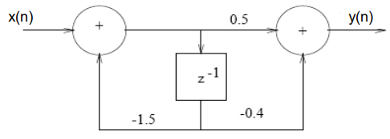Prima di tutto scriviamo l'equazione alle differenze di tale sistema:
$y(n) = 0.5x(n) - 0.4x(n-1) - 1.5y(n-1)$

Notiamo quindi che il sistema è ricorsivo di ordine 1.

A questo punto risulta semplice disegnare la rappresentazione in prima forma diretta.

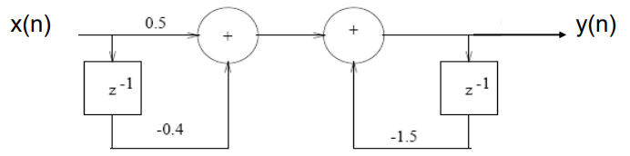

## TRASFORMATA ZETA

La trasformata Zeta rappresenta il caso discreto della **trasformata di Laplace** e permette di studiare i sistemi *LTI*.

In particolare, permette di studiare sistemi lineari per i quali la trasformata di Fourier non è definita; la DTFT difatti, quando esiste, permette per descrivere solo i comportamenti dei sistemi *scarichi*.

La trasformata Zeta permette quindi di analizzare una classe più ampia della DTFT e permette di analizzare sistemi LTI anche in presenza di *condizioni iniziali* non nulle.
Permette inoltre di mettere immediatamente in luce alcune caratteristiche dei sistemi LTI come la ***causalità*** e la ***stabilità***.

**DEFINIZIONE**
Data una sequenza **bilatera** $x(n)$ con $-\infty < n < + \infty$, si dice trasformata zeta:
$X(z) = Z[x(n)] = \sum\limits_{n=-\infty}^{+\infty} x(n)z^{-n}$

La trasformata zeta definisce una relazione biunivoca tra la sequenza $x(n)$ ed una funzione della **variabile complessa** $z$, dove $z$ generalizza il concetto di frequenza al piano complesso e viene indicata con ***pulsazione complessa***; dunque il suo dominio è tutto il piano complesso.

Scritta in termini di modulo e fase $z = \rho e^{j2\pi f} = \rho e^{j\omega}$.

Quindi, la trasformata zeta non è altro che una serie infinita di potenze.
In particolare, $X(z)$ può **convergere** *(avere valore finito)* per *alcuni* valori di $z$, mentre può **divergere** per altri valori.
I valori per i quali la trasformata converge, vengono detti **regione di convergenza** (**ROC**).

Nella ROC, $X(z)$ è una funzione analitica, cioè continua e indefinitamente derivabile con derivate continue in $z$.
**ATTENZIONE**: Ogni volta che parliamo di trasforamta zeta, dobbiamo definire la sua **ROC**.

**CONDIZIONE DI ESISTENZA**
Si può notare che la trasformata zeta contiene anche la trasformata di Fourier esplicitando $z = \rho e^{j2\pi f} = \rho e^{j\omega}$: $\sum\limits_{n=-\infty}^{+\infty}x(n)z^{-n} = \sum\limits_{n=-\infty}^{+\infty}(x(n)\rho ^{-n})e^{-j\omega n} = DTFT(x(n)\rho ^{-n})$

Notiamo che che quando $\rho = 1$, quella sopra non è altro che la DTFT di $x(n)$.

Rircordiamo che la **DTFT** esiste *(ovvero la sommatoria converge)* per le sequenze che godono di una proprietà che stabilisce che esse siano **sommabili in modulo**
$\sum\limits_{n=-\infty}^{+\infty}|x(n)\rho^{-n}| < \infty \implies \sum\limits_{n=-\infty}^{+\infty}|x(n)|\rho^{-n} < \infty$

Notiamo che l'esistenza o meno della trasformata zeta **non** dipende dalla pulsazione $\omega$, ma soltanto dal modulo $\rho$ delle pulsazioni complesse $z$, che rappresenta la **distanza di $z$ dall'origine**; questo siginifica che le regioni di convergenza ROC dipendono da quanto siamo distanti dall'origine del piano, e sono quindi definite come **circonferenze**, luoghi dei punti $z$ a modulo costante.

Possiamo quindi dire che la trasformata di Fourier di una sequenza coincide con la trasformata zeta sulla circonferenza di raggio unitario $\rho = 1$.

Notiamo che per $z=1$ avremmo $e^{j0}$, quindi quando calcoliamo la trasformata zeta per $z=1$, calcoliamo difatti la trasformata di Fourier per la componente continua del segnale *($f = 0$ ovvero $\omega = 0$)*.

**ALCUNE APPLICAZIONI**
**1**: Proviamo ora ad applicare la trasformata zeta all'impulso $x(n) = \delta(n)$.
Ricordando la definizione scriviamo $X(z) = \sum\limits_{n=-\infty}^{+\infty} \delta(n)z^{-n}$
Per le proprietà di $\delta$, la sommatoria sarà diversa da 0 solo quando il suo argomento è nullo, quindi $X(z) = \delta(0)z^{-0} = 1$.
Notiamo che in questo caso, la trasformata converge per ogni valore $z$ del piano.

**2**: Proviamo ora con la sequenza bilatera $x(n) = 2\delta(n+1) + \delta(n) + 4\delta(n-2)$.
La trasformata zeta di tale sequenza sarà
$X(z) = \sum\limits_{n=-\infty}^{+\infty}[2\delta(n+1) + \delta(n) + 4\delta(n-2)]z^{-n} =$ 

$2\sum\limits_{n=-\infty}^{+\infty}\delta(n+1)z^{-n} + \sum\limits_{n=-\infty}^{+\infty}\delta(n)z^{-n} + 4\sum\limits_{n=-\infty}^{+\infty} \delta(n-2)z^{-n} =$

$2z^{1}+1z^{0}+4z^{-2}$

Notiamo che $z^{-n}$ corrisponde ai moduli di ritardo introdotti nelle notazioni grafiche.
Notiamo che la trasformata diverge, nel caso di $z^1$, quando $z = \infty$, mentre per $z^{-2}$, per $z = 0$. Per cui la ROC è definita come $0 < |z| < \infty$.

**3**: Consideriamo ora $x(n) = u(n)$ *(gradino, sequenza causale)*:
**ANALISI: Serie Geometrica**
Ricordiamo che una serie del tipo $\sum\limits_{n=0}^{+\infty}q^n$ viene detta ***serie geometrica***.
In particolare, ricordiamo che tale serie vale $\sum\limits_{n=0}^{+\infty}q^n = \begin{cases} \frac{1-q^{n+1}}{1-q} & se \space -1<q<1 \\ +\infty & se \space q\geq 1 \\ \nexists & se \space q\leq -1  \end{cases}$

Ricordando che quando la serie è infinita $q^{n+1} \to 0$.

La trasformata sarà $X(z) = \sum\limits_{n=-\infty}^{+\infty}u(n)z^{-n} = \sum\limits_{n=0}^{+\infty}z^{-n} = \sum\limits_{n=0}^{+\infty} (z^{-1})^n = \frac{1}{1-z^{-1}}$

Notiamo che passiamo da $-\infty$ a $0$ come limite inferiore della sommatoria, considerando che il gradino unitario ha valore da 0 in poi.
Successivamente mettiamo in evidenza la **ragione $q = z^{-1}$** della **serie geometrica**, in modo da poter scrivere il valore a cui converge tale serie $\frac{1}{1-z^{-1}}$.

Sapendo che la serie geometrica converge solo per $|q| < 1$, possiamo dire che la ROC è definita da $|z^{-1}| <1 \implies |z| > 1$, che corrisponde all'esterno del cerchio unitario.

**4**: Consideriamo $x(n) = -u(-n-1)$, sequenza anticausale e traslata:
La trasformata sarà $X(z) = - \sum\limits_{-\infty}^{+\infty}u(-n-1)z^{-n} = -\sum\limits_{n=-\infty}^{-1}z^{-n} = -\sum\limits_{m=1}^{+\infty}z^m = - (\sum\limits_{m=0}^{+\infty}z^m-1)$

Notiamo che tiriamo fuori dalla sommatoria il $-$ iniziale, per la linearità dell'operatore, e poi trasformiamo il gradino $u(-n-1)$ in una sommatoria da $-\infty$ a $-1$ poiché è invertito e traslato di $-1$; eseguiamo poi un cambio di variabile dalla variabile negativa $-n$ alla variabile positiva $m$ che andrà da 1 a $+\infty$.
A questo punto non ci resta che esplicitare la serie geometrica con la sommatoria da 0 a $+\infty$, sottraendo $z^0 = 1$ ad essa.

La serie a questo punto converge a $1 - \frac{1}{1-z} = -\frac{z}{1-z} = \frac{1}{1-z^{-1}}$, poiché ora la nostra ragione geometrica $q$ è $z$ *(mentre prima era $z^{-1}$)*.

A questo punto possiamo dire che la ROC è definita da $|z| <1$, per via della ragione che è $z$.

Notiamo che la ROC è diversa da quella di prima è questo perché la trasformata zeta definisce una relazione **biunivoca** tra la sequenza $x(n)$ ed una funzione della variabile complessa $z$ che però è **garantita** solo se si specifica la **ROC** di $X(z)$ oltre che l'espressione analitica della trasformata $X(z)$.

Praticamente la biunivocità è definita tra la **sequenza** che abbiamo nel dominio di partenza e i **valori a cui converge** la trasformata zeta oltre che alla **regione di convergenza**.
Negli esempi di prima possiamo notare che se non avessimo fornito anche la ROC, non ci sarebbe più stata la biunivocità poiché il valore di convergenza era lo stesso per le due serie diverse.

### SEQUENZE FINITE

Le sequenze $x(n)$ con supporto finito sono i segnali a tempo discreto che possiedono un numero finito di coefficienti non nulli.
Questo tipo di sequenze ammette sempre una trasformata $X(z)$ esprimibile in forma chiusa come un **polinomio composto da un numero finito** di variabili del tipo $z^k;z^{-k}$ con $k$ intero.

Un esempio di sequenza finita è $X(z) = \sum\limits_{n=-M}^{L} x(n)z^{-n}$

Ricordiamo che la trasformata $X(z)$ converge per qualunque $z$ nel piano complesso, eccetto i punti $z=0$ se esistono termini del tipo $z^{-k}$ con $k>0$ e $z = \infty$ se esistono termini del tipo $z^{+k}$ con $k>0$.

**ESEMPI**
Abbiamo visto prima che la trasformata zeta di $x(n) = \delta(n)$ converge a 1 e la sua ROC è definita $\forall z$.

Se consideriamo invece $x(n) = \delta(n-k)$ con $k>0$ *(causale)*, la trasformata è $z^{-k}$ e la ROC è definita $\forall z$ tranne $z=0$.

Se consideriamo invece $x(n) = \delta(n+k)$ con $k > 0$ *(anticausale)*, la trasformata è $z^k$ e la ROC è definita $\forall z$ tranne $|z| = \infty$.

**CONCLUSIONI**

Possiamo quindi dire che, per i segnali di **durata finita bilateri**, la ROC è l'intero piano complesso zeta tranne i punti 0 e $\infty$.

Per i segnali di **durata finita causali**, la ROC è l'intero piano complesso zeta tranne il punto 0.

Per i segnali di **durata finita anticausali**, la ROC è l'intero piano complesso zeta tranne il punto $\infty$.

## POLI E ZERI

Calcoliamo la trasformata zeta della sequenza finita $x(n) = \alpha^n [u(n) - u(n-N)]$ con $N$ costante intera finita e $\alpha$ costante reale.

$X(z) = \sum\limits_{n=-\infty}^{+\infty} x(n)z^{-n} = \sum\limits_{n=0}^{N-1}\alpha^nz^{-n} = \sum\limits_{n=0}^{N-1}(\alpha z^{-1})^n = \frac{1-\alpha^Nz^{-N}}{1-\alpha z^{-1}}$

Sappiamo per quanto detto prima che $X(z)$ converge in ogni punto del piano complesso eccetto $z=0$.

Definiamo a questo punto:

- **POLI**: Valori che annullano il denominatore.
- **ZERI**: Valori che annullano il numeratore.

Per trovare zeri e poli, dobbiamo inanzittutto raccogliere la **potenza negativa** di $z$ sia dal denominatore che dal numeratore per poi analizzare i polinomi del numeratore e del denominatore.

$X(z) = \frac{1-\alpha^Nz^{-N}}{1-\alpha z^{-1}} = z^{-N} \frac{1}{Z^{-1}} \frac{1z^N - \alpha^N}{z-\alpha} = z^{-N+1}\frac{z^N - \alpha^N}{z-\alpha}$

A questo punto, per trovare i poli consideriamo $z-\alpha$ e notiamo subito che si annulla per $z= \alpha$.

Per trovare gli zeri consideriamo $z^N - \alpha^N$ e notiamo che questo polinomio ha $N$ zeri, ma come possiamo calcolarli?

Proviamo a ragionare graficamente:
Siamo nel piano complesso; notiamo che la soluzione reale è $|z| = \alpha$, che definisce il raggio di una circonferenza sulla quale sono distribuite in modo uniforme le altre soluzioni, che sono in totale $N$.

Notiamo che alcune soluzioni sono reali, altre sono complesse e conniugali *(stessa parte reale ma parte immaginaria di segno opposto)*.

Le soluzioni generalmente sono $z = \alpha e^{j\frac{2\pi}{N}k}$.

In questo caso notiamo che il polo $z = \alpha$ si sovrappone con uno degli zeri, quindi è come se non ci fosse difatto alcun polo e solo $N-1$ zeri.

Notiamo però che il termine raccolto $z^{-N+1} = \frac{1}{z^N-1}$ rappresenta altri $N-1$ poli *(o un polo di ordine N-1)* nella posizione 0.

### SEQUENZE INFINITE

Le sequenze $x(n)$ illimitate sono i segnali a tempo discreto che possiedono un supporto temporale illimitato.

Per le sequenze **causali**, la ROC è del tipo $|z| > d_M$, dove $d_M$ è il modulo del polo più **distante** dall'origine $z= 0$.
L'abbiamo visto per $x(n) = u(n)$.

Per le sequenze **anticausali**, la ROC è del tipo $|z| < d_m$, dove $d_m$ è il modulo del polo più **vicino** all'origine $z=0$.
L'abbiamo visto per $x(n) = -u(-n-1)$.

## TRASFORMATA ZETA RAZIONALE

Nei casi pratici di interesse, $X(z)$ è una funzione razionale di due polinomi: $X(z) = N(z)/D(z)$ dove $N(z)$ e $D(z)$ sono due polinomi nella variabile $z^{-1}$ di grado rispettivamente $p_n$ e $p_d$.

In forma estesa $X(z) = \frac{b_0 + b_1 z^{-1} + \space ... \space + b_{p_n} z^{-p_n}}{a_0 + a_1z^{-1} + \space ... \space +a_{p_d}z^{-p_d}}$
*(Notare la similitudine dei coefficienti con quelli dell'eq. alle differenze)*

Ragioniamo su cosa succede a $H(z)$:

- Se il numeratore si azzera, $H(z) = 0$ negli zeri e negli intorni avrà un valore piccolo essendo una funzione regolare.
- Se il denominatore si azzera, $H(z) = \infty$ e negli intorni dei poli $H(z)$ assumera dei valori molto grandi.

Riscrivendo i polinomi come prodotti di monomi otteniamo: $X(z) = \frac{b_0}{a_0}(z^{p_d-p_n}) \frac{\prod\limits_{i=1}^{p_n} (z - c_i)}{\prod\limits_{i=1}^{p_d} (z-d_i)}$

Dove:

- I coefficienti $c_i$ con $i = 1, \space ..., \space p_n$ sono gli **zeri** non nulli di $X(z)$
- I coefficienti $d_i$ con $i  = 1, \space ..., \space p_d$ sono i **poli** non nulli di $X(z)$

In particolare, ci saranno $p_n - p_d$ **poli** in $z = 0$ se $p_n > p_d$ oppure
$p_d - p_n$ **zeri** in $z = 0$ se $p_d > p_n$.

### ANALISI SISTEMI LTI TRAMITE TRASFORMATA Z

Abbiamo visto che un sistema LTI a tempo discreto può essere descritto da un'equazione lineare alle differenze a coefficienti costanti $y(n) = -a_1y(n-1) - \space ... \space - a_M y(n-M) + b_0x(n) + b_1 x(n-1) \space ... \space + b_N x(n-N)$ 

Se applichiamo la DTFT ad ogni termine *(che equivale ad applicarla a tutti per la linearità)* otteniamo: $Y(e^{j \omega}) = -a_1 Y(e^{j \omega})e^{-j\omega} - \space ... \space  -a_M Y(e^{j \omega})e^{-j\omega M} + b_0X(e^{j \omega}) + b_1X(e^{j\omega})e^{-j\omega} + \space ... \space +b_N X(e^{j\omega})e^{-j\omega N}$

Ricordando che $F(f(x-x_0)) = e^{-j \omega x_0} F(u)$

Se a questo punto, tenendo a mente il teorema della convoluzione, raccogliamo i termini in $Y(e^{j\omega})$ e in $X(e^{j\omega})$ otteniamo:
$Y(e^{j\omega})(1+a_1e^{-j\omega} + \space ... \space + a_M e^{-j\omega M}) = X(e^{j\omega})(b_0 + b_1e^{-j\omega} + \space ... \space + b_Ne^{-j\omega N})$

Sappiamo inoltre che la risposta in frequenza $H(e^{j\omega})$ di un sistema LTI può essere calcolata come:
$H(e^{j\omega}) = \frac{Y(e^{j\omega})}{X(e^{j\omega})} = \frac{(b_0 + b_1e^{-j\omega} + \space ... \space + b_Ne^{-j\omega N})}{(1+a_1e^{-j\omega} + \space ... \space + a_M e^{-j\omega M})}$ 			*notiamo la somiglianza con la trasformata Z*

Ricordando ora la relazione tra la DTFT e la trasformata Z *(in particolare la DTFT è una trasformata Z con $\rho = 1$)* e applicando il teorema della convoluzione otteniamo: $Y(z) = Z[x(n)*h(n)] = X(z)H(z)$

Ricordando che $z = \rho e^{j\omega}$ possiamo scrivere $H(z) = \frac{b_0 + b_1 z^{-1} + \space ... \space + b_{N} z^{-N}}{1 + a_1z^{-1} + \space ... \space +a_{M}z^{-M}}$, che ci fa capire che il nostro sistema è intuibile dalla posizione dei poli e degli zeri.

**FIR**
Ad esempio, un sistema FIR, quindi a risposta finita, non ricorsivo, ricordiamo avere coefficienti $a_j$ nulli dall'equazione alle differenze; la sua risposta in frequenza sarà quindi $H(z) = b_0 + b_1 z^{-1} + \space ... \space + b_{N} z^{-N}$, in linea con quanto visto anche graficamente prima.

**IIR**
Allo stesso modo, un sistema IIR, puramente ricorsivo, sappiamo che ha tutti i coefficienti $b_k$ tranne $b_0$ nulli; la sua risposta in frequenza è quindi $H(z) = \frac{1}{1 + a_1z^{-1} + \space ... \space +a_{M}z^{-M}}$, in linea con quanto visto graficamente.

**CASO GENERALE**
Nel caso generale la risposta in frequenza di un sistema LTI è $H(z) = \frac{b_0 + b_1 z^{-1} + \space ... \space + b_{N} z^{-N}}{1 + a_1z^{-1} + \space ... \space +a_{M}z^{-M}}$

**STABILITÀ BIBO E TRASFORMATA Z**
Per sistemi **causali**, condizione necessaria e sufficiente a garantire la stabilità BIBO è che $H(z)$ abbia tutti i poli contenuti nel cerchio di raggio unitario escluso.
Per sistemi **anticausali** la condizione è che $H(z)$ abbia i poli all'esterno del cerchio unitario escluso.

In sintesi, per avere la stabilità BIBO è necessario che la circonferenza di raggio unitario sia contenuta nella ROC del sistema.

**REALIZZABILITÀ FISICA DI UN SISTEMA LTI**
Un sistema LTI è fisicamente realizzabile se la sua risposta all'impulso $h(n)$ è:

- **CAUSALE**: la ROC di $H(z)$ corrisponde all'esterno di un cerchio di raggio > del polo di $H(z)$ di valore massimo.
- **CON COEFFICIENTI REALI**: quindi, per ogni polo e per ogni zero complesso, deve essere presente anche il rispettivo complesso coniugato.
  I poli e gli zeri sull'asse reale possono essere anche singoli.

**PROGETTAZIONE FILTRI CON POLI E ZERI**

- **POLI**: devono essere posizionati in prossimità del cerchio di raggio unitario *(ma non su di esso, altrimenti il sistema non sarebbe più stabile, in particolare tutti i poli devono cadere all'interno del cerchio di raggio unitario per far si che la risposta sia causale)* nelle pulsazioni complesse $z$ corrispondenti alle componenti armoniche nel segnale d'ingresso $x(n)$ da **enfatizzare**.
- **ZERI**: devono essere posizionati in prossimità delle pulsazioni complesse $z$ corrispondenti alle componenti armoniche nel segnale d'ingresso $x(n)$ da **attenuare**.
  Gli zeri possono essere posizionati in qualunque punto del piano complesso.

## SEGNALI IMMAGINE

Cerchiamo, prima di capire come sono fatti i segnali immagine, come li percepiamo fisicamente e in particolare come percepiamo il **colore**.
**COLORE**: un effetto dell'interazione di un'onda elettromagnetica con il nostro sistema visivo.

Le **onde elettromagnetiche** sono caratterizzate da una ***lunghezza d'onda $\lambda$*** *(che è equivalente a quello che abbiamo chiamato fino ad ora **periodo**)* e da una ***frequenza $\nu$*** che sono inversamente proporzionali $\lambda \propto 1/\nu$.
Inoltre, le onde elettromagnetiche sono anche caratterizzate da un'***intensità***.

**SPETTRO ELETTROMAGNETICO**
La maggior parte dello spettro elettromagnetico è invisibile ai nostri occhi; quello che noi riusciamo a percepire è difatti solo una piccola parte dell'intero spettro. In particolare lo spettro visibile va da **380nm** a **760nm** *(in termini di lunghezza d'onda)*.
Le frequenze più alte appartengono alla **luce ultravioletta**, ai **raggi x** e **gamma**, mentre le frequenze più basse appartengono alle **radiazioni infrarosse**.

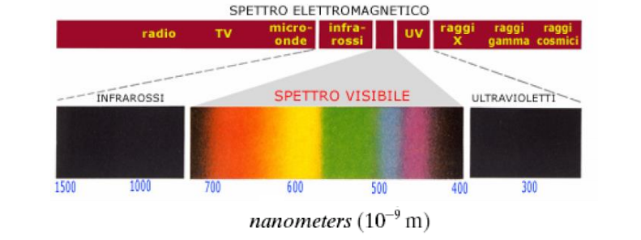

**L'OCCHIO E I SUOI SENSORI**
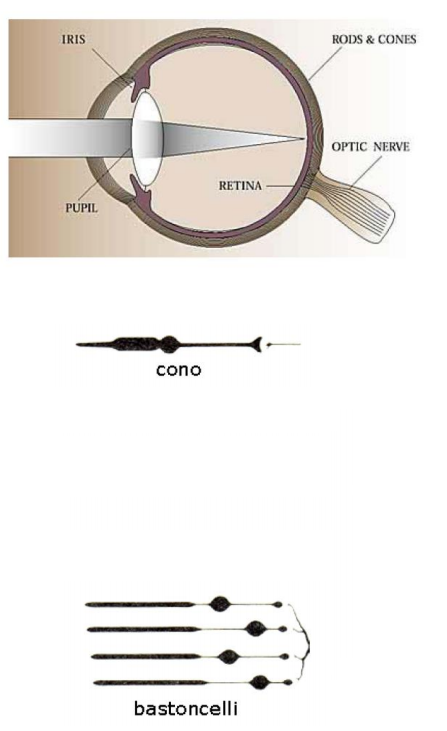

Cerchiamo adesso di capire com'è fatto l'organo sensibile a queste onde elettromagnetiche; c'è una prima parte che si occupa della *focalizzazione* dell'immagine, il **cristallino** che, appunto, focalizza l'immagine sulla **retina** come una lente.
Sulla **retina** sono poi presenti due tipi di strutture che si occupano di percepire effettivamente il segnale:

- **CONI**: Si occupano di produrre un segnale per i livelli di luminosità più alti. Esistono tre tipi di coni, che sia attivano in funzione della lunghezza d'onda del segnale:
  	**L - Long Waves**: Più sensibili al rosso.
  	**M - Middle Waves**: Più sensibili al verde.
  	**S - Short Waves**: Più sensibili al blu.
  I coni si attivano in quella che si chiama **visione fotopica**. Sono più legati quindi al colore.
- **BASTONCELLI**: Si occupano di produrre un segnale quando c'è poca luce. Seppur rispondano a tutte le lunghezze d'onda, rappresentano dei toni di grigio, poiché sono più legati all'intensità dell'immagine *(**visione scotopica**)*.

**FOTORECETTORI**
Abbiamo quindi che **coni** e **bastoncelli** convertono la luce *(onde elettromagnetiche)* in uno stimolo elettrico.
In particolare, nell'occhio sono presenti circa *130 milioni* di bastoncelli e circa *6.5 milioni* di coni; difatti il sistema visivo umano è molto più sensibile alle variazioni di **luminanza** *(intensità)* piuttosto che alle variazioni di **crominanza** *(definita da tinta e saturazione)*.

**RISPOSTA DEI CONI A DIVERSE LUNGHEZZE D'ONDA**

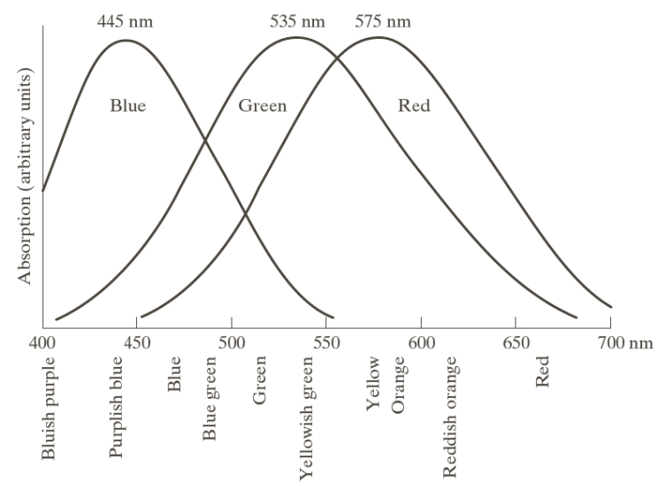Possiamo osservare nel grafico la risposta ai vari colori dei coni. Notiamo che l'occhio è molto più sensibile alla luce nel centro dello spettro visibile.

Solitamente la luce che vediamo non corrisponde ad un'unica lunghezza d'onda, ma ad una combinazione di diverse lunghezze d'onda; ad esempio, in presenza di una radiazione luminosa a 470nm saranno attivati maggiormente i coni del blu, mentre quelli del rosso e del verde saranno poco attivi, facendoci percepire una luce celeste.

**SEGNALI REALI**
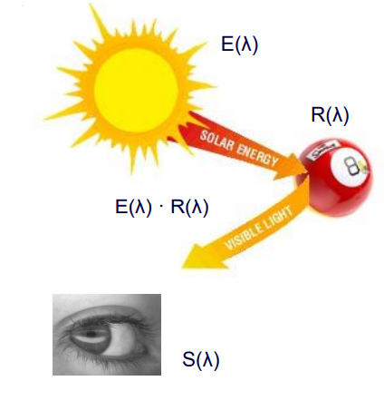Per la creazione di un segnale immagine abbiamo innanzitutto bisogno di una sorgente luminosa, caratterizzata da una sua **emissione in funzione della lunghezza d'onda $E(\lambda)$**, che rappresenta l'ampiezza emessa dalla sorgente in funzione di una certa lunghezza d'onda $\lambda$. 
Successivamente le onde elettromagnetiche emesse dalla sorgente interagiscono con la scena; gli oggetti facenti parte della scena sono anch'essi caratterizzati da una funzione di $\lambda$, ovvero **$R(\lambda)$** *(riflettanza)*, poiché essi assorbono e riflettono le onde elettromagnetiche; a seconda di come assorbono e riflettono il colore percepito sarà differente.
Infine, i nostri recettori assorbono anch'essi una funzione $S(\lambda)$.

La maggior parte delle sorgenti luminose tuttavia produce dei contributi di luce su più lunghezze d'onda, dunque avremmo una risposta nel nostro sistema percettivo per ogni tipo di cono:
$L = \int E(\lambda)R(\lambda)l(\lambda) d\lambda$			$M = \int E(\lambda)R(\lambda)m(\lambda) d\lambda$			$S = \int E(\lambda)R(\lambda)s(\lambda) d\lambda$

Notiamo che essendo tutte e tre le funzioni in $\lambda$, integrando ci rimangono solo degli scalari che rappresentano l'area del prodotto di tali funzioni. Notiamo inoltre che si può evincere dalla formula che a parità di oggetto *(e quindi di $R(\lambda)$)* e a parità di occhio *(e quindi dei coni)*, se cambiamo la sorgente luminosa $E(\lambda)$, otterremmo triplette diverse, ovvero potremmo percepire colori diversi.
Allo stesso modo potremmo avere una coppia $E(\lambda)$ $R(\lambda)$ tale per cui oggetti di colore diverso si percepiscano come dello stesso colore. Questo perché l'integrale è un'area: allo stesso modo nel mondo geometrico potremmo avere un cerchio e un rettangolo con la stessa area.

Avendo quindi solo tre scalari, significa che i coni proiettano la risposta allo stimolo di un oggetto illuminato in uno **spazio a tre dimensioni**, quindi **ogni colore** *(percepito)* può essere descritto da **tre valori**.

**IMPORTANTE**: La proprietà intrinseca di un oggetto è racchiusa in $R(\lambda)$ che ci dice come risponde l'oggetto ad ogni $\lambda$, ammesso che la fonte luminosa riesca a fornire le lunghezze d'onda necessarie all'oggetto per rispondere.

## DALL'OCCHIO ALLA CAMERA DIGITALE

Per poter acquisire delle immagini dunque si deve *emulare* la risposta agli stimoli del nostro sistema percettivo; questo viene fatto utilizzando dei **filtri** che abbiano una risposta al rosso, verde e blu simile a quella dell'occhio umano. Tuttavia, i filtri non riescono a ricreare esattamente la risposta umana e in quel caso si utilizzano delle tecniche di post processing per far apparire l'immagine il più reale possibile.

Inoltre, l'occhio umano compensa automaticamente il colore della luce *(**adattamento cromatico**)*, ovvero riesce a bilanciare i contributi della scena *eliminando* il colore dell'illuminante; questa è una cosa che una camera non può fare in automatico e quindi quando acquisisce la scena si porta dietro l'effetto dominante del colore della luce. Questo effetto viene mitigato con un effetto in post processing chiamato ***white balancing***.

**FILTRI COLORE**
Un'altra cosa che è progettata in base ai nostri sistemi percettivi è la disposizione dei filtri colore; in particolare la quantità di filtri rossi e blu è la metà di quella dei filtri verdi. Questo perché la risposta dei coni sensibili al verde è molto simile alla risposta dei bastoncelli, che abbiamo detto essere molti di più dei coni.

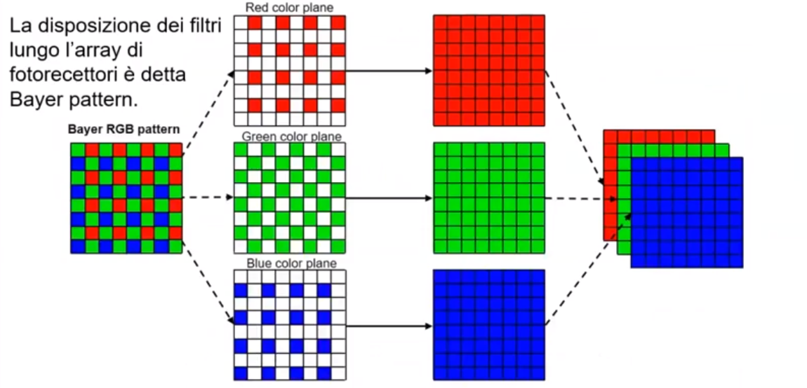

Visto che abbiamo, per ogni posizione, solo un tipo di filtro, per arrivare poi all'immagine finale dobbiamo fare anche un'operazione di **interpolazione**, ovvero dobbiamo *stimare* il valore dei pixel mancanti di un dato canale analizzando quelli vicini ad esso *(per esempio facendone una media)*.

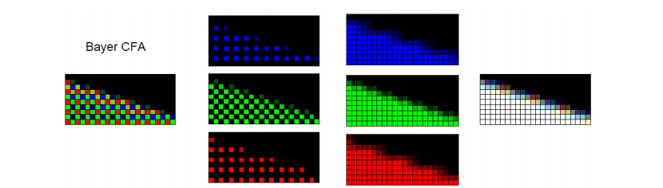Questa operazione a volte porta a degli artefatti *(di tipo cromatico)*, in particolare sui bordi, ovvero in quelle zone dove viene a mancare la ***correlazione*** tra i punti vicini.

**SINTESI**
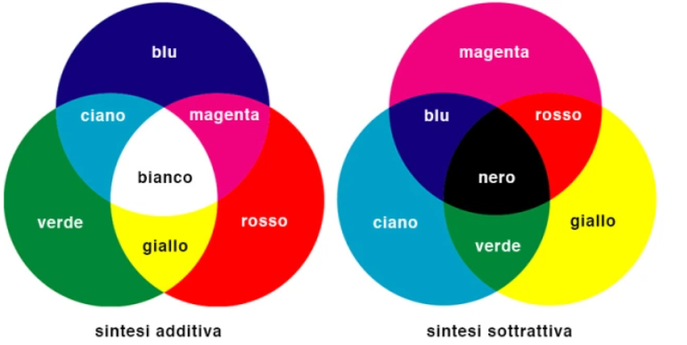Quello che l'occhio *(e le camere)* fanno è chiamata **sintesi additiva**, ovvero sommano i contributi dei tre canali. Esiste anche la **sintesi sottrattiva**, che lavora coi colori complementari rispetto a quelli della sintesi additiva.
Un esempio di sintesi sottrattiva sono le stampanti *(anche se usano anche il nero per una questione di economicità)*.

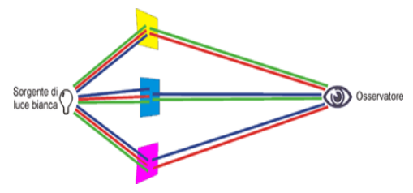
Una superficie illuminata da una **luce bianca** *($E(\lambda)$ costante, l'esempio più vicino è il sole, anche se la sua luce presenta una piccola parte azzurra)* appare gialla, poiché assorbe le radiazioni blu e lascia solo quelle verdi e rosse, apparendo quindi gialla secondo la sintesi additiva.
Considerando il fenomeno dalla parte della radiazione assorbita, notiamo che le superfici colorate **sottraggono** alla nostra visione una parte dello spettro visibile.

**ALCUNI MODELLI COLORE**

- **RGB** - Quello che noi percepiamo, utilizzato anche da camere digitali.
- **HSB** *(Hue Saturation Brightness)* - Corrisponde alla percezione umana del colore.
  Separa l'intensità dalla tinta e dalla saturazione, in quanto abbiamo detto che il nostro occhio è molto più sensibile a variazioni di intensità piuttosto che di crominanza.
  Simili all'HSB sono anche l'**HSV** *(Value)* e l'**HLS** *(Lightness)*.
- **CMYK** - Sistema utilizzato per la sintesi sottrattiva.
- **YIQ / YUV** - formati utilizzati nei segnali TV.
- **YCbCr** - usato per i video digitali.

L'obiettivo principale di uno spazio colore è quello di scorrelare il più possibile le informazioni, in modo da eliminare le ridondanze *(e ridurre quindi l'ammontare dei dati necessari)* e da mettere in evidenza i singoli contenuti informativi.

Questo è utile anche perché l'intensità contiene anche le informazioni ad alta frequenza di un'immagine, quindi contiene tutti i dettagli di essa; se andassimo a sotto-campionare quella componente perderemmo dei dati importanti, mentre se andiamo a sotto-campionare le componenti relative al colore la perdita è sicuramente minore.

**FORMATI GRAFICI**
Il formato grafico rappresenta la **tecnologia** utilizzata per **memorizzare l'immagine**.
Esistono due tipologie di immagini:

- **RASTER**: immagini definite su una griglia di elementi *(pixel = picture element)* e con un certo numero di bit per pixel *(bpp)*.
- **VETTORIALI**: immagini definite da formule matematiche, enti geometrici. Possono essere compresse molto senza perdita di informazioni e scalate all'infinito senza perdite, ma immagini di questo tipo molto complesse richiedono operazioni complesse per essere visualizzate.

Esistono anche delle immagini che hanno sia una componente scalare che una vettoriale e vengono dette immagini in **meta formato** *(ad esempio aggiungendo delle date e/o testi all'immagine)*.

## IMMAGINI RASTER

Nelle immagini raster, la rappresentazione accurata di un'immagine dipende

- Dal numero di pixel *(**CAMPIONAMENTO**)*
  **ATTENZIONE**: questo parametro *NON* è la risoluzione dell'immagine.
- Dalla codifica del pixel *(profondità del colore/livelli di grigio)* *(**QUANTIZZAZIONE**)*

Al crescere del numero di pixel e della profondità del colore, aumentano anche le dimensioni dell'immagine e diventa necessaria la *compressione*.

**RISOLUZIONE**
Le immagini non hanno una dimensione *fisica*; le dimensioni sono in pixel.
Le dimensioni fisiche di un'immagine dipendono dal dispositivo di riproduzione/acquisizione. Le informazioni su questa dimensione sono espresse dalla **risoluzione** in **ppi** *(pixel per inch)*, che rappresenta la quantità di pixel contenuti in un pollice.
In caso di stampa si parla di **dpi** *(dot per inches)*.
Più la risoluzione è alta, più il singolo pixel è piccolo.
La risoluzione **NON** incide sul peso dell'immagine, essa è definita esclusivamente dal numero di pixel e dal numero di bit per pixel.

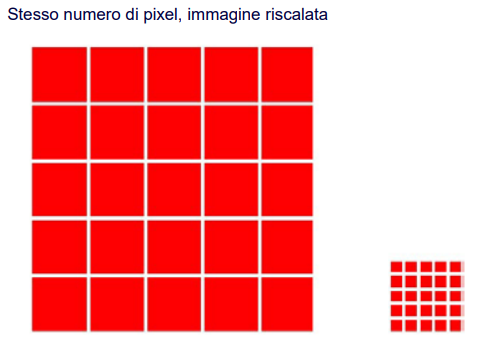Avendo un'immagine già acquisita, per sapere la sua dimensione fisica, devo dividere i pixel per la sua risoluzione in ppi *(o per la risoluzione scelta per avere una certa dimensione fisica stampata)*.
Se volessimo diminuire la dimensione fisica di un'immagine potremmo ridurre il numero di pixel e quindi *sotto-campionare*, ma questo porterebbe ad una peggiore qualità dell'immagine, oppure potremmo modificare la risoluzione dell'immagine, modificando così la dimensione fisica del pixel, senza toccare il numero di pixel e/o il numero di bit per pixel *(l'immagine quindi avrà lo stesso peso e qualità di prima, non la modifichiamo)*

**STAMPANTI**
Le stampanti in commercio dichiarano di lavorare a 1440, 2880 o più **dpi** *(dots per inch)*; questo risulta strano se consideriamo che una stampa è ottimale a 300 **ppi**; il motivo è che i dpi dichiarati dalle stampanti sono il numero di *gocce di inchiostro* che la stampante riesce a inserire in un pollice, ma per "costruire" un pixel ci possono volere più gocce.

**ACQUISIZIONE**
A che risoluzione devo acquisire quindi un'immagine? Dipende da *cosa sto acquisendo* e da *cosa devo farci*.
**Esempio**: se devo acquisire una foto da una diapositiva di 24x36 mm, da stampare a 10x15 cm a 300 ppi devo:

- Calcolare il fattore moltiplicativo *(fattore di ingrandimento)*, ovvero il rapporto tra il lato dell'immagine di destinazione *(15 cm)* e il corrispondente lato dell'immagine fisica *(36 mm)*
- Moltiplicare tale fattore per la risoluzione desiderata *(300 ppi)*

Quindi nel nostro caso 150 mm / 36 mm * 300 ppi = **1250 ppi**.

**E se l'immagine è acquisita con una camera?**
Se sappiamo già la destinazione di utilizzo dell'immagine, possiamo stabilire la qualità di acquisizione in fase di scatto; ad esempio se vogliamo visualizzare l'immagine a 10x15cm su schermo *(quindi con 72 dpi)* avremmo 10 cm / 2.54 cm/inch * 72 pixel/inch = **284 pixel**.

**NOTA**: generalmente sono considerate ottime le risoluzioni di 300 dpi per la stampa e 72 dpi per la visualizzazione su schermo. Inoltre, un pollice corrisponde a circa 2.54 cm.

## QUANTIZZAZIONE CROMATICA

Abbiamo già visto come il colore sia esprimibile come combinazione di colori primari *(RGB, CMYK)* e come un altro parametro importante delle immagini digitali è la profondità del colore, ovvero il nr di bit per pixel.
Alcune profondità sono ad esempio *1 bit (immagine bianco e nero)*, *8 bit (livelli di grigio)*, *24 bit (8 bit per canale, 3x8=24, immagine true color)*.

**PALETTE**
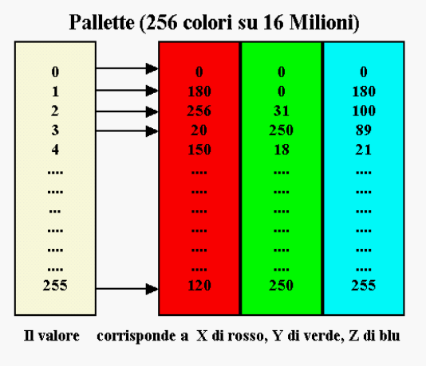Detto questo, si potrebbe pensare che per ottenere delle immagini a colori servano quindi per forza 3 canali; in realtà è possibile creare delle immagini a colori anche con solo 8 bit definendo una *palette* *(detta anche Look-Up Table o LUT)* di 2b possibili colori.
I colori possono essere predefiniti ma possono anche essere scelti dall'utente.

Questo genere di quantizzazione cromatica è molto utile ad esempio nell'utilizzo delle GIF che permettono di creare delle animazioni, poiché gestire un colore molto minore rispetto al true color pesa molto di meno computazionalmente.
Un altro caso d'uso è la creazione di un logo, che generalmente contiene solo pochi colori che evochino certi sentimenti nel pubblico; ha senso usare solo il numero di bit necessari per salvare quei colori.

**OCCUPAZIONE DI MEMORIA**
Ovviamente, maggiore è la profondità colore, maggiore sarà il numero di bit necessari a memorizzare una data immagine. In particolare abbiamo detto che sul peso in memoria di un'immagine influiscono sia il numero di pixel, sia il numero di bit per pixel, come possiamo osservare anche nella tabella sottostante dove sotto le voci relative al colore è riportato il peso in Byte dell'immagine.

| RISOLUZIONE |   PIXEL   |   TRUE COLOR    |   GRAY SCALE    |   LINE ART    |
| :---------: | :-------: | :-------------: | :-------------: | :-----------: |
|   75 ppi    |  450x300  |  405.000 Bytes  |  135.000 Bytes  | 16.875 Bytes  |
|   150 ppi   |  900x600  | 1.620.000 Bytes |  540.000 Bytes  | 67.500 Bytes  |
|   300 ppi   | 1800x1200 | 6.480.000 Bytes | 2.160.000 Bytes | 270.000 Bytes |

**DYNAMIC RANGE & CONTRASTO**
Il *dynamic range* di un'immagine rappresenta l'intervallo fra l'ampiezza massima e minima di un segnale ed è quindi legato al numero di bit impiegato; un'immagine ben contrastata utilizza tutti i livelli disponibili.
I due picchi in 0 e 250 dell'immagine ben contrastata indicano anche la presenza di una saturazione.

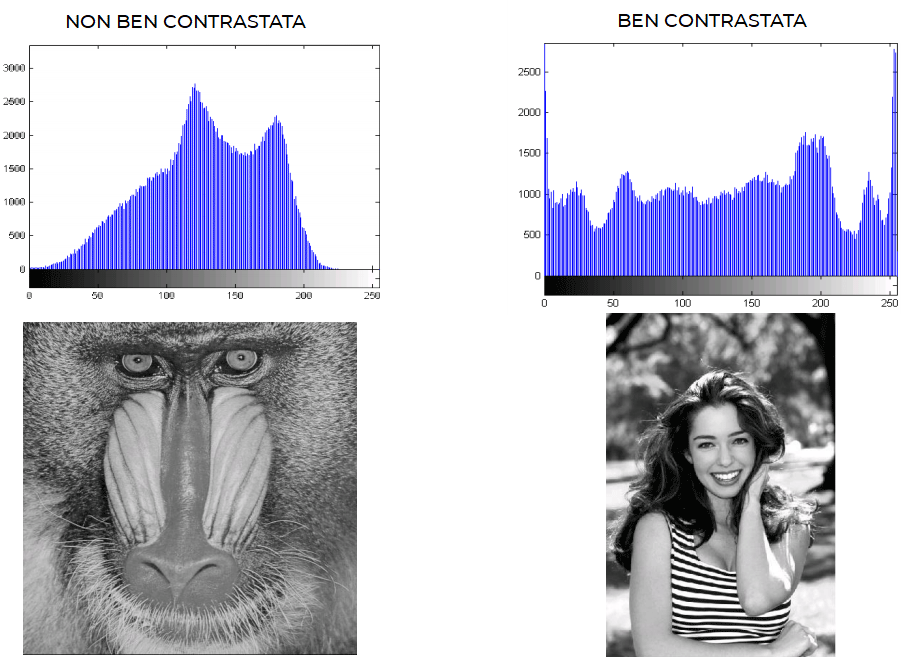

L'occhio umano può distinguere valori di luminosità massima/minima con un rapporto di circa 10.000:1, tuttavia, le immagini riprodotte su schermo o carta hanno un range dinamico di solo 256:1 *(perché ho solo 8 bit)*; questo comporta la perdita di dettagli nelle zone d'ombra o nelle zone luminose.

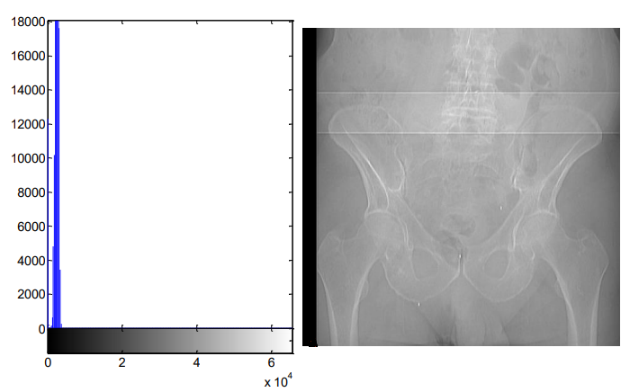Un esempio sono le immagini mediche, che spesso utilizzano 16 bit per la profondità e che, se visualizzate su uno schermo *'comune'* da 8 bit, risultano nere, senza informazioni poiché i 65.535 possibili livelli vengono redistribuiti sui 256 del monitor.
Notiamo però che l'immagine in questione non utilizza benissimo il quantizzatore a disposizione, quindi potremmo prendere solo i 4096 valori effettivamente utilizzati *(che sono comunque più di 256)* e ridistribuire quelli sugli 8 bit del monitor.
Notiamo anche che l'immagine è ancora poco contrastata per via della striscia nera all'inizio: avrebbe senso tagliare fuori quella parte del segnale e distribuire nuovamente l'immagine per avere un risultato ancora migliore.

**TONE MAPPING**
Abbiamo detto che per visualizzare un'immagine ad altro range dinamico su uno schermo a range inferiore, bisogna convertire tale range in quello inferiore. Il processo di ridistribuzione del range più ampio in uno inferiore è detto *tone mapping*.
Una possibile soluzione consiste nel produrre multiple immagini della stessa scena a basso range dinamico ma utilizzando diverse esposizioni, in modo da ottenere informazioni più accurate per ogni livello di intensità per poi fonderle in un'unica immagine ad alto range dinamico. Queste tecniche sono utilizzate nelle tecnologie HDR di alcune camere.

**DITHERING**
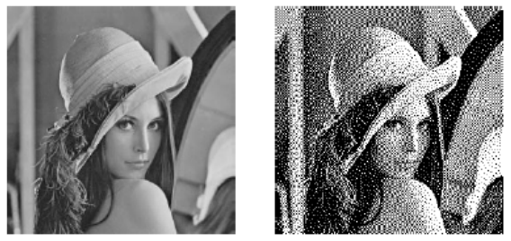Esistono degli *stratagemmi* percettivi per simulare di avere un maggior range dinamico rispetto a quello realmente disponibile; uno di questi è il *dithering*, che viene utilizzato ad esempio per stampare un'immagine in toni di grigio *(8 bit)* con un solo colore nero *(1 bit)* dividendo i pixel in blocchi, ognuno dei quali viene riempito con dei pattern per simulare i livelli di grigio.
L'idea di base è quella di suddividere ogni pixel in un pattern più grande in modo che l'intensità sia data dal numero di punti stampati in quel pattern. Ovviamente le dimensioni dell'immagini aumenteranno in questo modo.
Questa tecnica viene utilizzata anche nelle immagini a colori simulando dei colori non presenti nella LUT mettendo vicino dei colori diversi.
Il dithering può inoltre essere utilizzato anche per eliminare degli artefatti di quantizzazione regolari e quindi fastidiosi, aumentando il rumore effettivo del segnale ma rimuovendone la regolarità e rendendolo quindi dal punto di vista percettivo meno sgradevole.

**HALF TONE PRINTING**
Un altro processo simile è l'*half tone printing* che consiste nel stampare dei cerchietti di inchiostro nero di dimensioni variabili per simulare una sfumatura.

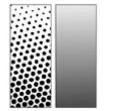

## SEGNALI AUDIO

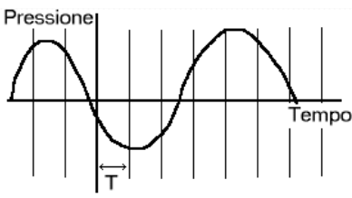Il segnale audio, così come la luce, è un fenomeno ondulatorio ma macroscopico rispetto a quest'ultima.
Dunque è un **onda** *(che descrive la variazione di pressione in un certo punto)* ed è detta ***longitudinale*** poiché la sorgente sonora vibra nella stessa direzione di propagazione del suono.

Quando consideriamo un segnale *sinusoidale* con un'unica frequenza, periodico ed infinito, stiamo parlando di un **suono puro** o *elementare* o *tono*.
La maggior parte dei suoni in natura sono tuttavia caratterizzati da forme d'onda diverse da quelle sinusoidali che però generalmente possono essere descritte come combinazione di suoni elementari.
Dunque, un segnale sonoro è composto da diverse componenti elementari descritte da:

- Ampiezza $A$: si misura rispetto al valore medio della pressione dell'aria ed è espressa in dB.
- Periodo $T$: durata di ogni ciclo in secondi.
- Frequenza $f$: inverso del periodo, velocità con cui i valori di pressione fluttuano ciclicamente.

Ovviamente, per analizzare meglio questi parametri è utile osservare il segnale nel dominio delle frequenze. Inoltre, a questi parametri possono essere assegnati delle **grandezze percettive** che descrivono il suono:

|                            Fisico                            | Percettivo |       Rappresentazione        |
| :----------------------------------------------------------: | :--------: | :---------------------------: |
|                          Frequenza                           |  Altezza   | Tonalità *(bassi, medi alti)* |
|                           Ampiezza                           | Intensità  |            Volume             |
| Spettro *(insieme di tutte le frequenze che caratterizzano il suono)* |   Timbro   |      Tipologia strumento      |

**FREQUENZA**
La frequenza fondamentale è la responsabile dell'**altezza del suono**, cioè della sensazione di **acutezza/gravità** *(maggiore è la frequenza, più acuto è il suono)*. Affinché in un suono sia possibile individuare un'altezza, esso deve essere periodico.

**AMPIEZZA**
Variazioni di piccola ampiezza producono suoni di bassa intensità. L'intensità cresce col crescere dell'ampiezza.

**ATTENZIONE**: Il legame che c'è tra grandezze fisiche e percettive non è però lineare. Generalmente le grandezze percepite aumentano più lentamente di quelle fisiche man mano che queste crescono.

**ENERGIE IN GIOCO**
Le energie in gioco nei fenomeni acustici sono irrilevanti rispetto a quelle nel fenomeno luminoso. In particolare i suoni vanno da:

- 20 Hz a 20 kHz per quanto riguarda l'**udito**
- 50 Hz a 10 kHz per quanto riguarda il **parlato**

|     Frequenza      | Tipologia |
| :----------------: | :-------: |
|   20 Hz - 50 Hz    |   Bassi   |
|  500 Hz - 8000 Hz  |   Medi    |
| 8000 Hz - 20000 Hz |   Acuti   |

Oltre quei valori si hanno gli **infrasuoni** e gli **ultrasuoni**.
Ovviamente, visto che il nostro sistema percettivo non è comunque in grado di percepire segnali oltre quei limiti, quando li andiamo a campionare, ha senso eliminare tali frequenze e mantenere solo quelle udibili, anche per evitare aliasing nel caso di un cattivo campionamento. Una buona frequenza di campionamento per i suoni è dunque $f >$ 20 kHz​.
**ATTENZIONE**: devo eliminare le frequenze oltre i limiti per evitare l'aliasing; anche se non le sentiamo esse possono interagire col segnale e creare distorsioni.

**CAMPO DI UDIBILITÀ**
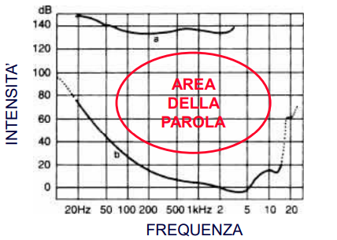Il campo di udibilità è determinato da valori limite di intensità e di frequenza.
Il limite inferiore per l'intensità è costituito dalla **curva di soglia di udibilità**, mentre quello superiore dalla **curva di soglia del dolore**.
Il limite delle frequenze invece è dato da un valore inferiore tra i 15 e 20 Hz e da uno superiore che si aggira sui 20000 Hz.
Il valore di intensità di riferimento è quello al quale diventa udibile un segnale a 2 Hz *(ricordiamo che intensità è calcolata in dB)*. Notiamo come non sia lineare l'andamento della curva, a significare che le grandezze
fisiche e percettive non sono dipendenti linearmente.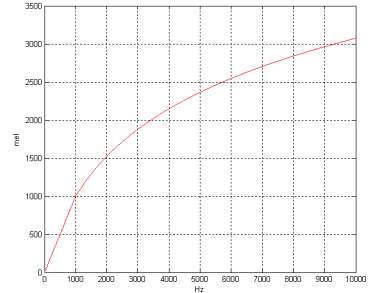

La stessa cosa vale anche per frequenza e altezza percepita del suono, cosa che viene mostrata nella scala di Mel.

**dB E LIVELLI DEI SUONI**
Alcuni livelli di intensità del suono sono:

- 0 dB: suono alla soglia dell'udibilità
- 130 dB: suono alla soglia del dolore.
- 160 dB: rottura del timpano.
- 200 dB: suono in grado di uccidere un umano.
- 210 dB: massimo rumore prodotto in laboratorio.

Gli incrementi di 1 dB corrispondo ad un valore di **JND** *(Just Noticeable Difference)* di volume, ovvero all'incremento minimo che siamo in grado di percepire.

## PESO DI UN FILE AUDIO

Quando siamo in presenza di un segnale digitale, abbiamo a che fare con

- $fc$ frequenza di campionamento
- $D$ durata
- $b$ bit per campione
- $Nc$ numero canali audio.

Il peso di un file audio è dunque $Weight = (fc*D*b*Nc)$, dove $fc*D$ è il numero di campioni totali.
In KB *(kilobyte)* sarà $Weight = (fc*D*b*Nc)/(8*1024)$. *(8 perché 1 B = 8 bit e 1024 perché 1 KB = 1024 B)*

**FILTRO ANTI-ALIASING**
Abbiamo detto che prima del campionamento il segnale audio viene filtrato passabasso per limitare le frequenze e quindi l'aliasing, mantenendo solo le frequenze udibili.
Dopo la conversione DA, nell'output possono essere di nuovo presenti alte frequenze a causa del campionamento e della quantizzazione, dato che il segnale digitale è a gradini e che quindi contengono alte frequenze. Dunque anche dopo la conversione DA viene applicato un filtro passabasso.

**SEGNALE VOCALE: CAMPIONAMENTO**
Abbiamo detto che il parlato arriva fino a 10 kHz, tuttavia la **maggior parte dell'informazione** è concentrata nei primi 4 kHz *(difatti le linee telefoniche usano un campionamento a 8 kHz)*.
Ovviamente, oltre alla frequenza di campionamento, sulla qualità influisce anche il numero di bit per campione.

**SNR**
Sappiamo già cos'è l'SNR, ma è importante notare che nel caso ad esempio dei suoni può essere complicato definirlo, poiché il rumore considerato è *tutto* il rumore che interferisce *(anche ad esempio il rumore del mezzo di trasmissione in un determinato momento)* e solitamente non è definibile come nel caso della quantizzazione.

## CODIFICA

Per la codifica dei segnali audio esistono due principali tecniche:

- **Pulse Code Modulation (PCM)**: che converte forme d'onda analogiche in segnali digitali campionandoli, quantizzandoli e codificandoli *(generalmente in binario)*.
  Il risultato è un segnale digitale il cui valore numerico rappresenta il valore di ampiezza del segnale sorgente. La PCM può essere lineare e non lineare *(in termini di combinazione tra il valore digitale e il valore di corrente in output)*.
- **Pulse Amplitude Modulation (PAM)**: che codifica il valore dei campioni in funzione dell'ampiezza di una forma d'onda *(detta pulse)*.
  Il risultato è quindi una sequenza di onde uguali fra loro *(come forma)* ma con diversa ampiezza.
  Usando dei segnali sfasati è possibile mandare segnali diversi attraverso questa codifica.

**QUALITÀ AUDIO**
Nel processo di digitalizzazione la qualità del segnale è data dalla fedeltà di riproduzione del suono e quindi dal numero di campioni e dal numero di bit, ma c'è anche un altro fattore che influenza la qualità audio percepita: la **direzionalità** *(ricordiamo che abbiamo due orecchie e che il suono si riflette nello spazio)*.

Dunque, un fattore che modifica la qualità percepita è anche il numero di canali presenti nel segnale, che simulino la riflessione del suono.

Le configurazioni più tipiche sono:

- **Stereo**: 2 canali, destro e sinistro, posti frontalmente. Usato nei CD.
- **Sorround 5+1**: 5 canali direzionali che portano medie e alte frequenze e un subwoofer centrale per le basse frequenze *(che non vengono percepite in modo direzionale)*. Usato nei home theater.

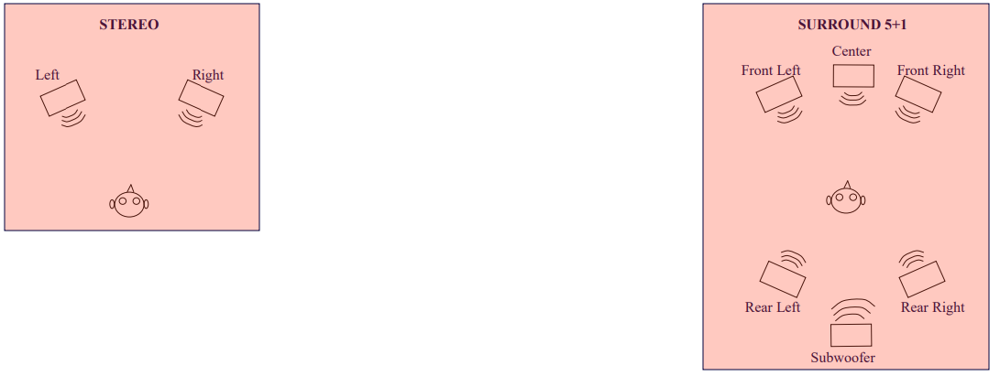

**INTERLEAVING E MULTIPLEXING**
In fase di scrittura su disco, i campioni provenienti da canali diversi vengono scritti in successione; questa tecnica è detta **interleaving** in caso di scrittura su disco o **multiplexing** in caso di trasmissione.
Per eseguire i campioni in modo sincronizzato saranno necessari dei buffer in riproduzione.

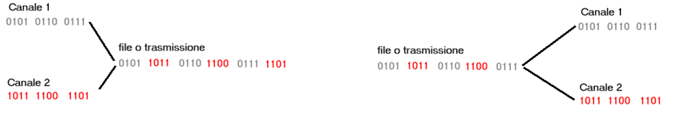

## SEGNALI VIDEO

Come fanno diversi immagini *(i frame)* in successione ad essere percepite come in movimento?
Nel 1829 si pensò che questo fenomeno avvenisse al livello di retina; si pensava cioè che l'occhio trattenesse per qualche frazione di secondo un'immagine sulla retina, anche dopo che questa non è più visibile realmente. Nel 1912 venne invece ipotizzato che questo fenomeno succedesse ad un livello superiore *(nel cervello)* e venne chiamato **fenomeno phi**.

Questa persistenza della visione, seppur non sia chiaro dove avvenga, è il fenomeno che permette di avere una percezione di movimento visionando diversi frame in una successione più o meno rapida.

**QUANTO VELOCE? - FRAME RATE**
**Frame Rate**: frequenza di campionamento rispetto alla variabile temporale. Rappresenta il numero di frame mostrati in un secondo da un video.
Le prime teleconferenze giravano a 10 fps *(frame per second)* e venivano percepite come dei movimenti a scatti. Successivamente i film muti utilizzarono 16 fps, per poi andare verso i 24 fps usati molto nel cinema. Moderne applicazioni come la TV possono usare 30 o 60 fps mentre altre applicazioni *(es. i giochi)* possono spingersi anche oltre i 120 fps.

Dunque, il **movimento apparente** può essere percepito a frequenze molto basse; un limite inferiore potrebbe essere **16 fps**. 

**VISUAL HUMAN SYSTEM E PERCEZIONE DI MOVIMENTO**
Quando vediamo una variazione di intensità in una certa posizione spaziale *(e quindi variazione di intensità rispetto al tempo)* oppure in un certo tempo *(e quindi variazione di intensità rispetto alla posizione)*, essa non viene percepita sempre continua per qualsiasi frequenza, ma, per certi valori di frequenza, questa variazione viene percepita come uno *sfarfallio* *(**flickering**)*.
Solitamente viene definita una frequenza limite al disopra della quale non viene percepito alcun flicker, detta **Critical Flicker Frequency**.

Dunque abbiamo che se un pattern cambia molto più velocemente del rate di refresh *(immagini che vediamo al secondo, non necessariamente frame diversi)* del nostro sistema visivo, apparirà sfuocato, presenterà flicker.
Mentre se l'intervallo tra un frame e l'altro è troppo lungo, l'immagine apparirà discontinua.

**FRAME RATE E CRITICAL FLICKER FREQUENCY**
La frequenza di flicker dipende da più fattori.
In particolare la CFF varia da 20 ad 80 Hz in funzione di

1. Luminosità media del display: più è alta e più cresce la CFF
2. Luminosità ambiente: più è alta e più cresce la CFF
3. Distanza dallo schermo: più è vicino e più cresce la CFF

Il frame rate **non deve** essere inferiore alla Critical Flicker Frequency.

**REFRESH E FLICKER**
Il refresh rate è la frequenza con cui è riprodotta un'immagine *(anche la stessa)* su un display.
È diverso dal frame rate poiché include anche la ripetizione di una stessa immagine, mentre il frame rate *'conta'* solo le immagini diverse.
Il refresh rate può essere utilizzato per ridurre il flicker quando il frame rate non ne permette l'eliminazione.

**SCANSIONE PROGRESSIVA O INTERLACCIATA**
La scansione progressiva di un video richiede che tutte le linee di un frame vengano trasmesse in sequenza ed in modo continuo.
Un modo per aumentare il refresh rate è utilizzare una scansione *interlacciata* *(anche se questa tecnica nasce originariamente per ridurre la banda necessaria a trasmettere i video)* che divide il frame in due semiquadri chiamati *field*. Il primo field ha solo le linee dispari, il secondo solo quelle pari. Ognuno dei field viene trasmesso in modo continuo in metà del tempo totale fra un frame e il successivo, raddoppiando difatti il refresh rate.

Ovviamente, andando a prendere una riga si e una no stiamo effettuando un **sottocampionamento**, difatti ogni field è campionato ad istanti diversi, secondo il field rate. Il sottocampionamento introdurrà quindi degli artefatti nelle alte frequenze, ad esempio in scene ad alta velocità, quando c'è una variazione molto rapida, specie nella direzione verticale.
Per ovviare a questi problemi viene effettuato un blur *(filtraggio passa-basso)*.

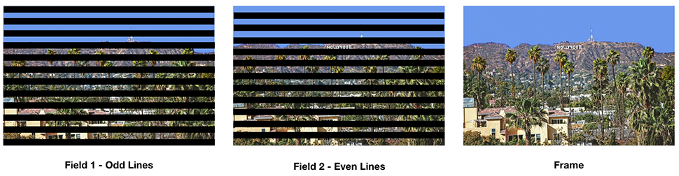

**AUMENTO FREQUENZA APPARENTE**
Solitamente nella trasmissione della TV analogica veniva usato l'interlacciamento per risolvere anche il problema del flicker, al cinema il proiettore illumina 2*(o anche 3)* volte lo stesso fotogramma, aumentando così il refresh rate.

Notiamo che al cinema solitamente può bastare anche un refresh rate di 48 Hz poiché la stanza è poco illuminata e la distanza dallo schermo è adatta, mentre ad esempio in ufficio, con una luminosità ambientale più alta e una distanza ridotta è necessario un refresh rate maggiore.

| AMBIENTE | ILLUMINAZIONE | REFRESH RATE Hz |   FRAME RATE Hz   |
| :------: | :-----------: | :-------------: | :---------------: |
|  Cinema  |     Buio      |       48        |        24         |
|    TV    |    Normale    |      50/60      |       25/30       |
| Ufficio  |   Luminoso    |   66/72/76/85   | Come refresh rate |

## RIPRODUZIONE IMMAGINE

Abbiamo che per quanto riguarda la risoluzione spaziale, un video è definito a seconda se il segnale è

- **ANALOGICO**: definito da numero di linee di scansione. Non esistono i pixel, la minima dimensione è la dimensione del fascio di elettroni. L'intensità luminosa dipende dal livello di tensione.
- **DIGITALE**: numero di pixel per righe e colonne.

Per quanto riguarda invece il colore, generalmente i video usano un spazio colore diverso dal RGB *(solitamente YCbCr)*.

**RIPRODUZIONE COLORE**
Lo spazio colore adottato dai video generalmente viene usato per separare l'informazione di intensità *(alla quale ricordiamo siamo più sensibili per via dei recettori che abbiamo negli occhi)* da quella del colore stesso, in modo anche da poter effettuare una compressione sulla parte a cui siamo meno sensibili.
In realtà questa separazione nasce anche per una questione di storia, in particolare è legata al passaggio dalla TV B/N alla TV a colori; a quel tempo c'era bisogno di rappresentare il colore mantenendo però il segnale luminanza *(che era quello trasmesso in B/N)* compatibile con i ricevitori esistenti e quindi con le stesse temporizzazioni e la stessa banda.

Il problema era codificare immagini composte con i primari additivi RGB in una forma più facilmente utilizzabile e che sia compatibile col vecchio standard.
La soluzione ideale era ovviamente usare tre canali separati *(R, G, B)* per ogni colore, ma questo non solo non sarebbe stato compatibile col vecchio standard, ma sarebbe stato anche molto costoso in termini di banda. Miscelare le tre componenti su uno stesso canale comporterebbe delle perdite di qualità e non sarebbe comunque stato compatibile. 

Una soluzione proposta allora fu di **separare** la *luminanza* dalla *crominanza*.

**SEGNALE LUMINANZA**
Per ottenere il segnale luminanza si esegue una combinazione lineare delle tre componenti primarie RGB. A questo segnale viene applicata una **correzione gamma** *(correzione non lineare)*; questa correzione serve per compensare le caratteristiche di non linearità dei display.

In particolare $Y = 0.299R + 0.587G + 0.114B$	*(in YUV)*.

Possiamo notare come il verde pesi molto di più degli altri canali, questo per via del fatto che i nostri recettori percepiscono il verde in maniera molto simile a come percepiscono la luminanza e ricordiamo che abbiamo molti più bastoncelli che coni, quindi siamo molto più sensibili alla luminanza che alla crominanza.

Notiamo anche che il fatto che la luminanza sia combinazione lineare dei tre canali significa che fisicamente la luminanza la troviamo in tutti e tre i canali RGB. Questo significa che la luminanza è **correlata** ai tre canali che quindi presentano una **ridondanza**, che andando a separare i canali e scorrelare le informazioni possiamo eliminare, cosa molto utile quando parliamo di compressione dei segnali.

**SEGNALE CROMATICO**
Nello standard YUV l'informazione colore è codificata in due canali aggiuntivi ottenuti sottraendo la luminanza alle componenti rosso e blu.

In particolare	$U = 0.492(B-Y)$			e			$V = 0.877(R-Y)$.
L'insieme di queste due componenti si chiama **chroma**.

Ma dov'è il verde?
Il verde è definito nella luminanza, poiché è quello che compone maggiormente l'informazione di luminanza.

**GAMMA CORRECTION**
I display hanno una risposta non lineare rispetto all'input *(in termini di intensità luminosa)* perché riproducono un segnale di intensità con una tensione e questo fenomeno viene corretto con la gamma correction, un'operazione non lineare che passa attraverso un esponenziale e che modifica l'intensità del segnale. Senza gamma correction i valori scuri sono più compressi e quindi mostrati troppo scuri.

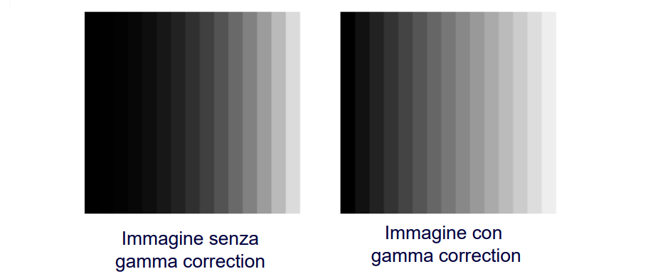

In particolare, la dipendenza tra intensità $B_d$ e tensione $v_d$ è data dalla formula $B_d = v_d^{\gamma_d}$.

I monitor CRT hanno una gamma che va da 2.2 a 2.5.
La correzione gamma è semplicemente un elevamento con un'opportuna potenza del segnale prima della trasmissione, in modo da renderlo nuovamente lineare.
Questo discorso vale per il canale della luminanza ma vale anche per i canali cromatici. È stato definito difatti uno spazio **sRGB** ottenuto dal RGB andando a correggere la gamma dei canali.

**IMPORTANTE**: la gamma correction è applicata su valori normalizzati, ovvero riscalati tra 0 e 1, in modo che la correzione non alteri i bianchi ed i neri puri, ma solo i grigi.

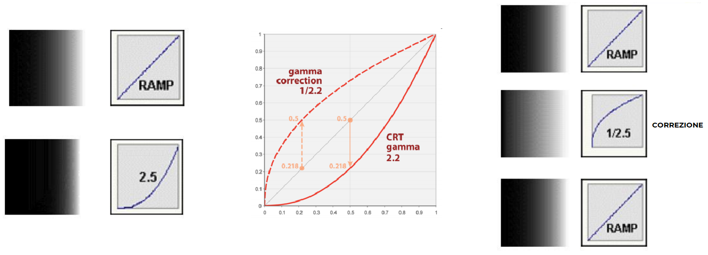

**SPAZI COLORE**
I tre più importanti spazi colore *(nei video analogici)* sono NTSC *(Nord America e Giappone)*, PAL e SECAM *(Europa)*. I segnali analogici usati sono **YUV** *(PAL e SECAM)* e **YIQ** *(NTSC)*.

Un segnale video analogico, una volta digitalizzato viene convertito in formato **YCbCr**, utilizzato anche in molti schemi di compressione. *YUV* e *YCrCb* sono simili per quanto riguarda il metodo di calcolo. Cambiano per quanto riguarda il possibile range di valori: YUV varia da 0-255, YCrCb varia da 16-235/240.

La TV odierna è la *HDTV* che può supportare diversi standard differenti per risoluzione, aspect ratio, frame rate.

**SOTTOCAMPIONAMENTO CROMA**
Poiché il nostro sistema visivo è più sensibile all’intensità luminosa che alla croma ha senso ridurre la risoluzione spaziale delle componenti cromatiche piuttosto che quella della componente di luminanza.

Il campionamento del colore è indicato con la notazione **x : y : z** dove

- **x**: numero relativo di campioni di luminanza.
- **y**: numero campioni chroma per le linee dispari.
- **z**: numero campioni chroma per le linee pari.

Nella digitalizzazione i campioni Cb e Cr sono di solito campionati orizzontalmente.

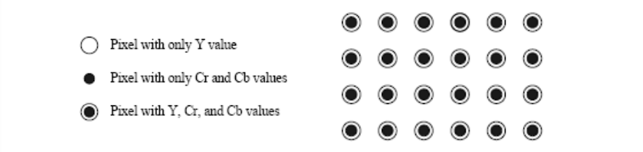Lo schema 4:4:4 indica che non c'è sotto-campionamento sulle componenti cromatiche, in particolare dice che per 4 campioni di luminanza consecutivi avremmo 4 campioni chroma sulle linee dispari e 4 sulle linee pari.

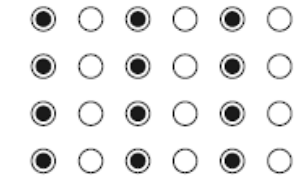Lo schema 4:2:2 indica un sotto-campionamento orizzontale di Cb e Cr di un fattore 2. In particolare, su 4 pixel orizzontali da 0 a 3, tutti i valori di Y sono trasmessi, mentre Cb e Cr sono trasmessi con passo 2: (Cb0, Y0) (Cr0, Y1)(Cb2, Y2)(Cr2, Y3)(Cb4, Y4). Questo significa che l'informazione cromatica viene divisa su due pixel, che quindi avranno la stessa chroma.

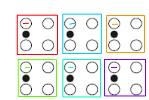Infine, lo schema 4:2:0, che è anche quello utilizzato nella compressione JPEG ed MPEG, sotto-campiona in entrambe le direzioni orizzontale e verticale di un fattore 2. In questo modo abbiamo, per ogni 4 pixel di luminanza, 2 campioni colore nelle righe dispari e 0 nelle righe pari. Questo è come se avessimo un pixel con croma media fra righe e colonne, facendo si che 4 pixel adiacenti condividano la stessa chroma. È come se avessi un *pixellone* di chroma.

Possiamo vedere questo effetto con diversi schemi:

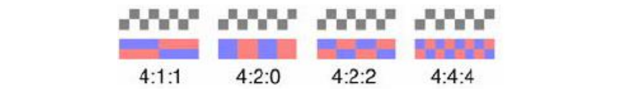

Questo tipo di compressione va ovviamente ad eliminare informazione, ma a livello percettivo spesso non è notabile questo tipo di perdita, quindi se lo scopo dell'immagine è essere visualizzata da umani può aver senso sotto-campionare così la chroma.

Possiamo vedere quanto spazio ci porta a risparmiare questo tipo di operazione nella seguente tabella

| SUBSAMPLING | LUMINANZA (Y) | CROMINANZA (U e V) | TOTALE  | MEMORIA PER PIXEL | PERCENTUALE MEMORIA |
| :---------: | :-----------: | :----------------: | :-----: | :---------------: | :-----------------: |
|    4:4:4    |    4 Byte     |       8 Byte       | 12 Byte |      3 Byte       |        100%         |
|    4:2:2    |    4 Byte     |       4 Byte       | 8 Byte  |      2 Byte       |         66%         |
|    4:2:0    |    4 Byte     |       2 Byte       | 6 Byte  |     1.5 Byte      |         50%         |
|    4:1:1    |    4 Byte     |       2 Byte       | 6 Byte  |     1.5 Byte      |         50%         |

## COMPRESSIONE

Sappiamo che il *costo* di un segnale è espresso attraverso il suo peso e che dipende dal campionamento e dalla quantizzazione di questo. In particolare, per

- Immagini il peso è dato da
  - campionamento spaziale *(numero pixel)*
  - Profondità colore
- Suono il peso è dato da
  - Frequenza di campionamento
  - Livelli di quantizzazione
  - Numero canali
- Video il peso è dato da
  - Campionamento spaziale *(numero pixel)*
  - Campionamento temporale *(numero di frame/sec)*
  - Profondità colore
  - Audio

**ESEMPIO NUMERICO VIDEO SENZA COMPRESSIONE**
Immaginiamo di dover memorizzare un film di 2 ore in uno standard televisivo NTSC, quindi con una risoluzione di 720x480 pixel, con una profondità colore di 3x8 = 24 bit a 30 fps *(trascuriamo l'audio)*.

Avremmo 720 x 480 *pixel/frame* x 30 *frames* x 24 *bit/pixel* x 2x60x60 *s* = 2.24 * 1011 Byte!
Per poter memorizzare questo film sarebbero necessari 24 DVD *(da 8.7 GB)*, per poterne usare uno solo dovremmo comprimere 23.9 volte.

Se ipotizziamo di avere una risoluzione full HD a 60 fps
1920 x 1080 *pixel/frame* x 60 *frames* x 24 *bit/pixel* x 2x60x60 *s* = 2.68 * 1012 Byte!
In questo caso sarebbero necessari 288 DVD!

E ricordiamo che abbiamo trascurato l'audio.

Abbiamo visto dunque che il problema della compressione è un problema grande e che è utile affrontare.
La compressione è il processo di riduzione dei dati necessari a rappresentare una data informazione.

Matematicamente questo si traduce in una trasformazione in un insieme di dati statisticamente scorrelati *(ovvero ridurre la ridondanza)*.

Solitamente la compressione deve soddisfare alcuni requisiti:

- Deve essere garantita una certa qualità del segnale compresso; deve cioè essere definito un ***grado di fedeltà*** al segnale originale. Ovviamente questo grado di fedeltà varia in base alle applicazioni.
- Il livello computazionale del processo di codifica/decodifica deve essere accettabile per l'applicazione specifica.

**TECNICHE DI COMPRESSIONE**
Le tecniche di compressione si suddividono in due famgilie:

- **ERROR FREE O LOSS LESS**: algoritmi di compressione senza perdita di informazioni, il segnale può essere decompresso e ricostruito senza che si perda alcuna informazione *(utile in ambito medico ad esempio)*.
- **LOSSY**: algoritmi di compressione con perdita di informazioni, il segnale ricostruito è un segnale **diverso** dal segnale originale, ma che solitamente a livello percettivo appare uguale *(ad esempio i segnali televisivi)*. Ovviamente il livello di compressione raggiunto da questo tipo di algoritmi è generalmente maggiore di quelli loss less.

**DATI E INFORMAZIONI**
Dati e informazioni non sono la stessa cosa: i dati sono gli strumenti tramite i quali è rappresentata l'informazione. Una stessa informazione può essere rappresentata con diversi quantitativi di dati.

La compressione si basa sulla rimozione dei dati ridondanti, cosa che è matematicamente quantificabile.
Dati due insiemi differenti di dati per descrivere la stessa informazione, possiamo definire la ridondanza dei dati come $C = b_1/b_2$, dove $C$ è il **rapporto di compressione**, $b_1$ sono il numero di bit per rappresentare l'informazione nel primo insieme *(prima della compressione)* e $b_2$ sono il numero di bit per rappresentare l'informazione nel secondo insieme *(dopo la compressione)*.

Dal rapporto di compressione possiamo calcolare la **ridondanza relativa** come $R = 1 - 1/C$.

Se $b_1 = b_2$, $R = 0$: non ci sono dati ridondanti tra la prima e la seconda rappresentazione.
Un rapporto di compressione di 10, che si indica anche come 10:1, sta a dire che il primo insieme necessita di 10 bit dove il secondo ne necessita solo di 1. La corrispondente ridondanza è 0.9; il 90% dei dati del primo insieme è ridondante.

## ESEMPI DI RIDONDANZA

Quando si sceglie un algoritmo di compressione, non lo si sceglie in base al tipo di segnale *(un'immagine piuttosto che un video)*, ma in base al **contenuto del segnale**. L'algoritmo è funzione di come è fatto il segnale.

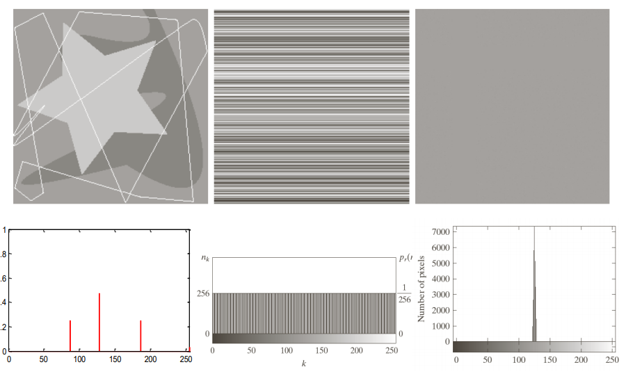

Guardando l'istogramma possiamo subito notare che la prima immagine usa solo 4 livelli di 256 disponibili, sprecando gli altri. Questo è un tipo di ridondanza chiamata **ridondanza della codifica**, potrei evitare di salvare i livelli non usati senza perdere alcuna informazione.
La seconda immagine invece, al contrario della prima, utilizza tutti i livelli dell'istogramma, ma si ripete spazialmente, potremmo rappresentare l'immagine anche una sola colonna e non perdere alcuna informazione. Questa è chiamata **ridondanza spaziale**.
Notiamo anche che, dal punto di vista percettivo, la terza immagine sembra avere meno informazione delle altre, mentre se guardiamo l'istogramma possiamo notare che c'è dell'altra informazione non percepita. Questo crea una **ridondanza percettiva**, potrei eliminare l'informazione non percepita, anche se, a differenza di prima, questa volta andrei a cancellare dell'informazione che nel segnale originale era invece presente.

## RIDONDANZA DELLA CODIFICA

L'istogramma dei livelli di grigio di un'immagine fornisce importanti informazioni su come ridurre il quantitativo di dati necessario per rappresentare l'immagine.

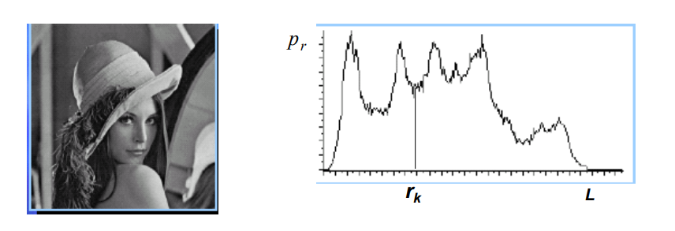

Se invece che rappresentare il numero di pixel con un certo valore sull'asse verticale, rappresentiamo il numero di pixel con quel valore diviso il numero totale di pixel otteniamo la **probabilità di occorrenza del livello di grigio $r_k$**: $p_r(r_k) = n_k/N*M$.

A questo punto se definiamo $l(r_k)$ come numero di bit necessario per descrivere il k-esimo livello di grigio, possiamo anche definire il numero medio di bit per pixel per descrivere l'immagine in toni di grigio
$$
L_{avg} = \sum\limits_{k=0}^{L-1}l(r_k)p_r(r_k)
$$
In un'immagine con 256 livelli di grigio, se per ogni livello si usano 8 bit, $L_{avg} = 8$ e se l'immagine ha dimensioni NxM, saranno necessari NxMx8 bit.

**STRATEGIA DI RIDUZIONE DELLA RIDONDANZA**
Possiamo minimizzare la $L_{avg}$ attraverso una ***codifica a lunghezza variabile VLC***.
Questo tipo di codifica permette di usare un numero minore di bit per rappresentare i livelli più probabili e vice versa ed è una tecnica loss less.

Osserviamo nell'immagine come per i livelli più probabili si utilizzino meno bit e viceversa, cosa che ci porta ad avere un $L_{avg}$ minore, e quindi una minore ridondanza. Se i livelli meno probabili sono assenti, non importa il numero di bit che usano, tanto non li salviamo.

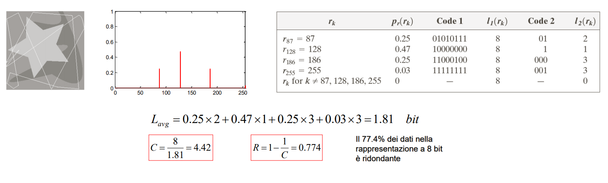

## RIDONDANZA SPAZIALE

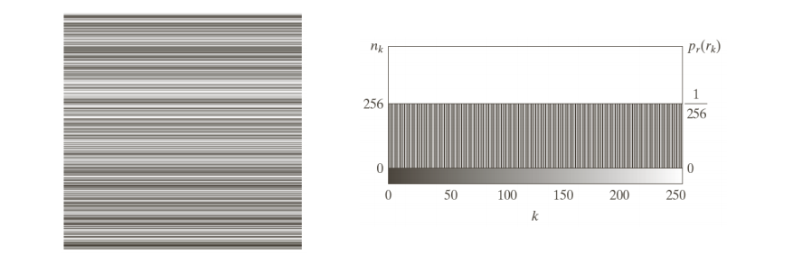

Quando abbiamo un istogramma uniforme la VLC non ha alcun effetto, poiché tutti i valori sono equiprobabili.

Possiamo però notare che

- lungo le righe c'è una forte ridondanza spaziale.
- lungo le colonne no.

**RUN-LENGTH ENCODING (RLE)**
Possiamo ridurre la ridondanza spaziale introducendo delle coppie **run-length**: il primo valore individua un valore di intensità, il secondo il numero di volte che si ripete.

Nell'esempio abbiamo 256 possibili valori di intensità e ognuno di essi si ripete per 256 volte; ci servono quindi due valori per ogni riga. Il rapporto di compressione sarà quindi C = 256x256x8 / 2x256x8 = 128 : 1.

## RIDONDANZA PERCETTIVA

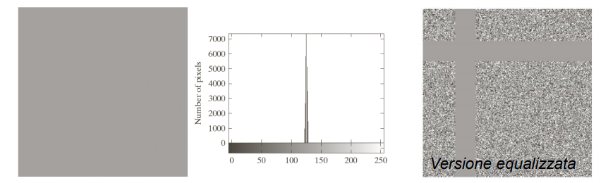

L’immagine è percepita come se avesse un valore di grigio uniforme. Non è così e lo si capisce dall’istogramma. Possiamo eliminare le informazione ignorate dal nostro sistema percettivo e sostituire un unico valore pari al valore medio. In questo modo avremmo C = NxMx8/8 = NxM : 1.

Con questo approccio c'è inevitabilmente una perdita.

## RIDONDANZA STATISTICA

**ENTROPIA**: Misura della quantità di dati minima necessaria per codificare *(senza perdita)* una sorgente di informazione. L'entropia misura dunque il numero **medio minimo** di simboli binari *(0 e 1)* necessari a codificare il messaggio. È una misura del grado di incertezza della sorgente: se un simbolo ha probabilità 1 *(tutti gli altri hanno probabilità 0)*, l'incertezza è nulla, ovvero informazione nulla.

**CODIFICA DI HUFFMAN**
Un algoritmo per la riduzione della ridondanza di codifica è la codifica di huffman.
La codifica avviene secondo una struttura ad albero binario costruita sulla base delle frequenze dei singoli caratteri e mira a trovare il numero minimo di bit per pixel per un dato segnale.
È un VLC: ai caratteri più frequenti viene associato un codice di pochi bit, mentre la lunghezza del codice cresce al diminuire della frequenza del carattere, ed è quindi una codifica senza perdita.

Si consideri il caso di un documento in cui compaiono 5 caratteri A, B, C, D, E.
La frequenza dei singoli caratteri e': f(A)=0.45, f(B)=0.25, f(C)=0.15, f(D)=0,05, f(E)=0.10.

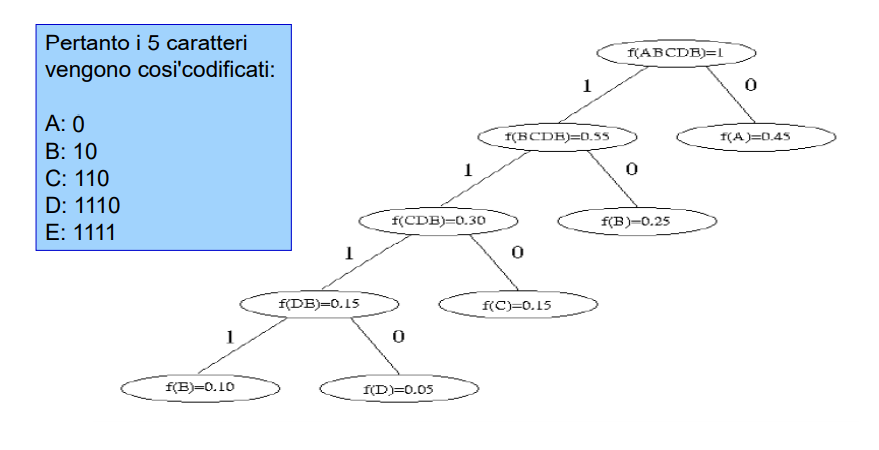L'algoritmo di Huffman prende i caratteri con probabilità minore e li mette in fondo all'albero, andando a costruire man mano l'albero sommando i due nodi inferiori e prendendo i due minimi tra la somma e le altre probabilità.

**RIDONDANZA SPAZIALE E TEMPORALE: RLE**
Sorgenti con memoria: il valore del simbolo corrente dipende dal valore del simbolo precedente.
L'algoritmo RLE sfrutta la memoria presente nei campioni del segnale.

Gran parte del contenuto informativo di un pixel è ridondante e può essere ottenuto a partire dal contenuto informativo dei pixel vicini usando un **mapping** differente dell'immagine più efficiente ma generalmente non interpretabile visivamente.

Questo tipo di algoritmo veniva usato nei fax; avendo del testo molti pixel sono bianchi e quindi è utile memorizzare il valore *(0 sfondo, 1 testo solitamente)* ed il numero di volte che si ripete.

Può essere impiegata anche per la codifica di immagini a colori quando ci sono pixel consecutivi di egual colore. Nel caso di immagini reali *(in cui i bit generalmente non sono uguali in sequenze)* tuttavia è poco efficiente questa strategia, perché aumenterebbe il numero di bit necessari per memorizzare l'immagine *(avrò due valori per ogni pixel e C < 1)*.

**RIDONDANZA SPAZIALE E TEMPORALE: DIFFERENTIAL CODING**
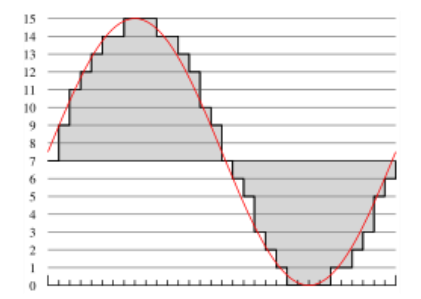Immaginiamo di avere questo segnale sinusoide; possiamo osservare che di fatto i valori vicini sono correlati da una certa legge. Potremmo pensare, invece di codificare ogni livello a sé *(e quindi codificare i livelli da 0 a 16)*, di codificare la differenza tra un livello e l'altro *(dovendo così codificare solo dei valori tra -2 e 2)*. Questo algoritmo è chiamato **DPCM** nei segnali audio codificati con PCM.
In questo modo si passa da un istogramma distribuito su più livelli ad uni più piccato *(stretto)* del segnale originale. A questo punto risulta molto utile un algoritmo VLC per ridurre la ridondanza di codifica.

Nel caso delle immagini si opera generando un’immagine differenza fra pixel contigui *(mantenendo intatto il valore del primo pixel, per poter ricostruire l'immagine)* applicando un operatore che approssima la derivata prima *(gradiente)* o la derivata seconda *(Laplaciano)*; questo equivale ad applicare un filtro passa alto all'immagine e ottenerne gli *edges*.
A causa delle ridondanze spaziali presenti in generale nelle immagini l’immagine differenza ha un istogramma più stretto e quindi un’entropia minore.

**CODIFICA PREDITTIVA**
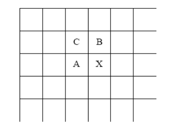Loseless JPEG non usa la DCT e non introduce perdita, ma valuta le differenze tra il valore **effettivo** del pixel *x* ed un suo valore **predetto** da alcuni suoi vicini ABC *(sopra e a sinistra)*. Questa sequenza di valori differenziali viene poi codificata con un VLC tipo Huffman, riportando il primo pixel identicamente.

La predizione può essere fatta con diverse formule, come A + B - C, (A + B) / 2 ecc.
Con una predizione effettiva è possibile ottenere un istogramma ancora più piccato di quello ottenuto con la DPCM.

**ALGORITMI LOSSLESS UNIVERSALI**
*E se non si conosce la distribuzione di probabilità? (ad esempio perché non ho già tutto il segnale)*
Esistono algoritmi loseless che non richiedono a priori la conoscenza della distribuzione di probabilità dei simboli dell'alfabeto e modellano ***dinamicamente*** le caratteristiche statiche dei dati da comprimere e adeguano di conseguenza la codifica.
Alcuni algoritmi di questo tipo sono l'Adaptive Huffman Coding e gli algoritmi **Lempel-Ziv** *(alla base di gzip, pkzip ecc)*.

**LZW (LEMPEL ZIV WELCH)**
LZW è un algoritmo di compressione che rimuove la ridondanza di codifica e la ridondanza spaziale e non necessita a priori della conoscenza della probabilità dell'occorrenza dei simboli da codificare.

L'algoritmo costruisce un dizionario che contenga i simboli da codificare:

- Immagine a 8 bit, dizionario a 9 bit *(512 possibili livelli)*.
- Le prime 256 parole sono associate ai 256 valori di intensità.
- Quando si incontrano due pixel contigui con la stessa intensità, si utilizza la codifica a 9 bit per codificarli, invece di utilizzare 2x8 bit. Ovviamente se non ho pixel che si ripetono, peggioro il numero di bit necessari, mentre se ci sono sequenze che si ripetono questa codifica può essere vantaggiosa.

## CODIFICA VIDEO: INTER FRAMES

Nei video esiste una correlazione non solo tra i **pixel dello stesso fotogramma**, ma anche tra i **pixel di fotogrammi** adiacenti: un fotogramma ed i due adiacenti *(successivo e precedente)* spesso risultano molto simili. Questa **ridondanza temporale** tra fotogrammi vicini che ne sfrutta le loro minime differenze viene trattata dalla **codifica inter frames**.

In particolare, questa correlazione tra un frame ed il successivo viene trattata dalla codifica predittiva che codifica l'errore di predizione con un VLC. La predizione viene fatta attraverso i **vettori di moto** che definiscono lo spostamento dell'immagine dello frame precedente per arrivare in quello successivo. *(Lo vedremo in dettaglio quando parleremo di MPEG)*.

Anche qui ovviamente è molto più efficace codificare la differenza tra la predizione e la realtà piuttosto che le differenze tra i frame. Quando ci sono cambi di scena questo tipo di algoritmi non funziona bene ovviamente *(le differenze saranno enormi)*.

## RIDONDANZA PERCETTIVA

Questo tipo di ridondanza deriva dalle caratteristiche del nostro sistema percettivo: non tutta l'informazione ha la stessa importanza per esso.
Il nostro sistema percettivo non valuta ciascun pixel/campione quantitativamente, ma sfrutta caratteristiche particolare *(edge, texture, frequenze)* per raggruppare i pixel/campioni in insiemi significativi.
La riduzione di ridondanza percettiva ovviamente comporta una perdita quantitativa di informazione: si parla dunque di **quantizzazione**. Questo tipo di compressione è irreversibile.

**RIDONDANZA PSICO-UDITIVA**
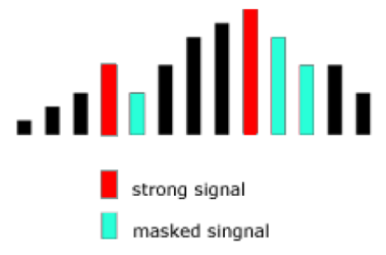Abbiamo visto com'è fatta la nostra soglia di udibilità in presenza di un solo tono; ma cosa succede in presenza di più toni? Quando c'è un tono **dominante** *(con un'ampiezza maggiore degli altri)*, questo crea un effetto di **mascheramento** dei toni vicini, che ne modifica la soglia di udibilità e non vengono percepiti. Alcune tecniche di compressione tengono conto più che di tutte le componenti presenti nella banda, di quelle che sono effettivamente udibili *(e quindi non mascherate)*.

**RIDONDANZA PSICO-VISUALE**
**Legge di Weber**: la sensibilità alle variazioni di luminosità diminuisce man mano che l’immagine diventa più scura. Questo significa che possiamo quantizzare più *grossolanamente* nelle zone più scure.

Siamo più sensibili al rumore nelle regioni uniformi *(a bassa frequenza)* piuttosto che nelle regioni ad alta frequenza. Questo ci permette di usare tecniche come il **dithering** per creare un livello di dettaglio percepito maggiore dopo aver sotto-campionato un'immagine *(quantizzazione IGS - Improved Gray Scale)*.

Il sistema visivo umano è più sensibile alle variazioni di luminanza che non a quelle di crominanza. Questo significa che possiamo quantizzare più *grossolanamente* la codifica delle componenti di crominanza.

## RIDONDANZE E CORRELAZIONE FRA COMPONENTI

Nel dominio diretto, le componenti di un segnale *x* sono fra loto significativamente ***correlate***, ovvero la stessa informazione è contenuta in più componenti *(dati)* e quindi c'è **ridondanza**.
Nel dominio delle frequenze è possibile effettuare una migliore scorrelazione dei dati *(ricordiamo che la maggior parte delle informazioni di un segnale è contenuta nelle sue basse frequenze)*.

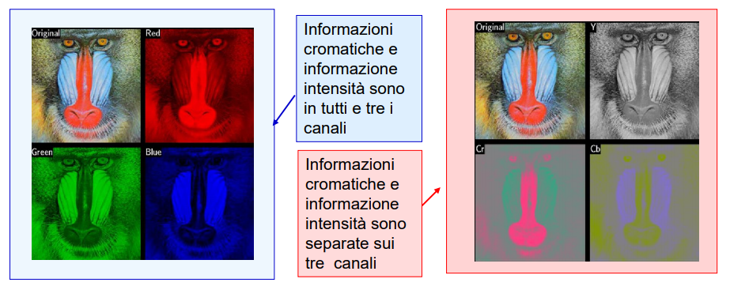

Dunque, se possiamo codificare il segnale con meno componenti del segnali *(ad esempio i coefficienti DFT a basse frequenze)*, le restanti componenti possono essere pesantemente quantizzate *(o addirittura eliminate)* con una piccola perdita.

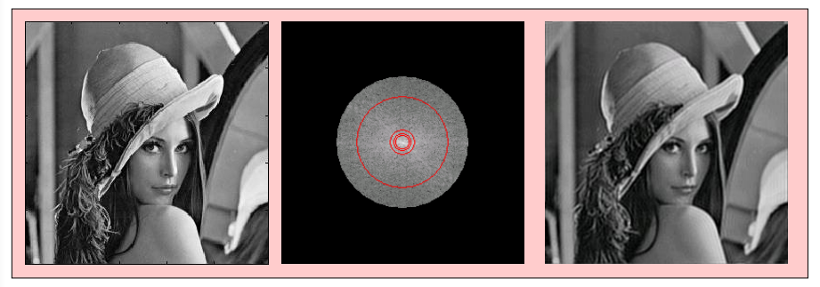

**TRASFORMATE**
Abbiamo visto la trasformata di Fourier, ma ne esistono di diverse, seppur hanno tutte una forma abbastanza simile; tutte operano sulla nostra funzione $f(x)$ attraverso il **kernel**, ovvero attraverso la parte di funzione che caratterizza la trasformata *(nel caso della DTFT era costituito dall'esponenziale complesso)*. In generale questo processo viene chiamato ***mapping*** ed è un processo reversibile.

La scelta di una trasformata può dipendere dalla capacità di decorrelare i dati della trasformata, dalla semplicità di realizzazione, dalla minore visibilità dei difetti nella ricostruzione.

Alcune trasformate sono

- **Karhunen-Loeve Transform *(KLT)***: chiamata anche analisi alle componenti principali, è la trasformata *ottima*, infatti è quella che decorrela meglio i dati, ma è computazionalmente inefficiente.
- **Discrete Cosine Transform *(DCT)***: è la trasformata che approssima meglio il comportamento della KLT, anche se è comunque più complessa computazionalmente della Walsh ed Hadamard Transform *(WLT)* che approssima anch'essa la KLT ma assume solo valori -1 o +1, essendo meno valida della DCT, anche se viene usata a volte nei video.
  Questa trasformata è usata negli algoritmi di codifica degli standard di compressione più usati *(jpeg ed mpeg)*.
- **Wavelet Transform**: diversa dalle altre trasformate, invece di andare solo nel dominio delle frequenze, si porta dietro sia le informazioni delle frequenze che quelle del tempo/spazio. Si porta dietro anche un *compromesso* del dominio di partenza.
  Permette di eseguire un'analisi **multirisoluzione**. È impiegata nel *jpeg2000*.

## DISCRETE COSINE TRANSFORM

**RIPASSO DFT**
Data una funzione $f(x)$, la sua DFT $F(u)$ è $F(u) = 1/M \sum f(x) g(u,x)$, con $g(u, x) = e^{-j2\pi/M ux}$.

La DFT è una trasformata lineare, invertibile dove $g(u, x)$ è detto **kernel** della trasformazione diretta. Dal kernel dipendono le proprietà della trasformata.

Avere una trasformata con $M = 16$ significa avere a disposizione 16 versori nel dominio trasformato campionati su 16 campioni *(16 vettori base, ciascuno di 16 componenti)*. Quando trasformiamo un segnale andiamo ad applicare dei *pesi* ad ogni versore per capire quale combinazione di quei versori crea il segnale nel dominio di partenza.

In foto vediamo solo 9 versori, poiché gli altri si ripetono/si ripetono a segno invertito per via delle proprietà di parità/disparità del coseno/seno.

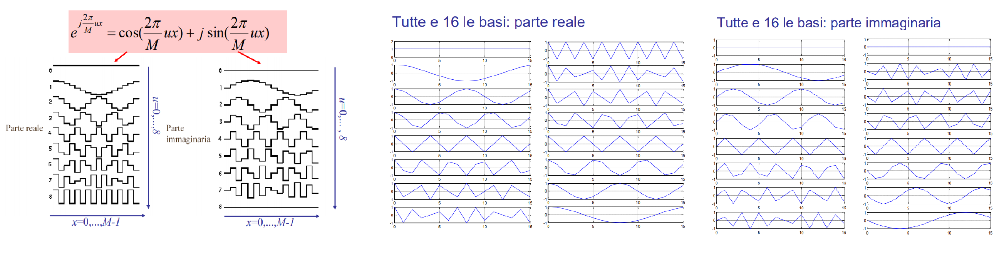

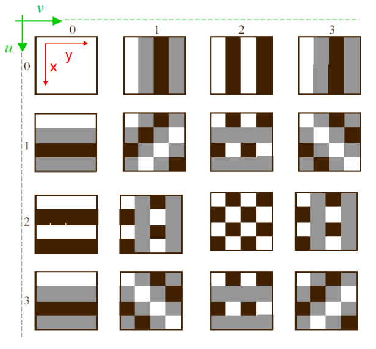
Questo accade nel caso monodimensionale; nel mondo bidimensionale, i '*mattoncini*' cambiano leggermente: non ne avremmo più $M$, ma $M^2$, ovvero avremmo una funzione bidimensionale. Nell'esempio abbiamo $M = 4$.
Notiamo nell'immagine che abbiamo variazioni di frequenza in due direzioni, $u$ e $v$.

Avendo $M = 4$, i vari versori sono campionati in una griglia di 4x4 pixel. Notiamo che il primo blocco, che contiene solo frequenza zero non è altro che la componente continua del segnale.
Considerando queste basi di 4x4 pixel, ci stiamo riferendo ad un segnale reale di 4x4 pixel, poiché cercando i pesi di ogni versore è come se li sovrapponessimo per ricreare il segnale originale.

**DCT**
Ora se passiamo dalla DFT alla DCT, stiamo solo cambiando il *kernel* della trasformata. In particolare, il kernel della DCT è $g(x, u) = \alpha (u) \cos[\frac{(2x+1)\pi u}{2N}]$.
**ATTENZIONE**: la DCT ***NON*** è la parte reale della DFT; la DCT definisce un insieme nuovo di basi.

La DCT è anch'essa lineare ed il suo kernel diretto è uguale a quello inverso *(simmetrico)* ed è **separabile ** *(posso suddividere operazioni multidimensionali in più operazioni monodimensionali)*.

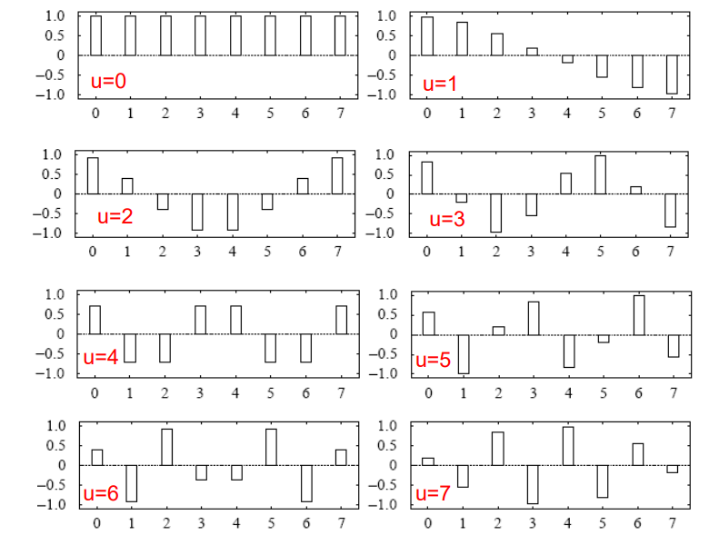Ovviamente, utilizzando solo il coseno, la trasformata DCT è solo reale a differenza della DFT.
Anche nel caso della DCT, se imponiamo ad esempio $N = 8$, stiamo definendo 8 versori campionati su 8 campioni che descrivono un segnale reale ad 8 campioni.

Inoltre, guardando nel dominio delle frequenze il segnale, possiamo notare subito quali frequenze hanno dei contributi minori e possono quindi essere sacrificate: eliminare alcuni campioni con poco contributo nel dominio delle frequenze riduce di poco la qualità rispetto a d eliminare alcuni campioni nel segnale originale.

Anche per la DCT, la trasformata bidimensionale è costituita da NxN *blocchettini* di NxN pixel che definiscono i versori del kernel.
Nella codifica jpeg, N vale 8: questo significa che avremmo 8x8 *blocchettini* di 8x8 pixel ciascuno. La codifica produce una matrice 8x8 contenente i pesi di ogni versore per ricreare l'immagine originale.
Dunque, la DCT ha la stessa dimensione del segnale originale; nel caso di un'immagine di NxM pixel, otteniamo una matrice di NxM coefficienti.
Questa matrice conterrà in alto a sinistra i contributi a basse frequenze, mentre in basso a destra quelli ad alta frequenza.

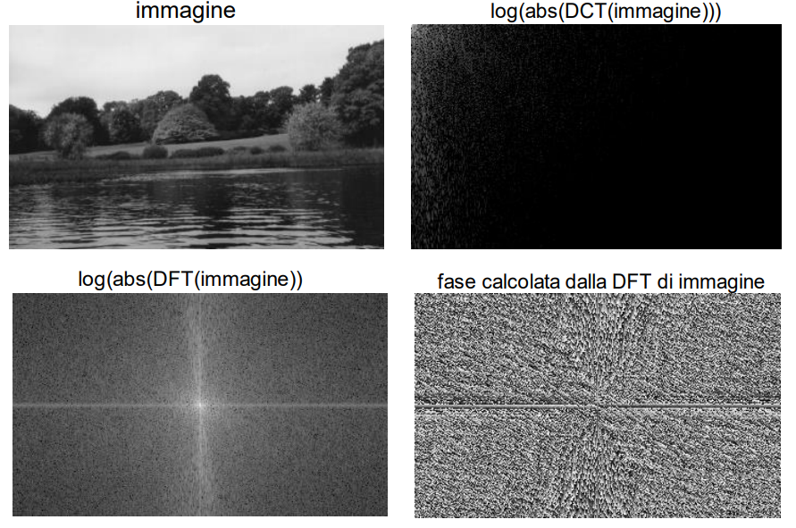

Notiamo che la DCT, a differenza della DFT, ha molti valori nulli, poiché scorrela meglio l'informazione e possiamo comprimerla maggiormente.
**NOTA**: il logaritmo iniziale serve ad avere una visualizzazione relativa sui 256 livelli dei monitor.

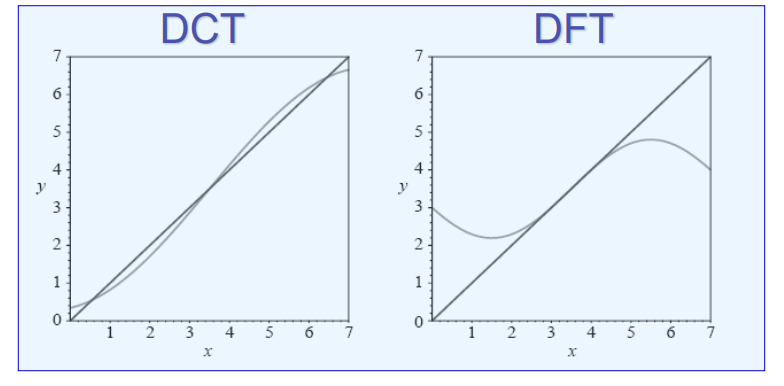Dunque, una maggiore quantità di informazione è presente nei primi coefficienti della DCT rispetto allo stesso numero di coefficienti della DFT. Nell'esempio possiamo vedere un'approssimazione di una rampa con i primi tre coefficienti delle trasformate.

## TRASFORMATA WAVELET

Abbiamo detto che la trasformata wavelet ci permette di fare un'**analisi multirisoluzione**, cosa che ci permette di analizzare oggetti grandi in dimensioni a risoluzioni minori e viceversa: se abbiamo oggetti di dimensioni diverse possiamo analizzare contemporaneamente più risoluzioni, anche perché alcune caratteristiche nascoste ad una data risoluzione possono essere individuabili ad un'altra. Questo tipo di algoritmi è utilizzato per il riconoscimento di oggetti.

**STRUTTURA PIRAMIDALE**
Un modo per analizzare più risoluzione è utilizzare una struttura piramidale che alla base ha l'immagine a risoluzione originale e man mano che sale scala la risoluzione, codificando però solo le differenze tra un livello e l'altro. Questo approccio non è però quello che utilizzeremo per la compressione, poiché ci fa portar dietro un segnale più grande di quello originale.

**CODIFICA PER SOTTOBANDE**
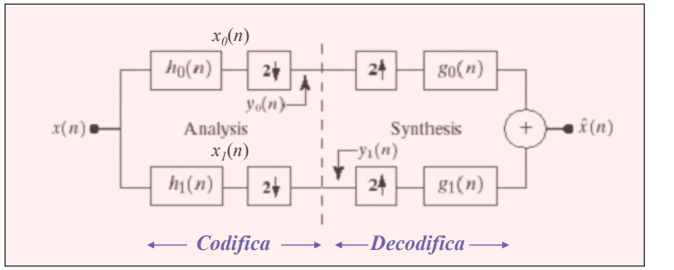Per prima cosa, nella trasformata wavelet, il segnale è **decomposto** in un insieme di **sottosegnali** *(sottobande)* a banda limitata, utilizzando dei filtri passabanda *complementari* *(ciò che passa in un filtro è bloccato negli altri)*. A questo punto ciascuna banda avrà un certo numero di campioni inferiore a quelli del segnale originale e quindi possiamo sottocampionare le sottobande senza introdurre aliasing *(così facendo la somma dei campioni di ogni sottobanda è uguale al numero di campioni del segnale originale)*.
Per ricostruire il segnale vengono utilizzati dei filtri inversi.

**E nel mondo bidimensionale?**
Nel mondo a due dimensioni possiamo implementare dei filtri che lavorino in una dimensione e che lavorino prima sulle righe e poi sulle colonne *(su una dimensione alla volta quindi)*.
In immagine possiamo vedere che viene applicato un passa-basso ed un passa-alto sulle righe e successivamente vengono nuovamente applicati passa-alto e passa-basso sulle colonne dei segnali risultanti. Il risultato sono 4 immagini, ognuna delle quali è grande 1/4 dell'immagine originale.

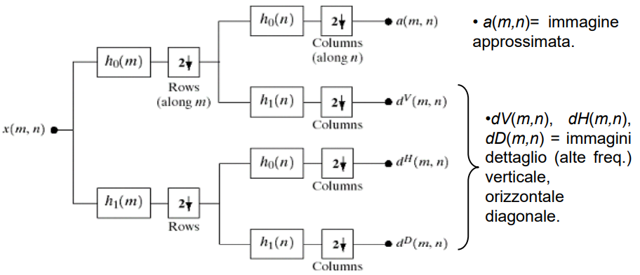

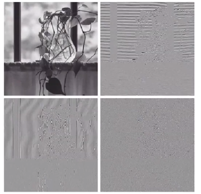Avendo un'immagine con un istogramma *piatto*, con la trasformata wavelet otterremo un'immagine con un'istogramma ugualmente *piatto* ma che usa un quarto dei bit e tre immagini di alte frequenze che invece avranno degli istogrammi più piccati e quindi su cui sarà molto vantaggioso applicare delle tecniche di riduzione di ridondanza.

Altre parti ancora delle immagini ad alta frequenza potrebbero avere bassi contributi, quindi possono essere direttamente eliminate.

**DECOMPOSIZIONE MULTIRISOLUZIONE**
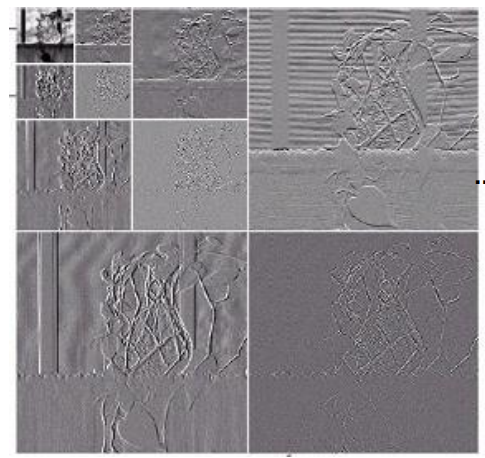Possiamo decomporre nuovamente l'immagine approssimata più volte, ricavando ad ogni livello una nuova immagine approssimata. In questo modo otteniamo le basse frequenze in alto a sinistra e le alte in basso a destra.

Notiamo inoltre che in questo modo ci portiamo dietro anche delle informazioni spaziali sull'immagine, oltre alle informazioni sulla frequenza.

Notiamo anche che nonostante le iterazioni fatte, il numero di pixel necessari per la trasformata sono uguali al numero di pixel che richiede l'immagine originale.

Ovviamente possiamo ridurre la ridondanza di codifica su ogni livello delle immagini ad alta frequenza *(o eliminare contributi nulli)* e fornire così una buona compressione.

**FUNZIONE DI SCALA**
Nell'analisi multirisoluzione, il filtro passa-basso prende il nome di ***funzione di scala***, mentre il filtro passa-alto è chiamato ***wavelet*** e viene usato per descrivere la differenza in informazione fra due approssimazioni adiacenti. 

**APPLICAZIONI**
Ovviamente, se volessimo ad esempio ottenere solo le variazioni verticali di un'immagine, potremmo annullare i contributi delle alte frequenze orizzontali nella trasformata wavelet e ricostruire l'immagine, oppure potremmo ricostruire solo le alte frequenze andando ad annullare l'immagine approssimata.
La trasformata wavelet inoltre può essere usata anche per fare **denoising** applicando una soglia alle alte frequenze *(ricordiamo che dopo la prima iterazione le frequenze in basso a destra di ogni livello sono alte relativamente, ogni livello divide la banda delle frequenze a metà)*.

**PACCHETTI WAVELET**
In alcune applicazioni può essere utile creare dei **pacchetti** wavelet, ovvero decomporre i vari coefficienti a loro volta per creare delle parti di contributi più precise ed eliminare quelle che hanno poco contenuto informativo. Questo tipo di operazione viene usata per le impronte digitali. 

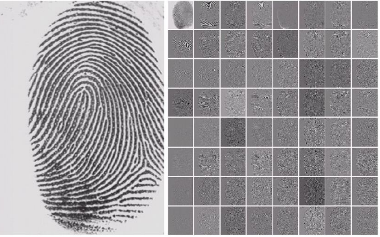

**HEISEMBERG**
Il **principio di indeterminazione** di Heisemberg dice che non si può conoscere con certezza contemporaneamente il valore di due variabili che descrivono un certo fenomeno. Nel caso degli elettroni le due variabili sono la quantità di moto $\Delta v$ ed il tempo $\Delta t$: se conosco esattamente il valore di uno dei due non posso avere informazioni sull'altra. Dobbiamo quindi accettare una certa incertezza $K \leq \Delta t * \Delta v$.

Allo stesso modo, in un segnale originale abbiamo informazioni certe sul tempo *(o spazio)*, ma non sappiamo nulla delle frequenze. Nella trasformata di Fourier abbiamo informazioni sulle frequenze, ma non sul tempo. Nella trasformata wavelet abbiamo informazioni su entrambe accettando però un'incertezza.

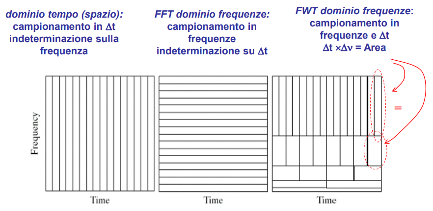
